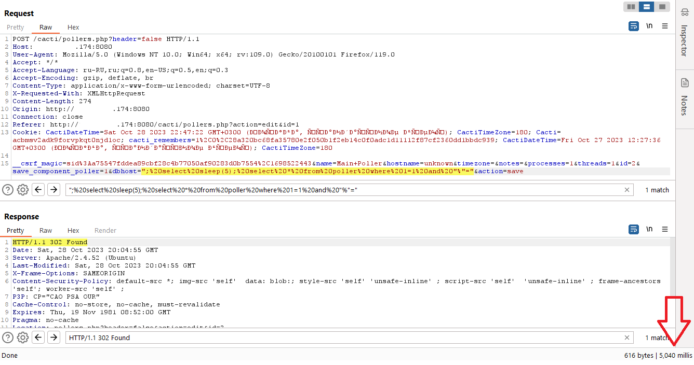

# Cacti SQL注入漏洞分析（CVE-2023-51448）

> **来源**: https://forum.butian.net/share/2845  
> **文章ID**: 2845

---

前言
--

Cacti提供了一个操作监控和故障管理框架。在1.2.25及更早版本中，可以通过'pollers.php'脚本执行任意SQL代码。授权用户可能能够执行任意SQL代码。易受攻击的组件是'pollers.php'。漏洞的影响-任意SQL代码执行。截至发布时，补丁似乎不存在。

环境搭建
----

在include下config.php中配置好数据库连接信息


使用小皮面板创建数据库


数据库连接软件连接，导入根目录下cati.sql文件


访问到就ok


漏洞复现
----



漏洞分析
----

根据漏洞简介，最终在pollers.php文件第427行发现可疑点，很明显的sql拼接


寻找一下`poller_host_duplicate`方法的调用处，在该文件中只有一处位于`form_save`方法的321行调用到


继续寻找发现在action参数为save时，`form_save`方法会被调用到


现在的调用链就很清楚了

```php
action="save"-->from_save()-->poller_host_duplicate()-->sql注入
```

可以看到`$host`变量的值由 `form_save`方法`$save['dbhost']`传递，通过`form_input_validate(get_nfilter_request_var('dbhost'),   'dbhost',   '', true, 3)`来获取


在`get_nfilter_request_var`方法用来获取请求中`dbhost`变量的值


在`form_input_validate`方法中也没有对sql注入的防范，以至于`$save['dbhost']`就是用户输入的值


总结
--

关键的两个参数`dbhost`和`action`，`dbhost`参数是注入点，`action`的值需要为`save`
