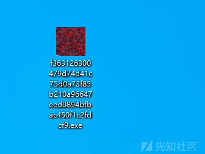
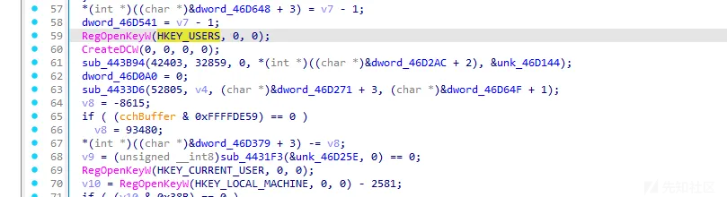
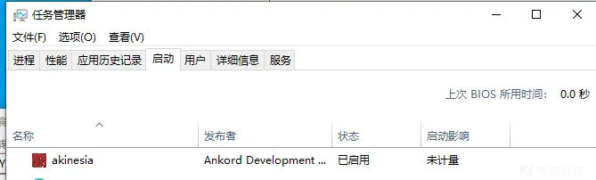
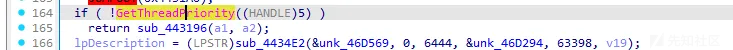
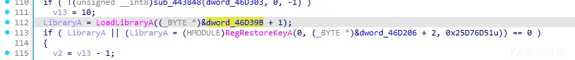
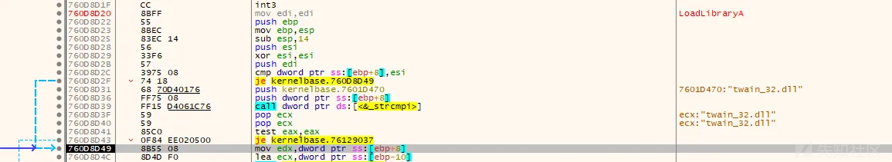
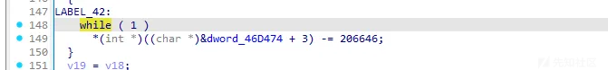
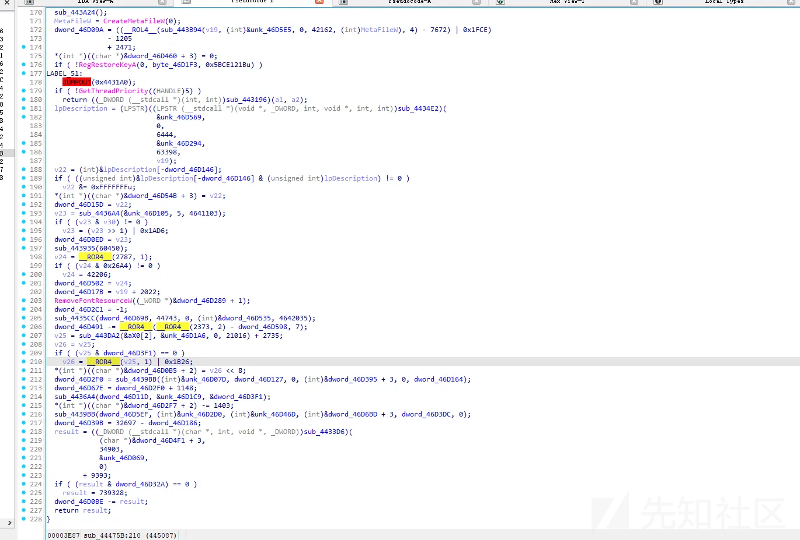
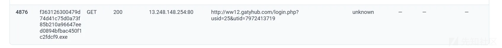
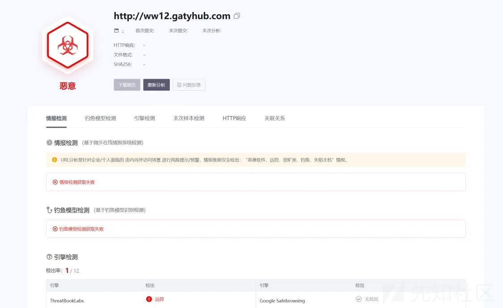

# 一次红队恶意程序分析溯源-先知社区

> **来源**: https://xz.aliyun.com/news/16000  
> **文章ID**: 16000

---

此恶意程序图标伪装成二维码，让受害者以为这是图片，从而双击打开

  
程序修改了注册表， 用于隐藏和持久化，`RegOpenKeyW` 多次被调用，目标注册表键包括 `HKEY_USERS`、`HKEY_CURRENT_USER` 和 `HKEY_LOCAL_MACHINE`

  
通过动态调试，修改的注册表为

```
HKEY_LOCAL_MACHINE\SOFTWARE\Microsoft\Windows NT\CurrentVersion\Winlogon\Userinit
HKEY_CURRENT_USER\SOFTWARE\Microsoft\Windows\CurrentVersion\Run
```

注册表项Userinit是 Windows 系统登录流程的关键部分，用于指定登录后执行的程序 ，另一个注册表也就是添加到启动项

  
调整自身优先级，动态调试环境下线程优先级可能会被修改，线程优先级过高可能会触发退出逻辑，干扰调试

  
白+黑，加载了动态库

  
加载了非系统路径中的 twain\_32.dll，DLL 劫持攻击

  
反调试，无限循环



代码大量操作通过位操作、移位、减法等方式，为了避免静态分析直接理解数据逻辑



网络流量：

  
在线网站分析不出来时可以使用wireshark查看网络流量



```
文件hash：ef8e448d10ad0bd7e148f0115a192aa8
远控网站：http://ww12.gatyhub.com
ip：13.248.148.254
```
