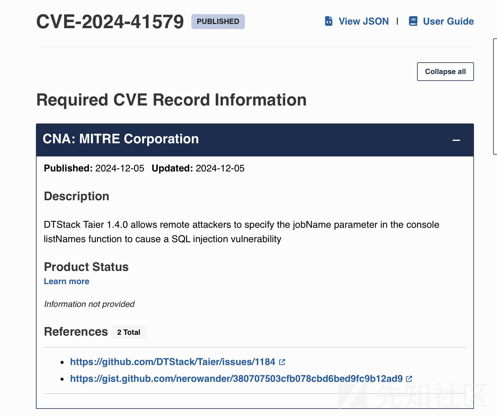
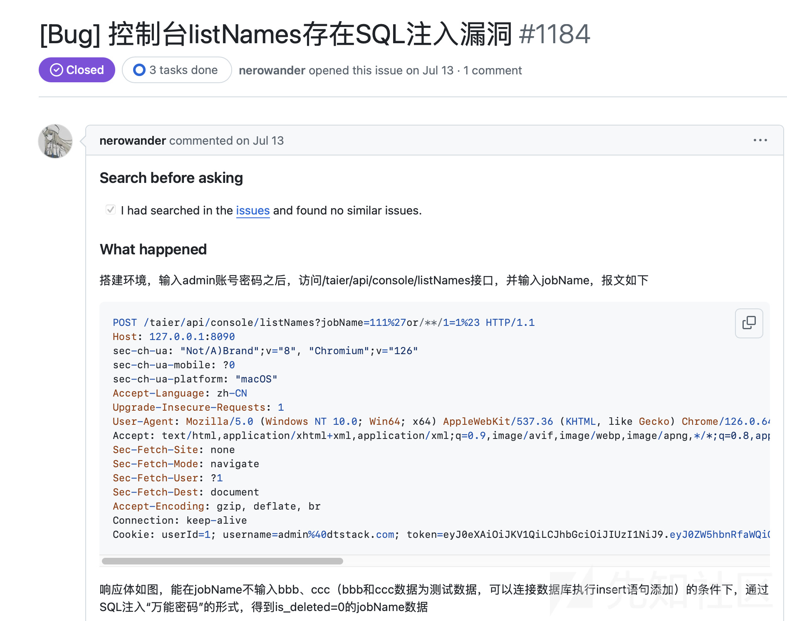
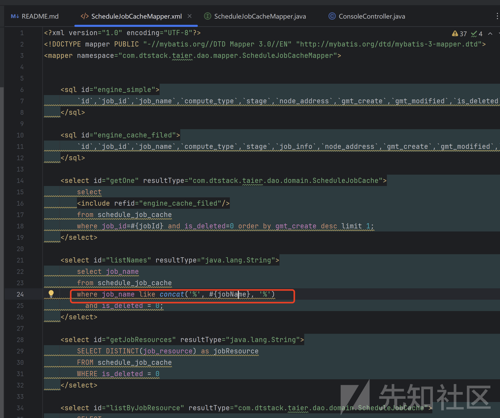
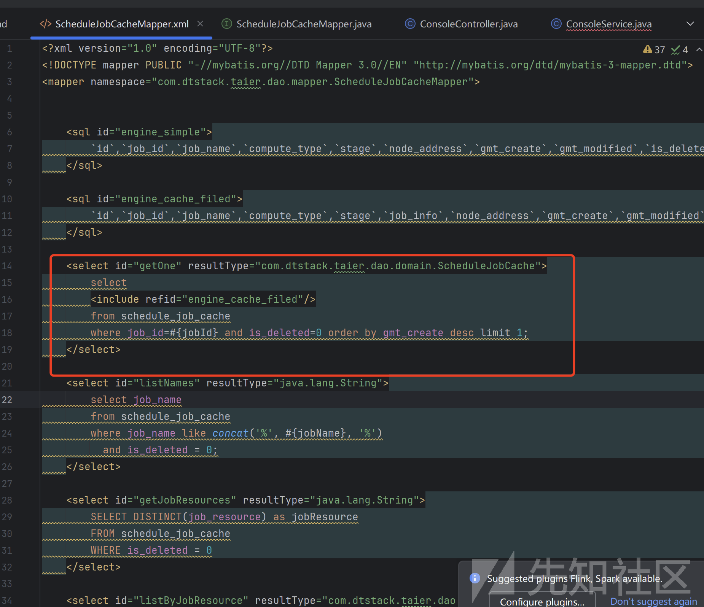
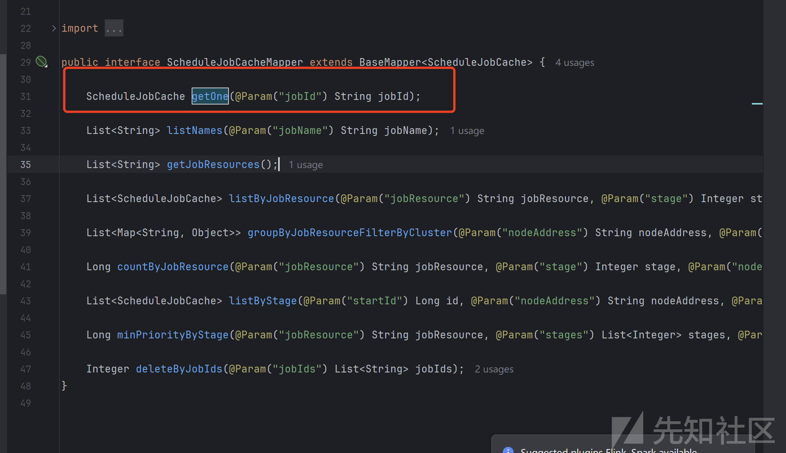
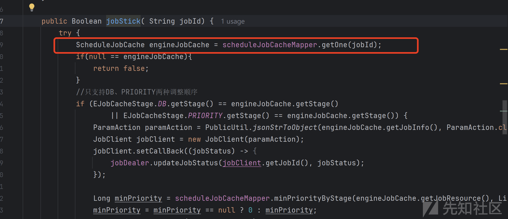
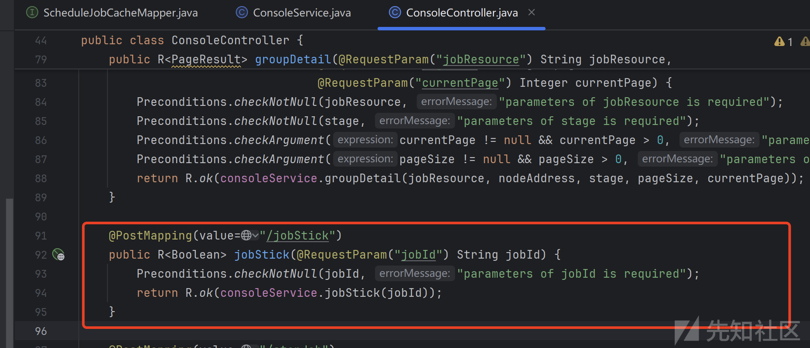

# DTStack Taier 1.4.0 listNames sql注入分析(CVE-2024-41579)-先知社区

> **来源**: https://xz.aliyun.com/news/16005  
> **文章ID**: 16005

---

# 通告

# 漏洞分析

根据参考文献，很幸运发现了payload

通过payload可以知道漏洞触发接口是`listNames`触发参数是`jobName`

在项目的**Model**层和**xml文件**查询`jobName`

在Java中sql拼接大致分为两种`$`和`#`

$：预编译拼接sql语句

# ：直接拼接sql语句

项目判断是**Spring**框架，寻找接口到**Controller**层

根据图上所示，**Controlle**层直接**post**获取`jobName`请求参数

调用连`ConsoleController.listNames->ConsoleService.listNames->ScheduleJobCacheMapper->listNames`

# 东施效颦-漏洞挖掘

通过上述分析，寻找一个新的注入点

ScheduleJobCacheMapper.xml发现getOne接口使用了`#`号作为占位符

逆向追踪对应的**Model**层

继续追踪发现`jobId`是通过**Controller**传递的

继续分析**Controller**代码，发现`jobId`通过请求直接获取的

那么挖掘的sql注入：

请求方式：POST请求

请求接口：/taier/api/console/jobStick

注入参数：jobId

在分析漏洞的过程中，模仿大佬的行为，发现了一个新的sql注入点^ \_ ^。
