# 一次Telegram窃取程序的深入解析：从技术细节到定位攻击者账户的完整流程-先知社区

> **来源**: https://xz.aliyun.com/news/16007  
> **文章ID**: 16007

---

  
32位程序，并且是一个.net文件

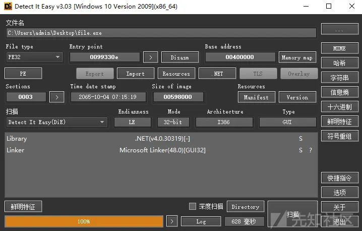  
用dnspy分析，直接定位到主函数

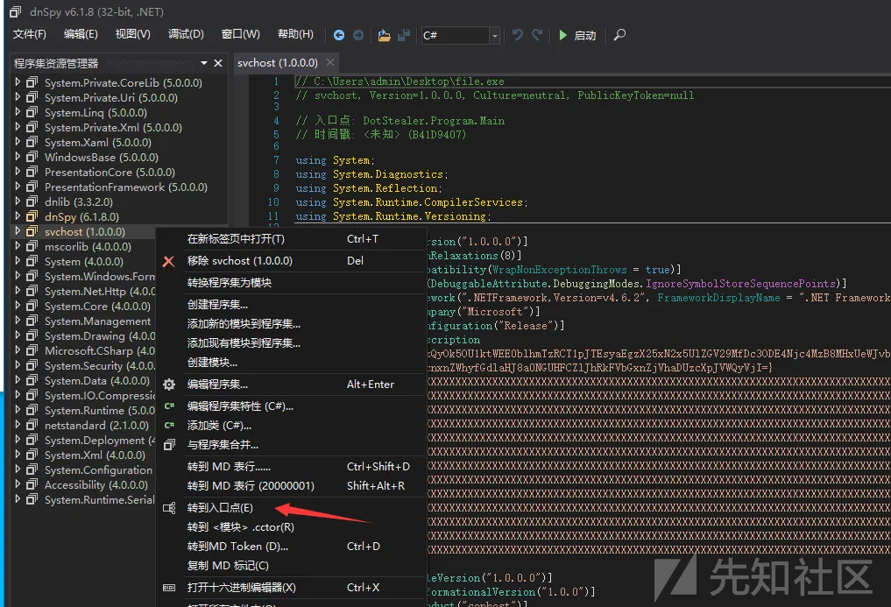  
恶意软件从程序集的 AssemblyDescription 属性中提取配置信息，进行base64解码，关键的 Telegram Token 和 Chat ID进行了rot13加密

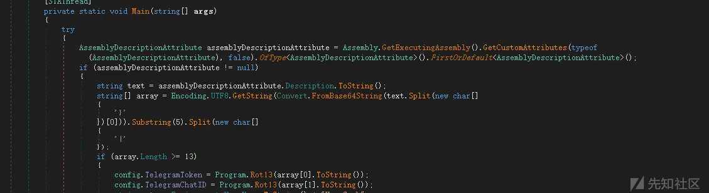

调用 persistence.CheckCopy()，确保恶意程序被复制到目标路径，防止被删除


  
在注册表中创建键值，并在发现相同键值存在时停止运行，确保只有一个实例运行

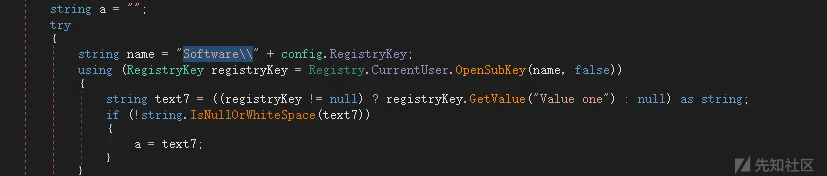  
检测是否在虚拟机、沙箱等分析环境中运行。如果检测到分析环境，则退出程序

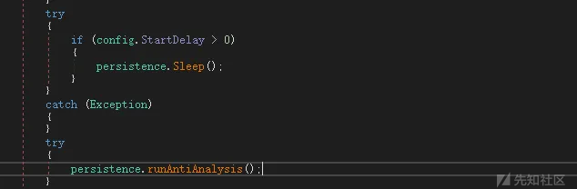  
窃取浏览器的敏感数据，包括保存的密码、cookies 和自动填充信息

  
窃取被害者主机上的telegram数据，复制数据并压缩为 ZIP 文件，通过 Telegram API 发送到攻击者的服务器

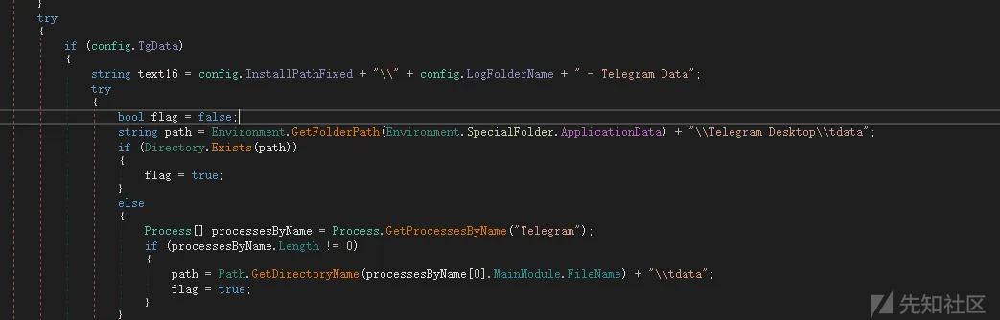

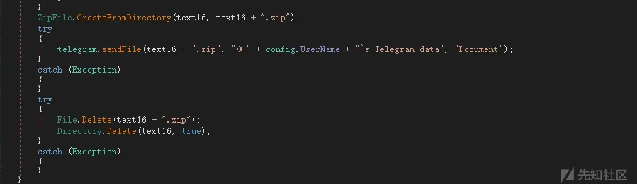  
窃取被害者主机上的Exodus 钱包数据，复制数据并压缩为 ZIP 文件，通过 Telegram API 发送到攻击者的服务器

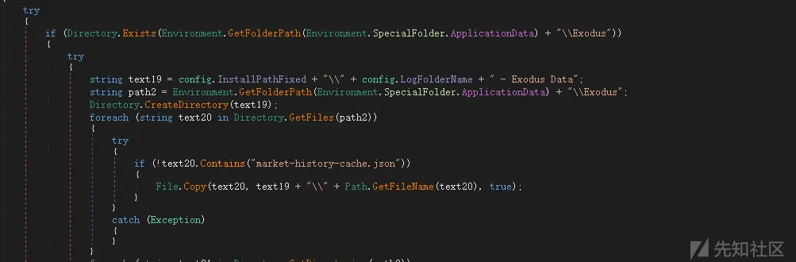

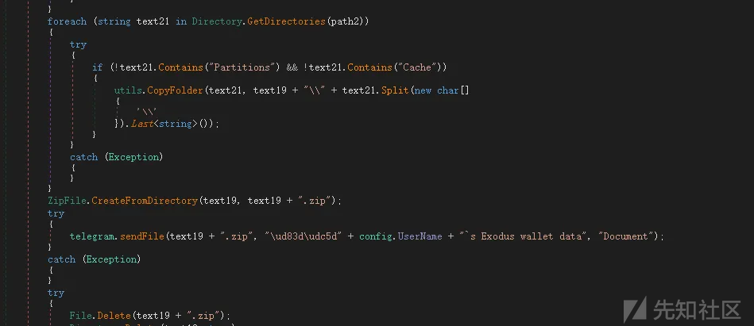

窃取被害者主机上的Metamask数据，复制数据并压缩为 ZIP 文件，通过 Telegram API 发送到攻击者的服务器

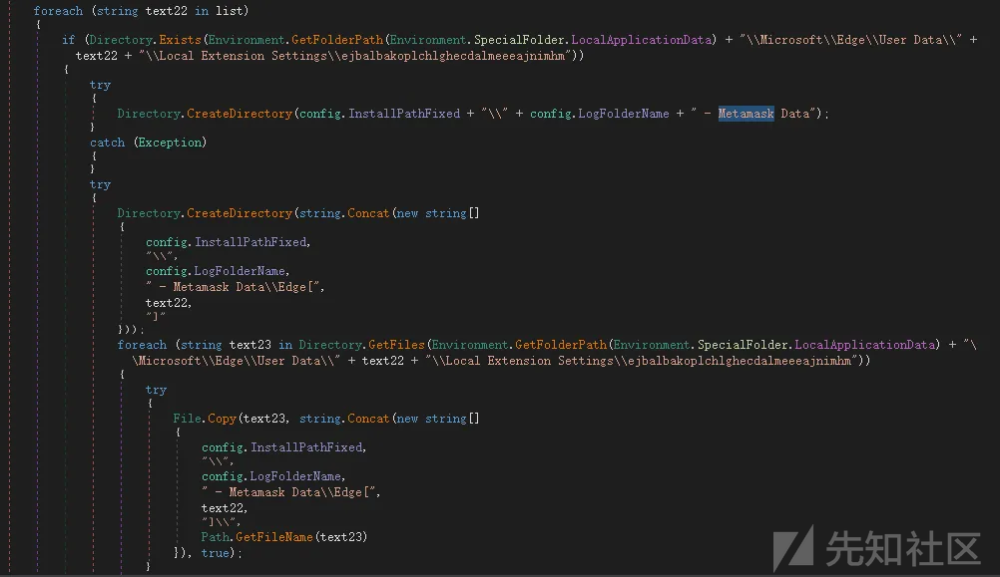  
获取被害者主机上的系统和硬件信息，包括CPU、GPU、RAM以及系统版本，然后保存到Log\ComputerInfo.txt中

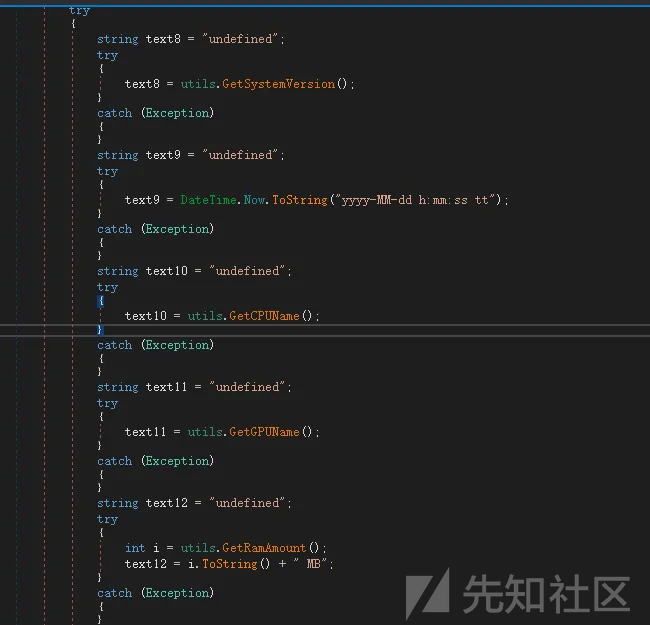

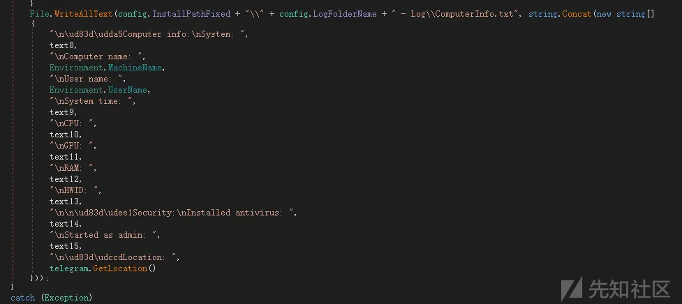  
调用 utils 模块的 desktopScreenshot() 函数截取受害者的桌面截图，最后将所有窃取的数据压缩为 ZIP 文件，通过 Telegram Bot API 上传到攻击者的 Telegram 账户

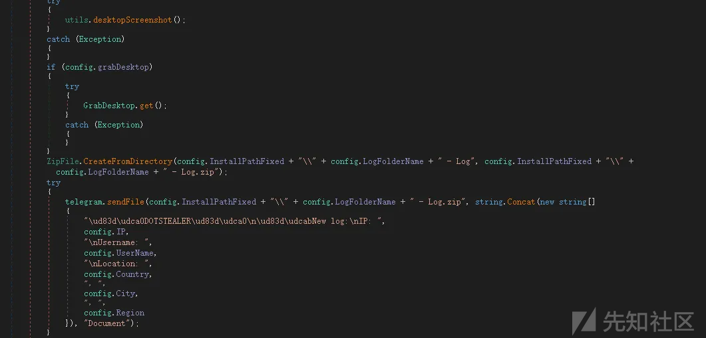

发送文件后会删除痕迹，包括压缩的zip文件和恶意程序自己

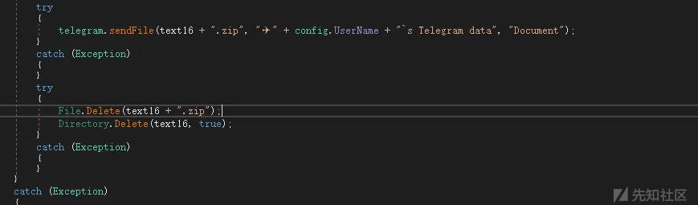

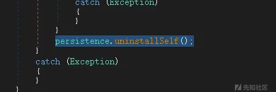

# 定位攻击者github账户

在config数据里找到了攻击者的github主页

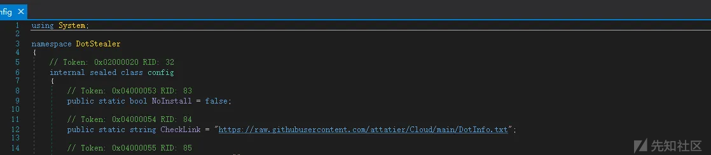

```
https://github.com/attatier
```

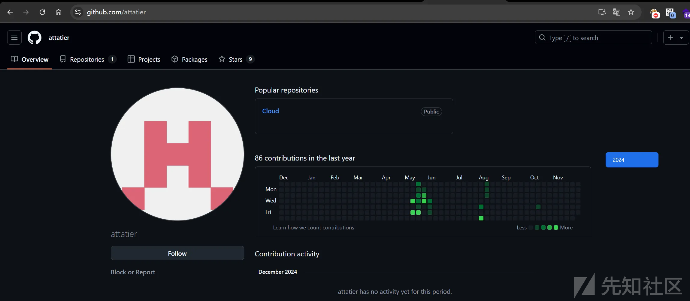  
查看攻击者创建的项目，在历史记录里可以找到恶意程序的传播方式

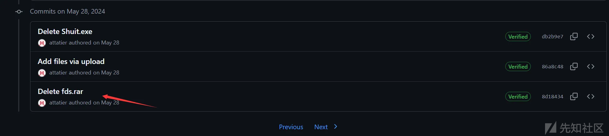  
是一个快捷文件，直接用lnkparse分析

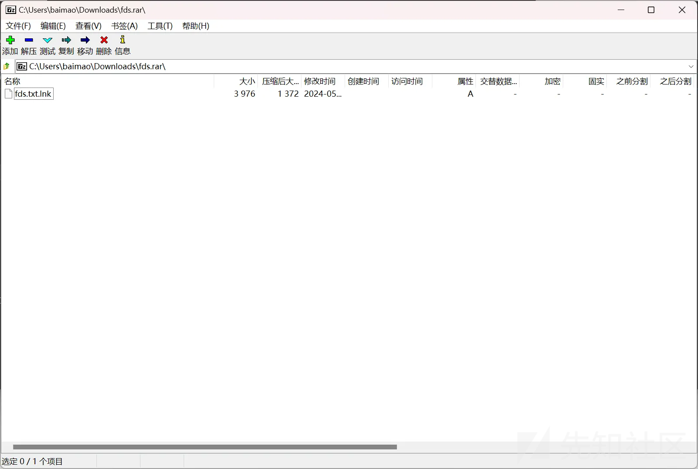  
快捷文件直接调用powershell远程获取恶意软件，在被害者主机上运行

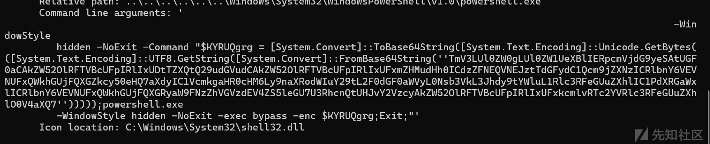

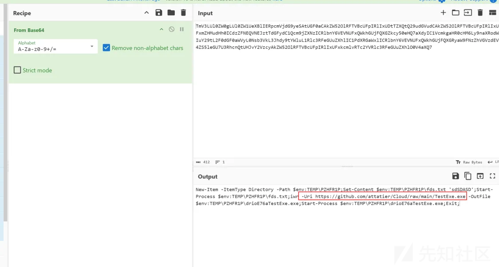  
然后远程获取正常pdf文件，并在被害者执行程序后自动打开，伪装自己

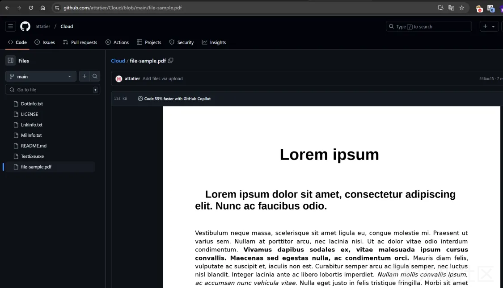

# 定位攻击者telegram账户

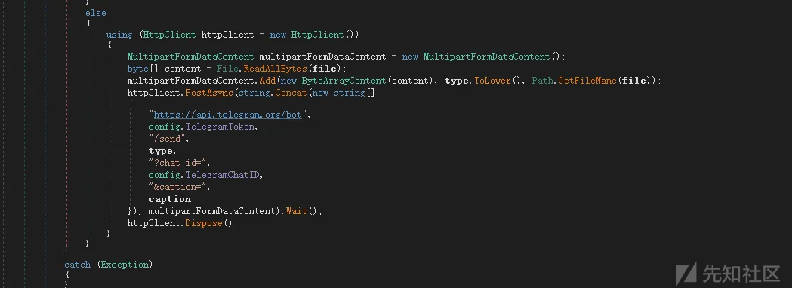

截取流量

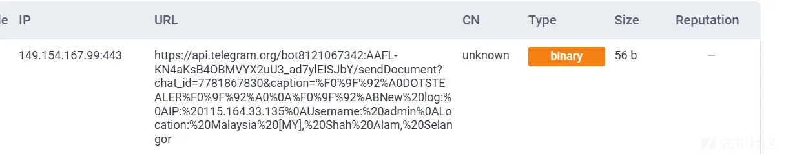

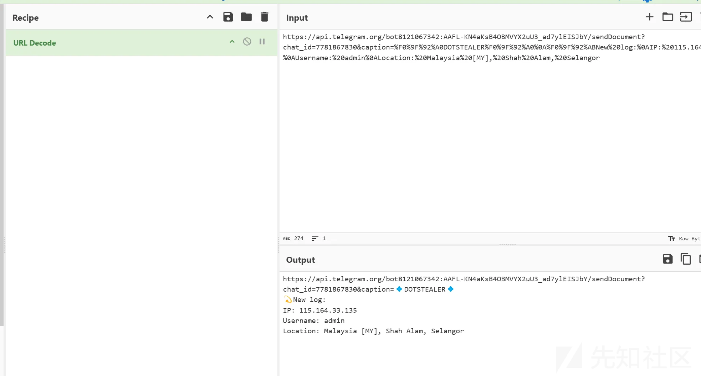  
telegram账户：

```
7781867830
```

生命周期：

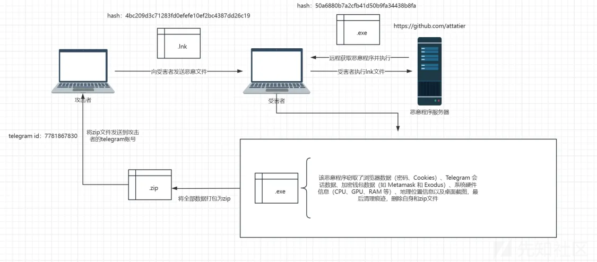  
信息：

```
hash:
50a6880b7a2cfb41d50b9fa34438b8fa
4bc209d3c71283fd0efefe10ef2bc4387dd26c19

攻击者账户：
https://github.com/attatier
telegram id：7781867830
```
