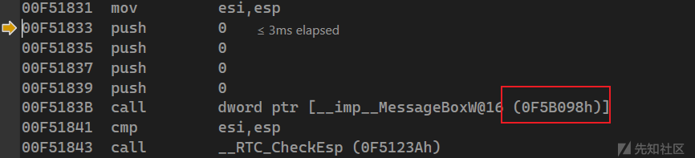
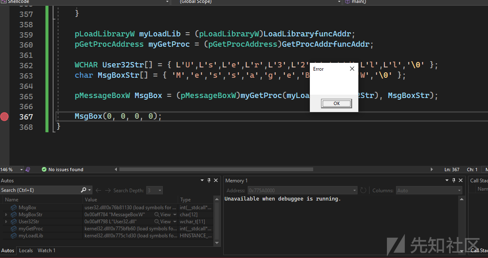
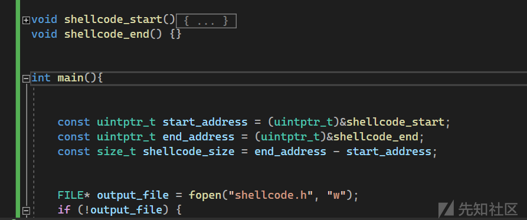
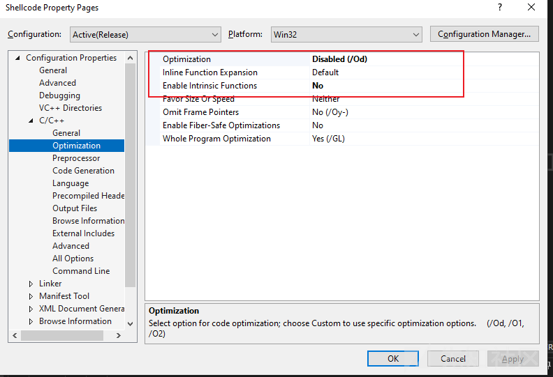
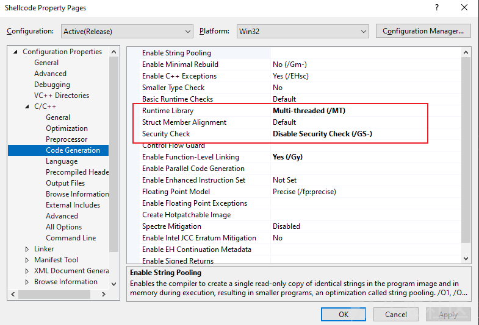
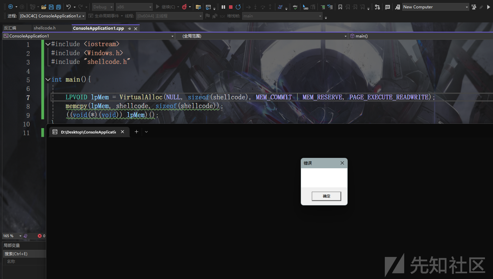

# 免杀基础-shellcode开发-先知社区

> **来源**: https://xz.aliyun.com/news/16016  
> **文章ID**: 16016

---

# 什么是shellcode

一段位置无关的代码(不依赖外部环境)

也就是遵循如下规则

1. 不能使用全局变量
2. 不能使用常量字符串
3. 不能直接调用windowsAPI

# 如何实现一个通用的shellcode

我们先来看这么一段代码

```
#include <Windows.h>

int main(){
    MessageBox(0, 0, 0, 0);
}

```

转到反汇编 由于ALSR的存在 每次MessageBox的地址是不一样的 所以直接硬编码是不行的



那么动态获取函数地址呢? 是不是可以解决这个问题?

```
typedef int (WINAPI* pMessageBoxW)(
    _In_opt_ HWND hWnd,
    _In_opt_ LPCWSTR lpText,
    _In_opt_ LPCWSTR lpCaption,
    _In_ UINT uType);

int main(){

    HMODULE hUser32Module = LoadLibrary(L"User32.dll");
    pMessageBoxW MsgBox = (pMessageBoxW)GetProcAddress(hUser32Module, "MessageBoxW");

    MsgBox(0, 0, 0, 0);
}

```

并不行 因为`LoadLibrary` `GetProcAddress` 是Kernel32.dll中的导出函数 也不能直接使用

那么我们可以考虑获取`Kernel32.dll`的基址 然后解析导出表来拿到对应函数的地址

## 获取Kernel32.dll基址

获取PEB后 遍历`_PEB_LDR_DATA` 中三个链表任意一个 链表是`LDR_DATA_TABLE_ENTRY`结构 通过对比`BaseDllName` 确定当前获取的模块

先获取PEB

```
#ifdef _WIN64
    PPEB peb = (PPEB)__readgsqword(0x60);
#endif
#ifdef _X86_
    PPEB peb = (PPEB)__readfsdword(0x30);
#endif

```

获取Kernel32.dll基址

```
PPEB_LDR_DATA pLdr = peb->LoaderData;
    PLIST_ENTRY moduleList = &pLdr->InLoadOrderModuleList;
    PLIST_ENTRY current = moduleList->Flink;

    WCHAR target[] = { L'K', L'e', L'r', L'n', L'e', L'l', L'3', L'2', L'.', L'd', L'l', L'l', L'\0' };

    PVOID dllBase = NULL;

    while (current!=moduleList){
        PLDR_DATA_TABLE_ENTRY entry = (PLDR_DATA_TABLE_ENTRY)current;
        if (_wcsnicmp(entry->BaseDllName.Buffer, target, wcslen(target)) == 0) {
            dllBase = entry->DllBase;
            break;
        }
        current = current->Flink;
    }

```

这样遍历是有问题的 不要用`_wcsnicmp` 不然到时候shellcode用不了 自己实现逻辑

字符串相关的这种函数都不要用

```
PPEB_LDR_DATA pLdr = peb->LoaderData;
    PLIST_ENTRY moduleList = &pLdr->InLoadOrderModuleList;
    PLIST_ENTRY current = moduleList->Flink;

    WCHAR target[] = { L'K', L'e', L'r', L'n', L'e', L'l', L'3', L'2', L'.', L'd', L'l', L'l', L'\0' };

    PVOID dllBase = NULL;


while (current != moduleList) {
        PLDR_DATA_TABLE_ENTRY entry = (PLDR_DATA_TABLE_ENTRY)current;
        WCHAR* buffer = entry->BaseDllName.Buffer;
        WCHAR* targetPtr = target;
        size_t i = 0;

        while (targetPtr[i] != L'\0') {
            ++i;
        }
        size_t targetLength = i;

        i = 0;
        while (i < targetLength) {
            WCHAR c1 = buffer[i];
            WCHAR c2 = target[i];

            if (c1 >= L'A' && c1 <= L'Z') c1 += 32;
            if (c2 >= L'A' && c2 <= L'Z') c2 += 32;
            if (c1 != c2) break;
            if (c1 == L'\0') break; 
            ++i;
        }
        if (i == targetLength) {
            dllBase = entry->DllBase;
            break;
        }

        current = current->Flink;
    }

```

## 解析导出表

通过解析pe结构

拿到`Loadlibrary`和`GetProcAddress`的地址

```
PIMAGE_DOS_HEADER pDosHeader = (PIMAGE_DOS_HEADER)dllBase;
    PIMAGE_NT_HEADERS pNtHeader = (PIMAGE_NT_HEADERS)((DWORD_PTR)dllBase + pDosHeader->e_lfanew);

    PIMAGE_DATA_DIRECTORY pDataDir = (PIMAGE_DATA_DIRECTORY)&pNtHeader->OptionalHeader.DataDirectory[IMAGE_DIRECTORY_ENTRY_EXPORT];
    PIMAGE_EXPORT_DIRECTORY exportTable = (PIMAGE_EXPORT_DIRECTORY)(pDataDir->VirtualAddress + (DWORD_PTR)dllBase);

    char str1[] = { 'L','o','a','d','L','i','b','r','a','r','y','W','\0' };
    char str2[] = { 'G','e','t','P','r','o','c','A','d','d','r','e','s','s','\0' };

    FARPROC LoadLibraryfuncAddr = NULL;
    FARPROC GetProcAddrfuncAddr = NULL;

    PDWORD NameArray = (PDWORD)((DWORD64)dllBase + exportTable->AddressOfNames);
    PDWORD AddressArray = (PDWORD)((DWORD64)dllBase + exportTable->AddressOfFunctions);
    PWORD  OrdinalArray = (PWORD)((DWORD64)dllBase + exportTable->AddressOfNameOrdinals);
    for (SIZE_T i = 0; i < exportTable->NumberOfNames; i++) {
        LPCSTR currentName = (LPCSTR)((DWORD64)dllBase + NameArray[i]);
        if (strcmp(str1, currentName) == 0) {
            LoadLibraryfuncAddr = (FARPROC)((DWORD64)dllBase + AddressArray[OrdinalArray[i]]);
            continue;
        }
        else if (strcmp(str2, currentName) == 0) {
            GetProcAddrfuncAddr = (FARPROC)((DWORD64)dllBase + AddressArray[OrdinalArray[i]]);
            continue;
        }
        if (GetProcAddrfuncAddr && LoadLibraryfuncAddr) {
            break;
        }


    }

    pLoadLibraryW myLoadLib = (pLoadLibraryW)LoadLibraryfuncAddr;
    pGetProcAddress myGetProc = (pGetProcAddress)GetProcAddrfuncAddr;

    WCHAR User32Str[] = { L'U',L's',L'e',L'r',L'3',L'2',L'.',L'd',L'l',L'l','\0' };
    char MsgBoxStr[] = { 'M','e','s','s','a','g','e','B','o','x','W','\0' };

    pMessageBoxW MsgBox = (pMessageBoxW)myGetProc(myLoadLib(User32Str), MsgBoxStr);

    MsgBox(0, 0, 0, 0);

```

同样的 自实现字符串比较部分

```
for (SIZE_T i = 0; i < exportTable->NumberOfNames; i++) {
    LPCSTR currentName = (LPCSTR)((DWORD64)dllBase + NameArray[i]);

    size_t j = 0;
    bool match1 = true;
    while (str1[j] != '\0' && currentName[j] != '\0') {
        char c1 = str1[j];
        char c2 = currentName[j];
        if (c1 >= 'A' && c1 <= 'Z') c1 += 32;
        if (c2 >= 'A' && c2 <= 'Z') c2 += 32;

        if (c1 != c2) {
            match1 = false;
            break;
        }
        j++;
    }

    if (str1[j] != '\0' || currentName[j] != '\0') {
        match1 = false;
    }

    if (match1) {
        LoadLibraryfuncAddr = (FARPROC)((DWORD64)dllBase + AddressArray[OrdinalArray[i]]);
        continue;
    }

    bool match2 = true;
    j = 0;
    while (str2[j] != '\0' && currentName[j] != '\0') {
        char c1 = str2[j];
        char c2 = currentName[j];
        if (c1 >= 'A' && c1 <= 'Z') c1 += 32;
        if (c2 >= 'A' && c2 <= 'Z') c2 += 32;

        if (c1 != c2) {
            match2 = false;
            break;
        }
        j++;
    }

    if (str2[j] != '\0' || currentName[j] != '\0') {
        match2 = false;
    }

    if (match2) {
        GetProcAddrfuncAddr = (FARPROC)((DWORD64)dllBase + AddressArray[OrdinalArray[i]]);
        continue;
    }

    if (GetProcAddrfuncAddr && LoadLibraryfuncAddr) {
        break;
    }
}

```



## 输出shellcode

现在将刚刚的代码封装成函数 并在下面添加一个空函数定位

将shellcode写入到`shellcode.h` 中



```
const uintptr_t start_address = (uintptr_t)&shellcode_start;
    const uintptr_t end_address = (uintptr_t)&shellcode_end;
    const size_t shellcode_size = end_address - start_address;


    FILE* output_file = fopen("shellcode.h", "w");
    if (!output_file) {
        perror("Failed to open file");
        return 1;
    }


    fprintf(output_file, "unsigned char shellcode[] = {\n");
    for (size_t i = 0; i < shellcode_size; ++i) {
        unsigned char sig_code = ((unsigned char*)start_address)[i];
        fprintf(output_file, "0x%02X%s", sig_code, (i + 1 < shellcode_size) ? "," : "");
        if ((i + 1) % 16 == 0 || i + 1 == shellcode_size) {
            fprintf(output_file, "\n"); 
        }
    }

    fprintf(output_file, "};\n");
    fclose(output_file);
    return 0;

```

将vs用于检查堆栈 等额外添加的功能全部关了 禁用优化







## 完整代码

```
#include <iostream>
#include <Windows.h>
#include "shellcode.h"

typedef struct _UNICODE_STRING
{
    USHORT Length;
    USHORT MaximumLength;
    PWSTR  Buffer;
} UNICODE_STRING, * PUNICODE_STRING;
typedef struct _RTL_DRIVE_LETTER_CURDIR {
    USHORT                  Flags;
    USHORT                  Length;
    ULONG                   TimeStamp;
    UNICODE_STRING          DosPath;
} RTL_DRIVE_LETTER_CURDIR, * PRTL_DRIVE_LETTER_CURDIR;
typedef struct _RTL_USER_PROCESS_PARAMETERS {
    ULONG                   MaximumLength;
    ULONG                   Length;
    ULONG                   Flags;
    ULONG                   DebugFlags;
    PVOID                   ConsoleHandle;
    ULONG                   ConsoleFlags;
    HANDLE                  StdInputHandle;
    HANDLE                  StdOutputHandle;
    HANDLE                  StdErrorHandle;
    UNICODE_STRING          CurrentDirectoryPath;
    HANDLE                  CurrentDirectoryHandle;
    UNICODE_STRING          DllPath;
    UNICODE_STRING          ImagePathName;
    UNICODE_STRING          CommandLine;
    PVOID                   Environment;
    ULONG                   StartingPositionLeft;
    ULONG                   StartingPositionTop;
    ULONG                   Width;
    ULONG                   Height;
    ULONG                   CharWidth;
    ULONG                   CharHeight;
    ULONG                   ConsoleTextAttributes;
    ULONG                   WindowFlags;
    ULONG                   ShowWindowFlags;
    UNICODE_STRING          WindowTitle;
    UNICODE_STRING          DesktopName;
    UNICODE_STRING          ShellInfo;
    UNICODE_STRING          RuntimeData;
    RTL_DRIVE_LETTER_CURDIR DLCurrentDirectory[0x20];


} RTL_USER_PROCESS_PARAMETERS, * PRTL_USER_PROCESS_PARAMETERS;
typedef struct _PEB_LDR_DATA {
    ULONG                   Length;
    BOOLEAN                 Initialized;
    PVOID                   SsHandle;
    LIST_ENTRY              InLoadOrderModuleList;
    LIST_ENTRY              InMemoryOrderModuleList;
    LIST_ENTRY              InInitializationOrderModuleList;
} PEB_LDR_DATA, * PPEB_LDR_DATA;
typedef struct _PEB {
    BOOLEAN                 InheritedAddressSpace;
    BOOLEAN                 ReadImageFileExecOptions;
    BOOLEAN                 BeingDebugged;
    BOOLEAN                 Spare;
    HANDLE                  Mutant;
    PVOID                   ImageBaseAddress;
    PPEB_LDR_DATA           LoaderData;
    PRTL_USER_PROCESS_PARAMETERS ProcessParameters;
    PVOID                   SubSystemData;
    PVOID                   ProcessHeap;
    PVOID                   FastPebLock;
    PVOID         FastPebLockRoutine;
    PVOID         FastPebUnlockRoutine;
    ULONG                   EnvironmentUpdateCount;
    PVOID                  KernelCallbackTable;
    PVOID                   EventLogSection;
    PVOID                   EventLog;
    PVOID         FreeList;
    ULONG                   TlsExpansionCounter;
    PVOID                   TlsBitmap;
    ULONG                   TlsBitmapBits[0x2];
    PVOID                   ReadOnlySharedMemoryBase;
    PVOID                   ReadOnlySharedMemoryHeap;
    PVOID                  ReadOnlyStaticServerData;
    PVOID                   AnsiCodePageData;
    PVOID                   OemCodePageData;
    PVOID                   UnicodeCaseTableData;
    ULONG                   NumberOfProcessors;
    ULONG                   NtGlobalFlag;
    BYTE                    Spare2[0x4];
    LARGE_INTEGER           CriticalSectionTimeout;
    ULONG                   HeapSegmentReserve;
    ULONG                   HeapSegmentCommit;
    ULONG                   HeapDeCommitTotalFreeThreshold;
    ULONG                   HeapDeCommitFreeBlockThreshold;
    ULONG                   NumberOfHeaps;
    ULONG                   MaximumNumberOfHeaps;
    PVOID* ProcessHeaps;
    PVOID                   GdiSharedHandleTable;
    PVOID                   ProcessStarterHelper;
    PVOID                   GdiDCAttributeList;
    PVOID                   LoaderLock;
    ULONG                   OSMajorVersion;
    ULONG                   OSMinorVersion;
    ULONG                   OSBuildNumber;
    ULONG                   OSPlatformId;
    ULONG                   ImageSubSystem;
    ULONG                   ImageSubSystemMajorVersion;
    ULONG                   ImageSubSystemMinorVersion;
    ULONG                   GdiHandleBuffer[0x22];
    ULONG                   PostProcessInitRoutine;
    ULONG                   TlsExpansionBitmap;
    BYTE                    TlsExpansionBitmapBits[0x80];
    ULONG                   SessionId;

} PEB, * PPEB;

typedef BOOLEAN(NTAPI* PLDR_INIT_ROUTINE)(
    _In_ PVOID DllHandle,
    _In_ ULONG Reason,
    _In_opt_ PVOID Context
    );
typedef struct _ACTIVATION_CONTEXT* PACTIVATION_CONTEXT;
typedef struct _LDR_SERVICE_TAG_RECORD
{
    struct _LDR_SERVICE_TAG_RECORD* Next;
    ULONG ServiceTag;
} LDR_SERVICE_TAG_RECORD, * PLDR_SERVICE_TAG_RECORD;
typedef struct _LDRP_CSLIST
{
    PSINGLE_LIST_ENTRY Tail;
} LDRP_CSLIST, * PLDRP_CSLIST;
typedef enum _LDR_DDAG_STATE
{
    LdrModulesMerged = -5,
    LdrModulesInitError = -4,
    LdrModulesSnapError = -3,
    LdrModulesUnloaded = -2,
    LdrModulesUnloading = -1,
    LdrModulesPlaceHolder = 0,
    LdrModulesMapping = 1,
    LdrModulesMapped = 2,
    LdrModulesWaitingForDependencies = 3,
    LdrModulesSnapping = 4,
    LdrModulesSnapped = 5,
    LdrModulesCondensed = 6,
    LdrModulesReadyToInit = 7,
    LdrModulesInitializing = 8,
    LdrModulesReadyToRun = 9
} LDR_DDAG_STATE;
typedef struct _LDR_DDAG_NODE
{
    LIST_ENTRY Modules;
    PLDR_SERVICE_TAG_RECORD ServiceTagList;
    ULONG LoadCount;
    ULONG LoadWhileUnloadingCount;
    ULONG LowestLink;
    union
    {
        LDRP_CSLIST Dependencies;
        SINGLE_LIST_ENTRY RemovalLink;
    };
    LDRP_CSLIST IncomingDependencies;
    LDR_DDAG_STATE State;
    SINGLE_LIST_ENTRY CondenseLink;
    ULONG PreorderNumber;
} LDR_DDAG_NODE, * PLDR_DDAG_NODE;
typedef enum _LDR_DLL_LOAD_REASON
{
    LoadReasonStaticDependency,
    LoadReasonStaticForwarderDependency,
    LoadReasonDynamicForwarderDependency,
    LoadReasonDelayloadDependency,
    LoadReasonDynamicLoad,
    LoadReasonAsImageLoad,
    LoadReasonAsDataLoad,
    LoadReasonEnclavePrimary, // since REDSTONE3
    LoadReasonEnclaveDependency,
    LoadReasonPatchImage, // since WIN11
    LoadReasonUnknown = -1
} LDR_DLL_LOAD_REASON, * PLDR_DLL_LOAD_REASON;
typedef struct _LDRP_LOAD_CONTEXT* PLDRP_LOAD_CONTEXT;
typedef struct _RTL_BALANCED_NODE
{
    union
    {
        struct _RTL_BALANCED_NODE* Children[2];
        struct
        {
            struct _RTL_BALANCED_NODE* Left;
            struct _RTL_BALANCED_NODE* Right;
        };
    };
    union
    {
        UCHAR Red : 1;
        UCHAR Balance : 2;
        ULONG_PTR ParentValue;
    };
} RTL_BALANCED_NODE, * PRTL_BALANCED_NODE;
typedef enum _LDR_HOT_PATCH_STATE
{
    LdrHotPatchBaseImage,
    LdrHotPatchNotApplied,
    LdrHotPatchAppliedReverse,
    LdrHotPatchAppliedForward,
    LdrHotPatchFailedToPatch,
    LdrHotPatchStateMax,
} LDR_HOT_PATCH_STATE, * PLDR_HOT_PATCH_STATE;
typedef struct _LDR_DATA_TABLE_ENTRY
{
    LIST_ENTRY InLoadOrderLinks;
    LIST_ENTRY InMemoryOrderLinks;
    LIST_ENTRY InInitializationOrderLinks;
    PVOID DllBase;
    PLDR_INIT_ROUTINE EntryPoint;
    ULONG SizeOfImage;
    UNICODE_STRING FullDllName;
    UNICODE_STRING BaseDllName;
    union
    {
        UCHAR FlagGroup[4];
        ULONG Flags;
        struct
        {
            ULONG PackagedBinary : 1;
            ULONG MarkedForRemoval : 1;
            ULONG ImageDll : 1;
            ULONG LoadNotificationsSent : 1;
            ULONG TelemetryEntryProcessed : 1;
            ULONG ProcessStaticImport : 1;
            ULONG InLegacyLists : 1;
            ULONG InIndexes : 1;
            ULONG ShimDll : 1;
            ULONG InExceptionTable : 1;
            ULONG ReservedFlags1 : 2;
            ULONG LoadInProgress : 1;
            ULONG LoadConfigProcessed : 1;
            ULONG EntryProcessed : 1;
            ULONG ProtectDelayLoad : 1;
            ULONG ReservedFlags3 : 2;
            ULONG DontCallForThreads : 1;
            ULONG ProcessAttachCalled : 1;
            ULONG ProcessAttachFailed : 1;
            ULONG CorDeferredValidate : 1;
            ULONG CorImage : 1;
            ULONG DontRelocate : 1;
            ULONG CorILOnly : 1;
            ULONG ChpeImage : 1;
            ULONG ChpeEmulatorImage : 1;
            ULONG ReservedFlags5 : 1;
            ULONG Redirected : 1;
            ULONG ReservedFlags6 : 2;
            ULONG CompatDatabaseProcessed : 1;
        };
    };
    USHORT ObsoleteLoadCount;
    USHORT TlsIndex;
    LIST_ENTRY HashLinks;
    ULONG TimeDateStamp;
    PACTIVATION_CONTEXT EntryPointActivationContext;
    PVOID Lock; // RtlAcquireSRWLockExclusive
    PLDR_DDAG_NODE DdagNode;
    LIST_ENTRY NodeModuleLink;
    PLDRP_LOAD_CONTEXT LoadContext;
    PVOID ParentDllBase;
    PVOID SwitchBackContext;
    RTL_BALANCED_NODE BaseAddressIndexNode;
    RTL_BALANCED_NODE MappingInfoIndexNode;
    ULONG_PTR OriginalBase;
    LARGE_INTEGER LoadTime;
    ULONG BaseNameHashValue;
    LDR_DLL_LOAD_REASON LoadReason; // since WIN8
    ULONG ImplicitPathOptions;
    ULONG ReferenceCount; // since WIN10
    ULONG DependentLoadFlags;
    UCHAR SigningLevel; // since REDSTONE2
    ULONG CheckSum; // since 22H1
    PVOID ActivePatchImageBase;
    LDR_HOT_PATCH_STATE HotPatchState;
} LDR_DATA_TABLE_ENTRY, * PLDR_DATA_TABLE_ENTRY;
typedef HMODULE(WINAPI* pLoadLibraryW)(
    _In_ LPCWSTR lpLibFileName
    );

typedef FARPROC(WINAPI* pGetProcAddress)(
    _In_ HMODULE hModule,
    _In_ LPCSTR lpProcName
    );


typedef int (WINAPI* pMessageBoxW)(
    _In_opt_ HWND hWnd,
    _In_opt_ LPCWSTR lpText,
    _In_opt_ LPCWSTR lpCaption,
    _In_ UINT uType);


void shellcode_start() {
#ifdef _WIN64
    PPEB peb = (PPEB)__readgsqword(0x60);
#endif
#ifdef _X86_
    PPEB peb = (PPEB)__readfsdword(0x30);
#endif 

    PPEB_LDR_DATA pLdr = peb->LoaderData;
    PLIST_ENTRY moduleList = &pLdr->InLoadOrderModuleList;
    PLIST_ENTRY current = moduleList->Flink;

    WCHAR target[] = { L'K', L'e', L'r', L'n', L'e', L'l', L'3', L'2', L'.', L'd', L'l', L'l', L'\0' };

    PVOID dllBase = NULL;


    while (current != moduleList) {
        PLDR_DATA_TABLE_ENTRY entry = (PLDR_DATA_TABLE_ENTRY)current;
        WCHAR* buffer = entry->BaseDllName.Buffer;
        WCHAR* targetPtr = target;
        size_t i = 0;

        while (targetPtr[i] != L'\0') {
            ++i;
        }
        size_t targetLength = i;

        i = 0;
        while (i < targetLength) {
            WCHAR c1 = buffer[i];
            WCHAR c2 = target[i];

            if (c1 >= L'A' && c1 <= L'Z') c1 += 32;
            if (c2 >= L'A' && c2 <= L'Z') c2 += 32;
            if (c1 != c2) break;
            if (c1 == L'\0') break; 
            ++i;
        }
        if (i == targetLength) {
            dllBase = entry->DllBase;
            break;
        }

        current = current->Flink;
    }


    PIMAGE_DOS_HEADER pDosHeader = (PIMAGE_DOS_HEADER)dllBase;
    PIMAGE_NT_HEADERS pNtHeader = (PIMAGE_NT_HEADERS)((DWORD_PTR)dllBase + pDosHeader->e_lfanew);

    PIMAGE_DATA_DIRECTORY pDataDir = (PIMAGE_DATA_DIRECTORY)&pNtHeader->OptionalHeader.DataDirectory[IMAGE_DIRECTORY_ENTRY_EXPORT];
    PIMAGE_EXPORT_DIRECTORY exportTable = (PIMAGE_EXPORT_DIRECTORY)(pDataDir->VirtualAddress + (DWORD_PTR)dllBase);


    char str1[] = { 'L','o','a','d','L','i','b','r','a','r','y','W','\0' };
    char str2[] = { 'G','e','t','P','r','o','c','A','d','d','r','e','s','s','\0' };

    FARPROC LoadLibraryfuncAddr = NULL;
    FARPROC GetProcAddrfuncAddr = NULL;

    PDWORD NameArray = (PDWORD)((DWORD64)dllBase + exportTable->AddressOfNames);
    PDWORD AddressArray = (PDWORD)((DWORD64)dllBase + exportTable->AddressOfFunctions);
    PWORD  OrdinalArray = (PWORD)((DWORD64)dllBase + exportTable->AddressOfNameOrdinals);


    for (SIZE_T i = 0; i < exportTable->NumberOfNames; i++) {
        LPCSTR currentName = (LPCSTR)((DWORD64)dllBase + NameArray[i]);
        size_t j = 0;
        bool match1 = true;
        while (str1[j] != '\0' && currentName[j] != '\0') {
            char c1 = str1[j];
            char c2 = currentName[j];
            if (c1 >= 'A' && c1 <= 'Z') c1 += 32;
            if (c2 >= 'A' && c2 <= 'Z') c2 += 32;

            if (c1 != c2) {
                match1 = false;
                break;
            }
            j++;
        }

        if (str1[j] != '\0' || currentName[j] != '\0') {
            match1 = false;
        }

        if (match1) {
            LoadLibraryfuncAddr = (FARPROC)((DWORD64)dllBase + AddressArray[OrdinalArray[i]]);
            continue;
        }

        bool match2 = true;
        j = 0;
        while (str2[j] != '\0' && currentName[j] != '\0') {
            char c1 = str2[j];
            char c2 = currentName[j];
            if (c1 >= 'A' && c1 <= 'Z') c1 += 32;
            if (c2 >= 'A' && c2 <= 'Z') c2 += 32;

            if (c1 != c2) {
                match2 = false;
                break;
            }
            j++;
        }

        if (str2[j] != '\0' || currentName[j] != '\0') {
            match2 = false;
        }

        if (match2) {
            GetProcAddrfuncAddr = (FARPROC)((DWORD64)dllBase + AddressArray[OrdinalArray[i]]);
            continue;
        }

        if (GetProcAddrfuncAddr && LoadLibraryfuncAddr) {
            break;
        }
    }


    pLoadLibraryW myLoadLib = (pLoadLibraryW)LoadLibraryfuncAddr;
    pGetProcAddress myGetProc = (pGetProcAddress)GetProcAddrfuncAddr;


    WCHAR User32Str[] = { L'U',L's',L'e',L'r',L'3',L'2',L'.',L'd',L'l',L'l','\0' };
    char MsgBoxStr[] = { 'M','e','s','s','a','g','e','B','o','x','W','\0' };


    pMessageBoxW MsgBox = (pMessageBoxW)myGetProc(myLoadLib(User32Str), MsgBoxStr);

    MsgBox(0, 0, 0, 0);
}
void shellcode_end() {}


int main(){

    uintptr_t start_address = (uintptr_t)&shellcode_start;
    uintptr_t end_address = (uintptr_t)&shellcode_end;
    size_t shellcode_size = end_address - start_address;

    printf("0x%x",shellcode_size);

    FILE* output_file = fopen("shellcode.h", "w");
    if (!output_file) {
        perror("Failed to open file");
        return 1;
    }


    fprintf(output_file, "unsigned char shellcode[] = {\n");
    for (size_t i = 0; i < shellcode_size; ++i) {
        unsigned char sig_code = ((unsigned char*)start_address)[i];
        fprintf(output_file, "0x%02X%s", sig_code, (i + 1 < shellcode_size) ? "," : "");
        if ((i + 1) % 16 == 0 || i + 1 == shellcode_size) {
            fprintf(output_file, "\n");
        }
    }

    fprintf(output_file, "};\n");
    fclose(output_file);
    return 0;


    // LPVOID lpMem = VirtualAlloc(NULL, sizeof(shellcode), MEM_COMMIT | MEM_RESERVE, PAGE_EXECUTE_READWRITE);
    // memcpy(lpMem, shellcode, sizeof(shellcode));
    // ((void(*)(void)) lpMem)();

}

```

# 参考

<https://mp.weixin.qq.com/s/QFA8Aiyl_Zh2MKANpCQjMw>

<https://bbs.kanxue.com/thread-276757.htm>
