# 云函数实现代理绕过IP封锁-先知社区

> **来源**: https://xz.aliyun.com/news/16026  
> **文章ID**: 16026

---

## 云函数简介

云函数（Serverless Functions）是一种事件驱动的计算服务，允许开发者编写和部署代码，而无需管理底层服务器资源。通过云函数，开发者可以专注于业务逻辑的实现，不必关心基础设施的运维和扩展问题。它属于 **无服务器架构** 的一种形式，通常与云平台（如 AWS Lambda、阿里云函数计算等）紧密集成。

### 云函数的特点

1. **无服务器管理**：用户不需要管理或维护服务器。云平台自动处理函数的执行环境、资源分配、负载均衡和自动扩展。
2. **按需计费**：云函数的计费方式通常是基于实际执行的计算资源和时间，按调用次数和执行时长收费。这种按需计费模式帮助用户避免不必要的资源浪费，特别适合处理间歇性或低延迟的请求。
3. **事件驱动**：云函数通常会被某些事件触发，如 HTTP 请求、文件上传、数据库变更、消息队列等。开发者可以根据这些事件来编写代码逻辑。
4. **自动扩展**：云函数能够根据请求的数量自动扩展或缩减资源，以应对不同的负载需求。它能够在请求量增加时快速扩展，负载减轻时自动缩减。
5. **快速部署和迭代**：开发者可以快速将函数代码上传到云平台，立即生效。对于频繁变化的业务需求，云函数也提供了更灵活的迭代方式。

### 云函数的应用场景

* **API 后端**：构建和运行轻量级的 RESTful API 或 Web 服务。
* **文件处理**：文件上传、图像处理、视频转码等。
* **数据处理**：处理来自流媒体、日志、消息队列等来源的数据。
* **自动化任务**：定时任务、邮件通知、数据同步等自动化操作。
* **物联网 (IoT)**：处理设备上传的数据或控制指令。
* **事件驱动计算**：响应用户行为、监控事件、系统通知等。

## 部署服务端

* 选择腾讯云来演示：<https://console.cloud.tencent.com/scf/index>
* 新建函数

选择从头开始，事件函数，运行环境是 python3.6 其他的随便填

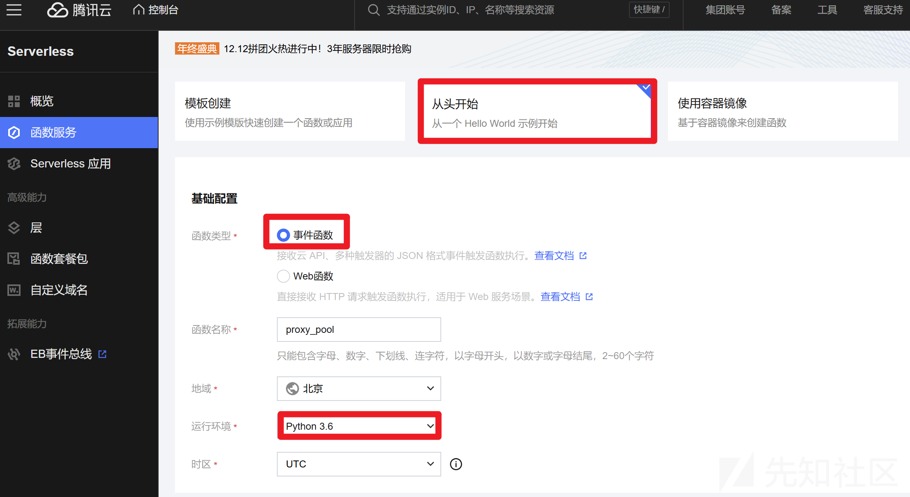

1. 配置函数代码

函数代码选择在线编辑，写入服务端代码

```
# -*- coding: utf8 -*-


import json
import pickle
from base64 import b64decode, b64encode

import requests

SCF_TOKEN = "TOKEN" #需要自定义随机值，用于鉴权

def authorization():
    return {
        "isBase64Encoded": False,
        "statusCode": 401,
        "headers": {},
        "body": "Please provide correct SCF-Token",
    }

def main_handler(event: dict, context: dict):
    try:
        token = event["headers"]["scf-token"]
    except KeyError:
        return authorization()

    if token != SCF_TOKEN:
        return authorization()

    data = event["body"]
    kwargs = json.loads(data)
    kwargs['data'] = b64decode(kwargs['data'])
    r = requests.request(**kwargs, verify=False, allow_redirects=False)

    serialized_resp = pickle.dumps(r)

    return {
        "isBase64Encoded": False,
        "statusCode": 200,
        "headers": {},
        "body": b64encode(serialized_resp).decode("utf-8"),
    }

```

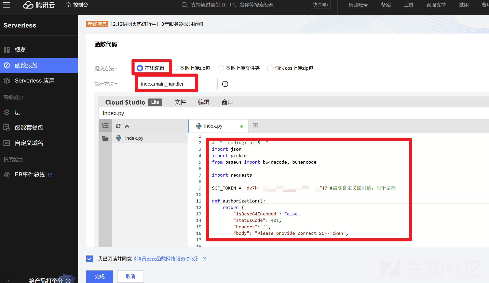

到此云函数服务端函数代码就部署完成了，接下来创建函数URL，替代触发器的作用，因为触发器中的API网关类型下线了，不过可以直接使用函数URL来调用对应的云函数

1. 创建函数URL

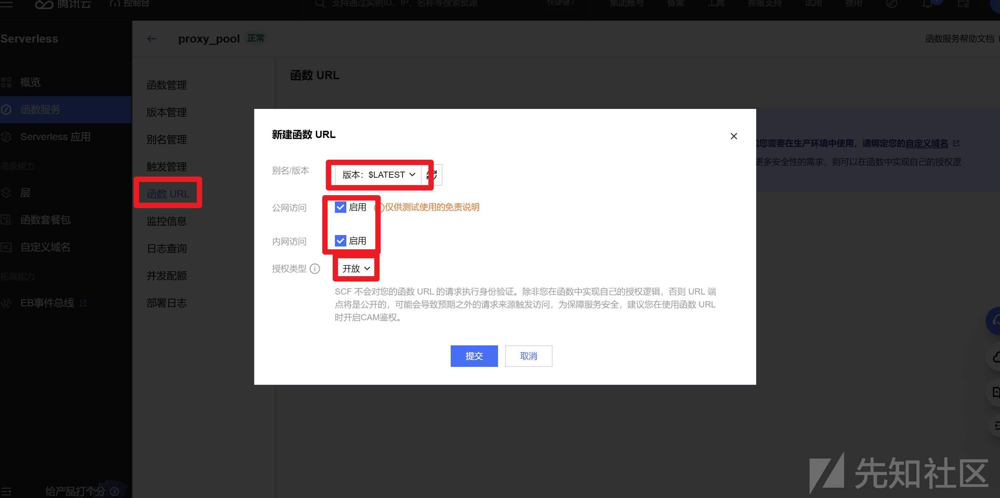

这样就能通过这个API调用我们部署的云函数了

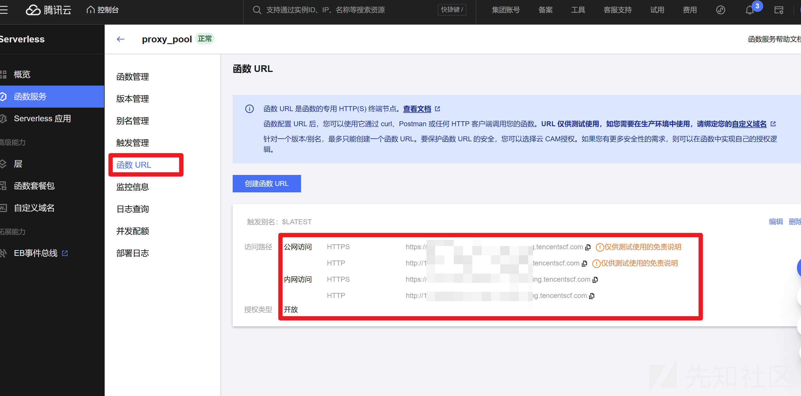

## 部署客户端

1. 本机windows端：本地代理使用 mitmproxy，可以直接pip安装

```
pip3 install mitmproxy

```

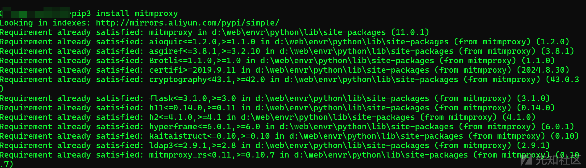

如果需要代理 HTTPS流量的话，需安装证书

1. 安装好了mitmproxy后，首次运行 mitmdump命令，证书就会自动生成在在 ~/.mitmproxy中，一般在C:\Users\xxx\.mitmproxy\ 目录下

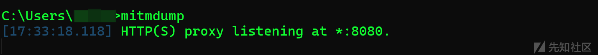

1. 证书在这里，双击运行就能安装了

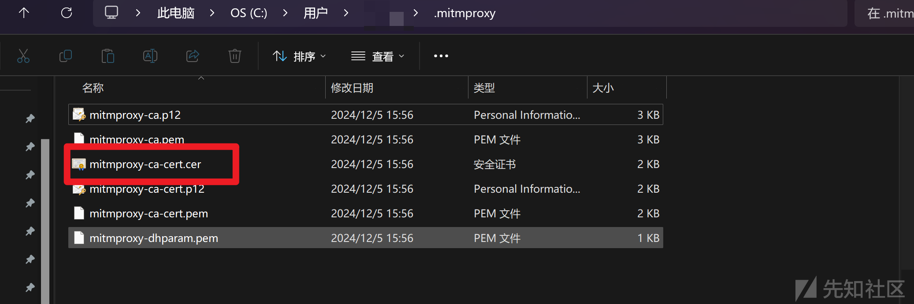

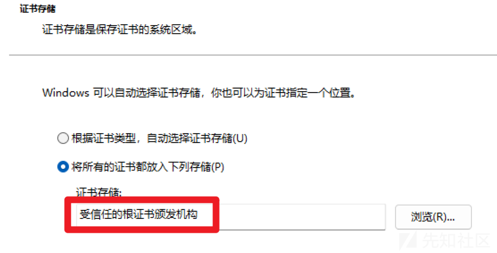

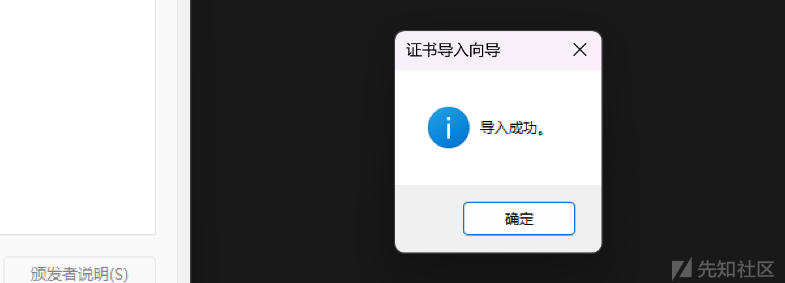

1. 下面配置客户端client.py代码，需要将前面配置的函数URL，也就是触发云函数的API接口，添加至 client.py 中 scf\_servers变量中

```
# -*- coding: utf8 -*-


# 命名只能是client.py
import json
import pickle
from typing import List
from random import choice
from urllib.parse import urlparse
from base64 import b64encode, b64decode
import mitmproxy

scf_servers: List[str] = ["https://111111-zzzzz.ap-beijing.tencentscf.com","http://111111-zzzzz.ap-beijing.tencentscf.com"] #API接口地址，也就是函数URL
SCF_TOKEN = "TOKEN" #与server.py保持一致

def request(flow: mitmproxy.http.HTTPFlow):
    scf_server = choice(scf_servers)
    r = flow.request
    data = {
        "method": r.method,
        "url": r.pretty_url,
        "headers": dict(r.headers),
        "cookies": dict(r.cookies),
        "params": dict(r.query),
        "data": b64encode(r.raw_content).decode("ascii"),
    }

    flow.request = flow.request.make(
        "POST",
        url=scf_server,
        content=json.dumps(data),
        headers={
            "Accept": "text/html,application/xhtml+xml,application/xml;q=0.9,*/*;q=0.8",
            "Accept-Encoding": "gzip, deflate, compress",
            "Accept-Language": "en-us;q=0.8",
            "Cache-Control": "max-age=0",
            "User-Agent": "Mozilla/5.0 (Windows NT 6.1; WOW64) AppleWebKit/537.36 (KHTML, like Gecko) Chrome/58.0.3029.110 Safari/537.36",
            "Connection": "close",
            "Host": urlparse(scf_server).netloc,
            "SCF-Token": SCF_TOKEN,
        },
    )

def response(flow: mitmproxy.http.HTTPFlow):
    if flow.response.status_code != 200:
        mitmproxy.ctx.log.warn("Error")

    if flow.response.status_code == 401:
        flow.response.headers = Headers(content_type="text/html;charset=utf-8")
        return

    if flow.response.status_code == 433:
        flow.response.headers = Headers(content_type="text/html;charset=utf-8")
        flow.response.text = "<html><body>操作超时，可在函数配置中修改执行超时时间</body></html>"
        return

    if flow.response.status_code == 200:
        body = flow.response.content.decode("utf-8")
        resp = pickle.loads(b64decode(body))

        r = flow.response.make(
            status_code=resp.status_code,
            headers=dict(resp.headers),
            content=resp.content,
        )
        flow.response = r

```

只能保存为client.py

## 使用测试

1. 以上全部配置好之后，就可以开启本地代理了

```
mitmdump -s client.py -p 9999 --no-http2

```

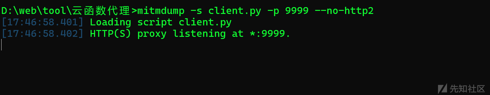

到此我们本地9999端口就开启了一个代理的入口吧，然后我们让想走代理的应用经过这个9999端口，就能调用部署好的云函数了，利用云函数的多出口特性，就达到了每次请求别人我们的ip都不一样，就模拟出了代理池的部分效果

于是，比如我们访问频率太频繁，或者使用了危险的payload（SQL注入尝试等等），就直接封封IP了，这时候咋办呢

有一种做法是，让电脑连接手机的热点，如果被封禁了IP，手机的流量热点，再开关一下，IP就自动刷新了，不过这个方法的缺点就是不自动，且坚持不了多久，又会被封，还有成熟一点的方法就是购买网上的代理池，自动秒级切换IP，不过需要米，自行权衡吧

然后就是我们这个方法，短时间内（新用户可以试用三月的云函数服务），不会要米，可以白嫖一试……

1. 比如给浏览器插件配置一下，让浏览器访问网站时，都先走9999本地代理，使用云函数服务

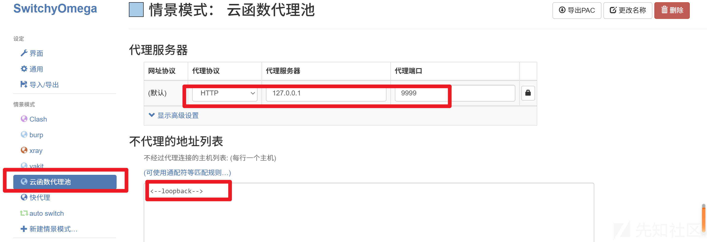

1. 然后选择配置好的代理，随便访问一个国内网站

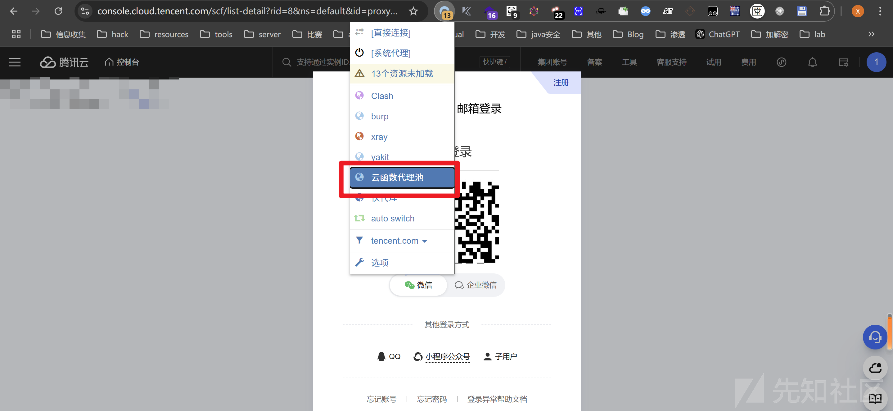

1. 如果一切正常那么就会有大量的正常流量在走，状态码大都是200

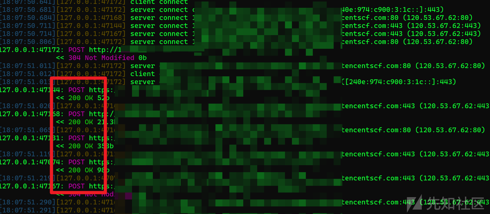

## 验证

那么我们的ip是否是每次请求都不一样呢？是否真的模拟出了代理池的效果呢？

于是我使用我的VPS验证一下

1. VPS使用http.server 起一个web服务，监听1234端口

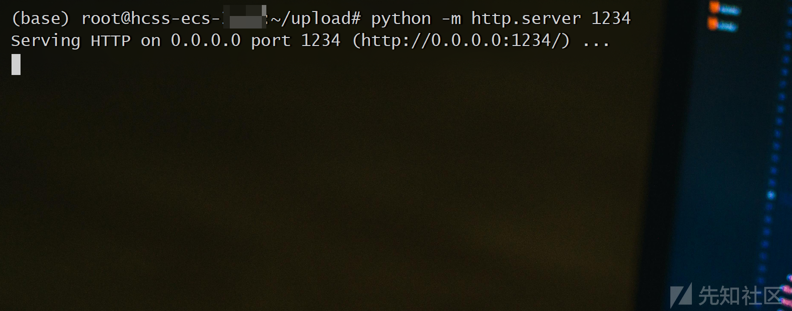

1. 使用刚刚搭建的云函数代理访问ip+1234端口

不使用代理多次访问都是同一个IP

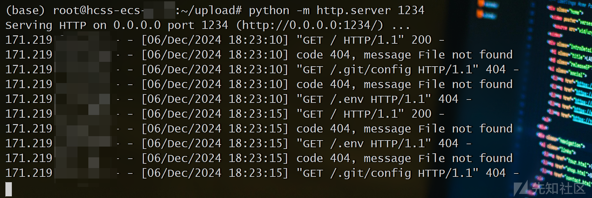

使用云函数部署的代理后，每次请求IP都会改变！

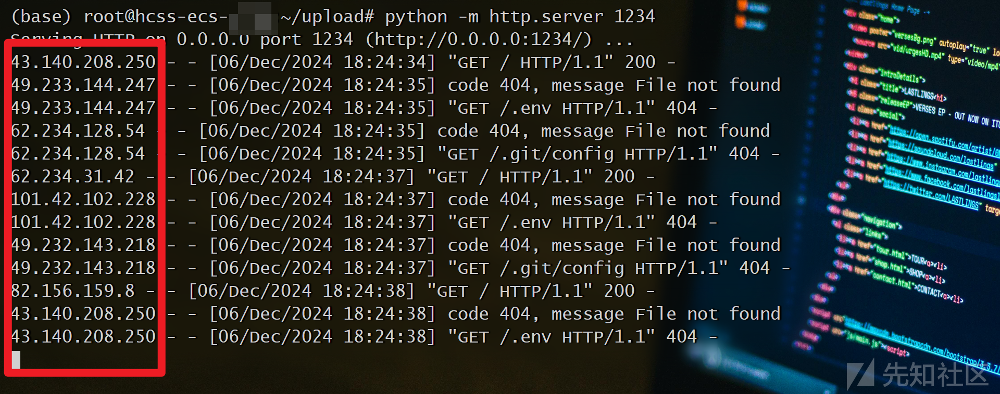

而且去查询这些IP都是腾讯云服务商的出口IP，归属地正好是我们部署云函数是设置的归属地

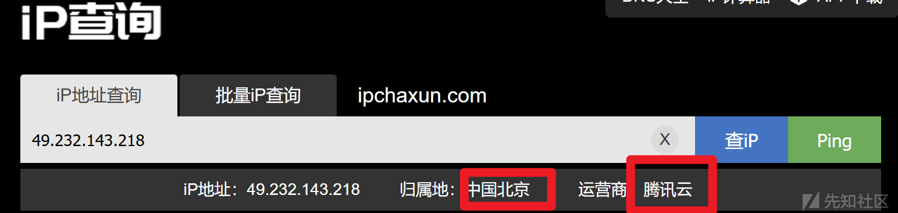

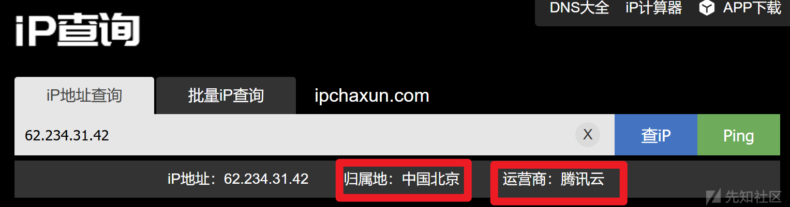

到此，部署成功！
