# boofuzz 中的 Request 和 Path 源码分析-先知社区

> **来源**: https://xz.aliyun.com/news/16031  
> **文章ID**: 16031

---

学习了 boofuzz 的基本概念之后，我产生了一些疑问，本文围绕着这些问题对源码进行分析。

# Request的生成策略

## 问题描述

boofuzz中的测试用例为Request，即数据包。数据包中包含很多字段，boofuzz中称为Primitive（原语），每个Primitive都有自己的生成策略。如果一个Request中包含多个不同的Primitive，它们的生成策略各不相同，能生成的数量也不同。

那么在Request的生成过程中这些Primitive的生成策略是如何起作用的，一次只改变一个Primitive还是一次改变多个Primitive？

以下面的代码为例，下面定义的req1这个Request在生成测试用例时，原语 simple\_field1和simple\_field的生成策略将如何起作用（s\_simple原语的生成策略为从fuzz\_values中按顺序取值)。simple\_field1和simple\_field2的值同时变化，还是一个的值固定另一个的值变化。如果两个同时变化，它们的生成次数是不一致的，如何对应起来。

```
s_initialize("req1")
s_simple(value="0", fuzz_values=["1", "2", "3"], name="simple_field1")
s_simple(value="5", fuzz_values=["6", "7"], name="simple_field2")

```

## 源码分析

下图是数据包生成时所调用的主要函数。可以将它们分为mutation相关和render相关。mutation相关的函数用于确定哪些Primitive需要进行生成，render相关的函数用于将mutation的结果转换成数据包并进行编码。由于Block中可能嵌套Block，所以其mutation相关以及render相关的函数调用都是双向的。

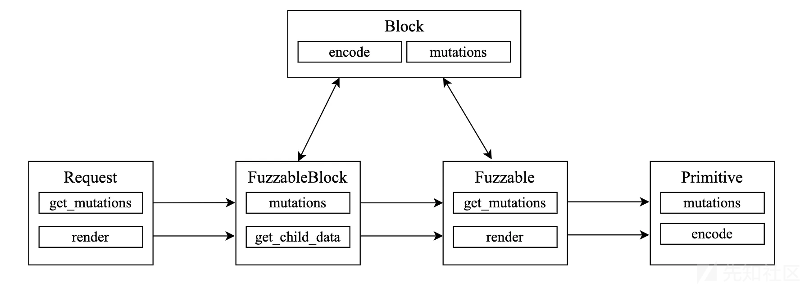

### Mutation相关

* boofuzz中使用Session对Request进行管理，当开始模糊测试需要生成数据包时，Session会调用Request的get\_mutations函数

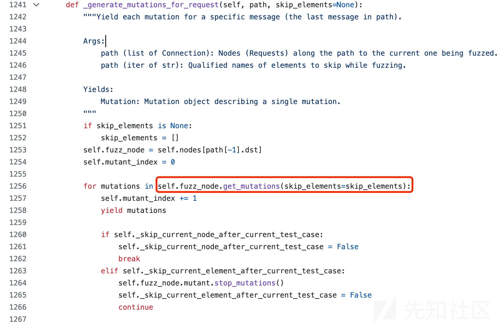

* Request使用变量stack来存储Request中定义的所有Block和Primitive。Request的get\_mutations会调用FuzzableBlock中的mutations函数，此函数遍历stack中的元素，并调用它们的get\_mutations函数

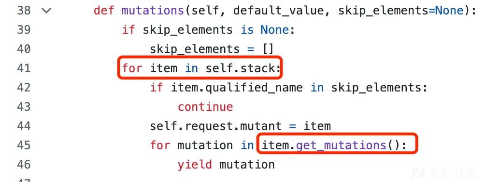

* stack中的元素全都继承自Fuzzable，因此item.get\_mutations会调用Fuzzable中的get\_mutations函数，此函数调用Primitive的mutations函数以执行原语的生成策略。

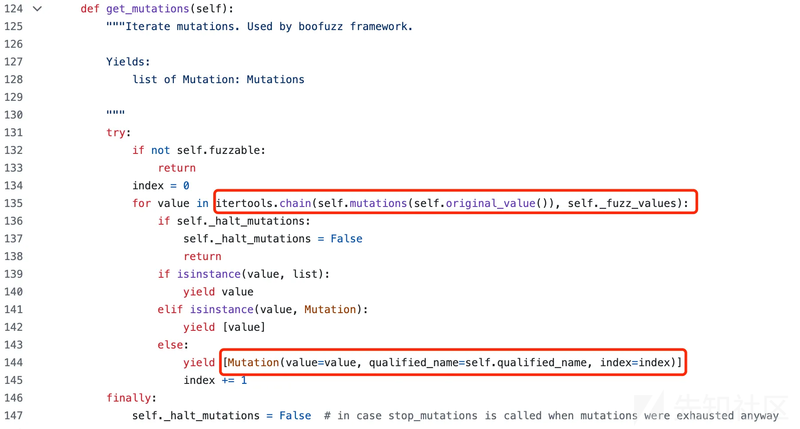

* Fuzzable中的get\_mutations函数是一个迭代器，每次迭代返回的结果是元素为Mutation类的list，但只有一个元素。Mutation类中的value表示原语的一次生成，可以为值或函数，qualified\_name用于唯一标识此原语。list中只有一个元素说明在一次Request的生成过程中只会执行一个Primitive的一次生成策略，初步回答了本节提出的问题。
* Block类中存在一个group属性，可以让Block和group绑定的原语同时进行生成。下面的代码中mutations迭代器返回的是group\_mutations+mutations，即将两个元素为Mutation类的list相加([Mutation1, Mutation2], 元素数量为2)。

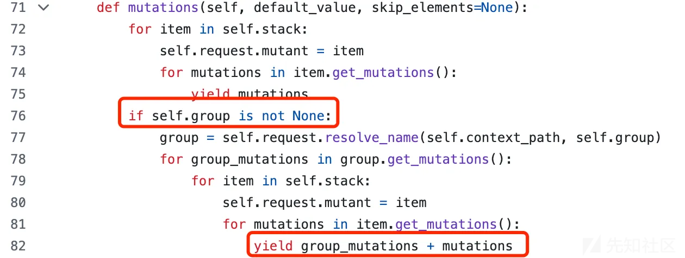

* 上述的生成方式次数是有限制的，受原语数量和原语生成策略数量的影响。为了让boofuzz能一直执行，boofuzz引入了组合模糊测试，当调用session.fuzz时不指定max\_depth参数，就会启用组合模糊测试，depth从1开始一直增加。

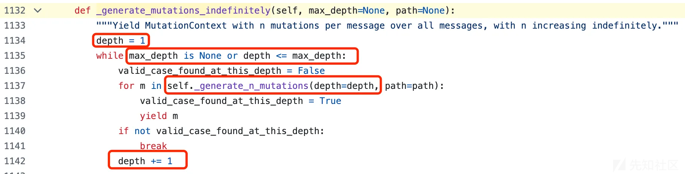

depth的值决定Request中进行生成的原语的数量，下面代码返回的是mutations+ms，即将depth为n一直到depth为1所产生的Mutation list放在一个list中。

通过skip\_elements数组，能让每个depth中进行生成的原语不同。举例说明，假设一个Request中包含3个Primitive：primitive1, primitive2, primitive3。当depth为1时，每次只会调用一个原语的一个生成策略，只有当一个原语的所有生成策略调用结束之后，才会调用下一个原语的生成策略。当depth为2时，每次会调用2个原语的生成策略。primitive1的生成策略执行一次之后会将除primitive1之外原语的生成策略全部执行，然后再执行primitive1的生成策略一次，再将除primitive1之外原语的生成策略全部执行，以此类推，直到全部组合遍历完成。随着depth的增加，不同原语生成策略的组合情况变多，能生成的数据包也越来越多，因此boofuzz能长期运行。

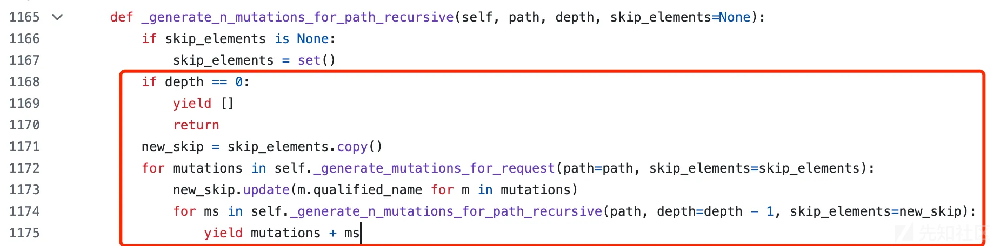

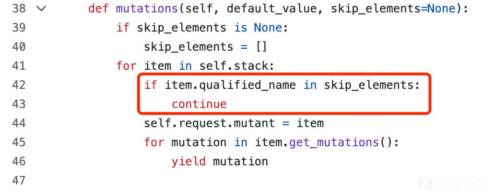

### Render相关

Render的过程没有什么好讲的，就是根据MutationContext应用生成策略，生成数据包。核心函数为Fuzzable类中的get\_value函数（Fuzzable的render函数调用get\_value函数）：

* 如果原语的qualified\_name在mutation\_context.mutaions里，说明此原语需要执行生成策略。生成策略可能是函数（如将默认值重复10次），也可能是值

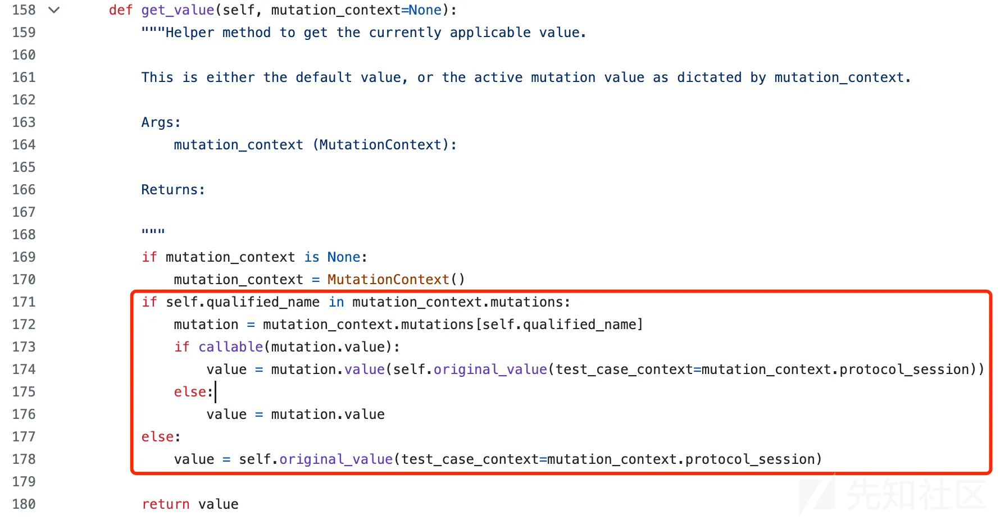

* 如果不在mutation\_context.mutaions里则使用原语的默认值
* MutationContext.mutations 由上一小节中提到的Mutation list构成

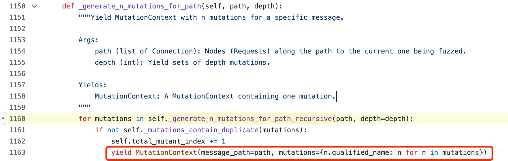

## 结论

1. 通常情况下，在一次Request的生成过程中只会执行一个Primitive的一次生成策略
2. 如果为Block指定了group属性，Block会和group指向的原语同时进行生成
3. 如果seesion.fuzz时不指定max\_depth参数（默认为None启用组合变异，指定为1时，参考结论1和2），同时进行生成的原语数量会随着测试轮数一直增加

# Path的管理策略

## 问题描述

boofuzz中能定义多个Request，这些Request之间可能存在调用的先后关系（如Request1为登录，Request2为登录后才能执行的操作，Request2就得在Request1后面调用），这种由多个Request构成的存在先后顺序的调用链被称为Path。

boofuzz中最后调用模糊测试的类为Session（session.fuzz()），当session中定义多个Request时，这些Request形成的Path在模糊测试过程中如何进行管理，Path中的哪些Request需要进行生成？

下面的代码在session中将多个Request之间连接起来形成了一个树结构，树结构中的Request也被称为Node。Session中存在一个默认的根节点，当session.connect函数只指定一个参数时，则表示将根节点和Request相连。

```
session.connect(s_get("req1"))
session.connect(s_get("req1"), s_get("req2"))
session.connect(s_get("req2"), s_get("req3"))
session.connect(s_get("req2"), s_get("req4"))

```

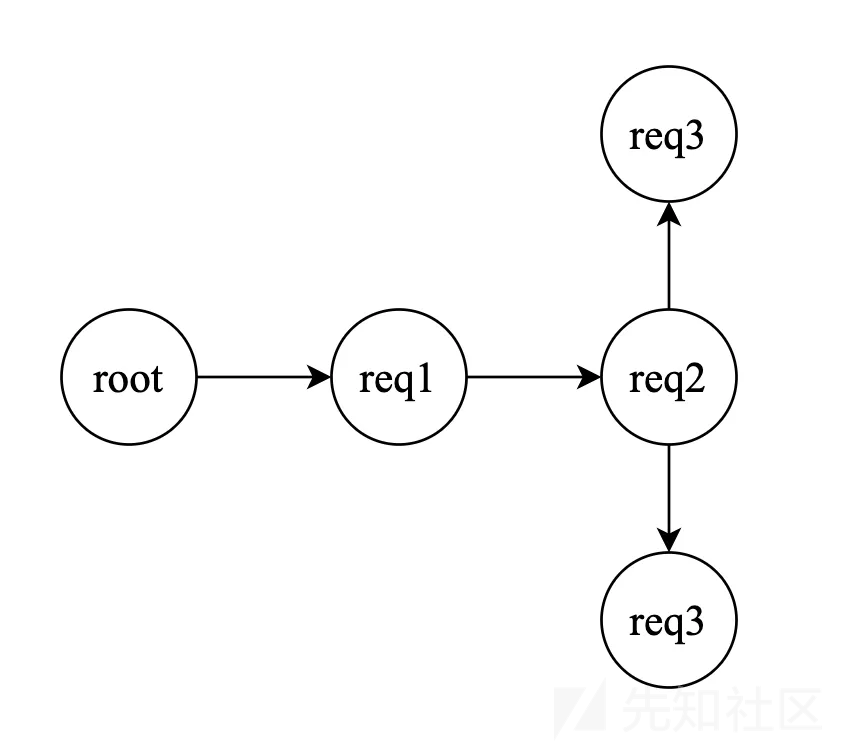

## 源码分析

boofuzz 通过深度优先遍历的方式来遍历树结构中的所有结点并生成Path，上图中的树结构能生成如下Path：

1. root→req1
2. root→req1→req2
3. root→req1→req2→req3
4. root→req1→req2→req4

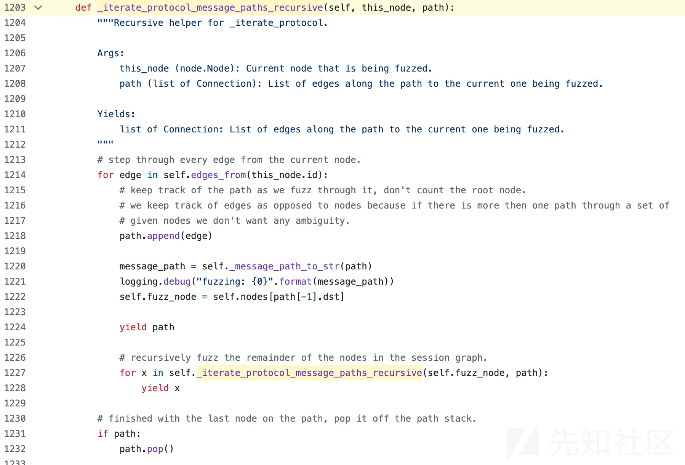

### fuzz\_node 和 non-fuzznode

Path中的Node为Request，一个Path的最后一个Node为fuzz\_node，其余Node为non-fuzznode。在对一个Path的模糊测试过程中只有fuzz\_node对应的Request需要进行生成，non-fuzznode 对应的Request直接使用默认值

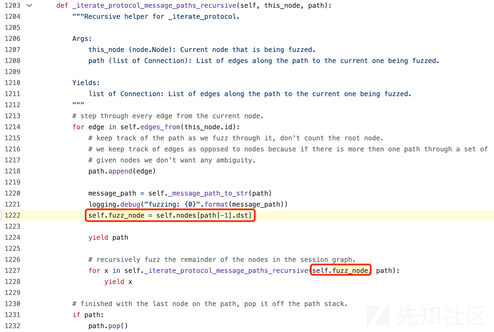

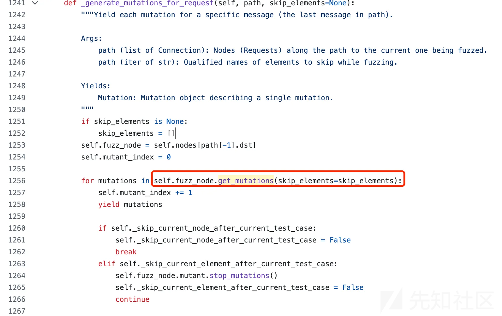

## 结论

1. 结合上一节Request生成策略，得出结论：boofuzz以深度优先的方式遍历所有可能的Path，对Path中的最后一个Request进行生成，生成方式见上一节 Request生成策略

# Request之间的Callback

## 问题描述

源码中给出的fuzz过程中回调函数的调用关系为：pre\_send() - req - callback ... req - callback - post-test-case-callback 。pre\_send 和 pose-test-case-callback分别在一次测试开始前和结束后进行执行。

Request之间存在calback函数，可以用于将前一个Request的响应信息应用到下一个Request的生成过程中，这个过程应该如何通过代码实现？

可能使用的场景：前一个Request登录获取cookie，后一个Request使用cookie访问需要登录才能访问的页面。

## 源码分析

transmit\_normal 和 transmit\_fuzz，分别表示发送non-fuzznode和fuzznode对应的Request。call\_back 函数在前一个node对应的Request发包之后，后一个node对应的Request发包之前调用。

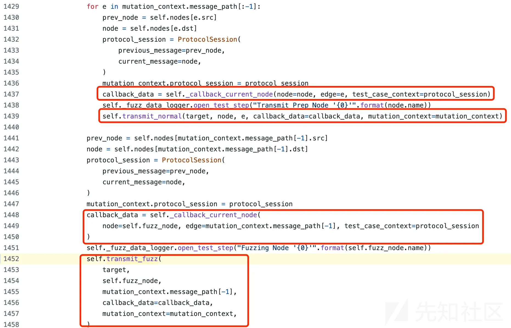

### callback中的session

下面是callback函数的函数签名(自己定义时不需要self参数)，参数中有一个session

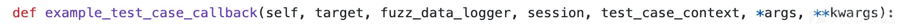

在node对应的Request发包之后会将发送的数据存放在session的last\_send变量

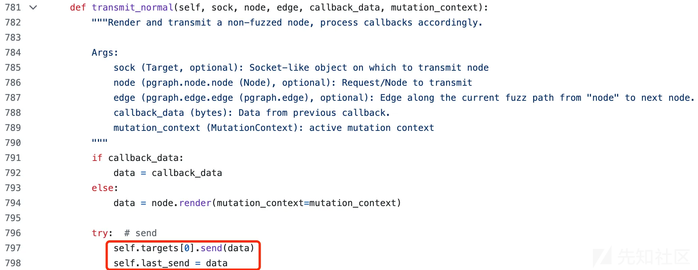

对于non-fuzznode，默认情况下会在发送数据包之后尝试recv（由定义Session时，参数receive\_data\_after\_each\_request控制，默认为True），并存放在seesion的last\_recv变量。因此可以在callback函数中通过session.last\_recv来获取上一个Request数据包的返回结果。网上一些callback函数的例子中，尝试在calback中调用sock.recv失败就是因为默认情况下已经recv过一次了。


对于fuzznode，默认情况下是不会recv的（fuzznode容易出现访问超时），但是fuzznode是最后一个结点了不存在callback的调用，recv的数据也没什么用。

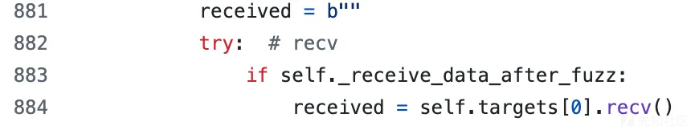

下面的例子在callback函数中通过session获取到了上一个Request的响应数据

```
from boofuzz import *

def test_case_callback(target, fuzz_data_logger, session, test_case_context, *args, **kwargs):
    with open("test.txt", "wb") as f:
        f.write(session.last_send)
        f.write(session.last_recv)

s_initialize(name="req1")
s_static(value="GET /index.html HTTP/1.1\r\n")
s_static("Host: ", name="Host-Line")
s_static("127.0.0.1", name="Host-Line-Value")
s_static("\r\n\r\n", name="Host-Line-CRLF")

s_initialize(name="req2")
s_static(value="GET /index.html HTTP/1.1\r\n")
s_string("Host: ", name="Host-Line")
s_static("127.0.0.1", name="Host-Line-Value")
s_static("\r\n\r\n", name="Host-Line-CRLF")

port = 8080
host = "127.0.0.1"

session = Session(
    target=Target(
        connection=TCPSocketConnection(host, port),
    ),
)
session.connect(s_get("req1"))
session.connect(s_get("req1"), s_get("req2"), test_case_callback)
session.fuzz()

```


### callback 中的test\_case\_context

在calback中通过session获取到前一个Node对应的Request返回的数据之后，如何将数据中的信息作用于下一个Node对应的Request呢？

test\_case\_context中提供了previous\_message和current\_message两个属性分别表示前一个Node和当前的Node。一个简单粗暴的例子：

直接通过test\_case\_context修改当前Node的原语，通过test\_case\_context.current\_message.names[qualified\_name] 直接访问到对应的原语。

```
from boofuzz import *

def test_case_callback(target, fuzz_data_logger, session, test_case_context, *args, **kwargs):
    test_case_context.current_message.names["req2.Host-Line-Value"]._default_value = "128.1.1.1"

def test_case_callback1(target, fuzz_data_logger, session, test_case_context, *args, **kwargs):
    with open("test.txt", "wb") as f:
        f.write(session.last_send)

s_initialize(name="req1")
s_static(value="GET /index.html HTTP/1.1\r\n")
s_group(values=["Host: ", "Host1: ", "Host2: "], default_value="Host: ", name="Host-Line")
s_static("127.0.0.1", name="Host-Line-Value")
s_static("\r\n\r\n", name="Host-Line-CRLF")

s_initialize(name="req2")
s_static(value="GET /index.html HTTP/1.1\r\n")
s_group(values=["Host: ", "Host1: ", "Host2: "], default_value="Host: ", name="Host-Line")
s_static(value="127.0.0.1", name="Host-Line-Value")
s_static("\r\n\r\n", name="Host-Line-CRLF")

s_initialize(name="req3")
s_static(value="GET /index.html HTTP/1.1\r\n")
s_group(values=["Host: ", "Host1: ", "Host2: "], default_value="Host: ", name="Host-Line")
s_static("127.0.0.1", name="Host-Line-Value")
s_static("\r\n\r\n", name="Host-Line-CRLF")

port = 8080
host = "127.0.0.1"

session = Session(
    target=Target(
        connection=TCPSocketConnection(host, port),
    ),
)
session.connect(s_get("req1"))
session.connect(s_get("req1"), s_get("req2"), test_case_callback)
session.connect(s_get("req2"), s_get("req3"), test_case_callback1)
session.fuzz()

```

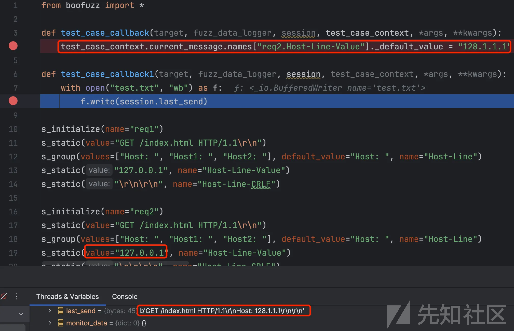

通过看源码，发现boofuzz提供了一种比较优雅的方式，使用参数test\_case\_context中的session\_variables属性。在定义原语的时候，可以将default\_value设置为ProtocolSessionReference类型并设置一个name。在calback中可以调用test\_case\_context.session\_variables[name] = “” 来修改下一个Node中原语对应的默认值

```
from boofuzz import *

def test_case_callback(target, fuzz_data_logger, session, test_case_context, *args, **kwargs):
    test_case_context.session_variables["ref_data"] = "128.1.1.1"

def test_case_callback1(target, fuzz_data_logger, session, test_case_context, *args, **kwargs):
    with open("test.txt", "wb") as f:
        f.write(session.last_send)

s_initialize(name="req1")
s_static(value="GET /index.html HTTP/1.1\r\n")
s_group(values=["Host: ", "Host1: ", "Host2: "], default_value="Host: ", name="Host-Line")
s_static("127.0.0.1", name="Host-Line-Value")
s_static("\r\n\r\n", name="Host-Line-CRLF")

s_initialize(name="req2")
s_static(value="GET /index.html HTTP/1.1\r\n")
s_group(values=["Host: ", "Host1: ", "Host2: "], default_value="Host: ", name="Host-Line")
s_static(ProtocolSessionReference(name="ref_data", default_value="127.0.0.1"), name="Host-Line-Value")
s_static("\r\n\r\n", name="Host-Line-CRLF")

s_initialize(name="req3")
s_static(value="GET /index.html HTTP/1.1\r\n")
s_group(values=["Host: ", "Host1: ", "Host2: "], default_value="Host: ", name="Host-Line")
s_static("127.0.0.1", name="Host-Line-Value")
s_static("\r\n\r\n", name="Host-Line-CRLF")

port = 8080
host = "127.0.0.1"

session = Session(
    target=Target(
        connection=TCPSocketConnection(host, port),
    ),
)
session.connect(s_get("req1"))
session.connect(s_get("req1"), s_get("req2"), test_case_callback)
session.connect(s_get("req2"), s_get("req3"), test_case_callback1)
session.fuzz()

```

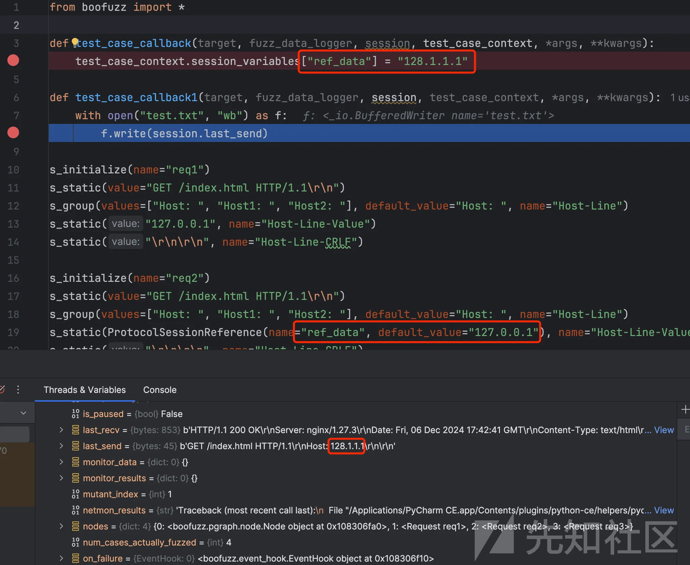

原理如下，对于使用default\_value的原语，在进行render时，会检查default\_value是否为ProtocolSessionReference类型，如果是则从test\_case\_context.session\_variables[name]中取值。

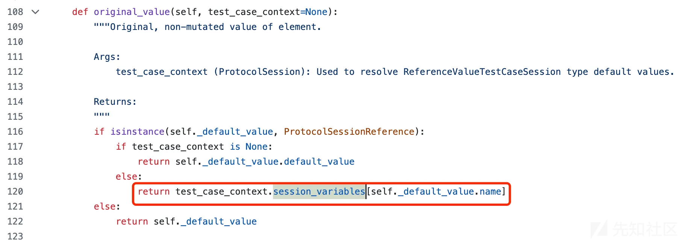

## 结论

1. 通过callback函数中的session参数能获取到上一个Request的响应信息
2. 通过callback函数中的test\_case\_context能获取到当前Request
3. 通过callback函数中的test\_case\_context.session\_variables 能影响使用default\_value的原语
