# 浅析异常线程检测逻辑（unbacked）-先知社区

> **来源**: https://xz.aliyun.com/news/16035  
> **文章ID**: 16035

---

V1rtu0l@深蓝攻防实验室

## 前言

群友很久以前一直在说unbacked，当时对这块了解不多，于是开始找资料看看，包括调试某杀软的过程中，发现shellcode中的LoadLibrary被检测到了之后，直接回溯到了shellcode的地址，标记成了shellcode加载，然后想要了解下这类型的检测是怎么做的，刚好也是把学习过程记录下来。

先记录一下内存中的三种状态：

* MEM\_IMAGE 表明内存区域是Image的映射
* MEM\_MAPPED 表明内存区域是文件内容的映射
* MEM\_PRIVATE 表明内存区域是私有的

一般比如说马子普遍都是loader+shellcode的模式，这种情况下，shellcode加载后执行的内存地址就是unbacked的，也就是不是MEM\_IMAGE，可执行内存地址没有可执行文件的映射，这种情况可以作为一个检测点，或者说进行注入后执行的内存区域也是这种情况。

下面用两个检测脚本作为基准，了解一下这种检测逻辑。

## Get-InjectThread

### 检测原理

这个工具可以检测注入的情况，可以看下他的检测原理

可以先看看Get-InjectThread里面是怎么获取线程地址的

```
$BaseAddress = NtQueryInformationThread -ThreadHandle $hThread

```

看看脚本里的`NtQueryInformationThread`函数定义：

```
$buf = [System.Runtime.InteropServices.Marshal]::AllocHGlobal([IntPtr]::Size)

    $Success = $Ntdll::NtQueryInformationThread($ThreadHandle, 9, $buf, [IntPtr]::Size, [IntPtr]::Zero); $LastError = [Runtime.InteropServices.Marshal]::GetLastWin32Error()

    if(-not $Success) 
    {
        Write-Debug "NtQueryInformationThread Error: $(([ComponentModel.Win32Exception] $LastError).Message)"
    }

    Write-Output ([System.Runtime.InteropServices.Marshal]::ReadIntPtr($buf))

```

通过`NtQueryInformationThread`传入`9`也就是`ThreadQuerySetWin32StartAddress`获取到返回线程的地址。

看下reactos里面的函数实现：

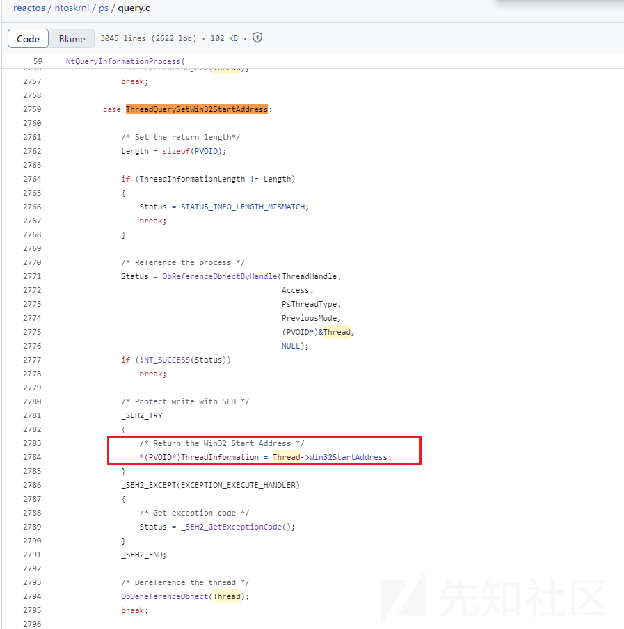

获取到了线程基地址之后就可以获取线程相关信息了：

```
typedef struct _MEMORY_BASIC_INFORMATION {
    PVOID BaseAddress;  //指向查询的内存区域的基地址
    PVOID AllocationBase; //指向分配的内存块的基地址
    DWORD AllocationProtect; //分配时使用的内存保护属性
    SIZE_T RegionSize; //内存区域的大小
    DWORD State; //内存区域的状态MEM_COMMIT: 表示内存已提交。MEM_FREE: 表示内存是空闲的。MEM_RESERVE: 表示内存已保留。
    DWORD Protect; //内存区域的当前保护属性
    DWORD Type; //内存区域的类型MEM_IMAGE: 表示内存是映像文件的一部分。MEM_MAPPED: 表示内存是映射文件的一部分。MEM_PRIVATE: 表示内存是私有的。
} MEMORY_BASIC_INFORMATION, *PMEMORY_BASIC_INFORMATION;

```

```
$memory_basic_info = VirtualQueryEx -ProcessHandle $hProcess -BaseAddress $BaseAddress
$AllocatedMemoryProtection = $memory_basic_info.AllocationProtect -as $MemProtection
$MemoryProtection = $memory_basic_info.Protect -as $MemProtection
$MemoryState = $memory_basic_info.State -as $MemState
$MemoryType = $memory_basic_info.Type -as $MemType

```

主要研判条件是下面这个：

检测线程基地址内存状态是已提交，并且内存类型不是MEM\_IMAGE的

```
if($MemoryState -eq $MemState::MEM_COMMIT -and $MemoryType -ne $MemType::MEM_IMAGE){
    ……
}

```

如果满足这个条件，则程序会判断目标线程可能存在问题，可能是被注入的。

### 绕过

文章中有几种绕过的探讨，我们也来看看

### 通过LoadLibrary注入DLL

这个是将shellcode写在dll中，进行dll注入的方式，实际上shellcode也就是dll文件得落地，所以那块内存区域的type是MEM\_IMAGE。

* OpenProcess()
* VirtualAllocEx()
* WriteProcessMemory()
* GetProcAddress(GetModuleHandle
* CreateRemoteThread

### 利用SetThreadContext

文章里的方法

* VirtualAllocEx分配内存
* WriteProcessMemory写入shellcode
* CreateRemoteThread创建一个SUSPENDED的挂起线程，并且将线程入口点设置为一个内存type为MEM\_IMAGE的地址
* 使用setThreadContext将挂起线程的RIP设置为shellcode的地址
* 执行

### 利用jmp rcx

在创建远程线程的时候，将内存中搜索到的具有MEM\_IMAGE内存type的jmp rcx（\xff\xe1）的地址作为远程线程的入口点，然后将shellcode地址作为参数传入即可。

### 利用\_beginthreadex

文章：<https://www.trustedsec.com/blog/avoiding-get-injectedthread-for-internal-thread-creation>

利用（msvcrt.dll）\_beginthreadex（起本地线程）创建线程可以绕过Get-InjectThread的检测（win7不行）：

win7：

win7直接用CreateThread去执行传入的函数地址了

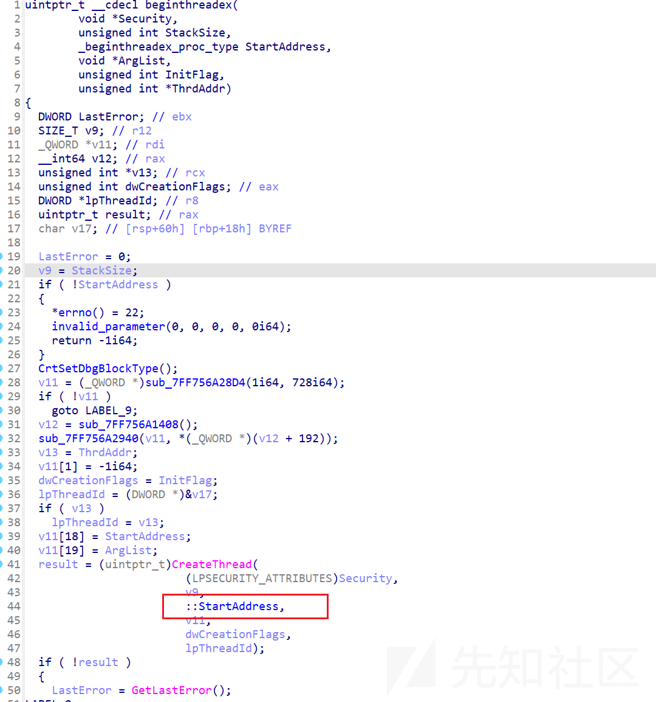

win11：

win11这里就通过threadstartex进行了执行，把原来的传入的shellcode地址作为参数传入了，这样子线程的baseaddress也是MEM\_IMAGE类型的，可以对Get-InjectThread进行绕过。

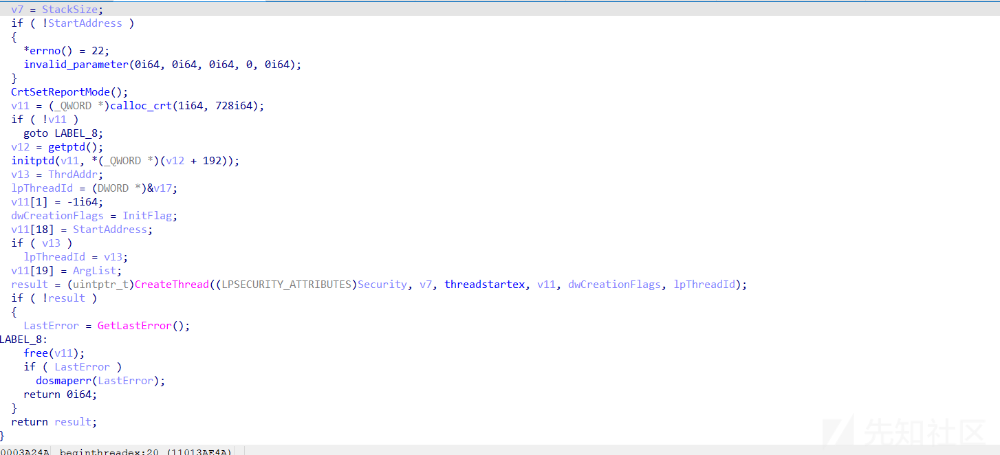

### 利用inline hook进行绕过

比如下面的这张图里面的代码：

修改正常函数的入口逻辑去绕过Get-InjectThread。

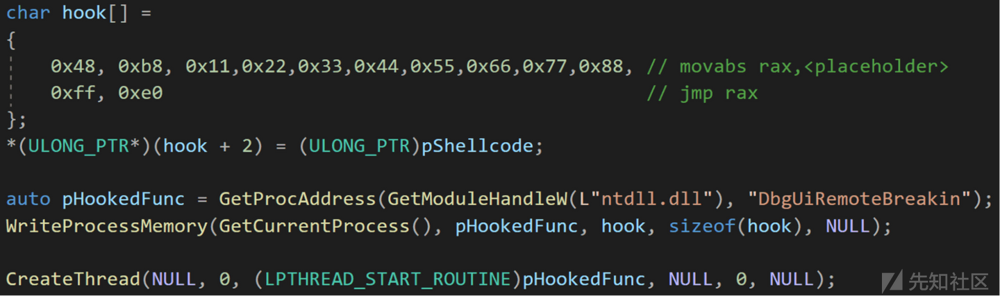

## Get-InjectThreadex

然而对于上述的几种绕过方法，也有工具可以进行检测：

项目地址：<https://github.com/jdu2600/Get-InjectedThreadEx/tree/main>

文章地址：<https://www.elastic.co/security-labs/get-injectedthreadex-detection-thread-creation-trampolines>

这个检测工具大致看了下，没完全看完，感兴趣的可以看看。

### 检测inline hook

在通过修改内存里的dll进行inline hook时，会触发copy\_on\_write，导致内存页变成私有，可以通过检测`.shared`的值是不是共享来判断有没有被hook，又由于一些EDR可能会进行hook，然后Get-InjectThredex就通过检测本进程的对应内存页的shared情况，并且判断不能是ntdll的情况来减少由于EDR hook导致的误报情况。

```
PSAPI_WORKING_SET_EX_INFORMATION pwsei{};
pwsei.VirtualAddress = thread.Win32StartAddress;
if (K32QueryWorkingSetEx(hProcess, &pwsei, sizeof(pwsei)) && !pwsei.VirtualAttributes.Shared) 
{
    static bool s_edrFalsePositive = symbol.starts_with("ntdll.dll!") && K32QueryWorkingSetEx(GetCurrentProcess(), &pwsei, sizeof(pwsei)) && !pwsei.VirtualAttributes.Shared;
    if(!s_edrFalsePositive)
        detections.push_back("private_image");
}

```

### 检测jmp rcx

### CFG

先来了解下什么是CFG（控制流防护）。

MSDN：控制流防护（CFG）是一种高度优化的平台安全功能，旨在防止内存损坏漏洞。通过对应用程序可以从哪里执行代码施加严格限制，使得利用缓冲区溢出等漏洞执行任意代码的行为更加困难。无需为代码的每个部分启用CFG，因为已启用CFG和非CFG的混合代码将正常执行。

CFG严格限制了间接调用指令可以执行的位置，这个机制会对跳转的目的地址去查合不合法，防止不可信的间接调用，windows的CFG依赖于一个bitmap表，这个表存储了目标地址是否有效的一张表，bitmap表中的两位与实际地址的16byte一一对应，因此存在四种情况：

```
00：该地址范围没有有效的跳转地址
01：地址范围包含导出抑制表目标
10：只有16位对齐的地址有效（该范围的第一个地址）
11：地址范围的所有地址均有效

```

让GPT生成一段有间接跳转的代码来debug看看：

```
#include <stdio.h>

// 定义两个简单的函数
void function1() {
    printf("This is function 1.\n");
}

void function2() {
    printf("This is function 2.\n");
}

int main() {
    // 定义一个函数指针
    void (*func_ptr)();

    // 将函数指针指向function1
    func_ptr = function1;
    // 通过函数指针调用function1
    func_ptr();

    // 将函数指针指向function2
    func_ptr = function2;
    // 通过函数指针调用function2
    func_ptr();

    return 0;
}

```

这里可以注意一下，x86和x64的检测实现的差异。

x86：

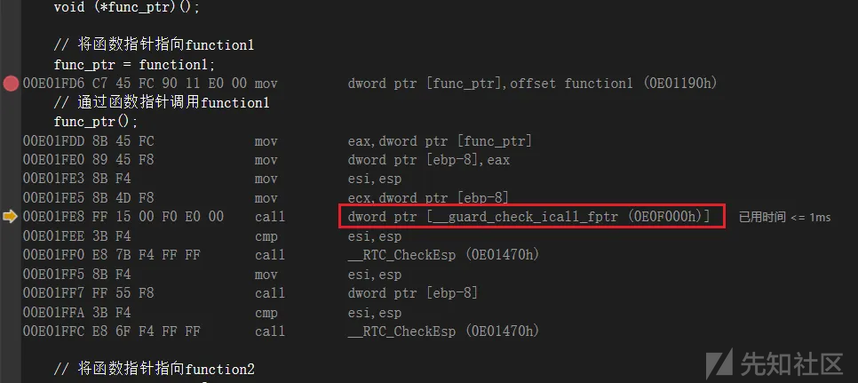

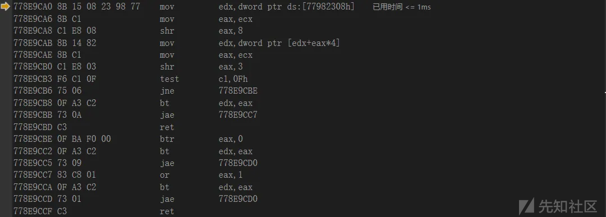

x64：

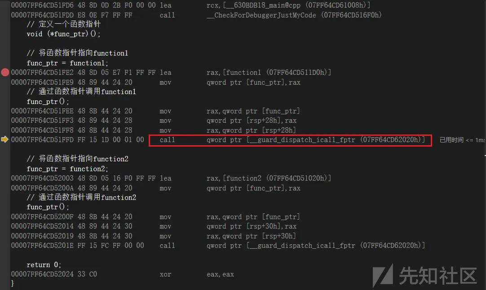

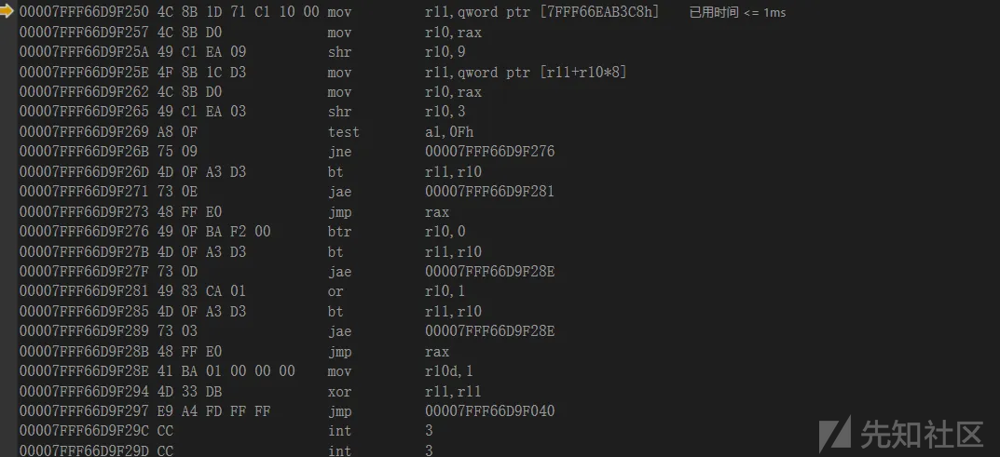

这一段其实就是将跳转地址去CfgBitMap表里面查询的流程：

```
mov r11,qword ptr[xxxxxxx] 首先获取一个基地址值ntdll!LdrSystemDllInitBlock.CfgBitMap
然后将函数地址进行右移9位作为一个偏移，也即是shr r10,9
然后计算加上偏移的值 mov r11,qword ptr[r11+r10*8]，这时候获取到的r11的地址存储的值就是我们需要的值了
然后再将函数地址右移3位 shr r10,3
然后判断是不是16字节对齐
bt r11,r10 这里将r10 mod 64的值作为偏移位去r11取，然后赋给cf
后面的几次验证就是相当于进行校验其他的几种情况，那四种状态，00，01，10，11

```

然后可以和检测的代码对照着看：

这里判断了线程起始地址在不在系统资源空间，是不是16字节对齐，包括最后判断在CFG的表里是不是合法的函数起始地址，这里只判断了是不是00，也就是该地址范围没有有效的跳转地址的情况。

```
if (InSystemImageRange(thread.Win32StartAddress) && 0 == ((ULONG_PTR)thread.Win32StartAddress & 0xF) && GetCfgBitsForAddress(thread.Win32StartAddress, &cfgBits) && 0 == cfgBits)
{
    detections.push_back("cfg_invalid");
}

```

```
BOOL GetCfgBitsForAddress(PVOID address, PULONG pCfgBits) {
    static auto pCfgBitMap = FindCfgBitMap();
    const PULONG_PTR pLocalEntry = pCfgBitMap + ((ULONG_PTR)address >> 9);
    const ULONG cfgOffset = (((ULONG_PTR)(address)) >> 3) & 0x3E;
    ULONG_PTR localEntry;
    // We use ReadProcessMemory to safely read the volatile CfgBitMap.
    if (ReadProcessMemory(GetCurrentProcess(), pLocalEntry, &localEntry, sizeof(localEntry), NULL)) {
        *pCfgBits = (localEntry >> cfgOffset) & 0b11;
        return TRUE;
    }
    return FALSE;
}

```

### 检测调用堆栈

SetThreadContext和\_beginthreadex的利用方式可以通过查看调用堆栈的信息去检测。

先看看检测脚本的实现，有些代码就不看了，直接到具体的栈回溯的地方，看这个栈回溯的实现，也可以对栈欺骗相关检测绕过的做一个参考吧。

先获取线程当前所有的栈帧：

获取栈基址之后，用当前线程上下文的RSP作为栈顶（或是栈限制地址）和栈基址的差值，去读那块内存，x86-64的栈是高地址向低地址增长，16字节对齐。

```
typedef struct _NT_TIB64 {
    DWORD64 ExceptionList;
    DWORD64 StackBase;
    DWORD64 StackLimit;
    DWORD64 SubSystemTib;
#if defined(_MSC_EXTENSIONS)
    union {
        DWORD64 FiberData;
        DWORD Version;
    };
#else
    DWORD64 FiberData;
#endif
    DWORD64 ArbitraryUserPointer;
    DWORD64 Self;
} NT_TIB64, *PNT_TIB64;

```

```
NT_TIB64 tib;
if (!ReadProcessMemory(hProcess, thread.TebBaseAddress, &tib, sizeof(tib), NULL))
    return FALSE;
const auto stackPointer = thread.ContextRecord ? thread.ContextRecord->Rsp : tib.StackLimit;
if (stackPointer > tib.StackBase || stackPointer < tib.StackLimit) {
    detections.push_back("stack_pivot");
    return TRUE;
}
PVOID stackBuffer[0x1800 / sizeof(PVOID)];
const auto stackReadLength = std::min(sizeof(stackBuffer), (tib.StackBase - stackPointer) & ~0xF);
if (!ReadProcessMemory(hProcess, (PVOID)(tib.StackBase - stackReadLength), stackBuffer, stackReadLength, NULL))
    return FALSE;

```

检测程序获取栈帧数组之后，本来通过之前获取的是

[低地址--------高地址] 这样的一个栈帧数组，但是代码后续通过：

`const auto StackBufferLast = &stackBuffer[stackBufferCount - 1];`获取数组最后一个元素的地址，那也就是相当于获取到了函数调用的最先开始的栈地址，也就是高地址处。

然后开始遍历堆栈地址了，这里StackBufferLast[-i]就和正常的函数调用顺序是一样的。

```
for (auto i = offset; !*pbDetection && (i < stackBufferCount) && (returnAddresses.size() < MIN_FRAMES); i += 2) {
    const PVOID candidateRip = StackBufferLast[-i]

```

下面的代码可以先看下，先判断栈帧是不是有效的可用地址，然后判断是不是有可执行权限，因为主要是获取函数返回地址，所以是有可执行权限的才进行后面的判断。

```
if (candidateRip < s_si.lpMinimumApplicationAddress || candidateRip >= s_si.lpMaximumApplicationAddress)
    continue;
if (!IsExecutable(mbi))
    continue;

```

后面主要可以看`CalculateFrameSize()`这个函数：

函数中先加载返回地址所属的模块，获取返回地址所属的模块句柄，然后获取异常目录表，异常目录表包含下面这个结构：

```
typedef struct _IMAGE_RUNTIME_FUNCTION_ENTRY {
    DWORD BeginAddress;
    DWORD EndAddress;
    union {
        DWORD UnwindInfoAddress;
        DWORD UnwindData;
    } DUMMYUNIONNAME;
} _IMAGE_RUNTIME_FUNCTION_ENTRY, *_PIMAGE_RUNTIME_FUNCTION_ENTRY;

```

这个结构中的BeginAddress和EndAddress字段就包含了函数代码在虚拟内存中的起始和结束地址（相对于模块的起始位置）

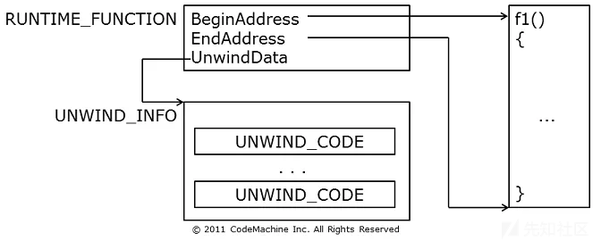

这里通过二分法去查，判断是不是这个模块的非叶函数，异常目录中只包含可执行文件中每个非叶函数的RUNTIME\_FUNCTION结构。

```
indexHi = indexHi / sizeof(RUNTIME_FUNCTION);
while (indexHi > indexLo) {
    const ULONG indexMid = (indexLo + indexHi) / 2;
    pRuntimeFunction = &pTable[indexMid];
    if (rva < pRuntimeFunction->BeginAddress) {
        indexHi = indexMid;  // search lower
        pRuntimeFunction = NULL;
        continue;
    }
    if (rva >= pRuntimeFunction->EndAddress) {
        indexLo = indexMid + 1;  // search higher
        pRuntimeFunction = NULL;
        continue;
    }
    break;  // found
}

```

程序然后调用了CalculateFrameSize\_Internal函数，这个函数具体是用来计算拿到的返回地址所在函数使用的栈帧大小的。

这里就需要知道x64中的异常处理了，x64和x86的异常处理不一样，先看几个结构体：

```
RUNTIME_FUNCTION    // 这个上面提到过

typedef struct _UNWIND_INFO {
    unsigned char Version : 3;
    unsigned char Flags : 5;
    unsigned char SizeOfProlog;
    unsigned char CountOfCodes;
    unsigned char FrameRegister : 4;
    unsigned char FrameOffset : 4;
    UNWIND_CODE UnwindCode[1];
} UNWIND_INFO, * PUNWIND_INFO;

FLAGS：定义了三个标志
UNW_FLAG_EHANDLER (0x01): 表示函数有异常处理程序。
UNW_FLAG_UHANDLER (0x02): 表示函数有终结处理程序。
UNW_FLAG_CHAININFO (0x04): 表示当前的UNWIND_INFO结构是链式信息。

typedef union _UNWIND_CODE {
    struct {
        unsigned char CodeOffset;
        unsigned char UnwindOp : 4;
        unsigned char OpInfo : 4;
    };
    unsigned short FrameOffset;
} UNWIND_CODE, * PUNWIND_CODE;

```

检测程序中先获取到`UNWIND_CODE`（通过`UNWIND_INFO.CountOfCodes`）的个数进行循环，然后获取UNWIND\_CODE结构中的CodeOffset（展开操作指令的偏移量）、UnwindOp（操作类型）、OpInfo（操作信息）。

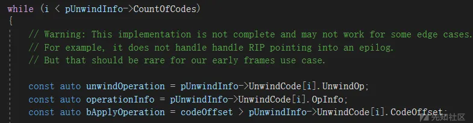

然后就是具体的计算栈大小的逻辑：

```
switch (unwindOperation) {
    case UWOP_PUSH_NONVOL:
        if (bApplyOperation)
            (*pFrameSize)++;
        break;
    case UWOP_ALLOC_LARGE:
        switch (operationInfo) {
            case 0:
                if (bApplyOperation)
                    *pFrameSize += pUnwindInfo->UnwindCode[i].FrameOffset;
                i++;
                break;
            case 1:
                if (bApplyOperation)
                    *pFrameSize += *(DWORD*)(&pUnwindInfo->UnwindCode[i]) / sizeof(PVOID);
                i += 3;
                break;
            default:
                LogError("UWOP_ALLOC_LARGE operationInfo is invalid: (%d)", operationInfo);
                return E_INVALIDARG;
        }
        break;
    case UWOP_ALLOC_SMALL:
        if (bApplyOperation)
            *pFrameSize += operationInfo + 1;
        break;
    case UWOP_SET_FPREG:
        if (bApplyOperation) {
            *pFrameSize = pUnwindInfo->FrameOffset * 2;
            status = W_FPREG;
        }
        break;
    case UWOP_SAVE_NONVOL:
    case UWOP_SAVE_XMM128:
    case UWOP_EPILOG:
        i++;
        break;
    case UWOP_SAVE_NONVOL_FAR:
    case UWOP_SAVE_XMM128_FAR:
        i += 2;
        break;
    case UWOP_PUSH_MACHFRAME:
        if (bApplyOperation) {
            *pFrameSize += 5 + operationInfo;
        }
        break;
    default:
        if (bApplyOperation) {
            LogError("UNWIND_INFO operation is not implemented: %d", unwindOperation);
            return E_INVALIDARG;
        }
}

```

这里可以看看MSDN上描述的操作类型，具体的计算逻辑上面写的挺清楚：

<https://learn.microsoft.com/zh-cn/cpp/build/exception-handling-x64?view=msvc-160>

```
UWOP_PUSH_NONVOL (0) 1 个节点              // 将非易失性寄存器压入栈
UWOP_ALLOC_LARGE (1) 2 或 3 个节点   // 分配一个大的栈帧
UWOP_ALLOC_SMALL (2) 1 个节点              // 分配一个小的栈帧
UWOP_SET_FPREG (3) 1 个节点                    // 设置帧指针寄存器
UWOP_SAVE_NONVOL (4) 2 个节点              // 将非易失性整数寄存器保存在堆栈上
UWOP_SAVE_NONVOL_FAR (5) 3 个节点      // 通过长偏移将非易失性整数寄存器保存在堆栈上
UWOP_SAVE_XMM128 (8) 2 个节点              // 将非易失性 XMM 寄存器的所有128位保存在堆栈上
UWOP_SAVE_XMM128_FAR (9) 3 个节点      // 通过长偏移将非易失性 XMM 寄存器的所有128位保存在堆栈上
UWOP_PUSH_MACHFRAME (10) 1 个节点      // 压入计算机帧
```

如果UNWIND\_INFO的Flags是UNW\_FLAG\_CHAININFO的话，代表当前的UNWIND\_INFO结构是链式信息的，需要去获取下一个UNWIND\_INFO进行计算。

后续就是对于获取的栈帧进行一步步识别了，遇到异常的会记录下来作为一个可疑点。

然后在循环的时候，会发现最后`i+=4`,这个是因为fastcall影子空间的问题，就是说在x64下，虽然传参的时候前四位用的是rcx、rdx、r8、r9，但是还是在栈上预留了四个参数位置。


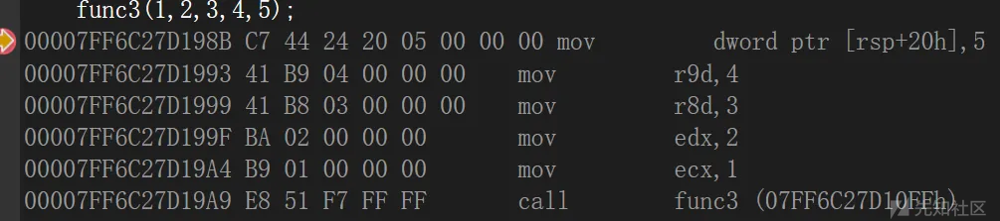

后续的还有可以看看brc4的那篇proxydll的文章：

<https://0xdarkvortex.dev/proxying-dll-loads-for-hiding-etwti-stack-tracing/>

## 参考

<https://blog.xpnsec.com/undersanding-and-evading-get-injectedthread/>

<https://www.jiwo.org/ken/detail.php?id=2878>

<https://www.anquanke.com/post/id/85493>

<https://blog.csdn.net/sxr__nc/article/details/115414098>

<https://cloud.tencent.com/developer/article/2130086?areaSource=106000.8&traceId=5DnnsFpmy2GxaKj_PVVvo>

<https://codemachine.com/articles/x64_deep_dive.html>

<https://learn.microsoft.com/zh-cn/cpp/build/exception-handling-x64?view=msvc-160>
