# apk修改实践：绕过强制更新弹窗-先知社区

> **来源**: https://xz.aliyun.com/news/16036  
> **文章ID**: 16036

---

本文仅供技术交流

打开app，发现强制更新


强制更新的原理大概是应用在启动时或特定时机，会向服务器请求最新的版本信息，并与本地安装的版本号进行比较。  
要想绕过强制更新的其中一个方法就是修改本地的版本号

使用apk messenger查看一下app信息，发现版本号为7.4.2，而新版本为7.5.1


于是接下来就可以尝试把app中为7.4.2的字段改为7.5.1  
改包可以使用mt管理器，不过有些功能要收费。下面说一下免费的方法  
使用jadx反编译apk

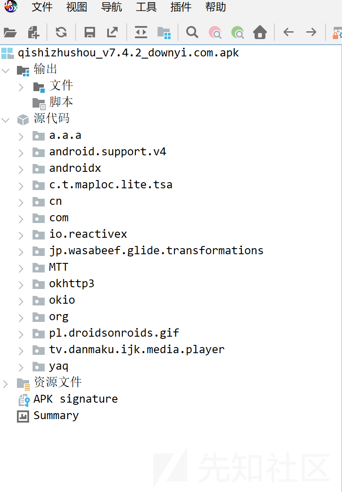

全局搜索7.4.2

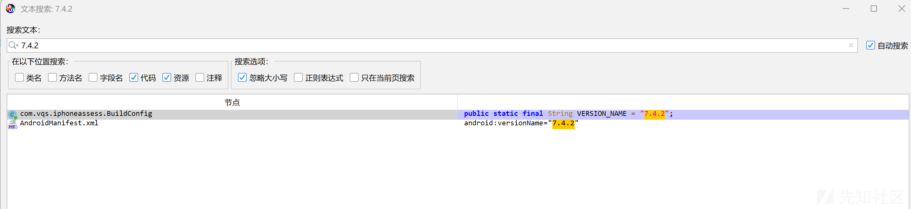  
发现一处是在com.vqs.iphoneassess.BuildConfig中，而com.vqs.iphoneassess会被编译到classes2.dex中

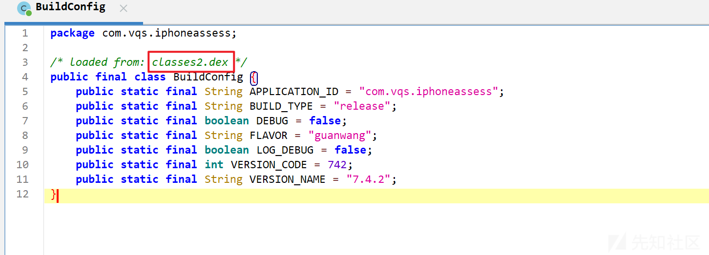  
另一处是在androidmanifest.xml里

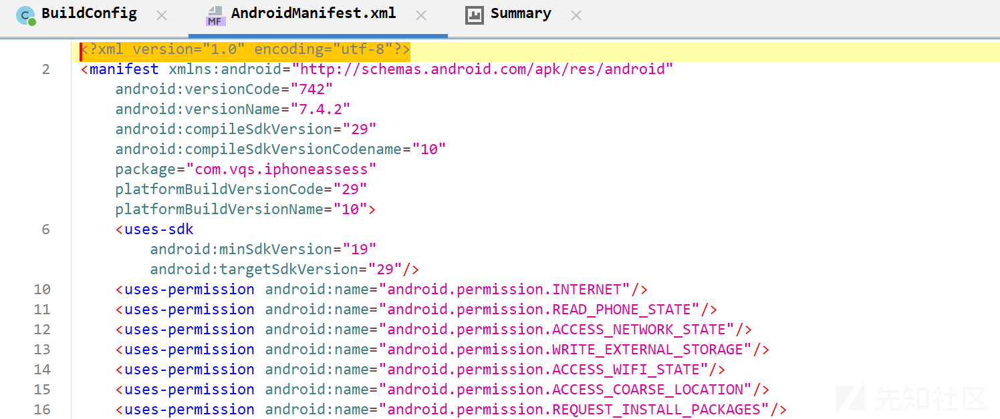  
知道要修改位置后，我们可以使用apktool反编译apk

```
java -jar apktool_2.9.0.jar d 你的APK文件路径

```

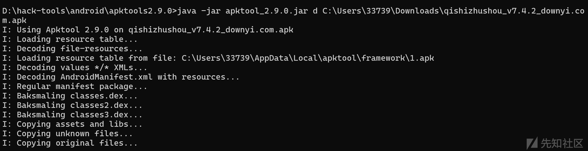

完成后就可以在apktool所在目录下看到生成的文件夹

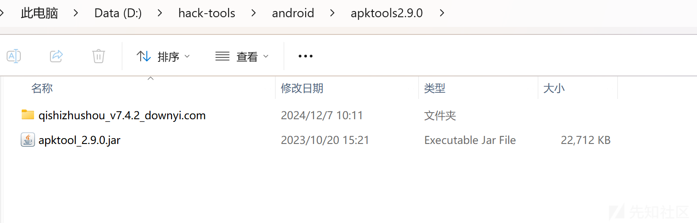  
先修改AndroidManifest.xml

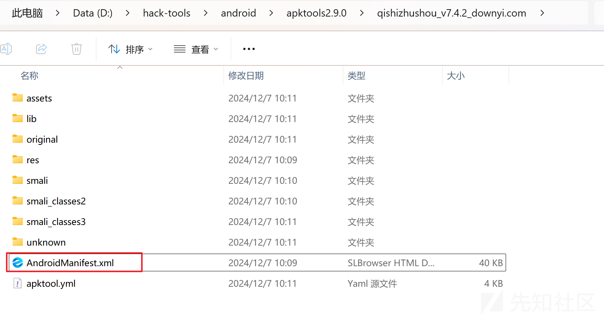

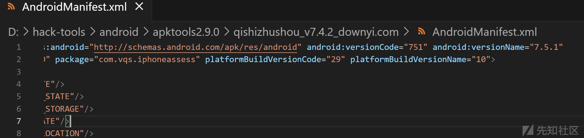

再找到buildconfig,

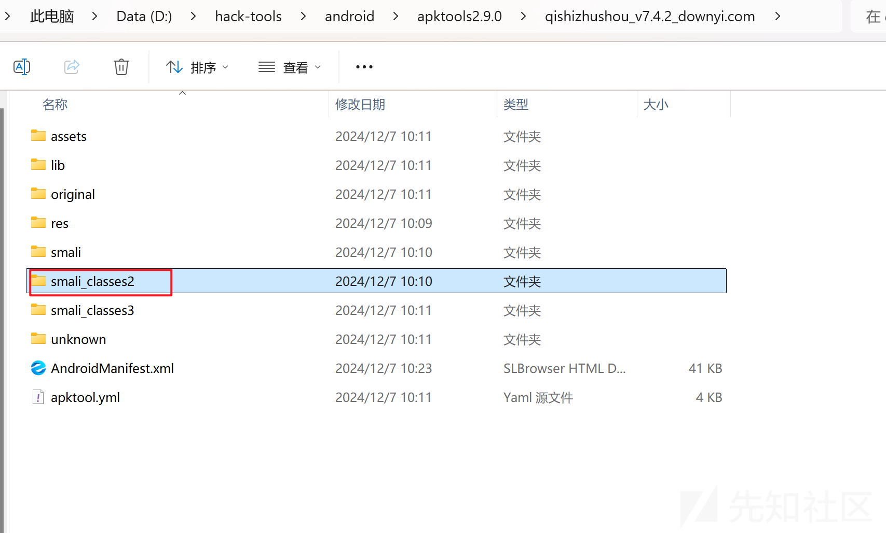

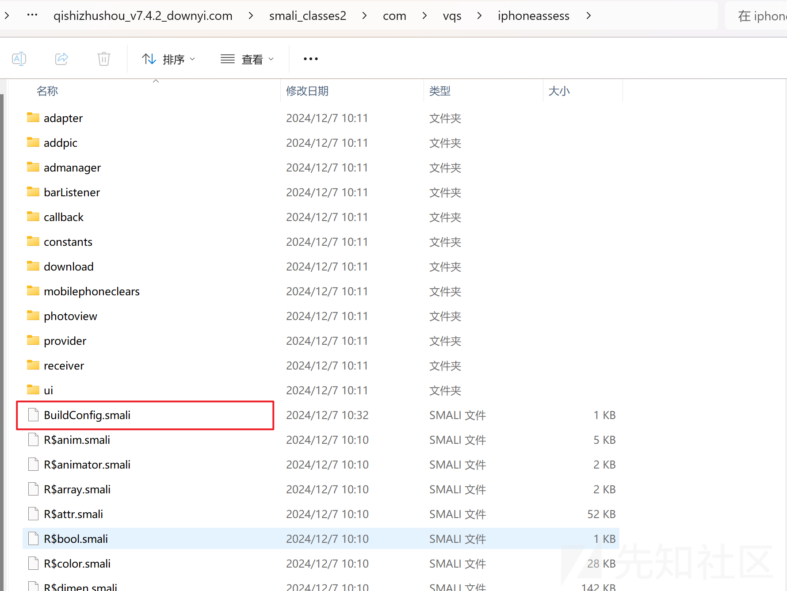

将里面的7.4.2修改为7.5.1  
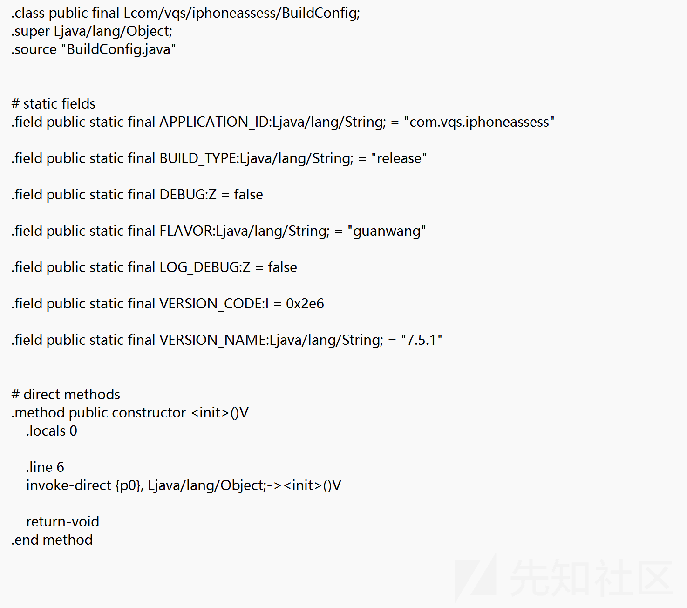

接着使用Apktool重新打包修改后的文件

```
java -jar apktool_2.9.0.jar b 反编译后的文件夹路径

```

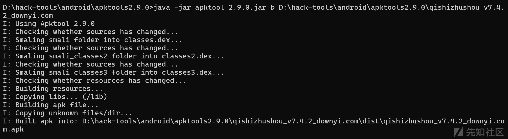  
这将会在dist目录下生成一个新的APK文件

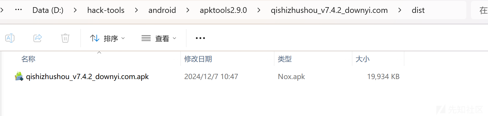

签名apk,使用`jarsigner`工具对APK进行签名。首先，需要生成一个keystore文件，

```
keytool -genkey -v -keystore 新的keystore文件路径 -alias 你的别名 -keyalg RSA -keysize 2048 -validity 10000

```

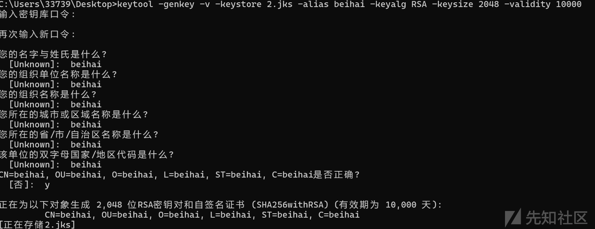

`jarsigner`是Java提供的一个用于签名和验证文件的工具，位于jdk中

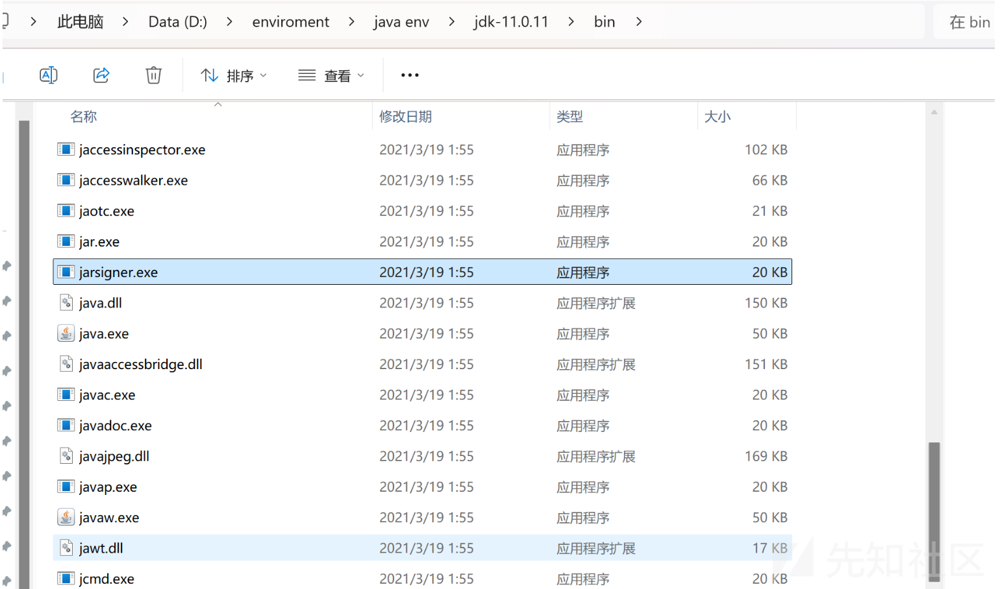

```
jarsigner -verbose -sigalg SHA1withRSA -digestalg SHA1 -keystore 你的keystore文件路径 -storepass 你的keystore密码 -signedjar 签名后的APK文件路径 未签名的APK文件路径 你的keystore别名

```

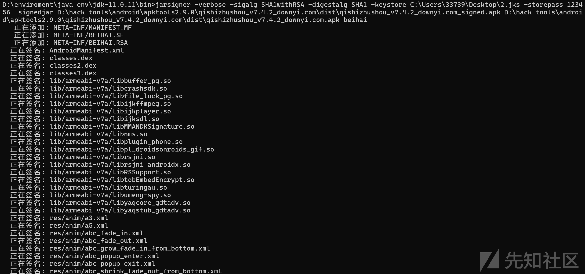

为了提高安装效率和性能，可以使用`zipalign`工具对APK进行对齐

`zipalign`工具是Android SDK的一部分，用于优化APK文件，确保所有未压缩的数据都以4字节边界对齐，从而提高应用程序的运行效率  
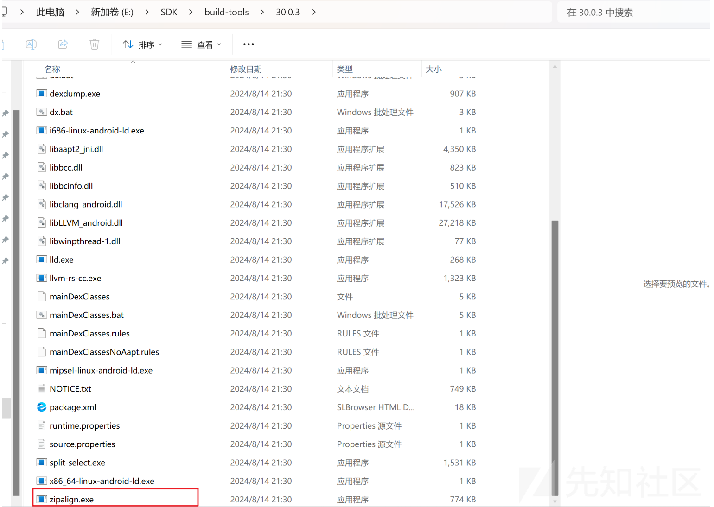

```
zipalign -v 4 签名后的APK文件路径 对齐后的APK文件路径

```

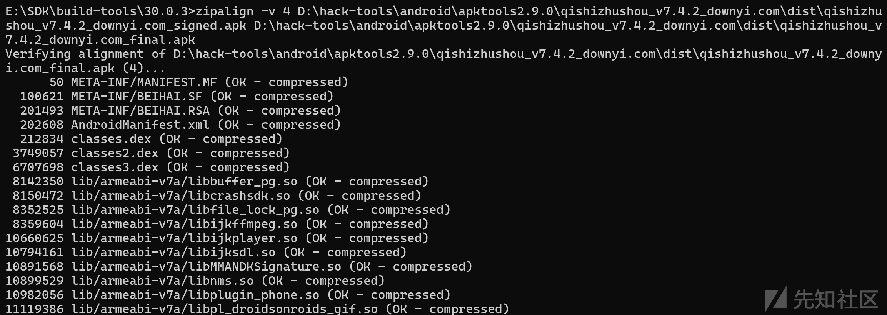

这样就完成了

下面安装到设备上，打开一看弹窗没了，看看版本发现已经变了

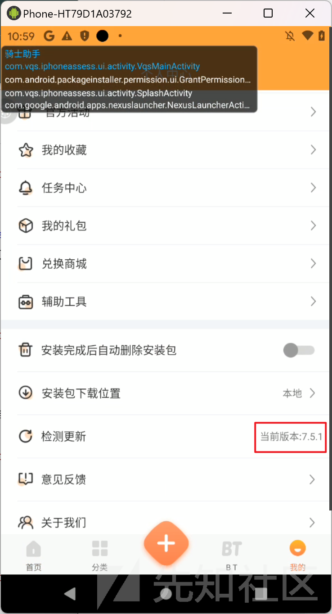
