# 2024国城杯初赛 re部分wp-先知社区

> **来源**: https://xz.aliyun.com/news/16047  
> **文章ID**: 16047

---

## crush's\_secret3

先脱upx壳，直接工具脱

xxtea加密部分被smc了，动调就可以显示出来

xxtea是标准的，在网上找个脚本解密就行

```
#include<stdio.h>
#define _DWORD unsigned int

#include <stdio.h>
#include <stdlib.h>
#define delta 0x9e3779b9


void enc(unsigned int* v, unsigned int* key, int n) {
    unsigned int sum = 0;
    unsigned int y, z, p, rounds, e;

    rounds = 6 + 52 / n;
    y = v[0];
    sum = rounds * delta;

    do
    {
        e = sum >> 2 & 3;
        for (p = n - 1; p > 0; p--)
        {
            z = v[p - 1];
            v[p] -= ((((z >> 5) ^ (y << 2)) + ((y >> 3) ^ (z << 4))) ^ ((key[(p & 3) ^ e] ^ z) + (y ^ sum)));
            y = v[p];
        }
        z = v[n - 1];
        v[0] -= (((key[(p ^ e) & 3] ^ z) + (y ^ sum)) ^ (((y << 2) ^ (z >> 5)) + ((z << 4) ^ (y >> 3))));
        y = v[0];
        sum = sum - delta;
    } while (--rounds);
}

int main()
{
    unsigned int v[12] = { 0x5A764F8A, 0x05B0DF77, 0xF101DF69, 0xF9C14EF4, 0x27F03590, 0x7DF3324F, 0x2E322D74, 0x8F2A09BC, 0xABE2A0D7, 0x0C2A09FE, 0x35892BB2, 0x53ABBA12 };
    unsigned int key[4] = { 0x05201314, 0x52013140, 0x05201314, 0x52013140 };
    int n = 2;      // 轮数

    for (int j = 0; j < 12; j += 2) {
        enc(&v[j], key, n);
    }
    puts((char*)v);

    return 0;
}

```

`The_wind_stops_at_autumn_water_and_I_stop_at_you`

## round

（纯靠猜。。。）

jeb反编译

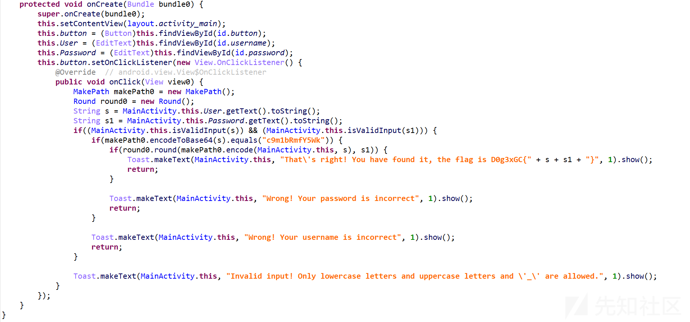

分成了用户名和密码两个加密部分

### 第一部分

base64是魔改的，但是我懒得看代码了，就直接拿反编译的伪代码新写了个程序

```
import java.util.Scanner;

public class MakePath {
    private static final char[] BASE64_CHARS;

    static {
        BASE64_CHARS = "ABCDEFGHIJKLMNOPQRSTUVWXYZabcdefghijklmnopqrstuvwxyz0123456789+/".toCharArray();
    }

    public String encodeToBase64(String s) {
        StringBuilder stringBuilder0 = new StringBuilder();
        byte[] arr_b = s.getBytes();
        int v = (3 - arr_b.length % 3) % 3;
        int v1 = arr_b.length + v;
        for (int v2 = 0; v2 < v1; v2 += 3) {
            int v4 = 0;
            for (int v3 = 0; v3 < 3; ++v3) {
                v4 <<= 8;
                int v5 = v2 + v3;
                if (v5 < arr_b.length) {
                    v4 |= arr_b[v5] & 0xFF;
                }
            }

            for (int v6 = 0; v6 < 4; ++v6) {
                int v7 = 2;
                switch (v6) {
                    case 1:
                        break;
                    case 2:
                        v7 = 1;
                        break;
                    default:
                        v7 = v6;
                }

                if (v2 * 8 / 6 + v6 < arr_b.length * 8 / 6 + v) {
                    stringBuilder0.append(BASE64_CHARS[v4 >> (3 - v7) * 6 & 0x3F]);
                } else {
                    stringBuilder0.append('=');
                }
            }
        }

        return stringBuilder0.toString();
    }

    public static void main(String[] args) {

        Scanner scanner = new Scanner(System.in);
        System.out.print("请输入要进行 Base64 编码的字符串: ");
        String input = scanner.nextLine();

        MakePath makePath = new MakePath();
        String encodedString = makePath.encodeToBase64(input);

        System.out.println("结果: " + encodedString);

        scanner.close();
    }
}

```

逻辑和伪代码一模一样，已知加密结果是12位的，那么输入肯定是9位，所以随便输入字符串，观察与正常加密的区别

java：

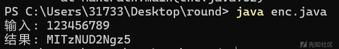

正常解：

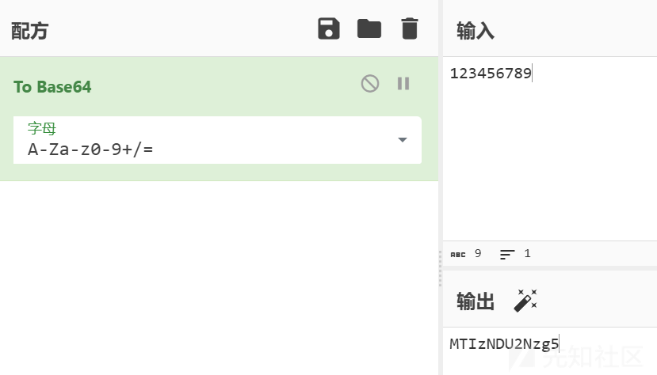

可以看到是第2和3，第6和7，第10和11位反过来了

`c9m1bRmfY5Wk` --> `cm91bmRfYW5k`

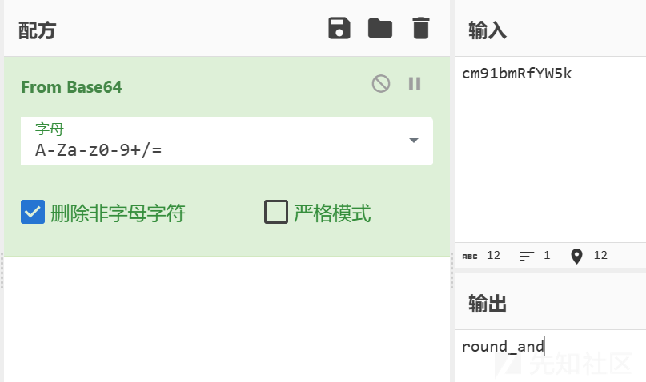

结果为`round_and`

### 第二部分

加密逻辑在round那里

```
public class Round {
    public static class Result {
        private int num;
        private int rip;

        public Result(int v, int v1) {
            this.num = v;
            this.rip = v1;
        }

        public int getNum() {
            return this.num;
        }

        public int getRip() {
            return this.rip;
        }
    }

    public Result add(int[] arr_v, int v, int v1) {
        int v2 = ((v + arr_v[v1]) % 0x400 + 0x400) % 0x400;
        return new Result(v2, (v1 + v2) % 0x400);
    }

    public boolean round(int[] arr_v, String s) {
        Result round$Result0;
        int v = s.length();
        int[] arr_v1 = new int[v];
        int v1 = 33;
        for(int v2 = 0; v2 < s.length(); ++v2) {
            int v3 = s.charAt(v2);
            for(int v4 = 0; v4 < 0x20; ++v4) {
                switch(((arr_v[v1] ^ v3) % 5 + 5) % 5) {
                    case 0: {
                        round$Result0 = this.add(arr_v, v3, v1);
                        break;
                    }
                    case 1: {
                        round$Result0 = this.sub(arr_v, v3, v1);
                        break;
                    }
                    case 2: {
                        round$Result0 = this.xor(arr_v, v3, v1);
                        break;
                    }
                    case 3: {
                        round$Result0 = this.shl(v3, v1);
                        break;
                    }
                    case 4: {
                        round$Result0 = this.shr(v3, v1);
                        break;
                    }
                    default: {
                        round$Result0 = new Result(v3, v1);
                    }
                }

                v3 = round$Result0.getNum();
                v1 = round$Result0.getRip();
            }

            arr_v1[v2] = v3;
        }

        if(v != 12) {
            return false;
        }

        for(int v5 = 0; v5 < 12; ++v5) {
            if(arr_v1[v5] != new int[]{0x160, 646, 0x2F0, 882, 65, 0, 0x7A, 0, 0, 7, 350, 360}[v5]) {
                return false;
            }
        }

        return true;
    }

    public Result shl(int v, int v1) {
        int v2 = (v >> 3) % 0x400;
        return new Result(v2, (v1 + v2) % 0x400);
    }

    public Result shr(int v, int v1) {
        int v2 = (v << 3) % 0x400;
        return new Result(v2, (v1 + v2) % 0x400);
    }

    public Result sub(int[] arr_v, int v, int v1) {
        int v2 = ((v - arr_v[v1]) % 0x400 + 0x400) % 0x400;
        return new Result(v2, (v1 + v2) % 0x400);
    }

    public Result xor(int[] arr_v, int v, int v1) {
        int v2 = (arr_v[v1] ^ v) % 0x400;
        return new Result(v2, (v1 + v2) % 0x400);
    }
}
```

看起来没法写逆向代码，因为v1是与flag一起加密的，只能想到正向爆破的方法

我的爆破代码

```
def makebox(s: str) -> list[int]:
    arr_v = [0] * 0x400
    for v1 in range(0x400):
        arr_v[0x3FF - v1] = v1
    for v in range(0x400):
        arr_v[v] ^= ord(s[v % len(s)])
    return arr_v

def add(arr,v,v1):
    v2 = ((v + arr[v1]) % 0x400 + 0x400) % 0x400
    return v2,(v1+v2)%0x400
def sub(arr,v,v1):
    v2 = ((v - arr[v1]) % 0x400 + 0x400) % 0x400
    return v2,(v1+v2)%0x400
def xor(arr,v,v1):
    v2 = (arr[v1] ^ v) % 0x400
    return v2,(v1+v2)%0x400
def shl(v,v1):
    v2 = (v >> 3) % 0x400
    return v2, (v1 + v2) % 0x400
def shr(v,v1):
    v2 = (v << 3) % 0x400
    return v2, (v1 + v2) % 0x400

def bp(a,b,c,d,e,f,g,h,i,j,k,l):
    arr = [a,b,c,d,e,f,g,h,i,j,k,l]
    flag = [0]*12
    box = makebox('c9m1bRmfY5Wk')
    v1 = 33
    for i in range(len(arr)):
        v3 = arr[i]
        for j in range(0x20):
            match ((box[v1] ^ v3) % 5 + 5) % 5:
                case 0:
                    v3, v1 = add(box, v3, v1)
                case 1:
                    v3, v1 = sub(box, v3, v1)
                case 2:
                    v3, v1 = xor(box, v3, v1)
                case 3:
                    v3, v1 = shl(v3, v1)
                case 4:
                    v3, v1 = shr(v3, v1)
                case _:
                    continue
            flag[i] = v3
    return flag

def main():
    flag = [352, 646, 752, 882, 65, 0, 122, 0, 0, 7, 350, 360]
    for i in range(30,127):
            j = 0
            if (
                bp(i,0,0,0,0,0,0,0,0,0,0,0)[j] == flag[j]
            ):
                print('yes')
                print('i -->',i,chr(i))
    else:
            print('no')

if __name__=="__main__":
    main()

```

前面2位很好爆，直接爆就行

第一位：

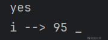

第二位：

```
def main():
    flag = [352, 646, 752, 882, 65, 0, 122, 0, 0, 7, 350, 360]
    for i in range(30,127):
            j = 1
            if (
                bp(95,i,0,0,0,0,0,0,0,0,0,0)[j] == flag[j]
            ):
                print('yes')
                print('i -->',i,chr(i))
    else:
            print('no')

```

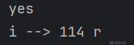

第三位：

```
def main():
    flag = [352, 646, 752, 882, 65, 0, 122, 0, 0, 7, 350, 360]
    for i in range(30,127):
          j = 2
          if (
             bp(95,114,i,0,0,0,0,0,0,0,0,0)[j] == flag[j]
          ):
             print('yes')
             print('i -->',i,chr(i))
    else:
          print('no')

```

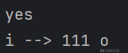

第四位为二战转折点，开始出现多解：

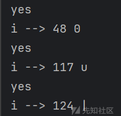

可以猜测是`u`

第五位开始，一个一个爆破已经没有用了，因为解太多了，需要重新写脚本两个两个爆破

```
def main():
    flag = [352, 646, 752, 882, 65, 0, 122, 0, 0, 7, 350, 360]
    for i in range(30,127):
        for k in range(30,127):
            j = 4
            if (
                bp(95,114,111,117,i,k,0,0,0,0,0,0)[j] == flag[j] and
                bp(95,114,111,117,i,k,0,0,0,0,0,0)[j+1] == flag[j+1]
            ):
                print('yes')
                print('i -->',i,chr(i))
                print('k -->',k,chr(k))
    else:
            print('no')

```

仍有多解，但是容易猜

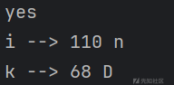

后面的代码部分就不放了，和上面的差不多

第七位容易爆出`_`

最后四位纯靠猜，因为爆两位解太多了，爆三位python爆不出来

猜了个有意义中的最像的

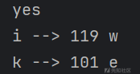

值得高兴的是，爆第十和第十一位的时候只出了3个解，且显然是第三个

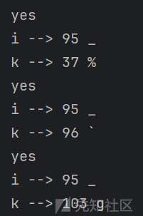

最后一位实在没法爆了，不过根据前一位是`g`可以猜测是`o`

猜对了

`_rounD_we_go`

拼起来

`round_and_rounD_we_go`
