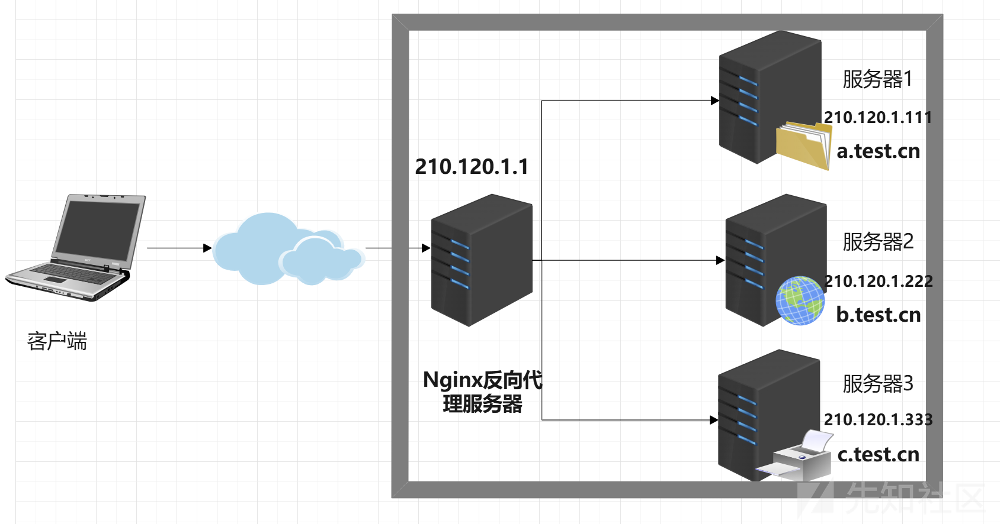
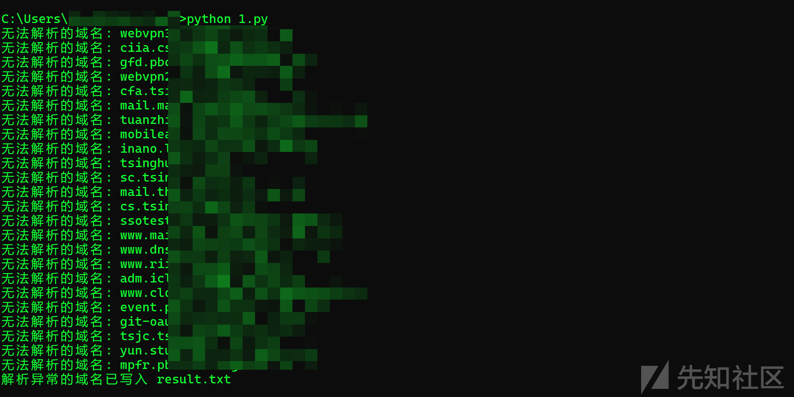

# 如何HOST碰撞挖掘隐蔽资产-先知社区

> **来源**: https://xz.aliyun.com/news/16048  
> **文章ID**: 16048

---

> 前言：HOST碰撞的概念已提出很久了，但是网上的部分文章感觉都解释得不太详细，可能是作者水平比较高的缘故哈哈，自行省略了很多细节没谈。于是想写一篇新手师傅也能看懂的HOST碰撞的文章，解释清楚HOST碰撞到底原理是啥，怎么利用，怎么修复……

## 什么是反向代理

解释HOST碰撞之前，先要理解反向代理的概念，这一点很重要。

**反向代理**是一种服务器配置，它代理客户端的请求并将其转发到一个或多个后端服务器。在这种模式下，客户端不知道实际的后端服务器地址，所有的请求都由反向代理服务器接收并转发给后端服务器处理，然后将结果返回给客户端。

与传统的正向代理（客户端请求通过代理访问外部资源）不同，反向代理的角色是隐藏后端服务器的存在，客户端只与代理服务器交互。反向代理通常用于负载均衡、提升安全性、缓存静态内容等场景。

有点懵？没事，看图说话：举个例子



比如我们作为客户端去访问a.test.com，在目标服务器没有使用反向代理的情况下，请求是直接到达服务器1的，也就是我们的客户端是直接与服务器进行交互的，此时去查询a.test.com的ip，就为DNS中解析绑定的IP，也就是服务器1的真实ip：210.120.1.111，并且也能直接使用其ip地址访问到服务器1！但是考虑到安全性，负载均衡，缓存机制等等问题，大部分企业在架构web服务时往往不会像这样直接把服务器1的真实ip暴露出来，而是在所有后端服务器之前，再架设一台Nginx反向代理服务器！

在有反向代理服务器的情况下，我们再次请求a.test.com，那么请求就先经过Nginx反向代理服务器，经过反向代理服务器的绑定配置检查发现a.test.com对应210.120.111主机，于是把请求转发给210.120.111主机进行交互，210.120.111返回的响应，先返回给Nginx反向代理服务器，再由它返回给客户端，而如果直接使用服务器1的真实ip地址访问，则不会返回服务器1的内容，因为有Nginx反向代理的存在，它只允许我们使用正确的对应绑定的域名访问，也就是a.test.com，此时去查询其ip地址，就不再是210.120.111了，而是DNS解析绑定的210.120.1，也就是反向代理服务器的ip，而单独去访问这个210.120.1地址也看不到什么东西或者是一些默认界面（取决于怎么配置），于是就隐藏了后端服务的IP地址，让我们客户端或者攻击者请求a.test.com时不知道到底是哪一个服务器在与我们进行交互。

**也就是，当客户端请求 `a.test.com` 时，DNS服务器会返回反向代理服务器的IP（例如 `210.120.1`）。反向代理服务器收到请求后，根据其配置文件中的规则（比如基于域名）将请求转发到正确的后端服务器（例如 `210.120.1.111`）。**

相信师傅们在渗透中就经常遇到这样的情况，Apache默认界面，Nginx默认界面，404，403，400，空白界面等等；还有多个不同的域名去查询它们的ip地址居然都是相同的，但是访问这个ip地址又什么都没有……这些都很可能是使用了反向代理的情况

## HOST碰撞的原理

明白了反向代理，HOST碰撞就很好懂了。HOST碰撞其实就是反向代理配置不当导致的：

比如我想给服务器1配置反向代理，使得外部只能通过a.test.com访问服务器1的地址210.120.1.111，而使用其真实ip访问是异常状态，则无法解析，我需要做这几步操作，第一，我首先得把a.test.com域名解析到210.120.1.1 IP地址，也就是反向代理的地址，让DNS服务器能解析a.test.com域名到反向代理服务器，然后第二步才是反向代理的配置，在反向代理服务器上，把a.test.com域名与210.120.1.111地址进行绑定，从而使得访问a.test.com时，反向代理能把请求正确地转发到210.120.1.111地址

示例配置代码：/etc/nginx/nginx.conf 在反向代理服务器210.120.1.1上配置

```
server {
    listen 80;
    server_name a.test.com;  # 设置域名，确保 DNS 已将 a.test.com 指向你的服务器

    location / {
        proxy_pass http://210.120.1.111;  # 设置反向代理目标地址（IP地址）
        proxy_set_header Host $host;  # 保留原始请求头的 Host（确保目标服务器能识别到正确的域名）
        proxy_set_header X-Real-IP $remote_addr;  # 设置真实客户端 IP
        proxy_set_header X-Forwarded-For $proxy_add_x_forwarded_for;  # 传递客户端 IP 链
        proxy_set_header X-Forwarded-Proto $scheme;  # 传递协议（http 或 https）
    }

    # 可选：处理HTTPS的反向代理
    # listen 443 ssl;
    # ssl_certificate /path/to/certificate.crt;
    # ssl_certificate_key /path/to/private.key;
    # 其他 HTTPS 配置...
}

```

那么HOST碰撞怎么产生的呢？怎么利用它发现隐藏资产的呢？

其实是这样的：以下是HOST碰撞的其中一种情况！

**比如，我先给域名oa.admin.com配置DNS解析到反向代理服务器210.110.110.110，然后在反向代理服务器上配置把oa.admin.com域名与内网的192.168.1.1的web服务器绑定，这样使得外部只能通过oa.admin.com域名访问内部的192.168.1.1web服务器，但是假设某一天，内部发现该web系统存在一个漏洞，于是不能让外部再通过这个oa.admin.com域名访问该内网系统了，需要进行维护，于是就把原本会使得oa.admin.com解析到210.110.110.110的DNS域名解析给删除掉了，这样外部就无法通过oa.admin.com域名访问192.168.1.1内部系统了对吗，对个damn，如果仅仅这样做，恰好导致了HOST碰撞！为什么呢？不要忘了，我们虽然删掉了oa.admin.com到210.110.110.110域名解析，但是反向代理服务器本身的域名绑定还没有删除！！！也就是反向代理的功能仍然可用，仍然可以把来自oa.admin.com域名的请求，转发给配置里的192.168.1.1web服务器，只不过仅仅是oa.admin.com无法解析到反向代理服务器而已了，那么攻击者只需要做好信息收集，假设已经知道了oa.admin.com域名，不知道反向代理的ip，那么使用收集到的信息不断的给oa.admin.com域名匹配ip地址，不断尝试，直到能访问到某个正常系统为止，再手动把oa.admin.com解析到匹配的ip地址去，不就行了嘛，因为即使删除掉了DNS解析，我们也能自己在本地host文件中，手动解析过去啊，只要反向代理的绑定配置还未被删除，就存在这个漏洞。这就是HOST碰撞。总结起来其实就是两两碰撞域名与ip，看能不能解析到原本不能正常访问到的系统**

## HOST碰撞利用

以上提到的情况只是HOST碰撞中的一种最常利用的情况，实际上这个概念还是比较宽泛的，不过其他情况都不太常见了于是不做讨论。

理解了原理，那么怎么利用呢？其实上面也说了，主要依赖信息收集！

* 第一步：收集反向代理服务器的ip
* 第二步：收集解析异常的域名，能解析到内网中的域名
* 第三步：手动把域名解析为某个ip，采用笛卡尔积碰撞，两两匹配，直到域名能访问出某个系统

那么重点就是收集这些可能的ip+域名了，怎么找呢？就是用信息收集的方法啊

* 可以边打边收集边筛选
* 还可以写个脚本，批量地域名转换ip，并记录筛选出解析异常的域名。
* 不嫌慢的话，也可以直接把收集到的全部域名+ip都拿去碰撞

筛选出解析异常的域名的小脚本：读取subdomain.txt，输出result.txt

```
import socket

def check_domain_resolution(domain):
    try:
        # 尝试获取域名对应的IP地址
        ip = socket.gethostbyname(domain)
        return True
    except socket.gaierror:
        # 如果发生解析错误，说明该域名无法解析
        return False

def main():
    # 读取子域名文件
    input_file = 'subdomain.txt'
    output_file = 'result.txt'

    with open(input_file, 'r') as file:
        domains = [line.strip() for line in file.readlines()]

    # 检查每个域名的解析情况
    unresolved_domains = []
    for domain in domains:
        if not check_domain_resolution(domain):
            print(f"无法解析的域名: {domain}")
            unresolved_domains.append(domain)

    # 将无法解析的域名写入到result.txt
    if unresolved_domains:
        with open(output_file, 'w') as result_file:
            for domain in unresolved_domains:
                result_file.write(f"{domain}\n")
        print(f"解析异常的域名已写入 {output_file}")
    else:
        print("所有域名均能解析")

if __name__ == '__main__':
    main()

```



可以使用这些工具，填入收集到的信息，就可以检测HOST碰撞了：

* HostCollision：<https://github.com/pmiaowu/HostCollision>
* Hosts\_scan：<https://github.com/fofapro/Hosts_scan>

## 修复HOST碰撞

### 1. **检查DNS配置**

确保DNS记录指向正确的IP地址。如果使用`/etc/hosts`文件进行域名映射，确保文件中没有重复的条目。

* 查看

  ```
  /etc/hosts
  ```

  文件：

  ```
  cat /etc/hosts

  ```
* 删除或修正重复的域名映射。

### 2. **检查虚拟主机配置**

如果在Web服务器（如Apache或Nginx）中使用了虚拟主机配置，确保配置文件中没有冲突。例如，在Nginx中，可能会看到类似以下的配置：

```
server {
    listen 80;
    server_name example.com;
    root /var/www/example;
}

server {
    listen 80;
    server_name example.com;  # 这里会造成冲突
    root /var/www/another_example;
}

```

确保每个`server_name`是唯一的，或者如果像多个域名指向同一网站，使用通配符来避免冲突：

```
server {
    listen 80;
    server_name *.example.com;
    root /var/www/example;
}

```

### 5. **检查反向代理配置**

如果使用反向代理服务器（例如Nginx或HAProxy），确保代理配置没有错误或冲突。例如，确保不同的后端服务没有使用相同的端口或路径。
