# 2024 国城杯取证 Just_F0r3n51Cs-先知社区

> **来源**: https://xz.aliyun.com/news/16049  
> **文章ID**: 16049

---

# Just\_F0r3n51Cs

解题用到autopsy 和 magnet

flag被分为四份

题目描述从beginning开始

挂载直接搜索取出beginning.pcap流量包


追踪流 不难看出其中传输了一个jpg图片

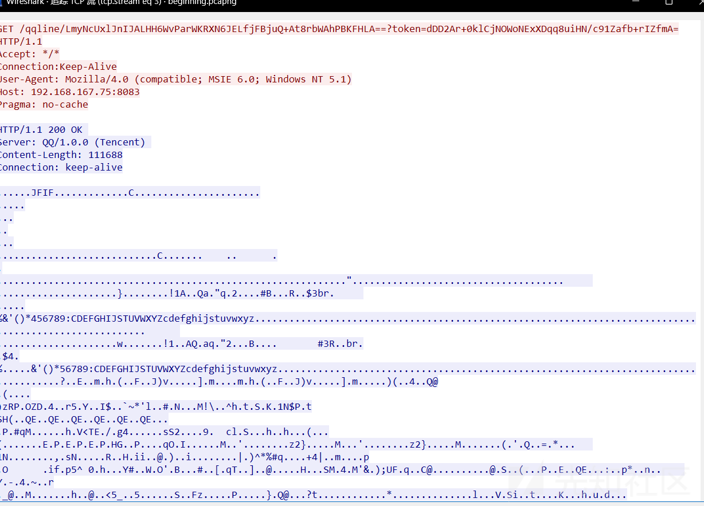

提取图片得到base64编码b3Vyc2VjcmV0IGlzIEQwZzN4R0M=

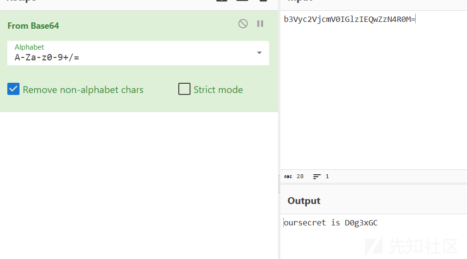

得知图片使用oursecret加密 密码为D0g3xGC

解密得到hidden.txt

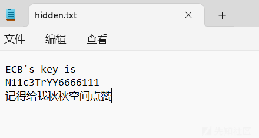

得到aes的key以及提示：QQ空间

流量包中找到QQ号

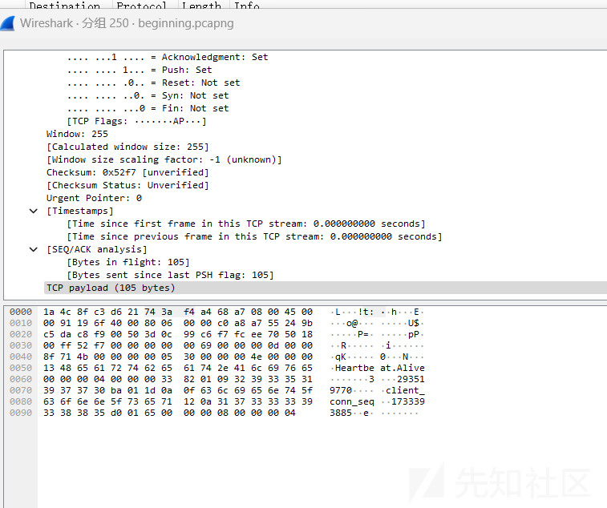

访问QQ空间

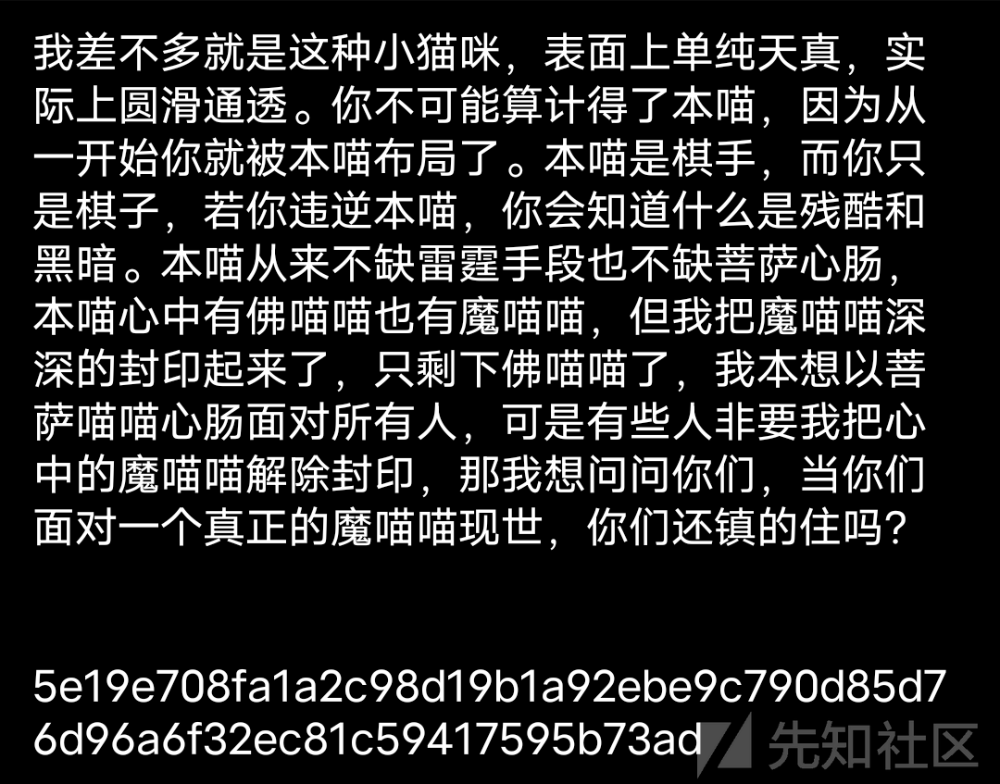

得到明文

解密得到flag1:D0g3xGC{Y0u\_

autopsy取到2.zip和original.zip两个加密压缩包


2.zip的解压密码为

1、计算机注册时设置的用户名（答案D0g3xGC）  
2、计算机当前操作系统的产品名称，若有空格则用下划线代替（答案Windows\_7\_Ultimate）  
3、计算机当前安装的 Mozilla Firefox 浏览器的版本号，保留一位小数（答案115.0）

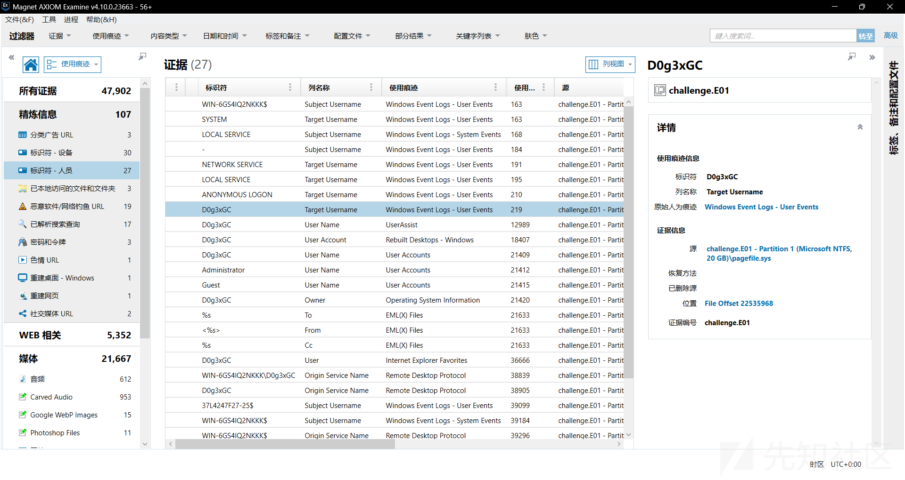

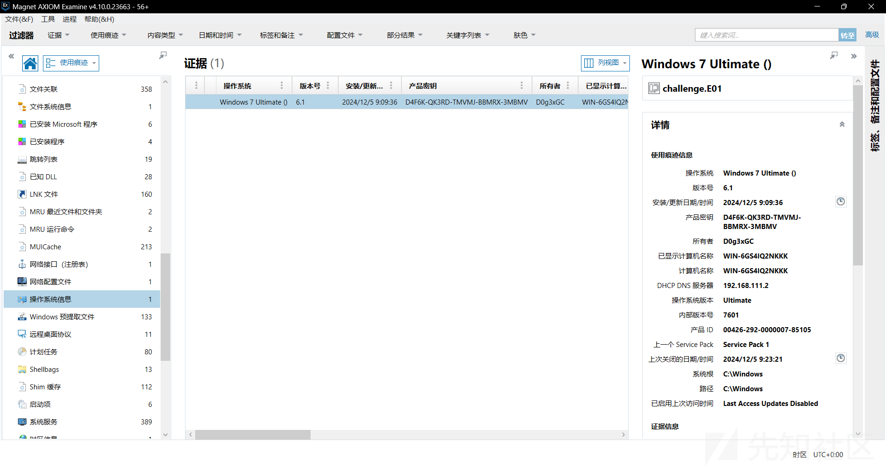

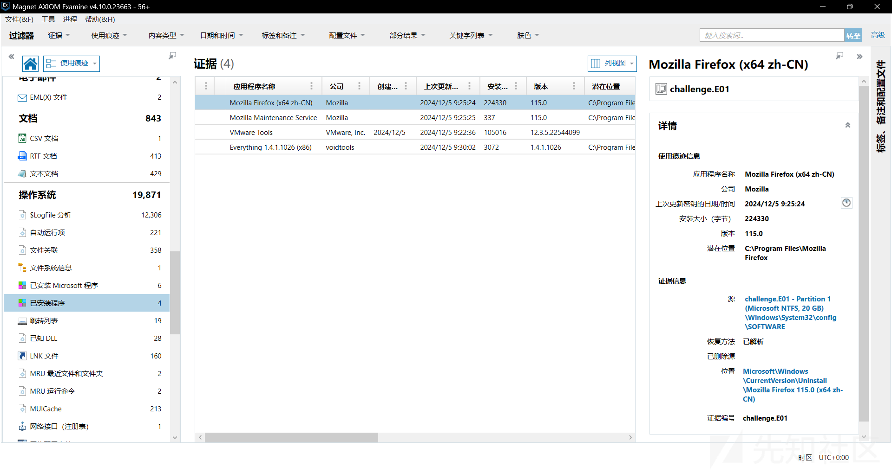

解压得到flag2#@~^HAAAAA==W^lLyPb/P@#@&4\*.2{W!!x[mFC&|0AcAAA==^#~@

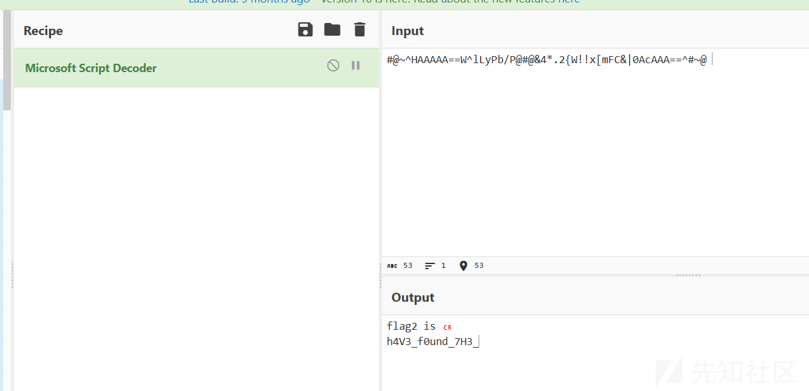

flag2 is  
h4V3\_f0und*7H3*

pictures目录下发下catwatermark\_666.png

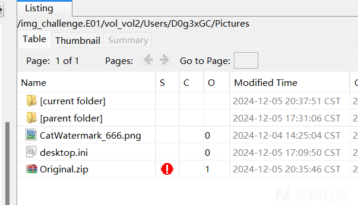

搜索图片名发现catwatermark工具

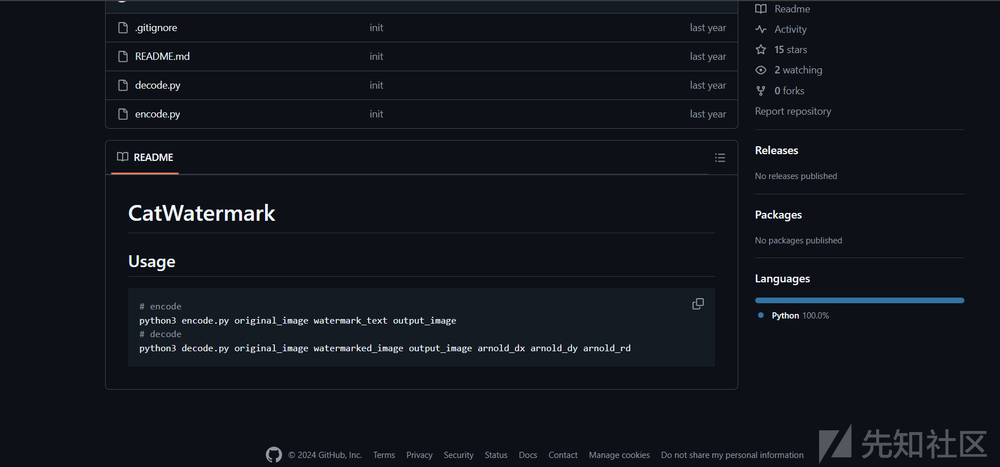

要解密图片还需要original图片和三个参数

之前取到original压缩包密码为

1、计算机用户D0g3xGC登录时的密码（答案qwe123!@#）  
2、账号D0g3xGC@qq.com登录otterctf网站时的密码（答案Y0u*f1Nd^*^m3\_233）

windows登录密码MD5即可

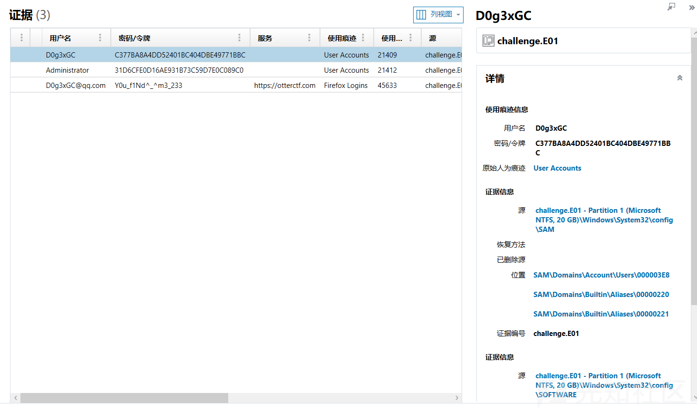

现在就得到了水印后的图和原始图片 还需要参数 猜测为图片名后的666

python .\decode.py .\Original.png .\CatWatermark\_666.png output\_image.png 6 6 6

得到flag3:F1N4L\_s3CR3t\_0F*Th15*

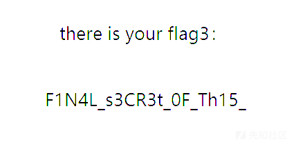

user目录下flag4.zip


解压后是一个加密程序和一个.bin文件

python解包

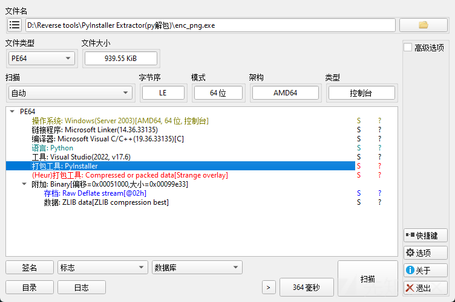

反编译得到脚本

```
#!/usr/bin/env python
# visit https://tool.lu/pyc/ for more information
# Version: Python 3.8

def xor_encrypt(data, key):
    encrypted_data = bytearray()
    for i in range(len(data)):
        encrypted_data.append(data[i] ^ key[i % len(key)])
    return encrypted_data

def read_file(file_path):
    pass
# WARNING: Decompyle incomplete


def write_file(file_path, data):
    pass
# WARNING: Decompyle incomplete

def encrypt_file(input_file_path, output_file_path, key):
    data = read_file(input_file_path)
    encrypted_data = xor_encrypt(data, key)
    write_file(output_file_path, encrypted_data)

if __name__ == '__main__':
    key = b'GCcup_wAngwaNg!!'
    input_file = 'flag4.png'
    encrypted_file = 'flag4_encrypted.bin'
    encrypt_file(input_file, encrypted_file, key)
```

XOR

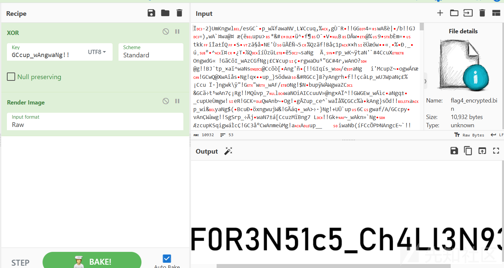

得到flag4:F0R3N51c5\_Ch4Ll3N93}

拼接得到完整flagD0g3xGC{Y0u\_h4V3\_f0und\_7H3\_F1N4L\_s3CR3t\_0F\_Th15\_F0R3N51c5\_Ch4Ll3N93}
