# PE 文件结构剖析：手工压缩与注入实战-先知社区

> **来源**: https://xz.aliyun.com/news/16059  
> **文章ID**: 16059

---

## PE文件结构分析

`PE` 全称是 `Portable Executable`，即可移植的可执行文件，是 Windows 操作系统下可执行文件的总称，是用于存储可执行文件 (exe, scr)、动态链接库 (dll, oxc, cpl) 和驱动程序 (sys, vxd) 的标准文件格式。

PE 文件结构复杂而丰富，它包含了可执行文件的所有必要信息，以便操作系统正确加载和执行程序。了解 PE 文件结构对于逆向工程、软件分析和安全研究非常重要，因为它提供了深入了解可执行文件内部工作原理的窗口，下面是对其文件结构的详细分析

### DOS头 (DOS Header + DOS Stub)

PE 文件的开头通常包含一个 `DOS` 头，用于向后兼容早期的 `MS-DOS` 操作系统，使得 DOS 识别出这是有效的执行体，然后运行紧随之后的是 `DOS Stub`

`DOS Header` 由一个 0x40 大小的 `IMAGE_DOS_HEADER` 结构体组成

```
typedef struct _IMAGE_DOS_HEADER {      // DOS .EXE 文件头结构体
    WORD   e_magic;                     // 标识符，用于确认这是MZ格式的文件，值为0x5A4D
    WORD   e_cblp;                      // 文件中最后一个扇区的字节数
    WORD   e_cp;                        // 文件中的扇区总数
    WORD   e_crlc;                      // 重定位表中的条目数
    WORD   e_cparhdr;                   // 文件头的大小，以16字节为单位
    WORD   e_minalloc;                  // 程序加载时所需的最小额外内存段落数
    WORD   e_maxalloc;                  // 程序加载时所需的最大额外内存段落数
    WORD   e_ss;                        // 初始堆栈段选择子（段地址）
    WORD   e_sp;                        // 初始堆栈指针值
    WORD   e_csum;                      // 校验和，用于检验文件的完整性
    WORD   e_ip;                        // 初始指令指针（IP值）
    WORD   e_cs;                        // 初始代码段选择子（段地址）
    WORD   e_lfarlc;                    // 文件中重定位表的偏移量
    WORD   e_ovno;                      // 覆盖号，用于实现覆盖功能
    WORD   e_res[4];                    // 保留字段，供未来使用
    WORD   e_oemid;                     // OEM标识符，用于特定于OEM的扩展
    WORD   e_oeminfo;                   // OEM信息，供OEM使用
    WORD   e_res2[10];                  // 保留字段，供未来扩展使用
    LONG   e_lfanew;                    // 指向新EXE（PE）头的偏移量，从文件开始处计算
} IMAGE_DOS_HEADER, *PIMAGE_DOS_HEADER;

```

其中主要关注 `e_magic` 和 `e_lfanew` 这俩成员变量即可。`e_magic` 位于文件首，其值对应的 ASCII 为 `MZ`，标识该文件为可执行文件；`e_lfanew` 的值表示 PE 头的偏移地址

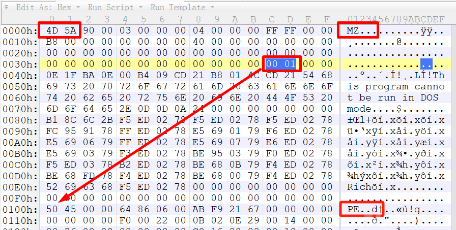

DOS Stub 在多数情况下由汇编器/编译器自动生成，由代码和数据混合而成，大小不固定，在不支持 PE 文件格式的操作系统中，它将简单显示一个错误提示。不需要过多关注，在 Windows OS 下不会运行这部分代码，但在DOS环境中可以运行。

### NT头

`NT` 头是 PE 文件的核心部分，也是 PE 头的一部分，包含了有关可执行文件的重要信息。PE 头的开始位置由 DOS 头中的 e\_lfanew 字段指定。在 32 位下这个结构体由一个 0xf8 大小的 `IMAGE_NT_HEADERS` 结构体组成，该结构中包含了 PE 文件被载入内存时需要用到的重要域，该结构体的大小为0xf8字节，如下

```
typedef struct _IMAGE_NT_HEADERS {
    DWORD Signature;  // PE签名，0x4字节
    IMAGE_FILE_HEADER FileHeader;  // PE头，0x14字节
    IMAGE_OPTIONAL_HEADER32 OptionalHeader;  // PE可选头
} IMAGE_NT_HEADERS32, *PIMAGE_NT_HEADERS32;

```

其中的 PE 头 结构体 `IMAGE_FILE_HEADER` 成员如下，它们各自的作用详见注释

```
typedef struct _IMAGE_FILE_HEADER {
    WORD Machine;  // 目标机器的类型码，如x86或ARM
    WORD NumberOfSections;  // 文件中节(section)的数量
    DWORD TimeDateStamp;  // 文件创建或最后修改的时间戳
    DWORD PointerToSymbolTable;  // 指向文件中符号表的偏移地址
    DWORD NumberOfSymbols;  // 符号表中符号条目的数量
    WORD SizeOfOptionalHeader;  // 可选头的大小，用于存储扩展的文件信息
    WORD Characteristics;  // 文件特性标志，指DLL、应用程序、可执行文件等
} IMAGE_FILE_HEADER, *PIMAGE_FILE_HEADER;

```

其中的 PE 可选头结构体 `IMAGE_OPTIONAL_HEADER32` 成员如下，它们各自的作用详见注释

```
#define IMAGE_NUMBEROF_DIRECTORY_ENTRIES 16  // 数据目录项数，固定为16

typedef struct _IMAGE_OPTIONAL_HEADER {
    // 标准域
    WORD Magic;  // 可选头类型，0x10表示32位，0x20表示64位
    BYTE MajorLinkerVersion;  // 主链接器的版本号，以字节为单位
    BYTE MinorLinkerVersion;  // 副链接器的版本号，以字节为单位
    DWORD SizeOfCode;  // 代码段大小，以字节为单位
    DWORD SizeOfInitializedData;  // 初始化数据段大小，以字节为单位
    DWORD SizeOfUninitializedData;  // 未初始化数据段大小，以字节为单位
    DWORD AddressOfEntryPoint;  // 程序入口点地址，相对于ImageBase
    DWORD BaseOfCode;  // 代码段起始基址RVA
    DWORD BaseOfData;  // 数据段起始基址RVA

    // NT附加域
    DWORD ImageBase;  // 镜像基址，即加载到内存的起始地址
    DWORD SectionAlignment;  // 节在内存中的对齐大小，以字节为单位
    DWORD FileAlignment;  // 节在文件中的对齐大小，以字节为单位
    WORD MajorOperatingSystemVersion;  // 主操作系统版本号
    WORD MinorOperatingSystemVersion;  // 副操作系统版本号
    WORD MajorImageVersion;  // 主镜像版本号
    WORD MinorImageVersion;  // 副镜像版本号
    WORD MajorSubsystemVersion;  // 主子系统版本号
    WORD MinorSubsystemVersion;  // 副子系统版本号
    DWORD Win32VersionValue;  // Win32版本值，通常为0
    DWORD SizeOfImage;  // 镜像在内存中的大小，以字节为单位
    DWORD SizeOfHeaders;  // PE头物理大小，以字节为单位
    DWORD CheckSum;  // 校验和，用于验证镜像的完整性
    WORD Subsystem;   // 子系统类型
    WORD DllCharacteristics;  // DLL特性标志，指示文件是DLL、应用程序等
    DWORD SizeOfStackReserve;  // 运行时为每个线程栈保留的内存大小
    DWORD SizeOfStackCommit;  // 运行时每个线程栈初始占用的内存大小
    DWORD SizeOfHeapReserve;  // 运行时为进程堆保留的内存大小
    DWORD SizeOfHeapCommit;  // 运行时进程堆初始占用的内存大小
    DWORD LoaderFlags;  // 载入器标志，通常为0
    DWORD NumberOfRvaAndSizes;  // 数据目录的项数，固定为IMAGE_NUMBEROF_DIRECTORY_ENTRIES的值
    IMAGE_DATA_DIRECTORY DataDirectory[IMAGE_NUMBEROF_DIRECTORY_ENTRIES];  // 数据目录数组
} IMAGE_OPTIONAL_HEADER32, *PIMAGE_OPTIONAL_HEADER32;

```

### 节表区

节表描述了 PE 文件中各个节的布局和属性，其位于 NT 头之后，也是 PE 头的最后一个部分

节区表记录了 PE 文件中所有节区的相关属性，节区表由一系列的 `IMAGE_SECTION_HEADER` 结构排列而成，每个结构用来描述一个节，结构的排列顺序和它们描述的节在文件中的排列顺序是一致的。全部有效结构的最后以一个空的 `IMAGE_SECTION_HEADER` 结构作为结束，所以节表中 `IMAGE_SECTION_HEADER` 结构数量等于节的数量加一。`IMAGE_SECTION_HEADER` 结构体大小为 0x28 字节

### PE 文件其余特定区域

再继续往下便是真真正正的 `text` 节，`data` 节，`rsrc` 节。以及数据目录表、导入表、导出表、资源表、重定位表、甚至还有其他自定义部分，如 `TLS` 表（线程局部存储表）、加载配置表 (Load Configuration Table) 等，这些部分包含了各种附加信息和配置…

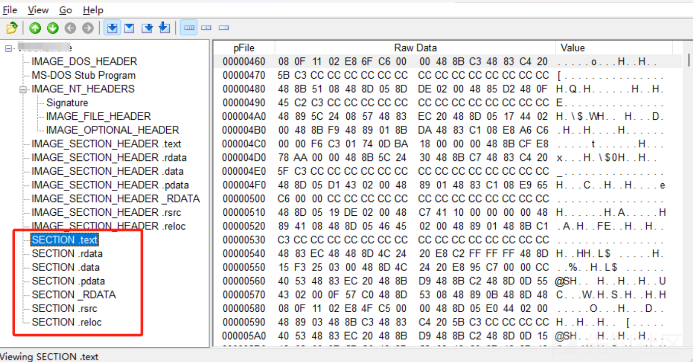

然后补充一下 `.relocation` 节，该节的前八字节记录了节的 RVA 和**需要进行重定位或修改的条目数量**，每一项都记录了哪些 RVA 地址下的**硬编码寻址**在加载进内存时是需要进行重定位的

### 导入表&导出表

最后着重讲解一下 PE 文件的导入表和导出表，在 Windows 程序逆向中，我们能从这两个表中获取到许多非常重要信息

**导入表：**每个 exe 或者 dll 一般都会有它的导入表，记录了其自身会使用到的其他模块导出的函数。即记录调用了哪些模块 (dll)，以及调用了它里面的哪些函数

导入表的意义是确定 PE 文件依赖哪个模块的哪个函数，以及确定模块加载进内存后具体函数的地址一个导入表的大小是 0x14 字节，结构体如下

```
typedef struct _IMAGE_IMPORT_DESCRIPTOR {
    union {
        DWORD   Characteristics;            // 0 for terminating null import descriptor
        DWORD   OriginalFirstThunk;         // RVA to original unbound IAT (PIMAGE_THUNK_DATA) 指向IAT结构注释表明了
    } DUMMYUNIONNAME;
    DWORD   TimeDateStamp;                  // 时间戳.
    DWORD   ForwarderChain;                 // -1 if no forwarders
    DWORD   Name;　　　　　　　　　　　　　　　//指向 DLL 名字的 RVA 地址
    DWORD   FirstThunk;                     // RVA to IAT (if bound this IAT has actual addresses)
} IMAGE_IMPORT_DESCRIPTOR;

typedef IMAGE_IMPORT_DESCRIPTOR UNALIGNED *PIMAGE_IMPORT_DESCRIPTOR;

```

导入表跟导出表不同，导出表只有一个，里面有子表进行记录。而导入表是依赖每的一个模块都会有一个对应的导入表

**导出表：**记录导出符号的地址、名称、序号。一般来说**需要提供功能的二进制程序（一般为 dll 文件）才会有导出表**，可以通过导出表分析如下信息：

1. 此动态链接库文件提供了什么功能
2. 向调用者提供输出函数（供使用者调用的函数）在模块中的起始地址

导入表中需要重点关注的三个成员：

* **DUMMYUNIONNAME&FirstThunk**  
  这两个成员用于确定依赖的函数的名称。DUMMYUNIONNAME 指向 INT (导入名称表, Improt Name Table)；FirstThunk 指向 IAT（导入地址表, Improt Address Table, 类似 elf 的 GOT 表）


* **Name**  
  用于确定依赖的模块的名字。记录一个 RVA 地址，指向依赖的模块的名字（如"xx.dll"）这个字符串

在逆向分析中，我们可以通过 dll 名和 dll 导出函数的名字得到这个函数的地址，当然也可以通过代码获取，有很多 API 可供我们进行调用，如下

1. 通过 Loadlibrary(GetModelHandle) 将 dll 模块映射进内存并返回一个可以被 GetProcAddress 函数使用的句柄
2. 利用 GetProcAddress 函数获得 dll 的加载地址，然后遍历导出表就可以得到函数地址

判断导出函数是以序号导出还是以名称导出的方法：遍历序号表，判断地址表的下标有没有存在与序号表中，存在就说明是以名称导出，不存在就说明是以序号导出

## PE文件手工压缩

在了解了 PE 文件各字段作用后，我们用一个十分简单的程序练练手

目标：通过保留必要特征、删除冗余数据和适当进行空间复用等方式，在不破坏程序原本功能的前提下手工压缩 PE 文件，通过直接对字节码一个个地进行处理，能让我们对 PE 文件有更深入的理解

本节要压缩的 PE 文件在附件里给出，供大家复现。程序逻辑非常简单，直接运行即可看出，就是调库函数来弹两个对话窗口

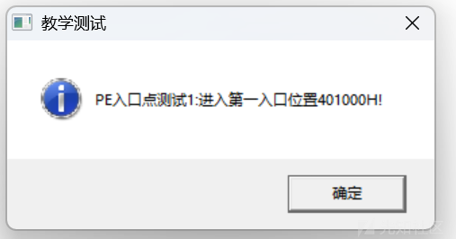

下面开始记录对这个文件的分析和一步步实现手工压缩的过程。先是介绍各个部分要修改、要注意的地方，然后是说明一下以 “在修改文件对齐方式后删除冗余数据” 为主要思路来压缩PE文件的做法

### PE文件各部分分析

#### 0x00 - DOS头+DOS\_Stub

首先是开头 0x4 字节的 MZ 头不能动，然后 0x3C 的地方需要指向 NT 头的 PE 签名，除了这两个地方，DOS 头和 DOS\_Stub 的其他部分都可以删了，笔者将这些字节全都标识为1后程序依旧正常运行

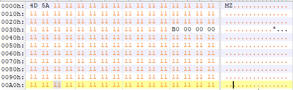

#### 0xb0 - NT头

NT 头的前六个字节不能动，分别是四个字节的 PE 签名、两个字节的 CPU 的 Machine 码，然后是两个字节的节区数目

（下面开始以 pfile 的地址来说明）0xC4 的可选头大小为固定值 0xe0 (0xc8-0x1a8=0xe0)

再往下，文件信息标志不能动，0xC8 开始是可选头，前两个字节的可选头类型不能动。然后就到了 0xD8 的 **Address of Entry Point**，指向程序入口 RVA，这个千万不能修改错。0xE4 的镜像基址不能动，0xE8 和 0xEC 的两个**对齐大小**需要注意。0xF8 的主子系统版本号不能动，0x100 的镜像在内存中大小，感觉改大了无所谓，别改小了导致不够用就行，这后面的 **Size of Headers** 标识着 PE 头的大小，要注意修改，不然就无法寻址到后面的节区了。0x10C 开始的两个字节的子系统号和两个字节的 DLL 标志不能动，0x124 是数据目录项数，是能改的，而且这个程序只需要导入表和导入地址表，但是一改就报错，所以先没管了... 然后**这两个表的 rva 和 size** 都是要去修改的，它俩的相对偏移也不能变

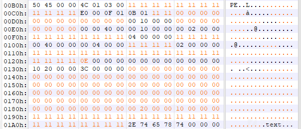

#### 0x1A8 - 节表

这个程序有三个节，自然就有三个节表，分别是 .text 节表，.rdata 节表，.data 节表

这三个表的前八个字节都别去动，后面的真实大小不用管，要修改的是 RVA, Size, Pointer, 然后最后的四个字节的特征值也不能改，其他的都无所谓，每一个节表头都是这样

#### 0x400 - .text

注意改这些 rva 地址，分析的方法是丢进 ida 去看代码段的每一句汇编代码分别对应了什么字节码，对比着就很容易把这些直接寻址的地方找出来，要注意的是最后两个地址其实是与 .rdata 段存储的 dll 的名字有关的

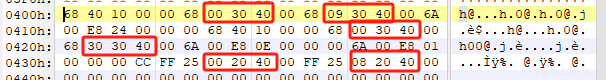

#### 0x600 - .rdata

同样是丢进 ida 看，注意改这些 rva 地址，慢慢去算要修正成什么 rva，得跟压缩前的指向同样的地方，改错了就无法寻址到了

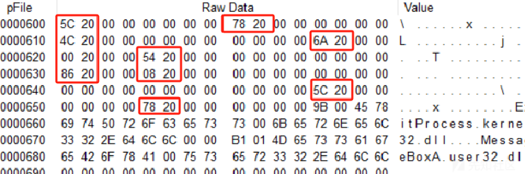

#### 0x800 - .data

不需要做任何修改

### 开始压缩

先删除 DOS\_Stub，修改 0x3C 处的 RVA 地址指向新的 PE 头，然后 NT 头基本都不用动，删除多余的0后，就看着改下 `Address of Entry Point`, `Section Alignment`, `File Alignment`, `Size of Image`, `Size of Headers`, 然后是 `IMPORT Table` 和 `IMPORT Address Table` 的 RVA 和 Size

对齐方式的话，两个都改成 0x4，这是最小的对齐单位了，另外，对齐方式设成一样其实对后续修改文件也有好处，这样 pflie 就和 rva 就一致了，改一些直接寻址的地方就不用考虑这么多了，毕竟有寻址的地方要做修改的话，找到目标位置看 pfile 是多少就改成多少就好

最后的三个节表按上述分析里说的 去改相应的地方，代码节和数据节删除掉多余的部分后，也是按上面分析中的图去修改红框处那些 rva 地址，最后修改完是**732字节**，如图所示

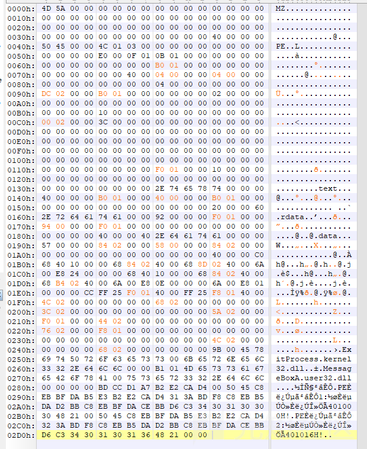

### 记录下踩过的坑

#### NT头

NT 头里的 `Size of Headers` 要看好来改，不然直接找不到下面那些块了，数据表的 `IMPORT Address Table` 里的东西也是要改的，这个比较容易遗漏

#### .rdata

rdata 节里面，直接把后面的所有 `\x00` 都删掉是不可以的，笔者一开始改的时候就注意到一个问题，发现如果把后面的 `\x00` 都删掉了，最后面存储的库名就会和 data 段的数据拼接起来，这样的话去进行字符串匹配肯定是会出问题的，所以得要 `\x00` 来截断，果不其然，去看了下 .rdata 的真实大小是 0x92，这就是原程序为什么非要多加两个 `\x00` 在后面了，所以我们修改的 .rdata 的 `Size of Raw Data` 得是 0x94，用 `\x00` 补齐

### 后续的压缩思路

想要继续往下压缩就得走别的思路了，首先可以看见还有很多没有用到的标识成 `\x00` 的数据，但是又删不得，就好比，头有用，尾有用，如果删掉了中间部分，头尾拼接在一起，就不能用 ”头+偏移“ 的方式去寻址到尾了，所以情况的这种核心思路就是**见缝插针**，即将有用的数据填充到一个都是 `\x00` 的新地方，然后修改索引这些数据的指针指向这个新的地址

其次就是靠合并，比如将 DOS 头和 NT 头合二为一；以及将数据节和代码节合二为一，这样能省下一个节表的空间....

## 代码注入

拿来练手的对象是 Windows XP 下的扫雷程序，使用 IDA 进行代码注入；最后当程序运行时，首先运行注入的代码，然后再恢复程序正常功能，运行正常的扫雷程序

### 针对PE文件的代码注入

首先在数据段找一段空白处插入字符串

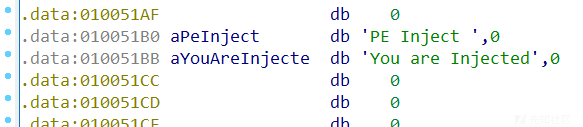

找一段有可执行权限的内存注入指令，调用 `call MessageBoxA` 需要通过动态调试查看相应函数在动态链接库的地址

```
push 0
push 0x010051B0
push 0x010051BB
push 0
call near ptr 77D507EAh
jmp 0x1003E21
```

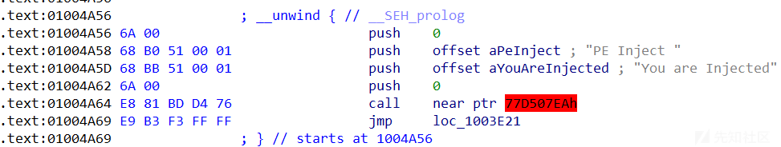

使用 010editor 打开程序，直接修改程序入口地址为注入的恶意代码的 rva

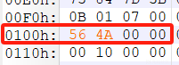

成功劫持


### 针对DLL文件的代码注入

或者对 DLL 进行代码注入，方法是通过 `Process Monitor` 查看程序依赖的 DLL 文件，一般找系统 DLL，很好找，因为这些程序都会调用到系统 API，找到目标 DLL 后（这里仅讲解通用流程），使用`AHeadLib.Net` 工具生成源码模板

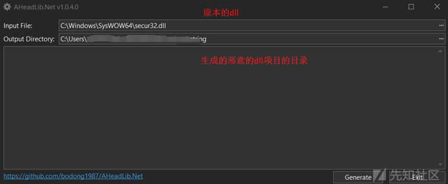

在 `UserImplementations.cpp` 文件中的 `__ExecuteUserCutomCodes` 函数中添加测试代码 `system("calc.exe")` 后进行编译


将生成的 DLL 文件拷贝到与需要劫持的目标程序的同级目录中（在导入 DLL 时会优先找同级目录下的文件）

运行目标程序，在它载入 DLL 文件时，一定会执行到我们注入的恶意代码，测试时发现能够弹出多个计算机，效果如下

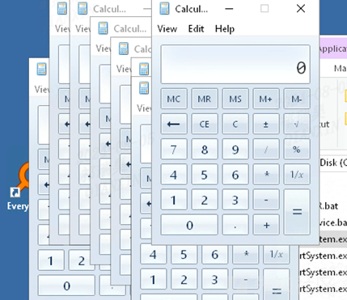
