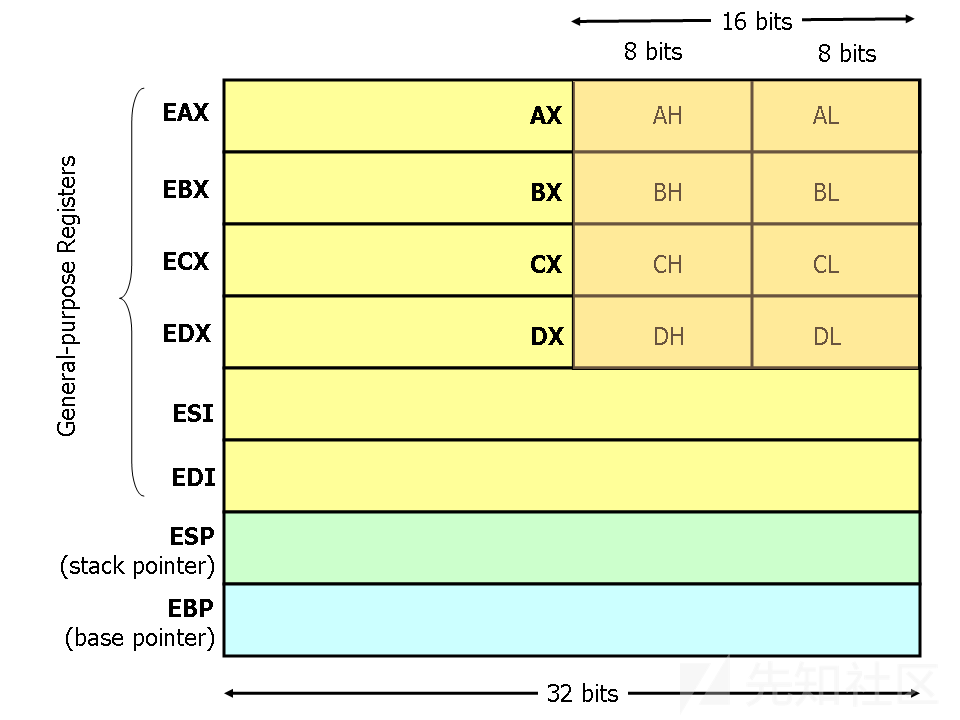
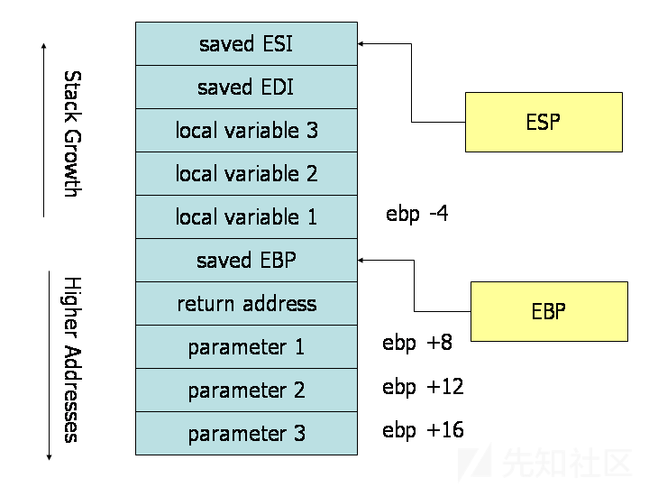
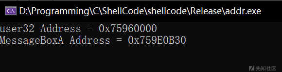
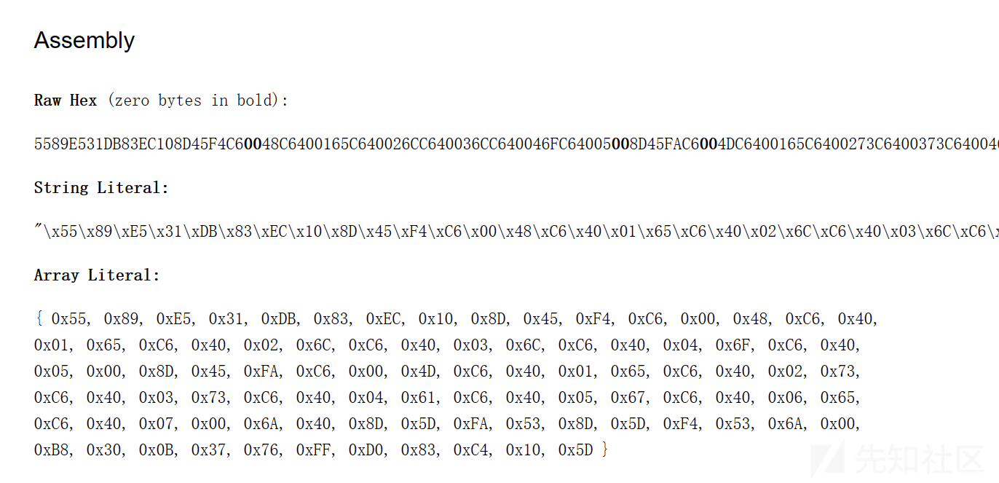

# x86汇编与编写shellcode-先知社区

> **来源**: https://xz.aliyun.com/news/16063  
> **文章ID**: 16063

---

# 前言

**Shellcode** 是一种用于计算机安全领域的代码，它通常用于软件漏洞利用的载荷。这种代码被称为 "shellcode" 是因为它经常用来启动命令终端，从而允许攻击者控制受害计算机。然而，任何执行类似任务的代码片段都可以被称为 shellcode。Shellcode 通常以机器码的形式编写，因此需要对硬编码有所了解。

# x86汇编

## 寄存器

现代（即 386 及更高版本）x86处理器具有8个32位通用寄存器，如图1所示。这些寄存器大多具有历史意义。例如，*EXA* 以前称为累加器（accumulator），因为它被许多算术运算使用，而*ECX* 称为计数器（counter），因为它用于保存循环索引。虽然大多数寄存器在现代指令集中已经失去了其特殊用途，但按照惯例，仍然有两个寄存器保留用于特殊用途——栈指针（*ESP*）和基址指针（*EBP*）。

对于 EAX、EBX、ECX 和 EDX 寄存器，可以使用子寄存器。例如，EAX 寄存器的最低有效 2 字节可以作为一个 16 位寄存器 AX 来使用。AX 的最低有效字节可以作为一个 8 位寄存器 AL，而 AX 的最高有效字节可以作为一个 8 位寄存器 AH。这些名称都指的是同一个物理寄存器。当一个 2 字节的量被放入 DX 时，这一更新会影响 DH、DL 和 EDX 的值。这些子寄存器主要是从较早的 16 位指令集版本遗留下来的。然而，当处理小于 32 位的数据时（例如 1 字节的 ASCII 字符），它们有时会很方便。

在汇编语言中，提到寄存器时，名称不区分大小写。例如，EAX 和 eax 指的是同一个寄存器。



## 内存和寻址模式

### 声明静态数据区域

您可以使用特殊的汇编指令在 x86 汇编中声明静态数据区域（类似于全局变量）。数据声明应该以

*.DATA*指令开头。在该指令之后，可以使用 DB、DW 和 DD 指令分别声明 1 字节、2 字节和 4 字节的数据位置。声明的位置可以使用名称进行标记，供后续引用——这类似于通过名称声明变量，但遵循一些低级规则。例如，顺序声明的位置将被安排在内存中紧邻彼此。

示例声明：

```
.DATA
var DB 64   ; 声明一个字节，称为位置 var，包含值 64。
var2    DB ?    ; 声明一个未初始化的字节，称为位置 var2。
DB 10   ; 声明一个没有标签的字节，包含值 10。它的位置是 var2 + 1。
X   DW ?    ; 声明一个 2 字节的未初始化值，称为位置 X。
Y   DD 30000        ; 声明一个 4 字节的值，称为位置 Y，初始化为 30000。

```

与高级语言中的数组可以有多维并通过索引访问不同，x86 汇编语言中的数组仅仅是位于内存中连续的一系列单元。可以通过列出值来声明数组，如下例所示。声明数据数组的两种常见方法是 DUP 指令和使用字符串字面量。DUP 指令告诉汇编器将一个表达式复制指定的次数。例如，`4 DUP(2)` 等效于 `2, 2, 2, 2`。

一些示例：

```
Z   DD 1, 2, 3  ; 声明三个 4 字节的值，初始化为 1、2 和 3。位置 Z + 8 的值为 3。
bytes   DB 10 DUP(?)    ; 声明从位置 bytes 开始的 10 个未初始化字节。
arr DD 100 DUP(0)       ; 声明从位置 arr 开始的 100 个 4 字节的字，初始化为 0。
str DB 'hello',0    ; 声明从地址 str 开始的 6 个字节，初始化为 hello 的 ASCII 字符值和空字符（0）。

```

内存寻址

现代 x86 兼容处理器能够寻址最多 2^32 字节的内存：内存地址为 32 位宽。在上面的示例中，我们使用标签来引用内存区域，这些标签实际上被汇编器替换为指定内存地址的 32 位数值。除了通过标签（即常量值）引用内存区域之外，x86 还提供了一种灵活的内存地址计算和引用方案：最多可以将两个 32 位寄存器和一个 32 位带符号常量相加来计算内存地址。可以选择将其中一个寄存器预乘以 2、4 或 8。

寻址模式可以与许多 x86 指令一起使用（将在下一部分中描述它们）。在这里，我们通过一些使用 `mov` 指令的示例来说明地址计算。该指令有两个操作数：第一个是目标，第二个指定源。

以下是一些使用地址计算的 `mov` 指令示例：

```
mov eax, [ebx]  ; 将 EBX 中地址的 4 字节数据移动到 EAX。
mov [var], ebx  ; 将 EBX 中的内容移动到地址 var 的 4 字节内存中。（注意，var 是一个 32 位常量）。
mov eax, [esi-4]    ; 将内存地址 ESI + (-4) 处的 4 字节数据移动到 EAX 中。
mov [esi+eax], cl   ; 将 CL 寄存器中的内容移动到地址 ESI+EAX 处的字节中。
mov edx, [esi+4*ebx]    ; 将地址 ESI+4*EBX 处的 4 字节数据移动到 EDX 中。

```

一些无效的地址计算示例如下：

```
mov eax, [ebx-ecx]  ; 只能将寄存器值相加
mov [eax+esi+edi], ebx      ; 地址计算最多支持 2 个寄存器

```

大小指令

一般来说，可以从汇编代码指令中推断出给定内存地址的数据项的预期大小。例如，在上面的所有指令中，可以通过寄存器操作数的大小推断出内存区域的大小。当我们加载一个 32 位寄存器时，汇编器可以推断出我们所引用的内存区域是 4 字节宽的。当我们将一个 1 字节寄存器的值存储到内存时，汇编器可以推断出我们希望该地址指向内存中的一个字节。

然而，在某些情况下，引用的内存区域的大小是不明确的。考虑指令 `mov [ebx], 2`。此指令是将值 2 移入地址 EBX 处的单个字节吗？还是应将值 2 的 32 位整数表示移入地址 EBX 开头的 4 字节中？由于这两种解释都是有效的，汇编器必须明确指示哪种解释是正确的。大小指令 `BYTE PTR`、`WORD PTR` 和 `DWORD PTR` 就是为了这个目的，分别表示 1 字节、2 字节和 4 字节的大小。

例如：

```
mov BYTE PTR [ebx], 2   ; 将 2 移入地址 EBX 处的单个字节。
mov WORD PTR [ebx], 2   ; 将 2 的 16 位整数表示移入地址 EBX 开头的 2 字节。
mov DWORD PTR [ebx], 2      ; 将 2 的 32 位整数表示移入地址 EBX 开头的 4 字节。

```

### 指令

机器指令通常分为三类：数据移动、算术/逻辑运算和控制流指令。在本节中，我们将重点介绍每一类中重要的 x86 指令。

我们使用以下符号：

* `<reg32>`：任何 32 位寄存器（EAX、EBX、ECX、EDX、ESI、EDI、ESP 或 EBP）
* `<reg16>`：任何 16 位寄存器（AX、BX、CX 或 DX）
* `<reg8>`：任何 8 位寄存器（AH、BH、CH、DH、AL、BL、CL 或 DL）
* `<reg>`：任何寄存器
* `<mem>`：内存地址（例如，[eax]、[var + 4] 或 dword ptr [eax+ebx]）
* `<con32>`：任何 32 位常量
* `<con16>`：任何 16 位常量
* `<con8>`：任何 8 位常量
* `<con>`：任何 8、16 或 32 位常量

### 数据移动指令

**mov — 移动**（操作码：88, 89, 8A, 8B, 8C, 8E, ...）

`mov` 指令将其第二个操作数（即寄存器内容、内存内容或常量值）复制到第一个操作数所指示的位置（即寄存器或内存）。虽然寄存器到寄存器的移动是可能的，但直接的内存到内存移动是不允许的。在需要进行内存传输的情况下，必须首先将源内存内容加载到寄存器中，然后才能将其存储到目标内存地址。

语法：

```
mov <reg>, <reg>
mov <reg>, <mem>
mov <mem>, <reg>
mov <reg>, <const>
mov <mem>, <const>

```

示例：

```
mov eax, ebx — 将 EBX 中的值复制到 EAX。
mov byte ptr [var], 5 — 将值 5 存储到位置 var 的字节中。

```

**push — 压栈**（操作码：FF, 89, 8A, 8B, 8C, 8E, ...）

`push` 指令将其操作数放入硬件支持的栈顶。具体来说，`push` 首先将 ESP 减少 4，然后将其操作数放入地址 `[ESP]` 的 32 位位置中。由于 x86 栈是向下增长的——即栈从高地址向低地址增长，因此 `push` 指令会减小 ESP。

语法：

```
push <reg32>
push <mem>
push <con32>

```

示例：

```
push eax — 将 EAX 压入栈中。
push [var] — 将地址 var 处的 4 字节数据压入栈中。

```

**pop — 弹栈**

`pop` 指令将硬件支持的栈顶的 4 字节数据移到指定的操作数（即寄存器或内存位置）中。它首先将位于内存地址 `[SP]` 处的 4 字节数据移动到指定的寄存器或内存位置中，然后将 SP 增加 4。

语法：

```
pop <reg32>
pop <mem>

```

示例：

```
pop edi — 将栈顶元素弹入 EDI。
pop [ebx] — 将栈顶元素弹入位于地址 EBX 开头的内存中的 4 字节。

```

**lea — 装载有效地址**

`lea` 指令将其第二个操作数指定的地址放入其第一个操作数指定的寄存器中。注意，它不会加载内存位置的内容，只会计算并将有效地址放入寄存器中。这对于获取内存区域的指针非常有用。

语法：

```
lea <reg32>, <mem>

```

示例：

```
lea edi, [ebx + 4*esi] — 计算 EBX + 4*ESI 的值并将其存入 EDI。
lea eax, [var] — 将 var 中的值放入 EAX。
lea eax, [val] — 将 val 的值放入 EAX。

```

### 算术和逻辑指令

**add — 整数加法**

`add` 指令将两个操作数相加，并将结果存储在第一个操作数中。注意，尽管两个操作数可以是寄存器，但至多只有一个操作数可以是内存位置。

语法：

```
add <reg>, <reg>
add <reg>, <mem>
add <mem>, <reg>
add <reg>, <con>
add <mem>, <con>

```

示例：

```
add eax, 10 — 将 10 加到 EAX 中。
add BYTE PTR [var], 10 — 将 10 加到存储在内存地址 var 处的单个字节中。

```

**sub — 整数减法**

`sub` 指令将第一个操作数减去第二个操作数，并将结果存储在第一个操作数中。用法与 `add` 相同。

语法：

```
sub <reg>, <reg>
sub <reg>, <mem>
sub <mem>, <reg>
sub <reg>, <con>
sub <mem>, <co

```

示例：

```
sub al, ah — 将 AL 减去 AH。
sub eax, 216 — 从 EAX 中减去 216。

```

**inc, dec — 自增，自减**

`inc` 指令将操作数的内容加 1，`dec` 指令将操作数的内容减 1。

语法：

```
inc <reg>
inc <mem>
dec <reg>
dec <mem>

```

示例：

```
dec eax — 将 EAX 减 1。
inc DWORD PTR [var] — 将位置 var 中的 32 位整数加 1。

```

**imul — 整数乘法**

`imul` 指令有两种基本格式：双操作数（前两种语法）和三操作数（后两种语法）。

双操作数形式将两个操作数相乘，并将结果存储在第一个操作数中，结果操作数必须是寄存器。

三操作数形式将第二和第三个操作数相乘，并将结果存储在第一个操作数中。结果操作数必须是寄存器，且第三个操作数必须是常量值。

语法：

```
imul <reg32>, <reg32>
imul <reg32>, <mem>
imul <reg32>, <reg32>, <con>
imul <reg32>, <mem>, <con>

```

示例：

```
imul eax, [var] — 将 EAX 的内容与内存位置 var 中的 32 位内容相乘，并将结果存储在 EAX 中。
imul esi, edi, 25 — 将 EDI 乘以 25，并将结果存储在 ESI 中。

```

**idiv — 整数除法**

`idiv` 指令将 64 位整数 EDX:EAX（将 EDX 视为高 4 字节，EAX 视为低 4 字节）除以指定的操作数值。商的结果存储在 EAX 中，余数存储在 EDX 中。

语法：

```
idiv <reg32>
idiv <mem>

```

示例：

```
idiv ebx — 将 EDX:EAX 中的内容除以 EBX 中的内容，商存入 EAX，余数存入 EDX。
idiv DWORD PTR [var] — 将 EDX:EAX 中的内容除以存储在内存地址 var 处的 32 位值，商存入 EAX，余数存入 EDX。

```

**and, or, xor — 按位逻辑与、或和异或**

这些指令对操作数执行指定的逻辑操作（按位与、按位或和按位异或），并将结果存储在第一个操作数的位置。

语法：

```
and <reg>, <reg>
and <reg>, <mem>
and <mem>, <reg>
and <reg>, <con>
and <mem>, <con>

or <reg>, <reg>
or <reg>, <mem>
or <mem>, <reg>
or <reg>, <con>
or <mem>, <con>

xor <reg>, <reg>
xor <reg>, <mem>
xor <mem>, <reg>
xor <reg>, <con>
xor <mem>, <con>

```

示例：

```
and eax, 0fH — 清除 EAX 中除了最后 4 位以外的所有位。
xor edx, edx — 将 EDX 的内容置为零。

```

**not — 按位逻辑非**

对操作数内容进行逻辑取反（即翻转操作数中所有的位值）。

语法：

```
not <reg>
not <mem>

```

示例：

```
not BYTE PTR [var] — 对内存地址 var 处的字节的所有位进行取反。

```

**neg — 取负**

执行操作数内容的二进制补码取负。

语法：

```
neg <reg>
neg <mem>

```

示例：

```
neg eax — EAX → -EAX

```

**shl, shr — 左移、右移**

这些指令将操作数内容的位向左或向右移动，并用零填充移出的空位。移位的操作数最多可以移动 31 位。移位的位数由第二个操作数指定，可以是 8 位常量或寄存器 CL。在这两种情况下，移位的次数大于 31 时，会执行模 32 的移位。

语法：

```
shl <reg>, <con8>
shl <mem>, <con8>
shl <reg>, <cl>
shl <mem>, <cl>

shr <reg>, <con8>
shr <mem>, <con8>
shr <reg>, <cl>
shr <mem>, <cl>

```

示例：

```
shl eax, 1 — 将 EAX 的值乘以 2（如果最高有效位为 0）。
shr ebx, cl — 将 EBX 中的值除以 2^n，其中 n 是 CL 中的值，并将结果存入 EBX。

```

### 控制流指令

x86 处理器维护一个指令指针（IP）寄存器，这是一个 32 位的值，指示当前指令在内存中的起始位置。通常，在执行完一条指令后，IP 寄存器会增加，指向下一条指令所在的内存位置。IP 寄存器不能直接操作，但通过控制流指令会隐式更新。

我们使用 `<label>` 表示程序文本中的标号位置。标号可以通过在 x86 汇编代码中插入一个标签名，后跟冒号来添加。例如：

```
mov esi, [ebp+8]
begin: xor ecx, ecx
      mov eax, [esi]

```

在这个代码片段中，第二条指令被标记为 `begin`。在代码的其他部分，我们可以通过更方便的符号名称 `begin` 来引用该指令在内存中的位置。此标号只是用来表示位置的一种便捷方式，而不是 32 位值。

**jmp — 跳转**

将程序控制流转移到操作数所指示的内存位置的指令。

语法：

```
jmp <label>

```

示例：

```
jmp begin — 跳转到标记为 `begin` 的指令。

```

**jcondition — 条件跳转**

这些指令是基于机器状态字中的一组条件码的条件跳转。机器状态字包含关于上次算术操作的信息。例如，机器状态字的某一位指示上次操作的结果是否为零，另一位指示结果是否为负数。根据这些条件码，可以执行一系列条件跳转。例如，`jz` 指令会在上次算术操作的结果为零时跳转到指定的操作数标号，否则程序将继续执行下一条指令。

许多条件跳转的指令是基于特殊的比较指令 `cmp`（见下文）执行的。例如，条件跳转如 `jle` 和 `jne`，通常是在执行 `cmp` 操作后进行的。

语法：

```
je <label> (当相等时跳转)
jne <label> (当不相等时跳转)
jz <label> (当上次结果为零时跳转)
jg <label> (当大于时跳转)
jge <label> (当大于或等于时跳转)
jl <label> (当小于时跳转)
jle <label> (当小于或等于时跳转)

```

示例：

```
cmp eax, ebx
jle done

```

如果 EAX 中的内容小于或等于 EBX 中的内容，则跳转到标记为 `done` 的位置。否则，继续执行下一条指令。

**cmp — 比较**

比较两个操作数的值，并根据比较结果设置机器状态字中的条件码。此指令等价于 `sub` 指令，但比较结果不会替换第一个操作数，而是丢弃。

语法：

```
cmp <reg>, <reg>
cmp <reg>, <mem>
cmp <mem>, <reg>
cmp <reg>, <con>

```

示例：

```
cmp DWORD PTR [var], 10
jeq loop

```

如果存储在内存地址 `var` 处的 4 字节数据等于常量 10，则跳转到标记为 `loop` 的位置。

**call, ret — 子程序调用与返回**

这些指令实现了子程序的调用和返回。`call` 指令首先将当前代码位置压入硬件支持的内存栈中（有关详细信息请参见 `push` 指令），然后执行无条件跳转到由标签操作数指定的代码位置。与简单的跳转指令不同，`call` 指令会保存子程序完成后的返回地址。

`ret` 指令实现了子程序的返回机制。此指令首先从硬件支持的内存栈中弹出代码位置（有关详细信息请参见 `pop` 指令），然后执行无条件跳转到检索到的代码位置。

语法：

```
call <label>
ret

```

**调用约定**

为了让不同的程序员共享代码并开发可供多个程序使用的库，同时简化子程序的使用，程序员通常会采用一种共同的调用约定。调用约定是一种关于如何调用和返回子程序的协议。例如，给定一组调用约定规则，程序员无需检查子程序的定义就能确定参数应该如何传递给该子程序。此外，给定一组调用约定规则，可以使高级语言编译器遵循这些规则，从而使手写的汇编语言子程序和高级语言子程序能够相互调用。

实际上，有许多不同的调用约定。我们将使用广泛应用的 C 语言调用约定。遵循这一约定，可以让你编写能够安全地从 C（或 C++）代码中调用的汇编语言子程序，也可以使你在汇编语言代码中调用 C 库函数。

C 调用约定高度依赖于硬件支持的栈操作。它基于 `push`、`pop`、`call` 和 `ret` 指令。子程序的参数通过栈传递。寄存器在栈上保存，子程序使用的局部变量也放置在栈中的内存位置。绝大多数在大多数处理器上实现的高级过程式语言都采用了类似的调用约定。

调用约定分为两组规则。第一组规则由调用子程序的调用者遵循，第二组规则由子程序的编写者（被调用者）遵守。需要强调的是，若不遵守这些规则，可能会导致程序出现致命错误，因为栈会处于不一致的状态。因此，在实现自己的子程序调用约定时，必须格外小心。



**调用者规则**

为了调用子程序，调用者应当：

1. 在调用子程序之前，调用者应保存一些被指定为调用者保存的寄存器的内容。调用者保存的寄存器包括 EAX、ECX 和 EDX。由于被调用的子程序可以修改这些寄存器，如果调用者在子程序返回后依赖这些寄存器的值，调用者必须将这些寄存器的值压入栈中（以便在子程序返回后恢复）。
2. 要将参数传递给子程序，调用者应在调用之前将参数压入栈中。参数应以反转顺序压栈（即最后一个参数先压栈）。由于栈是向下生长的，第一个参数将存储在最低的内存地址（这种参数反转顺序在历史上用于允许函数接受可变数量的参数）。
3. 使用 `call` 指令来调用子程序。该指令将返回地址放置在参数之上，并跳转到子程序代码，调用子程序，子程序应遵循下面的被调用者规则。

子程序返回后（即 `call` 指令之后），调用者可以期望在寄存器 EAX 中找到子程序的返回值。为了恢复机器状态，调用者应当：

1. 从栈中移除参数。这会恢复栈在调用前的状态。
2. 通过从栈中弹出值来恢复调用者保存的寄存器（EAX、ECX、EDX）的内容。调用者可以假定子程序没有修改其他寄存器。

**被调用者规则**

子程序的定义应遵循以下规则：

* **保存旧的基址指针：** 在子程序开始时，先将 EBP 的值压入堆栈，然后使用以下指令将 ESP 的值复制到 EBP 中：

```
push ebp
mov  ebp, esp

```

这个初始动作保持了基址指针 EBP。基址指针用于通过固定的偏移量来查找堆栈上的参数和局部变量。子程序执行时，EBP 保持了子程序开始执行时的栈指针值。参数和局部变量始终位于基址指针值的已知偏移量位置。我们在子程序开始时压入旧的基址指针值，以便在子程序返回时为调用者恢复基址指针值。记住，调用者不期望子程序更改基址指针的值。然后我们将栈指针的值移到 EBP 中，以便在访问参数和局部变量时使用它作为参考点。

* **分配局部变量：** 为局部变量分配空间。由于栈是向下增长的，因此要在栈的顶部腾出空间，栈指针需要递减。递减的大小取决于所需局部变量的数量和大小。例如，如果需要 3 个局部整数（每个 4 字节），栈指针需要递减 12 字节来为这些局部变量腾出空间（即 `sub esp, 12`）。和参数一样，局部变量也会位于基址指针的已知偏移位置。
* **保存被调用者保存的寄存器：** 如果子程序需要使用某些寄存器，需要保存这些寄存器的值。保存寄存器的方法是将它们压入堆栈。被调用者保存的寄存器包括 EBX、EDI 和 ESI（ESP 和 EBP 会在调用约定中自动保存，因此此步骤中不需要将它们压入堆栈）。

在执行完这三步操作后，子程序的主体可以继续执行。当子程序返回时，必须遵循以下步骤：

1. **将返回值保存在 EAX 寄存器中**。
2. **恢复任何已修改的被调用者保存的寄存器（如 EDI 和 ESI）的值**。这些寄存器的值通过从堆栈中弹出恢复。恢复寄存器的顺序应该是与推送时的逆序。
3. **释放局部变量的空间**。一种显而易见的方式是通过将适当的值加到栈指针上（因为空间是通过从栈指针中减去所需的字节数来分配的）。实际上，更少出错的方式是将基址指针中的值移动到栈指针中：`mov esp, ebp`。之所以有效，是因为基址指针始终包含子程序执行时栈指针的值，因此可以恢复原始栈指针。
4. **在返回之前，恢复调用者的基址指针值**，通过从堆栈中弹出 EBP 寄存器。记住，进入子程序时我们做的第一件事就是将基址指针压栈，以保存旧值。
5. **执行 `ret` 指令返回调用者**。该指令将从堆栈中找到并移除适当的返回地址。

请注意，被调用者规则基本上分为两个部分，前后基本对称。规则的前半部分适用于函数开始时，通常称为函数的“序言”。规则的后半部分适用于函数的结束时，通常称为函数的“尾声”。

---

**示例**

以下是一个遵循被调用者规则的函数定义示例：

```
.486
.MODEL FLAT
.CODE
PUBLIC _myFunc
_myFunc PROC
  ; 子程序序言
  push ebp     ; 保存旧的基址指针值
  mov ebp, esp ; 设置新的基址指针
  sub esp, 4   ; 为一个 4 字节的局部变量腾出空间
  push edi     ; 保存被函数修改的寄存器值
  push esi     ; 这个函数使用了 EDI 和 ESI
  ; （不需要保存 EBX、EBP 或 ESP）

  ; 子程序主体
  mov eax, [ebp+8]   ; 将第一个参数的值移入 EAX
  mov esi, [ebp+12]  ; 将第二个参数的值移入 ESI
  mov edi, [ebp+16]  ; 将第三个参数的值移入 EDI

  mov [ebp-4], edi   ; 将 EDI 的值存入局部变量
  add [ebp-4], esi   ; 将 ESI 的值加到局部变量中
  add eax, [ebp-4]   ; 将局部变量的内容加到 EAX 中（最终结果）

  ; 子程序尾声
  pop esi      ; 恢复寄存器值
  pop  edi
  mov esp, ebp ; 释放局部变量空间
  pop ebp ; 恢复调用者的基址指针值
  ret
_myFunc ENDP
END

```

子程序序言执行了标准的操作：保存栈指针（ESP）值到基址指针（EBP），通过递减栈指针来分配局部变量，并将寄存器值保存在栈中。

在子程序主体中，可以看到基址指针的使用。参数和局部变量始终位于基址指针的已知偏移量处。在子程序执行期间，参数始终位于基址指针下方（即更高的地址），局部变量则位于基址指针上方（即更低的地址）。例如，第一个参数位于 `EBP+8`，第二个参数位于 `EBP+12`，第三个参数位于 `EBP+16`。局部变量则位于 `EBP-4`、`EBP-8` 等地方。这种传统的基址指针使用方式允许我们快速识别函数主体中的局部变量和参数。

子程序尾声基本上是序言的镜像。恢复调用者的寄存器值，释放局部变量空间，通过重设栈指针恢复调用者的基址指针值，然后使用 `ret` 指令返回到调用者的适当代码位置。

# Shellcode编写

编写一个弹窗代码：

```
#include <windows.h>

int main() {
    // 显示一个包含"Hello, World!"消息和"OK"按钮的消息框
    MessageBoxA(NULL, "Hello", "Message", MB_OK | MB_ICONINFORMATION);
    return 0;
}

```

把这段代码转化为汇编代码，但是要知道MessageBoxA函数的内存地址。可以通过

```
#include <windows.h>
#include <stdio.h>
int main()
{
    HINSTANCE LibHandle = LoadLibraryA("user32.dll");
    // 输出 user32.dll 的加载地址
    printf("user32 Address = 0x%p \n", LibHandle);
    LPTSTR getaddr = (LPTSTR)GetProcAddress(LibHandle, "MessageBoxA");
    // 输出 MessageBoxA 函数地址
    printf("MessageBoxA Address = 0x%p \n", getaddr);

    getchar();
    return 0;
}

```

输出结果为：



获取到函数地址后，我们就可以开始编写汇编代码了。根据前面的x86汇编的基础知识，我们知道要先保存栈指针，避免后面使用栈时覆盖掉，出现恢复寄存器混乱的情况，然后将当前栈顶的地址传递给ebp。

```
push ebp
mov ebp,esp

```

接下来将寄存器ebx进行异或操作，程序需要在使用寄存器之前对其进行初始化，避免寄存器中残留的上次操作的值，尤其是当寄存器的内容可能影响程序的执行时。通过清零寄存器，确保其初始状态是已知的。

```
xor ebx,ebx

```

计算需要的栈空间，分配栈空间，我们要用到函数：MessageBoxA，先了解一下该函数。如下：

`MessageBoxA` 函数

```
int MessageBoxA(
  HWND    hWnd,           // 父窗口的句柄，通常为 NULL
  LPCSTR  lpText,         // 消息框中显示的文本
  LPCSTR  lpCaption,      // 消息框标题
  UINT    uType           // 消息框的样式
);

```

可以看到需要四个参数，第一个参数一般设置为NULL，所以汇编语言就是push 0，相当于压入一个参数为0的寄存器，大小只能是4字节；最后一个参数设置为：MB\_OK | MB\_ICONINFORMATION，16进制表示为0x40，也就是push 0x40，也是4字节。

接下来是消息框显示的文本内容，假设我要让他显示’Hello’，那就是5个字节，跟后面的消息框标题之间要空一个0，占1字节，所以第二个参数需要6字节；消息框标题让它显示’Message’，是7个字节，也需要空一个0，占1字节，所以第三个参数需要8字节；也就是说这两个连续的参数需要6+8=14字节。但是，32位x86架构下，堆栈宽度为4字节，所以尽量为4的整数倍，因此需要空出16字节的堆栈空间。

接下来可以分配栈空间了，这里的栈空间和后面的参数入栈的栈空间是不一样的。

```
sub esp, 16; 分配栈空间

```

然后按照我们前面对MessageBoxA函数要使用的参数转换为汇编语言，并将内容存储到上面分配的栈空间中，如下：

```
; 填写字符串 "Hello" 和 "Message"
        lea eax, [ebp - 12]; "Hello" 字符串位置
        mov byte ptr[eax], 'H'
        mov byte ptr[eax + 1], 'e'
        mov byte ptr[eax + 2], 'l'
        mov byte ptr[eax + 3], 'l'
        mov byte ptr[eax + 4], 'o'
        mov byte ptr[eax + 5], 0; Null terminator

        lea eax, [ebp - 6]; "Message" 字符串位置
        mov byte ptr[eax], 'M'
        mov byte ptr[eax + 1], 'e'
        mov byte ptr[eax + 2], 's'
        mov byte ptr[eax + 3], 's'
        mov byte ptr[eax + 4], 'a'
        mov byte ptr[eax + 5], 'g'
        mov byte ptr[eax + 6], 'e'
        mov byte ptr[eax + 7], 0; Null terminator

```

接下来是将函数需要的参数压入栈内，根据先进后出的原则，我们应该反着将参数压入站内，这里和前面的字符串分配的空间是不一样的，这里又在栈中压入了四个堆栈宽度，相当于又压入了16字节，如下：

```
push 0x40; MB_OK | MB_ICONINFORMATION（uType）-- > 第四个参数
        lea ebx, [ebp - 6]; "Message"（lpCaption）-- > 第三个参数
        push ebx
        lea ebx, [ebp - 12]; "Hello"（lpText）-- > 第二个参数
        push ebx
        push 0; hWnd = NULL-- > 第一个参数

```

然后调用MessageBoxA函数：

```
mov eax, 0x759E0B30
        call eax

```

最后恢复堆栈状态：

```
add esp, 0x10; 恢复栈空间，16 字节（4 字节 x 4 个参数）
        pop ebp

```

完整代码：

```
#include <windows.h>
#include <stdio.h>

int main() {
    // 显式加载 user32.dll
    HMODULE hUser32 = LoadLibraryA("user32.dll");
    FARPROC pMessageBoxA = GetProcAddress(hUser32, "MessageBoxA");

    __asm {
        push ebp
        mov ebp, esp
        xor ebx, ebx
        sub esp, 16; 分配栈空间

        ; 填写字符串 "Hello" 和 "Message"
        lea eax, [ebp - 12]; "Hello" 字符串位置
        mov byte ptr[eax], 'H'
        mov byte ptr[eax + 1], 'e'
        mov byte ptr[eax + 2], 'l'
        mov byte ptr[eax + 3], 'l'
        mov byte ptr[eax + 4], 'o'
        mov byte ptr[eax + 5], 0; Null terminator

        lea eax, [ebp - 6]; "Message" 字符串位置
        mov byte ptr[eax], 'M'
        mov byte ptr[eax + 1], 'e'
        mov byte ptr[eax + 2], 's'
        mov byte ptr[eax + 3], 's'
        mov byte ptr[eax + 4], 'a'
        mov byte ptr[eax + 5], 'g'
        mov byte ptr[eax + 6], 'e'
        mov byte ptr[eax + 7], 0; Null terminator

        ; 按照MessageBoxA的调用约定正确顺序推送参数
        push 0x40; MB_OK | MB_ICONINFORMATION（uType）-- > 第一个参数
        lea ebx, [ebp - 6]; "Message"（lpCaption）-- > 第二个参数
        push ebx
        lea ebx, [ebp - 12]; "Hello"（lpText）-- > 第三个参数
        push ebx
        push 0; hWnd = NULL-- > 第四个参数

        ; 调用 MessageBoxA
        mov eax, 0x759E0B30
        call eax

        ; 恢复栈状态
        add esp, 16; 恢复栈空间，16 字节（4 字节 x 4 个参数）
        pop ebp
    }

    return 0;
}

```

执行结果：


获取ShellCode，将\_\_asm{}的内容转化为机器码，可以使用网站进行转化：<https://defuse.ca/online-x86-assembler.htm#disassembly2>



在shellcode的后面还要加上ret，ret的机器码为\xC3。

```
shellcode[] = "\x55\x89\xE5\x31\xDB\x83\xEC\x10\x8D\x45\xF4\xC6\x00\x48\xC6\x40\x01\x65\xC6\x40\x02\x6C\xC6\x40\x03\x6C\xC6\x40\x04\x6F\xC6\x40\x05\x00\x8D\x45\xFA\xC6\x00\x4D\xC6\x40\x01\x65\xC6\x40\x02\x73\xC6\x40\x03\x73\xC6\x40\x04\x61\xC6\x40\x05\x67\xC6\x40\x06\x65\xC6\x40\x07\x00\x6A\x40\x8D\x5D\xFA\x53\x8D\x5D\xF4\x53\x6A\x00\xB8\x30\x0B\x37\x76\xFF\xD0\x83\xC4\x10\x5D\xC3"

```

现代操作系统默认启用 DEP 和 ASLR，这会导致在栈或堆上执行的 Shellcode 被阻止。需要使用 `VirtualAlloc` 在堆中分配可执行内存来规避这一问题。修改后代码仍会报错，但是发现加上获取MessageBoxA的地址后就不再报错，所以代码如下：

```
#include <stdio.h>
#include <windows.h>

unsigned char shellcode[] =
"\x55\x89\xE5\x31\xDB\x83\xEC\x10\x8D\x45\xF4\xC6\x00\x48\xC6\x40\x01"
"\x65\xC6\x40\x02\x6C\xC6\x40\x03\x6C\xC6\x40\x04\x6F\xC6\x40\x05\x00"
"\x8D\x45\xFA\xC6\x00\x4D\xC6\x40\x01\x65\xC6\x40\x02\x73\xC6\x40\x03"
"\x73\xC6\x40\x04\x61\xC6\x40\x05\x67\xC6\x40\x06\x65\xC6\x40\x07\x00"
"\x6A\x40\x8D\x5D\xFA\x53\x8D\x5D\xF4\x53\x6A\x00\xB8\x30\x0B\x37\x76"
"\xFF\xD0\x83\xC4\x10\x5D\xC3";

int main() {
    // 获取 MessageBoxA 的地址
    HMODULE hUser32 = LoadLibraryA("user32.dll");
    FARPROC pMessageBoxA = GetProcAddress(hUser32, "MessageBoxA");

    // 使用 VirtualAlloc 分配可执行内存
    void* exec_mem = VirtualAlloc(NULL, sizeof(shellcode), MEM_COMMIT | MEM_RESERVE, PAGE_READWRITE);

    // 将 Shellcode 复制到分配的内存区域
    memcpy(exec_mem, shellcode, sizeof(shellcode));

    // 修改内存保护为可执行（PAGE_EXECUTE_READWRITE）
    DWORD oldProtect;
    if (VirtualProtect(exec_mem, sizeof(shellcode), PAGE_EXECUTE_READ, &oldProtect) == 0) {
        printf("Failed to change memory protection\n");
        return 1;
    }

    // 将 exec_mem 的内容与 MessageBoxA 的地址链接
    void (*execute_shellcode)() = (void(*)())exec_mem;

    // 执行 Shellcode
    execute_shellcode();

    // 恢复原来的内存保护
    VirtualProtect(exec_mem, sizeof(shellcode), oldProtect, &oldProtect);

    // 释放内存
    VirtualFree(exec_mem, 0, MEM_RELEASE);

    return 0;
}

```

代码执行结果：


# 参考文章：

<https://www.cs.virginia.edu/~evans/cs216/guides/x86.html>

[Windows下Shellcode编写详解 - 先知社区](https://xz.aliyun.com/t/2108?time__1311=n4%2Bxni0%3DoxBDgDfxDqGNL4QqoV82IQDOQDjE%2BiD#toc-0)

[从0到1编写shellcode - 先知社区 (aliyun.com)](https://xz.aliyun.com/t/14580?accounttraceid=dd12ec76b52b48d391d664746c12b68cqozf&u_atoken=06e7a1127b84c10d452ae6be7de752a6&u_asig=1a0c380817282028056832058e0047&time__1311=eqfx0QG%3DD%3DGQ%3DBIKGNuCYxBlKGCDuG6m1oD#toc-1)
