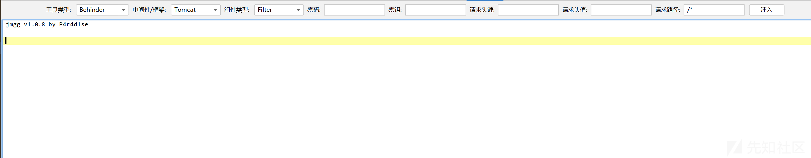
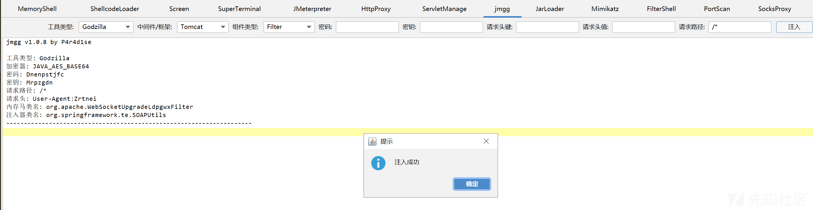
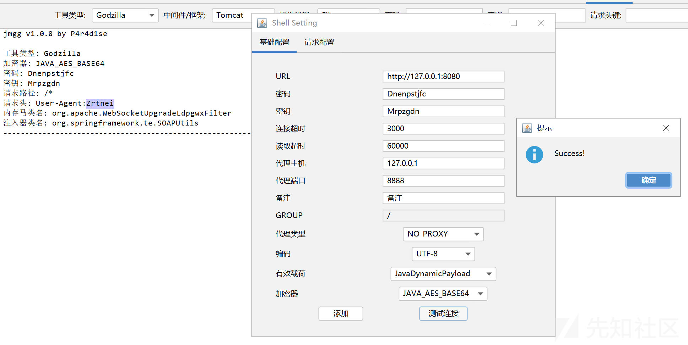
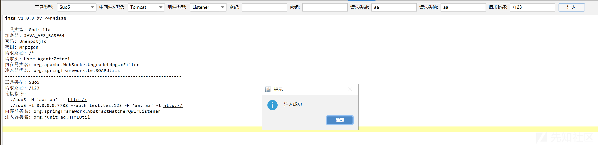
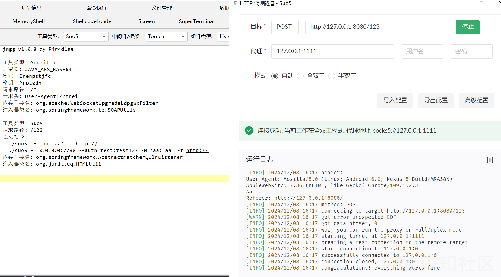

# 内存马生成工具JMG的哥斯拉插件：jmgg-先知社区

> **来源**: https://xz.aliyun.com/news/16069  
> **文章ID**: 16069

---

## 前言

最近改了一下pen4uin师傅的JMG，往里面加了一些团队内部的shell，并写了配套的哥斯拉内存马插件，后者就叫jmgg吧。  
这里把无内部shell版的jmgg发出来：<https://github.com/P4r4d1se/jmgg>  
同样的插件1ucky7师傅其实有写过一个，但是他很久不更新了，并且打包的jar很大，我只打包了我小改的jmg-SDK进去，所以会小很多。  
jmgg版本和JMG同步，现在是1.0.8：  

## 演示

只做了简单测试，没有测试所有环境。  
哥斯拉-Tomcat-Filter：  
  
连接成功：  
  
suo5-Tomcat-Listener：  
  
连接成功：  

