# 从2024年网鼎杯半决赛入门IOT————IOT网络协议分析babyRTP-先知社区

> **来源**: https://xz.aliyun.com/news/16072  
> **文章ID**: 16072

---

# 从2024年网鼎杯半决赛入门IOT————IOT网络协议分析babyRTP

题目描述：这是一个双端都会推流的服务  
听名字分析的应该是RTP这个协议  
RTP(实时传输协议)，随着以太网音视频桥接(AVB)技术的引入，汽车可支持各种基于音频、视频的流媒体服务。在流媒体数据传输过程中，为保障音视频流的实时传输，需采用RTP和RTCP协议。

## 环境复现

我用的是ubuntu22.04.5作为服务端  
将babyrtp.bin通过Binwalk解包，然后把out.zip解压，把图片文件名改成flag.jpg之后放到usr目录下面，运行pwn文件即可。  
由于我ubuntu binwalk不能用，所以我用kali的进行解包然后传到ubuntu上面  
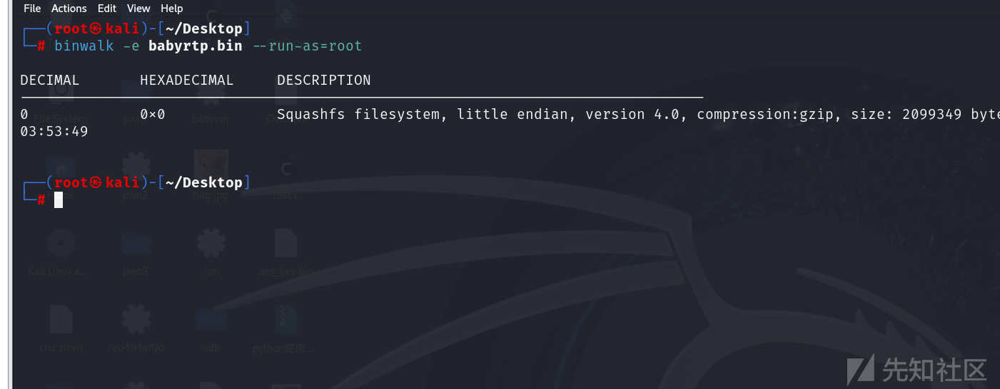

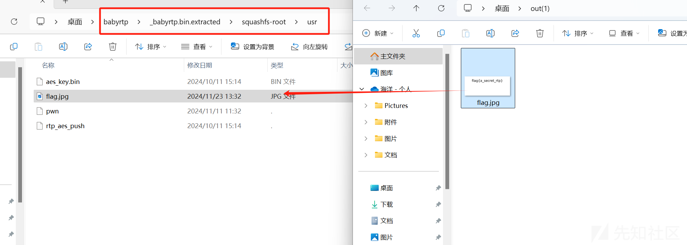

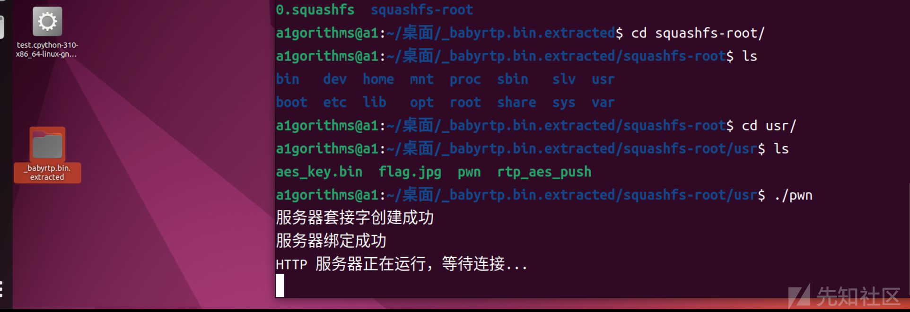  
服务已经启动，web端口是8080

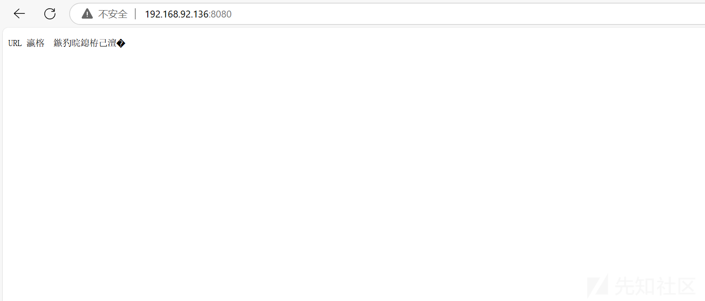

## RTP/RTCP定义

RTP：Real Time Transport Protocol  
是由IETF的多媒体传输工作小组于1996年在RFC 1889中公布的。RTP为IP上的语音、图像等需要实时传输的多媒体数据提供端对端的传输服务，但本身无法保证服务质量（QoS），因此，需要配合实时传输控制协议（RTCP）一起使用。

RTCP：Real-time Transport Control Protocol  
监控服务质量并传送会话参与者信息，服务器可利用RTCP数据包信息改变传输速率、负载数据类型。

我们只了解其基本概念就可以了，不深入探讨该协议

## 固件分析

我们分析一下这个pwn文件

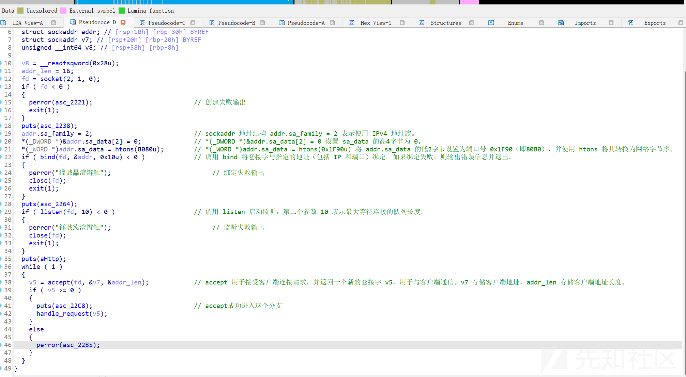

总而言之，就是创建了socket进行通信并且实现了web服务，与客户端连接成功就会进入到handle\_request  
接下来分析handle\_request这个函数

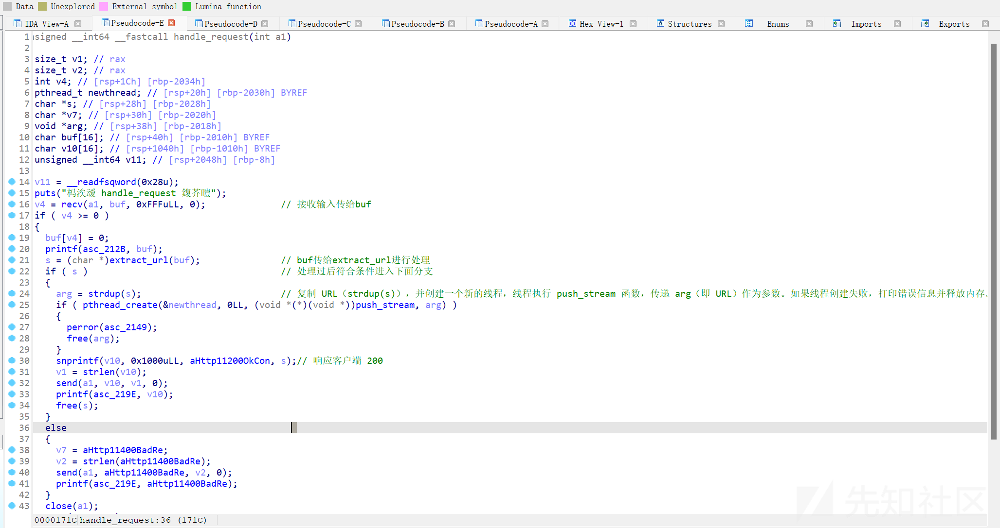  
看一下extract\_url怎么对输入进行处理的

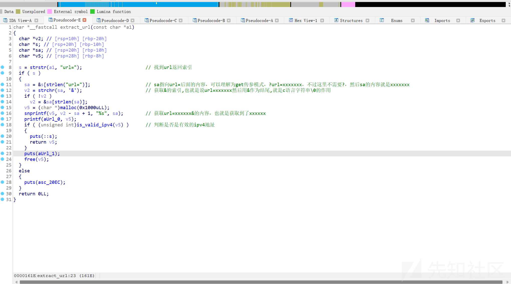  
也就是说我们要在url里面通过url=传参，而且要传个ipv4地址给它以&作为结尾  
接下来我们看看它获取ipv4地址做了什么，也就是看push\_stream这个函数

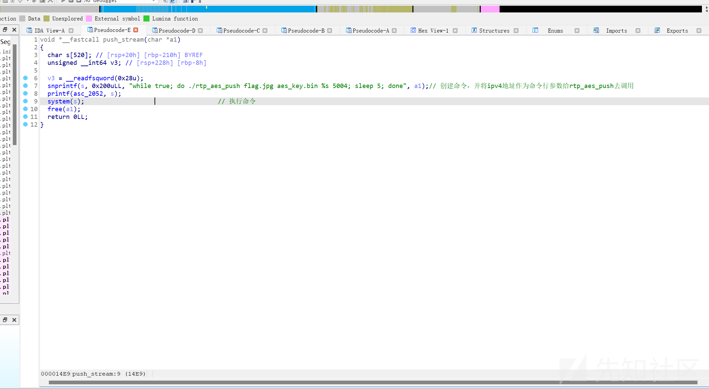  
flag.jpg aes\_key.bin ip 5004作为参数传给了rtp\_aes\_push，而且这个命令会一直执行。分析到这里其实大概也能猜出来rtp\_aes\_push的功能，貌似会把flag.jpg进行aes加密 key是aes\_key.bin这个文件，我们去分析一下rtp\_aes\_push这个二进制文件做了什么

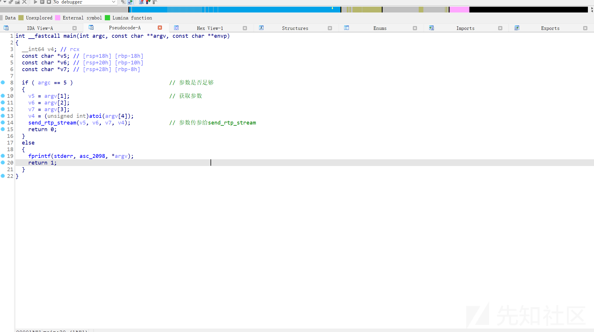  
这里则是获取命令行传参  
看看send\_rtp\_stream函数做了什么

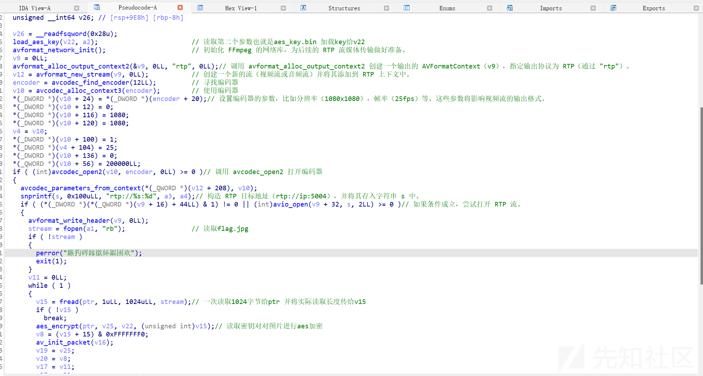  
一次读取图片1024字节进行aes加密然后通过RTP协议将加密后的内容发给ipv4地址，端口是5004  
看一下aes\_encrypt

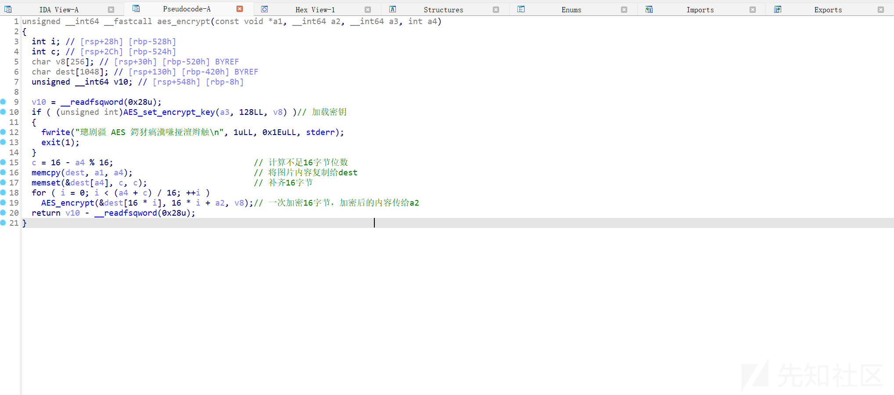  
也就是一次加密16字节，不足16字节用数字补齐

总结rtp\_aes\_push的功能就是  
将flag图片进行aes加密然后发送给ip对应的主机，主机接收端口是5004  
那么我们只需要在url构造传参ip+&即可获取到加密后的图片，然后进行解密即可获得flag  
我们需要打开wireshark进行网络流量抓包，我虚拟机用的nat，所以我得抓nat的虚拟网卡

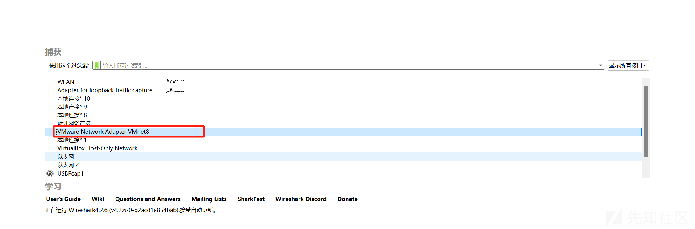

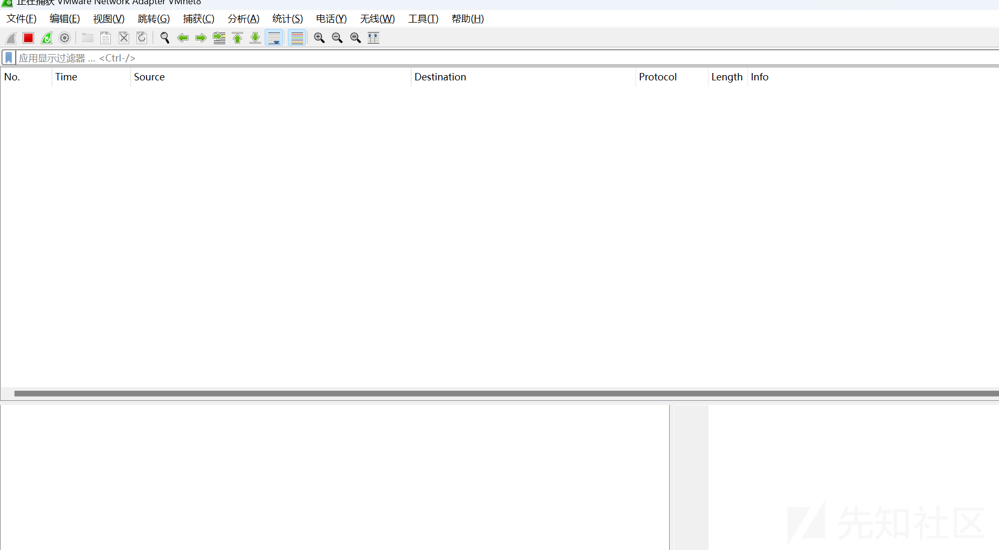  
我现在没有进行交互所以没有流量，接下来我们在url构造传参去获取到加密图片的流量

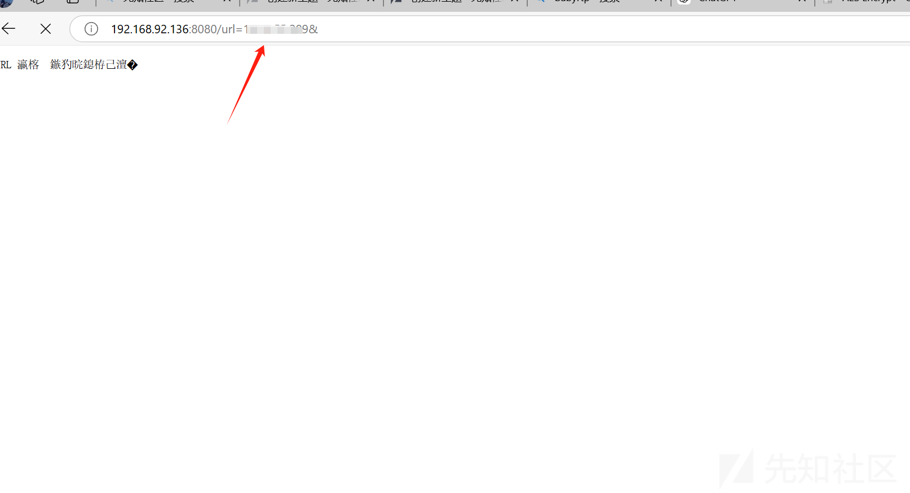

这个ip是你自己电脑的ip

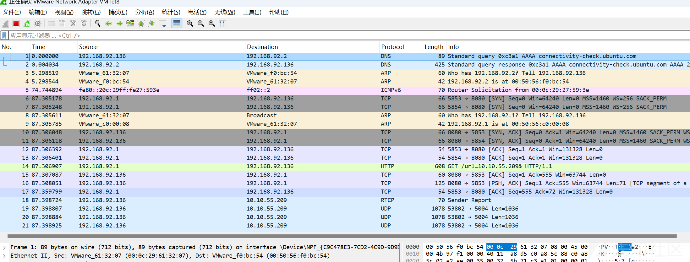  
成功抓到了流量，我们现在需要去提取加密后图片的数据  
写一个过滤式

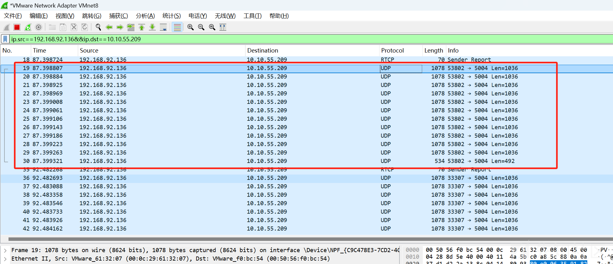  
过滤出来了通过rtp传输的流量，我框选住的就是图片加密后的数，不过我们会发现数据长度从1024变成了1036，多了12位，前12位不是加密图片数据需要过滤掉不然会导致解密失败。  
我们先把这些数据全部dump出来。  
追踪流——>udp stream  
显示方式改成原始数据，然后另存为

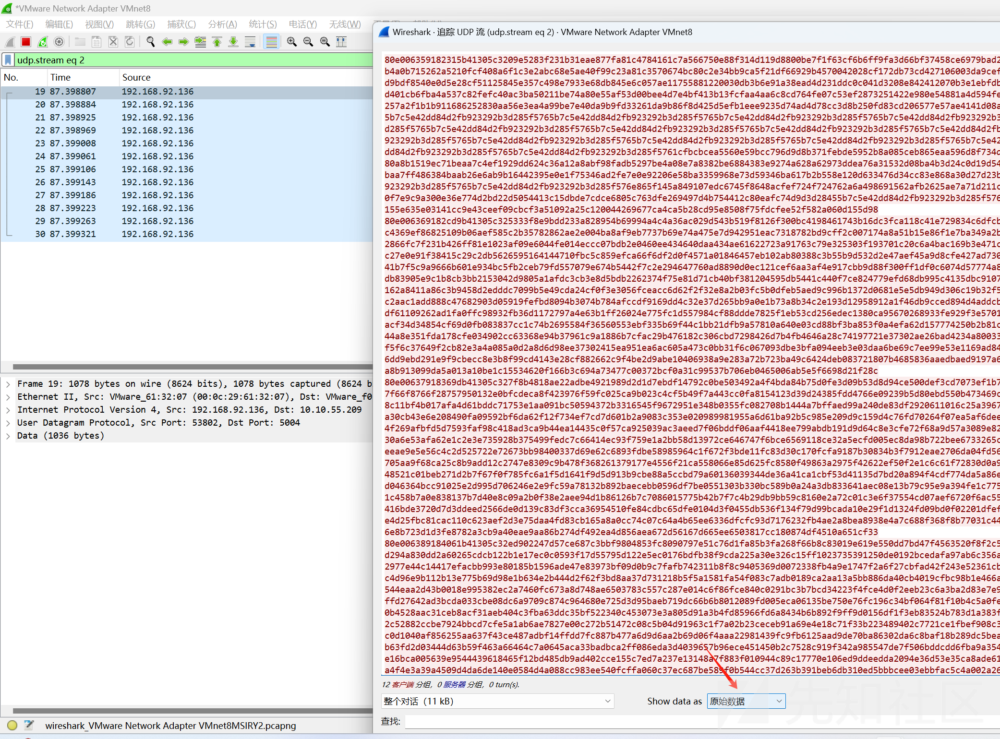

我将其保存到了桌面上，文件名叫output.bin  
接下来写脚本过滤一下数据

```
with open(r"C:\Users\14715\Desktop\output.bin","rb") as f:
    all_data = f.read()

padding = 1036 - len(all_data)% 1036
all_data += b"0"*padding
data_seg = []
for i in range(len(all_data)//1036):
    temp = all_data[i*1036:(i+1)*1036]
    data_seg.append(temp[12:])
print(data_seg)
with open(r"C:\Users\14715\Desktop\images.bin","wb") as f:
    for i in data_seg:
        f.write(i)

```

我过滤的方法就是从索引12开始读  
然后对images.bin进行aes解密即可，key是给了的。

```
from Crypto.Cipher import AES
from Crypto.Util.Padding import unpad
import os

）
key = open(r"C:\Users\14715\Desktop\babyrtp\_babyrtp.bin.extracted\squashfs-root\usr\aes_key.bin","rb").read()

# 输入和输出文件路径
input_file = r"C:\Users\14715\Desktop\images.bin"  
output_file = r'C:\Users\14715\Desktop\flag.jpg'


def decrypt_file(input_path, output_path, key):
    cipher = AES.new(key, AES.MODE_ECB)

    with open(input_path, 'rb') as infile, open(output_path, 'wb') as outfile:
        while True:
            # 读取16字节（128位）
            block = infile.read(16)
            if len(block) == 0:
                break  # 文件读取完成
            elif len(block) < 16:
                # 如果剩余的字节数小于16字节，补齐为16字节
                block = block.ljust(16, b'\0')  # 使用0填充

            # 解密
            decrypted_block = cipher.decrypt(block)
            # 将解密后的数据写入输出文件
            outfile.write(decrypted_block)

        # 最后一步，处理解密后的文件内容去掉补齐的字节
        outfile.truncate(os.path.getsize(output_path) - decrypted_block.count(b'\0'))


if __name__ == "__main__":
    decrypt_file(input_file, output_file, key)
    print("解密完成！")

```

也可以用CyberChef去解

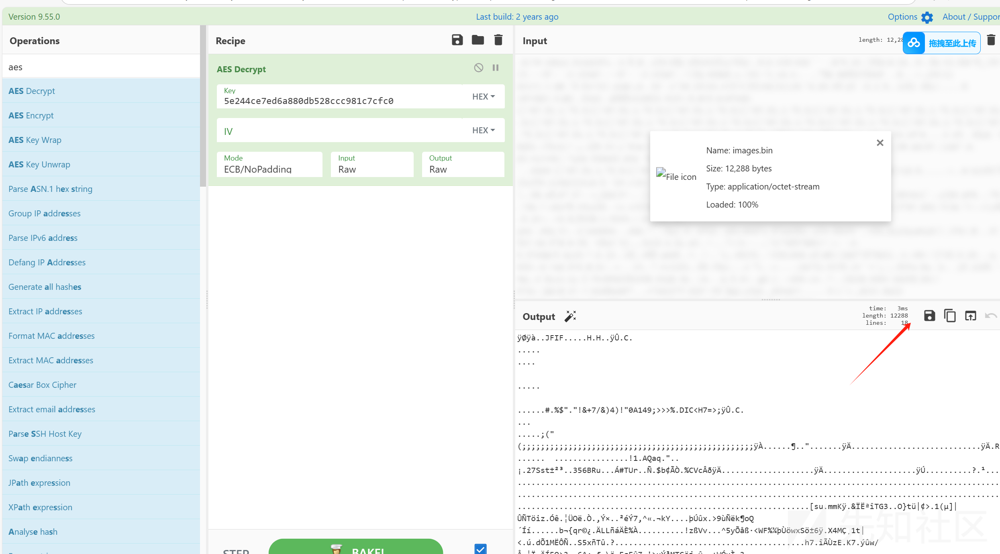  
保存为jpg图片即可

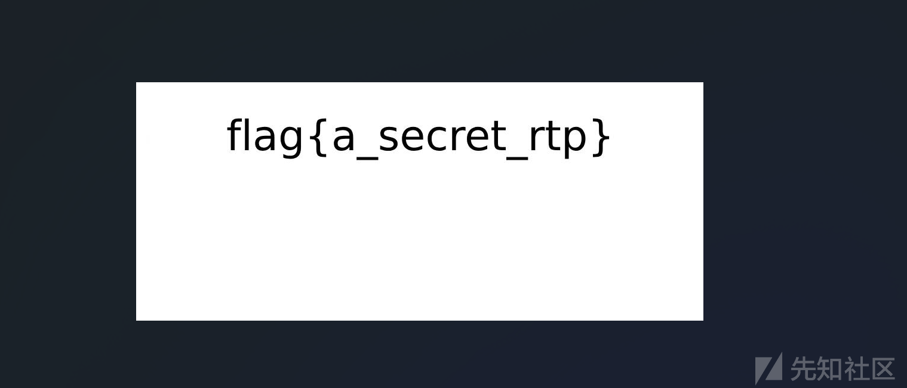

感谢各位师傅的观看，有问题欢迎评论区讨论！
