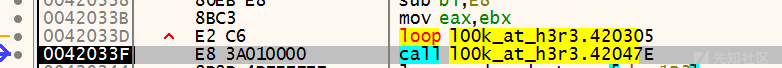
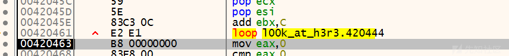
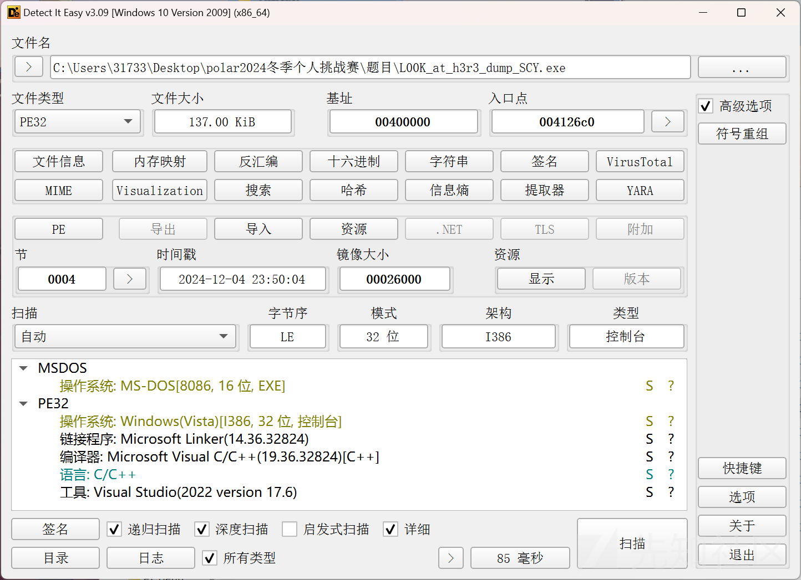
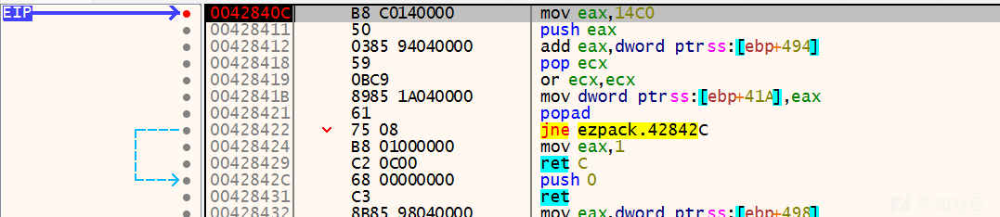
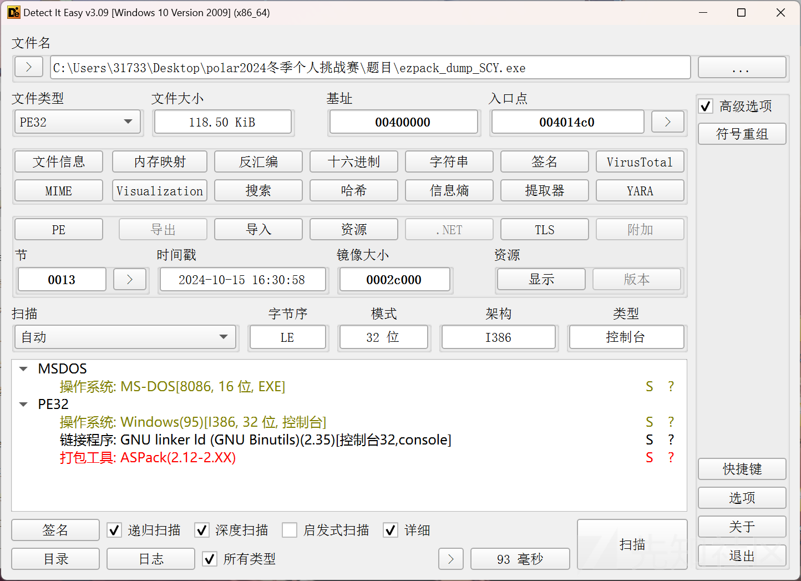
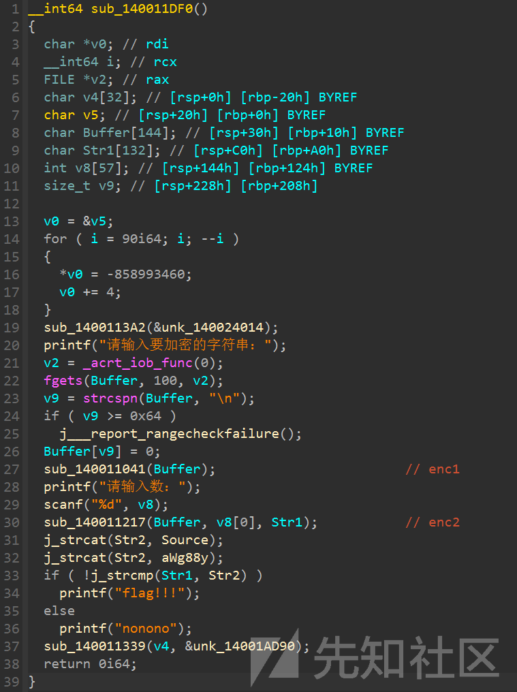
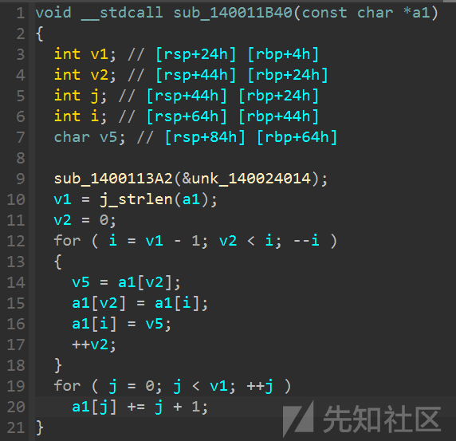
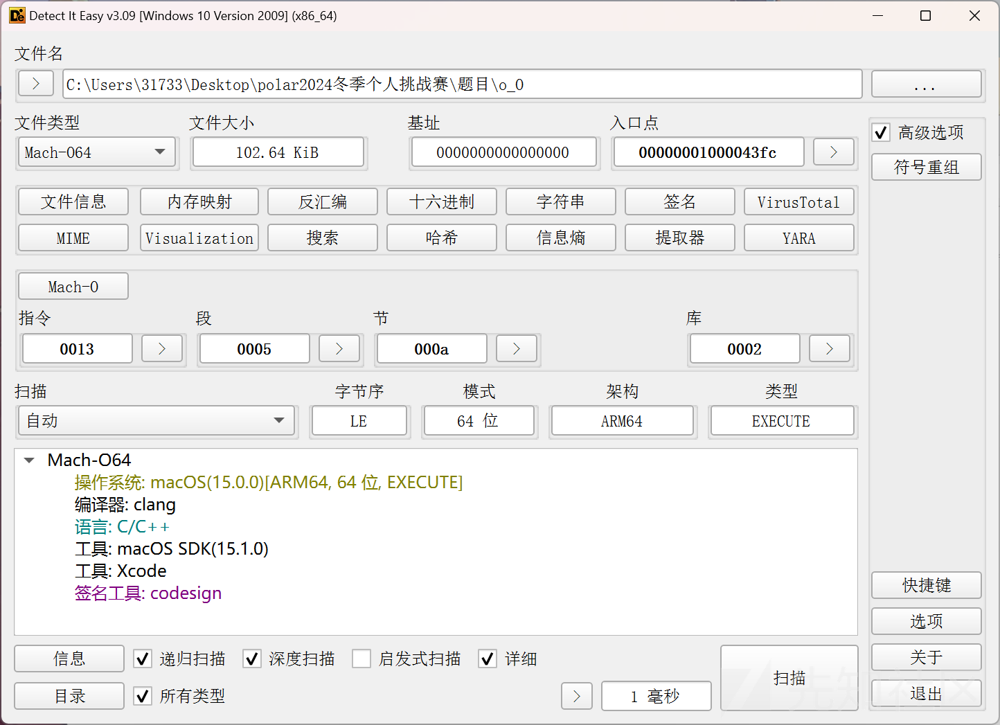

# polar2024冬季个人挑战赛 re部分题解-先知社区

> **来源**: https://xz.aliyun.com/news/16073  
> **文章ID**: 16073

---

## L00K\_at\_h3r3

NSpark壳，直接手脱

x32dbg打开，按一次f9进入程序领空，一路f8，直到f4过两个loop





然后再按几次f8就可以跳出壳了，在这里dump就行


壳被脱掉了



ida打开

只有xor，直接上脚本

```
a = ['lfkmqw','nqT','kixS','ka9jR','h|>cQ','g<}<']

for i in range(len(a)):
    y = 0xa + i
    print(''.join([chr(ord(x)^y)for x in a[i]]),end='')

```

## ezpack

这又来个ASpack，还是手脱，使用x32dbg

先一个f9进入程序领空，然后一路f7，直到跳到这里


双击jne，然后按f4跳到里面（这里需要手动跳进去）



跳到ret后再跳一次就到oep了，直接dump

这里查壳还是可以查到，但是不用管他，我们dump出来的可以直接用



ida打开后看到的就是start函数，shift+f12找字符串交叉引用进入main函数

主要加密逻辑

```
BOOL __cdecl sub_401738(int a1)
{
  char Str1[50]; // [esp+1Ah] [ebp-3Eh] BYREF
  int i; // [esp+4Ch] [ebp-Ch]

  if ( sub_40172E() )
  {
    sub_40160C(aDetectedDebugg);
    return 0;
  }
  else
  {
    for ( i = 0; i <= 31; ++i )
      Str1[i] = *(_BYTE *)(i + a1) ^ 0xC;
    Str1[32] = 0;
    return strcmp(Str1, &Str2) == 0;
  }
}

```

还是很简单的，只有一个异或，str1是已知的

脚本：

```
a = '>4i44oo4?i=n>:m;8m4=oo4i;>?4>h9m'
print(''.join([chr(ord(i)^0xc)for i in a]))

```

## ∞

先脱upx，直接工具脱就行



主函数有两个加密，第一个加密flag，第二个加密str

str已知，为`"hwGwg88Y`

第一个加密就不多说了



第二个加密大概是重排字符串吧，但是好像没什么用

```
void __fastcall sub_140011820(const char *a1, int a2, __int64 a3)
{
  int v3; // [rsp+24h] [rbp+4h]
  _QWORD *Block; // [rsp+48h] [rbp+28h]
  int i; // [rsp+64h] [rbp+44h]
  int v6; // [rsp+84h] [rbp+64h]
  int v7; // [rsp+A4h] [rbp+84h]
  int j; // [rsp+C4h] [rbp+A4h]
  int v9; // [rsp+E4h] [rbp+C4h]
  int k; // [rsp+104h] [rbp+E4h]
  int m; // [rsp+124h] [rbp+104h]
  int n; // [rsp+144h] [rbp+124h]

  sub_1400113A2(&unk_140024014);
  v3 = j_strlen(a1);
  Block = malloc(saturated_mul(a2, 8ui64));
  for ( i = 0; i < a2; ++i )
  {
    Block[i] = malloc(v3);
    j_memset(Block[i], 0, v3);
  }
  v6 = 0;
  v7 = 1;
  for ( j = 0; j < v3; ++j )
  {
    *(Block[v6] + j) = a1[j];
    if ( v6 )
    {
      if ( v6 == a2 - 1 )
        v7 = -1;
    }
    else
    {
      v7 = 1;
    }
    v6 += v7;
  }
  v9 = 0;
  for ( k = 0; k < a2; ++k )
  {
    for ( m = 0; m < v3; ++m )
    {
      if ( *(Block[k] + m) )
        *(a3 + v9++) = *(Block[k] + m);
    }
  }
  *(a3 + v9) = 0;
  for ( n = 0; n < a2; ++n )
    free(Block[n]);
  free(Block);
}

```

```
enc = list('"hwGwg88Y')

for i in range(len(enc)):
    enc[i] = chr(ord(enc[i]) - i - 1)
enc.reverse()
print(''.join(enc))

```

`P01arCtf!`

然后md5加密一下就行

## delf

ida反编译，找到加密逻辑

```
void __fastcall encrypt(const char *a1)
{
  char v1; // [rsp+13h] [rbp-Dh]
  int v2; // [rsp+14h] [rbp-Ch]
  int j; // [rsp+18h] [rbp-8h]
  int i; // [rsp+1Ch] [rbp-4h]

  v2 = strlen(a1);
  for ( i = 0; i < v2; ++i )
    a1[i] ^= 0x5Au;
  for ( j = 0; j < v2 - 1; j += 2 )
  {
    v1 = a1[j];
    a1[j] = a1[j + 1];
    a1[j + 1] = v1;
  }
}

```

异或，然后打乱顺序

解密：

```
a = [0x32,0x0e,0x05,0x3f,0x34,0x3f,0x05,0x3e,0x3c,0x35,0x2e,0x05,0x3f,0x32,0x2d,0x05,0x28,0x35,0x3e,0x36,0x33,0x05,0x05,0x29,0x33,0x38,0x3b,0x34,0x23,0x28]

for i in range(0,len(a)-1,2):
    v1 = a[i]
    a[i] = a[i+1]
    a[i+1] = v1

for i in range(len(a)):
    print(chr(a[i]^0x5a),end='')

```

## o\_O

MacOS的题目



直接丢进ida

```
int __cdecl main(int argc, const char **argv, const char **envp)
{
  int v3; // w1
  _DWORD *v4; // x0
  _DWORD *v5; // x0
  _DWORD *v6; // x0
  __int64 v8; // [xsp+10h] [xbp-110h]
  __int64 v9; // [xsp+18h] [xbp-108h]
  int v10; // [xsp+2Ch] [xbp-F4h]
  int v11; // [xsp+3Ch] [xbp-E4h]
  int v12; // [xsp+48h] [xbp-D8h]
  int v13; // [xsp+4Ch] [xbp-D4h]
  int v14; // [xsp+5Ch] [xbp-C4h]
  __int64 v15; // [xsp+60h] [xbp-C0h]
  int m; // [xsp+6Ch] [xbp-B4h]
  int k; // [xsp+70h] [xbp-B0h]
  int j; // [xsp+78h] [xbp-A8h]
  int v19; // [xsp+7Ch] [xbp-A4h]
  int v20; // [xsp+80h] [xbp-A0h] BYREF
  char v21; // [xsp+87h] [xbp-99h]
  __int64 v22; // [xsp+88h] [xbp-98h] BYREF
  __int64 v23[2]; // [xsp+90h] [xbp-90h] BYREF
  char v24[24]; // [xsp+B0h] [xbp-70h] BYREF
  _QWORD v25[3]; // [xsp+C8h] [xbp-58h] BYREF
  unsigned int v26; // [xsp+E0h] [xbp-40h] BYREF
  int i; // [xsp+E4h] [xbp-3Ch]
  unsigned int v28; // [xsp+E8h] [xbp-38h]
  int v29; // [xsp+ECh] [xbp-34h]
  __int128 v30; // [xsp+F0h] [xbp-30h]
  __int64 v31; // [xsp+100h] [xbp-20h]

  v29 = 0;
  v30 = xmmword_100007C9C;
  v31 = 0x600000005LL;
  v28 = 0;
  for ( i = 0; i < 6; ++i )
  {
    if ( (ZDJD::O((ZDJD *)&o, (*((_DWORD *)&v30 + i) & 1) != 0) & 1) != 0 )
      ++v28;
  }
  v15 = std::ostream::operator<<(&std::cout, v28, envp);
  std::operator<<[abi:ne180100]<std::char_traits<char>>(v15, 10LL);
  std::istream::operator>>(&std::cin, &v26);
  std::vector<int>::vector[abi:ne180100](v25);
  std::to_string((std::__1 *)v26, v3);
  v23[1] = (__int64)v24;
  v23[0] = std::string::begin[abi:ne180100](v24);
  v22 = std::string::end[abi:ne180100](v24);
  while ( (std::operator!=[abi:ne180100]<char *>(v23, &v22) & 1) != 0 )
  {
    v21 = *(_BYTE *)std::__wrap_iter<char *>::operator*[abi:ne180100](v23);
    v20 = v21 - 48;
    std::vector<int>::push_back[abi:ne180100](v25, &v20);
    std::__wrap_iter<char *>::operator++[abi:ne180100](v23);
  }
  v19 = 2 * v28;
  for ( j = 0; j < (int)v28; ++j )
  {
    v12 = *(_DWORD *)std::vector<int>::operator[][abi:ne180100](v25, v19 - j);
    v4 = (_DWORD *)std::vector<int>::operator[][abi:ne180100](v25, j);
    *v4 ^= v12;
    v13 = *(_DWORD *)std::vector<int>::operator[][abi:ne180100](v25, j);
    v5 = (_DWORD *)std::vector<int>::operator[][abi:ne180100](v25, v19 - j);
    *v5 ^= v13;
    v14 = *(_DWORD *)std::vector<int>::operator[][abi:ne180100](v25, v19 - j);
    v6 = (_DWORD *)std::vector<int>::operator[][abi:ne180100](v25, j);
    *v6 ^= v14;
  }
  for ( k = 0; k < (unsigned __int64)std::vector<int>::size[abi:ne180100](v25); ++k )
  {
    v10 = *(_DWORD *)std::vector<int>::operator[][abi:ne180100](v25, k);
    v11 = 8 * *(_DWORD *)std::vector<int>::operator[][abi:ne180100](v25, k) + 2 * v10;
    *(_DWORD *)std::vector<int>::operator[][abi:ne180100](v25, k) = v11;
  }
  for ( m = 0; m < (unsigned __int64)std::vector<int>::size[abi:ne180100](v25); ++m )
  {
    if ( *(_DWORD *)std::vector<int>::operator[][abi:ne180100](v25, m) != arr[m] )
    {
      v9 = std::operator<<[abi:ne180100]<std::char_traits<char>>(&std::cout, "?o.O_O.o?");
      std::operator<<[abi:ne180100]<std::char_traits<char>>(v9, 10LL);
      std::operator<<[abi:ne180100]<std::char_traits<char>>(&std::cout, "flag{this_is_sample_flag}");
      v29 = 0;
      goto LABEL_21;
    }
  }
  v8 = std::operator<<[abi:ne180100]<std::char_traits<char>>(&std::cout, "!O.o_o.O!");
  std::operator<<[abi:ne180100]<std::char_traits<char>>(v8, 10LL);
  std::operator<<[abi:ne180100]<std::char_traits<char>>(&std::cout, "flag{md5(your_number)}");
  v29 = 0;
LABEL_21:
  std::string::~string(v24);
  std::vector<int>::~vector[abi:ne180100](v25);
  return v29;
}

```

是c++编写的

分析：

第一个循环(for)里面判断奇偶数，所以v28等于3

第二个循环(while)把每一位输入减48

第三个循环(for)，v19=6

这个函数`std::vector<int>::operator[][abi:ne180100](v25, v19 - j)`的意思是`v25[v19-j]`

连续三个异或，`a^=b,b^=a,a^=b`，意思是交换a和b

这个循环的意思是给有7个元素的列表逆序

第四个循环(for)，自己乘8加上自己乘2，相当于乘10

第五个循环，判断结果

```
a = [0x5A, 0x14, 0x0A, 0x32, 0x00, 0x00, 0x14]
for i in range(len(a)):
    a[i]//=10
a.reverse()
print(''.join([chr(i+48)for i in a]))

```

最后再md5加密一下即可
