# Windows hook框架Detours踩坑-先知社区

> **来源**: https://xz.aliyun.com/news/16078  
> **文章ID**: 16078

---

相比Android 种类繁多的hook框架，Windows上的hook框架基本上只能搜到Detours。由于使用的人少，在使用过程中遇到一些坑也难以找到解决办法，只能去看源码。本文介绍我在使用Detours对**Windows 32位程序**进行hook时遇见的一些坑，以及解决办法。

# 下载与编译

源码在官方github: <https://github.com/microsoft/Detours/releases/tag/v4.0.1> 进行下载

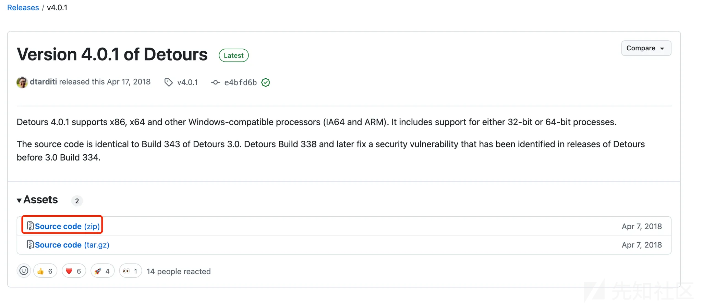

下载之后进行解压，之后打开VS的Native Tools Command Prompt 命令行（编译64位用x64开头的命令行，编译x86用x86开头的命令行），cd到Detours的src目录下执行nmake命令进行编译

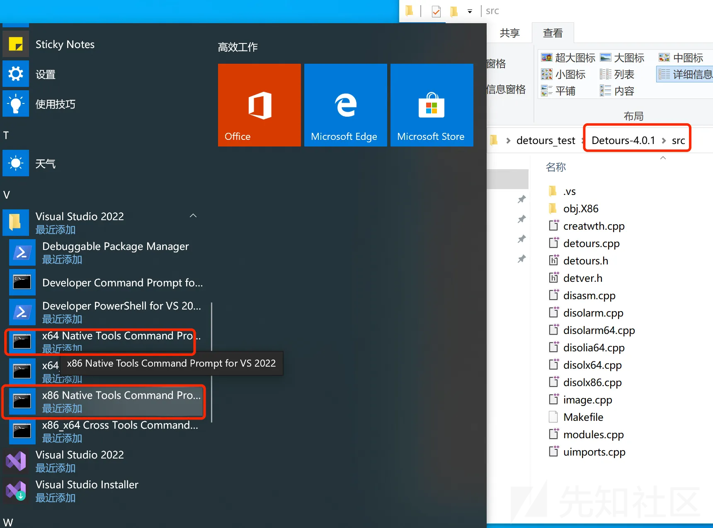

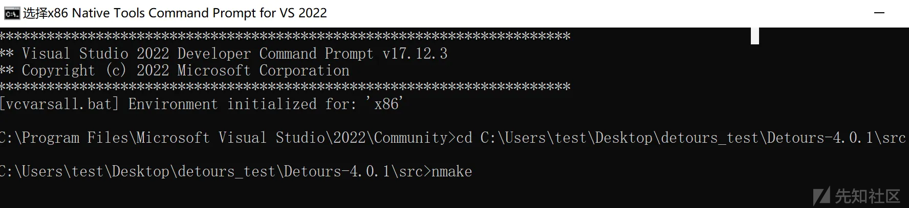

nmake执行之后，会在src目录的上一层出现lib.X86目录（如果是64位则为lib.X64）,目录中的detours.lib 文件即为编译好的Detours静态库。我们可以在自己的工程中导入Detours静态库和头文件使用它提供的hook功能。

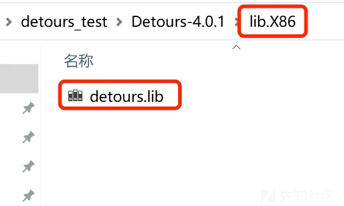

Detours头文件在include目录下，名称为detours.h

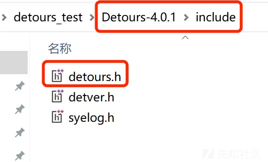

# 项目配置

在项目中使用Detours进行hook需要进行配置，流程如下：

* 将detours.lib和detours.h拷贝到项目目录下
* 右键解决方案资源管理器的头文件处→添加→现有项 选择detours.h

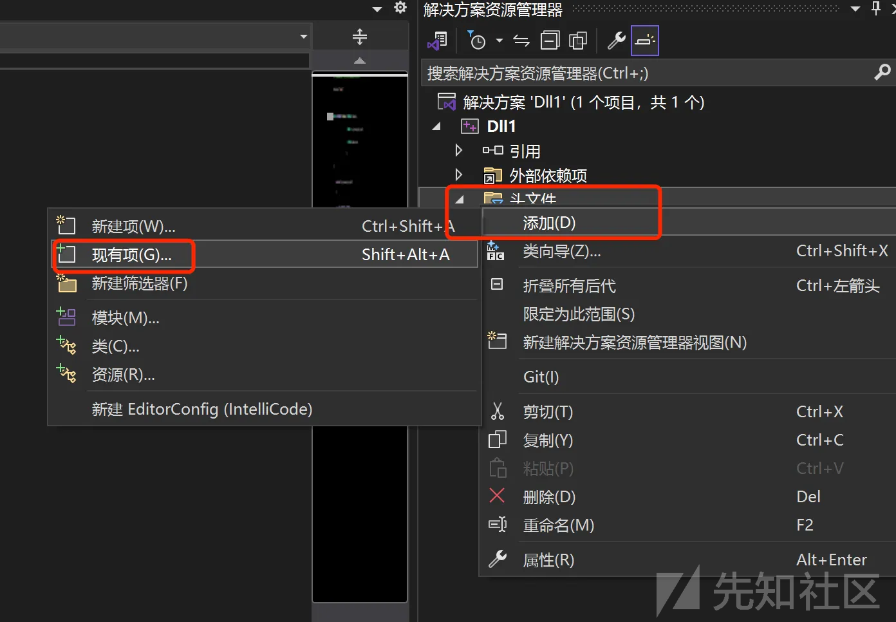

* 右键解决方案资源管理器的项目名处，选择属性，打开项目配置页面

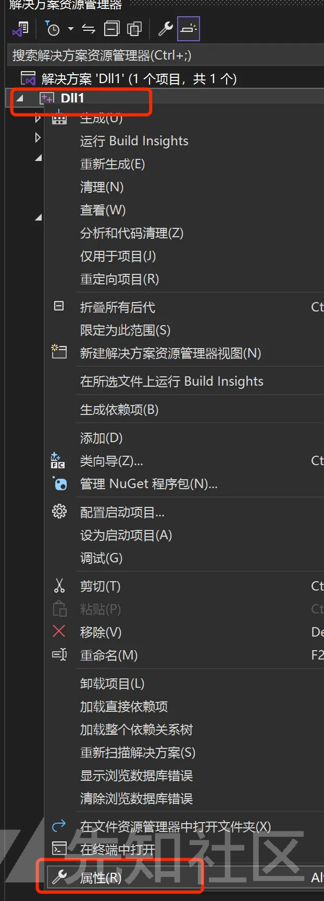

* 在项目配置页面注意先选择平台是32位还是64位，Debug还是Release，每种编译目标的配置文件不同。目标程序为32位时需要使用32位的dll，目标程序为64位时需要使用64位的dll。在配置属性→VC++目录→库目录 中添加detours.lib所在的目录。

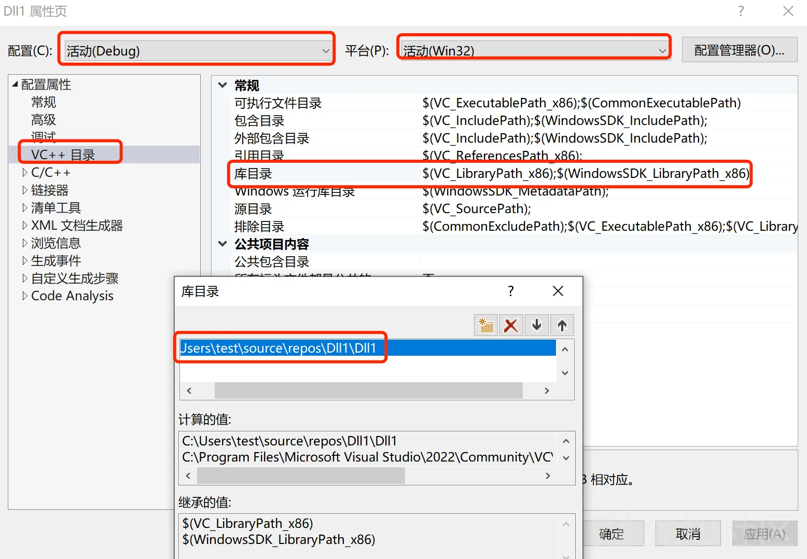

* 取消SDL检查，否则scanf、sprintf这类的函数会报错，要求替换成scanf\_s、sprintf\_s。

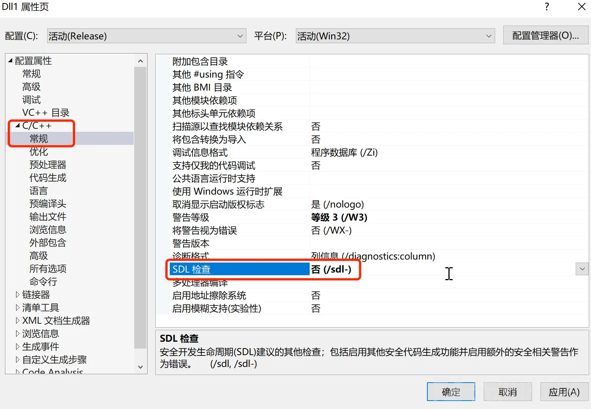

* 关闭符合模式，否则一些指针强转会报错。 如DetourAttach 函数报错：&要求左值

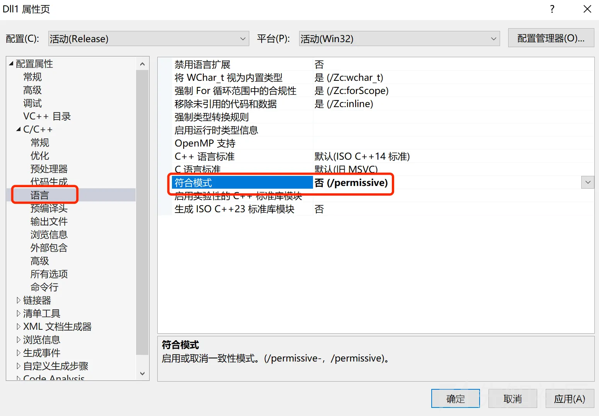

* 在使用Detours的项目中，需要导入头文件和静态库

```
#include "detours.h"    // 导入Detours头文件
#pragma comment(lib, "detours.lib")  //导入Detours

```

# 简单使用

下面是一个hook标准库函数puts的例子：

* 此dll的作用为：hook目标程序的puts函数，打印目标函数中puts的参数+123，并调用原本的puts函数输出”hooked“
* puts函数是标准库函数，因此可以直接通过函数名来表示此函数的函数指针。（因为在dll中也能找到此函数）。
  + 如果目标函数不是标准库函数或系统函数，而是目标程序加载的某个动态链接库的导出函数，可以使用DetoursFindFunction找到该导出函数;
  + 注意DetourFindFunction 的函数名需要和导入表中的函数名称一致（C++存在名称粉碎）。如 MyPus函数的实际名称为 ?MyPuts@@YAXPBD@Z ，在使用DetourFindFunction时需要使用此名称。

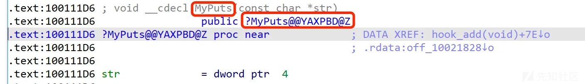

* Detours 常用函数组合为：
  1. DetourTransactionBegin();
  2. DetourUpdateThread(GetCurrentThread());
  3. DetourAttach(&(PVOID)OldFunc, NewFunc); OldFunc表示目标函数，NewFunc表示hook后的新函数
  4. DetourTransactionCommit();
* 在hook目标函数时必须在DetoursAttach前后按顺序调用另外3个函数。取消hook时也需要按顺序调用，只不过将DetourAttach替换成DetourDetach
* DetourAttach和DetourDetach 可以写多个，以同时hook和取消hook多个函数
* 个人觉得如果没有主动卸载dll的需求，没必要写取消hook的代码，hook代码会跟随程序的生命周期

```
#include <stdio.h>
#include "detours.h"    // 导入Detours头文件
#pragma comment(lib, "detours.lib")  //导入Detours

//static int (*RealPuts)(const char* str) = (int(*)(const char*))DetourFindFunction("ucrtbased.dll", "puts");
static int (*RealPuts)(const char* str) = puts;
// 拦截的puts函数
 void MyPuts(const char* str) {
    printf("%s%d\n", str, 123);
    RealPuts("hooked");
}

void hookPuts()
{
    DetourTransactionBegin();
    DetourUpdateThread(GetCurrentThread());
    DetourAttach(&(PVOID)RealPuts, MyPuts);
    //DetourAttach(&(PVOID)RealPuts1, MyPuts1);
    DetourTransactionCommit();
}

void unHook()
{
    DetourTransactionBegin();
    DetourUpdateThread(GetCurrentThread());
    DetourDetach(&(PVOID)RealPuts, MyPuts);
    //DetourDetach(&(PVOID)RealPuts1, MyPuts1);
    DetourTransactionCommit();
}

BOOL APIENTRY DllMain( HMODULE hModule,
                       DWORD  ul_reason_for_call,
                       LPVOID lpReserved
                     )
{
    switch (ul_reason_for_call)
    {
    case DLL_PROCESS_ATTACH:
        hookPuts();
        break;
    case DLL_THREAD_ATTACH:
    case DLL_THREAD_DETACH:
    case DLL_PROCESS_DETACH:
              unHook();
        break;
    }
    return TRUE;
}

```

# 踩坑

上面对Detours使用的介绍，基本上所有对Detours介绍的文章都是这样描述的。但是在实际使用过程中情况会有些不同，本节介绍几个实际使用过程中容易遇到的问题。

hook的使用场景一般为：在动态链接库（dll）中实现hook逻辑，然后通过注入技术让目标程序加载dll，从而修改目标程序。注入技术不是本文关注的，因此在本文中**会让目标程序主动加载dll**。

## 使用函数名获取函数指针

在上一节中介绍了可以直接使用函数名的方式来获取目标函数的函数指针，但是这种方式容易出现问题。

当一些库函数在dll中和在目标程序中可能使用的不是同一个时，比如dll是Debug模式编译，puts函数使用的是ucrtbased.dll里的，目标程序是Release模式编译使用的是ucrtbase.dll里的，这样hook puts就会失败。

* Debug 模式编译，puts函数来自ucrtbased.dll


* Release 模式编译，puts函数来着api-ms-win-crt-stdio-11-1-0.dll，实际上使用的是ucrtbase.dll


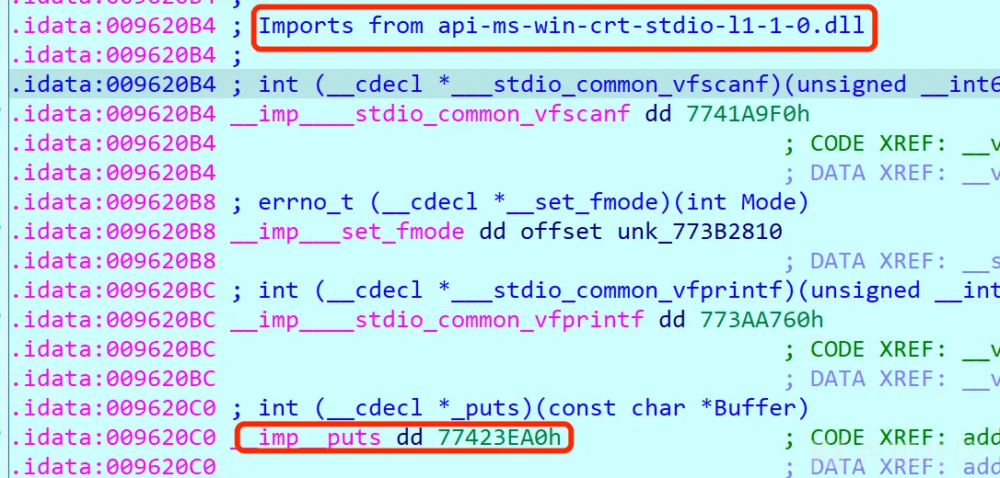

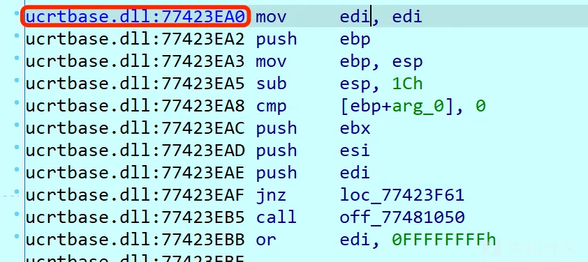

对于库函数或系统函数，建议使用DetourFindFunction在目标程序加载的动态链接库里获取函数指针

## 非导出函数

DetourFindFunction函数只能查找动态链接库或程序中的导出函数，当要hook的目标函数不是导出函数时应该怎么办？

可以使用模块加载基址+函数偏移的方式来得到目标函数的函数指针，示例代码如下：

目标程序的代码如下，逻辑比较简单，输入两个数输出它们的和。

`__declspec(noinline)` 是为了防止目标函数内联，因为add\_func函数比较简单，编译器会进行优化，将此函数内联，如 `printf("%d+%d=%d\n", a, b, add_func(a, b));` 变成 `printf("%d+%d=%d\n", a, b, a+b);`

```
#include <stdio.h>
#include <windows.h>

_declspec(noinline) int add_func(int a, int b)
{
    return a + b;
}

int main()
{
    HMODULE h = LoadLibraryA("Dll1.dll");
    int a = 0;
    int b = 0;
    scanf("%d%d", &a, &b);
    printf("%d+%d=%d\n", a, b, add_func(a, b));
    scanf("%d%d", &a, &b);
    return 0;
}

```

hook非导出函数首先需要找到目标函数在目标程序中的偏移，可以在IDA中查看，用函数地址减去基址即为函数偏移：0x401100-0x400000=0x1100 。 下图中.text段从0x401000开始，但是基址为0x400000，前0x1000是PE文件头

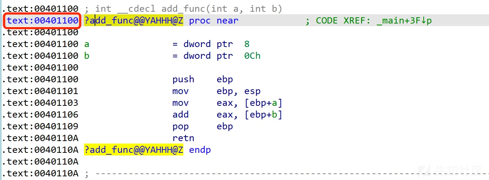

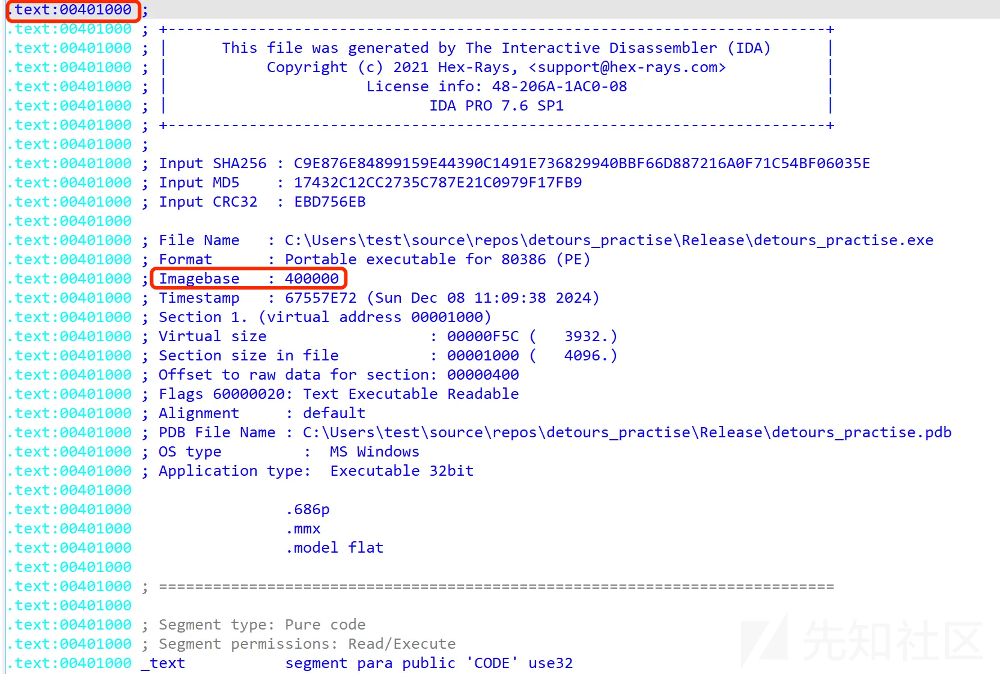

hook代码如下，通过GetModuleHandleA 函数获取目标程序加载的基址，然后加上目标函数的偏移，得到目标函数的地址，转换成函数指针。

```
// dllmain.cpp : 定义 DLL 应用程序的入口点。
#include <stdio.h>
#include "detours.h"    // 导入Detours头文件
#pragma comment(lib, "detours.lib")  //导入Detours

PVOID g_pOriginAdd = NULL;

int MyFunc(int a, int b) {
        ((int(*)(int, int))g_pOriginAdd)(a, b); //调用原函数
    return a-b;
}

void hook_add()
{
    DetourTransactionBegin();
    DetourUpdateThread(GetCurrentThread());
    DWORD addOffset = 0x1100;
    DWORD baseAddr = (DWORD)GetModuleHandleA("detours_practise.exe");
    g_pOriginAdd = (PVOID)(addOffset + baseAddr);
    DetourAttach(&(PVOID)g_pOriginAdd, MyFunc);
    DetourTransactionCommit();
}

BOOL APIENTRY DllMain( HMODULE hModule,
                       DWORD  ul_reason_for_call,
                       LPVOID lpReserved
                     )
{
    switch (ul_reason_for_call)
    {
    case DLL_PROCESS_ATTACH:
        hook_add();
        break;
    case DLL_THREAD_ATTACH:
    case DLL_THREAD_DETACH:
    case DLL_PROCESS_DETACH:
        break;
    }
    return TRUE;
}

```

## 函数调用约定

函数调用约定用来决定传参方式以及如何清理堆栈，在使用Detours进行hook时需要保持目标函数和替换后的新函数调用约定一致。否则，堆栈不平衡目标程序会崩溃。函数的参数数量和类型也需要保持一致。

### Detours hook 流程

Detours hook目标函数的逻辑很简单，就是将目标函数开头的指令换成jmp指令，跳转到我们定义的函数中。主要流程如下，前3步是DetourAttach函数做的事情，第4-5步是DetourCommit做的事情：

1. 计算需要修改目标函数的字节数 n，jmp到新函数地址的指令长度为5个字节，但是目标函数的前5个字节可能不能构成完整的指令。如目标函数的第4个字节到第6个字节构成了一条指令，如果只考虑前5个字节，此条指令将无法正确执行
2. 计算Trampoline（跳板）函数跳转回来的地址：目标函数地址+第1步计算的需要修改的字节数n
3. 构建Trampoline（跳板）函数：找一块空白的内存区域，根据第1步计算的字节数拷贝目标函数的前n个字节，然后加上一条jmp指令，以跳转到第2步所计算出的地址
4. 修改目标函数的前5个字节，以跳转到hook后的函数中。如果第1步计算出来的需要修改的字节数大于5，大于5的部分填上0xCC
5. 会将Trampoline函数的地址addr3 给DetourAttach函数的第一个参数（所以此参数是一个二级指针），**因此可以在新函数中通过Trampoline调用原函数**

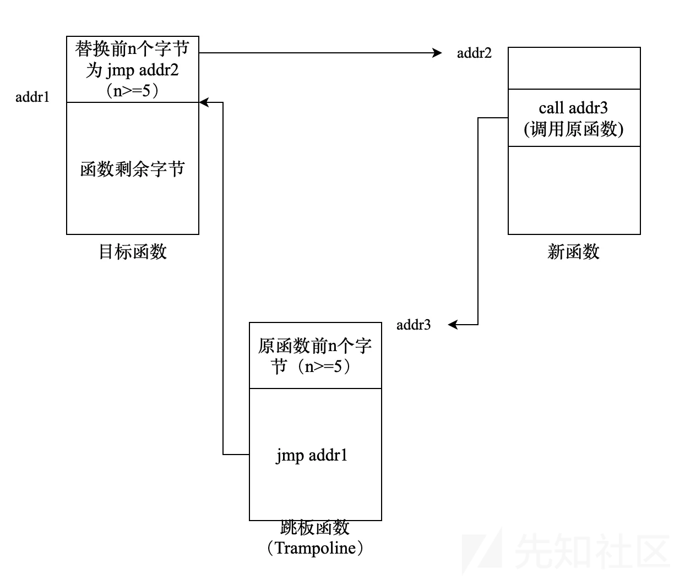

### **cdecl 和** stdcall

* 当函数不显示指定调用约定时，使用的就是\_\_cdecl，宏为WINAPIV。此调用约定在32位程序中使用栈传参，函数调用结束之后由调用方清理栈中的参数。下图中的add\_func有两个参数，在调用它时，push 了两个参数到栈中，调用结束后需要使用add esp,8 将栈还原


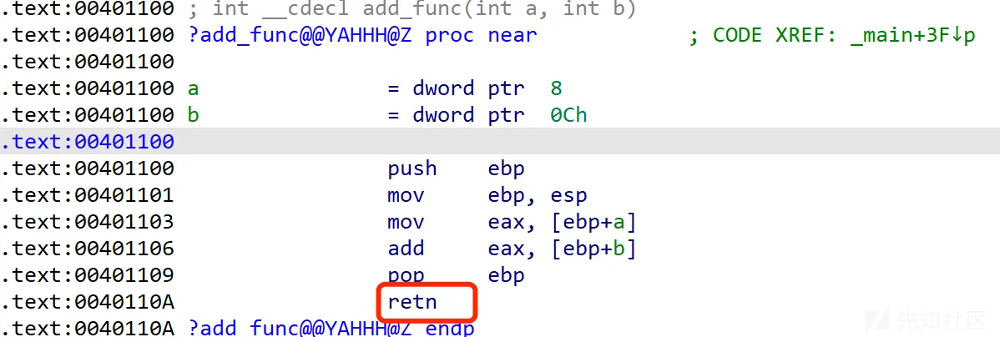

* \_\_stdcall 宏为WINAPI。此调用约定在32位程序中使用栈传参，函数调用结束之后由被调用方清理栈中的参数。下图中的add\_func有两个参数，在调用它时，push 了两个参数到栈中，调用结束后，调用方没有使用 add esp,8将栈还原。而是被调用方，add\_func自己将栈还原

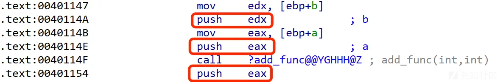

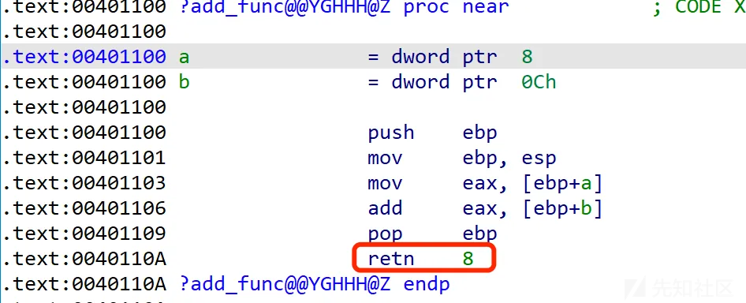

如果目标函数使用**cdecl，而替换后的新函数使用**stdcall 时。调用目标函数时调用方会清理堆栈，新函数会自己清理堆栈，等于清理了两次堆栈，栈不平衡会导致目标程序崩溃。反之亦然。参数的数量和类型如果不一致，会导致传参使用的堆栈大小和清理堆栈的大小不一致，导致程序崩溃。

### **fastcall 和** usercall

**fastcall调用约定对于函数的前两个参数使用寄存器ecx和edx进行传参，其余的参数使用栈传参，由被调用方清理堆栈。如果目标函数使用**fastcall，而替换后的新函数不使用**fastcall，当目标函数被调用时会使用寄存器传参，而新函数依然会从栈中取参数，导致参数和预期不符。**

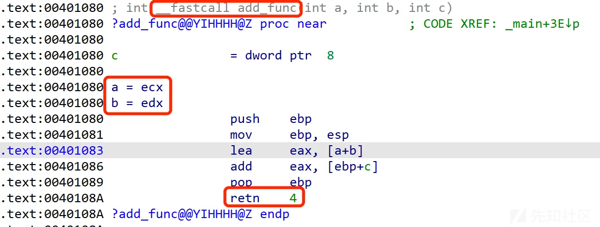

编译器优化会将函数调用约定变为\_\_usercall，这种调用约定传参与fastcall一样，但是无论是调用方还是被调用方都没有清理堆栈，程序可能会崩溃。可以禁用优化，不使用这种调用约定

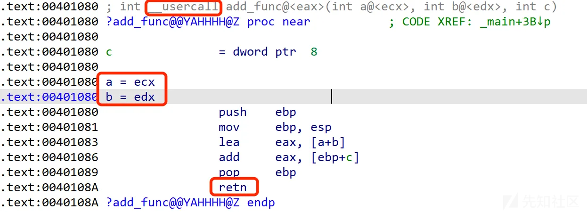

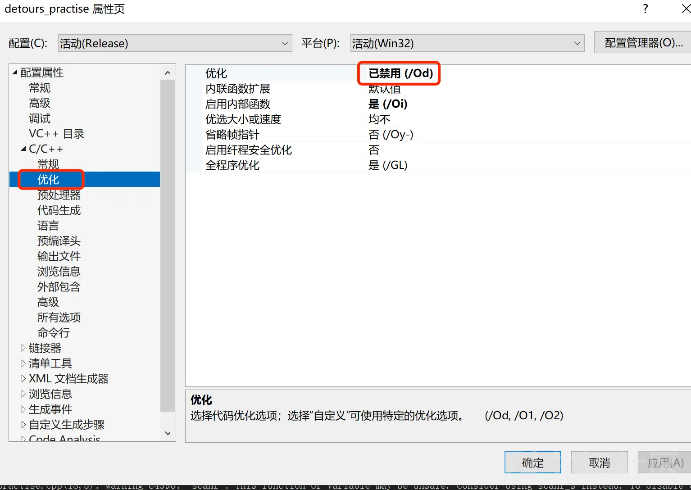

### \_\_thiscall

\_\_thiscall 用于类中的函数调用，this指针通过ecx传递，其余参数通过栈传递，由被调用方清理堆栈。

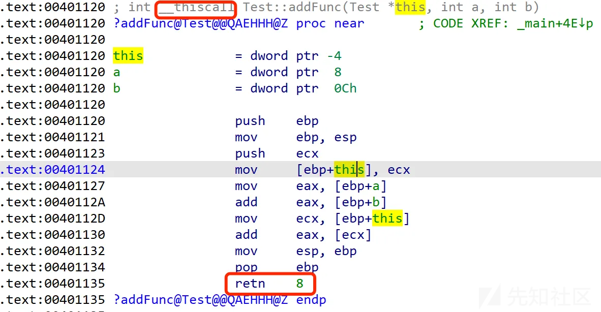

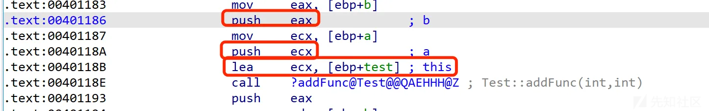

\_\_thiscall只能用于类中的函数，而我们替换目标函数的新函数是类外的函数，不能使用此调用约定，无法保持目标函数和替换的新函数调用约定一致，那么应该如何hook一个类函数？

示例目标程序如下：

```
#include <stdio.h>
#include <windows.h>

class Test
{
private:
    int mValue;
public:
    Test(int value) {
        mValue = value;
    }
    int addFunc(int a, int b)
    {
        return a + b + this->mValue;
    }
};

int main()
{
    HMODULE h = LoadLibraryA("Dll1.dll");
    int a = 0;
    int b = 0;
    scanf("%d%d", &a, &b);
    Test test(a);
    printf("%d+%d=%d\n", a, b, test.addFunc(a, b));
    scanf("%d%d", &a, &b);
    return 0;
}

```

hook代码如下：由于**thiscall是由被调用函数清理参数栈，因此将新函数的调用约定为**stdcall。这样除了this指针没有通过ecx传递之外，其余的操作与**thiscall相同。如果新函数中需要使用this指针（如调用原函数），需要在函数开头push ecx，将this指针保存在栈上。当需要使用时，pop ecx，将this指针传给ecx以模拟**thiscall。注意：push ecx之后堆栈会变化，需要自己维护，在函数结束时保持堆栈平衡。

```
// dllmain.cpp : 定义 DLL 应用程序的入口点。
#include <stdio.h>
#include "detours.h"    // 导入Detours头文件

#pragma comment(lib, "detours.lib")  //导入Detours

PVOID g_pOriginAdd = NULL;

int __stdcall MyFunc(int a, int b) {
    __asm
    {
        push ecx
    }
    int c = a + b;
    __asm
    {
        pop ecx
    }
     //注意函数指针的调用约定也需要一致
    int d = ((int (__stdcall *)(int, int))g_pOriginAdd)(a, b);
    return c + d;
}

void hook_add()
{
    DetourTransactionBegin();
    DetourUpdateThread(GetCurrentThread());
    DWORD addOffset = 0x1120;
    DWORD baseAddr = (DWORD)GetModuleHandleA("detours_practise.exe");
    g_pOriginAdd = (PVOID)(addOffset + baseAddr);
    DetourAttach(&(PVOID)g_pOriginAdd, MyFunc);
    DetourTransactionCommit();
}

BOOL APIENTRY DllMain( HMODULE hModule,
                       DWORD  ul_reason_for_call,
                       LPVOID lpReserved
                     )
{
    switch (ul_reason_for_call)
    {
    case DLL_PROCESS_ATTACH:
        hook_add();
        break;
    case DLL_THREAD_ATTACH:
    case DLL_THREAD_DETACH:
    case DLL_PROCESS_DETACH:
        break;
    }
    return TRUE;
}

```
