# 某某新闻逆向分析-先知社区

> **来源**: https://xz.aliyun.com/news/16083  
> **文章ID**: 16083

---

本文仅做技术分析交流

## 正文

刷新一下页面抓取请求新闻的包

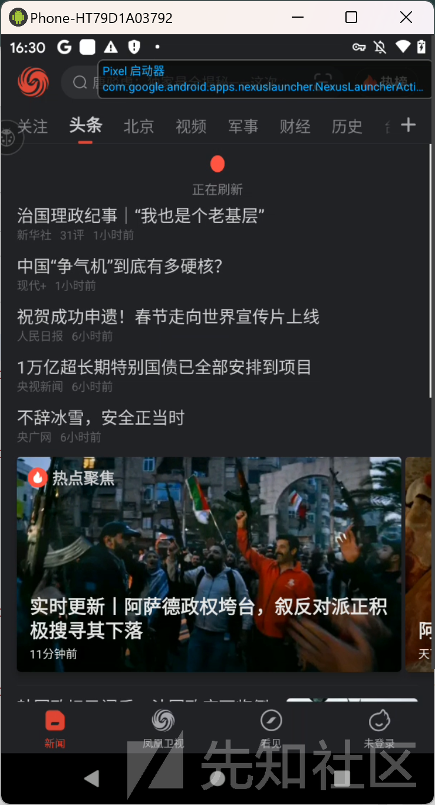

  
发现sn和st这两个参数会改变，且不能随意修改

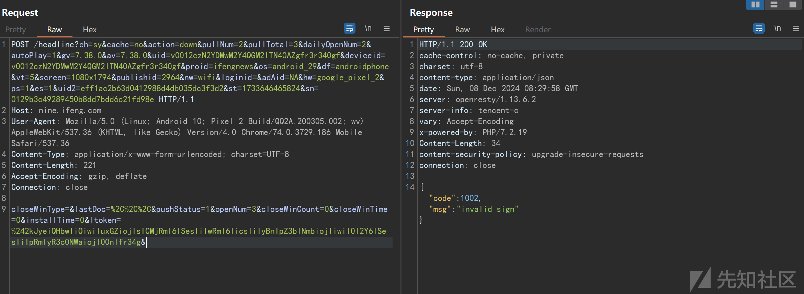  
一旦乱改后就失效了  
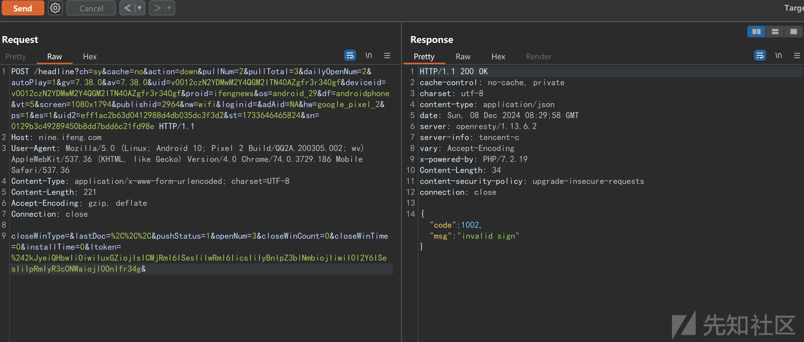

下面来分析一下这两个参数的生成

直接将apk拖到jadx,发现加壳了，这个一眼钉帧是腾讯加固了

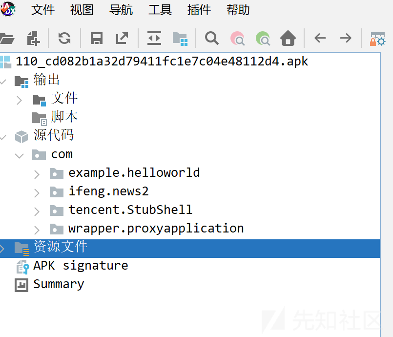

用apk messenger 查看一下发现没错  


先脱壳，使用blackdex  
<https://github.com/CodingGay/BlackDex/releases>  
修改一下存储路径

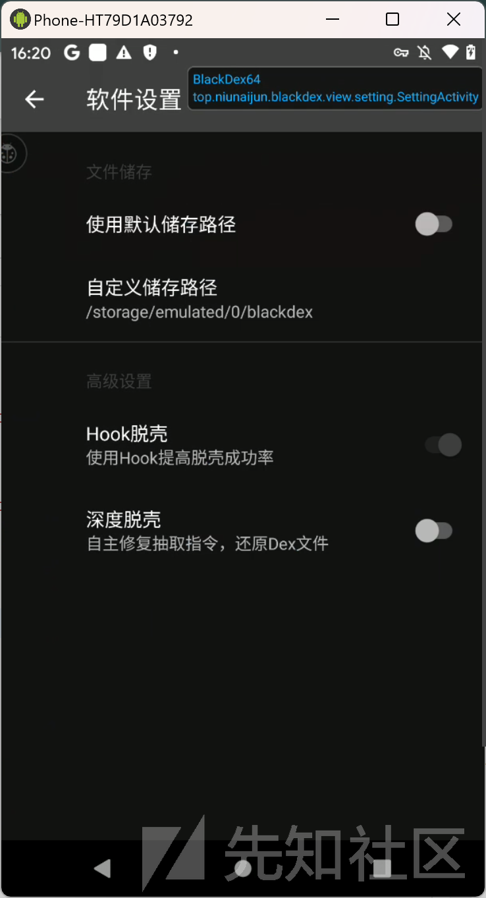  
点击一下要脱壳的包就好l  
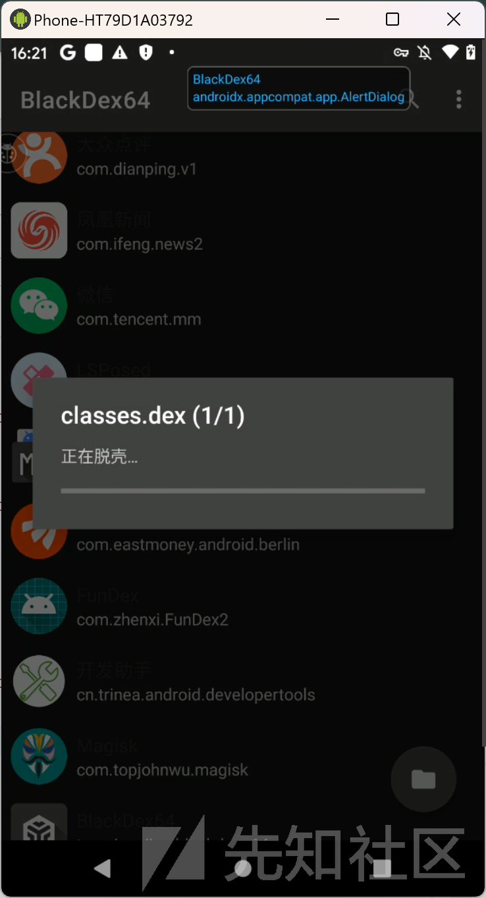

完成后就可以看到存储目录出现了脱出的dex

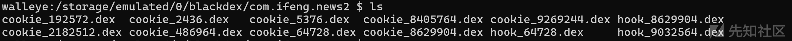  
使用adb pull出来，全部拖到jadx中

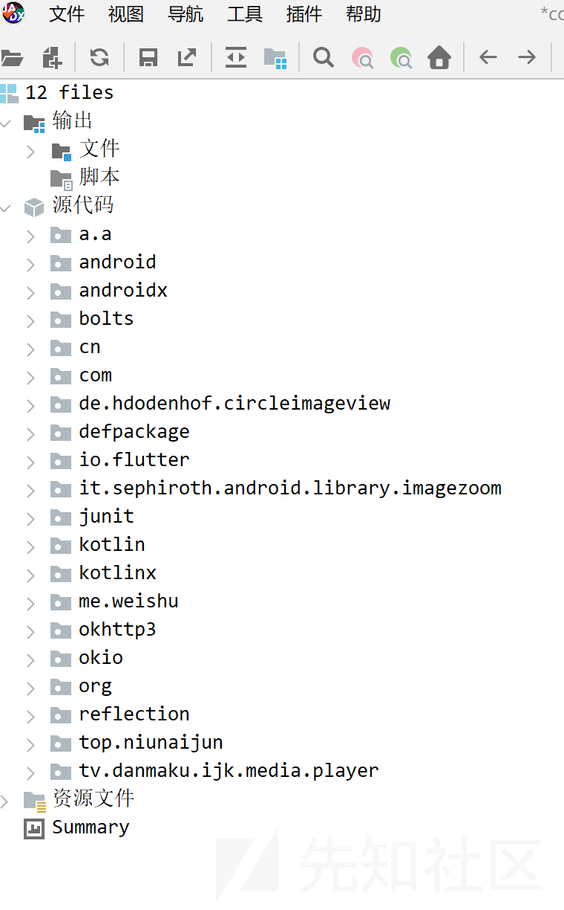

尝试搜索关键字"sn="，逐个查看发现大概率与想要分析的sn，st有关的位置

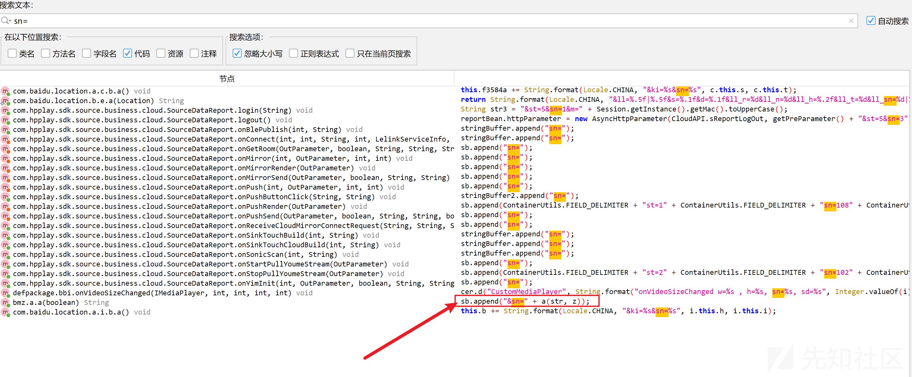

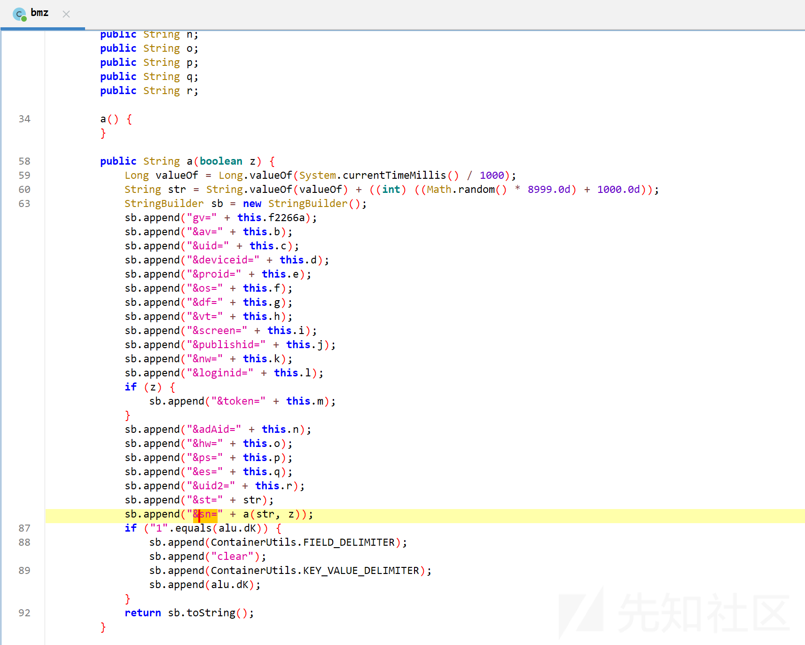

hook确认一下  
hook代码如下

```
function hook_a() {
    Java.perform(function () {
        var bmzClass = Java.use('bmz$a');
        bmzClass.a.overload('boolean').implementation = function (z) {
            var result = this.a(z);
            console.log("result=================>", result);
            return result;
        };
    });
}
setImmediate(hook_a);

```

对比发现就是这个地方生成sn，st了  
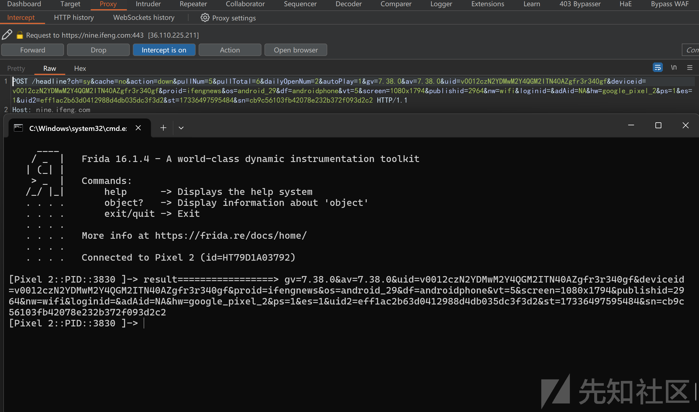

下面来分析st,sn的生成

可以看到st=后面连接了str, 而str就是通过时间戳和随机数求和生成的。


接着看看sn,可以看到给sn添加值的时候调用了a方法，传入了str和一个布尔类型，点击跳转到a函数查看函数定义。this.f2266a是参数gv后的也就是版本号7.38.0

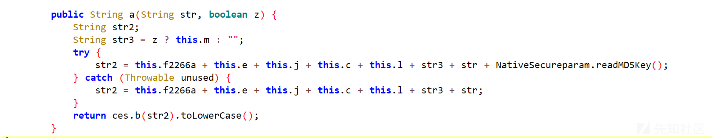

hook一下这个a函数，打印一下z,this.e,this.j,this.c和this.l这几个变量属性。  
代码如下：

```
function hook_a2() {
    Java.perform(function () {
        var BmzClass = Java.use('bmz$a'); // 确保这里使用了正确的类名和包名
        BmzClass.a.overload('java.lang.String', 'boolean').implementation = function (str, z) {
            // 打印字段值
            console.log("z====> " + z);
            console.log("this.e====> " + this.e);
            console.log("this.j====> " + this.j);
            console.log("this.c====> " + this.c);
            console.log("this.l====> " + this.l);
            var result = this.a(str, z);
            return result;
        };
    });
}

```

发现传入的布尔类型z是false,所以str3是"",this.e为"ifengnews" ,this.j为2964， this.c为"v0012czN2YDMwM2Y4QGM2ITN40AZgfr3r340gf" this.l为"", 猜测这些在同一台设备上大概率是不变的

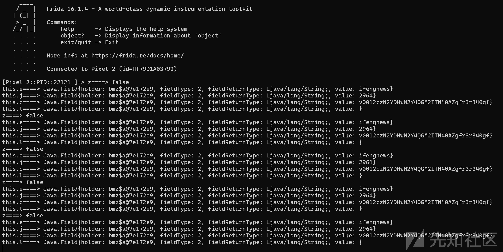

查看后面使用的readMD5Key，发现它是native层的函数

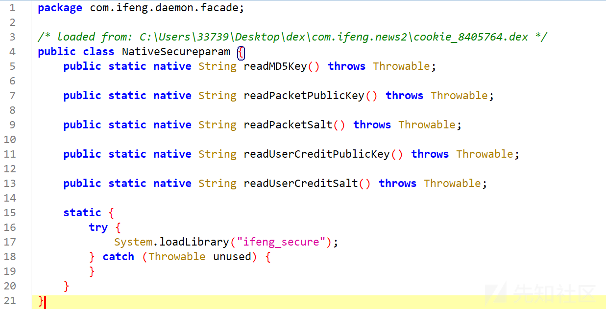

把ifeng\_secure库搞出来  
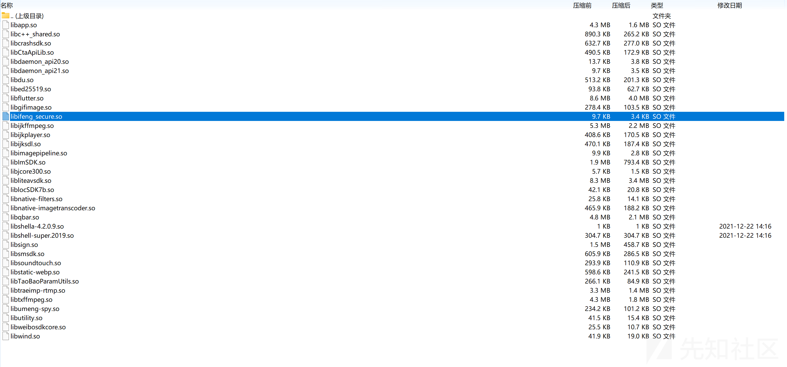

ida反编译然后搜索readMD5key

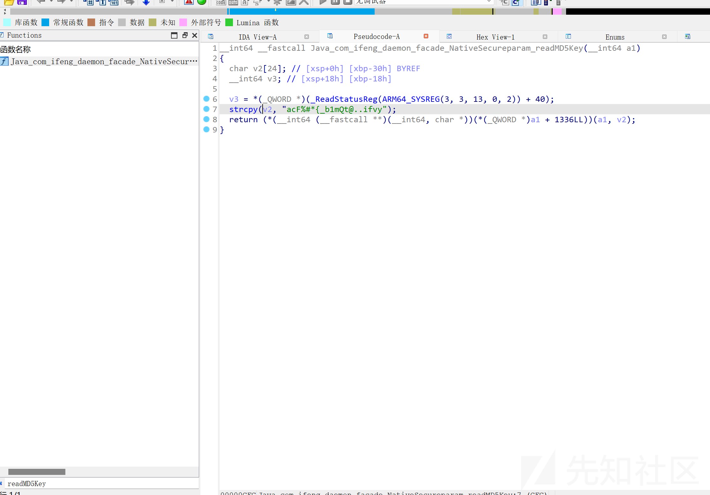  
由于readMD5key是jni函数，可以把参数类型改为JNIEnv*，方便观察。可以看出这个函数是把"acF%#*{\_b1mQt@..ifvy"作为java字符串返回。这个猜测应该是

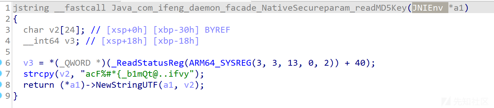

最后我们跳转到ces.b，这个函数就是标准的md5

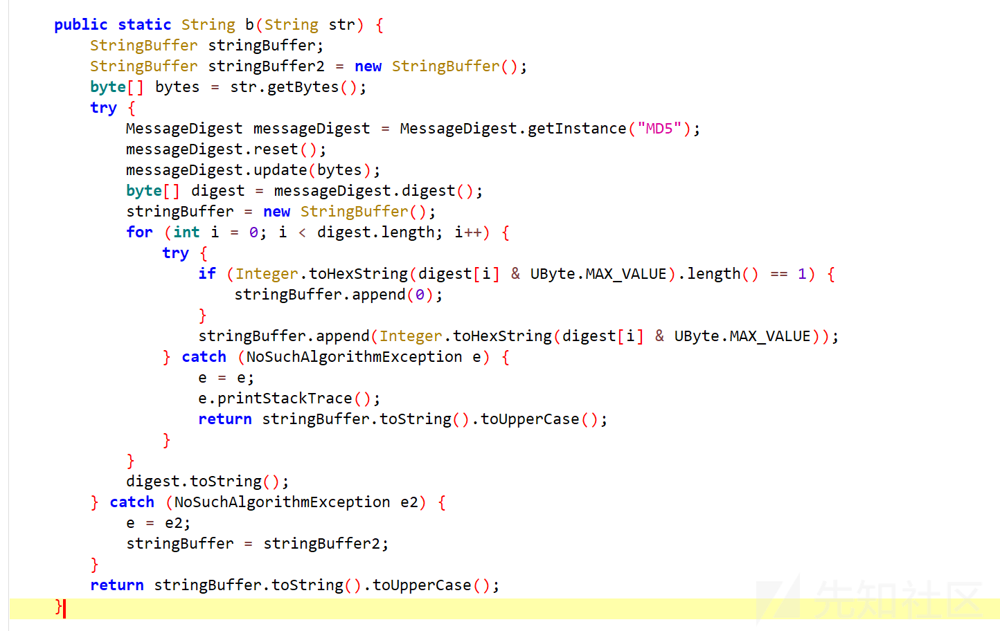  
这样，st和sn的生成过程就已经弄清楚了

最后来总结一下：  
st是通过时间戳和随机数进行拼接生成的  
sn是先将this.f2266a this.e, this.l, this.j, this.c, sn, str3 和MD5key进行拼接，然后求md5值而成的
